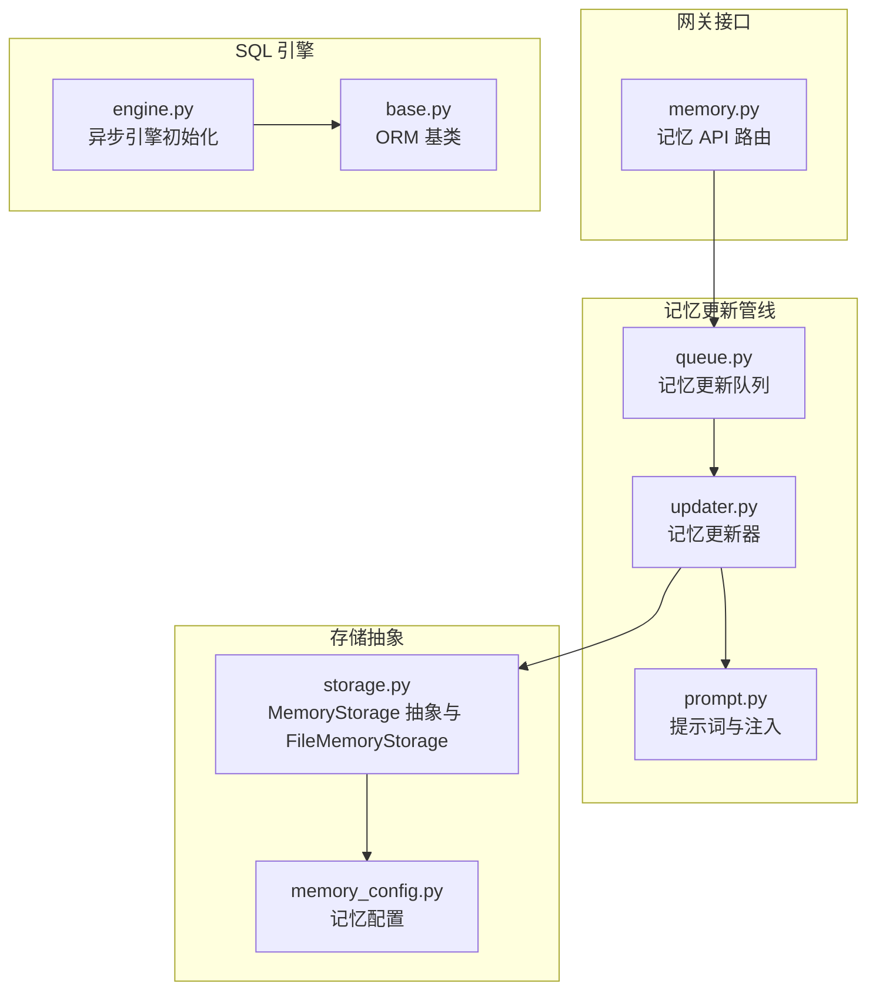
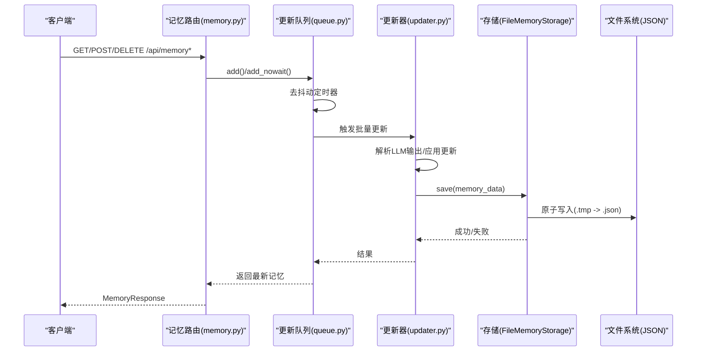
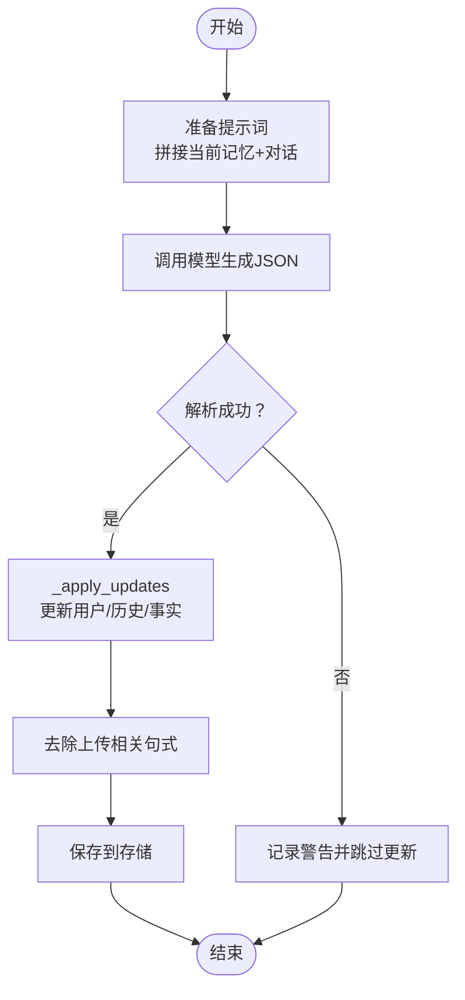
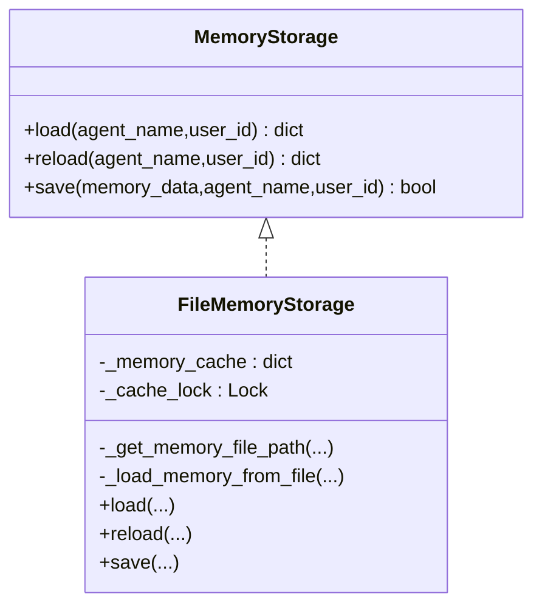
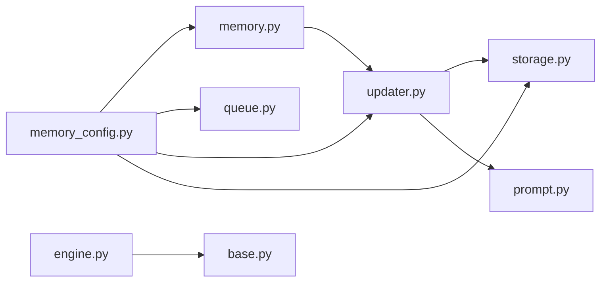

# 记忆存储

<cite>
**本文引用的文件**
- [memory.py（网关路由）](file://backend/app/gateway/routers/memory.py)
- [storage.py（记忆存储）](file://backend/packages/harness/deerflow/agents/memory/storage.py)
- [updater.py（记忆更新器）](file://backend/packages/harness/deerflow/agents/memory/updater.py)
- [queue.py（记忆更新队列）](file://backend/packages/harness/deerflow/agents/memory/queue.py)
- [memory_config.py（记忆配置）](file://backend/packages/harness/deerflow/config/memory_config.py)
- [prompt.py（提示词与注入）](file://backend/packages/harness/deerflow/agents/memory/prompt.py)
- [base.py（SQLAlchemy 基类）](file://backend/packages/harness/deerflow/persistence/base.py)
- [engine.py（异步引擎）](file://backend/packages/harness/deerflow/persistence/engine.py)
- [serialization.py（序列化工具）](file://backend/packages/harness/deerflow/runtime/serialization.py)
</cite>

## 目录
1. [简介](#简介)
2. [项目结构](#项目结构)
3. [核心组件](#核心组件)
4. [架构总览](#架构总览)
5. [详细组件分析](#详细组件分析)
6. [依赖关系分析](#依赖关系分析)
7. [性能考量](#性能考量)
8. [故障排查指南](#故障排查指南)
9. [结论](#结论)
10. [附录：配置与调优](#附录配置与调优)

## 简介
本文件系统性阐述 deer-flow 的“记忆存储”体系，覆盖以下方面：
- 记忆数据的持久化机制与存储引擎选择
- 数据结构设计与序列化、压缩策略
- 内存缓存层实现、LRU 淘汰与缓存一致性
- SQLite 引擎初始化、WAL/同步模式、事务处理与并发模型
- 记忆更新流程、去抖动队列、LLM 驱动的事实抽取与注入
- 存储配置参数、性能调优与容量规划
- 数据完整性检查、备份恢复与迁移实践

## 项目结构
记忆存储相关代码主要分布在后端包 deerflow 中，围绕“网关路由 → 更新器 → 队列 → 存储提供者”的链路组织；同时提供通用的 SQLAlchemy 异步引擎与 ORM 基类以支撑可选的 SQL 后端。

**图表来源**
- [memory.py（网关路由）:1-357](file://backend/app/gateway/routers/memory.py#L1-L357)
- [queue.py（记忆更新队列）:1-288](file://backend/packages/harness/deerflow/agents/memory/queue.py#L1-L288)
- [updater.py（记忆更新器）:1-710](file://backend/packages/harness/deerflow/agents/memory/updater.py#L1-L710)
- [prompt.py（提示词与注入）:1-414](file://backend/packages/harness/deerflow/agents/memory/prompt.py#L1-L414)
- [storage.py（记忆存储）:1-232](file://backend/packages/harness/deerflow/agents/memory/storage.py#L1-L232)
- [memory_config.py（记忆配置）:1-84](file://backend/packages/harness/deerflow/config/memory_config.py#L1-L84)
- [engine.py（异步引擎）:1-200](file://backend/packages/harness/deerflow/persistence/engine.py#L1-L200)
- [base.py（SQLAlchemy 基类）:1-41](file://backend/packages/harness/deerflow/persistence/base.py#L1-L41)

**章节来源**
- [memory.py（网关路由）:1-357](file://backend/app/gateway/routers/memory.py#L1-L357)
- [storage.py（记忆存储）:1-232](file://backend/packages/harness/deerflow/agents/memory/storage.py#L1-L232)
- [updater.py（记忆更新器）:1-710](file://backend/packages/harness/deerflow/agents/memory/updater.py#L1-L710)
- [queue.py（记忆更新队列）:1-288](file://backend/packages/harness/deerflow/agents/memory/queue.py#L1-L288)
- [memory_config.py（记忆配置）:1-84](file://backend/packages/harness/deerflow/config/memory_config.py#L1-L84)
- [prompt.py（提示词与注入）:1-414](file://backend/packages/harness/deerflow/agents/memory/prompt.py#L1-L414)
- [engine.py（异步引擎）:1-200](file://backend/packages/harness/deerflow/persistence/engine.py#L1-L200)
- [base.py（SQLAlchemy 基类）:1-41](file://backend/packages/harness/deerflow/persistence/base.py#L1-L41)

## 核心组件
- 记忆 API 路由：提供获取、导入/导出、清空、增删改查事实等 REST 接口，统一返回标准化响应模型。
- 记忆更新器：基于 LLM 对话上下文进行结构化记忆更新，解析 JSON 输出，应用到用户/历史/事实集合。
- 记忆更新队列：带去抖动窗口的线程安全队列，合并同一目标的多次更新请求，降低写放大。
- 存储提供者：抽象 MemoryStorage 接口，默认 FileMemoryStorage 使用 JSON 文件持久化，内置内存缓存与原子写入。
- 提示词与注入：定义记忆更新与注入系统提示的模板，提供令牌计数与截断策略。
- SQL 引擎：异步 SQLAlchemy 初始化、自动建表、WAL/同步模式、连接池与自动建库。

**章节来源**
- [memory.py（网关路由）:110-357](file://backend/app/gateway/routers/memory.py#L110-L357)
- [updater.py（记忆更新器）:380-710](file://backend/packages/harness/deerflow/agents/memory/updater.py#L380-L710)
- [queue.py（记忆更新队列）:28-288](file://backend/packages/harness/deerflow/agents/memory/queue.py#L28-L288)
- [storage.py（记忆存储）:43-232](file://backend/packages/harness/deerflow/agents/memory/storage.py#L43-L232)
- [prompt.py（提示词与注入）:19-414](file://backend/packages/harness/deerflow/agents/memory/prompt.py#L19-L414)
- [engine.py（异步引擎）:57-200](file://backend/packages/harness/deerflow/persistence/engine.py#L57-L200)

## 架构总览
记忆存储采用“文件持久化 + 内存缓存 + LLM 驱动更新 + 去抖队列”的混合架构。默认使用 JSON 文件作为全局或按用户/代理隔离的存储介质；在需要强一致与复杂查询时，可通过配置切换到 SQL 引擎（SQLite/PostgreSQL），并使用 ORM 基类与会话工厂。

**图表来源**
- [memory.py（网关路由）:110-357](file://backend/app/gateway/routers/memory.py#L110-L357)
- [queue.py（记忆更新队列）:166-227](file://backend/packages/harness/deerflow/agents/memory/queue.py#L166-L227)
- [updater.py（记忆更新器）:467-598](file://backend/packages/harness/deerflow/agents/memory/updater.py#L467-L598)
- [storage.py（记忆存储）:160-189](file://backend/packages/harness/deerflow/agents/memory/storage.py#L160-L189)

## 详细组件分析

### 组件一：记忆 API 路由（memory.py）
- 功能要点
  - 获取当前记忆、重载、清空、创建/删除/更新事实、导入/导出、读取配置与状态。
  - 统一响应模型 MemoryResponse/MemoryConfigResponse/MemoryStatusResponse。
  - 参数校验与错误映射（如置信度范围、内容非空）。
- 关键行为
  - 调用 updater 层的 get_memory_data、create_memory_fact、delete_memory_fact、update_memory_fact、import_memory_data、reload_memory_data。
  - 通过 get_effective_user_id() 将操作作用于当前用户上下文。

**章节来源**
- [memory.py（网关路由）:110-357](file://backend/app/gateway/routers/memory.py#L110-L357)

### 组件二：记忆更新器（updater.py）
- 功能要点
  - 支持同步/异步两种调用路径，避免跨事件循环的连接复用问题。
  - 从对话消息构建更新提示，调用 LLM，解析 JSON 并应用到当前记忆。
  - 应用规则：去上传句、去重复、按置信度阈值与上限裁剪事实列表。
- 关键流程
  - _prepare_update_prompt → _parse_memory_update_response → _apply_updates → save。
  - _do_update_memory_sync/_do_update_memory_async 分别走同步/线程池路径。
- 安全与健壮性
  - 对 LLM 输出做严格 JSON 解析与字段校验，异常记录日志但不中断流程。

**图表来源**
- [updater.py（记忆更新器）:422-466](file://backend/packages/harness/deerflow/agents/memory/updater.py#L422-L466)

**章节来源**
- [updater.py（记忆更新器）:380-710](file://backend/packages/harness/deerflow/agents/memory/updater.py#L380-L710)

### 组件三：记忆更新队列（queue.py）
- 功能要点
  - 去抖动窗口内合并相同目标（thread_id/user_id/agent_name）的更新请求。
  - 线程安全：锁保护队列与定时器；Timer 守护后台处理。
  - 批量处理：按顺序调用 MemoryUpdater.update_memory，必要时小休眠避静。
- 关键属性
  - debounce_seconds 来自配置；pending_count/is_processing 反映状态。

**章节来源**
- [queue.py（记忆更新队列）:28-288](file://backend/packages/harness/deerflow/agents/memory/queue.py#L28-L288)

### 组件四：存储提供者（storage.py）
- 抽象与实现
  - MemoryStorage 抽象定义 load/reload/save。
  - FileMemoryStorage 默认实现：按用户/代理隔离路径，支持绝对/相对路径解析。
- 缓存与一致性
  - 内存缓存字典 + 线程锁；缓存项包含 (memory_data, file_mtime)，按 mtime 判断失效。
  - 原子写入：先写临时文件再替换，失败不污染缓存。
- 错误处理
  - 文件不存在或损坏时回退到空记忆结构；IO 异常记录错误并返回失败。

**图表来源**
- [storage.py（记忆存储）:43-232](file://backend/packages/harness/deerflow/agents/memory/storage.py#L43-L232)

**章节来源**
- [storage.py（记忆存储）:62-232](file://backend/packages/harness/deerflow/agents/memory/storage.py#L62-L232)

### 组件五：提示词与注入（prompt.py）
- 提示词模板
  - MEMORY_UPDATE_PROMPT：指导 LLM 结构化输出用户上下文、历史与新事实。
  - FACT_EXTRACTION_PROMPT：单条消息的事实抽取。
- 注入与截断
  - format_memory_for_injection：按令牌预算排序并截断，优先保留高置信度事实。
  - format_conversation_for_update：清洗人类消息中的上传标记，限制长度。
- 令牌计数
  - _count_tokens：优先使用 tiktoken，不可用时退化为字符估算。

**章节来源**
- [prompt.py（提示词与注入）:19-414](file://backend/packages/harness/deerflow/agents/memory/prompt.py#L19-L414)

### 组件六：SQL 引擎与 ORM 基类（engine.py、base.py）
- 引擎初始化
  - 支持 backend=memory/sqlite/postgres；sqlite 自动启用 WAL 与 foreign_keys；postgres 使用连接池与 pre_ping。
  - 自动建库（postgres）与自动建表（dev）。
- ORM 基类
  - Base.to_dict：基于 SQLAlchemy inspect 自动生成序列化字典；__repr__ 显示所有列值。

**章节来源**
- [engine.py（异步引擎）:57-200](file://backend/packages/harness/deerflow/persistence/engine.py#L57-L200)
- [base.py（SQLAlchemy 基类）:16-41](file://backend/packages/harness/deerflow/persistence/base.py#L16-L41)

## 依赖关系分析
- 路由依赖更新器；更新器依赖存储提供者与提示词模块。
- 配置模块贯穿：路由、更新器、队列、存储均读取 MemoryConfig。
- SQL 引擎独立于记忆文件存储，用于需要关系型能力的场景。

**图表来源**
- [memory_config.py（记忆配置）:69-84](file://backend/packages/harness/deerflow/config/memory_config.py#L69-L84)
- [memory.py（网关路由）:1-357](file://backend/app/gateway/routers/memory.py#L1-L357)
- [queue.py（记忆更新队列）:1-288](file://backend/packages/harness/deerflow/agents/memory/queue.py#L1-L288)
- [updater.py（记忆更新器）:1-710](file://backend/packages/harness/deerflow/agents/memory/updater.py#L1-L710)
- [storage.py（记忆存储）:1-232](file://backend/packages/harness/deerflow/agents/memory/storage.py#L1-L232)
- [prompt.py（提示词与注入）:1-414](file://backend/packages/harness/deerflow/agents/memory/prompt.py#L1-L414)
- [engine.py（异步引擎）:1-200](file://backend/packages/harness/deerflow/persistence/engine.py#L1-L200)
- [base.py（SQLAlchemy 基类）:1-41](file://backend/packages/harness/deerflow/persistence/base.py#L1-L41)

**章节来源**
- [memory_config.py（记忆配置）:69-84](file://backend/packages/harness/deerflow/config/memory_config.py#L69-L84)
- [memory.py（网关路由）:1-357](file://backend/app/gateway/routers/memory.py#L1-L357)
- [updater.py（记忆更新器）:1-710](file://backend/packages/harness/deerflow/agents/memory/updater.py#L1-L710)
- [storage.py（记忆存储）:1-232](file://backend/packages/harness/deerflow/agents/memory/storage.py#L1-L232)
- [engine.py（异步引擎）:1-200](file://backend/packages/harness/deerflow/persistence/engine.py#L1-L200)

## 性能考量
- 去抖动与批处理
  - 通过 MemoryUpdateQueue 在 debounce_seconds 内合并多次更新，显著降低写放大与 LLM 调用次数。
- 原子写入与缓存一致性
  - FileMemoryStorage 先写临时文件再替换，避免部分写导致的数据损坏；缓存以 mtime 为失效依据，确保多进程/多实例间的一致性。
- 令牌预算与截断
  - format_memory_for_injection 使用 tiktoken 精确计数，按预算从高置信度到低置信度逐步填充，超出则按字符比例截断，避免注入超长。
- 异步引擎与连接池
  - PostgreSQL 使用 pool_size 与 pool_pre_ping；SQLite 启用 WAL/NORMAL 同步，提升并发读写吞吐。
- 线程池与事件循环隔离
  - MemoryUpdater 在异步上下文中通过线程池执行同步模型调用，避免跨循环连接复用问题。

[本节为通用性能建议，无需特定文件引用]

## 故障排查指南
- 记忆文件无法加载/损坏
  - 现象：返回空记忆或警告日志。
  - 处理：检查文件权限、磁盘空间；确认 JSON 格式；必要时手动清理或回滚。
  - 参考
    - [storage.py（记忆存储）:104-118](file://backend/packages/harness/deerflow/agents/memory/storage.py#L104-L118)
- LLM 输出解析失败
  - 现象：日志出现“Failed to parse LLM response for memory update”。
  - 处理：检查提示词模板是否被外部修改；确认模型输出符合 JSON 结构；必要时放宽容错或调整模型参数。
  - 参考
    - [updater.py（记忆更新器）:532-537](file://backend/packages/harness/deerflow/agents/memory/updater.py#L532-L537)
- 写入失败
  - 现象：返回 False 或 OSError。
  - 处理：检查磁盘空间、父目录权限、路径是否存在；确认临时文件写入成功后再替换。
  - 参考
    - [storage.py（记忆存储）:165-189](file://backend/packages/harness/deerflow/agents/memory/storage.py#L165-L189)
- SQL 初始化失败
  - 现象：PostgreSQL 数据库不存在或连接异常。
  - 处理：确认数据库 URL 正确；允许自动建库；检查网络与认证；必要时手动创建数据库。
  - 参考
    - [engine.py（异步引擎）:150-163](file://backend/packages/harness/deerflow/persistence/engine.py#L150-L163)

**章节来源**
- [storage.py（记忆存储）:104-118](file://backend/packages/harness/deerflow/agents/memory/storage.py#L104-L118)
- [updater.py（记忆更新器）:532-537](file://backend/packages/harness/deerflow/agents/memory/updater.py#L532-L537)
- [engine.py（异步引擎）:150-163](file://backend/packages/harness/deerflow/persistence/engine.py#L150-L163)

## 结论
该记忆存储系统以“文件 + 缓存 + 队列 + LLM 驱动更新”为核心，兼顾易部署与可扩展性。默认文件存储满足大多数场景，SQL 后端可按需引入以获得更强的一致性与查询能力。通过去抖动、原子写入、令牌预算与连接池等手段，系统在可用性与性能之间取得平衡。

[本节为总结，无需特定文件引用]

## 附录：配置与调优

### 存储配置参数（来自 MemoryConfig）
- enabled：是否启用记忆机制
- storage_path：存储路径（空表示按用户/代理隔离；绝对路径表示共享）
- storage_class：存储提供者类路径（默认 FileMemoryStorage）
- debounce_seconds：去抖动秒数
- model_name：用于记忆更新的模型名称
- max_facts：最大事实数量
- fact_confidence_threshold：事实最低置信度阈值
- injection_enabled：是否注入记忆到系统提示
- max_injection_tokens：记忆注入最大令牌数

**章节来源**
- [memory_config.py（记忆配置）:6-62](file://backend/packages/harness/deerflow/config/memory_config.py#L6-L62)

### SQLite 引擎初始化与事务处理
- 初始化
  - backend=sqlite：自动创建目录，启用 WAL、foreign_keys，设置 synchronous=NORMAL。
  - backend=postgres：连接池、pre_ping、自动建库与建表。
- 事务与并发
  - WAL 模式支持并发读写；synchronous=NORMAL 在安全性与性能间折中。
  - ORM 使用 async_sessionmaker，expire_on_commit=False 降低对象过期带来的额外查询。
- 备份与恢复
  - SQLite：直接复制 .db 文件；生产环境建议停机备份或使用 WAL 归档。
  - PostgreSQL：使用标准备份工具（如 pg_dump/pg_restore）。

**章节来源**
- [engine.py（异步引擎）:95-135](file://backend/packages/harness/deerflow/persistence/engine.py#L95-L135)
- [base.py（SQLAlchemy 基类）:16-41](file://backend/packages/harness/deerflow/persistence/base.py#L16-L41)

### 数据序列化与兼容性
- 记忆 JSON：使用 ensure_ascii=False 以支持中文等字符。
- LangChain/LangGraph 对象序列化：统一通过 serialize_lc_object 递归转换，兼容 Pydantic v1/v2。
- 导入/导出：API 路由直接使用 MemoryResponse/MemoryConfigResponse 进行序列化/反序列化。

**章节来源**
- [engine.py（异步引擎）:19-21](file://backend/packages/harness/deerflow/persistence/engine.py#L19-L21)
- [serialization.py（序列化工具）:16-79](file://backend/packages/harness/deerflow/runtime/serialization.py#L16-L79)
- [memory.py（网关路由）:262-289](file://backend/app/gateway/routers/memory.py#L262-L289)

### 备份与迁移
- 备份
  - 文件存储：直接复制 memory.json（或按用户/代理隔离的文件）。
  - SQL 存储：使用数据库备份工具导出。
- 迁移
  - 文件到 SQL：编写脚本读取 JSON，按模型结构映射并批量插入。
  - 路径迁移：当 storage_path 从相对路径迁移到绝对路径时，注意旧数据位置与权限。
- 回滚
  - 优先使用备份文件；若使用 SQL，确保有时间点恢复能力。

[本节为通用实践建议，无需特定文件引用]