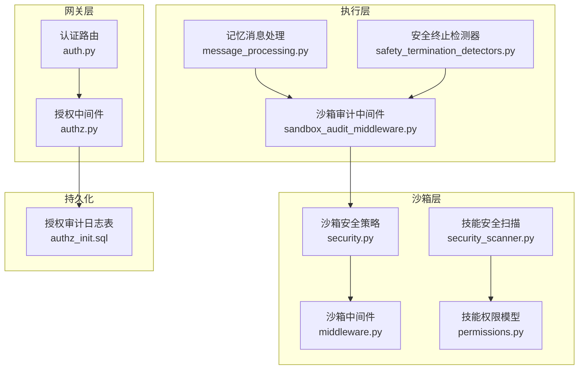
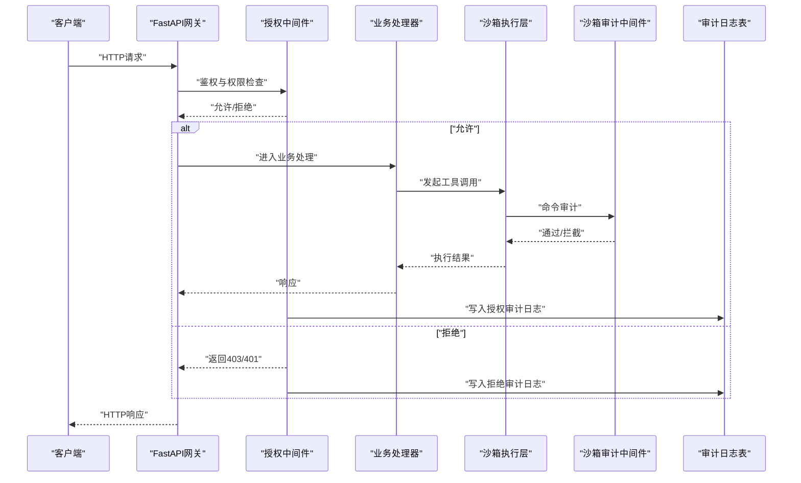
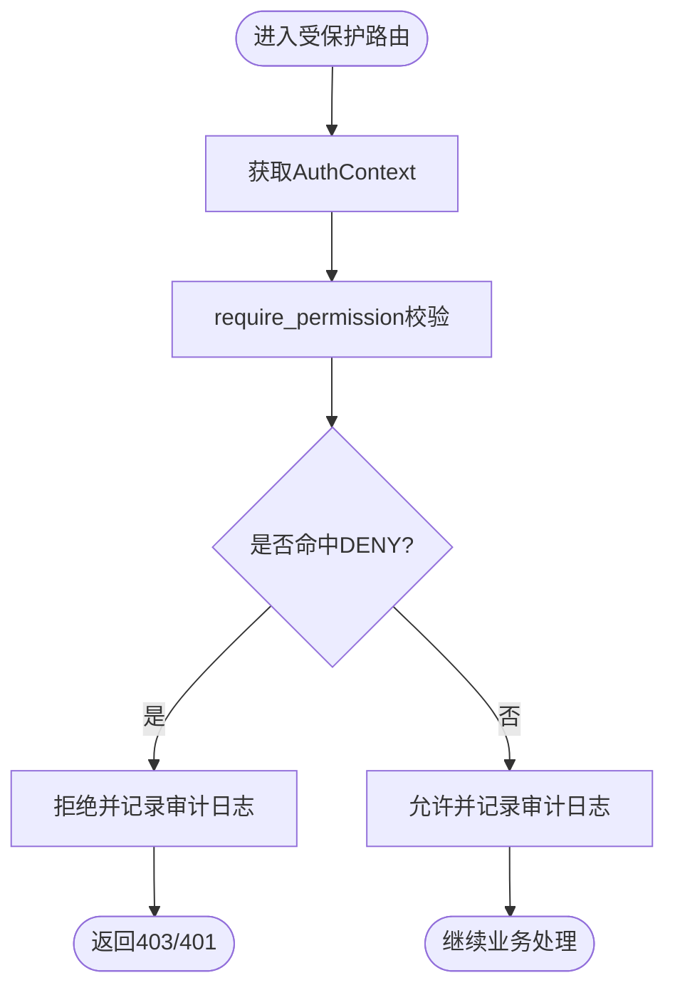
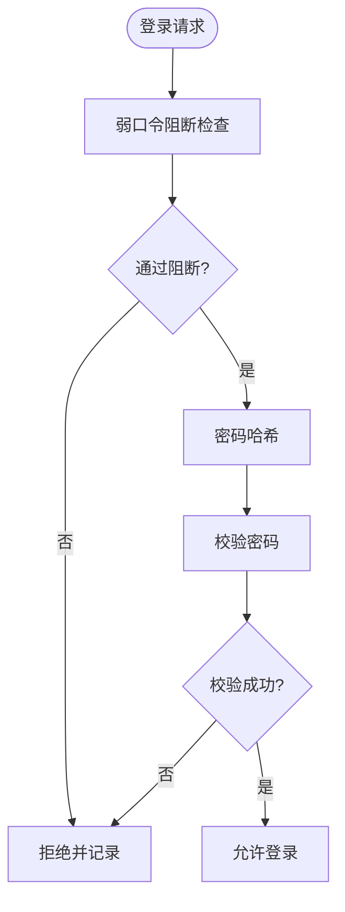
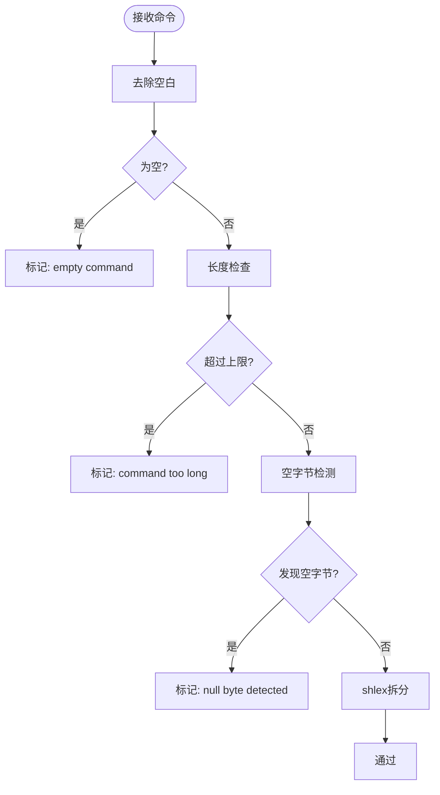
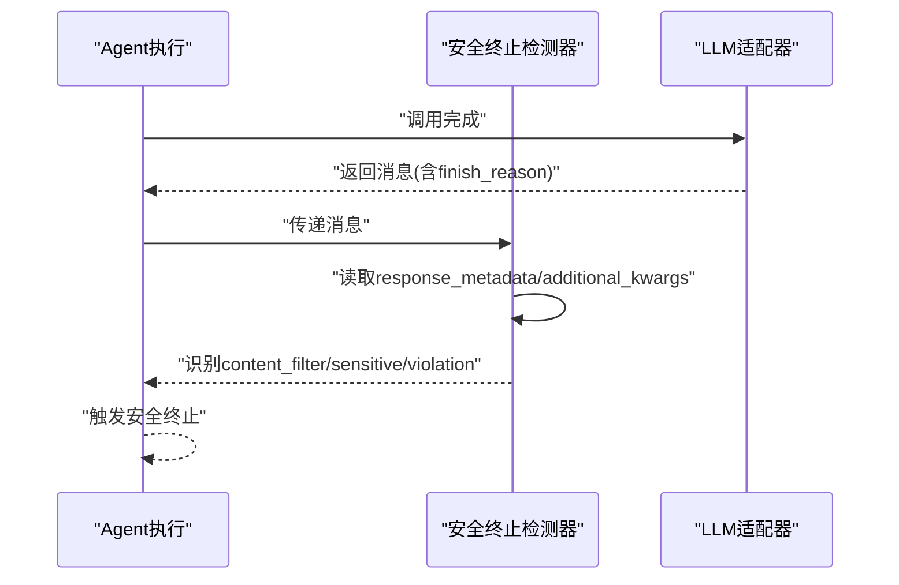
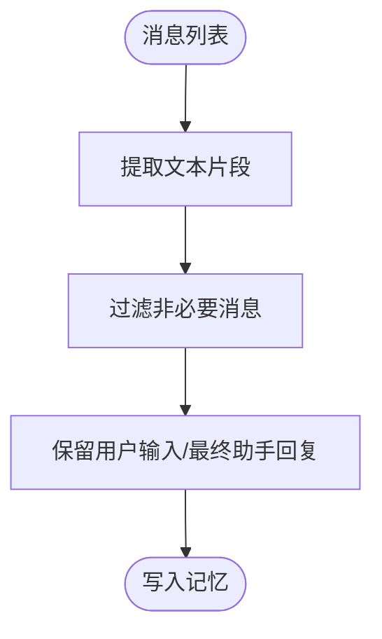
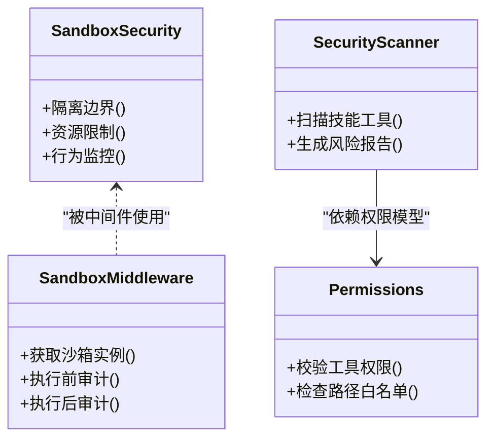
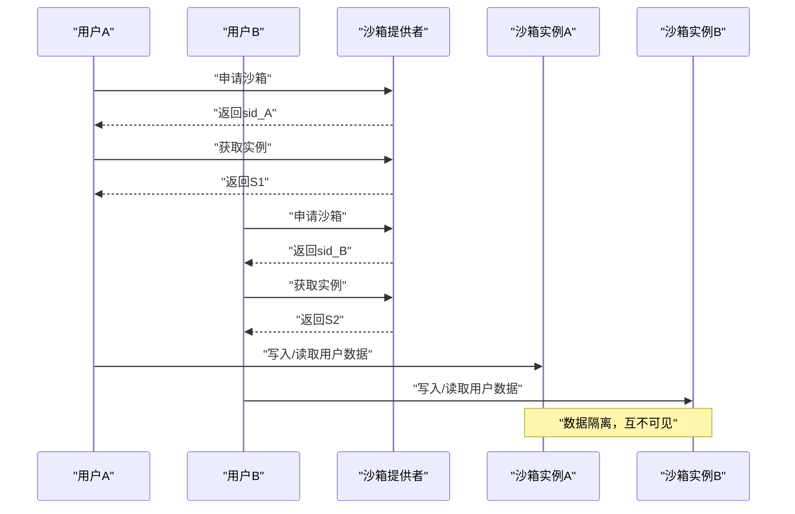
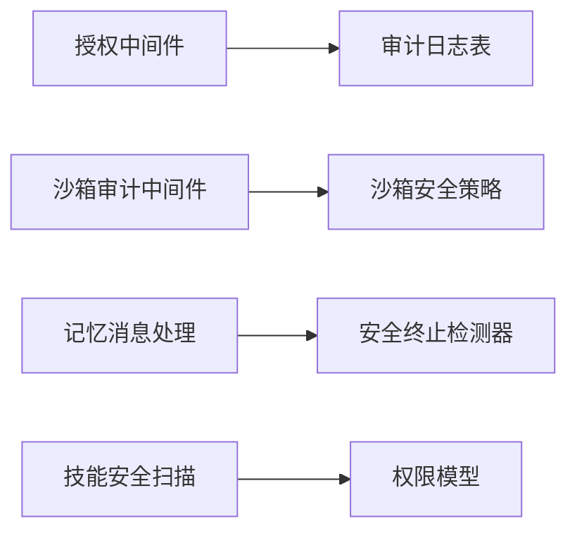

# 记忆安全

<cite>
**本文引用的文件**
- [权限控制.md](file://docs/权限控制.md)
- [authz_init.sql](file://docs/sql/authz_init.sql)
- [authz.py](file://backend/app/gateway/authz.py)
- [auth.py](file://backend/app/gateway/routers/auth.py)
- [sandbox_audit_middleware.py](file://backend/packages/harness/deerflow/agents/middlewares/sandbox_audit_middleware.py)
- [safety_termination_detectors.py](file://backend/packages/harness/deerflow/agents/middlewares/safety_termination_detectors.py)
- [message_processing.py](file://backend/packages/harness/deerflow/agents/memory/message_processing.py)
- [security.py](file://backend/packages/harness/deerflow/sandbox/security.py)
- [middleware.py](file://backend/packages/harness/deerflow/sandbox/middleware.py)
- [security_scanner.py](file://backend/packages/harness/deerflow/skills/security_scanner.py)
- [permissions.py](file://backend/packages/harness/deerflow/skills/permissions.py)
- [test_sandbox_audit_middleware.py](file://backend/tests/test_sandbox_audit_middleware.py)
- [test_auth.py](file://backend/tests/test_auth.py)
- [test_memory_storage_user_isolation.py](file://backend/tests/test_memory_storage_user_isolation.py)
- [test_memory_thread_meta_isolation.py](file://backend/tests/test_memory_thread_meta_isolation.py)
- [test_memory_queue_user_isolation.py](file://backend/tests/test_memory_queue_user_isolation.py)
- [test_local_sandbox_virtual_path_contract.py](file://backend/tests/test_local_sandbox_virtual_path_contract.py)
- [SANDBOX_MEMORY_PROFILING.md](file://backend/docs/SANDBOX_MEMORY_PROFILING.md)
- [人机协作置信度分层.md](file://人机协作置信度分层.md)
</cite>

## 目录
1. [简介](#简介)
2. [项目结构](#项目结构)
3. [核心组件](#核心组件)
4. [架构总览](#架构总览)
5. [详细组件分析](#详细组件分析)
6. [依赖分析](#依赖分析)
7. [性能考虑](#性能考虑)
8. [故障排除指南](#故障排除指南)
9. [结论](#结论)
10. [附录](#附录)

## 简介
本文件聚焦于deer-flow的记忆安全保护体系，系统阐述数据访问控制、隐私保护与安全审计机制；详述用户隔离策略、权限验证与数据加密实现；介绍敏感信息检测、内容过滤与访问日志记录；解释沙箱环境下的数据隔离、资源限制与行为监控；提供安全配置参数、合规性要求与风险评估方法；包含安全事件响应流程、漏洞修复指南与安全测试用例；展示安全最佳实践与常见威胁防护策略。

## 项目结构
围绕记忆安全的关键模块分布如下：
- 授权与审计：基于RBAC+ABAC的授权中间件、审计日志表与初始化脚本
- 认证与密码：JWT签发与校验、密码哈希与弱口令阻断
- 沙箱安全：命令审计中间件、沙箱安全策略与工具安全扫描
- 记忆过滤：消息文本提取与过滤，仅保留必要内容进入记忆
- 隔离测试：用户隔离、线程隔离与虚拟路径契约测试

**图表来源**
- [authz.py:1-54](file://backend/app/gateway/authz.py#L1-L54)
- [auth.py:33-84](file://backend/app/gateway/routers/auth.py#L33-L84)
- [sandbox_audit_middleware.py:1-22](file://backend/packages/harness/deerflow/agents/middlewares/sandbox_audit_middleware.py#L1-L22)
- [message_processing.py:33-61](file://backend/packages/harness/deerflow/agents/memory/message_processing.py#L33-L61)
- [safety_termination_detectors.py:61-94](file://backend/packages/harness/deerflow/agents/middlewares/safety_termination_detectors.py#L61-L94)
- [security.py](file://backend/packages/harness/deerflow/sandbox/security.py)
- [middleware.py](file://backend/packages/harness/deerflow/sandbox/middleware.py)
- [security_scanner.py](file://backend/packages/harness/deerflow/skills/security_scanner.py)
- [permissions.py](file://backend/packages/harness/deerflow/skills/permissions.py)
- [authz_init.sql:97-128](file://docs/sql/authz_init.sql#L97-L128)

**章节来源**
- [authz.py:1-54](file://backend/app/gateway/authz.py#L1-L54)
- [authz_init.sql:97-128](file://docs/sql/authz_init.sql#L97-L128)

## 核心组件
- 授权与审计中间件：提供装饰器式权限校验、资源动作与拥有者检查，并生成可追溯的审计日志
- 认证与密码安全：内置弱口令阻断列表、密码哈希与校验流程
- 沙箱审计中间件：对bash命令进行输入校验、长度限制、空字节检测与命令拆分
- 安全终止检测器：识别LLM返回的content_filter等安全信号，触发安全终止
- 记忆消息处理：提取纯文本、过滤非必要消息，降低敏感信息写入记忆的风险
- 沙箱安全策略与中间件：定义沙箱隔离边界、资源限制与行为监控
- 技能安全扫描与权限模型：对技能工具进行安全扫描与权限约束
- 隔离测试：覆盖用户隔离、线程隔离与虚拟路径契约，确保数据不泄漏

**章节来源**
- [authz.py:47-54](file://backend/app/gateway/authz.py#L47-L54)
- [auth.py:37-80](file://backend/app/gateway/routers/auth.py#L37-L80)
- [sandbox_audit_middleware.py:1-22](file://backend/packages/harness/deerflow/agents/middlewares/sandbox_audit_middleware.py#L1-L22)
- [safety_termination_detectors.py:82-94](file://backend/packages/harness/deerflow/agents/middlewares/safety_termination_detectors.py#L82-L94)
- [message_processing.py:40-61](file://backend/packages/harness/deerflow/agents/memory/message_processing.py#L40-L61)
- [security.py](file://backend/packages/harness/deerflow/sandbox/security.py)
- [middleware.py](file://backend/packages/harness/deerflow/sandbox/middleware.py)
- [security_scanner.py](file://backend/packages/harness/deerflow/skills/security_scanner.py)
- [permissions.py](file://backend/packages/harness/deerflow/skills/permissions.py)

## 架构总览
下图展示了从请求进入网关到执行层与沙箱层的安全控制流，以及审计日志的产生与存储。

**图表来源**
- [authz.py:1-54](file://backend/app/gateway/authz.py#L1-L54)
- [sandbox_audit_middleware.py:1-22](file://backend/packages/harness/deerflow/agents/middlewares/sandbox_audit_middleware.py#L1-L22)
- [authz_init.sql:97-128](file://docs/sql/authz_init.sql#L97-L128)

## 详细组件分析

### 授权与审计中间件
- 权限常量与装饰器：提供threads、runs等资源的动作权限常量，支持owner_check与自定义filter_key
- 冲突策略：先匹配DENY（按priority升序），再匹配ALLOW，无命中时默认拒绝
- 审计日志：记录request_id、user_id、dept_code、roles、tool_name、action、resource_key、decision、reason等字段

**图表来源**
- [authz.py:47-54](file://backend/app/gateway/authz.py#L47-L54)
- [authz_init.sql:97-128](file://docs/sql/authz_init.sql#L97-L128)

**章节来源**
- [authz.py:1-54](file://backend/app/gateway/authz.py#L1-L54)
- [authz_init.sql:97-128](file://docs/sql/authz_init.sql#L97-L128)

### 认证与密码安全
- 弱口令阻断：内置常见弱口令集合，请求中进行快速阻断
- 密码哈希：采用专用前缀的哈希格式，支持校验与重哈希判断

**图表来源**
- [auth.py:37-80](file://backend/app/gateway/routers/auth.py#L37-L80)

**章节来源**
- [auth.py:33-84](file://backend/app/gateway/routers/auth.py#L33-L84)
- [test_auth.py:26-33](file://backend/tests/test_auth.py#L26-L33)

### 沙箱审计中间件
- 输入校验：空字符串、空白字符、超长命令、空字节检测
- 命令拆分：使用shlex解析，异常时回退为整条命令
- 行为拦截：对高风险命令或违规输入直接拒绝

**图表来源**
- [sandbox_audit_middleware.py:1-22](file://backend/packages/harness/deerflow/agents/middlewares/sandbox_audit_middleware.py#L1-L22)
- [test_sandbox_audit_middleware.py:265-290](file://backend/tests/test_sandbox_audit_middleware.py#L265-L290)

**章节来源**
- [sandbox_audit_middleware.py:1-22](file://backend/packages/harness/deerflow/agents/middlewares/sandbox_audit_middleware.py#L1-L22)
- [test_sandbox_audit_middleware.py:251-290](file://backend/tests/test_sandbox_audit_middleware.py#L251-L290)

### 安全终止检测器
- 适配多提供商content_filter等finish_reason信号
- 支持扩展自定义finish_reasons集合以覆盖特定适配器

**图表来源**
- [safety_termination_detectors.py:61-94](file://backend/packages/harness/deerflow/agents/middlewares/safety_termination_detectors.py#L61-L94)

**章节来源**
- [safety_termination_detectors.py:82-94](file://backend/packages/harness/deerflow/agents/middlewares/safety_termination_detectors.py#L82-L94)

### 记忆消息处理
- 文本提取：从消息content中抽取纯文本片段
- 过滤策略：仅保留用户输入与最终助手回复，跳过中间AI输出，降低敏感信息写入记忆

**图表来源**
- [message_processing.py:40-61](file://backend/packages/harness/deerflow/agents/memory/message_processing.py#L40-L61)

**章节来源**
- [message_processing.py:33-61](file://backend/packages/harness/deerflow/agents/memory/message_processing.py#L33-L61)

### 沙箱安全策略与中间件
- 沙箱安全策略：定义隔离边界、资源限制与行为监控
- 沙箱中间件：与沙箱提供者集成，执行隔离与审计
- 技能安全扫描与权限模型：对技能工具进行安全扫描与权限约束

**图表来源**
- [security.py](file://backend/packages/harness/deerflow/sandbox/security.py)
- [middleware.py](file://backend/packages/harness/deerflow/sandbox/middleware.py)
- [security_scanner.py](file://backend/packages/harness/deerflow/skills/security_scanner.py)
- [permissions.py](file://backend/packages/harness/deerflow/skills/permissions.py)

**章节来源**
- [security.py](file://backend/packages/harness/deerflow/sandbox/security.py)
- [middleware.py](file://backend/packages/harness/deerflow/sandbox/middleware.py)
- [security_scanner.py](file://backend/packages/harness/deerflow/skills/security_scanner.py)
- [permissions.py](file://backend/packages/harness/deerflow/skills/permissions.py)

### 用户隔离与线程隔离
- 用户隔离：不同用户无法读取彼此的数据
- 线程隔离：不同线程使用独立沙箱实例，避免跨线程状态泄漏
- 虚拟路径契约：上传/工作区/输出路径在沙箱内保持语义一致性

**图表来源**
- [test_memory_storage_user_isolation.py](file://backend/tests/test_memory_storage_user_isolation.py)
- [test_memory_thread_meta_isolation.py](file://backend/tests/test_memory_thread_meta_isolation.py)
- [test_memory_queue_user_isolation.py](file://backend/tests/test_memory_queue_user_isolation.py)
- [test_local_sandbox_virtual_path_contract.py:145-167](file://backend/tests/test_local_sandbox_virtual_path_contract.py#L145-L167)

**章节来源**
- [test_memory_storage_user_isolation.py](file://backend/tests/test_memory_storage_user_isolation.py)
- [test_memory_thread_meta_isolation.py](file://backend/tests/test_memory_thread_meta_isolation.py)
- [test_memory_queue_user_isolation.py](file://backend/tests/test_memory_queue_user_isolation.py)
- [test_local_sandbox_virtual_path_contract.py:145-167](file://backend/tests/test_local_sandbox_virtual_path_contract.py#L145-L167)

## 依赖分析
- 授权中间件依赖数据库中的审计日志表schema
- 沙箱审计中间件与沙箱安全策略耦合，共同保障命令执行安全
- 记忆消息处理与安全终止检测器协同，减少敏感信息进入记忆并及时终止危险会话
- 技能安全扫描与权限模型共同约束工具调用范围

**图表来源**
- [authz.py:1-54](file://backend/app/gateway/authz.py#L1-L54)
- [authz_init.sql:97-128](file://docs/sql/authz_init.sql#L97-L128)
- [sandbox_audit_middleware.py:1-22](file://backend/packages/harness/deerflow/agents/middlewares/sandbox_audit_middleware.py#L1-L22)
- [security.py](file://backend/packages/harness/deerflow/sandbox/security.py)
- [message_processing.py:40-61](file://backend/packages/harness/deerflow/agents/memory/message_processing.py#L40-L61)
- [safety_termination_detectors.py:82-94](file://backend/packages/harness/deerflow/agents/middlewares/safety_termination_detectors.py#L82-L94)
- [security_scanner.py](file://backend/packages/harness/deerflow/skills/security_scanner.py)
- [permissions.py](file://backend/packages/harness/deerflow/skills/permissions.py)

**章节来源**
- [authz.py:1-54](file://backend/app/gateway/authz.py#L1-L54)
- [authz_init.sql:97-128](file://docs/sql/authz_init.sql#L97-L128)

## 性能考虑
- 沙箱内存与启动延迟：通过候选运行时矩阵对比容量、启动延迟、命令行为、文件操作、上传与制品可见性、路径语义、隔离性、清理与运维开销
- 建议对AIO、CubeSandbox、OpenSandbox、gVisor、Kata等后端进行相同工作负载的基准测试，记录Pod/实例数量、总内存、平均/最大内存、就绪延迟、命令输出、超时行为、失败形态、文件操作能力、上传可见性、制品读取、路径一致性、隔离性、释放/空闲超时/进程重启/孤儿清理、部署前提、特权组件、网络/存储/升级路径

**章节来源**
- [SANDBOX_MEMORY_PROFILING.md:47-77](file://backend/docs/SANDBOX_MEMORY_PROFILING.md#L47-L77)

## 故障排除指南
- 授权失败排查：确认JWT claims映射正确、策略是否启用、优先级与匹配规则、是否存在DENY优先
- 沙箱命令被拒：检查空字符串、空白字符、超长命令、空字节、shlex解析失败回退
- 记忆写入异常：确认消息过滤逻辑仅保留必要内容，避免敏感信息进入记忆
- 隔离问题：验证用户隔离、线程隔离与虚拟路径契约测试通过

**章节来源**
- [authz.py:1-54](file://backend/app/gateway/authz.py#L1-L54)
- [authz_init.sql:97-128](file://docs/sql/authz_init.sql#L97-L128)
- [test_sandbox_audit_middleware.py:265-290](file://backend/tests/test_sandbox_audit_middleware.py#L265-L290)
- [message_processing.py:56-61](file://backend/packages/harness/deerflow/agents/memory/message_processing.py#L56-L61)
- [test_memory_storage_user_isolation.py](file://backend/tests/test_memory_storage_user_isolation.py)
- [test_memory_thread_meta_isolation.py](file://backend/tests/test_memory_thread_meta_isolation.py)
- [test_memory_queue_user_isolation.py](file://backend/tests/test_memory_queue_user_isolation.py)
- [test_local_sandbox_virtual_path_contract.py:145-167](file://backend/tests/test_local_sandbox_virtual_path_contract.py#L145-L167)

## 结论
deer-flow通过“授权中间件+审计日志”、“认证与密码阻断”、“沙箱命令审计”、“安全终止检测”、“记忆消息过滤”、“沙箱安全策略与中间件”、“技能安全扫描与权限模型”以及“严格的用户/线程隔离测试”，构建了端到端的记忆安全保护体系。配合沙箱性能基准与合规性索引设计，可支撑生产级安全与可审计需求。

## 附录

### 安全配置参数与合规性要求
- 授权与审计
  - 审计日志表字段：request_id、user_id、dept_code、roles、tool_name、action、resource_key、decision、matched_policy_id、reason_code、reason_message、context、created_at
  - 索引建议：users/departments、roles、user_roles、resources、policies、authz_audit_logs
- 沙箱审计
  - 输入校验：空字符串、空白字符、超长命令、空字节检测
  - 命令拆分：shlex解析失败回退为整条命令
- 记忆过滤
  - 仅保留用户输入与最终助手回复，跳过中间AI输出
- 隔离测试
  - 用户隔离、线程隔离、虚拟路径契约

**章节来源**
- [authz_init.sql:97-128](file://docs/sql/authz_init.sql#L97-L128)
- [authz_init.sql:205-227](file://docs/sql/authz_init.sql#L205-L227)
- [sandbox_audit_middleware.py:1-22](file://backend/packages/harness/deerflow/agents/middlewares/sandbox_audit_middleware.py#L1-L22)
- [message_processing.py:56-61](file://backend/packages/harness/deerflow/agents/memory/message_processing.py#L56-L61)
- [test_memory_storage_user_isolation.py](file://backend/tests/test_memory_storage_user_isolation.py)
- [test_memory_thread_meta_isolation.py](file://backend/tests/test_memory_thread_meta_isolation.py)
- [test_memory_queue_user_isolation.py](file://backend/tests/test_memory_queue_user_isolation.py)
- [test_local_sandbox_virtual_path_contract.py:145-167](file://backend/tests/test_local_sandbox_virtual_path_contract.py#L145-L167)

### 风险评估方法
- 授权风险：策略冲突、默认拒绝、策略未启用、匹配字段不一致
- 沙箱风险：命令注入、超长命令、空字节攻击、shlex解析异常
- 记忆风险：敏感信息泄露、中间AI输出污染
- 隔离风险：用户间/线程间数据泄漏、路径语义破坏

**章节来源**
- [authz.py:1-54](file://backend/app/gateway/authz.py#L1-L54)
- [sandbox_audit_middleware.py:1-22](file://backend/packages/harness/deerflow/agents/middlewares/sandbox_audit_middleware.py#L1-L22)
- [message_processing.py:40-61](file://backend/packages/harness/deerflow/agents/memory/message_processing.py#L40-L61)

### 安全事件响应流程
- 发现事件：安全终止检测器触发、沙箱命令被拒、审计日志异常
- 评估与处置：检查策略命中、确认隔离是否生效、定位违规命令
- 记录与复盘：完善审计日志、更新策略、加强扫描与权限约束

**章节来源**
- [safety_termination_detectors.py:82-94](file://backend/packages/harness/deerflow/agents/middlewares/safety_termination_detectors.py#L82-L94)
- [sandbox_audit_middleware.py:1-22](file://backend/packages/harness/deerflow/agents/middlewares/sandbox_audit_middleware.py#L1-L22)
- [authz_init.sql:97-128](file://docs/sql/authz_init.sql#L97-L128)

### 漏洞修复指南
- 弱口令阻断：定期更新阻断列表，结合密码复杂度策略
- 命令审计：严格限制命令长度、禁止空字节、增强shlex解析容错
- 记忆过滤：持续优化消息过滤规则，避免敏感信息进入记忆
- 隔离加固：强化用户/线程隔离测试，确保虚拟路径契约

**章节来源**
- [auth.py:37-80](file://backend/app/gateway/routers/auth.py#L37-L80)
- [test_sandbox_audit_middleware.py:265-290](file://backend/tests/test_sandbox_audit_middleware.py#L265-L290)
- [message_processing.py:56-61](file://backend/packages/harness/deerflow/agents/memory/message_processing.py#L56-L61)
- [test_memory_storage_user_isolation.py](file://backend/tests/test_memory_storage_user_isolation.py)
- [test_memory_thread_meta_isolation.py](file://backend/tests/test_memory_thread_meta_isolation.py)
- [test_memory_queue_user_isolation.py](file://backend/tests/test_memory_queue_user_isolation.py)
- [test_local_sandbox_virtual_path_contract.py:145-167](file://backend/tests/test_local_sandbox_virtual_path_contract.py#L145-L167)

### 安全测试用例
- 授权测试：密码哈希与校验、弱口令阻断
- 沙箱审计测试：空字符串/空白字符/超长命令/空字节/shlex解析
- 隔离测试：用户隔离、线程隔离、虚拟路径契约
- 记忆过滤测试：消息文本提取与过滤

**章节来源**
- [test_auth.py:26-33](file://backend/tests/test_auth.py#L26-L33)
- [test_sandbox_audit_middleware.py:265-290](file://backend/tests/test_sandbox_audit_middleware.py#L265-L290)
- [test_memory_storage_user_isolation.py](file://backend/tests/test_memory_storage_user_isolation.py)
- [test_memory_thread_meta_isolation.py](file://backend/tests/test_memory_thread_meta_isolation.py)
- [test_memory_queue_user_isolation.py](file://backend/tests/test_memory_queue_user_isolation.py)
- [test_local_sandbox_virtual_path_contract.py:145-167](file://backend/tests/test_local_sandbox_virtual_path_contract.py#L145-L167)
- [message_processing.py:40-61](file://backend/packages/harness/deerflow/agents/memory/message_processing.py#L40-L61)

### 安全最佳实践与常见威胁防护
- 最佳实践
  - 默认拒绝与deny优先策略
  - 统一资源命名与策略匹配
  - 审计日志可追溯与索引优化
  - 沙箱命令严格限制与回退策略
  - 记忆内容最小化原则
  - 用户/线程隔离与路径契约
- 常见威胁与防护
  - 弱口令：阻断列表+复杂度策略
  - 命令注入：长度限制+空字节检测+shlex解析
  - 敏感信息泄露：消息过滤+安全终止
  - 隔离失效：强化测试与监控

**章节来源**
- [权限控制.md:1-58](file://docs/权限控制.md#L1-L58)
- [authz.py:1-54](file://backend/app/gateway/authz.py#L1-L54)
- [sandbox_audit_middleware.py:1-22](file://backend/packages/harness/deerflow/agents/middlewares/sandbox_audit_middleware.py#L1-L22)
- [message_processing.py:56-61](file://backend/packages/harness/deerflow/agents/memory/message_processing.py#L56-L61)
- [test_memory_storage_user_isolation.py](file://backend/tests/test_memory_storage_user_isolation.py)
- [test_memory_thread_meta_isolation.py](file://backend/tests/test_memory_thread_meta_isolation.py)
- [test_memory_queue_user_isolation.py](file://backend/tests/test_memory_queue_user_isolation.py)
- [test_local_sandbox_virtual_path_contract.py:145-167](file://backend/tests/test_local_sandbox_virtual_path_contract.py#L145-L167)