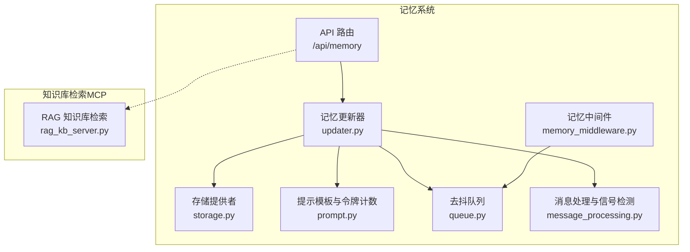
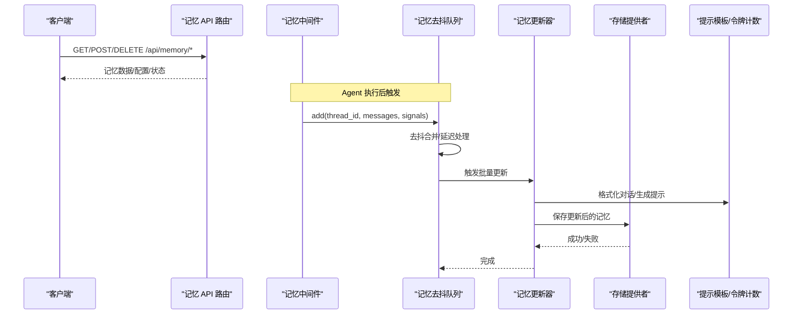
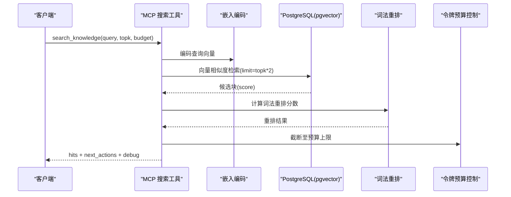
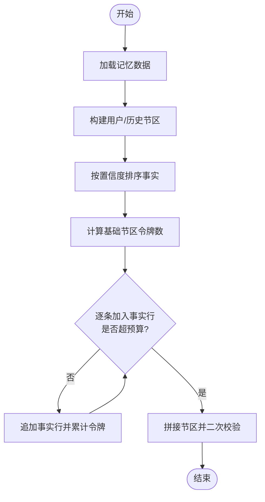
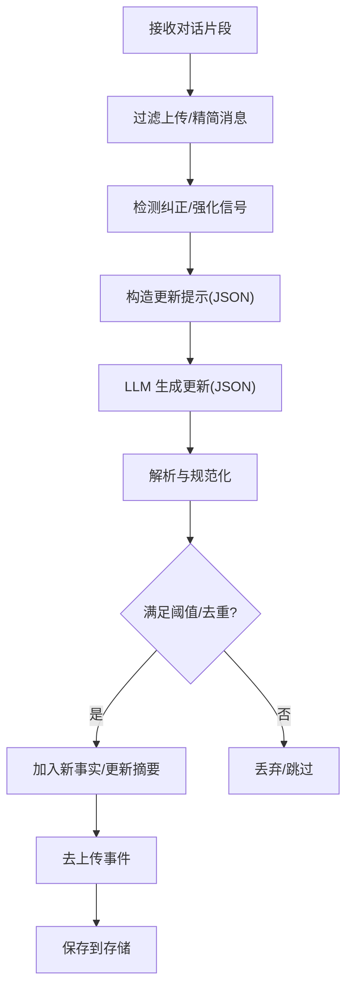
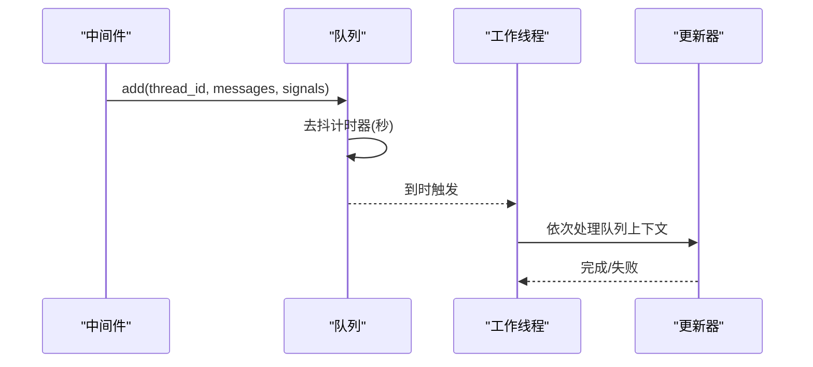
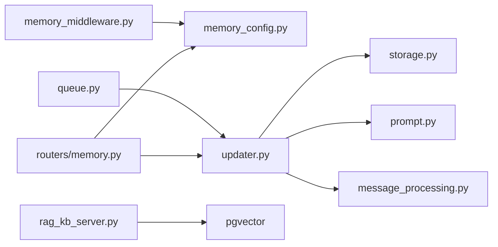

# 记忆检索

<cite>
**本文引用的文件**
- [backend/app/gateway/routers/memory.py](file://backend/app/gateway/routers/memory.py)
- [backend/packages/harness/deerflow/agents/memory/storage.py](file://backend/packages/harness/deerflow/agents/memory/storage.py)
- [backend/packages/harness/deerflow/agents/memory/updater.py](file://backend/packages/harness/deerflow/agents/memory/updater.py)
- [backend/packages/harness/deerflow/agents/memory/prompt.py](file://backend/packages/harness/deerflow/agents/memory/prompt.py)
- [backend/packages/harness/deerflow/agents/memory/message_processing.py](file://backend/packages/harness/deerflow/agents/memory/message_processing.py)
- [backend/packages/harness/deerflow/agents/memory/queue.py](file://backend/packages/harness/deerflow/agents/memory/queue.py)
- [backend/packages/harness/deerflow/config/memory_config.py](file://backend/packages/harness/deerflow/config/memory_config.py)
- [backend/packages/harness/deerflow/agents/memory_middleware.py](file://backend/packages/harness/deerflow/agents/middlewares/memory_middleware.py)
- [backend/docs/MEMORY_IMPROVEMENTS.md](file://backend/docs/MEMORY_IMPROVEMENTS.md)
- [backend/docs/MEMORY_IMPROVEMENTS_SUMMARY.md](file://backend/docs/MEMORY_IMPROVEMENTS_SUMMARY.md)
- [mcp_servers/rag_kb_server.py](file://mcp_servers/rag_kb_server.py)
</cite>

## 目录
1. [简介](#简介)
2. [项目结构](#项目结构)
3. [核心组件](#核心组件)
4. [架构总览](#架构总览)
5. [详细组件分析](#详细组件分析)
6. [依赖分析](#依赖分析)
7. [性能考虑](#性能考虑)
8. [故障排查指南](#故障排查指南)
9. [结论](#结论)
10. [附录](#附录)

## 简介
本文件系统性阐述记忆检索与记忆注入机制的设计与实现，覆盖以下主题：
- 检索算法设计：向量检索、关键词搜索与语义相似度计算
- 查询优化策略：重排、预算控制与上下文窗口管理
- 匹配机制：基于置信度的事实排序与过滤规则
- 上下文窗口管理：消息聚合策略与令牌预算控制
- 检索效率优化：缓存、去抖与批处理
- 配置参数、性能基准与查询模式分析
- 复杂查询示例、检索失败处理与结果验证方法

## 项目结构
记忆检索与记忆注入涉及后端 API、记忆存储与更新、提示模板与令牌计数、消息聚合与队列去抖等模块；同时提供 MCP 服务器用于知识库检索（向量+词法重排）。



**图表来源**
- [backend/app/gateway/routers/memory.py:110-357](file://backend/app/gateway/routers/memory.py#L110-L357)
- [backend/packages/harness/deerflow/agents/memory/updater.py:467-598](file://backend/packages/harness/deerflow/agents/memory/updater.py#L467-L598)
- [backend/packages/harness/deerflow/agents/memory/storage.py:62-190](file://backend/packages/harness/deerflow/agents/memory/storage.py#L62-L190)
- [backend/packages/harness/deerflow/agents/memory/prompt.py:251-367](file://backend/packages/harness/deerflow/agents/memory/prompt.py#L251-L367)
- [backend/packages/harness/deerflow/agents/memory/queue.py:28-226](file://backend/packages/harness/deerflow/agents/memory/queue.py#L28-L226)
- [backend/packages/harness/deerflow/agents/memory/message_processing.py:56-110](file://backend/packages/harness/deerflow/agents/memory/message_processing.py#L56-L110)
- [backend/packages/harness/deerflow/agents/middlewares/memory_middleware.py:40-74](file://backend/packages/harness/deerflow/agents/middlewares/memory_middleware.py#L40-L74)
- [mcp_servers/rag_kb_server.py:140-238](file://mcp_servers/rag_kb_server.py#L140-L238)

**章节来源**
- [backend/app/gateway/routers/memory.py:1-357](file://backend/app/gateway/routers/memory.py#L1-L357)
- [backend/packages/harness/deerflow/agents/memory/storage.py:1-232](file://backend/packages/harness/deerflow/agents/memory/storage.py#L1-L232)
- [backend/packages/harness/deerflow/agents/memory/updater.py:1-710](file://backend/packages/harness/deerflow/agents/memory/updater.py#L1-L710)
- [backend/packages/harness/deerflow/agents/memory/prompt.py:1-414](file://backend/packages/harness/deerflow/agents/memory/prompt.py#L1-L414)
- [backend/packages/harness/deerflow/agents/memory/message_processing.py:1-110](file://backend/packages/harness/deerflow/agents/memory/message_processing.py#L1-L110)
- [backend/packages/harness/deerflow/agents/memory/queue.py:1-288](file://backend/packages/harness/deerflow/agents/memory/queue.py#L1-L288)
- [backend/packages/harness/deerflow/config/memory_config.py:1-84](file://backend/packages/harness/deerflow/config/memory_config.py#L1-L84)
- [backend/packages/harness/deerflow/agents/middlewares/memory_middleware.py:40-74](file://backend/packages/harness/deerflow/agents/middlewares/memory_middleware.py#L40-L74)
- [backend/docs/MEMORY_IMPROVEMENTS.md:1-66](file://backend/docs/MEMORY_IMPROVEMENTS.md#L1-L66)
- [backend/docs/MEMORY_IMPROVEMENTS_SUMMARY.md:1-39](file://backend/docs/MEMORY_IMPROVEMENTS_SUMMARY.md#L1-L39)
- [mcp_servers/rag_kb_server.py:129-238](file://mcp_servers/rag_kb_server.py#L129-L238)

## 核心组件
- 记忆 API 路由：提供记忆数据的增删改查、导入导出、状态查询与配置读取接口。
- 记忆存储：抽象存储接口与文件存储实现，支持按用户/代理隔离与缓存。
- 记忆更新器：基于 LLM 的记忆更新流程，解析 JSON 输出、应用更新、持久化，并进行事实去重与上限控制。
- 提示模板与令牌计数：格式化记忆注入内容，使用 tiktoken 精确统计令牌数，支持降级估算。
- 消息处理：过滤上传消息、检测纠正/强化信号，生成更新输入。
- 去抖队列：多轮对话合并与延迟处理，避免频繁写入。
- 记忆中间件：在 Agent 后置阶段触发记忆更新队列。
- 知识库检索（MCP）：基于 pgvector 的向量检索与词法重排，支持令牌预算与扩展建议。

**章节来源**
- [backend/app/gateway/routers/memory.py:110-357](file://backend/app/gateway/routers/memory.py#L110-L357)
- [backend/packages/harness/deerflow/agents/memory/storage.py:43-232](file://backend/packages/harness/deerflow/agents/memory/storage.py#L43-L232)
- [backend/packages/harness/deerflow/agents/memory/updater.py:380-710](file://backend/packages/harness/deerflow/agents/memory/updater.py#L380-L710)
- [backend/packages/harness/deerflow/agents/memory/prompt.py:12-232](file://backend/packages/harness/deerflow/agents/memory/prompt.py#L12-L232)
- [backend/packages/harness/deerflow/agents/memory/message_processing.py:56-110](file://backend/packages/harness/deerflow/agents/memory/message_processing.py#L56-L110)
- [backend/packages/harness/deerflow/agents/memory/queue.py:28-226](file://backend/packages/harness/deerflow/agents/memory/queue.py#L28-L226)
- [backend/packages/harness/deerflow/agents/middlewares/memory_middleware.py:40-74](file://backend/packages/harness/deerflow/agents/middlewares/memory_middleware.py#L40-L74)
- [mcp_servers/rag_kb_server.py:140-238](file://mcp_servers/rag_kb_server.py#L140-L238)

## 架构总览
记忆检索与注入的整体流程如下：



**图表来源**
- [backend/packages/harness/deerflow/agents/middlewares/memory_middleware.py:52-74](file://backend/packages/harness/deerflow/agents/middlewares/memory_middleware.py#L52-L74)
- [backend/packages/harness/deerflow/agents/memory/queue.py:166-214](file://backend/packages/harness/deerflow/agents/memory/queue.py#L166-L214)
- [backend/packages/harness/deerflow/agents/memory/updater.py:467-598](file://backend/packages/harness/deerflow/agents/memory/updater.py#L467-L598)
- [backend/packages/harness/deerflow/agents/memory/prompt.py:370-414](file://backend/packages/harness/deerflow/agents/memory/prompt.py#L370-L414)
- [backend/packages/harness/deerflow/agents/memory/storage.py:160-189](file://backend/packages/harness/deerflow/agents/memory/storage.py#L160-L189)

## 详细组件分析

### 组件A：记忆检索（向量+词法重排）
- 向量检索：使用 pgvector 的余弦距离计算相似度，按阈值与 topk 返回候选块。
- 词法重排：对查询词进行分词，统计与标题/内容的重叠词数量，作为额外打分项提升关键词命中。
- 结果聚合：限制总令牌预算，按重排分数截断返回，提供扩展建议与调试信息。



**图表来源**
- [mcp_servers/rag_kb_server.py:140-238](file://mcp_servers/rag_kb_server.py#L140-L238)

**章节来源**
- [mcp_servers/rag_kb_server.py:129-238](file://mcp_servers/rag_kb_server.py#L129-L238)

### 组件B：记忆注入与排序（置信度优先）
- 注入格式：用户上下文、历史摘要、按置信度降序的事实列表，支持多段落与分类标注。
- 令牌预算：先计算基础节区长度，再逐条累加事实行的令牌数，超过上限则停止。
- 降级策略：若 tiktoken 不可用或加载失败，回退字符估算；最终仍可按比例裁剪保证上限。



**图表来源**
- [backend/packages/harness/deerflow/agents/memory/prompt.py:251-367](file://backend/packages/harness/deerflow/agents/memory/prompt.py#L251-L367)

**章节来源**
- [backend/packages/harness/deerflow/agents/memory/prompt.py:251-367](file://backend/packages/harness/deerflow/agents/memory/prompt.py#L251-L367)

### 组件C：记忆更新与过滤规则
- 更新流程：准备提示 → LLM 生成 JSON → 解析与规范化 → 应用更新 → 去除上传事件 → 保存。
- 过滤规则：
  - 事实去重：按标准化内容去重，避免重复。
  - 置信度阈值：仅当置信度不低于阈值才入库。
  - 最大数量：超过上限按置信度降序截断。
  - 上传事件清理：移除关于上传文件的句子与事实，避免未来会话无效引用。
- 信号检测：检测纠正/强化信号，增强记忆更新提示。



**图表来源**
- [backend/packages/harness/deerflow/agents/memory/updater.py:422-466](file://backend/packages/harness/deerflow/agents/memory/updater.py#L422-L466)
- [backend/packages/harness/deerflow/agents/memory/message_processing.py:56-110](file://backend/packages/harness/deerflow/agents/memory/message_processing.py#L56-L110)

**章节来源**
- [backend/packages/harness/deerflow/agents/memory/updater.py:380-710](file://backend/packages/harness/deerflow/agents/memory/updater.py#L380-L710)
- [backend/packages/harness/deerflow/agents/memory/message_processing.py:56-110](file://backend/packages/harness/deerflow/agents/memory/message_processing.py#L56-L110)

### 组件D：上下文窗口管理与消息聚合
- 去抖机制：同一会话在配置的秒级窗口内合并多次更新请求，减少写入压力。
- 批处理：后台线程顺序处理队列，避免速率限制与并发冲突。
- 消息聚合：仅保留人类输入与最终 AI 回答，去除纯上传标记，必要时截断长消息。



**图表来源**
- [backend/packages/harness/deerflow/agents/memory/queue.py:166-214](file://backend/packages/harness/deerflow/agents/memory/queue.py#L166-L214)
- [backend/packages/harness/deerflow/agents/middlewares/memory_middleware.py:52-74](file://backend/packages/harness/deerflow/agents/middlewares/memory_middleware.py#L52-L74)

**章节来源**
- [backend/packages/harness/deerflow/agents/memory/queue.py:28-226](file://backend/packages/harness/deerflow/agents/memory/queue.py#L28-L226)
- [backend/packages/harness/deerflow/agents/middlewares/memory_middleware.py:40-74](file://backend/packages/harness/deerflow/agents/middlewares/memory_middleware.py#L40-L74)

### 组件E：API 与配置
- API 路由：提供记忆数据查询、导入导出、事实增删改、配置读取与状态汇总。
- 配置项：启用开关、存储路径/类、去抖间隔、最大事实数、置信度阈值、注入开关与注入令牌上限等。

```mermaid
classDiagram
class MemoryAPI {
    +GET "/api/memory"
    +POST "/api/memory/reload"
    +DELETE "/api/memory"
    +POST "/api/memory/facts"
    +DELETE "/api/memory/facts/{id}"
    +PATCH "/api/memory/facts/{id}"
    +GET "/api/memory/export"
    +POST "/api/memory/import"
    +GET "/api/memory/config"
    +GET "/api/memory/status"
}
class MemoryConfig {
    +enabled : bool
    +storage_path : str
    +storage_class : str
    +debounce_seconds : int
    +model_name : str
    +max_facts : int
    +fact_confidence_threshold : float
    +injection_enabled : bool
    +max_injection_tokens : int
}
MemoryAPI --> MemoryConfig : "读取配置"
```

**图表来源**
- [backend/app/gateway/routers/memory.py:110-357](file://backend/app/gateway/routers/memory.py#L110-L357)
- [backend/packages/harness/deerflow/config/memory_config.py:6-62](file://backend/packages/harness/deerflow/config/memory_config.py#L6-L62)

**章节来源**
- [backend/app/gateway/routers/memory.py:110-357](file://backend/app/gateway/routers/memory.py#L110-L357)
- [backend/packages/harness/deerflow/config/memory_config.py:1-84](file://backend/packages/harness/deerflow/config/memory_config.py#L1-L84)

## 依赖分析
- 记忆中间件依赖全局配置，若显式传入配置则禁用环境配置调用。
- 记忆更新器通过存储提供者抽象解耦具体实现（默认文件存储），支持自定义类路径。
- 提示模板依赖 tiktoken 进行精确令牌计数，不可用时回退字符估算。
- MCP 知识库检索直接依赖数据库连接与向量列，返回结构包含检索阶段、预算使用、扩展建议与调试信息。



**图表来源**
- [backend/packages/harness/deerflow/agents/middlewares/memory_middleware.py:40-74](file://backend/packages/harness/deerflow/agents/middlewares/memory_middleware.py#L40-L74)
- [backend/packages/harness/deerflow/config/memory_config.py:69-84](file://backend/packages/harness/deerflow/config/memory_config.py#L69-L84)
- [backend/packages/harness/deerflow/agents/memory/updater.py:467-598](file://backend/packages/harness/deerflow/agents/memory/updater.py#L467-L598)
- [backend/packages/harness/deerflow/agents/memory/storage.py:196-231](file://backend/packages/harness/deerflow/agents/memory/storage.py#L196-L231)
- [backend/packages/harness/deerflow/agents/memory/prompt.py:12-232](file://backend/packages/harness/deerflow/agents/memory/prompt.py#L12-L232)
- [backend/packages/harness/deerflow/agents/memory/message_processing.py:56-110](file://backend/packages/harness/deerflow/agents/memory/message_processing.py#L56-L110)
- [backend/packages/harness/deerflow/agents/memory/queue.py:166-214](file://backend/packages/harness/deerflow/agents/memory/queue.py#L166-L214)
- [backend/app/gateway/routers/memory.py:110-357](file://backend/app/gateway/routers/memory.py#L110-L357)
- [mcp_servers/rag_kb_server.py:140-238](file://mcp_servers/rag_kb_server.py#L140-L238)

**章节来源**
- [backend/packages/harness/deerflow/agents/middlewares/memory_middleware.py:40-74](file://backend/packages/harness/deerflow/agents/middlewares/memory_middleware.py#L40-L74)
- [backend/packages/harness/deerflow/agents/memory/updater.py:467-598](file://backend/packages/harness/deerflow/agents/memory/updater.py#L467-L598)
- [backend/packages/harness/deerflow/agents/memory/storage.py:196-231](file://backend/packages/harness/deerflow/agents/memory/storage.py#L196-L231)
- [backend/packages/harness/deerflow/agents/memory/prompt.py:12-232](file://backend/packages/harness/deerflow/agents/memory/prompt.py#L12-L232)
- [backend/packages/harness/deerflow/agents/memory/message_processing.py:56-110](file://backend/packages/harness/deerflow/agents/memory/message_processing.py#L56-L110)
- [backend/packages/harness/deerflow/agents/memory/queue.py:166-214](file://backend/packages/harness/deerflow/agents/memory/queue.py#L166-L214)
- [backend/app/gateway/routers/memory.py:110-357](file://backend/app/gateway/routers/memory.py#L110-L357)
- [mcp_servers/rag_kb_server.py:140-238](file://mcp_servers/rag_kb_server.py#L140-L238)

## 性能考虑
- 令牌计数精度：优先使用 tiktoken，失败时回退字符估算，确保注入内容不超过预算。
- 去抖与批处理：通过队列合并与后台线程处理，降低写入频率与并发竞争。
- 向量检索预算：先按 topk 放大取样，再词法重排与预算截断，平衡召回与成本。
- 存储缓存：文件存储提供按用户/代理的内存缓存与 mtime 校验，减少磁盘 IO。
- 线程池与同步：记忆更新在同步路径执行，避免跨事件循环连接复用问题。

[本节为通用性能讨论，无需“章节来源”]

## 故障排查指南
- 记忆注入为空或被截断
  - 检查注入令牌上限与实际内容长度，确认 tiktoken 可用性。
  - 参考：[backend/packages/harness/deerflow/agents/memory/prompt.py:251-367](file://backend/packages/harness/deerflow/agents/memory/prompt.py#L251-L367)
- 记忆更新失败
  - 查看 LLM JSON 解析错误与异常日志，确认提示格式与模型输出一致性。
  - 参考：[backend/packages/harness/deerflow/agents/memory/updater.py:532-537](file://backend/packages/harness/deerflow/agents/memory/updater.py#L532-L537)
- 上传事件残留
  - 确认消息过滤与上传事件清理逻辑已生效。
  - 参考：[backend/packages/harness/deerflow/agents/memory/message_processing.py:348-368](file://backend/packages/harness/deerflow/agents/memory/message_processing.py#L348-L368)
- API 返回错误
  - 检查事实置信度范围、内容非空校验与存储权限。
  - 参考：[backend/app/gateway/routers/memory.py:66-72](file://backend/app/gateway/routers/memory.py#L66-L72)
- 知识库检索无结果或质量低
  - 调整 topk 放大倍数、预算上限与词法重排权重，检查向量维度与索引。
  - 参考：[mcp_servers/rag_kb_server.py:140-238](file://mcp_servers/rag_kb_server.py#L140-L238)

**章节来源**
- [backend/packages/harness/deerflow/agents/memory/prompt.py:251-367](file://backend/packages/harness/deerflow/agents/memory/prompt.py#L251-L367)
- [backend/packages/harness/deerflow/agents/memory/updater.py:532-537](file://backend/packages/harness/deerflow/agents/memory/updater.py#L532-L537)
- [backend/packages/harness/deerflow/agents/memory/message_processing.py:348-368](file://backend/packages/harness/deerflow/agents/memory/message_processing.py#L348-L368)
- [backend/app/gateway/routers/memory.py:66-72](file://backend/app/gateway/routers/memory.py#L66-L72)
- [mcp_servers/rag_kb_server.py:140-238](file://mcp_servers/rag_kb_server.py#L140-L238)

## 结论
该记忆检索与注入系统以“向量检索 + 词法重排 + 置信度排序”的组合实现高相关性与可控成本的检索；通过去抖队列与令牌预算控制保障吞吐与稳定性；借助精确令牌计数与多层过滤规则确保注入质量与安全性。未来规划包括引入 TF-IDF 与上下文感知的加权排序，进一步提升检索效果与个性化程度。

[本节为总结，无需“章节来源”]

## 附录

### 配置参数速览
- enabled：是否启用记忆机制
- storage_path：存储路径（绝对/相对），空则按用户隔离
- storage_class：存储提供者类路径
- debounce_seconds：去抖等待秒数
- model_name：记忆更新使用的模型名
- max_facts：最大事实数
- fact_confidence_threshold：事实入库置信度阈值
- injection_enabled：是否注入记忆到提示
- max_injection_tokens：记忆注入最大令牌数

**章节来源**
- [backend/packages/harness/deerflow/config/memory_config.py:6-62](file://backend/packages/harness/deerflow/config/memory_config.py#L6-L62)

### 查询模式与示例
- 简单关键词检索：查询短语命中标题/内容即得分，词法重排提升命中率。
- 多轮上下文检索：结合 recentMonths/earlierContext 等历史摘要，提升语义连贯性。
- 扩展检索：根据检索结果建议扩展源，按预算动态增加证据块。

**章节来源**
- [mcp_servers/rag_kb_server.py:140-238](file://mcp_servers/rag_kb_server.py#L140-L238)

### 性能基准与验证
- 回归测试覆盖：事实注入、置信度排序、令牌预算限制。
- 文档同步：当前实现与规划差异明确标注，避免误解。

**章节来源**
- [backend/docs/MEMORY_IMPROVEMENTS.md:57-66](file://backend/docs/MEMORY_IMPROVEMENTS.md#L57-L66)
- [backend/docs/MEMORY_IMPROVEMENTS_SUMMARY.md:1-39](file://backend/docs/MEMORY_IMPROVEMENTS_SUMMARY.md#L1-L39)