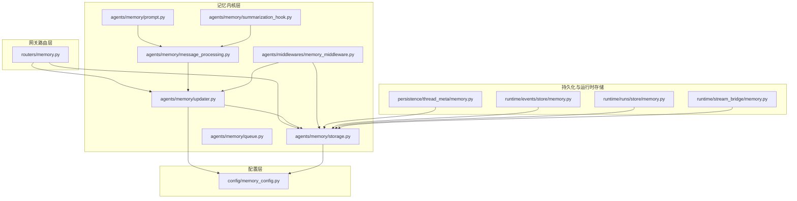
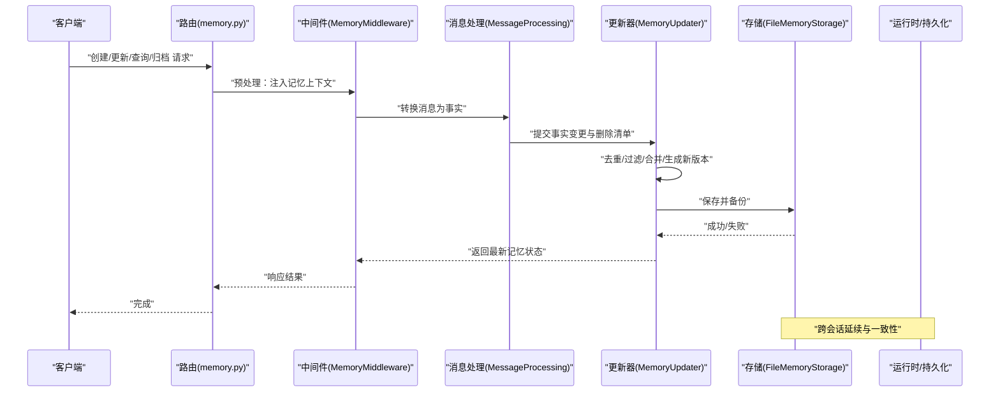
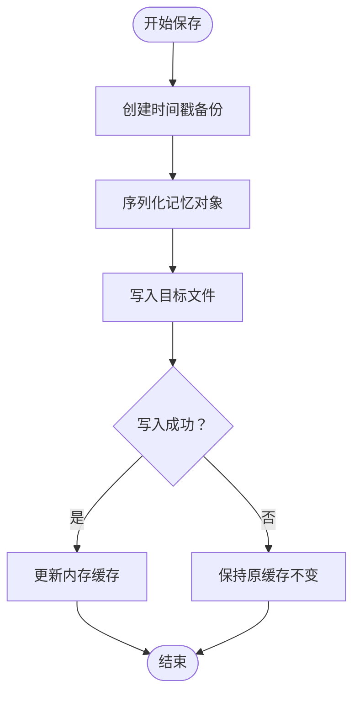
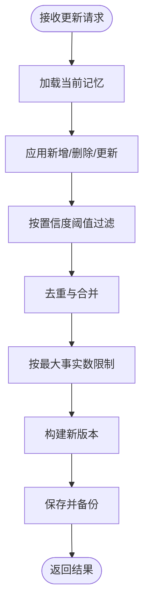
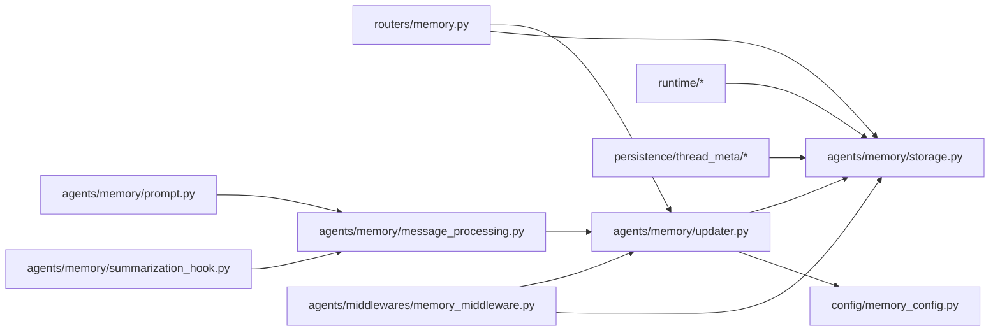
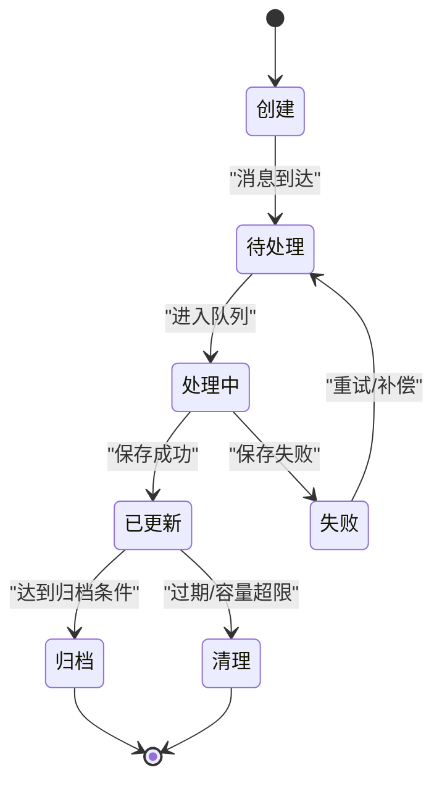
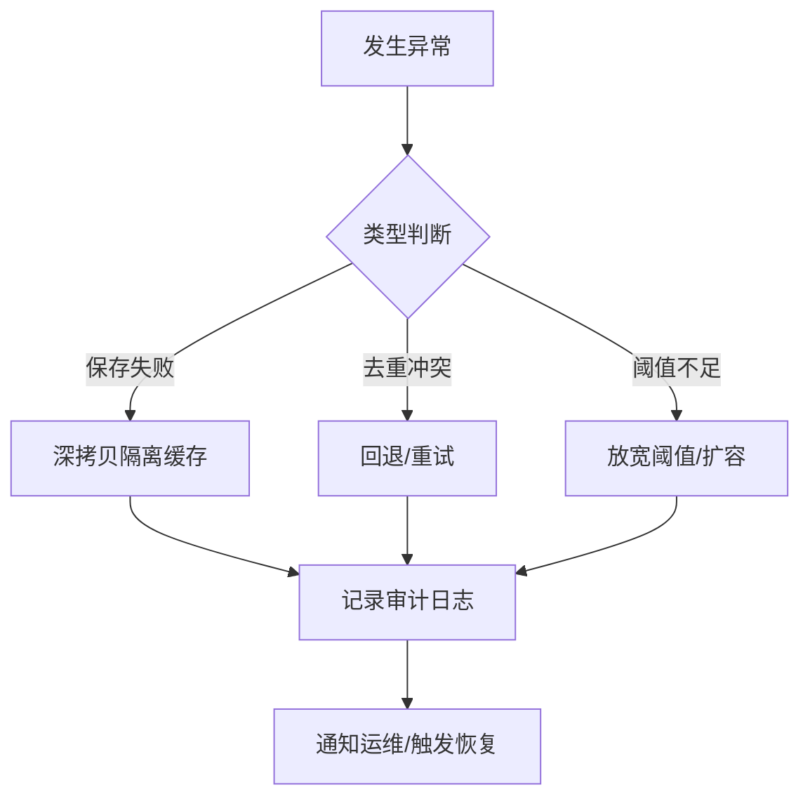

# 记忆生命周期

<cite>
**本文引用的文件**
- [memory.py](file://backend/app/gateway/routers/memory.py)
- [memory_config.py](file://backend/packages/harness/deerflow/config/memory_config.py)
- [storage.py](file://backend/packages/harness/deerflow/agents/memory/storage.py)
- [updater.py](file://backend/packages/harness/deerflow/agents/memory/updater.py)
- [queue.py](file://backend/packages/harness/deerflow/agents/memory/queue.py)
- [message_processing.py](file://backend/packages/harness/deerflow/agents/memory/message_processing.py)
- [prompt.py](file://backend/packages/harness/deerflow/agents/memory/prompt.py)
- [summarization_hook.py](file://backend/packages/harness/deerflow/agents/memory/summarization_hook.py)
- [memory_middleware.py](file://backend/packages/harness/deerflow/agents/middlewares/memory_middleware.py)
- [memory.py](file://backend/packages/harness/deerflow/persistence/thread_meta/memory.py)
- [memory.py](file://backend/packages/harness/deerflow/runtime/events/store/memory.py)
- [memory.py](file://backend/packages/harness/deerflow/runtime/runs/store/memory.py)
- [memory.py](file://backend/packages/harness/deerflow/runtime/stream_bridge/memory.py)
- [test_memory_storage.py](file://backend/tests/test_memory_storage.py)
- [test_memory_updater.py](file://backend/tests/test_memory_updater.py)
- [test_memory_queue.py](file://backend/tests/test_memory_queue.py)
- [MEMORY_IMPROVEMENTS.md](file://backend/docs/MEMORY_IMPROVEMENTS.md)
- [MEMORY_SETTINGS_REVIEW.md](file://backend/docs/MEMORY_SETTINGS_REVIEW.md)
</cite>

## 目录
1. [引言](#引言)
2. [项目结构](#项目结构)
3. [核心组件](#核心组件)
4. [架构总览](#架构总览)
5. [详细组件分析](#详细组件分析)
6. [依赖关系分析](#依赖关系分析)
7. [性能考量](#性能考量)
8. [故障排查指南](#故障排查指南)
9. [结论](#结论)
10. [附录](#附录)

## 引言
本文件系统性阐述 deer-flow 中“记忆”的生命周期管理：从创建、更新、删除到归档；覆盖状态转换、版本控制与冲突解决策略；解释自动清理、过期检测与垃圾回收算法；说明批量操作、事务处理与并发控制；并提供配置项、监控指标与维护策略，以及异常处理、数据修复与审计日志建议。为便于不同背景读者理解，文档采用由浅入深的层次化描述，并辅以图示。

## 项目结构
记忆生命周期相关代码主要分布在以下模块：
- 网关路由层：对外暴露记忆相关接口（如创建、更新、查询、归档等）
- 配置层：定义记忆存储、阈值、策略等参数
- 记忆内核层：存储、更新器、队列、消息处理、提示词生成、总结钩子
- 中间件层：在运行时注入或拦截记忆相关逻辑
- 持久化与运行时存储：线程元信息、事件与运行记录的内存存储
- 测试与文档：验证存储一致性、更新去重与冲突处理、改进与设置回顾

图表来源
- [memory.py](file://backend/app/gateway/routers/memory.py)
- [memory_config.py](file://backend/packages/harness/deerflow/config/memory_config.py)
- [storage.py](file://backend/packages/harness/deerflow/agents/memory/storage.py)
- [updater.py](file://backend/packages/harness/deerflow/agents/memory/updater.py)
- [queue.py](file://backend/packages/harness/deerflow/agents/memory/queue.py)
- [message_processing.py](file://backend/packages/harness/deerflow/agents/memory/message_processing.py)
- [prompt.py](file://backend/packages/harness/deerflow/agents/memory/prompt.py)
- [summarization_hook.py](file://backend/packages/harness/deerflow/agents/memory/summarization_hook.py)
- [memory_middleware.py](file://backend/packages/harness/deerflow/agents/middlewares/memory_middleware.py)
- [memory.py](file://backend/packages/harness/deerflow/persistence/thread_meta/memory.py)
- [memory.py](file://backend/packages/harness/deerflow/runtime/events/store/memory.py)
- [memory.py](file://backend/packages/harness/deerflow/runtime/runs/store/memory.py)
- [memory.py](file://backend/packages/harness/deerflow/runtime/stream_bridge/memory.py)

章节来源
- [memory.py](file://backend/app/gateway/routers/memory.py)
- [memory_config.py](file://backend/packages/harness/deerflow/config/memory_config.py)
- [storage.py](file://backend/packages/harness/deerflow/agents/memory/storage.py)
- [updater.py](file://backend/packages/harness/deerflow/agents/memory/updater.py)
- [queue.py](file://backend/packages/harness/deerflow/agents/memory/queue.py)
- [message_processing.py](file://backend/packages/harness/deerflow/agents/memory/message_processing.py)
- [prompt.py](file://backend/packages/harness/deerflow/agents/memory/prompt.py)
- [summarization_hook.py](file://backend/packages/harness/deerflow/agents/memory/summarization_hook.py)
- [memory_middleware.py](file://backend/packages/harness/deerflow/agents/middlewares/memory_middleware.py)
- [memory.py](file://backend/packages/harness/deerflow/persistence/thread_meta/memory.py)
- [memory.py](file://backend/packages/harness/deerflow/runtime/events/store/memory.py)
- [memory.py](file://backend/packages/harness/deerflow/runtime/runs/store/memory.py)
- [memory.py](file://backend/packages/harness/deerflow/runtime/stream_bridge/memory.py)

## 核心组件
- 存储层（FileMemoryStorage）：负责将记忆对象序列化/反序列化至磁盘，支持备份与失败保护，确保缓存不被污染。
- 更新器（MemoryUpdater）：协调事实增删、置信度阈值过滤、重复检测与去重、最终落盘与回滚隔离。
- 队列（MemoryQueue）：按优先级与策略调度记忆处理任务，支持批量与并发控制。
- 消息处理（MessageProcessing）：将对话消息转换为可注入记忆的事实，参与提示词生成与总结钩子。
- 提示词（Prompt）：根据上下文与事实生成注入提示，控制令牌预算与置信度排序。
- 总结钩子（SummarizationHook）：在关键节点触发事实摘要，降低上下文长度。
- 中间件（MemoryMiddleware）：在运行时拦截请求，注入记忆、执行预处理与后处理。
- 配置（MemoryConfig）：集中定义记忆开关、最大事实数、置信度阈值、存储路径等。
- 运行时与持久化存储：线程元信息、事件与运行记录的内存存储，支撑记忆的跨会话延续。

章节来源
- [storage.py](file://backend/packages/harness/deerflow/agents/memory/storage.py)
- [updater.py](file://backend/packages/harness/deerflow/agents/memory/updater.py)
- [queue.py](file://backend/packages/harness/deerflow/agents/memory/queue.py)
- [message_processing.py](file://backend/packages/harness/deerflow/agents/memory/message_processing.py)
- [prompt.py](file://backend/packages/harness/deerflow/agents/memory/prompt.py)
- [summarization_hook.py](file://backend/packages/harness/deerflow/agents/memory/summarization_hook.py)
- [memory_middleware.py](file://backend/packages/harness/deerflow/agents/middlewares/memory_middleware.py)
- [memory_config.py](file://backend/packages/harness/deerflow/config/memory_config.py)
- [memory.py](file://backend/packages/harness/deerflow/persistence/thread_meta/memory.py)
- [memory.py](file://backend/packages/harness/deerflow/runtime/events/store/memory.py)
- [memory.py](file://backend/packages/harness/deerflow/runtime/runs/store/memory.py)
- [memory.py](file://backend/packages/harness/deerflow/runtime/stream_bridge/memory.py)

## 架构总览
记忆生命周期贯穿“请求—处理—落盘—归档—清理”闭环。请求经路由进入，中间件注入记忆上下文；消息处理器将对话转为事实；更新器进行去重、过滤与合并；存储层负责持久化与备份；运行时与持久化存储保障跨会话一致性；测试与文档持续验证行为正确性。

图表来源
- [memory.py](file://backend/app/gateway/routers/memory.py)
- [memory_middleware.py](file://backend/packages/harness/deerflow/agents/middlewares/memory_middleware.py)
- [message_processing.py](file://backend/packages/harness/deerflow/agents/memory/message_processing.py)
- [updater.py](file://backend/packages/harness/deerflow/agents/memory/updater.py)
- [storage.py](file://backend/packages/harness/deerflow/agents/memory/storage.py)
- [memory.py](file://backend/packages/harness/deerflow/persistence/thread_meta/memory.py)
- [memory.py](file://backend/packages/harness/deerflow/runtime/events/store/memory.py)
- [memory.py](file://backend/packages/harness/deerflow/runtime/runs/store/memory.py)
- [memory.py](file://backend/packages/harness/deerflow/runtime/stream_bridge/memory.py)

## 详细组件分析

### 存储层（FileMemoryStorage）
职责
- 负责记忆对象的序列化/反序列化与落盘
- 在覆盖写入前自动创建时间戳备份
- 失败保护：当保存失败时，缓存不被污染，避免陈旧数据泄漏
- 不修改调用方传入字典的键集合，保证调用契约稳定

关键点
- 备份策略：写入前自动备份，防止覆盖导致的数据丢失
- 失败隔离：保存异常时通过深拷贝隔离缓存，避免污染原始对象
- 原子性：保存成功才更新缓存，失败则保持原状

图表来源
- [storage.py](file://backend/packages/harness/deerflow/agents/memory/storage.py)
- [test_memory_storage.py](file://backend/tests/test_memory_storage.py)

章节来源
- [storage.py](file://backend/packages/harness/deerflow/agents/memory/storage.py)
- [test_memory_storage.py](file://backend/tests/test_memory_storage.py)
- [MEMORY_SETTINGS_REVIEW.md](file://backend/docs/MEMORY_SETTINGS_REVIEW.md)

### 更新器（MemoryUpdater）
职责
- 接收事实变更与删除清单，执行去重、过滤与合并
- 基于置信度阈值与最大事实数限制，裁剪与排序
- 生成新版本并协调落盘，失败时通过深拷贝隔离缓存
- 支持用户 ID 透传，确保多租户隔离

关键点
- 去重与删除：跳过重复事实，按 ID 删除指定事实
- 过滤与阈值：仅保留高于阈值的事实
- 版本控制：每次更新生成新版本，保留历史字段
- 回滚隔离：保存失败时，原始缓存不受影响

图表来源
- [updater.py](file://backend/packages/harness/deerflow/agents/memory/updater.py)
- [test_memory_updater.py](file://backend/tests/test_memory_updater.py)

章节来源
- [updater.py](file://backend/packages/harness/deerflow/agents/memory/updater.py)
- [test_memory_updater.py](file://backend/tests/test_memory_updater.py)

### 队列（MemoryQueue）
职责
- 调度记忆处理任务，支持批量与并发控制
- 依据优先级与策略选择处理顺序，避免阻塞关键路径

关键点
- 批量处理：聚合多个变更，减少频繁落盘
- 并发控制：通过锁或信号量限制同时处理的任务数
- 优先级：高优先级事实优先处理，保证时效性

章节来源
- [queue.py](file://backend/packages/harness/deerflow/agents/memory/queue.py)
- [test_memory_queue.py](file://backend/tests/test_memory_queue.py)

### 消息处理（MessageProcessing）
职责
- 将人类与 AI 的消息转换为可注入记忆的事实
- 参与提示词生成与总结钩子，控制上下文长度与质量

关键点
- 事实抽取：从消息中提取结构化事实
- 注入策略：结合置信度与令牌预算，决定是否注入
- 与提示词/总结钩子协同：在关键节点触发摘要，降低上下文开销

章节来源
- [message_processing.py](file://backend/packages/harness/deerflow/agents/memory/message_processing.py)
- [prompt.py](file://backend/packages/harness/deerflow/agents/memory/prompt.py)
- [summarization_hook.py](file://backend/packages/harness/deerflow/agents/memory/summarization_hook.py)

### 中间件（MemoryMiddleware）
职责
- 在运行时拦截请求，注入记忆上下文
- 执行预处理与后处理，确保记忆与业务流程解耦

关键点
- 上下文注入：在请求进入业务逻辑前注入记忆
- 后处理：在响应返回前同步必要的记忆状态
- 与路由解耦：中间件独立于具体路由实现

章节来源
- [memory_middleware.py](file://backend/packages/harness/deerflow/agents/middlewares/memory_middleware.py)

### 配置（MemoryConfig）
职责
- 定义记忆开关、最大事实数、置信度阈值、存储路径等
- 作为全局配置，被存储与更新器读取

关键点
- 参数化：通过配置控制行为，便于灰度与调优
- 默认值：提供合理的默认值，兼顾性能与准确性

章节来源
- [memory_config.py](file://backend/packages/harness/deerflow/config/memory_config.py)

### 运行时与持久化存储
职责
- 线程元信息、事件与运行记录的内存存储，支撑跨会话延续
- 与 FileMemoryStorage 协同，确保一致性与可恢复性

章节来源
- [memory.py](file://backend/packages/harness/deerflow/persistence/thread_meta/memory.py)
- [memory.py](file://backend/packages/harness/deerflow/runtime/events/store/memory.py)
- [memory.py](file://backend/packages/harness/deerflow/runtime/runs/store/memory.py)
- [memory.py](file://backend/packages/harness/deerflow/runtime/stream_bridge/memory.py)

## 依赖关系分析
- 路由依赖更新器与存储，确保对外接口的一致性
- 更新器依赖配置与存储，实现策略与持久化解耦
- 消息处理与提示词/总结钩子依赖更新器输出，形成闭环
- 中间件横切关注点，贯穿请求生命周期
- 运行时与持久化存储为记忆提供跨会话延续能力

图表来源
- [memory.py](file://backend/app/gateway/routers/memory.py)
- [updater.py](file://backend/packages/harness/deerflow/agents/memory/updater.py)
- [storage.py](file://backend/packages/harness/deerflow/agents/memory/storage.py)
- [memory_config.py](file://backend/packages/harness/deerflow/config/memory_config.py)
- [message_processing.py](file://backend/packages/harness/deerflow/agents/memory/message_processing.py)
- [prompt.py](file://backend/packages/harness/deerflow/agents/memory/prompt.py)
- [summarization_hook.py](file://backend/packages/harness/deerflow/agents/memory/summarization_hook.py)
- [memory_middleware.py](file://backend/packages/harness/deerflow/agents/middlewares/memory_middleware.py)
- [memory.py](file://backend/packages/harness/deerflow/runtime/events/store/memory.py)
- [memory.py](file://backend/packages/harness/deerflow/runtime/runs/store/memory.py)
- [memory.py](file://backend/packages/harness/deerflow/runtime/stream_bridge/memory.py)
- [memory.py](file://backend/packages/harness/deerflow/persistence/thread_meta/memory.py)

## 性能考量
- 批量与并发
  - 使用队列聚合变更，减少频繁 IO
  - 通过并发控制限制同时处理的任务数，避免资源争用
- 令牌预算与阈值
  - 通过置信度阈值与最大事实数限制，控制上下文大小与计算成本
- 缓存与备份
  - 写前备份与失败隔离，降低回滚成本
- 跨会话延续
  - 运行时与持久化存储配合，减少重复加载与重建

## 故障排查指南
常见问题与定位
- 保存失败导致缓存污染
  - 现象：保存异常后，缓存被污染或原始对象被修改
  - 处理：确认深拷贝隔离与失败保护逻辑生效
  - 参考：测试用例覆盖了保存失败时的缓存隔离
- 重复事实未去重
  - 现象：相同事实多次出现
  - 处理：检查去重逻辑与 ID 规范
- 置信度阈值导致事实丢失
  - 现象：部分事实未注入
  - 处理：调整阈值或扩大最大事实数
- 用户隔离失效
  - 现象：多用户数据交叉
  - 处理：确认用户 ID 透传与路径隔离

章节来源
- [test_memory_storage.py](file://backend/tests/test_memory_storage.py)
- [test_memory_updater.py](file://backend/tests/test_memory_updater.py)
- [test_memory_queue.py](file://backend/tests/test_memory_queue.py)

## 结论
记忆生命周期管理通过“存储—更新—队列—消息处理—提示词/总结钩子—中间件—配置—运行时/持久化”的完整链路，实现了可控、可观测、可恢复的记忆演进。测试与文档提供了回归保障与行为验证。建议在生产环境中启用备份、合理设置阈值与并发，并结合监控指标持续优化。

## 附录

### 生命周期状态转换（概念示意）

### 版本控制与冲突解决（概念示意）
- 版本号：每次更新生成新版本，保留历史字段
- 冲突解决：去重优先、删除优先、阈值过滤、深拷贝隔离
- 回滚策略：失败时保持原缓存，必要时回放备份

### 自动清理、过期检测与垃圾回收（概念示意）
- 清理触发：容量超限、时间过期、显式删除
- 过期检测：基于时间戳与 TTL
- 垃圾回收：定期扫描无效事实，释放空间

### 批量操作、事务处理与并发控制（概念示意）
- 批量：聚合变更，统一落盘
- 事务：保存原子性，失败回滚
- 并发：队列+信号量，避免竞争

### 配置选项（示例）
- 开关：是否启用记忆
- 最大事实数：限制记忆规模
- 置信度阈值：过滤低质量事实
- 存储路径：记忆文件位置
- 备份策略：覆盖前备份

### 监控指标（建议）
- 写入成功率
- 平均保存耗时
- 事实去重率
- 置信度分布
- 队列积压与吞吐
- 失败率与重试次数

### 维护策略（建议）
- 定期备份与校验
- 阈值与并发参数调优
- 清理策略与容量预警
- 异常告警与自动恢复

### 异常处理流程（概念示意）

### 数据修复方法（建议）
- 基于备份回滚
- 人工校验与补丁
- 重新注入与摘要重建

### 审计日志记录（建议）
- 关键事件：创建、更新、删除、归档、清理
- 元数据：用户 ID、线程 ID、版本号、时间戳
- 结果：成功/失败、原因、耗时