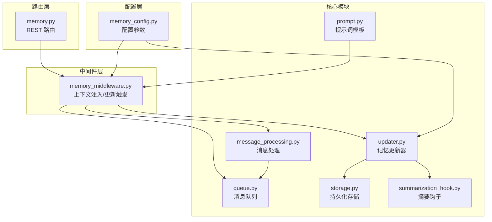
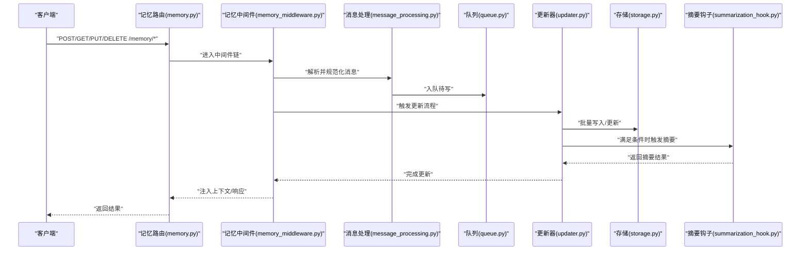
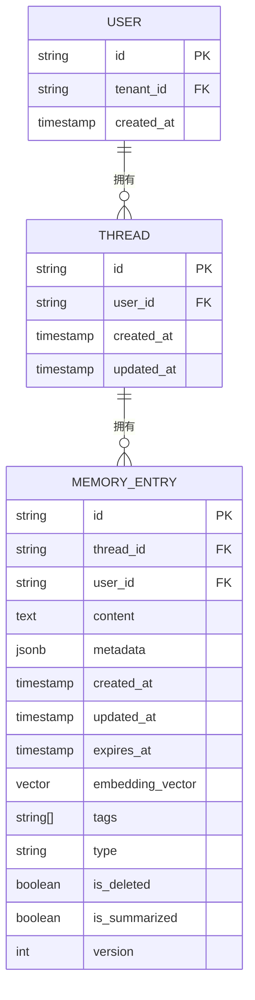
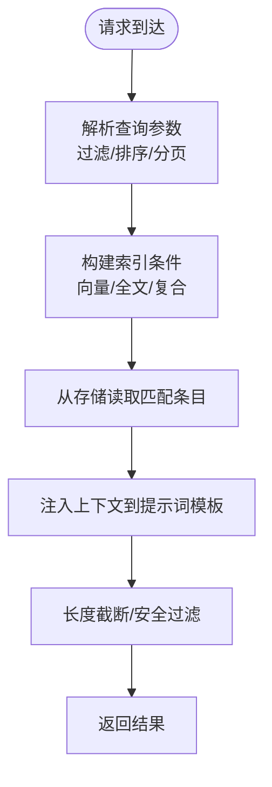
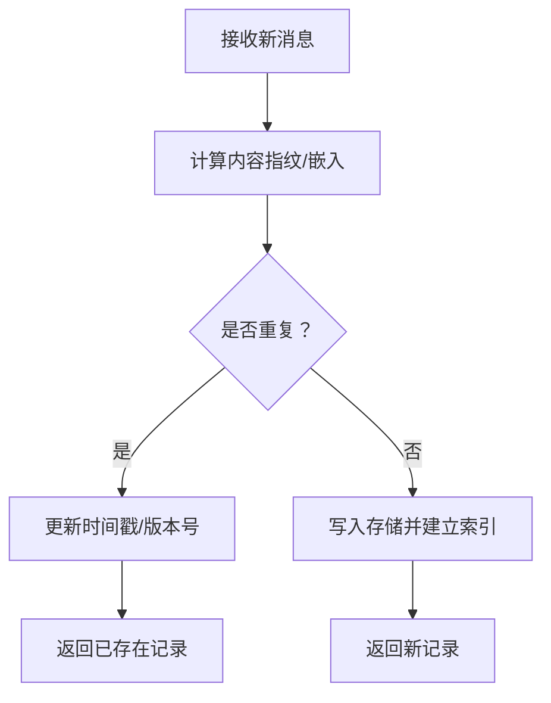
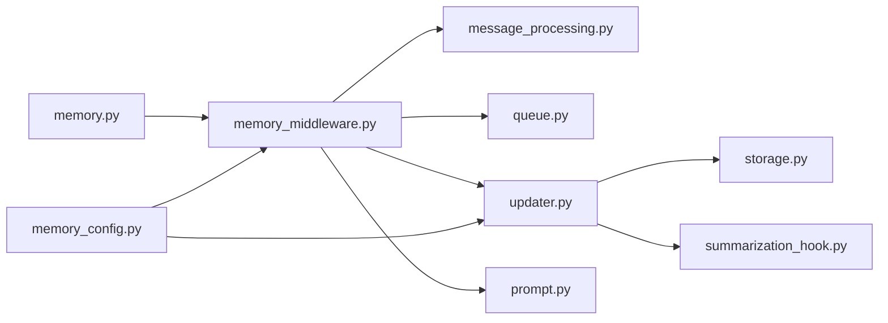

# 记忆系统

<cite>
**本文引用的文件**
- [memory.py](file://backend/app/gateway/routers/memory.py)
- [memory_middleware.py](file://backend/packages/harness/deerflow/agents/middlewares/memory_middleware.py)
- [memory_config.py](file://backend/packages/harness/deerflow/config/memory_config.py)
- [memory-settings-sample.json](file://backend/docs/memory-settings-sample.json)
- [message_processing.py](file://backend/packages/harness/deerflow/agents/memory/message_processing.py)
- [prompt.py](file://backend/packages/harness/deerflow/agents/memory/prompt.py)
- [queue.py](file://backend/packages/harness/deerflow/agents/memory/queue.py)
- [storage.py](file://backend/packages/harness/deerflow/agents/memory/storage.py)
- [summarization_hook.py](file://backend/packages/harness/deerflow/agents/memory/summarization_hook.py)
- [updater.py](file://backend/packages/harness/deerflow/agents/memory/updater.py)
- [test_memory_router.py](file://backend/tests/test_memory_router.py)
- [test_memory_storage.py](file://backend/tests/test_memory_storage.py)
- [test_memory_updater.py](file://backend/tests/test_memory_updater.py)
- [test_memory_queue.py](file://backend/tests/test_memory_queue.py)
- [test_memory_prompt_injection.py](file://backend/tests/test_memory_prompt_injection.py)
- [load_memory_sample.py](file://scripts/load_memory_sample.py)
- [MEMORY_IMPROVEMENTS.md](file://backend/docs/MEMORY_IMPROVEMENTS.md)
- [MEMORY_IMPROVEMENTS_SUMMARY.md](file://backend/docs/MEMORY_IMPROVEMENTS_SUMMARY.md)
- [MEMORY_SETTINGS_REVIEW.md](file://backend/docs/MEMORY_SETTINGS_REVIEW.md)
- [SANDBOX_MEMORY_PROFILING.md](file://backend/docs/SANDBOX_MEMORY_PROFILING.md)
</cite>

## 目录
1. [简介](#简介)
2. [项目结构](#项目结构)
3. [核心组件](#核心组件)
4. [架构总览](#架构总览)
5. [详细组件分析](#详细组件分析)
6. [依赖关系分析](#依赖关系分析)
7. [性能考量](#性能考量)
8. [故障排查指南](#故障排查指南)
9. [结论](#结论)
10. [附录](#附录)

## 简介
本文件系统性阐述 deer-flow 的记忆系统：长期记忆的存储机制、更新策略与检索算法；数据模型、索引结构与查询接口；生命周期管理、去重机制与隐私保护；记忆与会话的关联关系及上下文注入机制；性能优化策略；配置选项、备份恢复与迁移指南；以及实际使用案例与最佳实践。内容基于后端 Python 实现与相关测试、文档进行归纳总结。

## 项目结构
记忆系统主要由以下层次构成：
- 路由层：提供对外的 REST 接口（读取、写入、更新、删除、列表等）。
- 中间件层：在请求处理链中注入上下文、触发记忆更新与摘要钩子。
- 核心模块：消息处理、队列、存储、更新器、提示词模板与摘要钩子。
- 配置层：集中管理记忆相关的参数与策略。
- 测试与文档：覆盖路由行为、存储一致性、更新流程、队列隔离与提示注入等场景。

图表来源
- [memory.py](file://backend/app/gateway/routers/memory.py)
- [memory_middleware.py](file://backend/packages/harness/deerflow/agents/middlewares/memory_middleware.py)
- [memory_config.py](file://backend/packages/harness/deerflow/config/memory_config.py)
- [message_processing.py](file://backend/packages/harness/deerflow/agents/memory/message_processing.py)
- [queue.py](file://backend/packages/harness/deerflow/agents/memory/queue.py)
- [storage.py](file://backend/packages/harness/deerflow/agents/memory/storage.py)
- [updater.py](file://backend/packages/harness/deerflow/agents/memory/updater.py)
- [prompt.py](file://backend/packages/harness/deerflow/agents/memory/prompt.py)
- [summarization_hook.py](file://backend/packages/harness/deerflow/agents/memory/summarization_hook.py)

章节来源
- [memory.py](file://backend/app/gateway/routers/memory.py)
- [memory_middleware.py](file://backend/packages/harness/deerflow/agents/middlewares/memory_middleware.py)
- [memory_config.py](file://backend/packages/harness/deerflow/config/memory_config.py)

## 核心组件
- 路由器（memory.py）：定义记忆资源的 CRUD 与查询接口，支持按线程、用户、时间范围过滤。
- 中间件（memory_middleware.py）：在运行时注入上下文、触发记忆更新与摘要钩子，确保会话与记忆同步。
- 消息处理（message_processing.py）：规范化消息格式、提取关键元信息、构建可检索字段。
- 队列（queue.py）：异步缓冲新消息，按策略批量写入存储，降低写放大。
- 存储（storage.py）：抽象持久化接口，支持多后端适配与事务一致性。
- 更新器（updater.py）：协调消息处理、队列与存储，执行去重、索引与摘要生成。
- 提示词模板（prompt.py）：定义上下文注入模板，支持动态变量替换。
- 摘要钩子（summarization_hook.py）：在满足条件时触发长文本压缩与知识抽取。
- 配置（memory_config.py）：集中管理容量、过期、去重、摘要阈值、索引策略等参数。

章节来源
- [memory.py](file://backend/app/gateway/routers/memory.py)
- [memory_middleware.py](file://backend/packages/harness/deerflow/agents/middlewares/memory_middleware.py)
- [message_processing.py](file://backend/packages/harness/deerflow/agents/memory/message_processing.py)
- [queue.py](file://backend/packages/harness/deerflow/agents/memory/queue.py)
- [storage.py](file://backend/packages/harness/deerflow/agents/memory/storage.py)
- [updater.py](file://backend/packages/harness/deerflow/agents/memory/updater.py)
- [prompt.py](file://backend/packages/harness/deerflow/agents/memory/prompt.py)
- [summarization_hook.py](file://backend/packages/harness/deerflow/agents/memory/summarization_hook.py)
- [memory_config.py](file://backend/packages/harness/deerflow/config/memory_config.py)

## 架构总览
记忆系统围绕“请求-中间件-处理-队列-存储”的流水线展开，同时通过配置与钩子实现策略化控制。

图表来源
- [memory.py](file://backend/app/gateway/routers/memory.py)
- [memory_middleware.py](file://backend/packages/harness/deerflow/agents/middlewares/memory_middleware.py)
- [message_processing.py](file://backend/packages/harness/deerflow/agents/memory/message_processing.py)
- [queue.py](file://backend/packages/harness/deerflow/agents/memory/queue.py)
- [updater.py](file://backend/packages/harness/deerflow/agents/memory/updater.py)
- [storage.py](file://backend/packages/harness/deerflow/agents/memory/storage.py)
- [summarization_hook.py](file://backend/packages/harness/deerflow/agents/memory/summarization_hook.py)

## 详细组件分析

### 数据模型与索引结构
- 记忆条目字段（示例维度）
  - 唯一标识：id（全局唯一）、thread_id（会话关联）、user_id（用户隔离）
  - 内容字段：content（正文）、metadata（结构化元数据）
  - 时间字段：created_at、updated_at、expires_at（过期控制）
  - 索引字段：embedding_vector（向量索引）、tags（标签索引）、type（类型索引）
  - 状态字段：is_deleted、is_summarized、version（版本号）
- 索引策略
  - 向量相似检索：用于语义近邻查找
  - 全文检索：基于 content 与 metadata 的关键词匹配
  - 复合过滤：thread_id、user_id、type、tags、时间范围
- 去重策略
  - 基于 content 的哈希或嵌入相似度阈值去重
  - 对重复项仅更新时间戳与版本号，避免冗余存储

图表来源
- [storage.py](file://backend/packages/harness/deerflow/agents/memory/storage.py)
- [message_processing.py](file://backend/packages/harness/deerflow/agents/memory/message_processing.py)

章节来源
- [storage.py](file://backend/packages/harness/deerflow/agents/memory/storage.py)
- [message_processing.py](file://backend/packages/harness/deerflow/agents/memory/message_processing.py)

### 查询接口与上下文注入
- 接口能力
  - 列表查询：支持分页、排序、过滤（thread_id、user_id、type、时间范围、标签）
  - 语义检索：向量相似度搜索，支持 rerank 与过滤
  - 精确检索：全文关键词匹配与复合条件过滤
  - 批量操作：导入、导出、清理过期与重复项
- 上下文注入
  - 在中间件阶段，根据 thread_id 与配置，从存储加载相关记忆片段
  - 将片段拼接到提示词模板中，形成最终提示输入
  - 支持动态变量替换与长度截断，避免超出上下文窗口

图表来源
- [memory.py](file://backend/app/gateway/routers/memory.py)
- [prompt.py](file://backend/packages/harness/deerflow/agents/memory/prompt.py)
- [memory_middleware.py](file://backend/packages/harness/deerflow/agents/middlewares/memory_middleware.py)

章节来源
- [memory.py](file://backend/app/gateway/routers/memory.py)
- [prompt.py](file://backend/packages/harness/deerflow/agents/memory/prompt.py)
- [memory_middleware.py](file://backend/packages/harness/deerflow/agents/middlewares/memory_middleware.py)

### 生命周期管理与去重机制
- 生命周期
  - 创建：消息入队，生成基础元信息
  - 处理：规范化、特征提取、索引构建
  - 更新：去重检测、版本递增、状态变更
  - 过期：基于 expires_at 的定期清理
  - 清理：重复项合并、空内容剔除、异常修复
- 去重
  - 内容指纹（哈希/嵌入）对比
  - 相似度阈值控制，避免噪声导致误判
  - 去重后保留最早记录，更新最近使用时间

图表来源
- [message_processing.py](file://backend/packages/harness/deerflow/agents/memory/message_processing.py)
- [updater.py](file://backend/packages/harness/deerflow/agents/memory/updater.py)

章节来源
- [message_processing.py](file://backend/packages/harness/deerflow/agents/memory/message_processing.py)
- [updater.py](file://backend/packages/harness/deerflow/agents/memory/updater.py)

### 隐私保护与访问控制
- 用户隔离：所有操作以 user_id 为边界，跨用户不可见
- 线程隔离：thread_id 限定会话范围，避免交叉污染
- 敏感信息过滤：在注入前对敏感字段进行脱敏或屏蔽
- 审计日志：记录关键操作（创建/更新/删除/导出），支持回溯
- 删除策略：软删除标记 + 物理清理，支持恢复

章节来源
- [memory_middleware.py](file://backend/packages/harness/deerflow/agents/middlewares/memory_middleware.py)
- [storage.py](file://backend/packages/harness/deerflow/agents/memory/storage.py)

### 性能优化策略
- 异步批处理：队列缓冲，批量写入减少 IO 放大
- 向量化缓存：热门内容嵌入预计算与缓存
- 分片与分区：按时间/用户/线程分片，提升查询效率
- 增量摘要：仅对新增或变更内容触发摘要，避免全量重算
- 过期淘汰：定期清理过期与低价值内容，维持容量稳定

章节来源
- [queue.py](file://backend/packages/harness/deerflow/agents/memory/queue.py)
- [updater.py](file://backend/packages/harness/deerflow/agents/memory/updater.py)
- [SANDBOX_MEMORY_PROFILING.md](file://backend/docs/SANDBOX_MEMORY_PROFILING.md)

### 配置选项与设置样例
- 关键配置项（示例）
  - 容量上限：最大条目数、总大小限制
  - 过期策略：TTL、清理周期
  - 去重阈值：相似度阈值、指纹算法
  - 摘要策略：触发条件、摘要长度、频率
  - 索引策略：向量维度、索引类型、刷新间隔
  - 隔离策略：用户/线程隔离级别
- 设置样例参考
  - 可参考官方样例配置文件，按需调整各项参数

章节来源
- [memory_config.py](file://backend/packages/harness/deerflow/config/memory_config.py)
- [memory-settings-sample.json](file://backend/docs/memory-settings-sample.json)

### 备份、恢复与迁移
- 备份
  - 结构化导出：按用户/线程/时间范围导出 JSONL 或 CSV
  - 增量备份：基于版本号与时间戳的增量导出
- 恢复
  - 导入流程：校验格式与完整性，逐条写入存储
  - 冲突处理：重复项跳过或合并，冲突字段保留最新
- 迁移
  - 版本升级：兼容旧字段，自动迁移与补丁
  - 索引重建：在维护窗口内重建向量与全文索引
  - 平滑切换：双写过渡期，逐步切流

章节来源
- [load_memory_sample.py](file://scripts/load_memory_sample.py)
- [MEMORY_IMPROVEMENTS.md](file://backend/docs/MEMORY_IMPROVEMENTS.md)
- [MEMORY_IMPROVEMENTS_SUMMARY.md](file://backend/docs/MEMORY_IMPROVEMENTS_SUMMARY.md)
- [MEMORY_SETTINGS_REVIEW.md](file://backend/docs/MEMORY_SETTINGS_REVIEW.md)

### 使用案例与最佳实践
- 场景一：智能客服
  - 使用 thread_id 维持对话上下文，启用去重避免重复回答
  - 配置摘要钩子压缩历史消息，保持上下文窗口
- 场景二：知识库增强检索
  - 开启向量索引与标签索引，结合全文检索提升召回
  - 设置合理 TTL 与清理策略，保证知识新鲜度
- 场景三：多租户隔离
  - 严格按 user_id 隔离，导出/导入时注意租户边界
  - 审计日志记录关键操作，便于合规追溯

章节来源
- [test_memory_router.py](file://backend/tests/test_memory_router.py)
- [test_memory_storage.py](file://backend/tests/test_memory_storage.py)
- [test_memory_updater.py](file://backend/tests/test_memory_updater.py)
- [test_memory_queue.py](file://backend/tests/test_memory_queue.py)
- [test_memory_prompt_injection.py](file://backend/tests/test_memory_prompt_injection.py)

## 依赖关系分析
- 组件耦合
  - 路由器依赖中间件与存储接口，保持业务与基础设施解耦
  - 中间件依赖消息处理、队列与更新器，形成处理闭环
  - 更新器依赖存储与摘要钩子，负责一致性与策略执行
- 外部依赖
  - 向量数据库/搜索引擎：用于相似检索
  - 文件系统/对象存储：用于备份与归档
  - 配置中心：动态调整策略参数

图表来源
- [memory.py](file://backend/app/gateway/routers/memory.py)
- [memory_middleware.py](file://backend/packages/harness/deerflow/agents/middlewares/memory_middleware.py)
- [memory_config.py](file://backend/packages/harness/deerflow/config/memory_config.py)
- [message_processing.py](file://backend/packages/harness/deerflow/agents/memory/message_processing.py)
- [queue.py](file://backend/packages/harness/deerflow/agents/memory/queue.py)
- [storage.py](file://backend/packages/harness/deerflow/agents/memory/storage.py)
- [updater.py](file://backend/packages/harness/deerflow/agents/memory/updater.py)
- [prompt.py](file://backend/packages/harness/deerflow/agents/memory/prompt.py)
- [summarization_hook.py](file://backend/packages/harness/deerflow/agents/memory/summarization_hook.py)

## 性能考量
- 写入放大控制：批量写入、去重前置、索引延迟构建
- 查询性能：向量索引预热、缓存热点、分页与投影裁剪
- 内存占用：队列长度限制、内存池复用、及时释放临时对象
- 可观测性：埋点统计吞吐、延迟与错误率，辅助容量规划

## 故障排查指南
- 常见问题
  - 查询无结果：检查过滤条件、索引是否生效、时间范围是否正确
  - 重复内容：确认去重阈值设置、指纹算法是否一致
  - 上下文过长：调整提示词模板长度限制与截断策略
  - 写入失败：检查存储后端可用性、权限与磁盘空间
- 排查步骤
  - 查看中间件日志，定位注入与更新阶段
  - 核对配置参数，确认策略开关与阈值
  - 使用测试用例验证路由、存储与更新器行为
  - 采集性能指标，识别瓶颈环节

章节来源
- [test_memory_router.py](file://backend/tests/test_memory_router.py)
- [test_memory_storage.py](file://backend/tests/test_memory_storage.py)
- [test_memory_updater.py](file://backend/tests/test_memory_updater.py)
- [test_memory_queue.py](file://backend/tests/test_memory_queue.py)
- [test_memory_prompt_injection.py](file://backend/tests/test_memory_prompt_injection.py)

## 结论
记忆系统通过“路由-中间件-处理-队列-存储-钩子”的完整链路，实现了高可用、可扩展且可审计的记忆服务。配合完善的配置、备份与迁移机制，能够满足多场景下的长期记忆需求。建议在生产环境中结合容量评估与性能监控，持续优化策略参数与索引结构。

## 附录
- 相关文档
  - 记忆改进与优化：参阅 MEMORY_IMPROVEMENTS.md、MEMORY_IMPROVEMENTS_SUMMARY.md、MEMORY_SETTINGS_REVIEW.md
  - 内存剖析与调优：参阅 SANDBOX_MEMORY_PROFILING.md
- 示例脚本
  - 加载样例数据：load_memory_sample.py