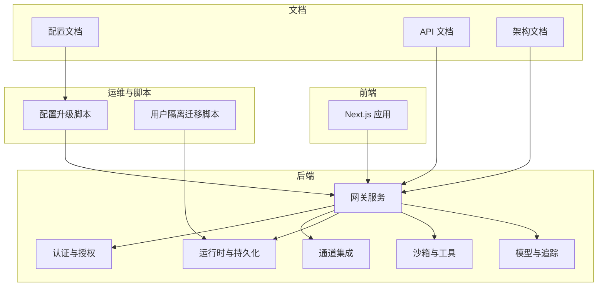
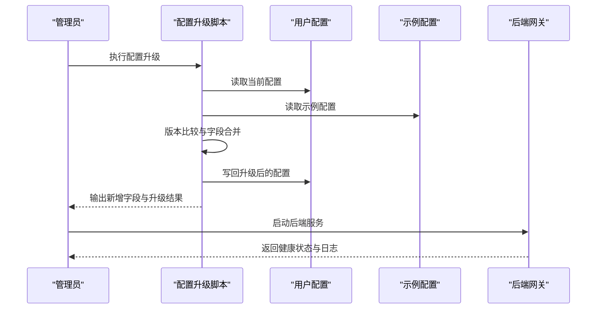
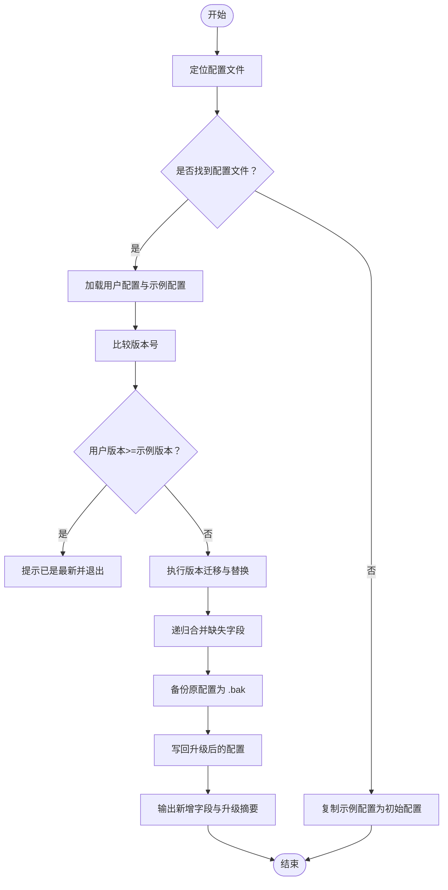
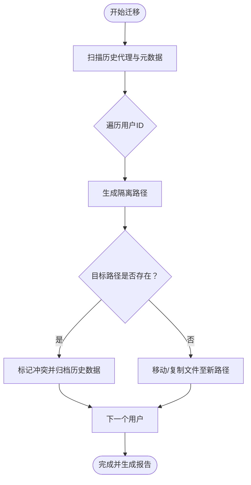
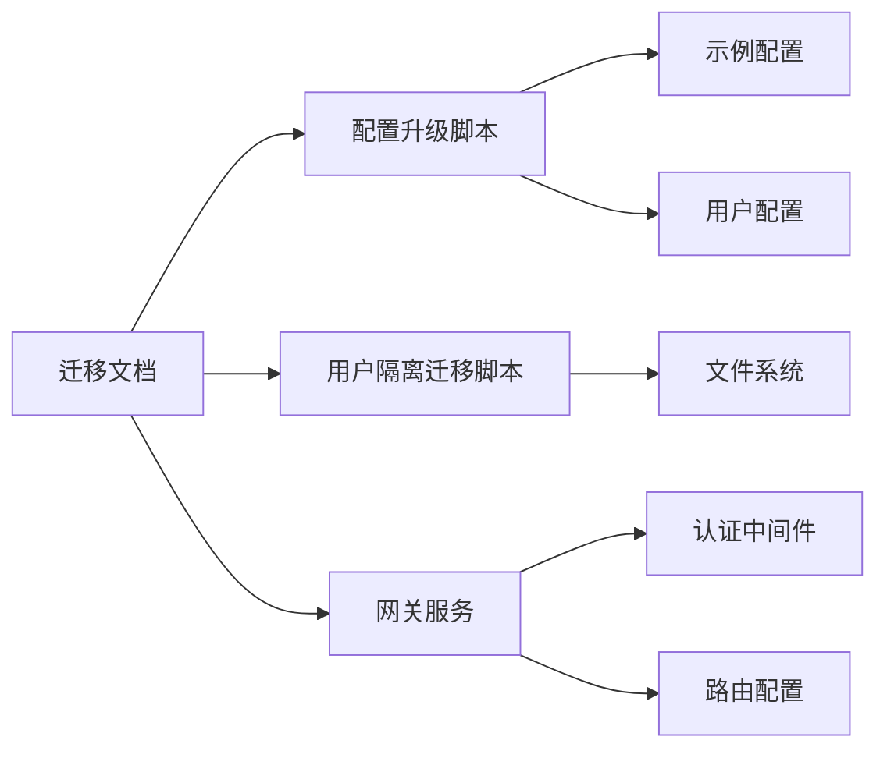

# 迁移指南

<cite>
**本文引用的文件**
- [config-upgrade.sh](file://scripts/config-upgrade.sh)
- [config.example.yaml](file://config.example.yaml)
- [config.yaml](file://config.yaml)
- [migrate_user_isolation.py](file://scripts/migrate_user_isolation.py)
- [test_migration_user_isolation.py](file://backend/tests/test_migration_user_isolation.py)
- [AUTH_UPGRADE.md](file://backend/docs/AUTH_UPGRADE.md)
- [CONFIGURATION.md](file://backend/docs/CONFIGURATION.md)
- [API.md](file://backend/docs/API.md)
- [ARCHITECTURE.md](file://backend/docs/ARCHITECTURE.md)
- [MEMORY_IMPROVEMENTS.md](file://backend/docs/MEMORY_IMPROVEMENTS.md)
- [MEMORY_SETTINGS_REVIEW.md](file://backend/docs/MEMORY_SETTINGS_REVIEW.md)
- [STREAMING.md](file://backend/docs/STREAMING.md)
- [GUARDRAILS.md](file://backend/docs/GUARDRAILS.md)
- [MCP_SERVER.md](file://backend/docs/MCP_SERVER.md)
- [MCP_SERVER_ZH.md](file://backend/docs/MCP_SERVER_ZH.md)
- [MEMORY_IMPROVEMENTS_SUMMARY.md](file://backend/docs/MEMORY_IMPROVEMENTS_SUMMARY.md)
- [MEMORY_SETTINGS_REVIEW.md](file://backend/docs/MEMORY_SETTINGS_REVIEW.md)
- [PATH_EXAMPLES.md](file://backend/docs/PATH_EXAMPLES.md)
- [TITLE_GENERATION_IMPLEMENTATION.md](file://backend/docs/TITLE_GENERATION_IMPLEMENTATION.md)
- [AUTO_TITLE_GENERATION.md](file://backend/docs/AUTO_TITLE_GENERATION.md)
- [SANDBOX_MEMORY_PROFILING.md](file://backend/docs/SANDBOX_MEMORY_PROFILING.md)
- [FILE_UPLOAD.md](file://backend/docs/FILE_UPLOAD.md)
- [BLOCKING_IO_DETECTION.md](file://backend/docs/BLOCKING_IO_DETECTION.md)
- [SETUP.md](file://backend/docs/SETUP.md)
- [README.md](file://backend/README.md)
- [README.md](file://README.md)
</cite>

## 目录
1. [简介](#简介)
2. [项目结构](#项目结构)
3. [核心组件](#核心组件)
4. [架构总览](#架构总览)
5. [详细组件分析](#详细组件分析)
6. [依赖关系分析](#依赖关系分析)
7. [性能考量](#性能考量)
8. [故障排查指南](#故障排查指南)
9. [结论](#结论)
10. [附录](#附录)

## 简介
本迁移指南面向从旧版本或不同配置迁移到 DeerFlow 2.0 的用户，覆盖版本升级步骤、配置变更与 API 调整、配置文件转换工具与自动化迁移脚本、新旧功能对比与废弃项处理、兼容性注意事项、数据迁移方案、配置验证与回滚策略，以及常见迁移问题的解决方案与最佳实践。

## 项目结构
DeerFlow 2.0 采用前后端分离与多模块组织方式：后端包含网关服务、认证与授权、通道集成、运行时与持久化、沙箱与工具、模型与追踪等子系统；前端为 Next.js 应用；scripts 提供运维与迁移工具；docs 提供架构、配置、API 等技术文档。

**图表来源**
- [ARCHITECTURE.md](file://backend/docs/ARCHITECTURE.md)
- [API.md](file://backend/docs/API.md)
- [CONFIGURATION.md](file://backend/docs/CONFIGURATION.md)

**章节来源**
- [README.md](file://README.md)
- [backend/README.md](file://backend/README.md)

## 核心组件
- 配置升级工具：自动检测用户配置版本，执行值替换与字段合并，并备份原配置。
- 用户隔离迁移脚本：将历史代理数据迁移到按用户隔离的新目录结构，冲突处理与报告生成。
- 认证升级文档：指导从旧认证模式到新鉴权体系的迁移流程。
- 配置与 API 文档：定义 2.0 的配置键、默认值、兼容性与 API 变更要点。
- 架构与运行时文档：解释后端模块边界、数据流与扩展点，支撑迁移过程中的集成与适配。

**章节来源**
- [config-upgrade.sh](file://scripts/config-upgrade.sh)
- [migrate_user_isolation.py](file://scripts/migrate_user_isolation.py)
- [AUTH_UPGRADE.md](file://backend/docs/AUTH_UPGRADE.md)
- [CONFIGURATION.md](file://backend/docs/CONFIGURATION.md)
- [API.md](file://backend/docs/API.md)
- [ARCHITECTURE.md](file://backend/docs/ARCHITECTURE.md)

## 架构总览
下图展示迁移相关的系统交互：前端通过网关访问后端服务；配置升级脚本读取示例配置并与用户配置合并；迁移脚本扫描历史数据并写入新的隔离路径；文档为迁移提供规范与参考。

**图表来源**
- [config-upgrade.sh](file://scripts/config-upgrade.sh)
- [CONFIGURATION.md](file://backend/docs/CONFIGURATION.md)

## 详细组件分析

### 配置升级工具（config-upgrade.sh）
- 功能概述
  - 自动识别配置文件位置（环境变量优先、后端目录次之、仓库根目录再次之）。
  - 若未发现配置文件，则直接复制示例配置作为起点。
  - 使用内嵌 Python 执行版本迁移（字符串替换）、递归合并缺失字段、更新版本号。
  - 升级前自动备份为 .bak 文件，便于回滚。
- 升级流程
  - 读取用户配置与示例配置，比较版本号。
  - 执行版本特定替换（如键名变更、值格式调整）。
  - 递归合并示例配置中缺失的键，记录新增字段列表。
  - 写回配置并输出升级摘要。
- 兼容性与回滚
  - 若用户配置版本不小于示例版本，直接提示已最新。
  - 失败或异常时保留备份文件，可手动恢复。
- 使用建议
  - 在升级前确保有完整备份。
  - 升级后逐项核对新增字段与敏感配置（如密钥）。
  - 结合文档检查新增功能开关与默认行为变化。

**图表来源**
- [config-upgrade.sh](file://scripts/config-upgrade.sh)

**章节来源**
- [config-upgrade.sh](file://scripts/config-upgrade.sh)
- [CONFIGURATION.md](file://backend/docs/CONFIGURATION.md)

### 用户隔离迁移脚本（migrate_user_isolation.py）
- 功能概述
  - 将历史代理数据迁移到按用户隔离的新目录结构，避免命名冲突与权限问题。
  - 对于目标路径已存在的冲突，保留现有内容并在冲突目录中落盘历史副本。
- 迁移流程
  - 扫描历史代理目录与元数据。
  - 按用户 ID 生成新的隔离路径。
  - 执行文件移动或复制，记录迁移报告。
  - 对冲突场景进行标记与归档。
- 测试验证
  - 单测覆盖“目标已存在视为冲突”“无历史目录则跳过”等关键分支。
- 回滚策略
  - 迁移失败时可删除新路径并恢复备份。
  - 冲突归档目录可用于人工比对与恢复。

**图表来源**
- [migrate_user_isolation.py](file://scripts/migrate_user_isolation.py)
- [test_migration_user_isolation.py](file://backend/tests/test_migration_user_isolation.py)

**章节来源**
- [migrate_user_isolation.py](file://scripts/migrate_user_isolation.py)
- [test_migration_user_isolation.py](file://backend/tests/test_migration_user_isolation.py)

### 认证与授权迁移（AUTH_UPGRADE.md）
- 主要变更
  - 新增/调整鉴权中间件与权限模型，统一管理凭据与令牌。
  - 引入基于角色的访问控制（RBAC）与资源授权策略。
- 迁移步骤
  - 更新网关路由与中间件链，确保鉴权前置。
  - 重新生成或导入管理员凭据，校验权限范围。
  - 验证第三方通道（如钉钉、飞书、Slack）的回调与鉴权。
- 兼容性
  - 旧版共享密钥或明文口令需迁移至新凭据存储。
  - 逐步关闭旧鉴权入口，确保平滑过渡。

**章节来源**
- [AUTH_UPGRADE.md](file://backend/docs/AUTH_UPGRADE.md)

### 配置与 API 变更要点（CONFIGURATION.md、API.md）
- 配置变更
  - 新增/重命名关键配置键（如内存、流式、守卫栏、MCP 等），默认值与启用策略可能调整。
  - 建议使用配置升级脚本自动合并，再人工核对敏感项。
- API 变更
  - 部分路由参数与响应结构优化，新增分页与过滤选项。
  - 通道接口保持向后兼容，但新增安全与审计字段。
- 运行时与内存
  - 内存队列与上传过滤策略更新，建议结合改进文档评估影响。

**章节来源**
- [CONFIGURATION.md](file://backend/docs/CONFIGURATION.md)
- [API.md](file://backend/docs/API.md)
- [MEMORY_IMPROVEMENTS.md](file://backend/docs/MEMORY_IMPROVEMENTS.md)
- [MEMORY_SETTINGS_REVIEW.md](file://backend/docs/MEMORY_SETTINGS_REVIEW.md)

### 架构与扩展点（ARCHITECTURE.md、MCP_SERVER.md）
- 架构演进
  - 2.0 强化了运行时与持久化的解耦，引入事件存储与流桥接。
  - MCP 服务器作为外部工具扩展点，支持 OAuth 与会话池。
- 迁移建议
  - 评估自定义 MCP 适配器的兼容性，必要时迁移至新接口。
  - 对依赖旧通道实现的功能进行回归测试。

**章节来源**
- [ARCHITECTURE.md](file://backend/docs/ARCHITECTURE.md)
- [MCP_SERVER.md](file://backend/docs/MCP_SERVER.md)
- [MCP_SERVER_ZH.md](file://backend/docs/MCP_SERVER_ZH.md)

## 依赖关系分析
迁移涉及的关键依赖与耦合如下：
- 配置升级脚本依赖示例配置与用户配置的 YAML 结构一致性。
- 用户隔离迁移脚本依赖文件系统权限与路径解析。
- 网关服务依赖认证中间件与路由配置，迁移期间需保证鉴权链路稳定。
- 文档与脚本共同定义迁移规范，形成闭环。

**图表来源**
- [config-upgrade.sh](file://scripts/config-upgrade.sh)
- [migrate_user_isolation.py](file://scripts/migrate_user_isolation.py)
- [AUTH_UPGRADE.md](file://backend/docs/AUTH_UPGRADE.md)
- [CONFIGURATION.md](file://backend/docs/CONFIGURATION.md)

**章节来源**
- [config-upgrade.sh](file://scripts/config-upgrade.sh)
- [migrate_user_isolation.py](file://scripts/migrate_user_isolation.py)
- [AUTH_UPGRADE.md](file://backend/docs/AUTH_UPGRADE.md)
- [CONFIGURATION.md](file://backend/docs/CONFIGURATION.md)

## 性能考量
- 配置升级阶段
  - 大型配置文件的 YAML 解析与合并可能产生额外 IO，建议在低峰期执行。
- 数据迁移阶段
  - 用户隔离迁移涉及大量小文件操作，建议评估磁盘吞吐与并发限制。
- 运行时稳定性
  - 迁移完成后进行压力测试与长时运行观察，关注内存与线程队列变化。

[本节为通用指导，无需列出具体文件来源]

## 故障排查指南
- 配置升级失败
  - 现象：脚本报错或未生成新配置。
  - 排查：检查示例配置完整性、用户配置语法、脚本执行权限与 Python 环境。
  - 处理：查看备份文件并根据错误信息修正后重试。
- 迁移冲突
  - 现象：目标路径已存在导致冲突。
  - 排查：确认冲突归档目录与现有文件差异。
  - 处理：人工比对后决定保留或删除，必要时回滚到备份。
- 认证异常
  - 现象：登录失败或权限不足。
  - 排查：核对凭据导入、中间件顺序与权限策略。
  - 处理：参考认证升级文档重新初始化管理员账户。
- API 不兼容
  - 现象：调用返回结构变化或参数不匹配。
  - 排查：对照 API 文档与变更说明，调整客户端实现。
  - 处理：先在测试环境验证，再灰度发布。

**章节来源**
- [config-upgrade.sh](file://scripts/config-upgrade.sh)
- [test_migration_user_isolation.py](file://backend/tests/test_migration_user_isolation.py)
- [AUTH_UPGRADE.md](file://backend/docs/AUTH_UPGRADE.md)
- [API.md](file://backend/docs/API.md)

## 结论
通过配置升级脚本与用户隔离迁移脚本，配合认证升级与配置/API 文档，DeerFlow 2.0 的迁移路径清晰且可回滚。建议在迁移前制定详细的计划与回滚预案，分阶段验证关键功能，确保业务连续性。

[本节为总结性内容，无需列出具体文件来源]

## 附录

### A. 迁移步骤清单
- 准备阶段
  - 备份所有配置与数据。
  - 下载并阅读迁移相关文档。
- 配置迁移
  - 执行配置升级脚本，核对新增字段与敏感配置。
  - 重启后端服务，验证基础功能。
- 数据迁移
  - 运行用户隔离迁移脚本，检查冲突归档与报告。
  - 验证代理数据可用性与权限隔离。
- 认证与授权
  - 重新初始化管理员凭据，验证鉴权链路。
- API 与通道
  - 对照 API 文档调整客户端调用。
  - 测试第三方通道回调与消息投递。
- 回滚策略
  - 保留 .bak 配置与迁移备份。
  - 冲突归档目录用于人工恢复。
  - 快速回退到上一版本以保障业务。

**章节来源**
- [config-upgrade.sh](file://scripts/config-upgrade.sh)
- [migrate_user_isolation.py](file://scripts/migrate_user_isolation.py)
- [AUTH_UPGRADE.md](file://backend/docs/AUTH_UPGRADE.md)
- [CONFIGURATION.md](file://backend/docs/CONFIGURATION.md)
- [API.md](file://backend/docs/API.md)

### B. 常见问题与最佳实践
- 常见问题
  - 配置版本号异常：确保示例配置与用户配置均有效。
  - 迁移卡顿：检查磁盘空间与并发限制。
  - 通道回调失败：核对回调地址与鉴权头。
- 最佳实践
  - 分批迁移：先迁移非关键代理，再迁移核心业务代理。
  - 渐进验证：每步迁移后进行冒烟测试与回归测试。
  - 文档留痕：记录迁移时间、变更点与回滚路径。

**章节来源**
- [STREAMING.md](file://backend/docs/STREAMING.md)
- [FILE_UPLOAD.md](file://backend/docs/FILE_UPLOAD.md)
- [GUARDRAILS.md](file://backend/docs/GUARDRAILS.md)
- [BLOCKING_IO_DETECTION.md](file://backend/docs/BLOCKING_IO_DETECTION.md)
- [SETUP.md](file://backend/docs/SETUP.md)