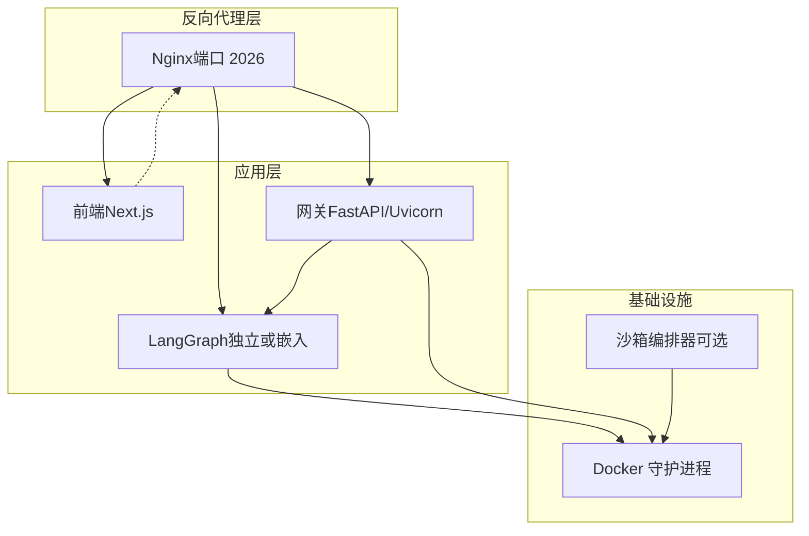
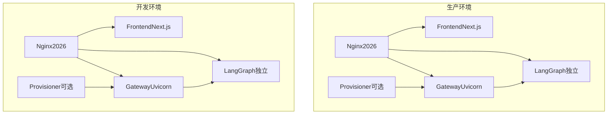
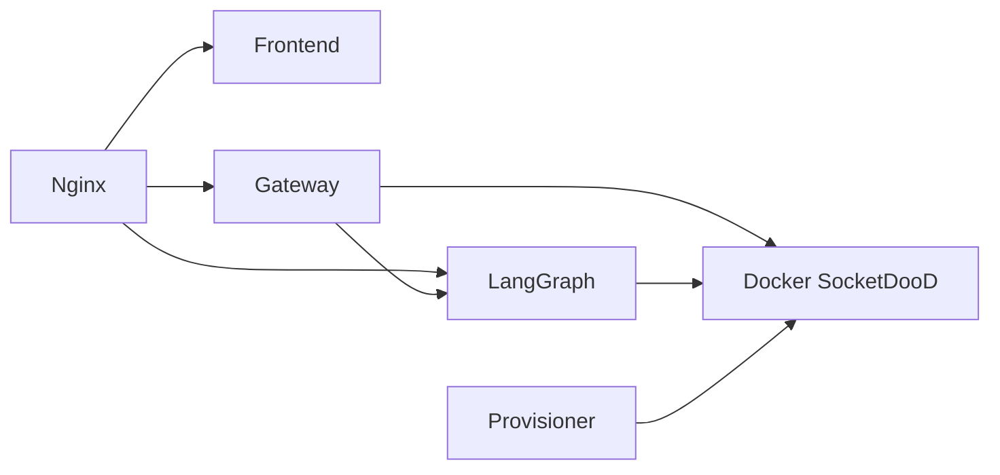

# 部署和运维

<cite>
**本文引用的文件**
- [docker-compose.yaml](file://docker/docker-compose.yaml)
- [docker-compose-dev.yaml](file://docker/docker-compose-dev.yaml)
- [Dockerfile（后端）](file://backend/Dockerfile)
- [Dockerfile（前端）](file://frontend/Dockerfile)
- [Nginx 配置模板](file://docker/nginx/nginx.conf)
- [配置示例（config.example.yaml）](file://config.example.yaml)
- [扩展配置示例（extensions_config.example.json）](file://extensions_config.example.json)
- [部署脚本（deploy.sh）](file://scripts/deploy.sh)
- [Docker 开发脚本（docker.sh）](file://scripts/docker.sh)
- [统一启动脚本（serve.sh）](file://scripts/serve.sh)
- [Makefile](file://Makefile)
</cite>

## 目录
1. [简介](#简介)
2. [项目结构](#项目结构)
3. [核心组件](#核心组件)
4. [架构总览](#架构总览)
5. [详细组件分析](#详细组件分析)
6. [依赖关系分析](#依赖关系分析)
7. [性能考虑](#性能考虑)
8. [故障排除指南](#故障排除指南)
9. [结论](#结论)
10. [附录](#附录)

## 简介
本文件面向运维与平台工程团队，系统化梳理 DeerFlow 的部署与运维实践，覆盖以下主题：
- Docker 生产与开发环境的实现与配置
- 生产环境配置（性能调优、资源分配、负载均衡）
- CI/CD 流程设计（自动化测试、构建流水线、发布策略）
- 性能调优指南（内存优化、并发配置、缓存策略）
- 故障排除手册（常见问题诊断、日志分析、修复步骤）
- 运维监控最佳实践（健康检查、告警配置、应急响应）
- 多环境部署策略（开发、测试、生产差异化配置）

## 项目结构
DeerFlow 采用“前后端分离 + 网关 + LangGraph + 反向代理”的容器化架构。核心服务通过 Docker Compose 编排，Nginx 提供统一入口与路由，后端提供 REST API 与代理转发，前端为 Next.js 应用。

图表来源
- [docker-compose.yaml:24-203](file://docker/docker-compose.yaml#L24-L203)
- [docker-compose-dev.yaml:16-262](file://docker/docker-compose-dev.yaml#L16-L262)
- [Nginx 配置模板:37-237](file://docker/nginx/nginx.conf#L37-L237)

章节来源
- [docker-compose.yaml:1-203](file://docker/docker-compose.yaml#L1-L203)
- [docker-compose-dev.yaml:1-262](file://docker/docker-compose-dev.yaml#L1-L262)
- [Nginx 配置模板:1-237](file://docker/nginx/nginx.conf#L1-L237)

## 核心组件
- 反向代理（Nginx）
  - 统一入口端口 2026；根据环境变量动态生成配置；支持路径级路由与跨域处理；对长连接与流式传输进行优化。
- 前端（Next.js）
  - 支持开发模式（热重载）与生产模式（预构建），通过环境变量注入后端地址。
- 网关（FastAPI/Uvicorn）
  - 提供 REST API 与代理转发；在生产模式下以多进程运行；在 Gateway 模式下嵌入 Agent 运行时。
- LangGraph
  - 可作为独立服务运行，或在 Gateway 模式下由网关内嵌；支持阻塞模式开关与工作进程任务数配置。
- 沙箱编排器（可选）
  - 在开发模式中管理 Pod 生命周期；在生产模式中用于 Kubernetes 场景的沙箱编排。

章节来源
- [docker-compose.yaml:26-167](file://docker/docker-compose.yaml#L26-L167)
- [docker-compose-dev.yaml:67-246](file://docker/docker-compose-dev.yaml#L67-L246)
- [Nginx 配置模板:37-237](file://docker/nginx/nginx.conf#L37-L237)
- [Dockerfile（后端）:63-115](file://backend/Dockerfile#L63-L115)
- [Dockerfile（前端）:26-51](file://frontend/Dockerfile#L26-L51)

## 架构总览
下图展示生产与开发两种部署形态的关键差异：生产模式包含 LangGraph 独立服务；开发模式可选择 Gateway 内嵌运行时或独立 LangGraph，并可启用沙箱编排器。

图表来源
- [docker-compose.yaml:24-167](file://docker/docker-compose.yaml#L24-L167)
- [docker-compose-dev.yaml:16-246](file://docker/docker-compose-dev.yaml#L16-L246)

章节来源
- [docker-compose.yaml:1-203](file://docker/docker-compose.yaml#L1-L203)
- [docker-compose-dev.yaml:1-262](file://docker/docker-compose-dev.yaml#L1-L262)

## 详细组件分析

### Docker 生产部署（docker-compose.yaml）
- 服务编排
  - nginx：反向代理，端口映射 2026，通过环境变量注入上游服务与重写规则。
  - frontend：Next.js 生产镜像，注入后端内部地址与认证密钥。
  - gateway：FastAPI 网关，多进程运行，挂载配置文件与技能目录，支持 Docker-outside-Docker（DooD）。
  - langgraph：LangGraph 服务，支持允许阻塞模式与任务并行度配置。
  - provisioner：可选，用于 Kubernetes 场景的沙箱编排。
- 关键环境变量
  - DEER_FLOW_HOME、DEER_FLOW_CONFIG_PATH、DEER_FLOW_EXTENSIONS_CONFIG_PATH、DEER_FLOW_DOCKER_SOCKET、DEER_FLOW_REPO_ROOT、BETTER_AUTH_SECRET 等。
- 路由与健康检查
  - Nginx 负责将 /api/langgraph/* 路由到 LangGraph 或 Gateway（兼容模式），并提供 /health 健康检查代理。

章节来源
- [docker-compose.yaml:24-203](file://docker/docker-compose.yaml#L24-L203)

### Docker 开发部署（docker-compose-dev.yaml）
- 服务编排
  - 与生产类似，但前端与后端均支持开发模式（热重载），并挂载源码目录以便本地调试。
  - 支持 Gateway 模式（实验性），不启动 LangGraph 容器。
  - provisioner：在宿主机 Kubernetes 上管理沙箱 Pod。
- 缓存与持久化
  - 使用命名卷保存 uv 虚拟环境与缓存，避免 macOS 下符号链接问题导致的启动失败。
- 网络隔离
  - 开发网络使用自定义子网，便于隔离与调试。

章节来源
- [docker-compose-dev.yaml:16-262](file://docker/docker-compose-dev.yaml#L16-L262)

### Nginx 路由与流式传输
- 路由规则
  - /api/langgraph/* → 标准模式：LangGraph；兼容模式：Gateway。
  - /api/models、/api/memory、/api/mcp、/api/skills、/api/agents、/api/threads 等 → Gateway。
  - /api/threads/{id}/uploads → 支持大文件上传与直通。
  - /docs、/redoc、/openapi.json → 文档路由。
  - /health → 网关健康检查。
  - /api/sandboxes → 沙箱编排器 API（按需解析）。
- 流式与长连接
  - 对 SSE/流式响应关闭代理缓冲，设置超时与分块传输编码，确保长连接稳定。

章节来源
- [Nginx 配置模板:37-237](file://docker/nginx/nginx.conf#L37-L237)

### 后端镜像构建（多阶段）
- 构建阶段
  - 安装 Node.js、ODBC 运行库与构建工具，使用 uv 安装依赖。
- 开发阶段
  - 保留工具链，支持启动时同步安装。
- 生产阶段
  - 清净镜像，仅包含运行所需组件，减少攻击面。

章节来源
- [Dockerfile（后端）:1-115](file://backend/Dockerfile#L1-L115)

### 前端镜像构建（多目标）
- dev：仅安装依赖，启动开发服务器。
- prod：安装依赖并构建，运行生产服务器。

章节来源
- [Dockerfile（前端）:1-51](file://frontend/Dockerfile#L1-L51)

### 部署与启动脚本
- scripts/deploy.sh
  - 支持 build/start/down；自动检测沙箱模式（local/aio/provisioner）；生成/加载 BETTER_AUTH_SECRET；设置路由上游与重写规则。
- scripts/docker.sh
  - 开发环境脚本，支持 init/start/restart/logs/stop；自动拉取沙箱镜像；根据配置自动选择服务集合。
- scripts/serve.sh
  - 本地统一启动器，支持 dev/prod、gateway、daemon、stop/restart 等模式；自动等待端口就绪并输出日志路径。
- Makefile
  - 提供统一命令入口，封装部署、日志查看、清理等操作。

章节来源
- [部署脚本（deploy.sh）:1-301](file://scripts/deploy.sh#L1-L301)
- [Docker 开发脚本（docker.sh）:1-396](file://scripts/docker.sh#L1-L396)
- [统一启动脚本（serve.sh）:1-332](file://scripts/serve.sh#L1-L332)
- [Makefile:1-218](file://Makefile#L1-L218)

### 配置与扩展
- config.yaml
  - 包含模型、工具、沙箱、子代理、标题生成、摘要、记忆、技能演进等配置项；支持环境变量注入与版本升级。
- extensions_config.json
  - MCP 服务器与拦截器配置，支持外部工具链集成。

章节来源
- [配置示例（config.example.yaml）:1-981](file://config.example.yaml#L1-L981)
- [扩展配置示例（extensions_config.example.json）:1-45](file://extensions_config.example.json#L1-L45)

## 依赖关系分析
- 组件耦合
  - Nginx 依赖后端服务（Gateway/LangGraph/Frontend）；Gateway 依赖 LangGraph（标准模式）或内置运行时（Gateway 模式）。
  - 后端通过 Docker Socket 访问宿主 Docker（DooD），用于沙箱容器生命周期管理。
- 外部依赖
  - Docker、uv、Node.js、Python 环境；可选：Kubernetes 与 MCP 服务器。
- 循环依赖
  - 无直接循环依赖；服务间通过 Nginx 与环境变量解耦。

图表来源
- [docker-compose.yaml:24-167](file://docker/docker-compose.yaml#L24-L167)
- [docker-compose-dev.yaml:16-246](file://docker/docker-compose-dev.yaml#L16-L246)

章节来源
- [docker-compose.yaml:24-167](file://docker/docker-compose.yaml#L24-L167)
- [docker-compose-dev.yaml:16-246](file://docker/docker-compose-dev.yaml#L16-L246)

## 性能考虑
- 并发与进程
  - 后端 Uvicorn 工作进程数可通过环境变量配置；LangGraph 任务并行度通过参数控制。
- I/O 与流式
  - Nginx 对 SSE/流式响应禁用缓冲、设置长超时与分块传输，保障长连接稳定性。
- 缓存与镜像
  - 后端镜像使用 uv 缓存与虚拟环境持久化，减少重复安装时间；前端镜像复用包管理器缓存。
- 网络与路由
  - 开发网络使用自定义子网，避免冲突；生产环境通过 Nginx 统一入口与健康检查。
- 资源分配
  - 建议为各服务设置 CPU/内存限制与重启策略，结合容器编排平台进行弹性伸缩。

章节来源
- [docker-compose.yaml:77-130](file://docker/docker-compose.yaml#L77-L130)
- [docker-compose-dev.yaml:129-216](file://docker/docker-compose-dev.yaml#L129-L216)
- [Nginx 配置模板:75-87](file://docker/nginx/nginx.conf#L75-L87)

## 故障排除指南
- 常见问题
  - Docker Socket 未找到：DooD 将无法启动沙箱容器。请确认宿主 Docker 可用且挂载路径正确。
  - 端口占用：LangGraph（2024）、Gateway（8001）、Frontend（3000）、Nginx（2026）被占用时需释放端口。
  - 配置缺失：未生成 config.yaml 或 extensions_config.json 导致启动失败。使用部署脚本自动创建或手动复制示例文件。
  - 前端认证密钥：生产模式需设置 BETTER_AUTH_SECRET，脚本会自动生成并持久化。
- 日志定位
  - 开发：通过 Makefile 提供的日志命令查看各服务日志。
  - 生产：容器日志位于各服务标准输出；Nginx 访问/错误日志输出至 stdout/stderr。
- 修复步骤
  - 重新构建镜像并启动；检查环境变量与挂载路径；验证 MCP 服务器与模型 API Key；确认沙箱镜像已拉取。

章节来源
- [部署脚本（deploy.sh）:70-142](file://scripts/deploy.sh#L70-L142)
- [Docker 开发脚本（docker.sh）:102-163](file://scripts/docker.sh#L102-L163)
- [统一启动脚本（serve.sh）:70-96](file://scripts/serve.sh#L70-L96)
- [Makefile:194-201](file://Makefile#L194-L201)

## 结论
DeerFlow 提供了清晰的容器化部署方案与多模式运行能力。通过 Nginx 统一入口、后端网关与 LangGraph 的灵活组合，既能满足开发调试需求，也能支撑生产环境的高可用与可观测性。建议在生产环境中结合资源配额、健康检查与告警策略，持续优化性能与稳定性。

## 附录

### CI/CD 流程设计与实现
- 自动化测试
  - 后端与前端分别提供测试入口；建议在流水线中执行单元测试与端到端测试。
- 构建流水线
  - 使用 Docker 多阶段构建镜像；在受限网络环境下通过镜像仓库与缓存优化下载速度。
- 发布策略
  - 采用蓝绿/滚动发布策略；通过环境变量切换上游与重写规则，实现平滑迁移。

章节来源
- [Makefile:67-78](file://Makefile#L67-L78)
- [Dockerfile（后端）:56-61](file://backend/Dockerfile#L56-L61)
- [Dockerfile（前端）:33-35](file://frontend/Dockerfile#L33-L35)

### 运维监控最佳实践
- 健康检查
  - 利用 Nginx 将 /health 代理到 Gateway；在生产环境中为各服务配置健康检查与重启策略。
- 告警配置
  - 基于容器日志与指标（CPU/内存/请求延迟）设置阈值告警；结合 Nginx 访问日志分析异常流量。
- 应急响应
  - 快速回滚与灰度发布；保留配置与数据卷备份；通过 Makefile 快速停止/重启服务。

章节来源
- [Nginx 配置模板:193-201](file://docker/nginx/nginx.conf#L193-L201)
- [docker-compose.yaml:195-199](file://docker/docker-compose.yaml#L195-L199)
- [Makefile:215-218](file://Makefile#L215-L218)

### 多环境部署策略
- 开发环境
  - 使用 docker-compose-dev.yaml，启用热重载与源码挂载；可选启用沙箱编排器。
- 测试环境
  - 使用生产镜像与最小化配置；启用健康检查与日志采集；模拟真实流量。
- 生产环境
  - 使用 docker-compose.yaml，严格限制资源与重启策略；启用 LangSmith 跟踪（可选）；通过 Nginx 提供统一入口与 TLS（如需）。

章节来源
- [docker-compose-dev.yaml:1-262](file://docker/docker-compose-dev.yaml#L1-L262)
- [docker-compose.yaml:1-203](file://docker/docker-compose.yaml#L1-L203)