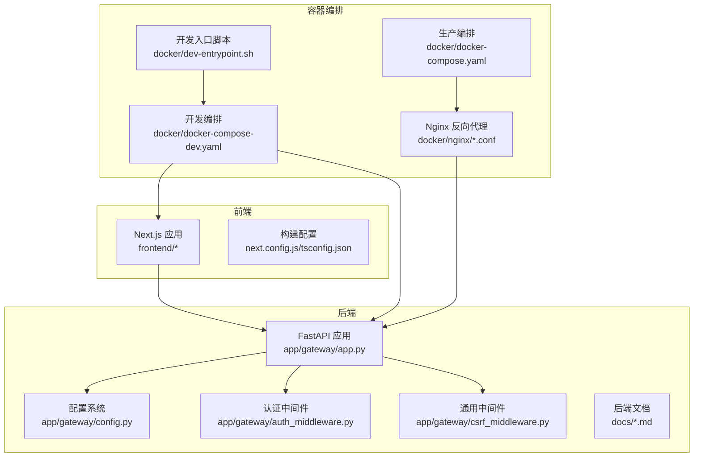
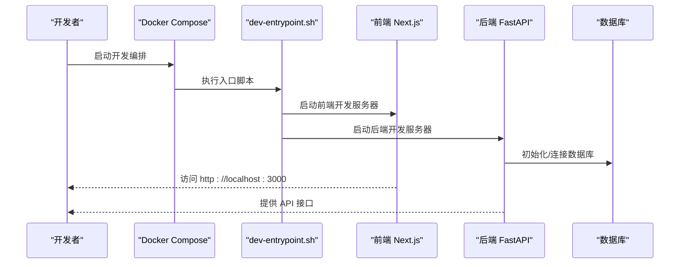
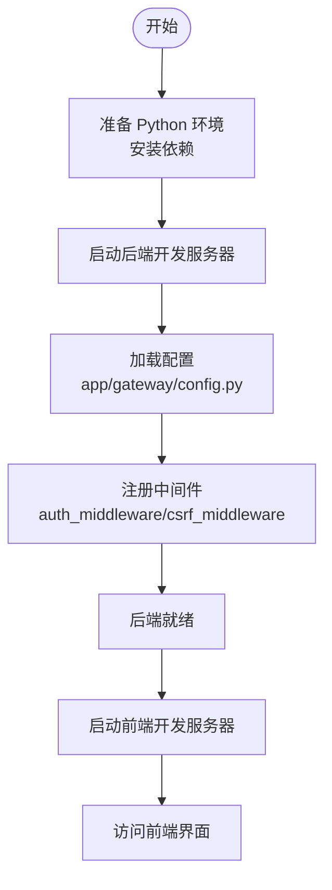
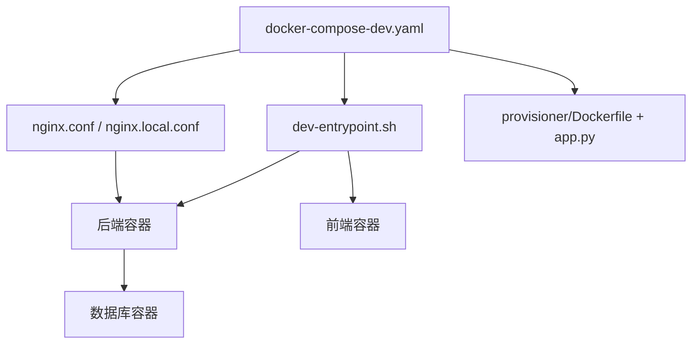
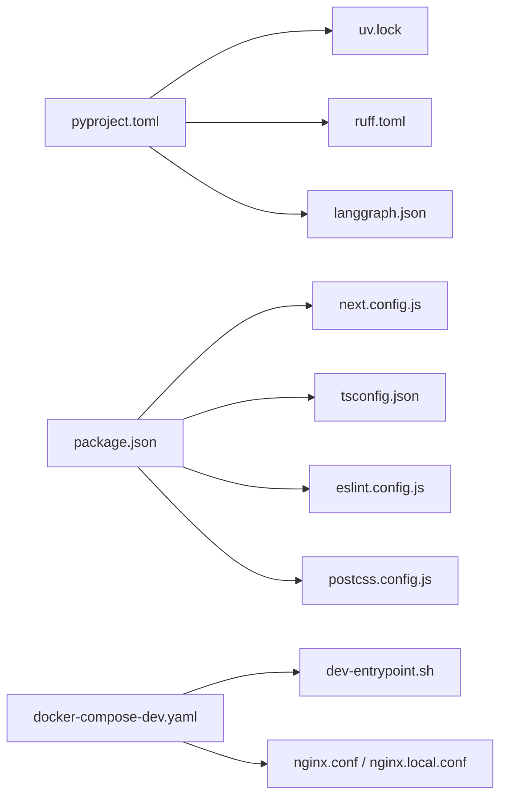

# 开发环境部署

<cite>
**本文引用的文件**
- [backend/pyproject.toml](file://backend/pyproject.toml)
- [backend/Dockerfile](file://backend/Dockerfile)
- [backend/README.md](file://backend/README.md)
- [backend/uv.lock](file://backend/uv.lock)
- [backend/sitecustomize.py](file://backend/sitecustomize.py)
- [backend/debug.py](file://backend/debug.py)
- [backend/langgraph.json](file://backend/langgraph.json)
- [backend/ruff.toml](file://backend/ruff.toml)
- [backend/Makefile](file://backend/Makefile)
- [backend/app/gateway/app.py](file://backend/app/gateway/app.py)
- [backend/app/gateway/config.py](file://backend/app/gateway/config.py)
- [backend/app/gateway/deps.py](file://backend/app/gateway/deps.py)
- [backend/app/gateway/utils.py](file://backend/app/gateway/utils.py)
- [backend/app/gateway/auth_middleware.py](file://backend/app/gateway/auth_middleware.py)
- [backend/app/gateway/csrf_middleware.py](file://backend/app/gateway/csrf_middleware.py)
- [backend/app/gateway/internal_auth.py](file://backend/app/gateway/internal_auth.py)
- [backend/app/gateway/langgraph_auth.py](file://backend/app/gateway/langgraph_auth.py)
- [backend/docs/SETUP.md](file://backend/docs/SETUP.md)
- [backend/docs/CONFIGURATION.md](file://backend/docs/CONFIGURATION.md)
- [backend/docs/AUTH_DESIGN.md](file://backend/docs/AUTH_DESIGN.md)
- [backend/docs/middleware-execution-flow.md](file://backend/docs/middleware-execution-flow.md)
- [backend/packages/harness/pyproject.toml](file://backend/packages/harness/pyproject.toml)
- [frontend/package.json](file://frontend/package.json)
- [frontend/next.config.js](file://frontend/next.config.js)
- [frontend/tsconfig.json](file://frontend/tsconfig.json)
- [frontend/eslint.config.js](file://frontend/eslint.config.js)
- [frontend/postcss.config.js](file://frontend/postcss.config.js)
- [frontend/vitest.config.ts](file://frontend/vitest.config.ts)
- [frontend/Makefile](file://frontend/Makefile)
- [frontend/README.md](file://frontend/README.md)
- [docker/docker-compose-dev.yaml](file://docker/docker-compose-dev.yaml)
- [docker/docker-compose.yaml](file://docker/docker-compose.yaml)
- [docker/dev-entrypoint.sh](file://docker/dev-entrypoint.sh)
- [docker/nginx/nginx.conf](file://docker/nginx/nginx.conf)
- [docker/nginx/nginx.local.conf](file://docker/nginx/nginx.local.conf)
- [docker/provisioner/Dockerfile](file://docker/provisioner/Dockerfile)
- [docker/provisioner/app.py](file://docker/provisioner/app.py)
- [scripts/setup_wizard.py](file://scripts/setup_wizard.py)
- [scripts/check.sh](file://scripts/check.sh)
- [scripts/doctor.py](file://scripts/doctor.py)
- [scripts/wait-for-port.sh](file://scripts/wait-for-port.sh)
- [scripts/sync_labels.py](file://scripts/sync_labels.py)
- [scripts/config-upgrade.sh](file://scripts/config-upgrade.sh)
- [.agent/skills/smoke-test/scripts/deploy_docker.sh](file://.agent/skills/smoke-test/scripts/deploy_docker.sh)
- [config.example.yaml](file://config.example.yaml)
- [extensions_config.example.json](file://extensions_config.example.json)
</cite>

## 目录
1. [简介](#简介)
2. [项目结构](#项目结构)
3. [核心组件](#核心组件)
4. [架构总览](#架构总览)
5. [详细组件分析](#详细组件分析)
6. [依赖分析](#依赖分析)
7. [性能考虑](#性能考虑)
8. [故障排除指南](#故障排除指南)
9. [结论](#结论)
10. [附录](#附录)

## 简介
本指南面向开发者，提供从零搭建 deer-flow 本地与 Docker 开发环境的完整流程，涵盖 Python 环境配置、依赖安装、开发服务器启动、Docker 编排、端口映射、服务依赖关系、调试配置、热重载与代码同步策略，以及常见问题排查与环境变量配置说明。内容基于仓库中的实际配置文件与脚本整理而成，确保可操作性与准确性。

## 项目结构
项目采用前后端分离架构，后端为 Python/FastAPI 应用，前端为 Next.js（TypeScript），并通过 Docker 进行统一编排。关键目录与职责如下：
- backend：后端应用与工具链，包含网关服务、认证中间件、配置与文档
- frontend：前端应用，Next.js + TypeScript
- docker：Docker 编排与入口脚本，包含 Nginx 配置与 provisioner 容器
- scripts：开发辅助脚本，如环境检查、医生模式、端口等待等
- docs：后端开发与配置文档
- config.example.yaml / extensions_config.example.json：示例配置文件

**图表来源**
- [backend/app/gateway/app.py](file://backend/app/gateway/app.py)
- [backend/app/gateway/config.py](file://backend/app/gateway/config.py)
- [backend/app/gateway/auth_middleware.py](file://backend/app/gateway/auth_middleware.py)
- [backend/app/gateway/csrf_middleware.py](file://backend/app/gateway/csrf_middleware.py)
- [docker/docker-compose-dev.yaml](file://docker/docker-compose-dev.yaml)
- [docker/docker-compose.yaml](file://docker/docker-compose.yaml)
- [docker/nginx/nginx.conf](file://docker/nginx/nginx.conf)
- [docker/dev-entrypoint.sh](file://docker/dev-entrypoint.sh)

**章节来源**
- [backend/README.md](file://backend/README.md)
- [frontend/README.md](file://frontend/README.md)
- [docker/docker-compose-dev.yaml](file://docker/docker-compose-dev.yaml)
- [docker/docker-compose.yaml](file://docker/docker-compose.yaml)

## 核心组件
- 后端网关服务：基于 FastAPI 的主服务，负责路由、认证、中间件与业务接口
- 前端 Next.js 应用：提供管理界面与交互体验
- Docker 编排：通过 docker-compose 统一启动后端、数据库、Nginx 等服务
- 开发脚本：环境检查、端口等待、配置升级与医生模式等

**章节来源**
- [backend/app/gateway/app.py](file://backend/app/gateway/app.py)
- [frontend/package.json](file://frontend/package.json)
- [docker/docker-compose-dev.yaml](file://docker/docker-compose-dev.yaml)
- [scripts/doctor.py](file://scripts/doctor.py)

## 架构总览
下图展示开发环境的典型启动顺序与服务交互：

**图表来源**
- [docker/dev-entrypoint.sh](file://docker/dev-entrypoint.sh)
- [docker/docker-compose-dev.yaml](file://docker/docker-compose-dev.yaml)
- [frontend/next.config.js](file://frontend/next.config.js)
- [backend/app/gateway/app.py](file://backend/app/gateway/app.py)

## 详细组件分析

### 后端开发环境搭建
- Python 环境与依赖
  - 使用 uv 作为包管理与锁定工具，依赖版本在锁文件中固定
  - 通过 pyproject.toml 指定项目元数据、依赖与脚本
  - 支持开发模式下的自动重载与调试配置
- 开发服务器启动
  - 后端应用入口位于网关模块，结合配置系统与中间件
  - 调试与日志可通过站点自定义脚本与配置文件启用
- 认证与中间件
  - 提供 CSRF 中间件、内部认证与 LangGraph 认证集成
  - 中间件执行流程可参考文档说明

**图表来源**
- [backend/pyproject.toml](file://backend/pyproject.toml)
- [backend/uv.lock](file://backend/uv.lock)
- [backend/app/gateway/app.py](file://backend/app/gateway/app.py)
- [backend/app/gateway/config.py](file://backend/app/gateway/config.py)
- [backend/app/gateway/auth_middleware.py](file://backend/app/gateway/auth_middleware.py)
- [backend/app/gateway/csrf_middleware.py](file://backend/app/gateway/csrf_middleware.py)

**章节来源**
- [backend/pyproject.toml](file://backend/pyproject.toml)
- [backend/uv.lock](file://backend/uv.lock)
- [backend/sitecustomize.py](file://backend/sitecustomize.py)
- [backend/debug.py](file://backend/debug.py)
- [backend/app/gateway/app.py](file://backend/app/gateway/app.py)
- [backend/app/gateway/config.py](file://backend/app/gateway/config.py)
- [backend/app/gateway/auth_middleware.py](file://backend/app/gateway/auth_middleware.py)
- [backend/app/gateway/csrf_middleware.py](file://backend/app/gateway/csrf_middleware.py)

### 前端开发环境搭建
- 依赖与构建
  - 通过 package.json 管理依赖与脚本
  - 构建配置由 next.config.js、tsconfig.json、eslint.config.js、postcss.config.js 等文件定义
- 开发服务器
  - 使用 Next.js 开发服务器，支持热重载
  - 测试框架 Vitest 配置于 vitest.config.ts
- 文档与示例
  - 前端 README 提供快速开始与使用说明

**章节来源**
- [frontend/package.json](file://frontend/package.json)
- [frontend/next.config.js](file://frontend/next.config.js)
- [frontend/tsconfig.json](file://frontend/tsconfig.json)
- [frontend/eslint.config.js](file://frontend/eslint.config.js)
- [frontend/postcss.config.js](file://frontend/postcss.config.js)
- [frontend/vitest.config.ts](file://frontend/vitest.config.ts)
- [frontend/README.md](file://frontend/README.md)

### Docker 开发环境搭建
- 开发编排
  - docker-compose-dev.yaml 定义开发阶段的服务编排，包含后端、前端、数据库与 Nginx
  - docker-compose.yaml 定义生产或测试阶段的编排
- 入口脚本
  - dev-entrypoint.sh 在容器启动时执行，负责初始化与启动各服务
- Nginx 配置
  - nginx.conf 与 nginx.local.conf 提供反向代理与本地开发配置
- provisioner 容器
  - 独立的 provisioner 容器用于资源预置与初始化

**图表来源**
- [docker/docker-compose-dev.yaml](file://docker/docker-compose-dev.yaml)
- [docker/docker-compose.yaml](file://docker/docker-compose.yaml)
- [docker/dev-entrypoint.sh](file://docker/dev-entrypoint.sh)
- [docker/nginx/nginx.conf](file://docker/nginx/nginx.conf)
- [docker/nginx/nginx.local.conf](file://docker/nginx/nginx.local.conf)
- [docker/provisioner/Dockerfile](file://docker/provisioner/Dockerfile)
- [docker/provisioner/app.py](file://docker/provisioner/app.py)

**章节来源**
- [docker/docker-compose-dev.yaml](file://docker/docker-compose-dev.yaml)
- [docker/docker-compose.yaml](file://docker/docker-compose.yaml)
- [docker/dev-entrypoint.sh](file://docker/dev-entrypoint.sh)
- [docker/nginx/nginx.conf](file://docker/nginx/nginx.conf)
- [docker/nginx/nginx.local.conf](file://docker/nginx/nginx.local.conf)
- [docker/provisioner/Dockerfile](file://docker/provisioner/Dockerfile)
- [docker/provisioner/app.py](file://docker/provisioner/app.py)

### 调试配置、热重载与代码同步
- 后端调试
  - 调试入口与站点自定义脚本可用于开发调试
  - 配置系统支持动态加载与边界重载
- 前端热重载
  - Next.js 开发服务器默认启用热重载
  - ESLint、Prettier 与 TypeScript 配置保证开发一致性
- 代码同步
  - 通过 Docker 卷挂载实现代码同步
  - provisioner 容器可配合资源预置

**章节来源**
- [backend/debug.py](file://backend/debug.py)
- [backend/sitecustomize.py](file://backend/sitecustomize.py)
- [backend/app/gateway/reload_boundary.py](file://backend/app/gateway/reload_boundary.py)
- [frontend/next.config.js](file://frontend/next.config.js)
- [frontend/eslint.config.js](file://frontend/eslint.config.js)
- [frontend/postcss.config.js](file://frontend/postcss.config.js)

### 环境变量与配置
- 示例配置
  - config.example.yaml 与 extensions_config.example.json 提供环境变量与扩展配置示例
- 后端配置系统
  - 配置文件与加载逻辑位于网关配置模块
  - 认证设计与中间件执行流程见相关文档
- 前端环境
  - Next.js 环境变量与构建配置由 next.config.js 与 tsconfig.json 管理

**章节来源**
- [config.example.yaml](file://config.example.yaml)
- [extensions_config.example.json](file://extensions_config.example.json)
- [backend/app/gateway/config.py](file://backend/app/gateway/config.py)
- [backend/docs/CONFIGURATION.md](file://backend/docs/CONFIGURATION.md)
- [backend/docs/AUTH_DESIGN.md](file://backend/docs/AUTH_DESIGN.md)
- [backend/docs/middleware-execution-flow.md](file://backend/docs/middleware-execution-flow.md)
- [frontend/next.config.js](file://frontend/next.config.js)
- [frontend/tsconfig.json](file://frontend/tsconfig.json)

## 依赖分析
- 后端依赖
  - 包管理与锁定：pyproject.toml 与 uv.lock
  - 语言与工具：Ruff 代码规范配置
  - 运行时：LangGraph 配置与运行时路径
- 前端依赖
  - 包管理：package.json
  - 构建与质量：next.config.js、tsconfig.json、eslint.config.js、postcss.config.js
- Docker 依赖
  - 编排：docker-compose-dev.yaml 与 docker-compose.yaml
  - 入口：dev-entrypoint.sh
  - 反向代理：nginx.conf 与 nginx.local.conf

**图表来源**
- [backend/pyproject.toml](file://backend/pyproject.toml)
- [backend/uv.lock](file://backend/uv.lock)
- [backend/ruff.toml](file://backend/ruff.toml)
- [backend/langgraph.json](file://backend/langgraph.json)
- [frontend/package.json](file://frontend/package.json)
- [frontend/next.config.js](file://frontend/next.config.js)
- [frontend/tsconfig.json](file://frontend/tsconfig.json)
- [frontend/eslint.config.js](file://frontend/eslint.config.js)
- [frontend/postcss.config.js](file://frontend/postcss.config.js)
- [docker/docker-compose-dev.yaml](file://docker/docker-compose-dev.yaml)
- [docker/dev-entrypoint.sh](file://docker/dev-entrypoint.sh)
- [docker/nginx/nginx.conf](file://docker/nginx/nginx.conf)

**章节来源**
- [backend/pyproject.toml](file://backend/pyproject.toml)
- [backend/uv.lock](file://backend/uv.lock)
- [backend/ruff.toml](file://backend/ruff.toml)
- [backend/langgraph.json](file://backend/langgraph.json)
- [frontend/package.json](file://frontend/package.json)
- [frontend/next.config.js](file://frontend/next.config.js)
- [frontend/tsconfig.json](file://frontend/tsconfig.json)
- [frontend/eslint.config.js](file://frontend/eslint.config.js)
- [frontend/postcss.config.js](file://frontend/postcss.config.js)
- [docker/docker-compose-dev.yaml](file://docker/docker-compose-dev.yaml)
- [docker/dev-entrypoint.sh](file://docker/dev-entrypoint.sh)
- [docker/nginx/nginx.conf](file://docker/nginx/nginx.conf)

## 性能考虑
- 后端性能
  - 使用 uv 与锁定文件确保依赖版本稳定，减少运行时差异
  - Ruff 规范化有助于提升代码质量与可维护性
- 前端性能
  - Next.js 开发服务器默认优化热重载与增量编译
  - ESLint 与 Prettier 降低格式化开销
- Docker 性能
  - 合理的卷挂载与缓存策略可减少重复构建
  - Nginx 反向代理减少后端直连压力

## 故障排除指南
- 环境检查
  - 使用 scripts/check.sh 与 scripts/doctor.py 快速诊断环境问题
- 端口等待
  - 使用 scripts/wait-for-port.sh 等待服务端口可用
- 配置升级
  - 使用 scripts/config-upgrade.sh 升级配置
- 合规与安全
  - 使用 scripts/sync_labels.py 同步标签与合规信息
- Docker 部署验证
  - .agent/skills/smoke-test/scripts/deploy_docker.sh 提供 Docker 部署与健康检查脚本

**章节来源**
- [scripts/check.sh](file://scripts/check.sh)
- [scripts/doctor.py](file://scripts/doctor.py)
- [scripts/wait-for-port.sh](file://scripts/wait-for-port.sh)
- [scripts/config-upgrade.sh](file://scripts/config-upgrade.sh)
- [scripts/sync_labels.py](file://scripts/sync_labels.py)
- [.agent/skills/smoke-test/scripts/deploy_docker.sh](file://.agent/skills/smoke-test/scripts/deploy_docker.sh)

## 结论
通过本指南，您可以在本地与 Docker 环境中快速搭建 deer-flow 的开发环境。建议优先使用 Docker 开发编排以获得一致的运行环境，同时利用热重载与调试配置提升开发效率。遇到问题时，可借助内置脚本与文档进行定位与修复。

## 附录
- 快速开始
  - 安装依赖：使用 uv 与锁定文件安装后端依赖；使用包管理器安装前端依赖
  - 启动开发编排：使用 docker-compose-dev.yaml 启动服务
  - 访问应用：前端默认端口 3000，后端 API 默认端口由后端配置决定
- 常用命令
  - 后端：参考后端 Makefile 与 pyproject.toml 中的脚本
  - 前端：参考前端 Makefile 与 package.json 中的脚本
  - Docker：参考 docker 目录下的编排与入口脚本

**章节来源**
- [backend/Makefile](file://backend/Makefile)
- [frontend/Makefile](file://frontend/Makefile)
- [docker/docker-compose-dev.yaml](file://docker/docker-compose-dev.yaml)
- [docker/dev-entrypoint.sh](file://docker/dev-entrypoint.sh)