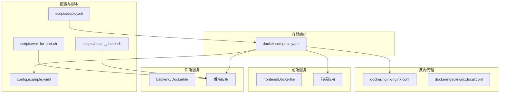
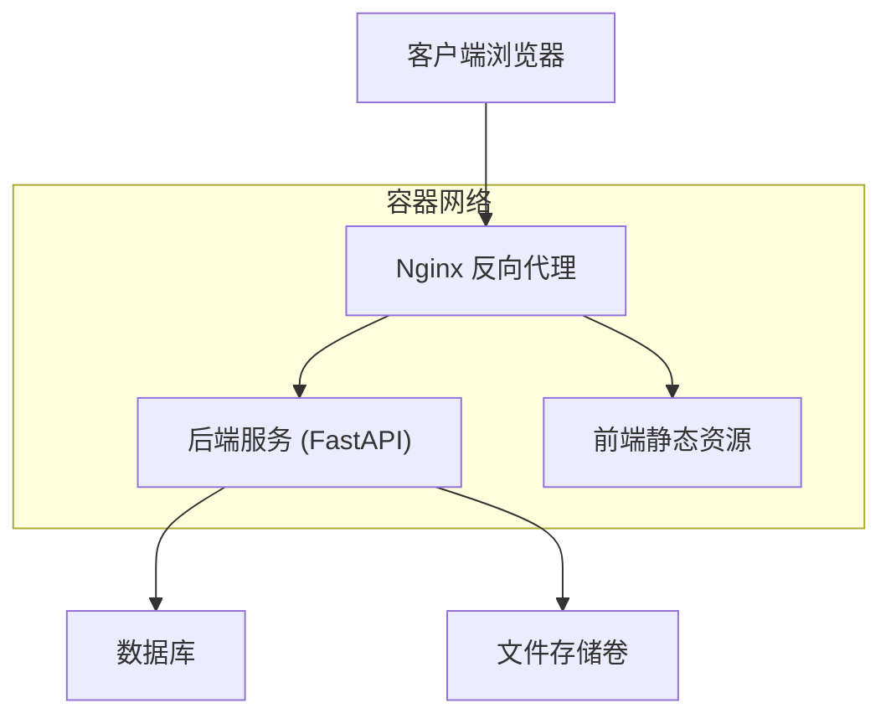
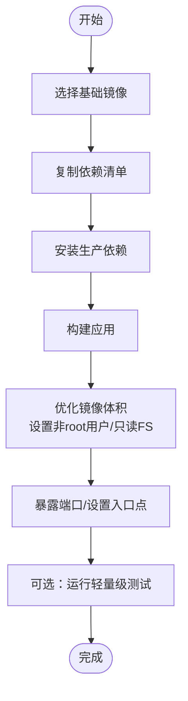
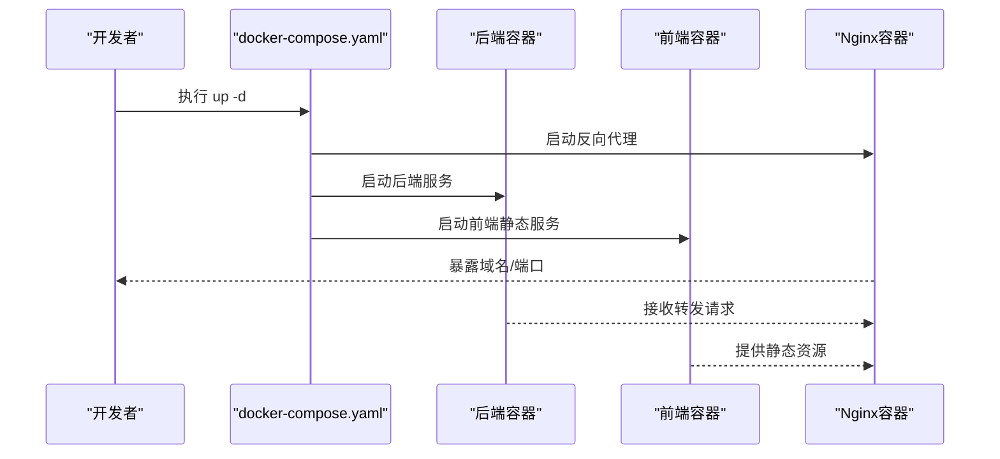
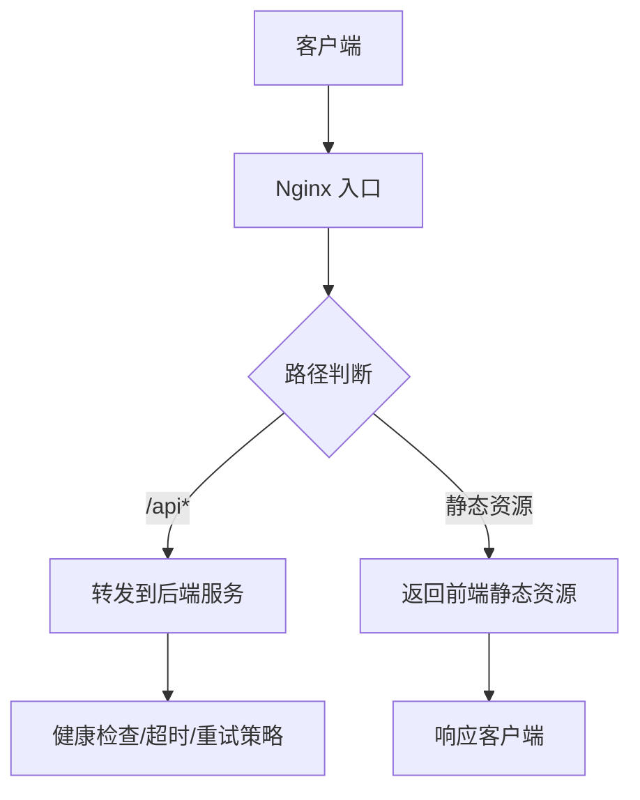
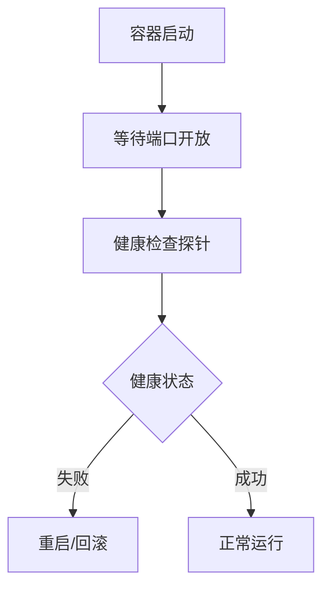
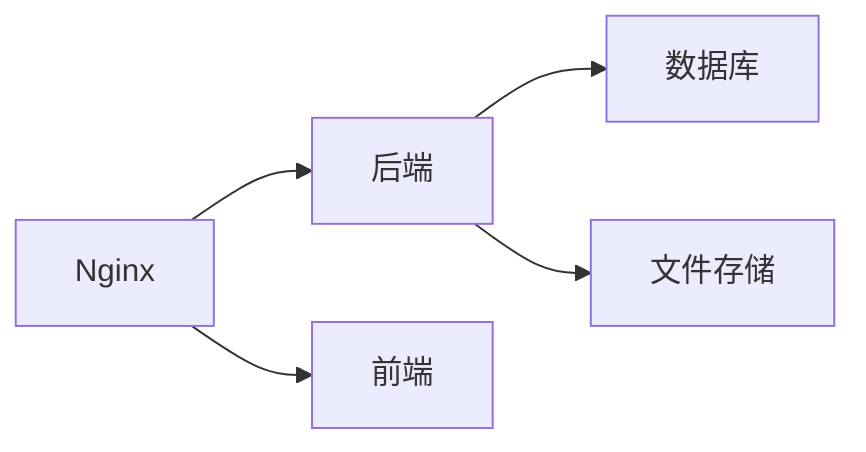

# 生产环境部署

<cite>
**本文引用的文件**
- [docker-compose.yaml](file://docker/docker-compose.yaml)
- [nginx.conf](file://docker/nginx/nginx.conf)
- [nginx.local.conf](file://docker/nginx/nginx.local.conf)
- [backend/Dockerfile](file://backend/Dockerfile)
- [frontend/Dockerfile](file://frontend/Dockerfile)
- [provisioner/Dockerfile](file://docker/provisioner/Dockerfile)
- [config.example.yaml](file://config.example.yaml)
- [deploy.sh](file://scripts/deploy.sh)
- [dev-entrypoint.sh](file://docker/dev-entrypoint.sh)
- [health_check.sh](file://.agent/skills/smoke-test/scripts/health_check.sh)
- [check_docker.sh](file://.agent/skills/smoke-test/scripts/check_docker.sh)
- [deploy_docker.sh](file://.agent/skills/smoke-test/scripts/deploy_docker.sh)
- [pull_code.sh](file://.agent/skills/smoke-test/scripts/pull_code.sh)
- [frontend_check.sh](file://.agent/skills/smoke-test/scripts/frontend_check.sh)
- [docker.sh](file://scripts/docker.sh)
- [wait-for-port.sh](file://scripts/wait-for-port.sh)
</cite>

## 目录
1. [简介](#简介)
2. [项目结构](#项目结构)
3. [核心组件](#核心组件)
4. [架构总览](#架构总览)
5. [详细组件分析](#详细组件分析)
6. [依赖关系分析](#依赖关系分析)
7. [性能考虑](#性能考虑)
8. [故障排查指南](#故障排查指南)
9. [结论](#结论)
10. [附录](#附录)

## 简介
本指南面向生产环境部署，围绕Docker生产镜像构建、容器编排与服务配置、Nginx反向代理与SSL、数据库与文件存储、环境变量管理、性能优化与资源限制、健康检查、监控与日志、告警等主题，结合仓库中的实际配置文件进行说明。读者可据此完成从镜像构建到服务上线的全流程部署。

## 项目结构
该仓库采用多模块结构：后端（FastAPI）、前端（Next.js）、Nginx反向代理、Docker Compose编排、脚本与自动化工具。生产部署主要涉及以下文件：
- 后端与前端的Dockerfile用于构建生产镜像
- docker-compose.yaml定义服务编排与网络、卷、环境变量
- Nginx配置文件提供反向代理与本地开发配置
- 配置示例文件用于环境变量与运行参数
- 部署脚本与健康检查脚本用于自动化与运维保障

**图表来源**
- [docker-compose.yaml](file://docker/docker-compose.yaml)
- [backend/Dockerfile](file://backend/Dockerfile)
- [frontend/Dockerfile](file://frontend/Dockerfile)
- [nginx.conf](file://docker/nginx/nginx.conf)
- [nginx.local.conf](file://docker/nginx/nginx.local.conf)
- [config.example.yaml](file://config.example.yaml)
- [deploy.sh](file://scripts/deploy.sh)
- [health_check.sh](file://scripts/health_check.sh)
- [wait-for-port.sh](file://scripts/wait-for-port.sh)

**章节来源**
- [docker-compose.yaml](file://docker/docker-compose.yaml)
- [backend/Dockerfile](file://backend/Dockerfile)
- [frontend/Dockerfile](file://frontend/Dockerfile)
- [nginx.conf](file://docker/nginx/nginx.conf)
- [nginx.local.conf](file://docker/nginx/nginx.local.conf)
- [config.example.yaml](file://config.example.yaml)
- [deploy.sh](file://scripts/deploy.sh)

## 核心组件
- 生产镜像构建
  - 后端镜像：基于Python环境，安装依赖并构建可运行的FastAPI应用镜像。
  - 前端镜像：基于Node环境，构建静态资源镜像。
  - Provisioner镜像：用于特定场景的辅助容器。
- 容器编排与服务配置
  - 使用Compose定义后端、前端、Nginx服务，以及共享网络、卷与环境变量。
- 反向代理与SSL
  - Nginx作为入口，转发请求至后端或前端；提供本地开发配置与生产配置差异。
- 数据库与文件存储
  - 通过卷挂载实现持久化数据与上传文件的长期保存。
- 环境变量管理
  - 使用示例配置文件与Compose环境变量，确保敏感信息与运行参数分离。
- 性能与资源
  - 通过CPU/内存限制与并发参数优化容器性能。
- 健康检查与可用性
  - 提供健康检查脚本与端口等待脚本，保障服务启动顺序与可用性。
- 监控、日志与告警
  - 建议在编排中启用日志驱动与指标采集，并结合外部监控系统实现告警。

**章节来源**
- [backend/Dockerfile](file://backend/Dockerfile)
- [frontend/Dockerfile](file://frontend/Dockerfile)
- [provisioner/Dockerfile](file://docker/provisioner/Dockerfile)
- [docker-compose.yaml](file://docker/docker-compose.yaml)
- [nginx.conf](file://docker/nginx/nginx.conf)
- [nginx.local.conf](file://docker/nginx/nginx.local.conf)
- [config.example.yaml](file://config.example.yaml)
- [deploy.sh](file://scripts/deploy.sh)
- [health_check.sh](file://scripts/health_check.sh)
- [wait-for-port.sh](file://scripts/wait-for-port.sh)

## 架构总览
下图展示生产部署的整体架构：Nginx作为统一入口，根据路径将请求转发至后端API或前端静态资源；后端服务负责业务逻辑与数据访问；数据库与文件存储通过卷持久化；容器间通过内部网络通信。

**图表来源**
- [docker-compose.yaml](file://docker/docker-compose.yaml)
- [nginx.conf](file://docker/nginx/nginx.conf)

## 详细组件分析

### Docker生产镜像构建
- 后端镜像
  - 基于Python基础镜像，复制依赖清单并安装生产所需包，设置工作目录与启动命令。
  - 建议固定Python版本与依赖版本，启用缓存优化与只读根文件系统。
- 前端镜像
  - 基于Node基础镜像，安装依赖并执行构建，输出静态资源。
  - 建议使用多阶段构建减少镜像体积，启用压缩与缓存策略。
- Provisioner镜像
  - 用于特定初始化或运维任务，按需构建。

**图表来源**
- [backend/Dockerfile](file://backend/Dockerfile)
- [frontend/Dockerfile](file://frontend/Dockerfile)
- [provisioner/Dockerfile](file://docker/provisioner/Dockerfile)

**章节来源**
- [backend/Dockerfile](file://backend/Dockerfile)
- [frontend/Dockerfile](file://frontend/Dockerfile)
- [provisioner/Dockerfile](file://docker/provisioner/Dockerfile)

### 容器编排与服务配置
- 服务定义
  - 后端：映射端口、挂载卷、设置环境变量、健康检查、重启策略。
  - 前端：以静态资源方式运行，由Nginx统一对外提供。
  - Nginx：反向代理配置，上游指向后端与前端。
- 网络与卷
  - 定义内部网络，确保服务间解析；为数据库与文件存储创建持久卷。
- 环境变量
  - 将数据库连接、密钥、功能开关等放入环境变量，避免硬编码。

**图表来源**
- [docker-compose.yaml](file://docker/docker-compose.yaml)

**章节来源**
- [docker-compose.yaml](file://docker/docker-compose.yaml)

### Nginx反向代理与SSL配置
- 反向代理
  - 将/api前缀转发至后端，静态资源交由前端处理。
  - 支持HTTP/HTTPS，生产环境建议开启TLS。
- SSL证书管理
  - 建议使用Let’s Encrypt自动签发与续期，或在容器内挂载证书文件。
  - 将证书与私钥放置在安全卷中，仅授予必要权限。
- 负载均衡
  - 在Nginx层面可配置多个后端实例，实现简单轮询或加权。
  - 结合外部负载均衡器（如云LB）实现高可用。

**图表来源**
- [nginx.conf](file://docker/nginx/nginx.conf)
- [nginx.local.conf](file://docker/nginx/nginx.local.conf)

**章节来源**
- [nginx.conf](file://docker/nginx/nginx.conf)
- [nginx.local.conf](file://docker/nginx/nginx.local.conf)

### 数据库连接与文件存储挂载
- 数据库连接
  - 在环境变量中配置数据库主机、端口、用户名、密码与库名。
  - 使用连接池参数优化并发与超时。
- 文件存储
  - 通过卷挂载实现上传文件与日志的持久化，避免容器重建丢失数据。
  - 对写入频繁的目录启用合适的权限与配额。

**章节来源**
- [config.example.yaml](file://config.example.yaml)
- [docker-compose.yaml](file://docker/docker-compose.yaml)

### 环境变量管理最佳实践
- 分离配置
  - 将通用配置放入示例文件，敏感信息通过环境变量注入。
- 分层管理
  - 开发、测试、生产使用不同环境文件，避免交叉污染。
- 安全性
  - 密钥与令牌不进入镜像与日志；使用只读卷与最小权限原则。

**章节来源**
- [config.example.yaml](file://config.example.yaml)
- [docker-compose.yaml](file://docker/docker-compose.yaml)

### 性能优化与资源限制
- CPU/内存限制
  - 在Compose中为后端设置合理的CPU与内存上限，防止资源争用。
- 并发与线程
  - 后端使用异步框架，合理配置worker数量与并发连接数。
- 缓存与CDN
  - 前端静态资源启用缓存与CDN，减少带宽与延迟。
- 存储I/O
  - 将热点数据与日志分离到独立卷，避免I/O争用。

**章节来源**
- [docker-compose.yaml](file://docker/docker-compose.yaml)
- [backend/Dockerfile](file://backend/Dockerfile)

### 健康检查与可用性保障
- 健康检查
  - 后端提供健康端点，Nginx与容器编排中启用健康检查探针。
- 启动顺序
  - 使用端口等待脚本确保数据库就绪后再启动应用。
- 自动恢复
  - 设置重启策略与最大重启次数，提升可用性。

**图表来源**
- [health_check.sh](file://scripts/health_check.sh)
- [wait-for-port.sh](file://scripts/wait-for-port.sh)
- [docker-compose.yaml](file://docker/docker-compose.yaml)

**章节来源**
- [health_check.sh](file://scripts/health_check.sh)
- [wait-for-port.sh](file://scripts/wait-for-port.sh)
- [docker-compose.yaml](file://docker/docker-compose.yaml)

### 监控、日志与告警
- 指标采集
  - 后端暴露指标端点，结合Prometheus抓取；Nginx记录访问日志。
- 日志聚合
  - 使用集中式日志系统收集容器标准输出与错误输出。
- 告警
  - 基于阈值触发告警，覆盖CPU/内存/磁盘/请求错误率/健康检查失败等。

**章节来源**
- [docker-compose.yaml](file://docker/docker-compose.yaml)

## 依赖关系分析
- 组件耦合
  - Nginx对后端与前端存在直接依赖；后端依赖数据库与文件存储。
- 外部依赖
  - 数据库、对象存储（如用于文件上传）、证书颁发机构（如Let’s Encrypt）。
- 循环依赖
  - 通过编排与网络隔离避免循环依赖；服务间通过接口契约通信。

**图表来源**
- [docker-compose.yaml](file://docker/docker-compose.yaml)
- [nginx.conf](file://docker/nginx/nginx.conf)

**章节来源**
- [docker-compose.yaml](file://docker/docker-compose.yaml)
- [nginx.conf](file://docker/nginx/nginx.conf)

## 性能考虑
- 镜像优化
  - 减少层数、清理缓存、使用多阶段构建。
- 运行时优化
  - 合理设置并发、连接池大小与超时；启用Gzip/HTTP/2。
- 存储与网络
  - 使用SSD、CDN与就近部署降低延迟；为热数据建立缓存层。

## 故障排查指南
- 常见问题
  - 服务无法启动：检查环境变量、端口占用与卷权限。
  - 健康检查失败：查看后端日志与数据库连通性。
  - Nginx 502/504：确认后端是否就绪、超时时间是否合理。
- 工具与脚本
  - 使用健康检查脚本与端口等待脚本快速定位问题。
  - 结合部署脚本进行一键拉起与回滚。

**章节来源**
- [health_check.sh](file://scripts/health_check.sh)
- [wait-for-port.sh](file://scripts/wait-for-port.sh)
- [deploy.sh](file://scripts/deploy.sh)

## 结论
通过本指南，可在生产环境中完成从镜像构建到服务上线的全链路部署。建议严格区分配置与代码、强化安全与监控、持续优化性能与可用性，并结合自动化脚本与健康检查保障稳定运行。

## 附录
- 快速部署步骤
  - 构建镜像：使用后端与前端Dockerfile分别构建。
  - 编排启动：使用docker-compose.yaml启动所有服务。
  - 反代配置：根据环境切换Nginx配置文件。
  - 健康检查：集成健康检查脚本与端口等待脚本。
  - 监控与日志：接入Prometheus与日志聚合平台。
- 参考文件
  - [docker-compose.yaml](file://docker/docker-compose.yaml)
  - [backend/Dockerfile](file://backend/Dockerfile)
  - [frontend/Dockerfile](file://frontend/Dockerfile)
  - [nginx.conf](file://docker/nginx/nginx.conf)
  - [nginx.local.conf](file://docker/nginx/nginx.local.conf)
  - [config.example.yaml](file://config.example.yaml)
  - [deploy.sh](file://scripts/deploy.sh)
  - [health_check.sh](file://scripts/health_check.sh)
  - [wait-for-port.sh](file://scripts/wait-for-port.sh)
  - [dev-entrypoint.sh](file://docker/dev-entrypoint.sh)