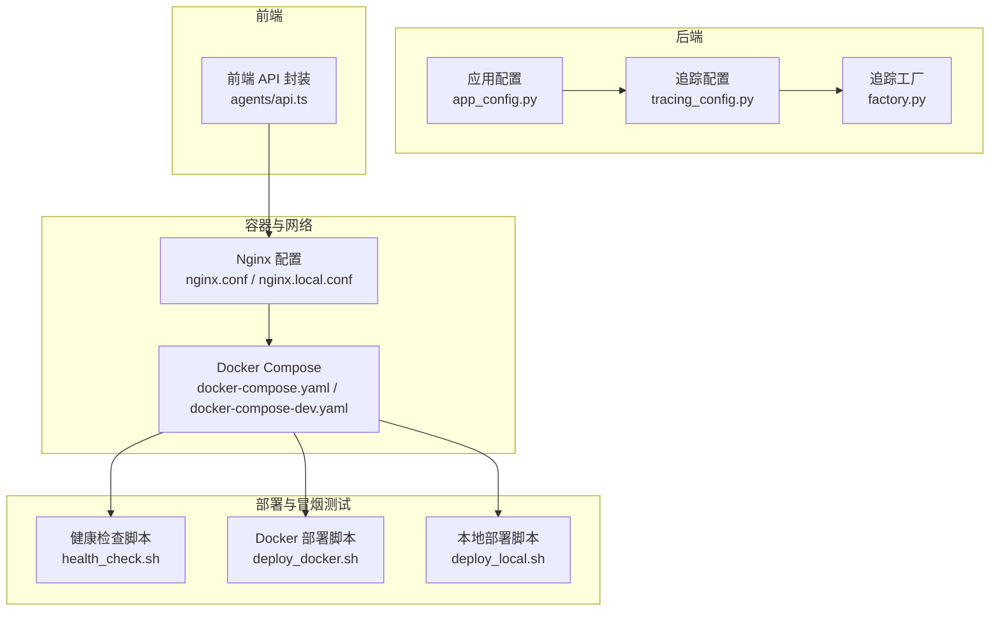
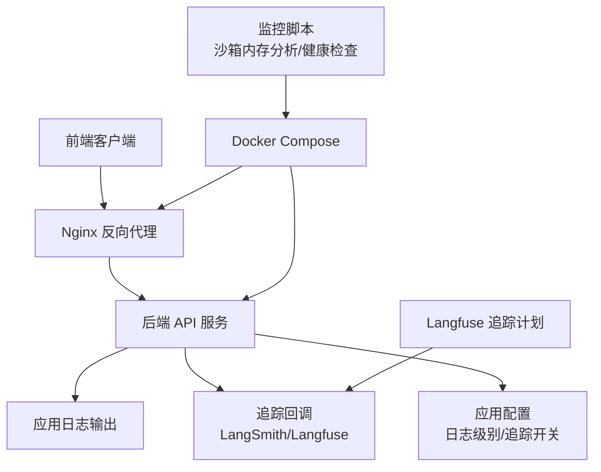
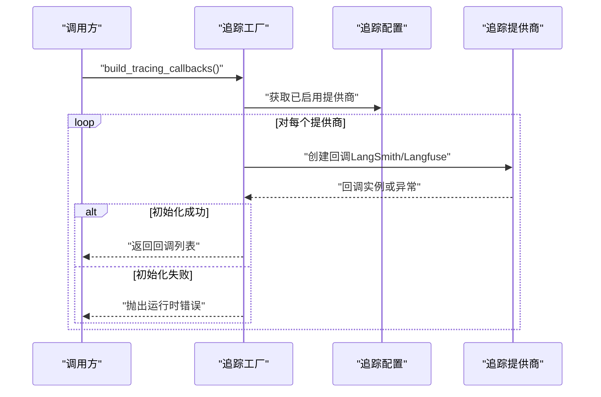
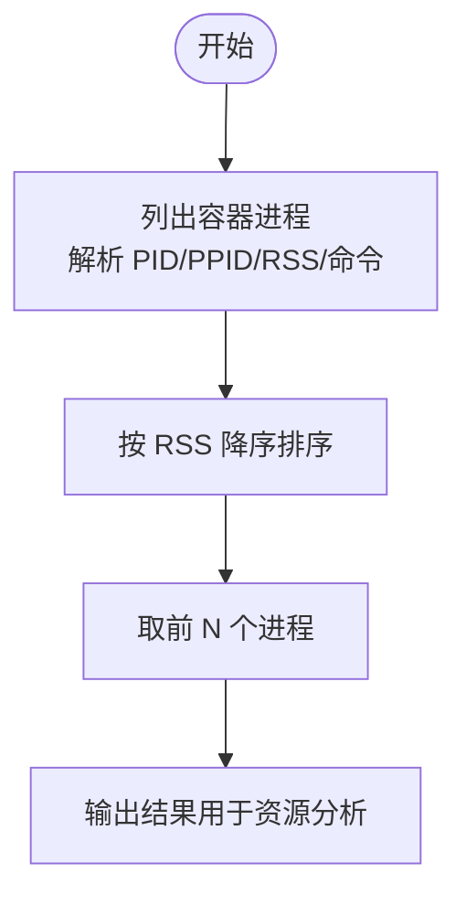
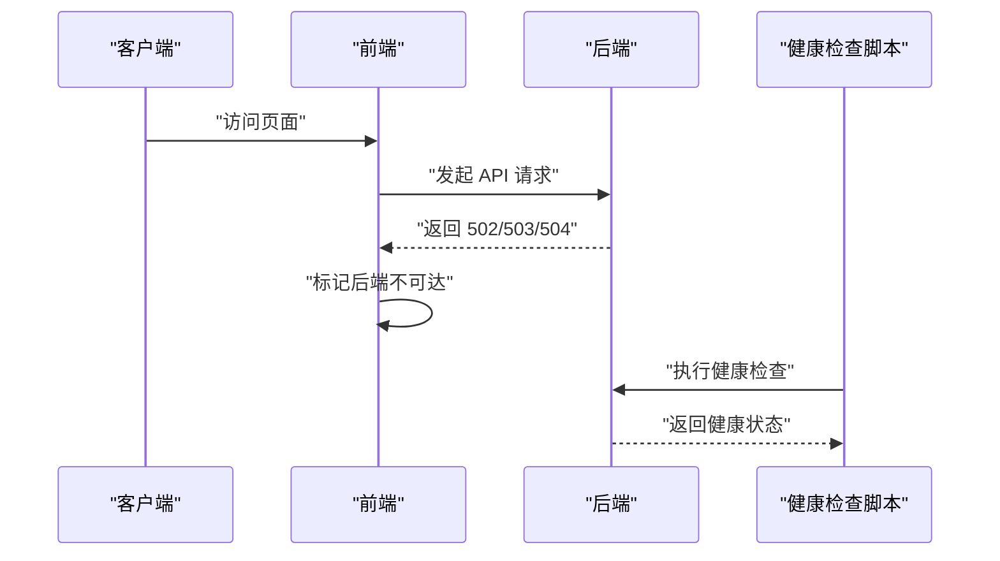
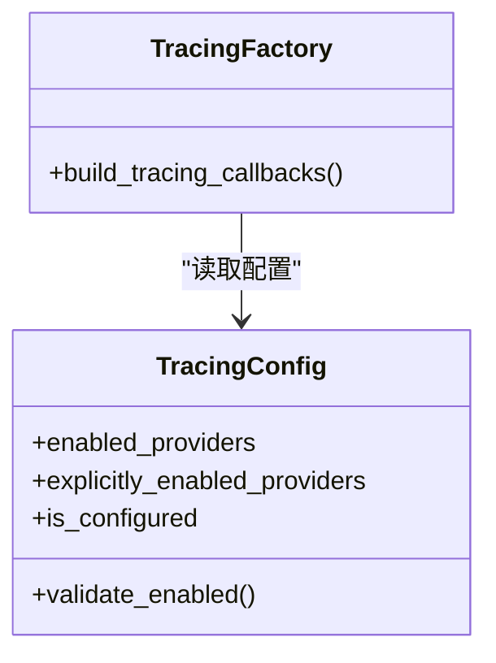
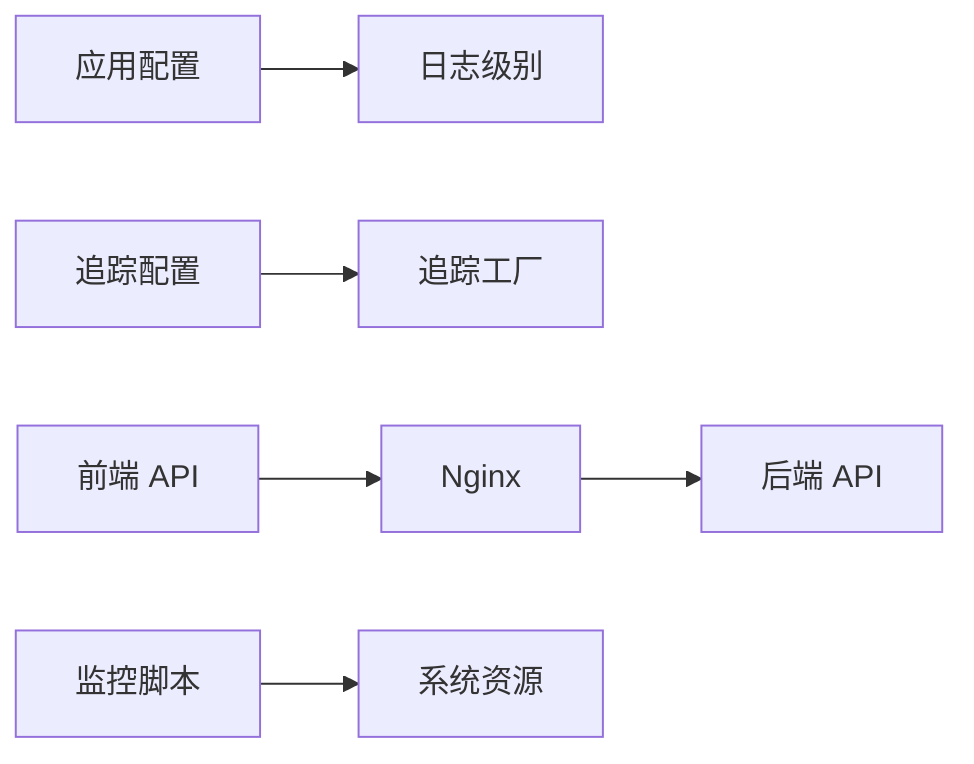

# 监控与日志

<cite>
**本文引用的文件**
- [config.example.yaml](file://config.example.yaml)
- [extensions_config.example.json](file://extensions_config.example.json)
- [tracing_config.py](file://backend/packages/harness/deerflow/config/tracing_config.py)
- [factory.py](file://backend/packages/harness/deerflow/tracing/factory.py)
- [app_config.py](file://backend/packages/harness/deerflow/config/app_config.py)
- [test_tracing_factory.py](file://backend/tests/test_tracing_factory.py)
- [test_logging_level_from_config.py](file://backend/tests/test_logging_level_from_config.py)
- [sandbox_memory_profile.py](file://scripts/sandbox_memory_profile.py)
- [nginx.conf](file://docker/nginx/nginx.conf)
- [nginx.local.conf](file://docker/nginx/nginx.local.conf)
- [docker-compose.yaml](file://docker/docker-compose.yaml)
- [docker-compose-dev.yaml](file://docker/docker-compose-dev.yaml)
- [dev-entrypoint.sh](file://docker/dev-entrypoint.sh)
- [health_check.sh](file://.agent/skills/smoke-test/scripts/health_check.sh)
- [check_docker.sh](file://.agent/skills/smoke-test/scripts/check_docker.sh)
- [deploy_docker.sh](file://.agent/skills/smoke-test/scripts/deploy_docker.sh)
- [deploy_local.sh](file://.agent/skills/smoke-test/scripts/deploy_local.sh)
- [pull_code.sh](file://.agent/skills/smoke-test/scripts/pull_code.sh)
- [report.docker.template.md](file://.agent/skills/smoke-test/templates/report.docker.template.md)
- [report.local.template.md](file://.agent/skills/smoke-test/templates/report.local.template.md)
- [SKILL.md](file://.agent/skills/smoke-test/SKILL.md)
- [2026-04-01-langfuse-tracing.md](file://docs/plans/2026-04-01-langfuse-tracing.md)
</cite>

## 目录
1. [简介](#简介)
2. [项目结构](#项目结构)
3. [核心组件](#核心组件)
4. [架构总览](#架构总览)
5. [详细组件分析](#详细组件分析)
6. [依赖关系分析](#依赖关系分析)
7. [性能考量](#性能考量)
8. [故障排查指南](#故障排查指南)
9. [结论](#结论)
10. [附录](#附录)

## 简介
本指南面向部署与运维团队，提供 deer-flow 监控与日志系统的完整落地方案。内容覆盖应用性能监控（APM）配置、关键指标采集与告警规则、容器与系统资源监控、业务指标监控、日志聚合与结构化、日志轮转、健康检查与可用性监控、故障检测机制，以及分布式追踪与链路监控的集成方法。文档以仓库现有实现为依据，结合部署脚本与配置示例，给出可操作的实施步骤。

## 项目结构
与监控和日志相关的关键位置包括：
- 后端配置与追踪：backend/packages/harness/deerflow/config 与 tracing 子目录
- 前端健康检查与错误处理：frontend/src/core/agents/api.ts（用于理解可用性监控）
- 容器与 Nginx：docker/nginx 与 docker-compose
- 部署与冒烟测试：.agent/skills/smoke-test/scripts 与 templates
- 脚本与资源监控：scripts 下的沙箱内存分析脚本
- 文档计划：docs/plans 中关于 Langfuse 的追踪计划

**图表来源**
- [app_config.py:75-91](file://backend/packages/harness/deerflow/config/app_config.py#L75-L91)
- [tracing_config.py:132-161](file://backend/packages/harness/deerflow/config/tracing_config.py#L132-L161)
- [factory.py:39-54](file://backend/packages/harness/deerflow/tracing/factory.py#L39-L54)
- [nginx.conf](file://docker/nginx/nginx.conf)
- [nginx.local.conf](file://docker/nginx/nginx.local.conf)
- [docker-compose.yaml](file://docker/docker-compose.yaml)
- [docker-compose-dev.yaml](file://docker/docker-compose-dev.yaml)
- [health_check.sh](file://.agent/skills/smoke-test/scripts/health_check.sh)
- [deploy_docker.sh](file://.agent/skills/smoke-test/scripts/deploy_docker.sh)
- [deploy_local.sh](file://.agent/skills/smoke-test/scripts/deploy_local.sh)

**章节来源**
- [app_config.py:75-91](file://backend/packages/harness/deerflow/config/app_config.py#L75-L91)
- [tracing_config.py:132-161](file://backend/packages/harness/deerflow/config/tracing_config.py#L132-L161)
- [factory.py:39-54](file://backend/packages/harness/deerflow/tracing/factory.py#L39-L54)
- [nginx.conf](file://docker/nginx/nginx.conf)
- [nginx.local.conf](file://docker/nginx/nginx.local.conf)
- [docker-compose.yaml](file://docker/docker-compose.yaml)
- [docker-compose-dev.yaml](file://docker/docker-compose-dev.yaml)
- [health_check.sh](file://.agent/skills/smoke-test/scripts/health_check.sh)
- [deploy_docker.sh](file://.agent/skills/smoke-test/scripts/deploy_docker.sh)
- [deploy_local.sh](file://.agent/skills/smoke-test/scripts/deploy_local.sh)

## 核心组件
- 应用配置与日志级别：通过应用配置模块统一设置 deerflow 与 app 日志器级别，并调整根处理器阈值，确保关键日志可透传。
- 追踪配置与工厂：支持启用多个追踪提供商（如 LangSmith、Langfuse），工厂根据配置动态构建回调；提供验证与重置能力。
- 健康检查与可用性监控：前端对后端接口进行可用性判断，HTTP 502/503/504 视为后端不可达；配合冒烟测试脚本与 Nginx 配置保障服务可用性。
- 容器与系统资源监控：通过 Docker Compose 编排与 Nginx 反向代理；脚本提供容器资源与进程 RSS 排序分析能力，辅助资源瓶颈定位。
- 日志聚合与轮转：结合 Nginx 访问/错误日志与后端应用日志，建议采用集中式日志系统与轮转策略（见后续章节）。

**章节来源**
- [app_config.py:75-91](file://backend/packages/harness/deerflow/config/app_config.py#L75-L91)
- [tracing_config.py:132-161](file://backend/packages/harness/deerflow/config/tracing_config.py#L132-L161)
- [factory.py:39-54](file://backend/packages/harness/deerflow/tracing/factory.py#L39-L54)
- [nginx.conf](file://docker/nginx/nginx.conf)
- [nginx.local.conf](file://docker/nginx/nginx.local.conf)
- [docker-compose.yaml](file://docker/docker-compose.yaml)
- [docker-compose-dev.yaml](file://docker/docker-compose-dev.yaml)
- [sandbox_memory_profile.py:137-175](file://scripts/sandbox_memory_profile.py#L137-L175)

## 架构总览
下图展示了监控与日志在系统中的交互关系：前端通过 Nginx 访问后端 API；后端按配置启用追踪与日志；容器编排与健康检查脚本保障可用性；脚本与文档计划指导资源与链路监控。

**图表来源**
- [nginx.conf](file://docker/nginx/nginx.conf)
- [factory.py:39-54](file://backend/packages/harness/deerflow/tracing/factory.py#L39-L54)
- [tracing_config.py:132-161](file://backend/packages/harness/deerflow/config/tracing_config.py#L132-L161)
- [docker-compose.yaml](file://docker/docker-compose.yaml)
- [sandbox_memory_profile.py:137-175](file://scripts/sandbox_memory_profile.py#L137-L175)
- [2026-04-01-langfuse-tracing.md](file://docs/plans/2026-04-01-langfuse-tracing.md)

## 详细组件分析

### 应用性能监控（APM）配置与追踪工厂
- 追踪提供商启用：工厂会遍历已启用的追踪提供商列表，按配置创建对应回调；若初始化失败会抛出运行时错误，便于快速发现配置问题。
- 配置验证：提供“显式启用”与“完全配置”的校验函数，确保启用的提供商具备完整参数。
- 公共 API：暴露构建回调、注入元数据等公共接口，便于在运行时扩展。

**图表来源**
- [factory.py:39-54](file://backend/packages/harness/deerflow/tracing/factory.py#L39-L54)
- [tracing_config.py:132-161](file://backend/packages/harness/deerflow/config/tracing_config.py#L132-L161)
- [test_tracing_factory.py:52-89](file://backend/tests/test_tracing_factory.py#L52-L89)

**章节来源**
- [factory.py:39-54](file://backend/packages/harness/deerflow/tracing/factory.py#L39-L54)
- [tracing_config.py:132-161](file://backend/packages/harness/deerflow/config/tracing_config.py#L132-L161)
- [test_tracing_factory.py:52-89](file://backend/tests/test_tracing_factory.py#L52-L89)

### 关键指标收集与告警规则
- 指标来源建议：
  - 应用日志：通过后端日志级别统一管理，结合集中式日志系统进行错误率、异常堆栈统计。
  - 追踪链路：LangSmith/Langfuse 提供请求耗时、节点耗时、成功率等指标，可用于 SLO/SLI 建模。
  - 容器与系统：利用 Docker Compose 与脚本输出的进程 RSS 排序，识别内存占用异常。
- 告警规则建议（基于现有实现的可观测性信号）：
  - HTTP 502/503/504：前端视为后端不可达，触发可用性告警。
  - 追踪初始化失败：工厂异常应触发配置告警。
  - 日志级别异常：当日志级别被降级导致关键信息丢失时触发告警。

**章节来源**
- [app_config.py:75-91](file://backend/packages/harness/deerflow/config/app_config.py#L75-L91)
- [test_logging_level_from_config.py:31-91](file://backend/tests/test_logging_level_from_config.py#L31-L91)
- [factory.py:39-54](file://backend/packages/harness/deerflow/tracing/factory.py#L39-L54)

### 容器监控与系统资源监控
- 容器编排：使用 Docker Compose 管理服务与网络，结合 Nginx 作为入口网关。
- 系统资源：脚本提供容器内进程 RSS 排序与资源请求/限制解析，可用于识别内存瓶颈与资源配额问题。

**图表来源**
- [sandbox_memory_profile.py:137-175](file://scripts/sandbox_memory_profile.py#L137-L175)

**章节来源**
- [docker-compose.yaml](file://docker/docker-compose.yaml)
- [docker-compose-dev.yaml](file://docker/docker-compose-dev.yaml)
- [nginx.conf](file://docker/nginx/nginx.conf)
- [nginx.local.conf](file://docker/nginx/nginx.local.conf)
- [sandbox_memory_profile.py:137-175](file://scripts/sandbox_memory_profile.py#L137-L175)

### 业务指标监控
- 业务指标建议从以下来源采集：
  - 追踪链路：节点耗时、成功率、错误码分布。
  - 日志：业务事件计数、错误分类统计。
  - 健康检查：后端可用性状态与响应时间。
- 结合前端 API 的可用性判断，可将“后端不可达”作为业务连续性的重要观测点。

**章节来源**
- [frontend\src\core\agents\api.ts:1-124](file://frontend/src/core/agents/api.ts#L1-L124)

### 日志聚合、结构化与轮转
- 日志级别：通过应用配置统一设置 deerflow 与 app 日志器级别，并调整根处理器阈值，避免第三方库噪声掩盖关键日志。
- 结构化日志：建议在应用中统一输出 JSON 格式字段（如时间戳、级别、模块、消息、trace_id 等），便于日志系统解析与检索。
- 日志轮转：结合 Nginx 访问/错误日志与后端应用日志，配置轮转策略（大小/时间/备份份数），防止磁盘膨胀。
- 集中式日志：建议使用 ELK/EFK 或类似平台收集、存储与查询日志。

**章节来源**
- [app_config.py:75-91](file://backend/packages/harness/deerflow/config/app_config.py#L75-L91)
- [test_logging_level_from_config.py:31-91](file://backend/tests/test_logging_level_from_config.py#L31-L91)

### 健康检查端点、服务可用性监控与故障检测
- 健康检查脚本：提供容器与环境健康检查流程，可作为自动化巡检与部署验证的一部分。
- 前端可用性检测：对后端接口返回状态进行判断，HTTP 502/503/504 视为后端不可达，触发前端错误处理。
- 故障检测：结合追踪初始化失败与日志级别异常，建立多维度故障检测机制。

**图表来源**
- [frontend\src\core\agents\api.ts:1-124](file://frontend/src/core/agents/api.ts#L1-L124)
- [health_check.sh](file://.agent/skills/smoke-test/scripts/health_check.sh)

**章节来源**
- [frontend\src\core\agents\api.ts:1-124](file://frontend/src/core/agents/api.ts#L1-L124)
- [health_check.sh](file://.agent/skills/smoke-test/scripts/health_check.sh)

### 分布式追踪、链路监控与性能分析
- 追踪配置：支持启用多个提供商，工厂按配置创建回调；提供验证与重置能力，便于在测试与生产间切换。
- 性能分析：结合链路耗时、节点耗时与错误率，定位性能瓶颈与异常路径。
- 计划参考：文档计划中包含 Langfuse 追踪的规划，可据此完善链路监控体系。

**图表来源**
- [tracing_config.py:132-161](file://backend/packages/harness/deerflow/config/tracing_config.py#L132-L161)
- [factory.py:39-54](file://backend/packages/harness/deerflow/tracing/factory.py#L39-L54)

**章节来源**
- [tracing_config.py:132-161](file://backend/packages/harness/deerflow/config/tracing_config.py#L132-L161)
- [factory.py:39-54](file://backend/packages/harness/deerflow/tracing/factory.py#L39-L54)
- [2026-04-01-langfuse-tracing.md](file://docs/plans/2026-04-01-langfuse-tracing.md)

## 依赖关系分析
- 组件耦合：
  - 追踪工厂依赖追踪配置模块，确保启用的提供商完整配置。
  - 应用配置模块影响日志级别与处理器阈值，间接影响可观测性数据质量。
  - 前端 API 与后端服务通过 Nginx 互联，健康检查脚本贯穿部署与运行期。
- 外部依赖：
  - Docker Compose 与 Nginx 提供容器编排与反向代理。
  - 脚本提供系统资源分析能力，辅助性能优化。

**图表来源**
- [app_config.py:75-91](file://backend/packages/harness/deerflow/config/app_config.py#L75-L91)
- [tracing_config.py:132-161](file://backend/packages/harness/deerflow/config/tracing_config.py#L132-L161)
- [factory.py:39-54](file://backend/packages/harness/deerflow/tracing/factory.py#L39-L54)
- [nginx.conf](file://docker/nginx/nginx.conf)
- [sandbox_memory_profile.py:137-175](file://scripts/sandbox_memory_profile.py#L137-L175)

**章节来源**
- [app_config.py:75-91](file://backend/packages/harness/deerflow/config/app_config.py#L75-L91)
- [tracing_config.py:132-161](file://backend/packages/harness/deerflow/config/tracing_config.py#L132-L161)
- [factory.py:39-54](file://backend/packages/harness/deerflow/tracing/factory.py#L39-L54)
- [nginx.conf](file://docker/nginx/nginx.conf)
- [sandbox_memory_profile.py:137-175](file://scripts/sandbox_memory_profile.py#L137-L175)

## 性能考量
- 日志级别：合理设置 deerflow 与 app 日志器级别，避免过度输出影响性能；仅在调试阶段临时提升级别。
- 追踪开销：启用多个追踪提供商会增加额外开销，建议在生产环境按需启用并监控回调初始化成本。
- 资源分析：定期使用脚本对容器进程 RSS 进行排序，识别内存峰值与异常增长趋势，及时扩容或优化。
- Nginx 与容器编排：通过 Docker Compose 合理设置资源限制与重启策略，避免单点故障影响整体可用性。

## 故障排查指南
- 追踪初始化失败：
  - 现象：工厂在创建回调时抛出运行时错误。
  - 排查：检查追踪配置是否完整，确认提供商密钥与端点正确。
- 后端不可达：
  - 现象：前端收到 502/503/504。
  - 排查：使用健康检查脚本验证服务状态，检查 Nginx 配置与后端容器健康。
- 日志级别异常：
  - 现象：关键日志缺失或过多。
  - 排查：确认应用配置的日志级别设置，检查根处理器阈值是否被意外提升。

**章节来源**
- [factory.py:39-54](file://backend/packages/harness/deerflow/tracing/factory.py#L39-L54)
- [frontend\src\core\agents\api.ts:1-124](file://frontend/src/core/agents/api.ts#L1-L124)
- [test_logging_level_from_config.py:31-91](file://backend/tests/test_logging_level_from_config.py#L31-L91)

## 结论
本指南基于 deer-flow 仓库现有实现，给出了监控与日志系统的部署与运维要点：通过应用配置统一日志级别、通过追踪工厂启用链路监控、结合健康检查与容器编排保障可用性、利用脚本进行系统资源分析，并建议引入集中式日志与轮转策略。建议在生产环境中按需启用追踪提供商，持续监控关键指标并完善告警规则，以实现稳定、可观测、可维护的系统运行。

## 附录
- 配置示例：
  - 应用配置示例：[config.example.yaml](file://config.example.yaml)
  - 扩展配置示例：[extensions_config.example.json](file://extensions_config.example.json)
- 部署与冒烟测试：
  - 健康检查脚本：[health_check.sh](file://.agent/skills/smoke-test/scripts/health_check.sh)
  - Docker 部署脚本：[deploy_docker.sh](file://.agent/skills/smoke-test/scripts/deploy_docker.sh)
  - 本地部署脚本：[deploy_local.sh](file://.agent/skills/smoke-test/scripts/deploy_local.sh)
  - 拉取代码脚本：[pull_code.sh](file://.agent/skills/smoke-test/scripts/pull_code.sh)
  - 报告模板：[report.docker.template.md](file://.agent/skills/smoke-test/templates/report.docker.template.md)、[report.local.template.md](file://.agent/skills/smoke-test/templates/report.local.template.md)
  - 技能说明：[SKILL.md](file://.agent/skills/smoke-test/SKILL.md)
- 文档计划：
  - Langfuse 追踪计划：[2026-04-01-langfuse-tracing.md](file://docs/plans/2026-04-01-langfuse-tracing.md)