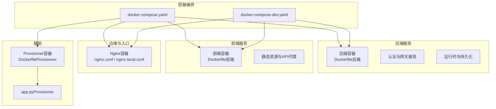
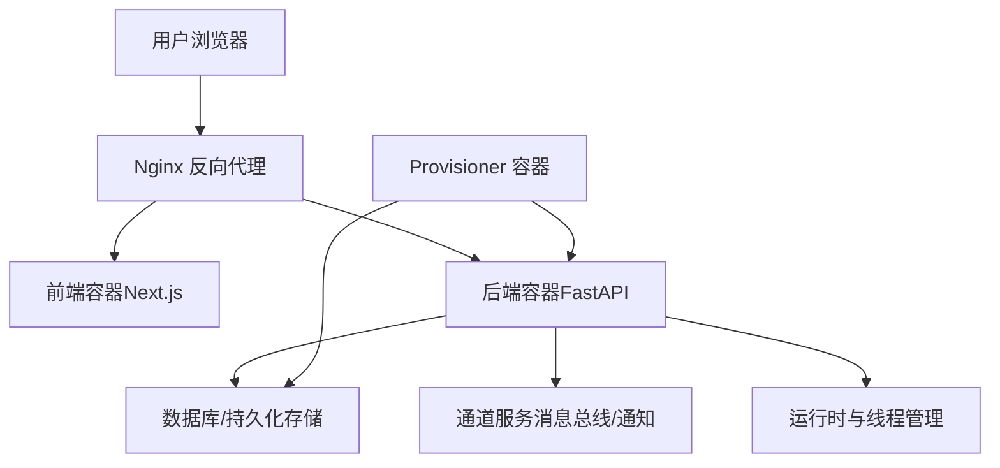
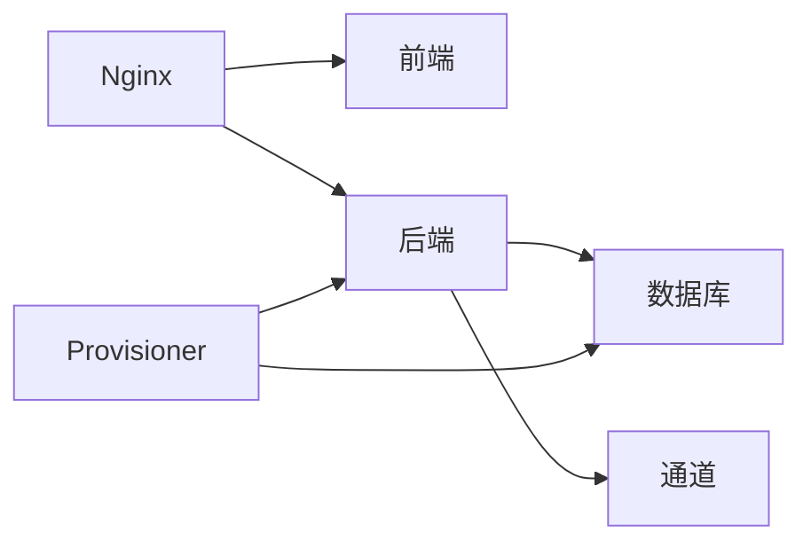

# 部署指南

<cite>
**本文引用的文件**
- [docker-compose.yaml](file://docker/docker-compose.yaml)
- [docker-compose-dev.yaml](file://docker/docker-compose-dev.yaml)
- [dev-entrypoint.sh](file://docker/dev-entrypoint.sh)
- [nginx.conf](file://docker/nginx/nginx.conf)
- [nginx.local.conf](file://docker/nginx/nginx.local.conf)
- [Dockerfile（后端）](file://backend/Dockerfile)
- [Dockerfile（前端）](file://frontend/Dockerfile)
- [Dockerfile（Provisioner）](file://docker/provisioner/Dockerfile)
- [app.py（Provisioner）](file://docker/provisioner/app.py)
- [deploy.sh（根目录）](file://scripts/deploy.sh)
- [deploy.sh（技能示例）](file://skills/public/vercel-deploy-claimable/scripts/deploy.sh)
- [config.example.yaml](file://config.example.yaml)
- [.dockerignore](file://.dockerignore)
- [Makefile（后端）](file://backend/Makefile)
- [Makefile（前端）](file://frontend/Makefile)
- [Makefile（根目录）](file://Makefile)
- [README.md（项目总览）](file://README.md)
- [README.md（前端）](file://frontend/README.md)
- [README.md（后端）](file://backend/README.md)
- [Install.md](file://Install.md)
</cite>

## 目录
1. [简介](#简介)
2. [项目结构](#项目结构)
3. [核心组件](#核心组件)
4. [架构总览](#架构总览)
5. [详细组件分析](#详细组件分析)
6. [依赖关系分析](#依赖关系分析)
7. [性能考虑](#性能考虑)
8. [故障排查指南](#故障排查指南)
9. [结论](#结论)
10. [附录](#附录)

## 简介
本指南面向从开发到生产的全生命周期部署场景，覆盖本地开发、Docker单机与编排、云平台与混合部署等方案。内容包括镜像构建、容器编排、服务发现与负载均衡、健康检查与自动扩缩容、性能调优、监控与日志、高可用与安全加固、故障恢复与备份策略。为确保可操作性，所有步骤均基于仓库中现有配置文件与脚本进行说明。

## 项目结构
项目采用前后端分离与独立容器化架构，配合Nginx反向代理与Compose编排，支持本地开发与生产部署两种模式。核心目录与职责如下：
- 后端：FastAPI应用，提供API网关、认证、通道与运行时服务，容器化由后端Dockerfile完成。
- 前端：Next.js应用，静态资源与API代理，容器化由前端Dockerfile完成。
- Nginx：统一入口与静态资源分发，提供反向代理与SSL终止（如启用）。
- Provisioner：辅助部署与初始化工具，容器化由专用Dockerfile与app.py实现。
- Compose：定义服务拓扑、网络与卷，支持开发与生产两种编排文件。
- 脚本：一键部署与健康检查脚本，便于自动化集成。

图表来源
- [docker-compose.yaml](file://docker/docker-compose.yaml)
- [docker-compose-dev.yaml](file://docker/docker-compose-dev.yaml)
- [Dockerfile（后端）](file://backend/Dockerfile)
- [Dockerfile（前端）](file://frontend/Dockerfile)
- [Dockerfile（Provisioner）](file://docker/provisioner/Dockerfile)
- [app.py（Provisioner）](file://docker/provisioner/app.py)
- [nginx.conf](file://docker/nginx/nginx.conf)
- [nginx.local.conf](file://docker/nginx/nginx.local.conf)

章节来源
- [docker-compose.yaml](file://docker/docker-compose.yaml)
- [docker-compose-dev.yaml](file://docker/docker-compose-dev.yaml)
- [Dockerfile（后端）](file://backend/Dockerfile)
- [Dockerfile（前端）](file://frontend/Dockerfile)
- [Dockerfile（Provisioner）](file://docker/provisioner/Dockerfile)
- [app.py（Provisioner）](file://docker/provisioner/app.py)
- [nginx.conf](file://docker/nginx/nginx.conf)
- [nginx.local.conf](file://docker/nginx/nginx.local.conf)

## 核心组件
- 反向代理与入口
  - Nginx负责HTTP/HTTPS请求分发、静态资源服务与上游服务路由，支持本地与生产两套配置。
- 后端服务
  - 提供认证、通道、线程与运行时等API能力，容器内通过启动脚本或命令启动。
- 前端服务
  - Next.js应用，提供Web界面与交互，容器内构建与运行。
- Provisioner
  - 辅助部署与初始化任务，封装在独立容器中，便于在CI/CD或运维流程中复用。
- 编排与网络
  - Compose定义服务间网络、端口映射、卷挂载与依赖顺序，开发与生产模式差异体现在环境变量与卷配置上。

章节来源
- [nginx.conf](file://docker/nginx/nginx.conf)
- [nginx.local.conf](file://docker/nginx/nginx.local.conf)
- [Dockerfile（后端）](file://backend/Dockerfile)
- [Dockerfile（前端）](file://frontend/Dockerfile)
- [Dockerfile（Provisioner）](file://docker/provisioner/Dockerfile)
- [app.py（Provisioner）](file://docker/provisioner/app.py)
- [docker-compose.yaml](file://docker/docker-compose.yaml)
- [docker-compose-dev.yaml](file://docker/docker-compose-dev.yaml)

## 架构总览
下图展示从客户端到后端服务的典型流量路径，以及各组件间的依赖关系与数据流向。

图表来源
- [nginx.conf](file://docker/nginx/nginx.conf)
- [Dockerfile（后端）](file://backend/Dockerfile)
- [Dockerfile（前端）](file://frontend/Dockerfile)
- [Dockerfile（Provisioner）](file://docker/provisioner/Dockerfile)
- [docker-compose.yaml](file://docker/docker-compose.yaml)

## 详细组件分析

### 反向代理（Nginx）
- 功能
  - 统一入口、静态资源分发、API路由转发、可选SSL终止。
- 配置要点
  - 生产与本地分别使用不同的配置文件，以适配端口、证书与上游地址差异。
  - 建议开启健康检查探针与超时参数优化，避免长连接阻塞。
- 运维建议
  - 将静态资源缓存策略与Gzip压缩开启，减少带宽占用。
  - 对上游后端设置合理的超时与重试策略，提升稳定性。

章节来源
- [nginx.conf](file://docker/nginx/nginx.conf)
- [nginx.local.conf](file://docker/nginx/nginx.local.conf)

### 后端服务（FastAPI）
- 容器化
  - 使用后端Dockerfile构建镜像，包含依赖安装、工作目录设置与启动命令。
- 启动与入口
  - 开发模式可通过dev-entrypoint脚本注入环境变量与调试参数；生产模式通常由Compose直接启动。
- 关键点
  - 确保数据库连接字符串、通道配置与模型提供商密钥在环境变量中正确传递。
  - 如需热重载，开发模式可启用相应选项，但生产不建议开启。

章节来源
- [Dockerfile（后端）](file://backend/Dockerfile)
- [dev-entrypoint.sh](file://docker/dev-entrypoint.sh)
- [docker-compose.yaml](file://docker/docker-compose.yaml)

### 前端服务（Next.js）
- 容器化
  - 使用前端Dockerfile构建镜像，包含依赖安装、构建与静态文件输出。
- 运行方式
  - 生产模式通常以静态文件形式提供，Nginx作为反向代理；开发模式可在容器内运行Next.js。
- 配置建议
  - 在构建阶段注入必要的环境变量（如API基础URL），避免运行时硬编码。

章节来源
- [Dockerfile（前端）](file://frontend/Dockerfile)
- [nginx.conf](file://docker/nginx/nginx.conf)

### Provisioner（部署辅助）
- 容器化
  - 使用专用Dockerfile构建镜像，内置Python运行时与所需依赖。
- 功能
  - 承担初始化、迁移、权限配置等一次性任务，适合在CI/CD流水线中执行。
- 最佳实践
  - 将敏感配置通过环境变量注入，避免写入镜像；任务完成后容器退出，便于编排调度。

章节来源
- [Dockerfile（Provisioner）](file://docker/provisioner/Dockerfile)
- [app.py（Provisioner）](file://docker/provisioner/app.py)

### 编排与网络（Compose）
- 开发模式
  - 使用开发Compose文件，便于本地联调与快速迭代；默认暴露必要端口，卷挂载便于代码热更新。
- 生产模式
  - 使用生产Compose文件，强调安全性、资源限制与持久化；卷挂载指向宿主机目录或命名卷。
- 共同关注点
  - 服务依赖顺序、健康检查探针、重启策略与日志驱动。
  - 网络隔离与端口冲突规避，确保Nginx、前端与后端端口不冲突。

章节来源
- [docker-compose.yaml](file://docker/docker-compose.yaml)
- [docker-compose-dev.yaml](file://docker/docker-compose-dev.yaml)

### 镜像构建流程
- 后端镜像
  - 基于后端Dockerfile构建，建议在CI中缓存依赖层，缩短构建时间。
- 前端镜像
  - 基于前端Dockerfile构建，建议使用多阶段构建减少最终镜像体积。
- Provisioner镜像
  - 基于Provisioner Dockerfile构建，仅包含运行时与脚本，保持最小化。
- 通用建议
  - 在根目录与子目录均存在Makefile，可用于统一构建与发布流程；结合.dockerignore排除不必要的文件，减少上下文大小。

章节来源
- [Dockerfile（后端）](file://backend/Dockerfile)
- [Dockerfile（前端）](file://frontend/Dockerfile)
- [Dockerfile（Provisioner）](file://docker/provisioner/Dockerfile)
- [.dockerignore](file://.dockerignore)
- [Makefile（后端）](file://backend/Makefile)
- [Makefile（前端）](file://frontend/Makefile)
- [Makefile（根目录）](file://Makefile)

### 一键部署脚本
- 根目录部署脚本
  - 提供一键拉取代码、构建镜像、启动服务与健康检查的流程，适合快速上线。
- 技能示例中的部署脚本
  - 某些技能包提供独立部署脚本，可作为参考模板扩展到主项目。
- 建议
  - 在CI/CD中调用该脚本，结合环境变量与密钥管理，实现无感发布。

章节来源
- [deploy.sh（根目录）](file://scripts/deploy.sh)
- [deploy.sh（技能示例）](file://skills/public/vercel-deploy-claimable/scripts/deploy.sh)

## 依赖关系分析
- 组件耦合
  - Nginx对前端与后端服务有直接依赖；后端对数据库与通道服务有间接依赖；Provisioner对后端与数据库有初始化依赖。
- 外部依赖
  - 数据库、消息通道与第三方模型提供商；需通过环境变量与网络配置接入。
- 循环依赖
  - 当前结构未见循环依赖，服务启动顺序由Compose定义。

图表来源
- [docker-compose.yaml](file://docker/docker-compose.yaml)
- [Dockerfile（后端）](file://backend/Dockerfile)
- [Dockerfile（前端）](file://frontend/Dockerfile)
- [Dockerfile（Provisioner）](file://docker/provisioner/Dockerfile)

章节来源
- [docker-compose.yaml](file://docker/docker-compose.yaml)

## 性能考虑
- 镜像与构建
  - 使用多阶段构建与缓存策略，减少镜像体积与构建时间；在CI中启用层缓存。
- 应用层
  - 合理设置并发与超时参数，避免阻塞IO；对长耗时任务使用队列或异步处理。
- 网络与入口
  - Nginx开启Gzip与静态缓存；合理设置上游超时与重试；限制请求体大小防止资源滥用。
- 存储与持久化
  - 数据库存储建议使用SSD与连接池；卷挂载选择合适的I/O策略。
- 监控与可观测性
  - 建议集成指标采集与日志聚合，结合健康检查与告警策略。

[本节为通用指导，无需引用具体文件]

## 故障排查指南
- 健康检查失败
  - 检查后端与前端的健康端点是否可达；确认端口映射与防火墙规则；查看容器日志定位异常。
- 代理错误
  - 检查Nginx配置与上游地址；确认证书与域名解析；验证静态资源路径。
- 初始化失败
  - Provisioner任务失败时，查看其日志与返回码；确认数据库连通性与权限。
- 性能问题
  - 分析慢查询与阻塞IO；调整并发与超时参数；评估硬件资源与网络延迟。
- 配置问题
  - 对照示例配置文件，核对环境变量与密钥注入；避免明文配置进入镜像。

章节来源
- [nginx.conf](file://docker/nginx/nginx.conf)
- [Dockerfile（后端）](file://backend/Dockerfile)
- [Dockerfile（前端）](file://frontend/Dockerfile)
- [Dockerfile（Provisioner）](file://docker/provisioner/Dockerfile)
- [config.example.yaml](file://config.example.yaml)

## 结论
本指南基于仓库现有配置与脚本，给出了从开发到生产的完整部署路径。通过标准化的容器化与编排策略、清晰的入口代理与服务拆分、完善的健康检查与日志体系，可满足本地开发、单机部署与生产级可用性的需求。建议在实际落地时结合自身环境补充安全加固与合规要求。

[本节为总结性内容，无需引用具体文件]

## 附录

### A. 本地开发部署
- 步骤
  - 使用开发Compose文件启动服务，确保端口未被占用；通过Nginx访问前端与后端API。
  - 如需调试，可在dev-entrypoint脚本中注入调试参数。
- 注意事项
  - 卷挂载需确保宿主机目录可写；数据库卷建议持久化。

章节来源
- [docker-compose-dev.yaml](file://docker/docker-compose-dev.yaml)
- [dev-entrypoint.sh](file://docker/dev-entrypoint.sh)

### B. Docker单机部署
- 步骤
  - 构建镜像后，使用生产Compose文件启动；根据需要修改环境变量与卷配置。
- 注意事项
  - 确保宿主机防火墙放行Nginx端口；数据库与通道服务的网络可达。

章节来源
- [docker-compose.yaml](file://docker/docker-compose.yaml)
- [Dockerfile（后端）](file://backend/Dockerfile)
- [Dockerfile（前端）](file://frontend/Dockerfile)
- [Dockerfile（Provisioner）](file://docker/provisioner/Dockerfile)

### C. 云平台与混合部署
- 建议
  - 前端与Nginx可托管于对象存储或CDN+反向代理服务；后端与数据库部署于容器服务或虚拟机集群。
  - 使用外部负载均衡器分发流量，结合健康检查与自动扩缩容策略。
- 注意事项
  - 云厂商的网络ACL与安全组需放行必要端口；密钥与配置通过平台密钥管理服务注入。

[本节为概念性指导，无需引用具体文件]

### D. 高可用、负载均衡与自动扩缩容
- 高可用
  - 多副本部署后端与前端；数据库使用主从或高可用集群；Nginx多实例与共享配置。
- 负载均衡
  - 使用云负载均衡或Ingress控制器；后端服务通过健康检查与就绪探针参与调度。
- 自动扩缩容
  - 基于CPU/内存与QPS指标触发扩缩容；为数据库与通道服务预留充足资源。

[本节为概念性指导，无需引用具体文件]

### E. 监控、日志与告警
- 监控
  - 收集容器CPU/内存、请求延迟与错误率；数据库慢查询与连接数。
- 日志
  - 统一日志格式与集中存储；区分访问日志与应用日志；设置轮转策略。
- 告警
  - 基于阈值与趋势异常触发告警；联动通知渠道。

[本节为概念性指导，无需引用具体文件]

### F. 安全加固最佳实践
- 配置
  - 使用只读根文件系统与最小权限；禁用不必要的服务端口；启用TLS与强密码策略。
- 密钥与凭据
  - 通过环境变量或密钥管理服务注入；避免将敏感信息写入镜像或版本库。
- 网络
  - 使用私有网络与防火墙；限制入站与出站访问；启用WAF与DDoS防护。

[本节为概念性指导，无需引用具体文件]

### G. 故障恢复与备份策略
- 备份
  - 数据库定期快照与归档；配置与密钥单独备份；版本化存储。
- 恢复
  - 制定RTO/RPO目标；演练恢复流程；确保依赖服务可用性。
- 回滚
  - 版本化镜像与配置；支持灰度发布与一键回滚。

[本节为概念性指导，无需引用具体文件]

### H. 参考文档与示例
- 项目总览与安装
  - 项目README与安装文档提供了基础使用说明与环境准备指引。
- 配置示例
  - 示例配置文件展示了关键参数的默认值与可选项，便于对照与定制。

章节来源
- [README.md（项目总览）](file://README.md)
- [README.md（前端）](file://frontend/README.md)
- [README.md（后端）](file://backend/README.md)
- [Install.md](file://Install.md)
- [config.example.yaml](file://config.example.yaml)