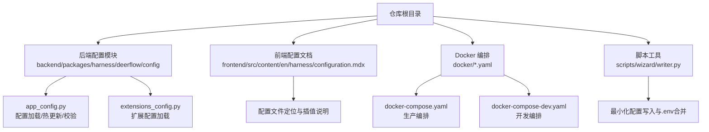
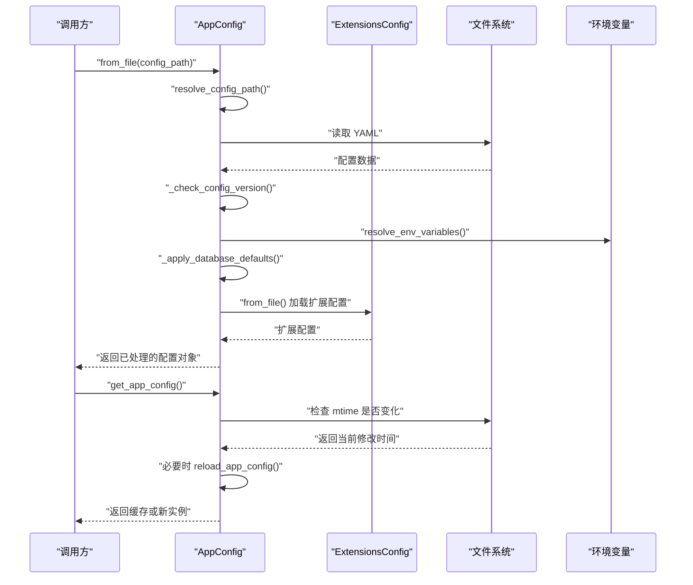
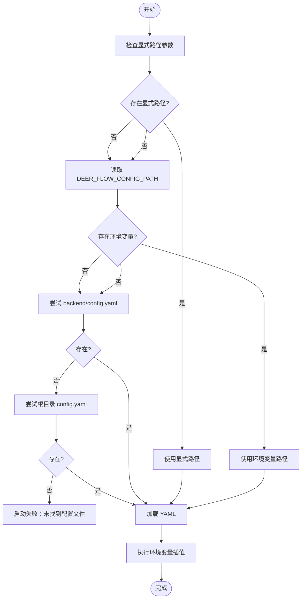
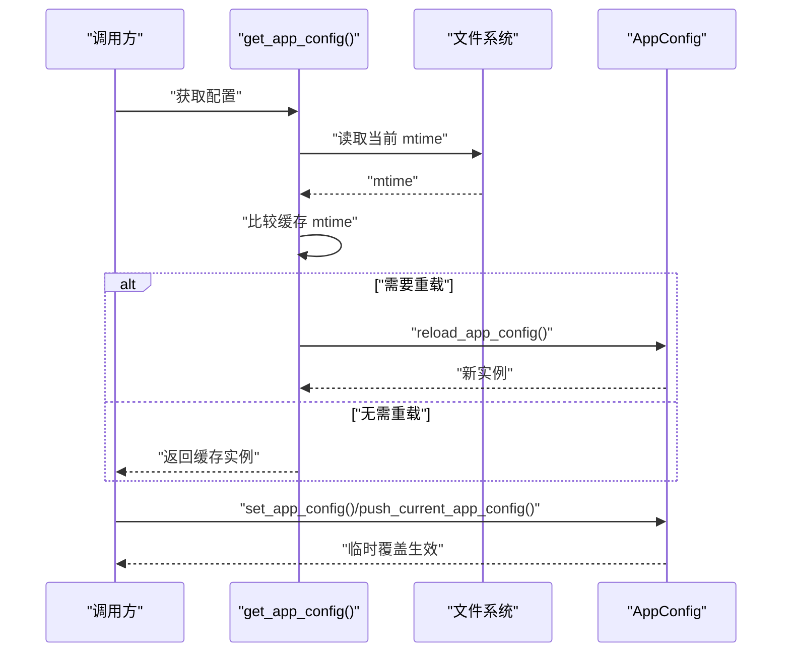
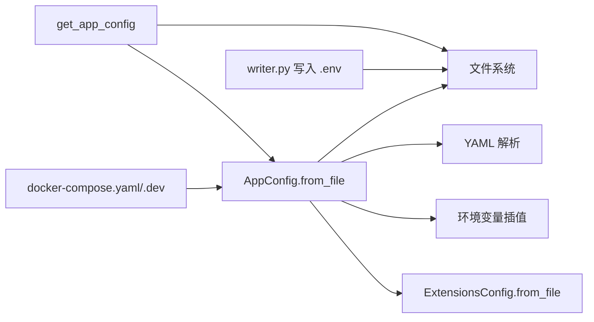

# 配置管理与环境

<cite>
**本文引用的文件**
- [config.example.yaml](file://config.example.yaml)
- [extensions_config.example.json](file://extensions_config.example.json)
- [app_config.py](file://backend/packages/harness/deerflow/config/app_config.py)
- [extensions_config.py](file://backend/packages/harness/deerflow/config/extensions_config.py)
- [CONFIGURATION.md](file://backend/docs/CONFIGURATION.md)
- [configuration.mdx](file://frontend/src/content/en/harness/configuration.mdx)
- [test_app_config_env_expand.py](file://backend/tests/test_app_config_env_expand.py)
- [test_app_config_reload.py](file://backend/tests/test_app_config_reload.py)
- [docker-compose.yaml](file://docker/docker-compose.yaml)
- [docker-compose-dev.yaml](file://docker/docker-compose-dev.yaml)
- [writer.py](file://scripts/wizard/writer.py)
- [dev-entrypoint.sh](file://docker/dev-entrypoint.sh)
</cite>

## 目录
1. [引言](#引言)
2. [项目结构](#项目结构)
3. [核心组件](#核心组件)
4. [架构总览](#架构总览)
5. [详细组件分析](#详细组件分析)
6. [依赖关系分析](#依赖关系分析)
7. [性能考量](#性能考量)
8. [故障排查指南](#故障排查指南)
9. [结论](#结论)
10. [附录](#附录)

## 引言
本指南围绕 deer-flow 的配置管理与多环境部署展开，系统性阐述配置文件结构、环境变量优先级与配置验证机制；给出开发、测试、预生产与生产环境的配置差异与切换策略；提供密钥管理、敏感信息保护与配置热更新的实现方法；并总结配置模板化、参数注入与配置审计的最佳实践，以及配置迁移、版本控制与回滚策略的实施细节。

## 项目结构
- 后端通过统一的配置入口加载 YAML 配置，并支持环境变量插值与热更新。
- 前端文档对配置文件定位与环境变量插值进行说明。
- Docker Compose 提供不同环境的编排示例。
- 脚本工具负责最小化配置生成与 .env 文件合并。

图表来源
- [app_config.py:200-536](file://backend/packages/harness/deerflow/config/app_config.py#L200-L536)
- [extensions_config.py](file://backend/packages/harness/deerflow/config/extensions_config.py)
- [configuration.mdx:1-37](file://frontend/src/content/en/harness/configuration.mdx#L1-L37)
- [docker-compose.yaml](file://docker/docker-compose.yaml)
- [docker-compose-dev.yaml](file://docker/docker-compose-dev.yaml)
- [writer.py:1-38](file://scripts/wizard/writer.py#L1-L38)

章节来源
- [app_config.py:200-536](file://backend/packages/harness/deerflow/config/app_config.py#L200-L536)
- [configuration.mdx:1-37](file://frontend/src/content/en/harness/configuration.mdx#L1-L37)
- [docker-compose.yaml](file://docker/docker-compose.yaml)
- [docker-compose-dev.yaml](file://docker/docker-compose-dev.yaml)
- [writer.py:1-38](file://scripts/wizard/writer.py#L1-L38)

## 核心组件
- 配置加载与热更新：AppConfig.from_file() 负责解析配置路径、加载 YAML、执行环境变量插值、应用数据库默认值、检查配置版本并缓存实例；提供 get_app_config()/reload_app_config()/reset_app_config() 等 API 支持运行时热更新与测试注入。
- 扩展配置：ExtensionsConfig.from_file() 单独加载扩展配置并与主配置合并。
- 环境变量插值：支持 $VAR_NAME 与 ${VAR_NAME} 两种语法，缺失变量会触发错误。
- 前端文档：明确配置文件定位优先级与环境变量插值规则。
- Docker 编排：提供开发与生产的容器编排样例，便于按环境切换。
- 脚本工具：最小化生成 config.yaml 并合并 .env，尽量保留用户自定义项。

章节来源
- [app_config.py:200-536](file://backend/packages/harness/deerflow/config/app_config.py#L200-L536)
- [extensions_config.py](file://backend/packages/harness/deerflow/config/extensions_config.py)
- [configuration.mdx:18-37](file://frontend/src/content/en/harness/configuration.mdx#L18-L37)
- [docker-compose.yaml](file://docker/docker-compose.yaml)
- [docker-compose-dev.yaml](file://docker/docker-compose-dev.yaml)
- [writer.py:1-38](file://scripts/wizard/writer.py#L1-L38)

## 架构总览
下图展示了配置从文件到运行时的加载、插值、校验与热更新流程：

图表来源
- [app_config.py:200-536](file://backend/packages/harness/deerflow/config/app_config.py#L200-L536)

## 详细组件分析

### 组件一：配置文件定位与环境变量插值
- 定位优先级（后端）：显式传入路径 > DEER_FLOW_CONFIG_PATH 环境变量 > backend/config.yaml > 仓库根 config.yaml。
- 插值语法：支持 $VAR_NAME 与 ${VAR_NAME}；缺失变量会抛出错误，确保敏感信息必须显式提供。
- 测试覆盖：单元测试验证了带花括号与纯字符串的插值行为及缺失变量报错。

图表来源
- [app_config.py:200-220](file://backend/packages/harness/deerflow/config/app_config.py#L200-L220)
- [configuration.mdx:18-27](file://frontend/src/content/en/harness/configuration.mdx#L18-L27)
- [test_app_config_env_expand.py:1-30](file://backend/tests/test_app_config_env_expand.py#L1-L30)

章节来源
- [app_config.py:200-220](file://backend/packages/harness/deerflow/config/app_config.py#L200-L220)
- [configuration.mdx:18-37](file://frontend/src/content/en/harness/configuration.mdx#L18-L37)
- [test_app_config_env_expand.py:1-30](file://backend/tests/test_app_config_env_expand.py#L1-L30)

### 组件二：配置热更新与运行时覆盖
- 缓存与自动重载：get_app_config() 在缓存命中且路径与 mtime 未变时复用；若检测到变更则自动重新加载。
- 强制重载：reload_app_config() 可在配置变更后手动刷新。
- 运行时覆盖：set_app_config()/push_current_app_config()/pop_current_app_config() 支持测试注入与上下文隔离的临时覆盖。
- 测试覆盖：测试验证了热更新与缓存失效行为。

图表来源
- [app_config.py:439-536](file://backend/packages/harness/deerflow/config/app_config.py#L439-L536)
- [test_app_config_reload.py](file://backend/tests/test_app_config_reload.py)

章节来源
- [app_config.py:439-536](file://backend/packages/harness/deerflow/config/app_config.py#L439-L536)
- [test_app_config_reload.py](file://backend/tests/test_app_config_reload.py)

### 组件三：扩展配置与主配置合并
- 扩展配置独立文件加载，然后与主配置合并，保证功能模块化与可维护性。
- 典型场景：将第三方扩展或插件配置拆分，避免主配置臃肿。

章节来源
- [extensions_config.py](file://backend/packages/harness/deerflow/config/extensions_config.py)
- [app_config.py:226-228](file://backend/packages/harness/deerflow/config/app_config.py#L226-L228)

### 组件四：密钥管理与敏感信息保护
- 环境变量插值要求敏感字段必须通过环境变量提供，缺失即报错，防止硬编码。
- 最小化配置生成器会合并 .env 文件，尽量减少对现有自定义项的破坏。
- 建议：在 CI/CD 中通过受控渠道注入环境变量，避免明文存储于仓库。

章节来源
- [test_app_config_env_expand.py:27-30](file://backend/tests/test_app_config_env_expand.py#L27-L30)
- [writer.py:20-38](file://scripts/wizard/writer.py#L20-L38)

### 组件五：多环境配置差异与切换策略
- 开发环境：docker-compose-dev.yaml 提供本地开发编排，适合快速迭代与调试。
- 生产环境：docker-compose.yaml 提供生产级编排，建议结合外部配置管理与密钥服务。
- 切换策略：通过 DEER_FLOW_CONFIG_PATH 或显式路径选择不同环境的配置文件；容器内可通过环境变量注入敏感信息。

章节来源
- [docker-compose-dev.yaml](file://docker/docker-compose-dev.yaml)
- [docker-compose.yaml](file://docker/docker-compose.yaml)
- [app_config.py:200-220](file://backend/packages/harness/deerflow/config/app_config.py#L200-L220)

### 组件六：配置模板化与参数注入
- 使用 config.example.yaml 作为模板，按需复制并填充环境变量。
- 使用 extensions_config.example.json 管理扩展配置模板。
- 参数注入：通过环境变量插值将运行时参数注入配置树，避免修改静态文件。

章节来源
- [config.example.yaml](file://config.example.yaml)
- [extensions_config.example.json](file://extensions_config.example.json)
- [configuration.mdx:35-37](file://frontend/src/content/en/harness/configuration.mdx#L35-L37)

### 组件七：配置审计与可追溯性
- 配置版本检查：加载前执行版本校验，确保配置格式兼容。
- 修改时间监控：热更新基于文件 mtime，便于审计配置变更时间点。
- 建议：在版本控制系统中记录配置变更，配合 CI/CD 的审批流程与回滚策略。

章节来源
- [app_config.py:216-218](file://backend/packages/harness/deerflow/config/app_config.py#L216-L218)
- [app_config.py:456-467](file://backend/packages/harness/deerflow/config/app_config.py#L456-L467)

## 依赖关系分析
- 配置加载链路：AppConfig.from_file() 依赖文件系统、YAML 解析、环境变量插值与扩展配置模块。
- 运行时依赖：get_app_config() 依赖文件系统 mtime 检测；热更新依赖 reload_app_config()。
- 外部依赖：Docker Compose 用于环境编排；脚本工具用于最小化配置生成与 .env 合并。

图表来源
- [app_config.py:200-536](file://backend/packages/harness/deerflow/config/app_config.py#L200-L536)
- [writer.py:1-38](file://scripts/wizard/writer.py#L1-L38)
- [docker-compose.yaml](file://docker/docker-compose.yaml)
- [docker-compose-dev.yaml](file://docker/docker-compose-dev.yaml)

章节来源
- [app_config.py:200-536](file://backend/packages/harness/deerflow/config/app_config.py#L200-L536)
- [writer.py:1-38](file://scripts/wizard/writer.py#L1-L38)
- [docker-compose.yaml](file://docker/docker-compose.yaml)
- [docker-compose-dev.yaml](file://docker/docker-compose-dev.yaml)

## 性能考量
- 配置加载成本：YAML 解析与环境变量插值为轻量操作；热更新仅在文件变更时触发。
- 缓存命中：频繁读取配置时可显著降低 IO 成本。
- 建议：将大型配置拆分为多个文件（如扩展配置），减少单文件体积；在 CI/CD 中预热配置缓存以缩短启动时间。

## 故障排查指南
- 配置文件找不到：检查配置定位优先级与路径拼接是否正确。
- 环境变量缺失：确认所有被插值的变量均已设置，缺失将导致启动失败。
- 配置版本不匹配：根据版本检查提示升级或降级配置文件。
- 热更新无效：确认文件 mtime 已改变或显式调用 reload_app_config()。
- .env 合并冲突：最小化生成器会合并键值，注意保留重要自定义项。

章节来源
- [app_config.py:200-220](file://backend/packages/harness/deerflow/config/app_config.py#L200-L220)
- [test_app_config_env_expand.py:27-30](file://backend/tests/test_app_config_env_expand.py#L27-L30)
- [test_app_config_reload.py](file://backend/tests/test_app_config_reload.py)
- [writer.py:20-38](file://scripts/wizard/writer.py#L20-L38)

## 结论
deer-flow 的配置体系以“可配置即可控”为核心理念，通过清晰的文件定位、严格的环境变量插值与版本校验、完善的热更新与运行时覆盖能力，实现了跨环境的一致性与可审计性。结合 Docker 编排与脚本工具，可在开发、测试、预生产与生产环境中高效切换与治理配置。

## 附录
- 配置模板与示例：参考 config.example.yaml 与 extensions_config.example.json。
- 文档参考：CONFIGURATION.md 与前端 configuration.mdx 对配置行为与定位有进一步说明。
- 容器入口：dev-entrypoint.sh 展示了如何在容器内注入环境变量与启动应用。

章节来源
- [config.example.yaml](file://config.example.yaml)
- [extensions_config.example.json](file://extensions_config.example.json)
- [CONFIGURATION.md](file://backend/docs/CONFIGURATION.md)
- [configuration.mdx:1-37](file://frontend/src/content/en/harness/configuration.mdx#L1-L37)
- [dev-entrypoint.sh](file://docker/dev-entrypoint.sh)