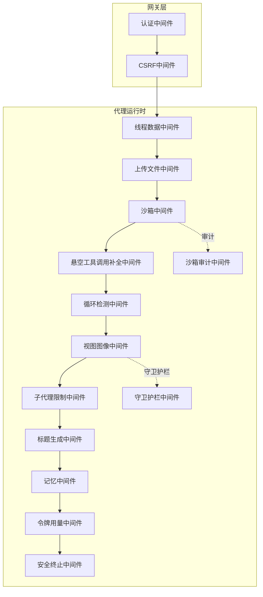
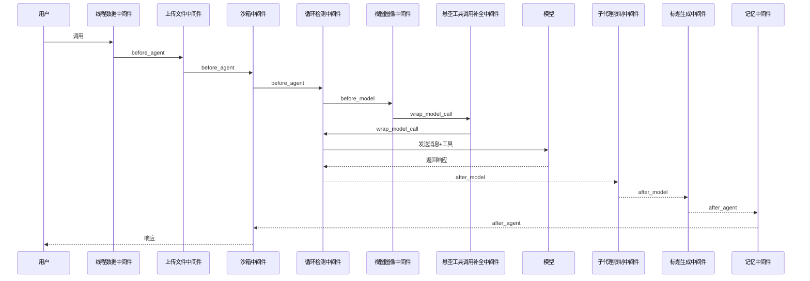
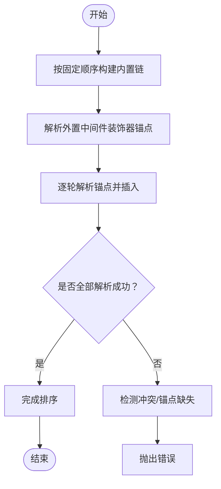
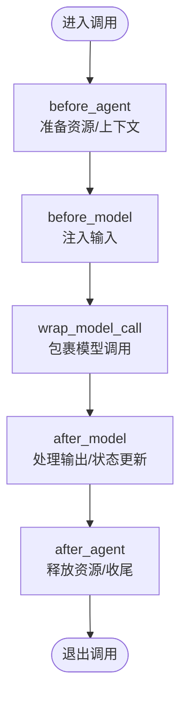
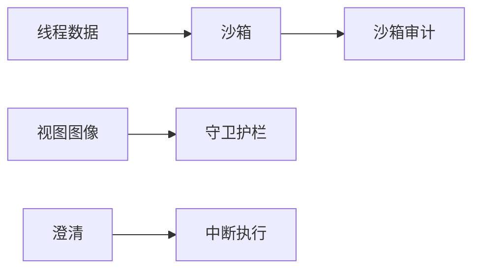

# 中间件概述

<cite>
**本文引用的文件**
- [middleware-execution-flow.md](file://backend/docs/middleware-execution-flow.md)
- [rfc-create-deerflow-agent.md](file://backend/docs/rfc-create-deerflow-agent.md)
- [factory.py](file://backend/packages/harness/deerflow/agents/factory.py)
- [auth_middleware.py](file://backend/app/gateway/auth_middleware.py)
- [csrf_middleware.py](file://backend/app/gateway/csrf_middleware.py)
- [clarification_middleware.py](file://backend/packages/harness/deerflow/agents/middlewares/clarification_middleware.py)
- [dangling_tool_call_middleware.py](file://backend/packages/harness/deerflow/agents/middlewares/dangling_tool_call_middleware.py)
- [loop_detection_middleware.py](file://backend/packages/harness/deerflow/agents/middlewares/loop_detection_middleware.py)
- [sandbox_audit_middleware.py](file://backend/packages/harness/deerflow/agents/middlewares/sandbox_audit_middleware.py)
- [token_usage_middleware.py](file://backend/packages/harness/deerflow/agents/middlewares/token_usage_middleware.py)
- [guardrails/middleware.py](file://backend/packages/harness/deerflow/guardrails/middleware.py)
- [sandbox/middleware.py](file://backend/packages/harness/deerflow/sandbox/middleware.py)
</cite>

## 目录
1. [引言](#引言)
2. [项目结构](#项目结构)
3. [核心组件](#核心组件)
4. [架构总览](#架构总览)
5. [详细组件分析](#详细组件分析)
6. [依赖分析](#依赖分析)
7. [性能考虑](#性能考虑)
8. [故障排查指南](#故障排查指南)
9. [结论](#结论)
10. [附录](#附录)

## 引言
本文件面向DeerFlow中间件系统，系统性阐述中间件在平台中的核心作用与设计理念，解释中间件链的构建原理、执行流程与生命周期管理，以及如何通过中间件实现横切关注点（如安全防护、性能监控、错误处理等）。文档还提供了整体架构图与组件关系说明，并总结了中间件开发的最佳实践与设计原则。

## 项目结构
中间件体系主要分布在以下区域：
- 后端网关层中间件：认证与CSRF等HTTP层中间件，位于网关应用中，负责请求入口的安全与鉴权。
- 代理运行时中间件：位于代理运行时（agents）包中，围绕LLM调用与工具执行构建“管道式”中间件链，覆盖线程数据、上传文件、沙箱、循环检测、工具调用补全、标题生成、记忆入队、子代理限制、令牌用量统计、安全终止等横切能力。
- 安全与审计中间件：Guardrails与Sandbox模块各自提供中间件，用于内容安全与沙箱审计。

图表来源
- [middleware-execution-flow.md:32-82](file://backend/docs/middleware-execution-flow.md#L32-L82)
- [rfc-create-deerflow-agent.md:195-235](file://backend/docs/rfc-create-deerflow-agent.md#L195-L235)

章节来源
- [middleware-execution-flow.md:26-82](file://backend/docs/middleware-execution-flow.md#L26-L82)
- [rfc-create-deerflow-agent.md:190-246](file://backend/docs/rfc-create-deerflow-agent.md#L190-L246)

## 核心组件
- 网关中间件
  - 认证中间件：负责用户身份验证与会话管理，确保后续路由与服务调用具备合法主体。
  - CSRF中间件：防范跨站请求伪造，保障请求来源可信。
- 代理运行时中间件
  - 线程数据中间件：在每次调用前创建线程目录，为后续步骤提供隔离的运行环境。
  - 上传文件中间件：扫描并处理上传附件，保证工具调用前的输入完备。
  - 沙箱中间件：在调用前后获取与释放沙箱资源，确保计算与文件访问受控。
  - 悬空工具调用补全中间件：在多轮对话中补全缺失的工具消息，维持上下文一致性。
  - 循环检测中间件：检测并处理潜在循环或排队警告，防止无限工具调用。
  - 视图图像中间件：在模型调用前注入图片信息，增强视觉理解。
  - 子代理限制中间件：限制任务数量，避免过度并发。
  - 标题生成中间件：在输出后生成对话标题，提升可读性。
  - 记忆中间件：将本轮输出入队至记忆存储，支持后续检索与上下文扩展。
  - 令牌用量中间件：统计与记录令牌消耗，支撑成本与配额控制。
  - 安全终止中间件：处理供应商层面的安全终止信号，避免将被阻断的输出当作可执行工具意图。
  - 守卫护栏中间件：在工具调用前进行内容安全检查，拦截高风险操作。
  - 沙箱审计中间件：记录沙箱内的操作行为，满足合规与审计需求。

章节来源
- [auth_middleware.py](file://backend/app/gateway/auth_middleware.py)
- [csrf_middleware.py](file://backend/app/gateway/csrf_middleware.py)
- [clarification_middleware.py](file://backend/packages/harness/deerflow/agents/middlewares/clarification_middleware.py)
- [dangling_tool_call_middleware.py](file://backend/packages/harness/deerflow/agents/middlewares/dangling_tool_call_middleware.py)
- [loop_detection_middleware.py](file://backend/packages/harness/deerflow/agents/middlewares/loop_detection_middleware.py)
- [sandbox_audit_middleware.py](file://backend/packages/harness/deerflow/agents/middlewares/sandbox_audit_middleware.py)
- [token_usage_middleware.py](file://backend/packages/harness/deerflow/agents/middlewares/token_usage_middleware.py)
- [guardrails/middleware.py](file://backend/packages/harness/deerflow/guardrails/middleware.py)
- [sandbox/middleware.py](file://backend/packages/harness/deerflow/sandbox/middleware.py)

## 架构总览
DeerFlow采用“管道式中间件链”而非传统“洋葱式”嵌套。中间件按阶段分为 before_agent/before_model/wrap_model_call/after_model/after_agent，不同阶段的执行顺序与职责明确，且多数中间件仅使用单个钩子，形成非对称的串行流水线。

图表来源
- [middleware-execution-flow.md:87-161](file://backend/docs/middleware-execution-flow.md#L87-L161)

章节来源
- [middleware-execution-flow.md:26-82](file://backend/docs/middleware-execution-flow.md#L26-L82)
- [middleware-execution-flow.md:85-161](file://backend/docs/middleware-execution-flow.md#L85-L161)

## 详细组件分析

### 中间件链构建与排序策略
- 固定顺序构建：中间件链按固定顺序追加，不使用数值优先级排序，确保内置链的稳定性与可预期性。
- 外置插入：通过装饰器声明相对锚点，允许外部中间件插入到链中的任意位置，支持内置与其他外置锚点。
- 冲突检测：若多个外置中间件同时锚定同一目标，或锚点无法解析，将抛出错误，避免位置冲突与死锁。
- 特殊规则：澄清中间件永远位于链末尾，以便优先拦截ask_clarification并中断执行。

图表来源
- [rfc-create-deerflow-agent.md:238-246](file://backend/docs/rfc-create-deerflow-agent.md#L238-L246)
- [rfc-create-deerflow-agent.md:248-284](file://backend/docs/rfc-create-deerflow-agent.md#L248-L284)
- [factory.py:352-379](file://backend/packages/harness/deerflow/agents/factory.py#L352-L379)

章节来源
- [rfc-create-deerflow-agent.md:190-246](file://backend/docs/rfc-create-deerflow-agent.md#L190-L246)
- [rfc-create-deerflow-agent.md:238-284](file://backend/docs/rfc-create-deerflow-agent.md#L238-L284)
- [factory.py:352-379](file://backend/packages/harness/deerflow/agents/factory.py#L352-L379)

### 生命周期与执行阶段
- before_agent：在进入模型调用前执行，通常用于资源准备与上下文初始化（如线程目录、沙箱获取、上传扫描）。
- before_model：每轮对话中在模型调用前执行，常用于注入输入（如图片）。
- wrap_model_call：包裹模型调用，常用于工具调用补全与警告传播。
- after_model：每轮对话中在模型调用后执行，常用于输出处理与状态更新（如循环检测、标题生成、子代理限制）。
- after_agent：在退出模型调用后执行，通常用于资源释放与收尾（如沙箱释放、记忆入队）。

图表来源
- [middleware-execution-flow.md:26-31](file://backend/docs/middleware-execution-flow.md#L26-L31)

章节来源
- [middleware-execution-flow.md:26-31](file://backend/docs/middleware-execution-flow.md#L26-L31)

### 安全防护中间件
- 守卫护栏中间件：在工具调用前进行内容安全检查，拦截高风险操作，结合策略配置实现分级处置。
- 沙箱审计中间件：记录沙箱内所有操作，满足合规与审计要求，便于追踪与回溯。
- 安全终止中间件：处理供应商层面的安全终止信号，避免将被阻断的输出当作可执行工具意图，确保控制流正确性。

章节来源
- [guardrails/middleware.py](file://backend/packages/harness/deerflow/guardrails/middleware.py)
- [sandbox_audit_middleware.py](file://backend/packages/harness/deerflow/agents/middlewares/sandbox_audit_middleware.py)
- [middleware-execution-flow.md:118-124](file://backend/docs/middleware-execution-flow.md#L118-L124)

### 性能监控与错误处理
- 令牌用量中间件：统计与记录令牌消耗，支撑成本控制与配额管理。
- 错误处理中间件：捕获并处理工具调用与模型调用过程中的异常，提供一致的错误响应与恢复策略。

章节来源
- [token_usage_middleware.py](file://backend/packages/harness/deerflow/agents/middlewares/token_usage_middleware.py)
- [dangling_tool_call_middleware.py](file://backend/packages/harness/deerflow/agents/middlewares/dangling_tool_call_middleware.py)

### 网关层中间件
- 认证中间件：负责用户身份验证与会话管理，确保后续路由与服务调用具备合法主体。
- CSRF中间件：防范跨站请求伪造，保障请求来源可信。

章节来源
- [auth_middleware.py](file://backend/app/gateway/auth_middleware.py)
- [csrf_middleware.py](file://backend/app/gateway/csrf_middleware.py)

## 依赖分析
- 组件耦合
  - 线程数据中间件与沙箱中间件存在强依赖：沙箱需要线程目录先行创建。
  - 澄清中间件位于链末尾，优先拦截ask_clarification并中断执行。
- 外部依赖
  - Guardrails与Sandbox模块提供独立的中间件，作为横切能力集成到代理运行时链中。
- 循环与冲突
  - 通过装饰器锚点与冲突检测机制，避免外置中间件之间的位置冲突与循环依赖。

图表来源
- [rfc-create-deerflow-agent.md:278-282](file://backend/docs/rfc-create-deerflow-agent.md#L278-L282)
- [middleware-execution-flow.md:279-282](file://backend/docs/middleware-execution-flow.md#L279-L282)

章节来源
- [rfc-create-deerflow-agent.md:238-284](file://backend/docs/rfc-create-deerflow-agent.md#L238-L284)
- [middleware-execution-flow.md:279-282](file://backend/docs/middleware-execution-flow.md#L279-L282)

## 性能考虑
- 中间件链长度与顺序直接影响调用延迟。建议：
  - 将昂贵的中间件（如视图图像注入、守卫护栏检查）置于链靠前位置，尽早失败以减少后续开销。
  - 合理使用after_model钩子，避免在每轮对话中重复执行高成本操作。
  - 对外置中间件的锚点进行审慎选择，避免引入不必要的插入轮次与冲突检测开销。

## 故障排查指南
- 中间件位置冲突
  - 现象：启动或装配中间件链时报错，提示无法解析锚点或存在循环依赖。
  - 处理：检查装饰器声明的锚点类型与链中是否存在该类型中间件；避免多个外置中间件同时锚定同一目标。
- 执行顺序异常
  - 现象：某些中间件未按预期执行或资源未正确释放。
  - 处理：核对before_agent/after_agent与before_model/after_model/wrap_model_call的调用时机；确保线程数据在沙箱之前。
- 安全拦截导致误判
  - 现象：正常工具被拦截或安全终止信号误触发。
  - 处理：检查守卫护栏与安全终止中间件的策略配置；必要时降低敏感度或临时关闭以定位问题。

章节来源
- [factory.py:352-379](file://backend/packages/harness/deerflow/agents/factory.py#L352-L379)
- [middleware-execution-flow.md:279-282](file://backend/docs/middleware-execution-flow.md#L279-L282)

## 结论
DeerFlow中间件系统通过“管道式”链式设计，将横切关注点以模块化方式融入代理运行时与网关层。固定顺序构建与装饰器锚点插入相结合，既保证了内置链的稳定性，又允许灵活扩展。借助清晰的生命周期与严格的冲突检测机制，系统在安全性、可观测性与可维护性之间取得了良好平衡。

## 附录
- 设计原则
  - 单一职责：每个中间件聚焦单一横切关注点。
  - 明确边界：严格区分before/after与wrap阶段，避免职责混淆。
  - 可插拔：通过装饰器锚点实现外置中间件的可插拔式扩展。
  - 可观测：为关键阶段提供日志与指标采集接口。
  - 可回退：对高风险中间件（如安全拦截）提供可控的降级策略。