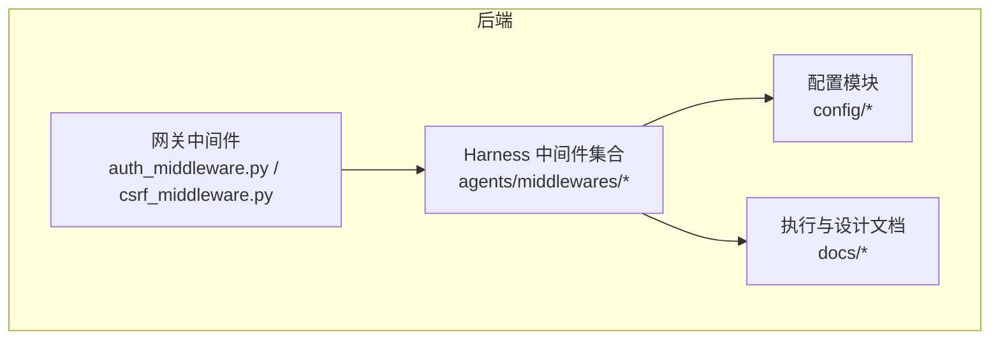
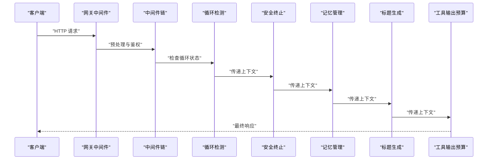
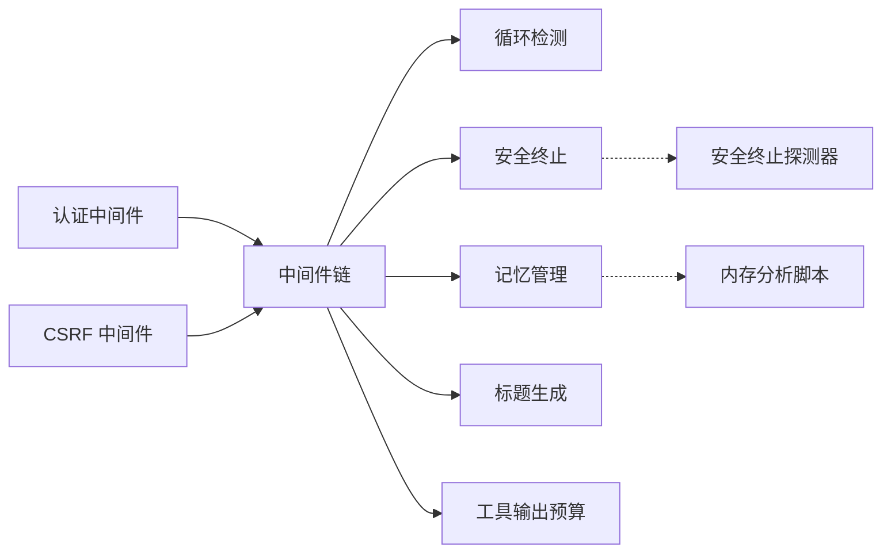

# 中间件配置

<cite>
**本文引用的文件**
- [loop_detection_middleware.py](file://backend/packages/harness/deerflow/agents/middlewares/loop_detection_middleware.py)
- [safety_finish_reason_middleware.py](file://backend/packages/harness/deerflow/agents/middlewares/safety_finish_reason_middleware.py)
- [memory_middleware.py](file://backend/packages/harness/deerflow/agents/middlewares/memory_middleware.py)
- [title_middleware.py](file://backend/packages/harness/deerflow/agents/middlewares/title_middleware.py)
- [token_usage_middleware.py](file://backend/packages/harness/deerflow/agents/middlewares/token_usage_middleware.py)
- [clarification_middleware.py](file://backend/packages/harness/deerflow/agents/middlewares/clarification_middleware.py)
- [dangling_tool_call_middleware.py](file://backend/packages/harness/deerflow/agents/middlewares/dangling_tool_call_middleware.py)
- [deferred_tool_filter_middleware.py](file://backend/packages/harness/deerflow/agents/middlewares/deferred_tool_filter_middleware.py)
- [dynamic_context_middleware.py](file://backend/packages/harness/deerflow/agents/middlewares/dynamic_context_middleware.py)
- [llm_error_handling_middleware.py](file://backend/packages/harness/deerflow/agents/middlewares/llm_error_handling_middleware.py)
- [sandbox_audit_middleware.py](file://backend/packages/harness/deerflow/agents/middlewares/sandbox_audit_middleware.py)
- [skill_activation_middleware.py](file://backend/packages/harness/deerflow/agents/middlewares/skill_activation_middleware.py)
- [subagent_limit_middleware.py](file://backend/packages/harness/deerflow/agents/middlewares/subagent_limit_middleware.py)
- [summarization_middleware.py](file://backend/packages/harness/deerflow/agents/middlewares/summarization_middleware.py)
- [thread_data_middleware.py](file://backend/packages/harness/deerflow/agents/middlewares/thread_data_middleware.py)
- [todo_middleware.py](file://backend/packages/harness/deerflow/agents/middlewares/todo_middleware.py)
- [safety_termination_detectors.py](file://backend/packages/harness/deerflow/agents/middlewares/safety_termination_detectors.py)
- [__init__.py](file://backend/packages/harness/deerflow/agents/middlewares/__init__.py)
- [loop_detection_config.py](file://backend/packages/harness/deerflow/config/loop_detection_config.py)
- [safety_finish_reason_config.py](file://backend/packages/harness/deerflow/config/safety_finish_reason_config.py)
- [memory_config.py](file://backend/packages/harness/deerflow/config/memory_config.py)
- [title_config.py](file://backend/packages/harness/deerflow/config/title_config.py)
- [token_usage_config.py](file://backend/packages/harness/deerflow/config/token_usage_config.py)
- [middleware-execution-flow.md](file://backend/docs/middleware-execution-flow.md)
- [CONFIGURATION.md](file://backend/docs/CONFIGURATION.md)
- [AUTH_DESIGN.md](file://backend/docs/AUTH_DESIGN.md)
- [GUARDRAILS.md](file://backend/docs/GUARDRAILS.md)
- [AUTO_TITLE_GENERATION.md](file://backend/docs/AUTO_TITLE_GENERATION.md)
- [MEMORY_IMPROVEMENTS.md](file://backend/docs/MEMORY_IMPROVEMENTS.md)
- [SANDBOX_MEMORY_PROFILING.md](file://backend/docs/SANDBOX_MEMORY_PROFILING.md)
- [BLOCKING_IO_DETECTION.md](file://backend/docs/BLOCKING_IO_DETECTION.md)
- [STREAMING.md](file://backend/docs/STREAMING.md)
- [TITLE_GENERATION_IMPLEMENTATION.md](file://backend/docs/TITLE_GENERATION_IMPLEMENTATION.md)
- [middleware-execution-flow.md](file://backend/docs/middleware-execution-flow.md)
- [auth_middleware.py](file://backend/app/gateway/auth_middleware.py)
- [csrf_middleware.py](file://backend/app/gateway/csrf_middleware.py)
</cite>

## 目录
1. [简介](#简介)
2. [项目结构](#项目结构)
3. [核心组件](#核心组件)
4. [架构总览](#架构总览)
5. [详细组件分析](#详细组件分析)
6. [依赖关系分析](#依赖关系分析)
7. [性能考虑](#性能考虑)
8. [故障排除指南](#故障排除指南)
9. [结论](#结论)
10. [附录](#附录)

## 简介
本指南聚焦于 deer-flow 的中间件体系，涵盖循环检测、安全终止、记忆管理、工具输出预算、标题生成等核心中间件的功能与配置方法；解释中间件链的构建、执行顺序与参数传递机制；提供自定义中间件开发与集成的实践步骤；并给出性能调优、调试与故障排除的实用技巧。

## 项目结构
中间件主要位于后端 harness 包的 agents/middlewares 目录中，同时在 gateway 层有网关级中间件（认证、CSRF）。配置项分布在 deerflow/config 下对应模块的配置文件中。文档目录提供了执行流程、配置、安全与内存优化等背景资料。

**图表来源**
- [__init__.py](file://backend/packages/harness/deerflow/agents/middlewares/__init__.py)
- [auth_middleware.py](file://backend/app/gateway/auth_middleware.py)
- [csrf_middleware.py](file://backend/app/gateway/csrf_middleware.py)

**章节来源**
- [__init__.py](file://backend/packages/harness/deerflow/agents/middlewares/__init__.py)
- [middleware-execution-flow.md](file://backend/docs/middleware-execution-flow.md)

## 核心组件
本节概述与目标相关的中间件及其职责：
- 循环检测：防止代理在多轮对话或工具调用中陷入重复模式，保障运行稳定性。
- 安全终止：基于原因码或外部探测器实现安全停止，避免危险或异常状态持续。
- 记忆管理：维护线程上下文、消息队列与持久化，支持用户隔离与内存优化。
- 工具输出预算：限制工具输出大小，控制资源消耗与响应时间。
- 标题生成：自动为线程生成标题，提升可读性与检索效率。

上述组件均通过配置文件进行参数化控制，执行顺序由中间件链定义，参数在上下文中传递。

**章节来源**
- [loop_detection_middleware.py](file://backend/packages/harness/deerflow/agents/middlewares/loop_detection_middleware.py)
- [safety_finish_reason_middleware.py](file://backend/packages/harness/deerflow/agents/middlewares/safety_finish_reason_middleware.py)
- [memory_middleware.py](file://backend/packages/harness/deerflow/agents/middlewares/memory_middleware.py)
- [title_middleware.py](file://backend/packages/harness/deerflow/agents/middlewares/title_middleware.py)
- [token_usage_middleware.py](file://backend/packages/harness/deerflow/agents/middlewares/token_usage_middleware.py)
- [loop_detection_config.py](file://backend/packages/harness/deerflow/config/loop_detection_config.py)
- [safety_finish_reason_config.py](file://backend/packages/harness/deerflow/config/safety_finish_reason_config.py)
- [memory_config.py](file://backend/packages/harness/deerflow/config/memory_config.py)
- [title_config.py](file://backend/packages/harness/deerflow/config/title_config.py)
- [token_usage_config.py](file://backend/packages/harness/deerflow/config/token_usage_config.py)

## 架构总览
中间件链在运行时按序执行，上游中间件可修改上下文，下游中间件接收更新后的上下文。网关中间件负责鉴权与请求预处理，Harness 中间件负责业务域内的安全、记忆、标题与资源控制。

**图表来源**
- [middleware-execution-flow.md](file://backend/docs/middleware-execution-flow.md)
- [auth_middleware.py](file://backend/app/gateway/auth_middleware.py)
- [csrf_middleware.py](file://backend/app/gateway/csrf_middleware.py)
- [loop_detection_middleware.py](file://backend/packages/harness/deerflow/agents/middlewares/loop_detection_middleware.py)
- [safety_finish_reason_middleware.py](file://backend/packages/harness/deerflow/agents/middlewares/safety_finish_reason_middleware.py)
- [memory_middleware.py](file://backend/packages/harness/deerflow/agents/middlewares/memory_middleware.py)
- [title_middleware.py](file://backend/packages/harness/deerflow/agents/middlewares/title_middleware.py)
- [token_usage_middleware.py](file://backend/packages/harness/deerflow/agents/middlewares/token_usage_middleware.py)

## 详细组件分析

### 循环检测中间件
- 功能要点
  - 检测代理在多轮对话中的重复行为，防止无限循环或卡顿。
  - 可结合历史消息与工具调用序列进行模式识别。
- 关键配置
  - 阈值与窗口大小：控制检测的敏感度与性能开销。
  - 忽略规则：对特定工具或消息类型进行豁免。
- 参数传递
  - 在上下文中记录最近交互摘要，供后续中间件参考。
- 调试建议
  - 开启日志记录，观察检测触发条件与回退策略。

**章节来源**
- [loop_detection_middleware.py](file://backend/packages/harness/deerflow/agents/middlewares/loop_detection_middleware.py)
- [loop_detection_config.py](file://backend/packages/harness/deerflow/config/loop_detection_config.py)

### 安全终止中间件
- 功能要点
  - 基于完成原因码（如“停止”、“结束”）或外部探测器判断是否安全终止。
  - 支持与沙箱审计中间件联动，确保终止前清理资源。
- 关键配置
  - 终止原因码白名单、探测器阈值与超时设置。
- 参数传递
  - 将终止信号写入上下文，影响后续中间件行为。
- 调试建议
  - 使用探测器日志定位异常终止场景，验证清理流程。

**章节来源**
- [safety_finish_reason_middleware.py](file://backend/packages/harness/deerflow/agents/middlewares/safety_finish_reason_middleware.py)
- [safety_finish_reason_config.py](file://backend/packages/harness/deerflow/config/safety_finish_reason_config.py)
- [safety_termination_detectors.py](file://backend/packages/harness/deerflow/agents/middlewares/safety_termination_detectors.py)

### 记忆管理中间件
- 功能要点
  - 维护线程消息队列、上下文元数据与持久化存储。
  - 支持用户隔离、队列长度与过期策略。
- 关键配置
  - 队列容量、过期时间、持久化开关与用户隔离级别。
- 参数传递
  - 上下文包含 thread_id、messages、meta 等字段，供其他中间件读取。
- 调试建议
  - 使用内存优化文档提供的分析脚本，排查内存增长与队列堆积。

**章节来源**
- [memory_middleware.py](file://backend/packages/harness/deerflow/agents/middlewares/memory_middleware.py)
- [memory_config.py](file://backend/packages/harness/deerflow/config/memory_config.py)
- [MEMORY_IMPROVEMENTS.md](file://backend/docs/MEMORY_IMPROVEMENTS.md)
- [SANDBOX_MEMORY_PROFILING.md](file://backend/docs/SANDBOX_MEMORY_PROFILING.md)

### 标题生成中间件
- 功能要点
  - 自动为线程生成标题，提升检索与导航体验。
  - 可与标题生成实现文档描述的策略协同。
- 关键配置
  - 标题长度上限、关键词过滤与生成模型参数。
- 参数传递
  - 将生成的标题写入线程元数据，供路由与展示使用。
- 调试建议
  - 对比不同提示词与模型参数对标题质量的影响。

**章节来源**
- [title_middleware.py](file://backend/packages/harness/deerflow/agents/middlewares/title_middleware.py)
- [title_config.py](file://backend/packages/harness/deerflow/config/title_config.py)
- [AUTO_TITLE_GENERATION.md](file://backend/docs/AUTO_TITLE_GENERATION.md)
- [TITLE_GENERATION_IMPLEMENTATION.md](file://backend/docs/TITLE_GENERATION_IMPLEMENTATION.md)

### 工具输出预算中间件
- 功能要点
  - 限制工具输出大小，避免单次响应过大导致延迟或资源耗尽。
- 关键配置
  - 输出上限、截断策略与重试次数。
- 参数传递
  - 在上下文中记录已用配额与剩余额度，供后续中间件决策。
- 调试建议
  - 结合流式传输文档，观察实时配额变化与截断效果。

**章节来源**
- [token_usage_middleware.py](file://backend/packages/harness/deerflow/agents/middlewares/token_usage_middleware.py)
- [token_usage_config.py](file://backend/packages/harness/deerflow/config/token_usage_config.py)
- [STREAMING.md](file://backend/docs/STREAMING.md)

### 其他常用中间件（与配置相关）
- 动态上下文中间件：根据当前消息动态注入上下文信息。
- 延迟工具过滤中间件：对延迟或高风险工具进行过滤或降级。
- LLM 错误处理中间件：捕获与恢复 LLM 调用错误。
- 沙箱审计中间件：记录与审计沙箱操作，配合安全终止。
- 子代理限制中间件：限制子代理并发数与生命周期。
- 待办事项中间件：提取并管理待办任务。
- 技能激活中间件：按需启用技能与工具集。
- 工具悬空调用中间件：检测并处理未匹配的工具调用。
- 清晰化中间件：引导用户提供更明确的指令。

以上中间件均可通过相应配置文件进行参数化控制，执行顺序与参数传递遵循中间件链规范。

**章节来源**
- [dynamic_context_middleware.py](file://backend/packages/harness/deerflow/agents/middlewares/dynamic_context_middleware.py)
- [deferred_tool_filter_middleware.py](file://backend/packages/harness/deerflow/agents/middlewares/deferred_tool_filter_middleware.py)
- [llm_error_handling_middleware.py](file://backend/packages/harness/deerflow/agents/middlewares/llm_error_handling_middleware.py)
- [sandbox_audit_middleware.py](file://backend/packages/harness/deerflow/agents/middlewares/sandbox_audit_middleware.py)
- [subagent_limit_middleware.py](file://backend/packages/harness/deerflow/agents/middlewares/subagent_limit_middleware.py)
- [todo_middleware.py](file://backend/packages/harness/deerflow/agents/middlewares/todo_middleware.py)
- [skill_activation_middleware.py](file://backend/packages/harness/deerflow/agents/middlewares/skill_activation_middleware.py)
- [dangling_tool_call_middleware.py](file://backend/packages/harness/deerflow/agents/middlewares/dangling_tool_call_middleware.py)
- [clarification_middleware.py](file://backend/packages/harness/deerflow/agents/middlewares/clarification_middleware.py)
- [summarization_middleware.py](file://backend/packages/harness/deerflow/agents/middlewares/summarization_middleware.py)
- [thread_data_middleware.py](file://backend/packages/harness/deerflow/agents/middlewares/thread_data_middleware.py)

## 依赖关系分析
中间件之间存在弱耦合的依赖关系，主要通过上下文共享实现解耦。网关中间件负责输入预处理与鉴权，Harness 中间件负责业务域内控制与增强。

**图表来源**
- [auth_middleware.py](file://backend/app/gateway/auth_middleware.py)
- [csrf_middleware.py](file://backend/app/gateway/csrf_middleware.py)
- [loop_detection_middleware.py](file://backend/packages/harness/deerflow/agents/middlewares/loop_detection_middleware.py)
- [safety_finish_reason_middleware.py](file://backend/packages/harness/deerflow/agents/middlewares/safety_finish_reason_middleware.py)
- [memory_middleware.py](file://backend/packages/harness/deerflow/agents/middlewares/memory_middleware.py)
- [title_middleware.py](file://backend/packages/harness/deerflow/agents/middlewares/title_middleware.py)
- [token_usage_middleware.py](file://backend/packages/harness/deerflow/agents/middlewares/token_usage_middleware.py)
- [safety_termination_detectors.py](file://backend/packages/harness/deerflow/agents/middlewares/safety_termination_detectors.py)
- [SANDBOX_MEMORY_PROFILING.md](file://backend/docs/SANDBOX_MEMORY_PROFILING.md)

**章节来源**
- [__init__.py](file://backend/packages/harness/deerflow/agents/middlewares/__init__.py)
- [middleware-execution-flow.md](file://backend/docs/middleware-execution-flow.md)

## 性能考虑
- 执行顺序优化
  - 将轻量且高频的中间件（如工具输出预算、动态上下文）置于链前端，减少后续中间件负担。
  - 将昂贵的中间件（如标题生成、记忆持久化）置于链后端，避免重复计算。
- 资源控制
  - 合理设置循环检测窗口与阈值，平衡准确率与性能。
  - 使用工具输出预算限制单次输出，结合流式传输降低延迟。
- 内存与 I/O
  - 利用内存优化文档建议的队列与过期策略，定期清理无用上下文。
  - 使用阻塞 I/O 检测文档识别潜在阻塞点，避免主线程阻塞。
- 并发与隔离
  - 子代理限制中间件用于控制并发，防止资源争用。
  - 用户隔离配置确保多租户环境下的稳定性。

**章节来源**
- [BLOCKING_IO_DETECTION.md](file://backend/docs/BLOCKING_IO_DETECTION.md)
- [MEMORY_IMPROVEMENTS.md](file://backend/docs/MEMORY_IMPROVEMENTS.md)
- [SANDBOX_MEMORY_PROFILING.md](file://backend/docs/SANDBOX_MEMORY_PROFILING.md)
- [STREAMING.md](file://backend/docs/STREAMING.md)

## 故障排除指南
- 循环检测误报
  - 检查配置阈值与窗口大小，必要时调整忽略规则。
  - 查看中间件日志，确认触发条件与回退策略。
- 安全终止不生效
  - 校验完成原因码是否在白名单内，探测器是否正确配置。
  - 检查沙箱审计中间件是否提前清理导致终止信号丢失。
- 记忆管理异常
  - 排查队列容量与过期策略，确认持久化开关与用户隔离级别。
  - 使用内存分析脚本定位内存泄漏或队列堆积。
- 标题生成失败
  - 检查标题生成模型参数与关键词过滤规则，对比不同提示词效果。
- 工具输出预算不足
  - 提高预算上限或优化工具输出格式，结合流式传输观察实时变化。
- 网关层问题
  - 认证与 CSRF 中间件异常会导致请求被拒绝，检查鉴权配置与跨域设置。

**章节来源**
- [loop_detection_middleware.py](file://backend/packages/harness/deerflow/agents/middlewares/loop_detection_middleware.py)
- [safety_finish_reason_middleware.py](file://backend/packages/harness/deerflow/agents/middlewares/safety_finish_reason_middleware.py)
- [memory_middleware.py](file://backend/packages/harness/deerflow/agents/middlewares/memory_middleware.py)
- [title_middleware.py](file://backend/packages/harness/deerflow/agents/middlewares/title_middleware.py)
- [token_usage_middleware.py](file://backend/packages/harness/deerflow/agents/middlewares/token_usage_middleware.py)
- [auth_middleware.py](file://backend/app/gateway/auth_middleware.py)
- [csrf_middleware.py](file://backend/app/gateway/csrf_middleware.py)

## 结论
中间件体系通过清晰的职责划分与可配置参数，实现了从安全、记忆到资源控制的全链路治理。合理选择与排序中间件、精细化配置参数、结合文档与脚本进行性能与故障诊断，是稳定运行的关键。

## 附录
- 中间件链构建与执行顺序
  - 参考执行流程文档，明确各中间件在链中的位置与依赖。
- 配置总览
  - 参考配置文档，统一管理认证、安全、内存、标题与资源控制等配置。
- 安全与守卫
  - 参考安全设计与守卫文档，确保中间件符合安全基线要求。

**章节来源**
- [middleware-execution-flow.md](file://backend/docs/middleware-execution-flow.md)
- [CONFIGURATION.md](file://backend/docs/CONFIGURATION.md)
- [AUTH_DESIGN.md](file://backend/docs/AUTH_DESIGN.md)
- [GUARDRAILS.md](file://backend/docs/GUARDRAILS.md)