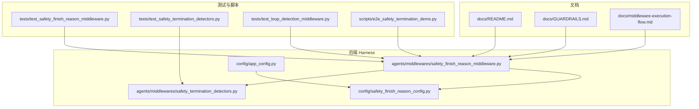
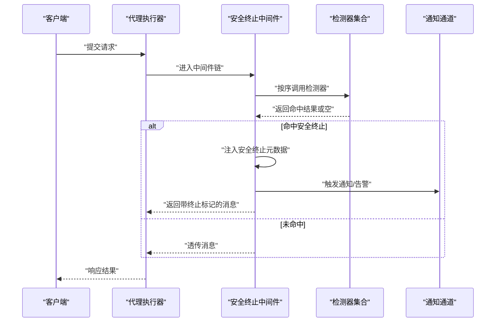
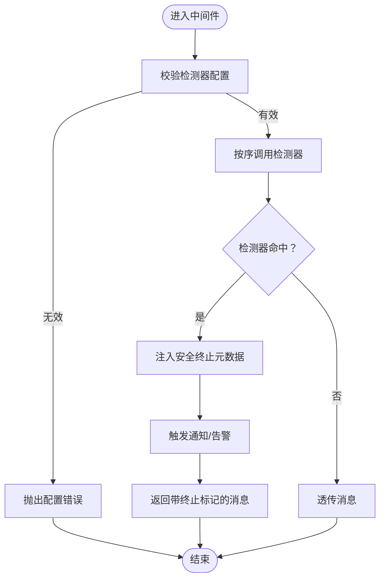
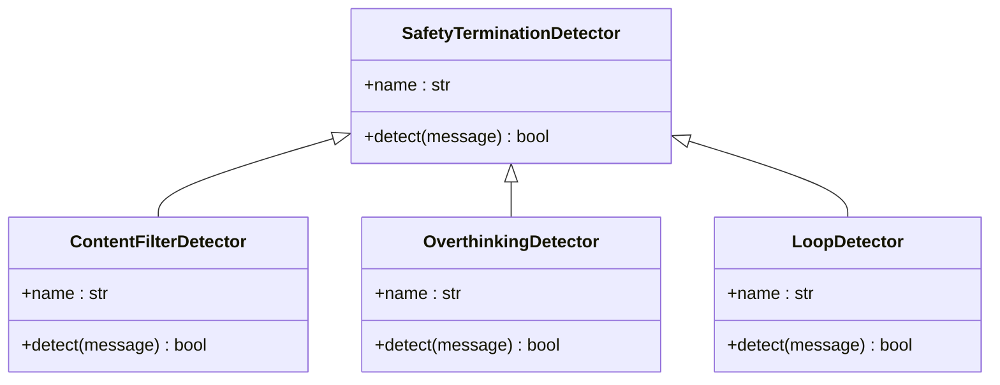
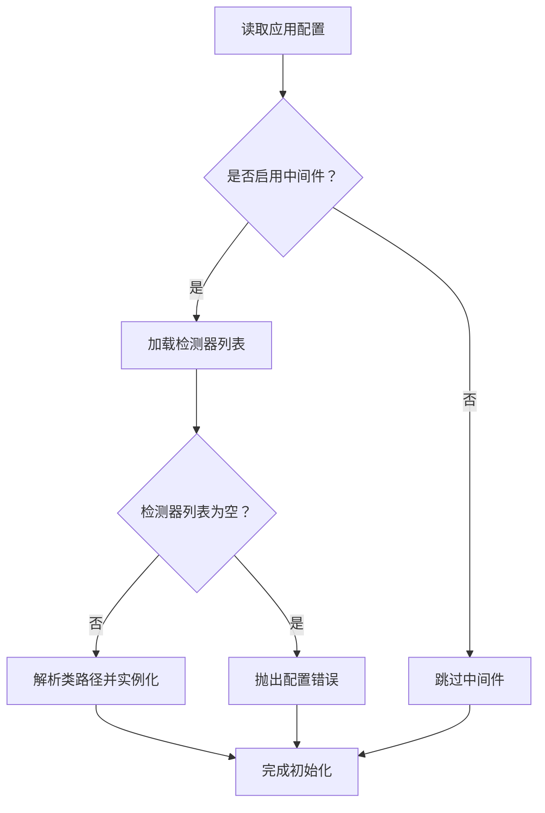
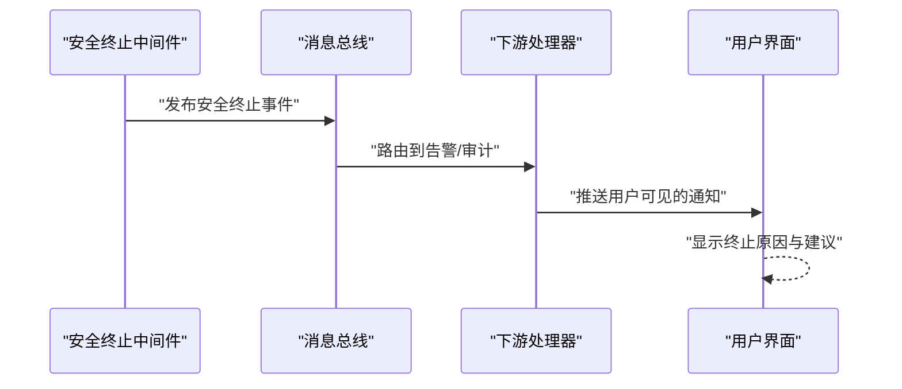
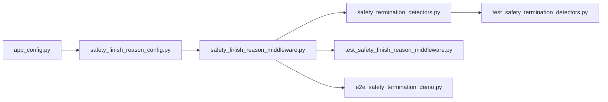

# 安全终止中间件

<cite>
**本文引用的文件**
- [safety_finish_reason_middleware.py](file://backend/packages/harness/deerflow/agents/middlewares/safety_finish_reason_middleware.py)
- [safety_termination_detectors.py](file://backend/packages/harness/deerflow/agents/middlewares/safety_termination_detectors.py)
- [safety_finish_reason_config.py](file://backend/packages/harness/deerflow/config/safety_finish_reason_config.py)
- [app_config.py](file://backend/packages/harness/deerflow/config/app_config.py)
- [test_safety_finish_reason_middleware.py](file://backend/tests/test_safety_finish_reason_middleware.py)
- [test_safety_termination_detectors.py](file://backend/tests/test_safety_termination_detectors.py)
- [test_loop_detection_middleware.py](file://backend/tests/test_loop_detection_middleware.py)
- [e2e_safety_termination_demo.py](file://backend/scripts/e2e_safety_termination_demo.py)
- [README.md](file://backend/docs/README.md)
- [GUARDRAILS.md](file://backend/docs/GUARDRAILS.md)
- [middleware-execution-flow.md](file://backend/docs/middleware-execution-flow.md)
</cite>

## 目录
1. [简介](#简介)
2. [项目结构](#项目结构)
3. [核心组件](#核心组件)
4. [架构总览](#架构总览)
5. [详细组件分析](#详细组件分析)
6. [依赖关系分析](#依赖关系分析)
7. [性能考虑](#性能考虑)
8. [故障排查指南](#故障排查指南)
9. [结论](#结论)
10. [附录](#附录)

## 简介
本指南面向安全与合规团队及平台运维人员，系统性介绍“安全终止中间件”的配置与使用方法。该中间件用于在运行时拦截并处理由模型返回的“安全相关终止原因”，通过可插拔的检测器实现对内容安全、过度思考（思维模式）以及循环推理等高风险行为的识别与响应。文档涵盖：
- 检测器类型与功能说明
- 阈值、权重与响应策略配置
- 不同场景的配置示例与最佳实践
- 触发后的处理流程与用户通知机制
- 配置测试与验证方法

## 项目结构
安全终止中间件位于后端 harness 包中，与应用配置、测试用例共同构成完整的安全治理链路。

**图表来源**
- [safety_finish_reason_middleware.py:1-120](file://backend/packages/harness/deerflow/agents/middlewares/safety_finish_reason_middleware.py#L1-L120)
- [safety_termination_detectors.py:1-160](file://backend/packages/harness/deerflow/agents/middlewares/safety_termination_detectors.py#L1-L160)
- [safety_finish_reason_config.py:1-60](file://backend/packages/harness/deerflow/config/safety_finish_reason_config.py#L1-L60)
- [app_config.py:110-130](file://backend/packages/harness/deerflow/config/app_config.py#L110-L130)

**章节来源**
- [safety_finish_reason_middleware.py:1-120](file://backend/packages/harness/deerflow/agents/middlewares/safety_finish_reason_middleware.py#L1-L120)
- [safety_termination_detectors.py:1-160](file://backend/packages/harness/deerflow/agents/middlewares/safety_termination_detectors.py#L1-L160)
- [safety_finish_reason_config.py:1-60](file://backend/packages/harness/deerflow/config/safety_finish_reason_config.py#L1-L60)
- [app_config.py:110-130](file://backend/packages/harness/deerflow/config/app_config.py#L110-L130)

## 核心组件
- 安全终止中间件：负责在消息流经代理执行器时，检查并处理安全相关终止原因，支持按顺序迭代多个检测器，并在命中时注入安全终止元数据。
- 安全终止检测器：可插拔的检测器集合，用于识别不同类型的终止原因（如内容安全过滤、过度思考模式、循环推理等）。
- 应用配置：集中管理安全终止中间件的启用状态、检测器列表与参数。
- 测试与演示：提供单元测试与端到端演示脚本，验证配置正确性与行为一致性。

**章节来源**
- [safety_finish_reason_middleware.py:80-120](file://backend/packages/harness/deerflow/agents/middlewares/safety_finish_reason_middleware.py#L80-L120)
- [safety_termination_detectors.py:1-160](file://backend/packages/harness/deerflow/agents/middlewares/safety_termination_detectors.py#L1-L160)
- [safety_finish_reason_config.py:1-60](file://backend/packages/harness/deerflow/config/safety_finish_reason_config.py#L1-L60)
- [app_config.py:110-130](file://backend/packages/harness/deerflow/config/app_config.py#L110-L130)

## 架构总览
安全终止中间件在代理执行链路中的位置如下：

**图表来源**
- [safety_finish_reason_middleware.py:120-200](file://backend/packages/harness/deerflow/agents/middlewares/safety_finish_reason_middleware.py#L120-L200)
- [safety_termination_detectors.py:1-160](file://backend/packages/harness/deerflow/agents/middlewares/safety_termination_detectors.py#L1-L160)

## 详细组件分析

### 安全终止中间件
- 职责
  - 在代理执行过程中拦截消息，调用一组检测器进行安全判定。
  - 若检测器命中，则向消息附加安全终止元数据（包含检测器名称、原因值等），并可触发后续处理流程。
  - 支持禁用与自定义检测器列表；当检测器列表为空时会抛出明确错误，避免静默失效。
- 关键行为
  - 检测器实例化：根据配置项动态解析类路径并构造检测器实例。
  - 命中处理：将检测器名称与原因值写入消息的附加字段，便于下游路由与通知。
  - 异常容错：若某个检测器抛异常，中间件会记录并继续下一个检测器，确保不会中断整个运行。

**图表来源**
- [safety_finish_reason_middleware.py:80-120](file://backend/packages/harness/deerflow/agents/middlewares/safety_finish_reason_middleware.py#L80-L120)
- [safety_finish_reason_middleware.py:120-200](file://backend/packages/harness/deerflow/agents/middlewares/safety_finish_reason_middleware.py#L120-L200)

**章节来源**
- [safety_finish_reason_middleware.py:80-120](file://backend/packages/harness/deerflow/agents/middlewares/safety_finish_reason_middleware.py#L80-L120)
- [safety_finish_reason_middleware.py:120-200](file://backend/packages/harness/deerflow/agents/middlewares/safety_finish_reason_middleware.py#L120-L200)
- [test_safety_finish_reason_middleware.py:374-400](file://backend/tests/test_safety_finish_reason_middleware.py#L374-L400)

### 安全终止检测器
- 功能定位
  - 提供多种内置检测器，覆盖内容安全过滤、模型特定安全原因、过度思考模式、循环推理等场景。
  - 每个检测器需实现统一接口（包含名称与检测方法），以便中间件按序调用。
- 典型类型
  - 内容安全检测：识别由模型返回的内容过滤类终止原因。
  - 过度思考检测：识别模型“思考模式”输出中可能存在的过度推理倾向。
  - 循环推理检测：识别工具调用或消息内容中的循环模式，防止无意义重复。
- 使用方式
  - 通过配置项指定检测器类路径与参数，中间件在初始化时解析并实例化。

**图表来源**
- [safety_termination_detectors.py:1-160](file://backend/packages/harness/deerflow/agents/middlewares/safety_termination_detectors.py#L1-L160)

**章节来源**
- [safety_termination_detectors.py:1-160](file://backend/packages/harness/deerflow/agents/middlewares/safety_termination_detectors.py#L1-L160)
- [test_safety_termination_detectors.py:1-120](file://backend/tests/test_safety_termination_detectors.py#L1-L120)

### 配置与参数
- 中间件启用与检测器列表
  - 在应用配置中启用安全终止中间件，并提供检测器列表。列表为空将触发配置错误，必须显式指定至少一个检测器或完全禁用中间件。
- 检测器条目结构
  - 每个条目包含类路径与可选参数字典，中间件通过反射解析类并传参实例化。
- 配置示例参考
  - 参考测试用例中的配置片段，了解如何声明检测器与参数。

**图表来源**
- [safety_finish_reason_middleware.py:80-120](file://backend/packages/harness/deerflow/agents/middlewares/safety_finish_reason_middleware.py#L80-L120)
- [safety_finish_reason_config.py:1-60](file://backend/packages/harness/deerflow/config/safety_finish_reason_config.py#L1-L60)

**章节来源**
- [safety_finish_reason_config.py:1-60](file://backend/packages/harness/deerflow/config/safety_finish_reason_config.py#L1-L60)
- [app_config.py:110-130](file://backend/packages/harness/deerflow/config/app_config.py#L110-L130)
- [test_safety_finish_reason_middleware.py:374-400](file://backend/tests/test_safety_finish_reason_middleware.py#L374-L400)

### 处理流程与用户通知
- 触发条件
  - 当任一检测器返回命中时，中间件会在消息附加字段中写入检测器名称与原因值。
- 后续处理
  - 可在下游中间件或路由中读取附加字段，决定是否中断会话、记录审计日志、发送告警或提示用户。
- 用户通知
  - 建议在网关或前端层监听安全终止事件，向用户展示友好提示或引导其调整输入。

**图表来源**
- [safety_finish_reason_middleware.py:120-200](file://backend/packages/harness/deerflow/agents/middlewares/safety_finish_reason_middleware.py#L120-L200)

**章节来源**
- [safety_finish_reason_middleware.py:120-200](file://backend/packages/harness/deerflow/agents/middlewares/safety_finish_reason_middleware.py#L120-L200)

## 依赖关系分析
- 组件耦合
  - 中间件依赖于检测器接口与配置模块；检测器实现相对独立，便于扩展新类型。
- 外部集成点
  - 与应用配置模块集成，通过统一入口启用/禁用与参数传递。
  - 与通知通道解耦，通过消息附加字段实现事件广播。

**图表来源**
- [app_config.py:110-130](file://backend/packages/harness/deerflow/config/app_config.py#L110-L130)
- [safety_finish_reason_config.py:1-60](file://backend/packages/harness/deerflow/config/safety_finish_reason_config.py#L1-L60)
- [safety_finish_reason_middleware.py:1-120](file://backend/packages/harness/deerflow/agents/middlewares/safety_finish_reason_middleware.py#L1-L120)
- [safety_termination_detectors.py:1-160](file://backend/packages/harness/deerflow/agents/middlewares/safety_termination_detectors.py#L1-L160)
- [test_safety_finish_reason_middleware.py:374-400](file://backend/tests/test_safety_finish_reason_middleware.py#L374-L400)
- [test_safety_termination_detectors.py:1-120](file://backend/tests/test_safety_termination_detectors.py#L1-L120)
- [e2e_safety_termination_demo.py:1-120](file://backend/scripts/e2e_safety_termination_demo.py#L1-L120)

**章节来源**
- [app_config.py:110-130](file://backend/packages/harness/deerflow/config/app_config.py#L110-L130)
- [safety_finish_reason_middleware.py:1-120](file://backend/packages/harness/deerflow/agents/middlewares/safety_finish_reason_middleware.py#L1-L120)
- [safety_termination_detectors.py:1-160](file://backend/packages/harness/deerflow/agents/middlewares/safety_termination_detectors.py#L1-L160)

## 性能考虑
- 检测器顺序
  - 将命中概率高且计算成本低的检测器置于前列，减少不必要的开销。
- 异常容错
  - 单个检测器异常不应影响整体运行，中间件已内置容错逻辑。
- 批量与并发
  - 在高并发场景下，建议评估检测器实现的线程安全性与资源占用，必要时引入缓存或限流。

## 故障排查指南
- 常见问题
  - 检测器列表为空：中间件会抛出配置错误，请提供至少一个检测器或禁用中间件。
  - 检测器类型不匹配：确保检测器实现满足接口约定（包含名称与检测方法）。
  - 命中顺序与覆盖：若多个检测器均命中，以第一个命中的检测器为准。
- 排查步骤
  - 检查配置文件中检测器条目的类路径与参数是否正确。
  - 查看中间件日志，确认检测器是否被正确实例化与调用。
  - 使用测试用例与演示脚本复现问题，逐步缩小范围。
- 相关测试
  - 单元测试覆盖了检测器装配、命中顺序、异常容错等关键行为。
  - 循环检测测试覆盖了窗口滑动、频率限制与重置逻辑。

**章节来源**
- [test_safety_finish_reason_middleware.py:374-400](file://backend/tests/test_safety_finish_reason_middleware.py#L374-L400)
- [test_safety_termination_detectors.py:1-120](file://backend/tests/test_safety_termination_detectors.py#L1-L120)
- [test_loop_detection_middleware.py:405-907](file://backend/tests/test_loop_detection_middleware.py#L405-L907)

## 结论
安全终止中间件为平台提供了可插拔、可配置的安全治理能力。通过合理选择与组合检测器、设置阈值与权重、完善触发后的处理与通知机制，可在保障用户体验的同时提升系统的安全性与合规性。建议结合实际业务场景持续优化配置，并通过测试与演示脚本验证效果。

## 附录

### 配置示例与最佳实践
- 示例一：启用内容安全检测与循环推理检测
  - 在配置中声明检测器列表，确保至少包含两类检测器。
  - 将命中概率较高且性能较好的检测器置于前列。
- 示例二：针对过度思考模式的专项配置
  - 在检测器参数中设置更严格的阈值，结合业务规则进行微调。
- 最佳实践
  - 分阶段上线：先启用基础检测器，再逐步增加高级检测器。
  - 监控与回滚：建立监控指标与快速回滚机制，确保变更可控。
  - 文档与培训：为运营与开发团队提供配置与排障文档。

**章节来源**
- [safety_finish_reason_config.py:1-60](file://backend/packages/harness/deerflow/config/safety_finish_reason_config.py#L1-L60)
- [safety_finish_reason_middleware.py:80-120](file://backend/packages/harness/deerflow/agents/middlewares/safety_finish_reason_middleware.py#L80-L120)

### 测试与验证方法
- 单元测试
  - 使用现有测试用例验证检测器装配、命中顺序与异常容错。
- 端到端演示
  - 运行演示脚本，观察中间件在真实场景下的行为表现。
- 回归测试
  - 在每次配置变更后，执行回归测试以确保稳定性。

**章节来源**
- [test_safety_finish_reason_middleware.py:374-400](file://backend/tests/test_safety_finish_reason_middleware.py#L374-L400)
- [e2e_safety_termination_demo.py:1-120](file://backend/scripts/e2e_safety_termination_demo.py#L1-L120)