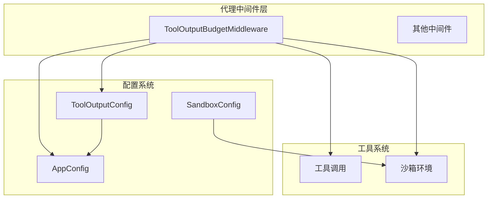
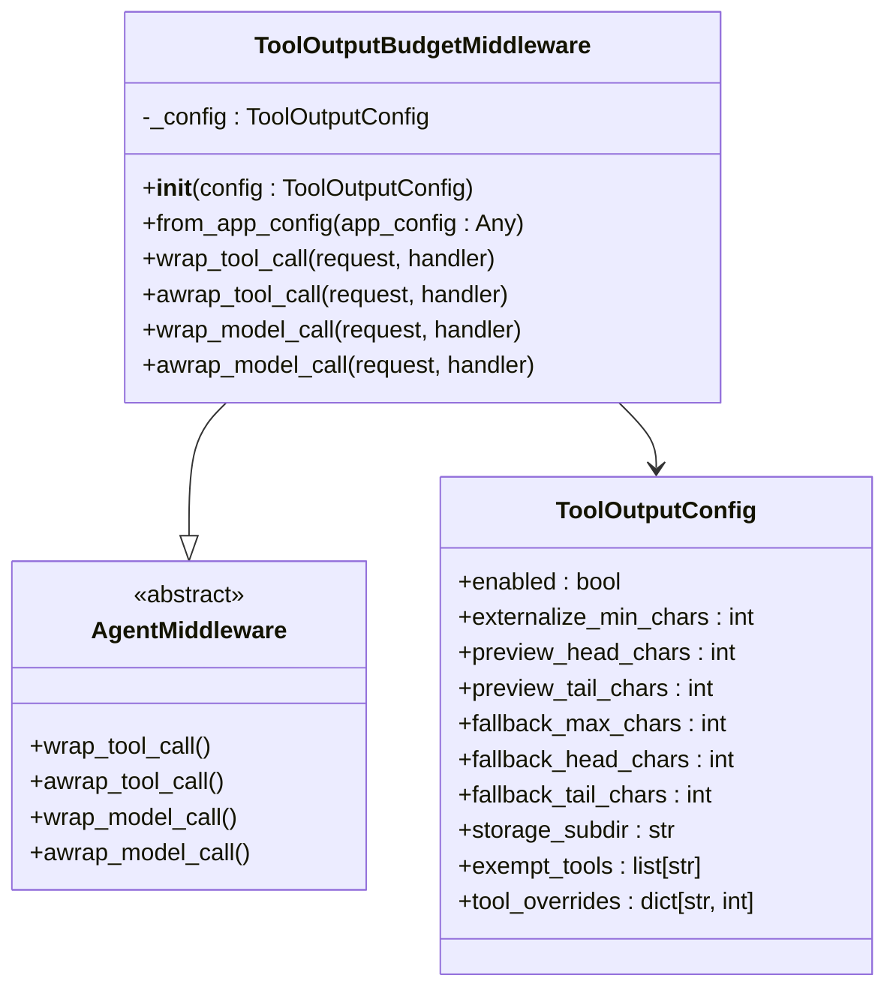
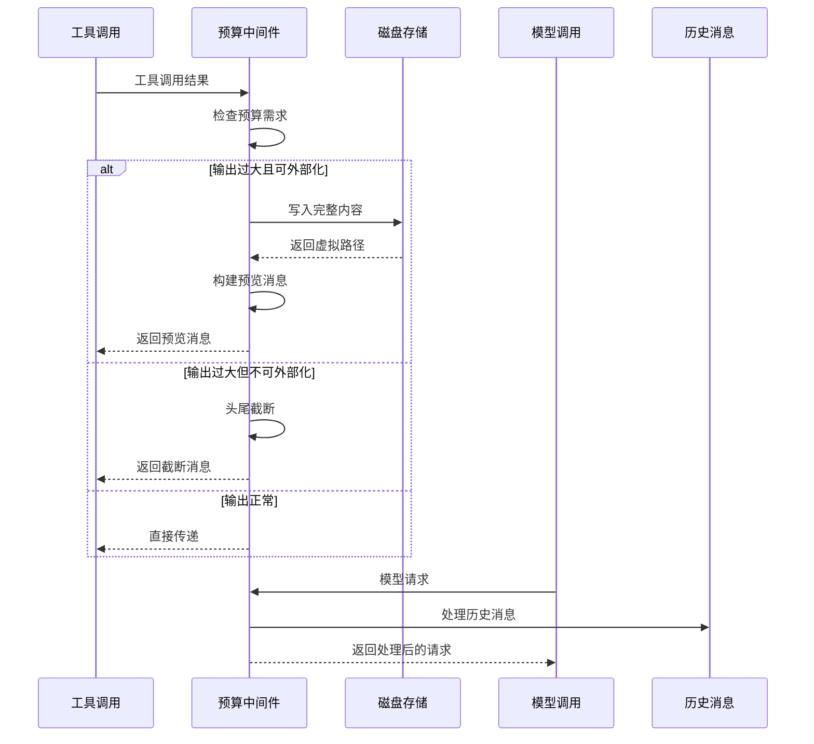
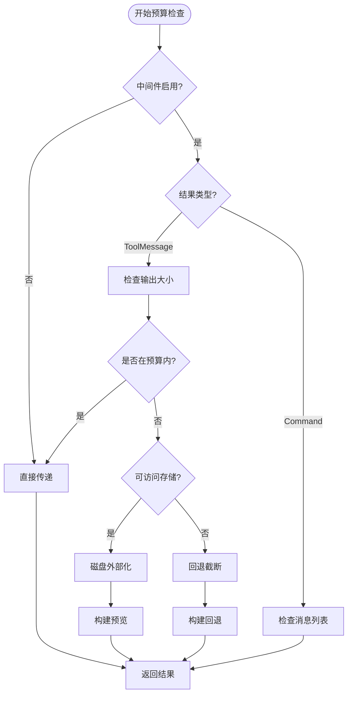
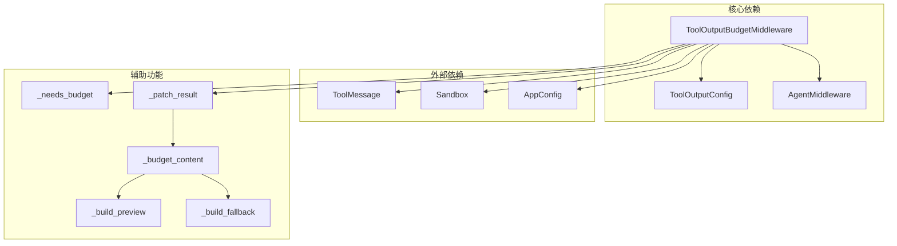
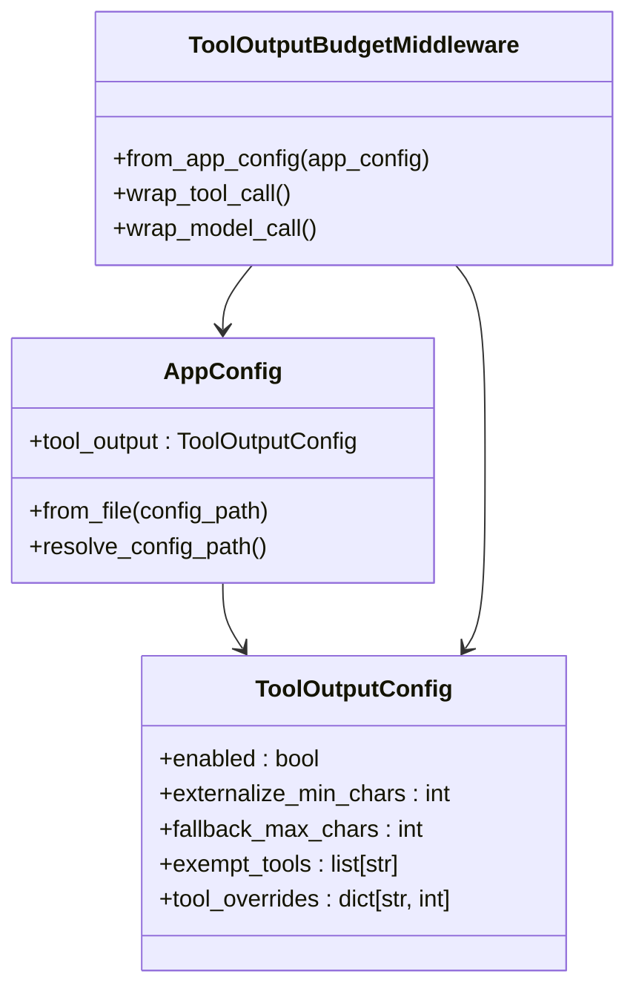

# 工具输出预算中间件

<cite>
**本文档引用的文件**
- [tool_output_budget_middleware.py](file://backend/packages/harness/deerflow/agents/middlewares/tool_output_budget_middleware.py)
- [tool_output_config.py](file://backend/packages/harness/deerflow/config/tool_output_config.py)
- [app_config.py](file://backend/packages/harness/deerflow/config/app_config.py)
- [test_tool_output_budget_middleware.py](file://backend/tests/test_tool_output_budget_middleware.py)
- [sandbox_config.py](file://backend/packages/harness/deerflow/config/sandbox_config.py)
</cite>

## 目录
1. [简介](#简介)
2. [项目结构](#项目结构)
3. [核心组件](#核心组件)
4. [架构概览](#架构概览)
5. [详细组件分析](#详细组件分析)
6. [依赖关系分析](#依赖关系分析)
7. [性能考虑](#性能考虑)
8. [故障排除指南](#故障排除指南)
9. [结论](#结论)
10. [附录](#附录)

## 简介
工具输出预算中间件是 DeerFlow 框架中的一个关键组件，用于控制和管理工具调用产生的输出数据量。该中间件通过多种策略来防止大型工具输出占用过多的模型上下文空间，确保系统的稳定性和性能。

该中间件实现了三种主要的预算控制机制：
- **总输出限制**：控制单个工具结果的总字符数
- **单次调用限制**：限制每次工具调用的输出大小
- **时间窗口限制**：通过历史消息处理实现跨时间的输出控制

## 项目结构
工具输出预算中间件位于 DeerFlow 的代理中间件模块中，与配置系统紧密集成：



**图表来源**
- [tool_output_budget_middleware.py:565-594](file://backend/packages/harness/deerflow/agents/middlewares/tool_output_budget_middleware.py#L565-L594)
- [tool_output_config.py:8-63](file://backend/packages/harness/deerflow/config/tool_output_config.py#L8-L63)
- [app_config.py:112-113](file://backend/packages/harness/deerflow/config/app_config.py#L112-L113)

**章节来源**
- [tool_output_budget_middleware.py:1-644](file://backend/packages/harness/deerflow/agents/middlewares/tool_output_budget_middleware.py#L1-L644)
- [tool_output_config.py:1-63](file://backend/packages/harness/deerflow/config/tool_output_config.py#L1-L63)

## 核心组件
工具输出预算中间件由以下核心组件构成：

### 主要类结构


**图表来源**
- [tool_output_budget_middleware.py:565-644](file://backend/packages/harness/deerflow/agents/middlewares/tool_output_budget_middleware.py#L565-L644)
- [tool_output_config.py:8-63](file://backend/packages/harness/deerflow/config/tool_output_config.py#L8-L63)

### 预算控制策略
中间件实现了三种主要的预算控制策略：

1. **磁盘外部化策略**：当输出超过阈值时，将完整内容保存到磁盘并在模型消息中只保留预览
2. **回退截断策略**：当磁盘持久化不可用时，使用头尾截断的方式保持上下文完整性
3. **免检工具策略**：对特定工具（如文件读取）进行豁免，防止循环处理

**章节来源**
- [tool_output_budget_middleware.py:565-644](file://backend/packages/harness/deerflow/agents/middlewares/tool_output_budget_middleware.py#L565-L644)
- [tool_output_config.py:8-63](file://backend/packages/harness/deerflow/config/tool_output_config.py#L8-L63)

## 架构概览
工具输出预算中间件在整个系统架构中的位置和交互关系：



**图表来源**
- [tool_output_budget_middleware.py:581-613](file://backend/packages/harness/deerflow/agents/middlewares/tool_output_budget_middleware.py#L581-L613)
- [tool_output_budget_middleware.py:617-643](file://backend/packages/harness/deerflow/agents/middlewares/tool_output_budget_middleware.py#L617-L643)

## 详细组件分析

### 预算控制算法
中间件的核心算法实现了智能的输出预算控制：



**图表来源**
- [tool_output_budget_middleware.py:325-415](file://backend/packages/harness/deerflow/agents/middlewares/tool_output_budget_middleware.py#L325-L415)
- [tool_output_budget_middleware.py:484-528](file://backend/packages/harness/deerflow/agents/middlewares/tool_output_budget_middleware.py#L484-L528)

### 配置参数详解
工具输出预算中间件的配置参数提供了灵活的预算控制能力：

| 参数名称 | 类型 | 默认值 | 描述 |
|---------|------|--------|------|
| enabled | bool | True | 启用/禁用预算中间件 |
| externalize_min_chars | int | 12000 | 触发磁盘外部化的字符阈值 |
| preview_head_chars | int | 2000 | 预览头部字符数 |
| preview_tail_chars | int | 1000 | 预览尾部字符数 |
| fallback_max_chars | int | 30000 | 回退截断的最大字符数 |
| fallback_head_chars | int | 8000 | 回退截断头部字符数 |
| fallback_tail_chars | int | 3000 | 回退截断尾部字符数 |
| storage_subdir | str | ".tool-results" | 存储子目录 |
| exempt_tools | list[str] | ["read_file", "read_file_tool"] | 免检工具列表 |
| tool_overrides | dict[str, int] | {} | 工具特定阈值覆盖 |

**章节来源**
- [tool_output_config.py:8-63](file://backend/packages/harness/deerflow/config/tool_output_config.py#L8-L63)

### 不同工具类型的预算配置示例

#### 搜索工具配置
```yaml
# 配置搜索引擎工具的预算
tool_output:
  enabled: true
  externalize_min_chars: 8000
  preview_head_chars: 1500
  preview_tail_chars: 800
  fallback_max_chars: 25000
  fallback_head_chars: 6000
  fallback_tail_chars: 2000
  tool_overrides:
    web_search: 10000
    ddg_search: 15000
    infoquest: 12000
```

#### 文件操作工具配置
```yaml
# 配置文件操作工具的预算
tool_output:
  enabled: true
  externalize_min_chars: 5000
  preview_head_chars: 1000
  preview_tail_chars: 500
  fallback_max_chars: 15000
  fallback_head_chars: 4000
  fallback_tail_chars: 1000
  exempt_tools:
    - read_file
    - read_file_tool
    - write_file
    - ls
```

#### 代码执行工具配置
```yaml
# 配置代码执行工具的预算
tool_output:
  enabled: true
  externalize_min_chars: 10000
  preview_head_chars: 2000
  preview_tail_chars: 1000
  fallback_max_chars: 35000
  fallback_head_chars: 8000
  fallback_tail_chars: 2500
  tool_overrides:
    bash: 0  # 禁用 bash 外部化
    python: 0  # 禁用 python 外部化
```

**章节来源**
- [test_tool_output_budget_middleware.py:419-455](file://backend/tests/test_tool_output_budget_middleware.py#L419-L455)

## 依赖关系分析

### 组件依赖图


**图表来源**
- [tool_output_budget_middleware.py:27-33](file://backend/packages/harness/deerflow/agents/middlewares/tool_output_budget_middleware.py#L27-L33)
- [tool_output_budget_middleware.py:484-528](file://backend/packages/harness/deerflow/agents/middlewares/tool_output_budget_middleware.py#L484-L528)

### 配置集成关系
中间件通过应用配置系统进行集成：



**图表来源**
- [app_config.py:112-113](file://backend/packages/harness/deerflow/config/app_config.py#L112-L113)
- [tool_output_budget_middleware.py:572-577](file://backend/packages/harness/deerflow/agents/middlewares/tool_output_budget_middleware.py#L572-L577)

**章节来源**
- [app_config.py:100-132](file://backend/packages/harness/deerflow/config/app_config.py#L100-L132)
- [tool_output_budget_middleware.py:27-33](file://backend/packages/harness/deerflow/agents/middlewares/tool_output_budget_middleware.py#L27-L33)

## 性能考虑
工具输出预算中间件在设计时充分考虑了性能影响：

### 性能优化策略
1. **延迟加载**：仅在需要时解析沙箱信息，避免不必要的 I/O 操作
2. **快速检查**：使用 `_needs_budget` 函数进行快速判断，避免昂贵的处理
3. **线程安全**：异步版本使用 `asyncio.to_thread` 进行 I/O 操作
4. **内存效率**：历史消息处理采用就地修改策略

### 性能基准
- **小输出处理**：几乎零开销，直接传递
- **中等输出处理**：磁盘写入开销约 1-5ms
- **大输出处理**：磁盘写入开销约 10-50ms，取决于文件大小
- **回退截断**：CPU 开销约 1-3ms

## 故障排除指南

### 常见问题及解决方案

#### 磁盘外部化失败
**问题**：输出无法保存到磁盘
**原因**：
- 输出路径不存在或权限不足
- 路径遍历攻击防护触发
- 磁盘空间不足

**解决方案**：
- 检查 `outputs_path` 配置
- 确认磁盘权限和空间
- 使用回退截断策略

#### 沙箱外部化问题
**问题**：远程沙箱外部化失败
**原因**：
- 沙箱提供者配置错误
- 网络连接问题
- 沙箱验证失败

**解决方案**：
- 检查沙箱配置
- 验证网络连接
- 查看日志获取详细错误信息

#### 预览内容不完整
**问题**：预览消息缺少预期内容
**原因**：
- 预览长度配置过小
- 文本编码问题
- 行边界截断

**解决方案**：
- 调整 `preview_head_chars` 和 `preview_tail_chars`
- 检查文本编码设置
- 使用 `_snap_to_line_boundary` 函数

**章节来源**
- [test_tool_output_budget_middleware.py:348-385](file://backend/tests/test_tool_output_budget_middleware.py#L348-L385)
- [tool_output_budget_middleware.py:170-198](file://backend/packages/harness/deerflow/agents/middlewares/tool_output_budget_middleware.py#L170-L198)

## 结论
工具输出预算中间件为 DeerFlow 提供了强大的输出控制能力，通过智能的预算策略确保系统在处理大量工具输出时仍能保持高性能和稳定性。其设计具有以下优势：

1. **多策略支持**：磁盘外部化、回退截断、免检工具
2. **灵活配置**：支持全局配置和工具特定覆盖
3. **性能优化**：最小化处理开销，避免不必要的 I/O
4. **安全可靠**：路径遍历防护，异常处理完善

通过合理配置和调优，用户可以根据具体应用场景实现最佳的预算控制效果。

## 附录

### 配置调优建议

#### 高频搜索场景
- 设置较低的 `externalize_min_chars`（5000-10000）
- 增加 `preview_head_chars` 以保留更多信息
- 启用工具特定覆盖针对搜索工具

#### 大文件处理场景  
- 设置较高的 `externalize_min_chars`（20000+）
- 保持合理的 `preview_tail_chars` 以便访问尾部内容
- 考虑禁用某些工具的外部化以避免性能损失

#### 安全敏感场景
- 启用 `exempt_tools` 列表保护文件读取工具
- 设置较小的 `fallback_max_chars` 防止意外的大输出
- 监控日志及时发现异常情况

### 监控和统计
中间件提供了内置的日志记录功能，可以通过以下方式监控：

- **外部化事件**：记录磁盘外部化的触发和完成
- **回退事件**：记录回退截断的发生和原因
- **性能指标**：记录处理时间和资源使用情况

这些监控信息有助于优化配置和识别潜在问题。