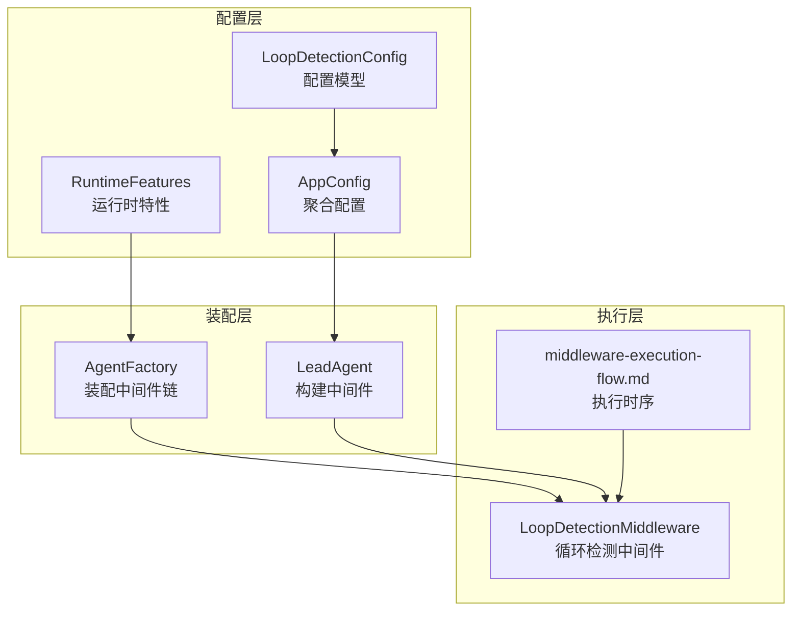
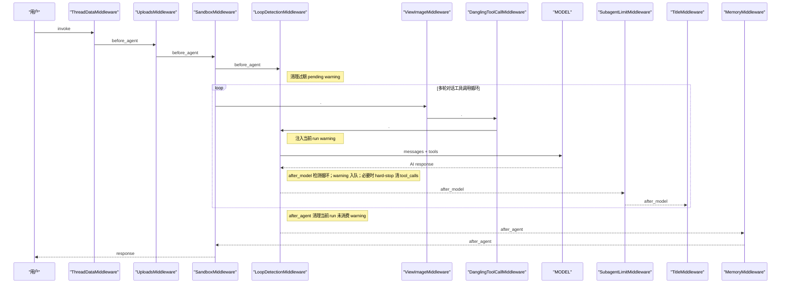
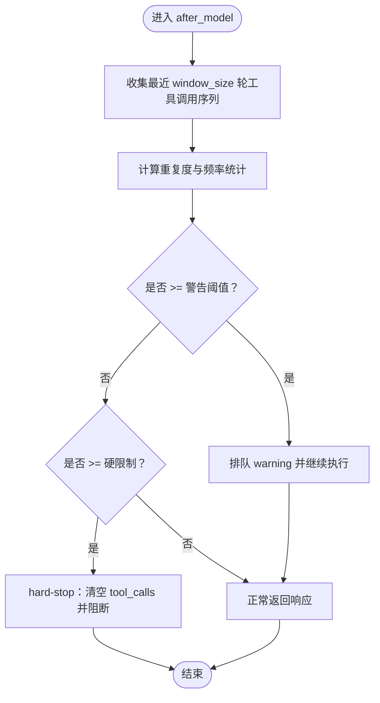
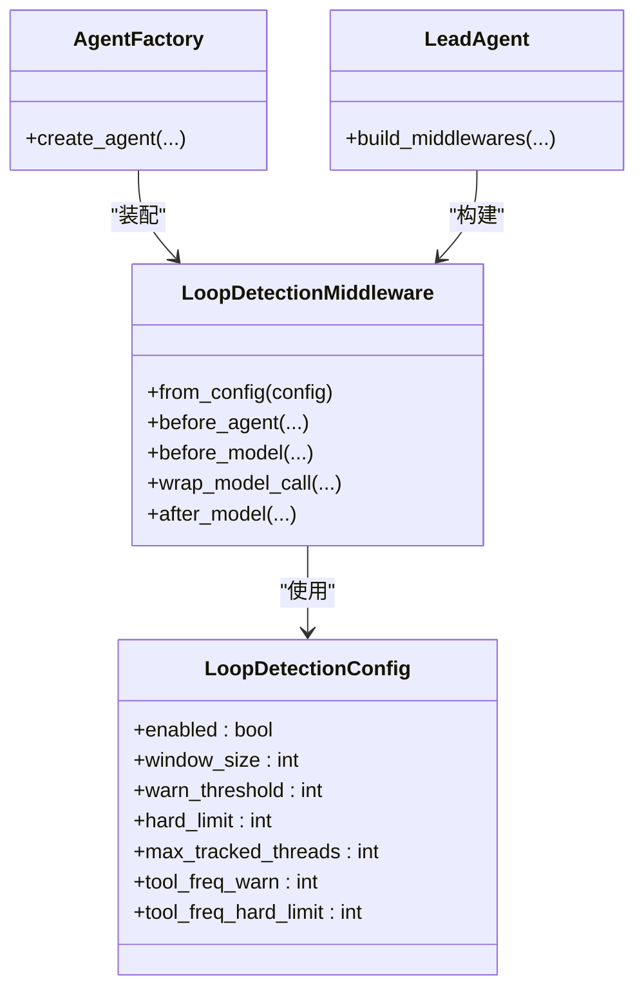
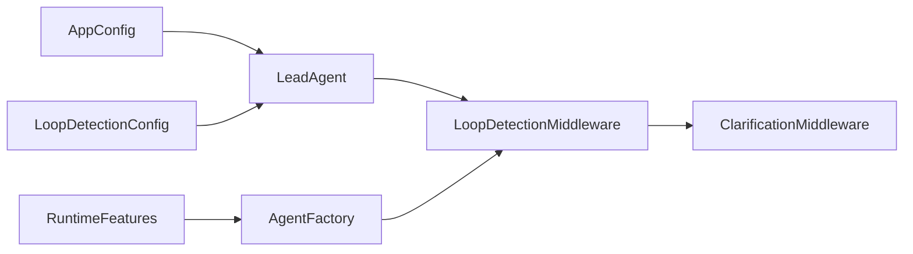

# 循环检测中间件

<cite>
**本文引用的文件**
- [loop_detection_middleware.py](file://backend/packages/harness/deerflow/agents/middlewares/loop_detection_middleware.py)
- [loop_detection_config.py](file://backend/packages/harness/deerflow/config/loop_detection_config.py)
- [factory.py](file://backend/packages/harness/deerflow/agents/factory.py)
- [features.py](file://backend/packages/harness/deerflow/agents/features.py)
- [agent.py](file://backend/packages/harness/deerflow/agents/lead_agent/agent.py)
- [app_config.py](file://backend/packages/harness/deerflow/config/app_config.py)
- [middleware-execution-flow.md](file://backend/docs/middleware-execution-flow.md)
- [test_loop_detection_middleware.py](file://backend/tests/test_loop_detection_middleware.py)
- [test_loop_detection_config.py](file://backend/tests/test_loop_detection_config.py)
- [test_lead_agent_model_resolution.py](file://backend/tests/test_lead_agent_model_resolution.py)
</cite>

## 目录
1. [简介](#简介)
2. [项目结构](#项目结构)
3. [核心组件](#核心组件)
4. [架构总览](#架构总览)
5. [详细组件分析](#详细组件分析)
6. [依赖关系分析](#依赖关系分析)
7. [性能考量](#性能考量)
8. [故障排查指南](#故障排查指南)
9. [结论](#结论)
10. [附录](#附录)

## 简介
本文件系统性阐述 Deer Flow 中“循环检测中间件”的设计与实现，覆盖其工作原理、检测算法、阈值设定、配置参数、触发后的处理策略与恢复机制，并结合测试用例与执行流程文档给出调优建议、实际案例与性能影响评估，同时提供调试与定位问题的方法与工具。

## 项目结构
循环检测中间件位于后端 harness 包中，核心文件包括：
- 中间件实现：agents/middlewares/loop_detection_middleware.py
- 配置模型：config/loop_detection_config.py
- 工厂装配：agents/factory.py、agents/lead_agent/agent.py
- 运行时特性开关：agents/features.py
- 应用配置聚合：config/app_config.py
- 执行流程文档：docs/middleware-execution-flow.md
- 单元测试：tests/test_loop_detection_middleware.py、tests/test_loop_detection_config.py、tests/test_lead_agent_model_resolution.py

图表来源
- [loop_detection_config.py:1-60](file://backend/packages/harness/deerflow/config/loop_detection_config.py#L1-L60)
- [app_config.py:110-130](file://backend/packages/harness/deerflow/config/app_config.py#L110-L130)
- [features.py:1-40](file://backend/packages/harness/deerflow/agents/features.py#L1-L40)
- [factory.py:270-285](file://backend/packages/harness/deerflow/agents/factory.py#L270-L285)
- [agent.py:355-360](file://backend/packages/harness/deerflow/agents/lead_agent/agent.py#L355-L360)
- [middleware-execution-flow.md:85-162](file://backend/docs/middleware-execution-flow.md#L85-L162)

章节来源
- [loop_detection_config.py:1-60](file://backend/packages/harness/deerflow/config/loop_detection_config.py#L1-L60)
- [app_config.py:110-130](file://backend/packages/harness/deerflow/config/app_config.py#L110-L130)
- [features.py:1-40](file://backend/packages/harness/deerflow/agents/features.py#L1-L40)
- [factory.py:270-285](file://backend/packages/harness/deerflow/agents/factory.py#L270-L285)
- [agent.py:355-360](file://backend/packages/harness/deerflow/agents/lead_agent/agent.py#L355-L360)
- [middleware-execution-flow.md:85-162](file://backend/docs/middleware-execution-flow.md#L85-L162)

## 核心组件
- 配置模型 LoopDetectionConfig：定义循环检测的启用开关、窗口大小、警告阈值、硬限制、线程跟踪上限、工具频率阈值等。
- 中间件 LoopDetectionMiddleware：在 before_model/wrap_model_call/after_model 钩子中执行检测与处理，维护每线程的工具调用历史与滑动窗口统计。
- 装配链路：通过 AgentFactory 与 LeadAgent 将中间件注入到运行时管道，确保其紧邻 ClarificationMiddleware 前置，以在最终澄清前拦截循环。

章节来源
- [loop_detection_config.py:1-60](file://backend/packages/harness/deerflow/config/loop_detection_config.py#L1-L60)
- [loop_detection_middleware.py:1-200](file://backend/packages/harness/deerflow/agents/middlewares/loop_detection_middleware.py#L1-L200)
- [factory.py:270-285](file://backend/packages/harness/deerflow/agents/factory.py#L270-L285)
- [agent.py:355-360](file://backend/packages/harness/deerflow/agents/lead_agent/agent.py#L355-L360)

## 架构总览
循环检测中间件在多轮对话的“每轮工具调用循环”中运行，其在 before_model/wrap_model_call/after_model 钩子中完成：
- before_model：清理过期 pending warning
- wrap_model_call：注入当前 run 的 warning 到后续调用链
- after_model：检测循环并进行排队 warning、必要时硬停止并清空 tool_calls

图表来源
- [middleware-execution-flow.md:85-162](file://backend/docs/middleware-execution-flow.md#L85-L162)
- [middleware-execution-flow.md:225-274](file://backend/docs/middleware-execution-flow.md#L225-L274)

## 详细组件分析

### 配置模型与参数
- 启用开关 enabled：控制是否启用循环检测中间件。
- 窗口大小 window_size：滑动窗口长度，用于统计最近 N 轮的工具调用序列。
- 警告阈值 warn_threshold：当工具调用序列重复次数达到该阈值时，发出 warning。
- 硬限制 hard_limit：超过该阈值时，触发 hard-stop 并清空 tool_calls。
- 最大跟踪线程数 max_tracked_threads：限制内存中并发跟踪的线程数量。
- 工具频率阈值 tool_freq_warn/tool_freq_hard_limit：针对单工具频繁调用的独立阈值与硬限制。
- 其他细节：支持跨文件读取等场景的哈希检测补充，避免仅基于哈希遗漏的循环。

章节来源
- [loop_detection_config.py:1-60](file://backend/packages/harness/deerflow/config/loop_detection_config.py#L1-L60)
- [loop_detection_middleware.py:180-220](file://backend/packages/harness/deerflow/agents/middlewares/loop_detection_middleware.py#L180-L220)

### 中间件实现与检测算法
- 数据结构
  - 每线程维护工具调用序列的历史记录，按时间顺序存储。
  - 使用滑动窗口对最近 window_size 轮进行模式匹配与频率统计。
- 检测阶段
  - before_model：清理 stale pending warning，准备本轮上下文。
  - wrap_model_call：将当前 run 的 warning 注入到后续调用链，便于传播。
  - after_model：核心检测点
    - 计算工具调用序列的重复度与频率，对比 warn_threshold 与 hard_limit。
    - 若达到 hard_limit，则执行 hard-stop（清空 tool_calls）并阻断继续调用。
    - 若达到 warn_threshold，则将 warning 排队，等待后续处理或澄清。
- 容错与健壮性
  - 对异常输入进行防御性解析，避免中间件崩溃。
  - 支持跨文件读取等边界情况的检测补充。

图表来源
- [loop_detection_middleware.py:1-200](file://backend/packages/harness/deerflow/agents/middlewares/loop_detection_middleware.py#L1-L200)

章节来源
- [loop_detection_middleware.py:1-200](file://backend/packages/harness/deerflow/agents/middlewares/loop_detection_middleware.py#L1-L200)

### 装配与执行顺序
- 装配链路
  - RuntimeFeatures 提供 loop_detection 开关或自定义中间件实例。
  - AgentFactory 在启用时将 LoopDetectionMiddleware 插入到中间件链中。
  - LeadAgent 从 AppConfig 解析 LoopDetectionConfig 并创建中间件实例。
- 执行顺序
  - 中间件严格位于 ClarificationMiddleware 之前，确保在最终澄清前拦截循环。

图表来源
- [loop_detection_config.py:1-60](file://backend/packages/harness/deerflow/config/loop_detection_config.py#L1-L60)
- [loop_detection_middleware.py:1-200](file://backend/packages/harness/deerflow/agents/middlewares/loop_detection_middleware.py#L1-L200)
- [factory.py:270-285](file://backend/packages/harness/deerflow/agents/factory.py#L270-L285)
- [agent.py:355-360](file://backend/packages/harness/deerflow/agents/lead_agent/agent.py#L355-L360)

章节来源
- [factory.py:270-285](file://backend/packages/harness/deerflow/agents/factory.py#L270-L285)
- [agent.py:355-360](file://backend/packages/harness/deerflow/agents/lead_agent/agent.py#L355-L360)
- [features.py:1-40](file://backend/packages/harness/deerflow/agents/features.py#L1-L40)

### 触发处理策略与恢复机制
- 警告策略（warn_threshold）
  - 将 warning 排队，允许后续澄清或人工干预。
  - 不中断当前调用，但会阻断后续可能加剧循环的调用。
- 硬停止策略（hard_limit）
  - 清空 tool_calls，阻断继续调用，防止无限循环。
  - 适用于高置信度循环检测或工具调用频率过高。
- 恢复机制
  - after_agent 阶段清理当前 run 的未消费 warning，避免泄漏。
  - 通过 ClarificationMiddleware 或用户交互进行人工澄清，打破循环。

章节来源
- [middleware-execution-flow.md:85-162](file://backend/docs/middleware-execution-flow.md#L85-L162)
- [loop_detection_middleware.py:1-200](file://backend/packages/harness/deerflow/agents/middlewares/loop_detection_middleware.py#L1-L200)

### 实际案例分析
- 案例一：默认阈值生效
  - 测试验证 LeadAgent 构建时，LoopDetectionMiddleware 的 warn_threshold、hard_limit、window_size、max_tracked_threads、tool_freq_warn、tool_freq_hard_limit 均为预期值。
- 案例二：禁用循环检测
  - 当 LoopDetectionConfig.enabled=False 时，中间件不被装配到中间件链。
- 案例三：自定义中间件替换
  - RuntimeFeatures 中传入自定义 AgentMiddleware 实例时，将替换默认中间件，但仍需满足前置顺序要求。

章节来源
- [test_lead_agent_model_resolution.py:416-423](file://backend/tests/test_lead_agent_model_resolution.py#L416-L423)
- [test_lead_agent_model_resolution.py:425-442](file://backend/tests/test_lead_agent_model_resolution.py#L425-L442)
- [test_create_deerflow_agent.py:618-676](file://backend/tests/test_create_deerflow_agent.py#L618-L676)

### 性能影响评估
- 时间复杂度
  - after_model 中的检测涉及滑动窗口内的序列比较与频率统计，复杂度与 window_size 成正比。
- 空间复杂度
  - 维护每线程的工具调用历史与频率表，受 max_tracked_threads 与 window_size 影响。
- 调优建议
  - 合理设置 window_size：增大可提升检测稳定性，但增加内存与计算开销。
  - 谨慎设置 warn_threshold 与 hard_limit：过低易误报，过高易漏检。
  - 控制 max_tracked_threads：避免高并发下内存膨胀。
  - 工具频率阈值：针对高频工具单独设限，平衡功能可用性与安全。

章节来源
- [loop_detection_middleware.py:1-200](file://backend/packages/harness/deerflow/agents/middlewares/loop_detection_middleware.py#L1-L200)
- [loop_detection_config.py:1-60](file://backend/packages/harness/deerflow/config/loop_detection_config.py#L1-L60)

## 依赖关系分析
- 配置依赖
  - LoopDetectionConfig 由 AppConfig 聚合，再由 LeadAgent 构建中间件。
- 装配依赖
  - AgentFactory 根据 RuntimeFeatures 决定是否启用与替换中间件。
- 执行依赖
  - 中间件必须位于 ClarificationMiddleware 之前，确保在最终澄清前拦截循环。

图表来源
- [features.py:1-40](file://backend/packages/harness/deerflow/agents/features.py#L1-L40)
- [app_config.py:110-130](file://backend/packages/harness/deerflow/config/app_config.py#L110-L130)
- [agent.py:355-360](file://backend/packages/harness/deerflow/agents/lead_agent/agent.py#L355-L360)
- [factory.py:270-285](file://backend/packages/harness/deerflow/agents/factory.py#L270-L285)

章节来源
- [features.py:1-40](file://backend/packages/harness/deerflow/agents/features.py#L1-L40)
- [app_config.py:110-130](file://backend/packages/harness/deerflow/config/app_config.py#L110-L130)
- [agent.py:355-360](file://backend/packages/harness/deerflow/agents/lead_agent/agent.py#L355-L360)
- [factory.py:270-285](file://backend/packages/harness/deerflow/agents/factory.py#L270-L285)

## 性能考量
- 检测成本
  - after_model 的序列比较与频率统计为 O(window_size)。
- 内存占用
  - 每线程维护历史与频率表，受 max_tracked_threads 与 window_size 影响。
- 建议
  - 在高并发场景下调小 window_size 与 max_tracked_threads。
  - 对高频工具设置独立阈值，避免全局阈值导致误判。

章节来源
- [loop_detection_middleware.py:1-200](file://backend/packages/harness/deerflow/agents/middlewares/loop_detection_middleware.py#L1-L200)
- [loop_detection_config.py:1-60](file://backend/packages/harness/deerflow/config/loop_detection_config.py#L1-L60)

## 故障排查指南
- 常见问题
  - 中间件未生效：检查 RuntimeFeatures 与 AppConfig 中的 enabled 设置。
  - 误报/漏报：调整 warn_threshold、hard_limit、window_size、tool_freq_*。
  - 内存增长：降低 max_tracked_threads 或 window_size。
- 调试方法
  - 查看中间件装配顺序：确认 LoopDetectionMiddleware 位于 ClarificationMiddleware 之前。
  - 使用单元测试验证阈值与行为：参考 test_loop_detection_middleware.py、test_loop_detection_config.py。
  - 结合执行流程图定位问题阶段：before_model、wrap_model_call、after_model 的具体行为。

章节来源
- [test_loop_detection_middleware.py:1-200](file://backend/tests/test_loop_detection_middleware.py#L1-L200)
- [test_loop_detection_config.py:1-200](file://backend/tests/test_loop_detection_config.py#L1-L200)
- [middleware-execution-flow.md:85-162](file://backend/docs/middleware-execution-flow.md#L85-L162)

## 结论
循环检测中间件通过在多轮工具调用循环中的关键钩子执行检测，结合滑动窗口与频率统计，实现了对重复工具调用循环的有效识别与治理。通过合理的配置与调优，可在保证安全性的同时兼顾性能与可用性。建议在生产环境中持续监控中间件行为，结合测试用例与执行流程文档进行迭代优化。

## 附录
- 关键参数速查
  - enabled：是否启用
  - window_size：滑动窗口大小
  - warn_threshold：警告阈值
  - hard_limit：硬限制
  - max_tracked_threads：最大跟踪线程数
  - tool_freq_warn/tool_freq_hard_limit：工具频率阈值
- 参考测试
  - test_loop_detection_middleware.py：中间件行为验证
  - test_loop_detection_config.py：配置加载与默认值验证
  - test_lead_agent_model_resolution.py：阈值与装配验证