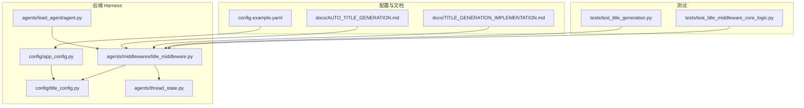
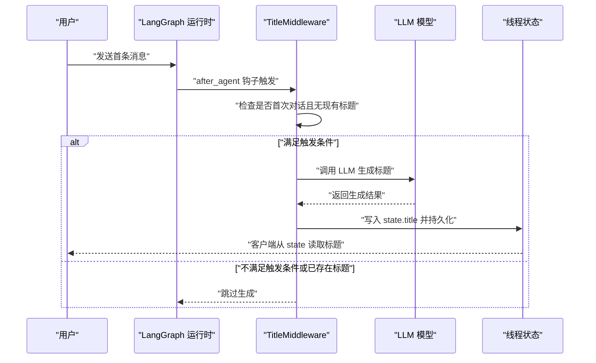
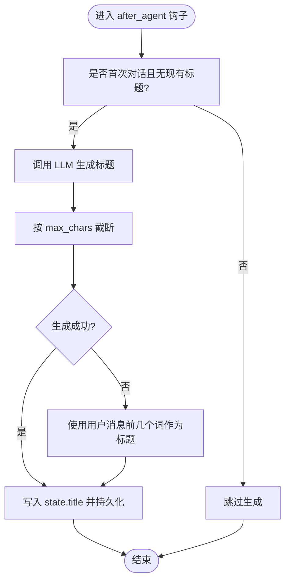
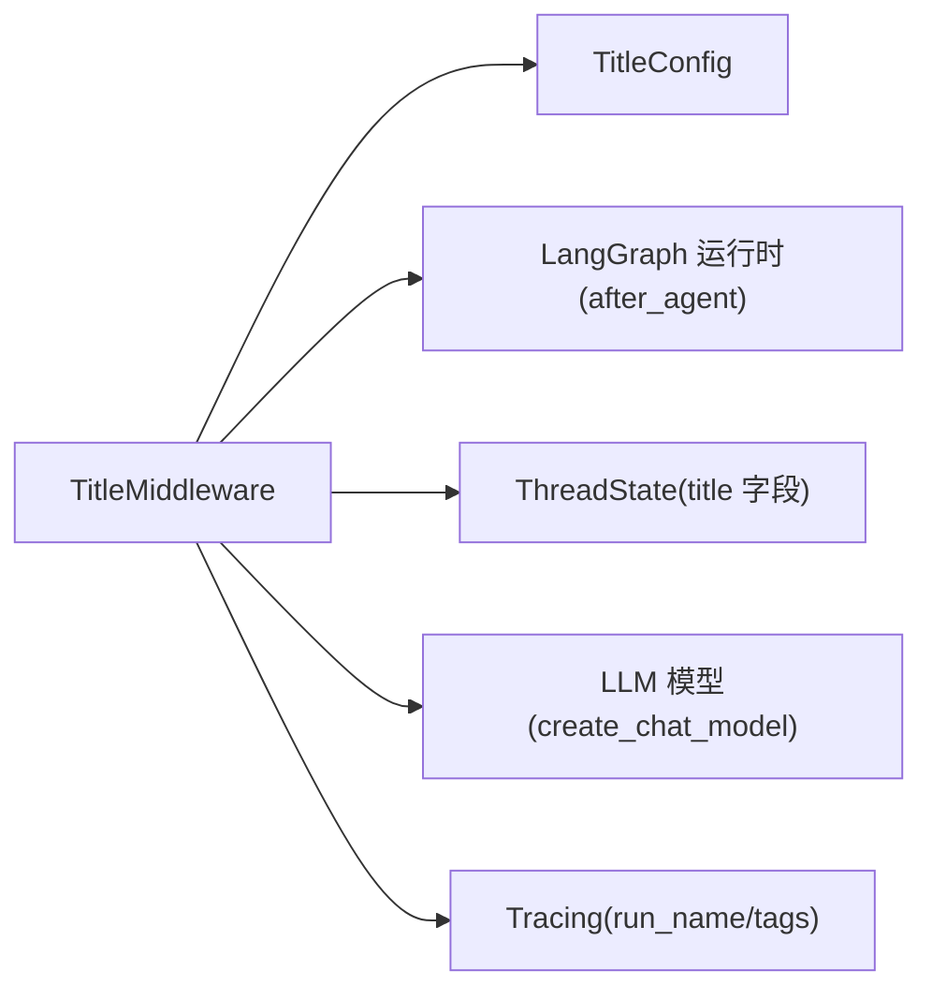

# 标题生成中间件

<cite>
**本文引用的文件**
- [title_middleware.py](file://backend/packages/harness/deerflow/agents/middlewares/title_middleware.py)
- [title_config.py](file://backend/packages/harness/deerflow/config/title_config.py)
- [config.example.yaml](file://config.example.yaml)
- [AUTO_TITLE_GENERATION.md](file://backend/docs/AUTO_TITLE_GENERATION.md)
- [TITLE_GENERATION_IMPLEMENTATION.md](file://backend/docs/TITLE_GENERATION_IMPLEMENTATION.md)
- [test_title_generation.py](file://backend/tests/test_title_generation.py)
- [test_title_middleware_core_logic.py](file://backend/tests/test_title_middleware_core_logic.py)
</cite>

## 目录
1. [简介](#简介)
2. [项目结构](#项目结构)
3. [核心组件](#核心组件)
4. [架构总览](#架构总览)
5. [详细组件分析](#详细组件分析)
6. [依赖关系分析](#依赖关系分析)
7. [性能考量](#性能考量)
8. [故障排除指南](#故障排除指南)
9. [结论](#结论)
10. [附录](#附录)

## 简介
本文件系统性阐述“标题生成中间件”的配置与使用方法，覆盖触发条件、生成策略、质量控制、长度限制、关键词过滤、风格偏好、模板与规则设置、质量评估与人工审核流程、A/B 测试与效果分析，以及标题与搜索索引的关系与优化策略。目标是帮助技术与非技术读者快速理解并正确配置该中间件。

## 项目结构
标题生成中间件位于后端 harness 包中，核心文件包括：
- 中间件实现：agents/middlewares/title_middleware.py
- 配置模型与加载：config/title_config.py
- 示例配置：config.example.yaml
- 功能文档：docs/AUTO_TITLE_GENERATION.md、docs/TITLE_GENERATION_IMPLEMENTATION.md
- 单元测试：tests/test_title_generation.py、tests/test_title_middleware_core_logic.py

**图表来源**
- [title_middleware.py](file://backend/packages/harness/deerflow/agents/middlewares/title_middleware.py)
- [title_config.py](file://backend/packages/harness/deerflow/config/title_config.py)
- [config.example.yaml](file://config.example.yaml)
- [AUTO_TITLE_GENERATION.md](file://backend/docs/AUTO_TITLE_GENERATION.md)
- [TITLE_GENERATION_IMPLEMENTATION.md](file://backend/docs/TITLE_GENERATION_IMPLEMENTATION.md)
- [test_title_generation.py](file://backend/tests/test_title_generation.py)
- [test_title_middleware_core_logic.py](file://backend/tests/test_title_middleware_core_logic.py)

**章节来源**
- [title_middleware.py](file://backend/packages/harness/deerflow/agents/middlewares/title_middleware.py)
- [title_config.py](file://backend/packages/harness/deerflow/config/title_config.py)
- [config.example.yaml](file://config.example.yaml)
- [AUTO_TITLE_GENERATION.md](file://backend/docs/AUTO_TITLE_GENERATION.md)
- [TITLE_GENERATION_IMPLEMENTATION.md](file://backend/docs/TITLE_GENERATION_IMPLEMENTATION.md)
- [test_title_generation.py](file://backend/tests/test_title_generation.py)
- [test_title_middleware_core_logic.py](file://backend/tests/test_title_middleware_core_logic.py)

## 核心组件
- 标题配置模型（TitleConfig）
  - 关键字段：enabled（启用/禁用）、max_words（最大词数）、max_chars（最大字符数）、model_name（模型名称）、prompt_template（提示模板，用于生成标题的指令）
  - 提供全局配置读取/写入函数与从字典加载的能力
- 标题中间件（TitleMiddleware）
  - 负责在首次对话后自动触发标题生成
  - 内置触发判断、LLM 生成、回退策略（如 LLM 失败时使用用户消息前几个词）
  - 通过 after_agent 钩子接入运行时生命周期
- 应用配置加载
  - 从配置文件加载标题配置，并可直接传入应用配置对象以覆盖全局配置
- 线程状态集成
  - 将 title 字段写入线程状态，支持持久化与版本控制

**章节来源**
- [title_config.py](file://backend/packages/harness/deerflow/config/title_config.py)
- [title_middleware.py](file://backend/packages/harness/deerflow/agents/middlewares/title_middleware.py)
- [AUTO_TITLE_GENERATION.md](file://backend/docs/AUTO_TITLE_GENERATION.md)
- [TITLE_GENERATION_IMPLEMENTATION.md](file://backend/docs/TITLE_GENERATION_IMPLEMENTATION.md)

## 架构总览
标题生成中间件在 LangGraph 运行时中作为中间件存在，其工作流如下：

**图表来源**
- [title_middleware.py](file://backend/packages/harness/deerflow/agents/middlewares/title_middleware.py)
- [AUTO_TITLE_GENERATION.md](file://backend/docs/AUTO_TITLE_GENERATION.md)

## 详细组件分析

### 触发条件与生成策略
- 触发条件
  - 首次对话：仅当线程中尚未存在标题时才触发
  - 无重复生成：若 state 中已存在 title，则不再生成
- 生成策略
  - 异步调用 LLM 模型生成标题
  - 严格遵守 max_chars 限制；max_words 用于提示模板中的约束表达
  - 回退策略：当 LLM 生成失败时，使用用户消息内容的前几个词作为标题
- 配置优先级
  - 显式传入的应用配置优先于全局配置
  - 若未指定 model_name，则使用默认模型

**图表来源**
- [title_middleware.py](file://backend/packages/harness/deerflow/agents/middlewares/title_middleware.py)
- [test_title_middleware_core_logic.py](file://backend/tests/test_title_middleware_core_logic.py)

**章节来源**
- [title_middleware.py](file://backend/packages/harness/deerflow/agents/middlewares/title_middleware.py)
- [test_title_middleware_core_logic.py](file://backend/tests/test_title_middleware_core_logic.py)

### 配置项详解与最佳实践
- enabled：启用/禁用自动标题生成
- max_words：用于提示模板中的词数约束（语义参考）
- max_chars：强制标题长度上限（字符数）
- model_name：指定使用的 LLM 模型名称；留空则使用默认模型
- prompt_template：可选的自定义提示模板（用于生成标题的指令）

配置示例与加载方式参见以下文件：
- 示例配置：config.example.yaml 中的 title 段落
- 全局配置读取/设置：title_config.py 中的 get_title_config()/set_title_config()
- 从字典加载：load_title_config_from_dict()

**章节来源**
- [config.example.yaml](file://config.example.yaml)
- [title_config.py](file://backend/packages/harness/deerflow/config/title_config.py)
- [AUTO_TITLE_GENERATION.md](file://backend/docs/AUTO_TITLE_GENERATION.md)

### 质量控制与关键词过滤
- 长度控制：max_chars 严格限制输出长度
- 词数参考：max_words 用于提示模板中的约束表达，便于模型理解上下文
- 关键词过滤：当前实现未内置关键词黑名单/白名单过滤；如需，请在提示模板中加入相应规则或在上游消息预处理阶段进行过滤
- 风格偏好：通过 prompt_template 自定义风格（如正式/简洁/口语化），并在测试中验证模型名称与 tracing 行为

**章节来源**
- [title_middleware.py](file://backend/packages/harness/deerflow/agents/middlewares/title_middleware.py)
- [test_title_middleware_core_logic.py](file://backend/tests/test_title_middleware_core_logic.py)

### 标题模板与规则设置
- 模板位置：prompt_template 可在 TitleConfig 中配置
- 规则设置：结合 max_words/max_chars 与提示模板，确保生成标题符合业务规范
- 场景化模板建议（概念性指导）
  - 技术文档摘要：强调关键词与技术要点
  - 常见问题解答：突出问题与解决方案
  - 会议纪要：体现议题与结论
- 注意：模板应避免过度复杂，以免影响 LLM 的稳定性与速度

**章节来源**
- [title_config.py](file://backend/packages/harness/deerflow/config/title_config.py)
- [AUTO_TITLE_GENERATION.md](file://backend/docs/AUTO_TITLE_GENERATION.md)

### 标题质量评估与人工审核
- 自动评估指标（建议）
  - 长度合规率：实际长度 ≤ max_chars 的比例
  - 重复率：与历史标题的相似度阈值
  - 语义相关性：与首条消息主题的相关性评分
- 人工审核流程（建议）
  - 随机抽样：对新生成标题进行人工打标
  - 回退触发：当自动评估得分低于阈值时，触发人工复核
  - 持续改进：基于人工反馈迭代提示模板与阈值

[本节为通用实践建议，不直接分析具体文件]

### A/B 测试与效果分析
- 分组策略
  - 随机分组：开启/关闭自动标题生成
  - 渐进放量：按用户/租户维度逐步开放
- 指标体系
  - 用户满意度：通过调查问卷或 NPS
  - 使用效率：平均对话时长、标题点击率
  - 质量指标：长度合规率、重复率、相关性评分
- 分析方法
  - 组间对比：t 检验或 Mann–Whitney U 检验
  - 时间序列：前后对比与趋势分析
  - 影响因素：回归分析识别显著变量

[本节为通用实践建议，不直接分析具体文件]

### 标题与搜索索引的关系与优化
- 关系
  - 标题作为线程元信息，可用于前端检索与导航
  - 若需全文检索，建议将标题与消息内容合并建立索引
- 优化策略
  - 标准化：统一大小写、去除冗余符号
  - 分词：针对多语言场景进行分词处理
  - 去噪：移除停用词与低价值词汇
  - 向量化：将标题嵌入向量空间，提升相似度检索性能

[本节为通用实践建议，不直接分析具体文件]

## 依赖关系分析
- 组件耦合
  - TitleMiddleware 依赖 TitleConfig 获取配置
  - 通过 LangGraph 运行时的 after_agent 钩子接入
  - 与线程状态 ThreadState 集成，支持持久化
- 外部依赖
  - LLM 模型：通过 create_chat_model 创建实例
  - tracing：在调用链中标记 run_name 与 tags，便于追踪

**图表来源**
- [title_middleware.py](file://backend/packages/harness/deerflow/agents/middlewares/title_middleware.py)
- [title_config.py](file://backend/packages/harness/deerflow/config/title_config.py)

**章节来源**
- [title_middleware.py](file://backend/packages/harness/deerflow/agents/middlewares/title_middleware.py)
- [test_title_middleware_core_logic.py](file://backend/tests/test_title_middleware_core_logic.py)

## 性能考量
- 异步调用：使用异步模型调用，减少阻塞
- 截断策略：在生成后严格按 max_chars 截断，避免超长文本
- 回退策略：在 LLM 失败时快速回退，保证用户体验
- 配置优先级：显式应用配置可避免全局配置查找开销

[本节为通用性能建议，不直接分析具体文件]

## 故障排除指南
- 症状：标题未生成
  - 检查 enabled 是否为 true
  - 确认是否为首次对话且 state 中无现有标题
  - 查看 LLM 调用是否抛出异常
- 症状：标题过长
  - 检查 max_chars 设置是否合理
  - 确认截断逻辑是否生效
- 症状：标题质量不佳
  - 调整 prompt_template 与 model_name
  - 引入人工审核与 A/B 测试持续优化
- 测试参考
  - 配置读取/设置测试
  - 异步模型调用与 max_chars 限制测试
  - 显式应用配置覆盖全局配置测试

**章节来源**
- [test_title_generation.py](file://backend/tests/test_title_generation.py)
- [test_title_middleware_core_logic.py](file://backend/tests/test_title_middleware_core_logic.py)

## 结论
标题生成中间件通过明确的触发条件、严格的长度控制与稳健的回退策略，实现了自动化、可配置、可追踪的标题生成能力。配合完善的测试与文档，可在不同业务场景下稳定落地。建议结合人工审核与 A/B 测试持续优化提示模板与阈值，以提升标题质量与用户体验。

## 附录
- 快速开始
  - 在配置文件中启用标题生成并设置 max_chars
  - 在应用配置中传入显式 TitleConfig 以覆盖全局配置
  - 在运行时注册 TitleMiddleware 并观察 after_agent 钩子行为
- 参考文档
  - AUTO_TITLE_GENERATION.md：功能说明与使用示例
  - TITLE_GENERATION_IMPLEMENTATION.md：实现总结与架构设计

**章节来源**
- [AUTO_TITLE_GENERATION.md](file://backend/docs/AUTO_TITLE_GENERATION.md)
- [TITLE_GENERATION_IMPLEMENTATION.md](file://backend/docs/TITLE_GENERATION_IMPLEMENTATION.md)