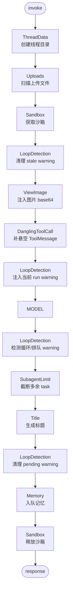
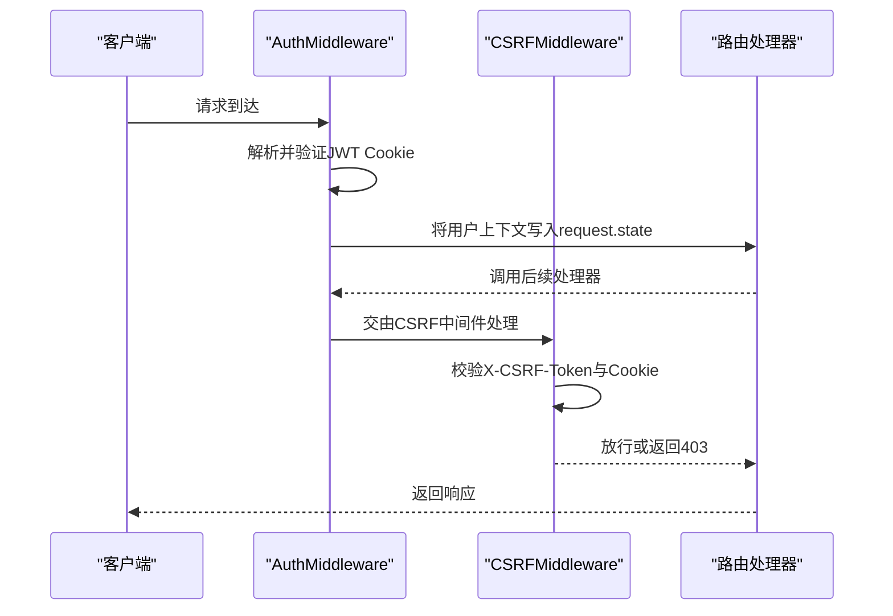
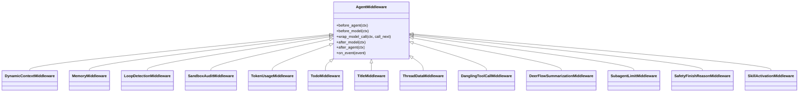
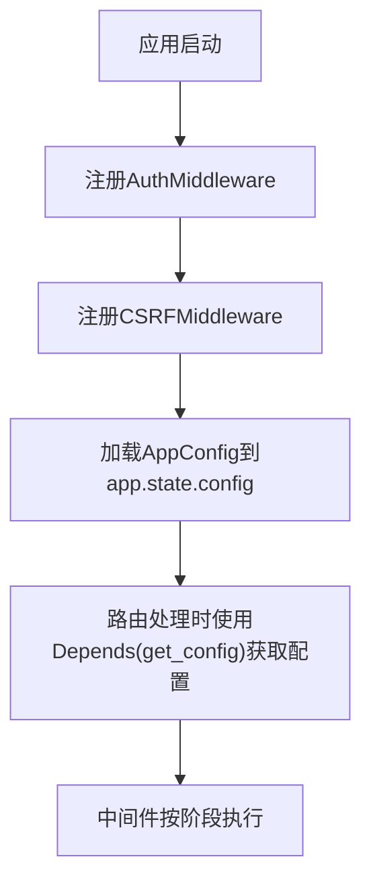
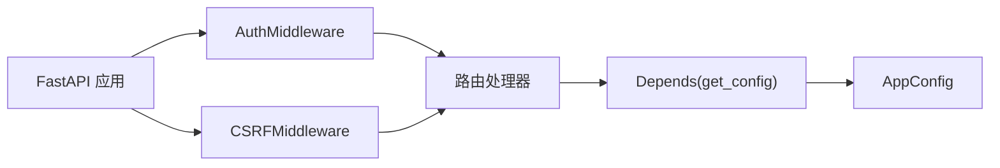

# 自定义中间件开发

<cite>
**本文档引用的文件**
- [auth_middleware.py](file://backend/app/gateway/auth_middleware.py)
- [csrf_middleware.py](file://backend/app/gateway/csrf_middleware.py)
- [features.py](file://backend/packages/harness/deerflow/agents/features.py)
- [middleware-execution-flow.md](file://backend/docs/middleware-execution-flow.md)
- [test_auth_middleware.py](file://backend/tests/test_auth_middleware.py)
- [test_csrf_middleware.py](file://backend/tests/test_csrf_middleware.py)
- [test_gateway_deps_config.py](file://backend/tests/test_gateway_deps_config.py)
- [_router_auth_helpers.py](file://backend/tests/_router_auth_helpers.py)
- [fetcher.ts](file://frontend/src/core/api/fetcher.ts)
- [gateway-config.ts](file://frontend/src/core/auth/gateway-config.ts)
- [clarification_middleware.py](file://backend/packages/harness/deerflow/agents/middlewares/clarification_middleware.py)
- [dangling_tool_call_middleware.py](file://backend/packages/harness/deerflow/agents/middlewares/dangling_tool_call_middleware.py)
- [loop_detection_middleware.py](file://backend/packages/harness/deerflow/agents/middlewares/loop_detection_middleware.py)
- [memory_middleware.py](file://backend/packages/harness/deerflow/agents/middlewares/memory_middleware.py)
- [sandbox_audit_middleware.py](file://backend/packages/harness/deerflow/agents/middlewares/sandbox_audit_middleware.py)
- [token_usage_middleware.py](file://backend/packages/harness/deerflow/agents/middlewares/token_usage_middleware.py)
- [todo_middleware.py](file://backend/packages/harness/deerflow/agents/middlewares/todo_middleware.py)
- [title_middleware.py](file://backend/packages/harness/deerflow/agents/middlewares/title_middleware.py)
- [thread_data_middleware.py](file://backend/packages/harness/deerflow/agents/middlewares/thread_data_middleware.py)
- [dynamic_context_middleware.py](file://backend/packages/harness/deerflow/agents/middlewares/dynamic_context_middleware.py)
- [llm_error_handling_middleware.py](file://backend/packages/harness/deerflow/agents/middlewares/llm_error_handling_middleware.py)
- [safety_finish_reason_middleware.py](file://backend/packages/harness/deerflow/agents/middlewares/safety_finish_reason_middleware.py)
- [subagent_limit_middleware.py](file://backend/packages/harness/deerflow/agents/middlewares/subagent_limit_middleware.py)
- [summarization_middleware.py](file://backend/packages/harness/deerflow/agents/middlewares/summarization_middleware.py)
- [skill_activation_middleware.py](file://backend/packages/harness/deerflow/agents/middlewares/skill_activation_middleware.py)
- [mcp.py](file://backend/app/gateway/routers/mcp.py)
</cite>

## 目录
1. [简介](#简介)
2. [项目结构](#项目结构)
3. [核心组件](#核心组件)
4. [架构总览](#架构总览)
5. [详细组件分析](#详细组件分析)
6. [依赖关系分析](#依赖关系分析)
7. [性能考虑](#性能考虑)
8. [故障排查指南](#故障排查指南)
9. [结论](#结论)
10. [附录](#附录)

## 简介
本指南面向希望在deer-flow中开发自定义中间件的工程师，系统阐述中间件接口规范、生命周期钩子与事件处理机制，给出中间件基类的继承模式与抽象方法实现要点，解释中间件注册、依赖注入与配置加载流程，并提供测试框架、单元测试与集成测试的编写方法。最后总结性能监控、日志记录与错误处理的最佳实践，以及调试技巧与常见问题解决方案。

## 项目结构
deer-flow的中间件体系分为两类：
- 网关层中间件：位于FastAPI应用中，负责认证、跨站请求伪造防护等横切关注点。
- 代理执行中间件：位于代理运行时（Agent Runtime）中，负责在模型调用前后及代理执行过程中插入业务逻辑（如上下文注入、工具调用处理、内存管理、令牌统计等）。

```mermaid
graph TB
subgraph "网关层中间件"
GW_AUTH["AuthMiddleware<br/>认证"]
GW_CSRF["CSRFMiddleware<br/>跨站请求伪造"]
end
subgraph "代理执行中间件"
RT_FEATURES["AgentMiddleware 基类<br/>生命周期钩子"]
RT_CTX["DynamicContextMiddleware<br/>动态上下文"]
RT_MEM["MemoryMiddleware<br/>记忆入队"]
RT_LLMERR["LLMErrorHandlingMiddleware<br/>LLM错误处理"]
RT_LOOP["LoopDetectionMiddleware<br/>循环检测"]
RT_SAN_AUD["SandboxAuditMiddleware<br/>沙箱审计"]
RT_TOKEN["TokenUsageMiddleware<br/>令牌用量统计"]
RT_TODO["TodoMiddleware<br/>待办事项"]
RT_TITLE["TitleMiddleware<br/>标题生成"]
RT_THREAD["ThreadDataMiddleware<br/>线程数据"]
RT_DANGLE["DanglingToolCallMiddleware<br/>悬空工具调用处理"]
RT_SUM["DeerFlowSummarizationMiddleware<br/>摘要"]
RT_SUB["SubagentLimitMiddleware<br/>子代理限制"]
RT_SAFETY["SafetyFinishReasonMiddleware<br/>安全终止原因"]
RT_SKILL["SkillActivationMiddleware<br/>技能激活"]
end
GW_AUTH --> RT_FEATURES
GW_CSRF --> RT_FEATURES
```

图表来源
- [auth_middleware.py](file://backend/app/gateway/auth_middleware.py)
- [csrf_middleware.py](file://backend/app/gateway/csrf_middleware.py)
- [features.py](file://backend/packages/harness/deerflow/agents/features.py)
- [dynamic_context_middleware.py](file://backend/packages/harness/deerflow/agents/middlewares/dynamic_context_middleware.py)
- [memory_middleware.py](file://backend/packages/harness/deerflow/agents/middlewares/memory_middleware.py)
- [llm_error_handling_middleware.py](file://backend/packages/harness/deerflow/agents/middlewares/llm_error_handling_middleware.py)
- [loop_detection_middleware.py](file://backend/packages/harness/deerflow/agents/middlewares/loop_detection_middleware.py)
- [sandbox_audit_middleware.py](file://backend/packages/harness/deerflow/agents/middlewares/sandbox_audit_middleware.py)
- [token_usage_middleware.py](file://backend/packages/harness/deerflow/agents/middlewares/token_usage_middleware.py)
- [todo_middleware.py](file://backend/packages/harness/deerflow/agents/middlewares/todo_middleware.py)
- [title_middleware.py](file://backend/packages/harness/deerflow/agents/middlewares/title_middleware.py)
- [thread_data_middleware.py](file://backend/packages/harness/deerflow/agents/middlewares/thread_data_middleware.py)
- [dangling_tool_call_middleware.py](file://backend/packages/harness/deerflow/agents/middlewares/dangling_tool_call_middleware.py)
- [summarization_middleware.py](file://backend/packages/harness/deerflow/agents/middlewares/summarization_middleware.py)
- [subagent_limit_middleware.py](file://backend/packages/harness/deerflow/agents/middlewares/subagent_limit_middleware.py)
- [safety_finish_reason_middleware.py](file://backend/packages/harness/deerflow/agents/middlewares/safety_finish_reason_middleware.py)
- [skill_activation_middleware.py](file://backend/packages/harness/deerflow/agents/middlewares/skill_activation_middleware.py)

章节来源
- [auth_middleware.py](file://backend/app/gateway/auth_middleware.py)
- [csrf_middleware.py](file://backend/app/gateway/csrf_middleware.py)
- [features.py](file://backend/packages/harness/deerflow/agents/features.py)

## 核心组件
本节聚焦两类中间件的核心接口与实现模式。

- 网关层中间件
  - 认证中间件：基于FastAPI的BaseHTTPMiddleware，负责校验JWT Cookie，确保后续路由与权限装饰器能正确读取用户上下文。
  - CSRF中间件：基于FastAPI的BaseHTTPMiddleware，对状态变更方法进行CSRF令牌校验，防止跨站请求伪造攻击。

- 代理执行中间件
  - AgentMiddleware基类：定义了代理执行生命周期中的钩子函数，包括before_agent、before_model、wrap_model_call、after_model、after_agent等阶段，以及可选的事件处理机制。
  - 具体中间件：围绕AgentMiddleware扩展，实现特定功能，如动态上下文注入、记忆入队、循环检测、沙箱审计、令牌用量统计、待办事项、标题生成、线程数据、悬空工具调用处理、摘要、子代理限制、安全终止原因、技能激活等。

章节来源
- [auth_middleware.py](file://backend/app/gateway/auth_middleware.py)
- [csrf_middleware.py](file://backend/app/gateway/csrf_middleware.py)
- [features.py](file://backend/packages/harness/deerflow/agents/features.py)

## 架构总览
下图展示了代理执行中间件的完整生命周期与执行顺序。中间件按阶段有序执行，部分阶段支持反向执行（after_*阶段反序），并在wrap_model_call中包裹模型调用。

图表来源
- [middleware-execution-flow.md](file://backend/docs/middleware-execution-flow.md)

章节来源
- [middleware-execution-flow.md](file://backend/docs/middleware-execution-flow.md)

## 详细组件分析

### 网关层中间件：认证与CSRF
- 认证中间件
  - 继承BaseHTTPMiddleware，拦截请求，解析并验证JWT Cookie，将用户信息写入request.state，供后续路由与权限装饰器使用。
  - 关键点：确保Cookie域与可信源一致；在开发环境提供默认回退值；与前端fetcher配合，保证跨域场景下的凭据传递。
- CSRF中间件
  - 继承BaseHTTPMiddleware，对POST/PUT/DELETE/PATCH等状态变更方法进行CSRF令牌校验，令牌来源于登录时设置的HttpOnly Cookie，前端通过读取该Cookie并设置X-CSRF-Token头进行比对。

图表来源
- [auth_middleware.py](file://backend/app/gateway/auth_middleware.py)
- [csrf_middleware.py](file://backend/app/gateway/csrf_middleware.py)
- [fetcher.ts](file://frontend/src/core/api/fetcher.ts)

章节来源
- [auth_middleware.py](file://backend/app/gateway/auth_middleware.py)
- [csrf_middleware.py](file://backend/app/gateway/csrf_middleware.py)
- [fetcher.ts](file://frontend/src/core/api/fetcher.ts)

### 代理执行中间件：生命周期与事件处理
- AgentMiddleware基类
  - 定义生命周期钩子：before_agent、before_model、wrap_model_call、after_model、after_agent。
  - 支持事件处理：在代理执行过程中产生与消费事件，用于解耦中间件间的通信。
  - 中间件排序：不同阶段按注册顺序正序执行，after_*阶段反序执行。
- 典型中间件实现模式
  - 动态上下文注入：在before_agent阶段读取会话上下文，注入到代理状态。
  - 记忆入队：在after_agent阶段将对话片段加入记忆队列。
  - 循环检测：在多个阶段注入/清理警告，避免无限循环。
  - 沙箱审计：在进入/退出沙箱时记录审计日志。
  - 令牌用量统计：在模型调用前后统计输入输出token数。
  - 待办事项：维护任务列表，支持增删改查。
  - 标题生成：在after_model阶段根据内容生成标题。
  - 线程数据：初始化线程目录与元数据。
  - 悬空工具调用处理：在wrap_model_call阶段补全缺失的工具消息。
  - 摘要：在after_model阶段生成摘要。
  - 子代理限制：在after_model阶段截断超出限制的任务。
  - 安全终止原因：在after_model阶段标记安全终止原因。
  - 技能激活：在before_agent阶段激活所需技能。

图表来源
- [features.py](file://backend/packages/harness/deerflow/agents/features.py)
- [dynamic_context_middleware.py](file://backend/packages/harness/deerflow/agents/middlewares/dynamic_context_middleware.py)
- [memory_middleware.py](file://backend/packages/harness/deerflow/agents/middlewares/memory_middleware.py)
- [loop_detection_middleware.py](file://backend/packages/harness/deerflow/agents/middlewares/loop_detection_middleware.py)
- [sandbox_audit_middleware.py](file://backend/packages/harness/deerflow/agents/middlewares/sandbox_audit_middleware.py)
- [token_usage_middleware.py](file://backend/packages/harness/deerflow/agents/middlewares/token_usage_middleware.py)
- [todo_middleware.py](file://backend/packages/harness/deerflow/agents/middlewares/todo_middleware.py)
- [title_middleware.py](file://backend/packages/harness/deerflow/agents/middlewares/title_middleware.py)
- [thread_data_middleware.py](file://backend/packages/harness/deerflow/agents/middlewares/thread_data_middleware.py)
- [dangling_tool_call_middleware.py](file://backend/packages/harness/deerflow/agents/middlewares/dangling_tool_call_middleware.py)
- [summarization_middleware.py](file://backend/packages/harness/deerflow/agents/middlewares/summarization_middleware.py)
- [subagent_limit_middleware.py](file://backend/packages/harness/deerflow/agents/middlewares/subagent_limit_middleware.py)
- [safety_finish_reason_middleware.py](file://backend/packages/harness/deerflow/agents/middlewares/safety_finish_reason_middleware.py)
- [skill_activation_middleware.py](file://backend/packages/harness/deerflow/agents/middlewares/skill_activation_middleware.py)

章节来源
- [features.py](file://backend/packages/harness/deerflow/agents/features.py)
- [dynamic_context_middleware.py](file://backend/packages/harness/deerflow/agents/middlewares/dynamic_context_middleware.py)
- [memory_middleware.py](file://backend/packages/harness/deerflow/agents/middlewares/memory_middleware.py)
- [loop_detection_middleware.py](file://backend/packages/harness/deerflow/agents/middlewares/loop_detection_middleware.py)
- [sandbox_audit_middleware.py](file://backend/packages/harness/deerflow/agents/middlewares/sandbox_audit_middleware.py)
- [token_usage_middleware.py](file://backend/packages/harness/deerflow/agents/middlewares/token_usage_middleware.py)
- [todo_middleware.py](file://backend/packages/harness/deerflow/agents/middlewares/todo_middleware.py)
- [title_middleware.py](file://backend/packages/harness/deerflow/agents/middlewares/title_middleware.py)
- [thread_data_middleware.py](file://backend/packages/harness/deerflow/agents/middlewares/thread_data_middleware.py)
- [dangling_tool_call_middleware.py](file://backend/packages/harness/deerflow/agents/middlewares/dangling_tool_call_middleware.py)
- [summarization_middleware.py](file://backend/packages/harness/deerflow/agents/middlewares/summarization_middleware.py)
- [subagent_limit_middleware.py](file://backend/packages/harness/deerflow/agents/middlewares/subagent_limit_middleware.py)
- [safety_finish_reason_middleware.py](file://backend/packages/harness/deerflow/agents/middlewares/safety_finish_reason_middleware.py)
- [skill_activation_middleware.py](file://backend/packages/harness/deerflow/agents/middlewares/skill_activation_middleware.py)

### 中间件注册、依赖注入与配置加载
- 网关层中间件注册
  - 在FastAPI应用中添加中间件，确保认证中间件先于路由执行，CSRF中间件在认证之后执行。
- 依赖注入
  - 使用Depends从app.state读取全局配置对象，确保中间件能访问统一的配置实例。
  - 测试中通过替换app.state.config验证依赖注入的正确性。
- 配置加载
  - 对于MCP服务器配置，采用“保留原始配置”的合并策略，确保环境变量占位符与顶层键不被丢失。

图表来源
- [auth_middleware.py](file://backend/app/gateway/auth_middleware.py)
- [csrf_middleware.py](file://backend/app/gateway/csrf_middleware.py)
- [test_gateway_deps_config.py](file://backend/tests/test_gateway_deps_config.py)

章节来源
- [auth_middleware.py](file://backend/app/gateway/auth_middleware.py)
- [csrf_middleware.py](file://backend/app/gateway/csrf_middleware.py)
- [test_gateway_deps_config.py](file://backend/tests/test_gateway_deps_config.py)
- [mcp.py](file://backend/app/gateway/routers/mcp.py)

## 依赖关系分析
- 网关层中间件依赖FastAPI的中间件机制，依赖认证与CSRF策略，同时与前端fetcher协同完成凭据与CSRF令牌的传递。
- 代理执行中间件依赖AgentMiddleware基类提供的生命周期钩子与事件处理能力，各中间件之间通过事件解耦，遵循阶段执行顺序。
- 配置依赖：中间件通过app.state.config获取全局配置，确保一致性与可测试性。

图表来源
- [auth_middleware.py](file://backend/app/gateway/auth_middleware.py)
- [csrf_middleware.py](file://backend/app/gateway/csrf_middleware.py)
- [test_gateway_deps_config.py](file://backend/tests/test_gateway_deps_config.py)

章节来源
- [auth_middleware.py](file://backend/app/gateway/auth_middleware.py)
- [csrf_middleware.py](file://backend/app/gateway/csrf_middleware.py)
- [test_gateway_deps_config.py](file://backend/tests/test_gateway_deps_config.py)

## 性能考虑
- 中间件执行顺序与开销
  - before_agent与after_agent阶段通常涉及IO操作（如沙箱获取/释放、记忆入队），应尽量减少不必要的计算。
  - wrap_model_call阶段应保持轻量，避免阻塞模型调用。
- 缓存与复用
  - 对频繁访问的资源（如沙箱、配置）进行缓存，避免重复初始化。
- 异步与并发
  - 在需要等待外部服务时使用异步调用，避免阻塞主线程。
- 监控指标
  - 在关键阶段埋点，记录耗时与错误率，便于定位性能瓶颈。

## 故障排查指南
- 认证失败
  - 检查JWT Cookie是否正确设置与传输，确认Cookie域与可信源匹配。
  - 确认前端fetcher在跨域场景下携带credentials与CSRF令牌。
- CSRF校验失败
  - 确认前端在状态变更请求上设置了X-CSRF-Token头，且与Cookie中的令牌一致。
- 配置未生效
  - 检查app.state.config是否正确注入，测试中验证替换后配置可见性。
- 中间件未按预期执行
  - 检查中间件注册顺序与阶段划分，参考生命周期图核对执行路径。
- MCP配置合并异常
  - 确保原始配置保留$VAR占位符与顶层键，避免合并时丢失。

章节来源
- [auth_middleware.py](file://backend/app/gateway/auth_middleware.py)
- [csrf_middleware.py](file://backend/app/gateway/csrf_middleware.py)
- [fetcher.ts](file://frontend/src/core/api/fetcher.ts)
- [test_auth_middleware.py](file://backend/tests/test_auth_middleware.py)
- [test_csrf_middleware.py](file://backend/tests/test_csrf_middleware.py)
- [test_gateway_deps_config.py](file://backend/tests/test_gateway_deps_config.py)
- [_router_auth_helpers.py](file://backend/tests/_router_auth_helpers.py)
- [mcp.py](file://backend/app/gateway/routers/mcp.py)

## 结论
通过明确中间件接口规范、生命周期钩子与事件处理机制，结合严格的注册与依赖注入流程，deer-flow为自定义中间件提供了清晰的开发路径。遵循本文档的实现模式与最佳实践，可在保证性能与可维护性的前提下，快速构建高质量的中间件组件。

## 附录
- 开发步骤建议
  - 明确中间件职责与生命周期位置，选择合适的基类与事件类型。
  - 实现必要的钩子函数，确保在before_agent与after_agent阶段最小化阻塞。
  - 编写单元测试与集成测试，覆盖正常路径与异常路径。
  - 在生产环境中启用监控与日志，持续优化性能与稳定性。
- 参考文件
  - 网关层中间件：认证与CSRF
  - 代理执行中间件：生命周期与事件处理
  - 配置与依赖注入：全局配置与测试验证
  - 执行流程：中间件执行顺序与阶段划分