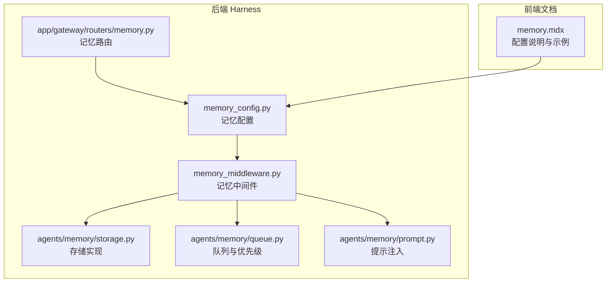
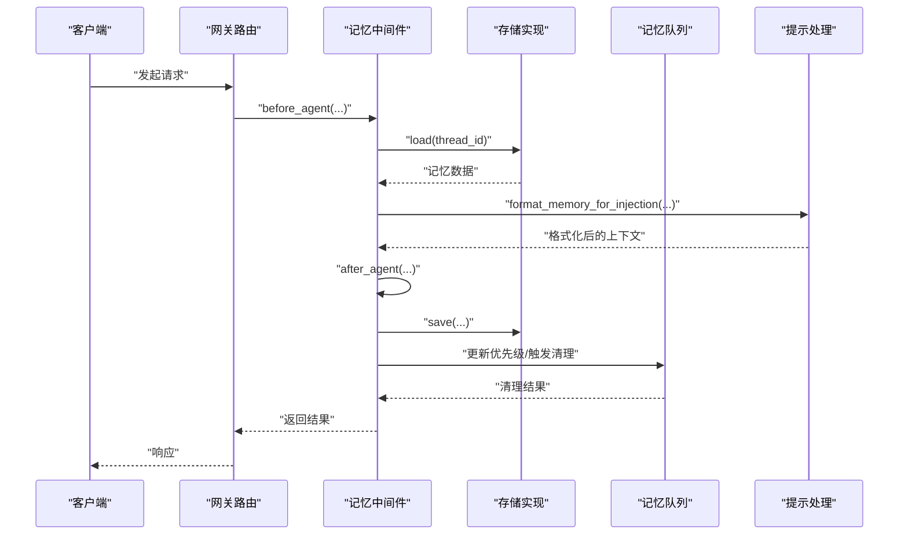
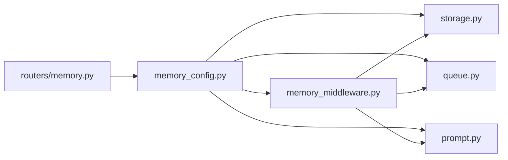

# 记忆中间件

<cite>
**本文引用的文件**
- [memory_middleware.py](file://backend/packages/harness/deerflow/agents/middlewares/memory_middleware.py)
- [memory_config.py](file://backend/packages/harness/deerflow/config/memory_config.py)
- [memory.py（路由）](file://backend/app/gateway/routers/memory.py)
- [storage.py（记忆存储）](file://backend/packages/harness/deerflow/agents/memory/storage.py)
- [queue.py（记忆队列）](file://backend/packages/harness/deerflow/agents/memory/queue.py)
- [prompt.py（记忆提示处理）](file://backend/packages/harness/deerflow/agents/memory/prompt.py)
- [memory_settings_sample.json](file://backend/docs/memory-settings-sample.json)
- [MEMORY_IMPROVEMENTS.md](file://backend/docs/MEMORY_IMPROVEMENTS.md)
- [MEMORY_SETTINGS_REVIEW.md](file://backend/docs/MEMORY_SETTINGS_REVIEW.md)
- [memory.mdx（前端文档）](file://frontend/src/content/zh/harness/memory.mdx)
</cite>

## 目录
1. [简介](#简介)
2. [项目结构](#项目结构)
3. [核心组件](#核心组件)
4. [架构总览](#架构总览)
5. [详细组件分析](#详细组件分析)
6. [依赖关系分析](#依赖关系分析)
7. [性能考虑](#性能考虑)
8. [故障排查指南](#故障排查指南)
9. [结论](#结论)
10. [附录](#附录)

## 简介
本文件面向“记忆中间件”的配置与运维，系统性阐述其在对话历史、上下文信息与长期记忆方面的管理方式；解释存储策略、压缩与清理规则的配置要点；给出内存限制、过期时间与优先级设置的实践建议；提供优化技巧与性能调优方法；并覆盖备份、恢复与迁移方案以及记忆隔离与权限控制的配置思路。

## 项目结构
记忆中间件位于后端 harness 包中，围绕配置、存储、队列、提示处理与网关路由展开，并在前端文档中有对应的配置说明与示例。

**图表来源**
- [memory_middleware.py](file://backend/packages/harness/deerflow/agents/middlewares/memory_middleware.py)
- [memory_config.py](file://backend/packages/harness/deerflow/config/memory_config.py)
- [storage.py（记忆存储）](file://backend/packages/harness/deerflow/agents/memory/storage.py)
- [queue.py（记忆队列）](file://backend/packages/harness/deerflow/agents/memory/queue.py)
- [prompt.py（记忆提示处理）](file://backend/packages/harness/deerflow/agents/memory/prompt.py)
- [memory.py（路由）](file://backend/app/gateway/routers/memory.py)
- [memory.mdx（前端文档）](file://frontend/src/content/zh/harness/memory.mdx)

**章节来源**
- [memory_middleware.py](file://backend/packages/harness/deerflow/agents/middlewares/memory_middleware.py)
- [memory_config.py](file://backend/packages/harness/deerflow/config/memory_config.py)
- [memory.py（路由）](file://backend/app/gateway/routers/memory.py)
- [memory.mdx（前端文档）](file://frontend/src/content/zh/harness/memory.mdx)

## 核心组件
- 记忆配置（memory_config.py）
  - 定义记忆系统的全局配置项，包括启用状态、最大注入令牌数、存储类、清理策略等。
- 记忆中间件（memory_middleware.py）
  - 在代理执行前后对消息进行记忆读写、上下文注入与更新，协调存储与队列。
- 存储实现（storage.py）
  - 提供加载、重载与保存接口，支持自定义存储后端（如文件或 Redis）。
- 队列与优先级（queue.py）
  - 维护记忆条目的优先级与清理顺序，支持基于时间、长度与重要性的策略。
- 提示处理（prompt.py）
  - 将记忆内容格式化并注入到系统提示中，受最大注入令牌数限制。
- 网关路由（routers/memory.py）
  - 对外暴露记忆配置查询与状态合并查询接口，便于运维与调试。

**章节来源**
- [memory_config.py](file://backend/packages/harness/deerflow/config/memory_config.py)
- [memory_middleware.py](file://backend/packages/harness/deerflow/agents/middlewares/memory_middleware.py)
- [storage.py（记忆存储）](file://backend/packages/harness/deerflow/agents/memory/storage.py)
- [queue.py（记忆队列）](file://backend/packages/harness/deerflow/agents/memory/queue.py)
- [prompt.py（记忆提示处理）](file://backend/packages/harness/deerflow/agents/memory/prompt.py)
- [memory.py（路由）](file://backend/app/gateway/routers/memory.py)

## 架构总览
记忆中间件在代理生命周期中的位置如下：请求进入后，中间件从存储加载线程记忆，按配置注入到提示；执行完成后，根据更新器逻辑写回存储并触发队列清理与压缩。

**图表来源**
- [memory_middleware.py](file://backend/packages/harness/deerflow/agents/middlewares/memory_middleware.py)
- [storage.py（记忆存储）](file://backend/packages/harness/deerflow/agents/memory/storage.py)
- [queue.py（记忆队列）](file://backend/packages/harness/deerflow/agents/memory/queue.py)
- [prompt.py（记忆提示处理）](file://backend/packages/harness/deerflow/agents/memory/prompt.py)
- [memory.py（路由）](file://backend/app/gateway/routers/memory.py)

## 详细组件分析

### 记忆中间件（MemoryMiddleware）
- 职责
  - 在代理执行前加载记忆并注入提示，在执行后写回存储并更新队列。
  - 支持禁用记忆或仅禁用注入，以满足不同安全与性能场景。
- 关键行为
  - 注入开关：当注入关闭时，仍可保留存储但不参与系统提示。
  - 禁用记忆：完全跳过加载/保存与注入流程。
- 典型调用链
  - before_agent → 加载记忆 → 格式化注入 → 执行代理
  - after_agent → 写回存储 → 更新队列 → 清理压缩

**章节来源**
- [memory_middleware.py](file://backend/packages/harness/deerflow/agents/middlewares/memory_middleware.py)
- [memory.mdx（前端文档）](file://frontend/src/content/zh/harness/memory.mdx)

### 记忆配置（memory_config.py）
- 启用与注入控制
  - enabled：是否启用记忆系统
  - injection_enabled：是否允许将记忆注入到系统提示
- 存储与序列化
  - storage_class：自定义存储类（需实现 load/reload/save）
  - fallback 到默认文件存储
- 上下文注入限制
  - max_injection_tokens：注入的最大令牌数，避免提示过长
- 清理与压缩
  - 基于队列的清理策略（见 queue.py），配置项通常通过 memory_config 暴露

**章节来源**
- [memory_config.py](file://backend/packages/harness/deerflow/config/memory_config.py)
- [memory.mdx（前端文档）](file://frontend/src/content/zh/harness/memory.mdx)

### 存储实现（storage.py）
- 接口契约
  - load(thread_id)：加载指定线程的历史记忆
  - reload(thread_id)：刷新或重建缓存视图
  - save(data)：持久化记忆数据
- 自定义存储
  - 可替换为 Redis、数据库或其他后端，需遵循接口规范
- 回退机制
  - 若自定义类加载失败，系统回退到默认文件存储并记录错误

**章节来源**
- [storage.py（记忆存储）](file://backend/packages/harness/deerflow/agents/memory/storage.py)
- [memory.mdx（前端文档）](file://frontend/src/content/zh/harness/memory.mdx)

### 队列与优先级（queue.py）
- 作用
  - 维护记忆条目优先级，决定清理与压缩的先后顺序
- 关键点
  - 基于时间衰减、长度阈值与重要性标记的综合策略
  - 与配置中的清理规则协同工作
- 与配置的关系
  - 读取 memory_config 中的清理参数，驱动队列行为

**章节来源**
- [queue.py（记忆队列）](file://backend/packages/harness/deerflow/agents/memory/queue.py)
- [memory_config.py](file://backend/packages/harness/deerflow/config/memory_config.py)

### 提示处理（prompt.py）
- 作用
  - 将记忆数据格式化为适合注入的文本，受 max_injection_tokens 限制
- 流程
  - 获取当前配置 → 读取记忆数据 → 格式化 → 截断或压缩以满足令牌上限

**章节来源**
- [prompt.py（记忆提示处理）](file://backend/packages/harness/deerflow/agents/memory/prompt.py)
- [memory_config.py](file://backend/packages/harness/deerflow/config/memory_config.py)

### 网关路由（routers/memory.py）
- 能力
  - 查询当前记忆配置
  - 合并配置与当前数据的状态查询接口
- 用途
  - 运维观测、调试与自动化集成

**章节来源**
- [memory.py（路由）](file://backend/app/gateway/routers/memory.py)

## 依赖关系分析
- 组件耦合
  - MemoryMiddleware 依赖 Config、Storage、Queue、Prompt
  - Storage 与 Queue 依赖 Config 的清理与注入参数
  - Prompt 依赖 Config 的令牌上限
- 外部依赖
  - 存储后端可插拔（文件/Redis/数据库）
  - 网关路由依赖 Config 的统一读取入口

**图表来源**
- [memory_middleware.py](file://backend/packages/harness/deerflow/agents/middlewares/memory_middleware.py)
- [memory_config.py](file://backend/packages/harness/deerflow/config/memory_config.py)
- [storage.py（记忆存储）](file://backend/packages/harness/deerflow/agents/memory/storage.py)
- [queue.py（记忆队列）](file://backend/packages/harness/deerflow/agents/memory/queue.py)
- [prompt.py（记忆提示处理）](file://backend/packages/harness/deerflow/agents/memory/prompt.py)
- [memory.py（路由）](file://backend/app/gateway/routers/memory.py)

**章节来源**
- [memory_middleware.py](file://backend/packages/harness/deerflow/agents/middlewares/memory_middleware.py)
- [memory_config.py](file://backend/packages/harness/deerflow/config/memory_config.py)
- [memory.py（路由）](file://backend/app/gateway/routers/memory.py)

## 性能考虑
- 注入令牌上限
  - 通过 max_injection_tokens 控制提示长度，避免上下文过长导致延迟与成本上升
- 存储后端选择
  - 文件存储简单可靠；Redis/数据库具备更好的并发与持久化能力
- 清理与压缩策略
  - 基于时间衰减与长度阈值的队列清理，减少无效记忆占用
- 内存限制与批处理
  - 对大体量历史进行分页/分块处理，避免一次性加载过多数据
- 缓存与预热
  - 对热点线程进行缓存预热，降低首次访问延迟

[本节为通用性能建议，无需特定文件引用]

## 故障排查指南
- 记忆注入异常
  - 检查 injection_enabled 与 max_injection_tokens 设置
  - 确认提示格式化流程是否被正确调用
- 存储加载失败
  - 查看自定义 storage_class 是否可加载，系统会回退到默认文件存储
- 清理策略失效
  - 核对队列清理参数与配置项一致性
- 网关查询无响应
  - 检查路由端点与配置读取逻辑

**章节来源**
- [memory_mdx（前端文档）](file://frontend/src/content/zh/harness/memory.mdx)
- [prompt.py（记忆提示处理）](file://backend/packages/harness/deerflow/agents/memory/prompt.py)
- [storage.py（记忆存储）](file://backend/packages/harness/deerflow/agents/memory/storage.py)
- [queue.py（记忆队列）](file://backend/packages/harness/deerflow/agents/memory/queue.py)
- [memory.py（路由）](file://backend/app/gateway/routers/memory.py)

## 结论
记忆中间件通过“配置—存储—队列—提示”的闭环设计，实现了对对话历史、上下文与长期记忆的可控管理。合理配置注入上限、清理策略与存储后端，可在保证效果的同时兼顾性能与成本。结合隔离与权限控制策略，可进一步提升系统的安全性与稳定性。

[本节为总结性内容，无需特定文件引用]

## 附录

### 配置项速览与建议
- 启用与注入
  - enabled：生产环境建议开启
  - injection_enabled：若需严格隔离敏感上下文，可临时关闭
- 存储后端
  - storage_class：优先考虑高可用与可扩展性（如 Redis/数据库）
  - fallback：确保在自定义类不可用时仍可运行
- 上下文注入
  - max_injection_tokens：根据模型上下文窗口与任务复杂度设定
- 清理与压缩
  - 基于队列的时间衰减与长度阈值策略，定期评估清理效果
- 内存与性能
  - 分页加载、缓存预热、批处理与异步写回

**章节来源**
- [memory_config.py](file://backend/packages/harness/deerflow/config/memory_config.py)
- [memory.mdx（前端文档）](file://frontend/src/content/zh/harness/memory.mdx)

### 备份、恢复与迁移
- 备份
  - 导出线程级记忆数据，按存储后端选择导出脚本或工具
- 恢复
  - 使用相同存储后端与配置进行导入；验证注入开关与令牌上限
- 迁移
  - 统一存储格式与键空间；在迁移期间保持 injection_enabled 与 max_injection_tokens 一致

[本节为通用操作建议，无需特定文件引用]

### 记忆隔离与权限控制
- 隔离策略
  - 按用户/租户划分线程 ID 命名空间，避免交叉污染
- 权限控制
  - 通过网关路由与鉴权中间件限制对记忆配置与数据的访问
  - 对高敏感线程启用只读或审计日志

[本节为通用安全建议，无需特定文件引用]

### 参考文档与示例
- 记忆配置样例与说明
  - [memory-settings-sample.json](file://backend/docs/memory-settings-sample.json)
  - [MEMORY_IMPROVEMENTS.md](file://backend/docs/MEMORY_IMPROVEMENTS.md)
  - [MEMORY_SETTINGS_REVIEW.md](file://backend/docs/MEMORY_SETTINGS_REVIEW.md)
- 前端配置说明
  - [memory.mdx（前端文档）](file://frontend/src/content/zh/harness/memory.mdx)

**章节来源**
- [memory_settings_sample.json](file://backend/docs/memory-settings-sample.json)
- [MEMORY_IMPROVEMENTS.md](file://backend/docs/MEMORY_IMPROVEMENTS.md)
- [MEMORY_SETTINGS_REVIEW.md](file://backend/docs/MEMORY_SETTINGS_REVIEW.md)
- [memory.mdx（前端文档）](file://frontend/src/content/zh/harness/memory.mdx)