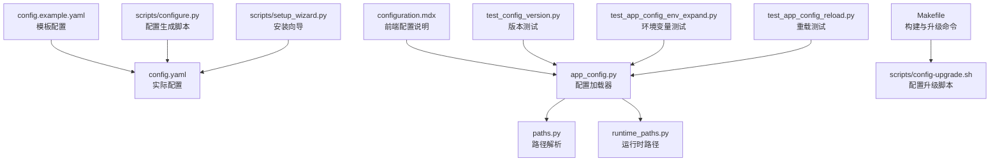
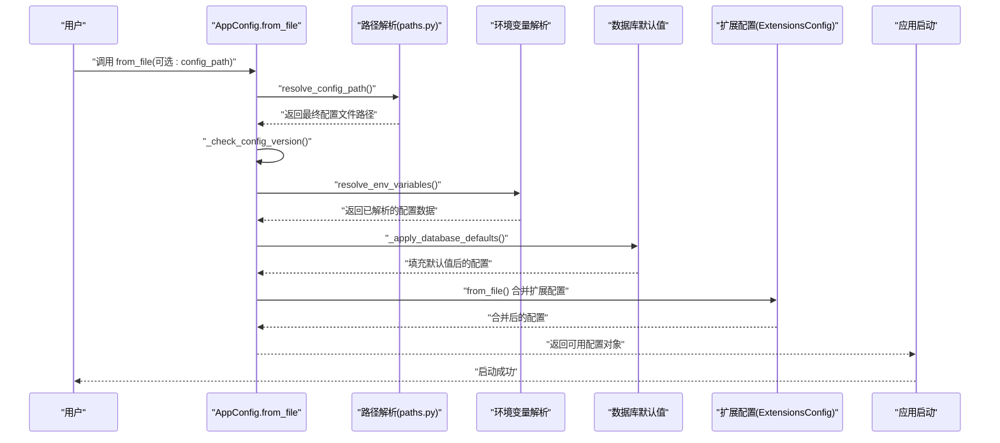
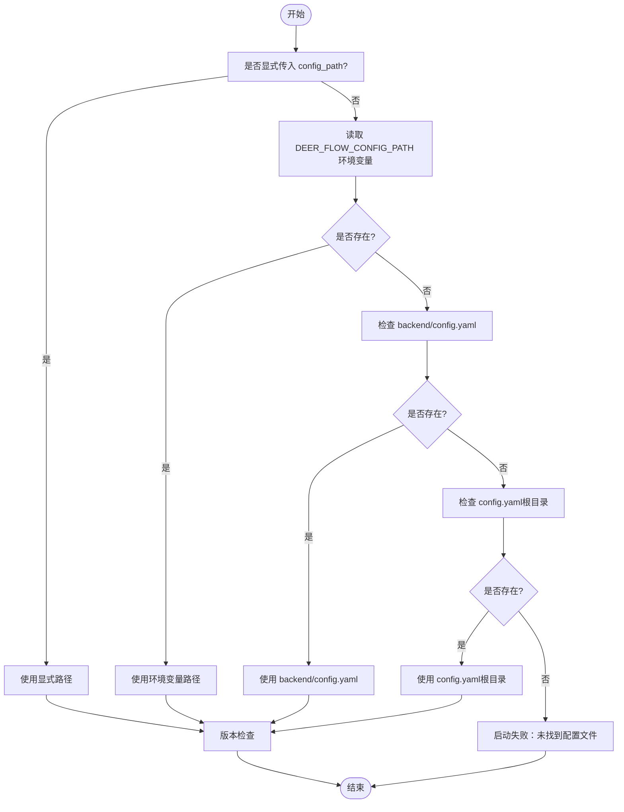
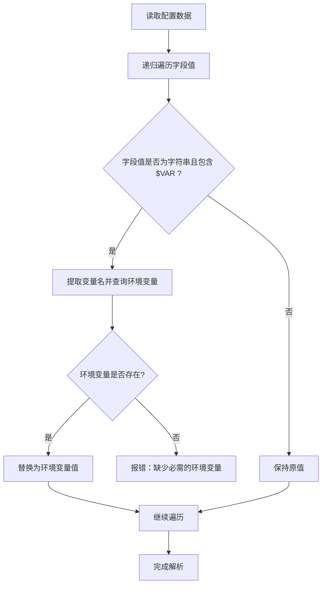
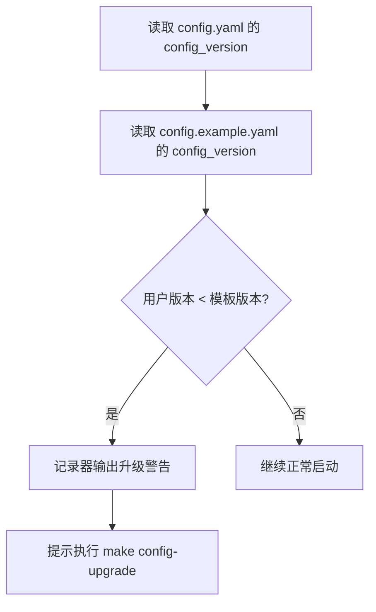
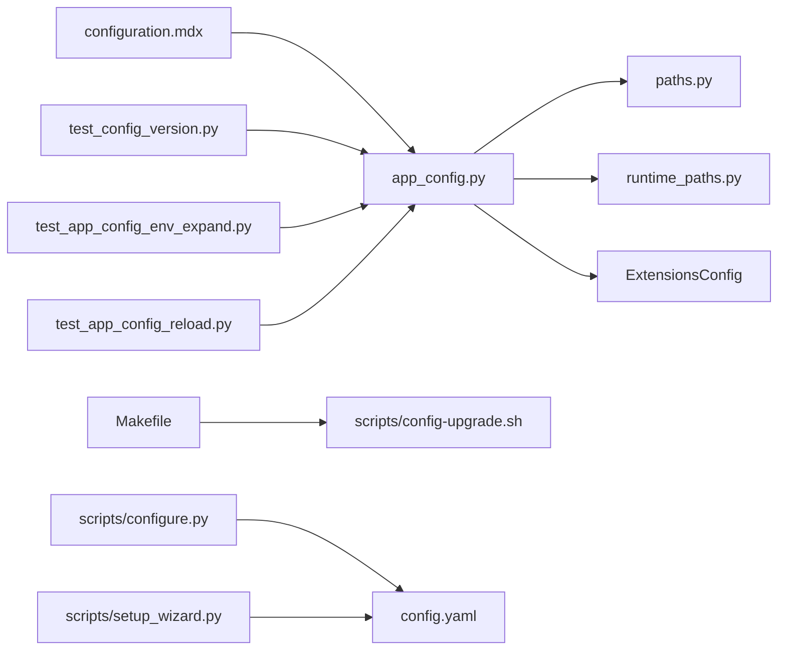

# 基础配置

<cite>
**本文引用的文件**
- [config.example.yaml](file://config.example.yaml)
- [config.yaml](file://config.yaml)
- [app_config.py](file://backend/packages/harness/deerflow/config/app_config.py)
- [paths.py](file://backend/packages/harness/deerflow/config/paths.py)
- [runtime_paths.py](file://backend/packages/harness/deerflow/config/runtime_paths.py)
- [configuration.mdx](file://frontend/src/content/en/harness/configuration.mdx)
- [Install.md](file://Install.md)
- [README.md](file://README.md)
- [Makefile](file://Makefile)
- [config-upgrade.sh](file://scripts/config-upgrade.sh)
- [configure.py](file://scripts/configure.py)
- [setup_wizard.py](file://scripts/setup_wizard.py)
- [test_config_version.py](file://backend/tests/test_config_version.py)
- [test_app_config_env_expand.py](file://backend/tests/test_app_config_env_expand.py)
- [test_app_config_reload.py](file://backend/tests/test_app_config_reload.py)
</cite>

## 目录
1. [简介](#简介)
2. [项目结构](#项目结构)
3. [核心组件](#核心组件)
4. [架构总览](#架构总览)
5. [详细组件分析](#详细组件分析)
6. [依赖关系分析](#依赖关系分析)
7. [性能考量](#性能考量)
8. [故障排查指南](#故障排查指南)
9. [结论](#结论)
10. [附录](#附录)

## 简介
本指南面向首次接触或需要深入理解 DeerFlow 配置系统的用户，系统性阐述配置文件格式、环境变量使用、配置版本管理与加载优先级，并结合仓库中的实际实现，给出可操作的配置步骤、验证方法与常见问题排查路径。目标是帮助你在不同环境中快速、安全地完成配置部署与维护。

## 项目结构
DeerFlow 的配置体系围绕后端的配置加载器与前端内容文档展开，核心文件包括：
- 根目录模板：config.example.yaml（完整字段参考）
- 运行时配置：config.yaml（实际部署使用的配置文件）
- 后端配置加载器：app_config.py（负责解析、校验、环境变量替换、版本检查与重载）
- 路径解析工具：paths.py、runtime_paths.py（定位配置文件与运行时路径）
- 前端配置说明：configuration.mdx（配置文件位置、环境变量插值等）
- 安装与升级脚本：Makefile、scripts/config-upgrade.sh、scripts/configure.py、scripts/setup_wizard.py
- 测试用例：test_config_version.py、test_app_config_env_expand.py、test_app_config_reload.py（验证配置行为）

**图示来源**
- [app_config.py:200-336](file://backend/packages/harness/deerflow/config/app_config.py#L200-L336)
- [paths.py](file://backend/packages/harness/deerflow/config/paths.py)
- [runtime_paths.py](file://backend/packages/harness/deerflow/config/runtime_paths.py)
- [configuration.mdx:1-37](file://frontend/src/content/en/harness/configuration.mdx#L1-L37)
- [Makefile](file://Makefile)
- [config-upgrade.sh](file://scripts/config-upgrade.sh)
- [configure.py](file://scripts/configure.py)
- [setup_wizard.py](file://scripts/setup_wizard.py)
- [test_config_version.py](file://backend/tests/test_config_version.py)
- [test_app_config_env_expand.py](file://backend/tests/test_app_config_env_expand.py)
- [test_app_config_reload.py](file://backend/tests/test_app_config_reload.py)

**章节来源**
- [configuration.mdx:1-37](file://frontend/src/content/en/harness/configuration.mdx#L1-L37)
- [app_config.py:200-336](file://backend/packages/harness/deerflow/config/app_config.py#L200-L336)

## 核心组件
- 配置文件格式与结构
  - 使用 YAML 格式，顶层包含多个配置段（如 models、tools、sandbox、memory、channels、extensions 等），具体字段以 config.example.yaml 为准。
  - 字段值支持以 $ 开头的环境变量插值语法，将在加载时被解析为对应环境变量的实际值。
- 配置版本管理
  - 加载器会读取 config.yaml 中的 config_version 字段并与模板中的版本进行比较，若用户版本低于模板版本，会提示执行配置升级流程。
- 配置加载与优先级
  - 支持通过显式传入路径、环境变量 DEER_FLOW_CONFIG_PATH、后端目录下的 backend/config.yaml、仓库根目录下的 config.yaml 四种方式定位配置文件；若均不存在则启动失败。
- 环境变量使用
  - 所有字段值均可使用 $VAR_NAME 形式的环境变量占位符，加载器会递归解析并替换。
- 自动重载与缓存
  - 配置在内存中缓存，但在开发模式下会在文件变更时自动重新加载，无需重启服务。

**章节来源**
- [app_config.py:200-336](file://backend/packages/harness/deerflow/config/app_config.py#L200-L336)
- [configuration.mdx:18-37](file://frontend/src/content/en/harness/configuration.mdx#L18-L37)
- [config.example.yaml](file://config.example.yaml)

## 架构总览
下图展示了从用户指定配置到应用启动的关键流程：定位配置文件 → 版本校验 → 环境变量解析 → 数据库默认值填充 → 扩展配置合并 → 应用启动。

**图示来源**
- [app_config.py:200-336](file://backend/packages/harness/deerflow/config/app_config.py#L200-L336)
- [paths.py](file://backend/packages/harness/deerflow/config/paths.py)

## 详细组件分析

### 配置文件定位与加载顺序
- 显式路径：调用 AppConfig.from_file(config_path) 时传入的路径优先。
- 环境变量：若未显式传入，则读取 DEER_FLOW_CONFIG_PATH 环境变量。
- 默认路径：依次检查 backend/config.yaml 与 config.yaml（仓库根目录）。
- 若以上均不存在，启动阶段抛出错误。
- 加载完成后进行版本检查，若用户版本落后于模板版本，触发升级提示。

**图示来源**
- [app_config.py:200-336](file://backend/packages/harness/deerflow/config/app_config.py#L200-L336)
- [configuration.mdx:18-27](file://frontend/src/content/en/harness/configuration.mdx#L18-L27)

**章节来源**
- [configuration.mdx:18-27](file://frontend/src/content/en/harness/configuration.mdx#L18-L27)
- [app_config.py:200-336](file://backend/packages/harness/deerflow/config/app_config.py#L200-L336)

### 环境变量插值机制
- 插值语法：$VAR_NAME（大小写敏感，需与系统环境变量一致）。
- 解析范围：对配置树进行递归遍历，将所有字符串类型的字段值中的占位符替换为对应环境变量值。
- 未设置的环境变量将导致解析失败，应在启动前确保所需变量已正确设置。

**图示来源**
- [app_config.py:333-336](file://backend/packages/harness/deerflow/config/app_config.py#L333-L336)

**章节来源**
- [app_config.py:333-336](file://backend/packages/harness/deerflow/config/app_config.py#L333-L336)

### 配置版本管理与升级
- 版本字段：config.yaml 中的 config_version 字段用于标识当前配置版本。
- 模板版本：config.example.yaml 中的 config_version 字段用于标识最新版本。
- 升级策略：当用户版本小于模板版本时，记录器输出警告，提示执行配置升级命令以合并新字段。
- 升级命令：make config-upgrade 或 scripts/config-upgrade.sh，将模板中的新增字段合并到现有配置中。

**图示来源**
- [app_config.py:299-330](file://backend/packages/harness/deerflow/config/app_config.py#L299-L330)
- [config-upgrade.sh](file://scripts/config-upgrade.sh)

**章节来源**
- [app_config.py:299-330](file://backend/packages/harness/deerflow/config/app_config.py#L299-L330)
- [config-upgrade.sh](file://scripts/config-upgrade.sh)

### 配置段作用与默认值说明（基于模板）
以下为 config.example.yaml 中常见配置段的职责概述（具体字段以模板为准）：
- models：定义可用的大模型提供商与参数，决定推理能力与计费策略。
- tools：声明可加载的工具集，控制 Agent 可执行的操作边界。
- sandbox：定义沙箱执行模式与安全策略，影响文件读写、网络访问与进程权限。
- memory：配置记忆存储与检索策略，影响对话上下文长度与持久化。
- channels：配置外部消息通道（如钉钉、飞书、Slack 等）的接入参数。
- extensions：加载扩展模块与第三方集成，增强系统功能。
- database：数据库连接与迁移配置，影响持久化层行为。
- tracing：链路追踪与可观测性配置，便于调试与性能分析。
- guardrails：内容安全与合规策略，限制不当输出。
- run_events：运行事件存储与回放配置，支持复盘与审计。
- token_usage：令牌用量统计与配额控制，便于成本监控。
- streaming：流式输出配置，优化用户体验。
- title_generation：标题自动生成策略，提升内容可读性。
- summarization：摘要生成策略，降低上下文成本。
- subagents：子代理配置，支持复杂任务分解与并行执行。
- skills：技能加载与权限控制，管理可执行的业务能力。
- tool_search：工具检索与推荐策略，提升工具发现效率。
- tool_output：工具输出处理与截断策略，保障稳定性。
- safety_finish_reason：安全终止原因与日志记录，便于问题定位。
- skill_evolution：技能演进与版本管理，支持持续优化。
- stream_bridge：流桥接配置，统一输出格式。
- loop_detection：循环检测与防护，避免死循环。
- checkpointer：检查点持久化配置，支持中断恢复。
- tracing_metadata：追踪元数据注入，增强可观测性。
- model_config：模型通用配置，影响推理参数与行为。
- memory_config：记忆配置，影响上下文管理。
- tool_config：工具通用配置，影响工具行为。
- extensions_config：扩展配置，影响第三方集成。
- app_config：应用通用配置，影响整体行为。
- runtime_paths：运行时路径配置，影响文件与缓存位置。
- paths：路径配置，影响工作目录与资源定位。

注意：上述段落为概念性说明，具体字段与默认值请以 config.example.yaml 为准。

**章节来源**
- [config.example.yaml](file://config.example.yaml)

### 配置验证与覆盖机制
- 验证方法
  - 版本一致性：通过比较 config.yaml 与 config.example.yaml 的 config_version 字段，确保配置未过期。
  - 环境变量完整性：确认所有 $VAR_NAME 占位符均有对应环境变量，避免运行时解析失败。
  - 文件存在性：确保配置文件存在于优先级确定的路径上。
- 覆盖机制
  - 环境变量优先：DEER_FLOW_CONFIG_PATH 可强制覆盖默认路径。
  - 运行时覆盖：部分环境变量（如渠道服务地址）可在运行时通过环境变量覆盖配置项。
  - 开发重载：文件变更后自动重新加载，无需重启。

**章节来源**
- [app_config.py:200-336](file://backend/packages/harness/deerflow/config/app_config.py#L200-L336)
- [configuration.mdx:18-37](file://frontend/src/content/en/harness/configuration.mdx#L18-L37)

## 依赖关系分析
- 配置加载器依赖路径解析模块以确定最终配置文件位置。
- 配置加载器在加载后会进行版本检查与环境变量解析，并合并扩展配置。
- 前端内容文档提供配置文件位置与环境变量插值的说明，作为用户侧的权威参考。
- 安装与升级脚本提供从模板生成配置、执行升级合并的自动化流程。

**图示来源**
- [app_config.py:200-336](file://backend/packages/harness/deerflow/config/app_config.py#L200-L336)
- [paths.py](file://backend/packages/harness/deerflow/config/paths.py)
- [runtime_paths.py](file://backend/packages/harness/deerflow/config/runtime_paths.py)
- [configuration.mdx:1-37](file://frontend/src/content/en/harness/configuration.mdx#L1-L37)
- [Makefile](file://Makefile)
- [config-upgrade.sh](file://scripts/config-upgrade.sh)
- [configure.py](file://scripts/configure.py)
- [setup_wizard.py](file://scripts/setup_wizard.py)
- [test_config_version.py](file://backend/tests/test_config_version.py)
- [test_app_config_env_expand.py](file://backend/tests/test_app_config_env_expand.py)
- [test_app_config_reload.py](file://backend/tests/test_app_config_reload.py)

## 性能考量
- 配置缓存：配置在内存中缓存，减少重复 IO。
- 自动重载：开发环境下文件变更自动重载，避免频繁重启带来的开销。
- 环境变量解析：递归遍历配置树进行插值，建议避免在大型配置中使用过多嵌套与深层引用，以降低解析成本。

[本节为通用指导，不直接分析具体文件]

## 故障排查指南
- 启动时报“未找到配置文件”
  - 检查是否显式传入了正确的 config_path。
  - 设置 DEER_FLOW_CONFIG_PATH 环境变量指向有效路径。
  - 确认 backend/config.yaml 或 config.yaml（根目录）存在。
- 启动时报“配置版本过期”
  - 执行 make config-upgrade 或 scripts/config-upgrade.sh，将模板中的新字段合并到现有配置。
- 环境变量未生效
  - 确认 $VAR_NAME 在系统中已设置，且大小写匹配。
  - 检查变量拼写与空格，避免解析失败。
- 配置更新后未生效
  - 开发模式下应自动重载；若未生效，检查文件是否被锁定或权限不足。
- 安装与向导相关问题
  - 使用 make config 或 scripts/configure.py 生成初始配置。
  - 使用 scripts/setup_wizard.py 运行交互式安装向导，按提示完成配置。

**章节来源**
- [configuration.mdx:18-37](file://frontend/src/content/en/harness/configuration.mdx#L18-L37)
- [app_config.py:200-336](file://backend/packages/harness/deerflow/config/app_config.py#L200-L336)
- [config-upgrade.sh](file://scripts/config-upgrade.sh)
- [configure.py](file://scripts/configure.py)
- [setup_wizard.py](file://scripts/setup_wizard.py)
- [test_config_version.py](file://backend/tests/test_config_version.py)
- [test_app_config_env_expand.py](file://backend/tests/test_app_config_env_expand.py)
- [test_app_config_reload.py](file://backend/tests/test_app_config_reload.py)

## 结论
DeerFlow 的配置系统以 config.yaml 为核心，通过明确的加载优先级、完善的版本管理与环境变量插值机制，实现了可移植、可审计、易定制的部署体验。配合安装向导与升级脚本，用户可以在不同环境中快速完成配置生成、验证与迭代。建议在生产环境中严格管理环境变量与配置版本，并利用测试用例验证关键配置项的行为。

[本节为总结性内容，不直接分析具体文件]

## 附录

### 完整配置示例文件解析（基于模板）
- 生成初始配置
  - 使用 make config 或 scripts/configure.py 将 config.example.yaml 复制为 config.yaml。
  - 使用 scripts/setup_wizard.py 运行交互式向导，生成最小化配置并写入密钥。
- 字段参考
  - 全量字段与默认值以 config.example.yaml 为准，涵盖 models、tools、sandbox、memory、channels、extensions 等段落。
- 版本管理
  - 通过比较 config_version 字段判断是否需要升级，使用 make config-upgrade 合并新字段。

**章节来源**
- [config.example.yaml](file://config.example.yaml)
- [Makefile](file://Makefile)
- [configure.py](file://scripts/configure.py)
- [setup_wizard.py](file://scripts/setup_wizard.py)