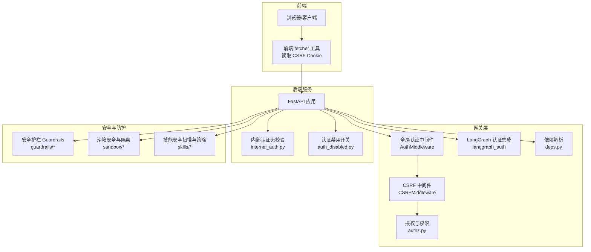
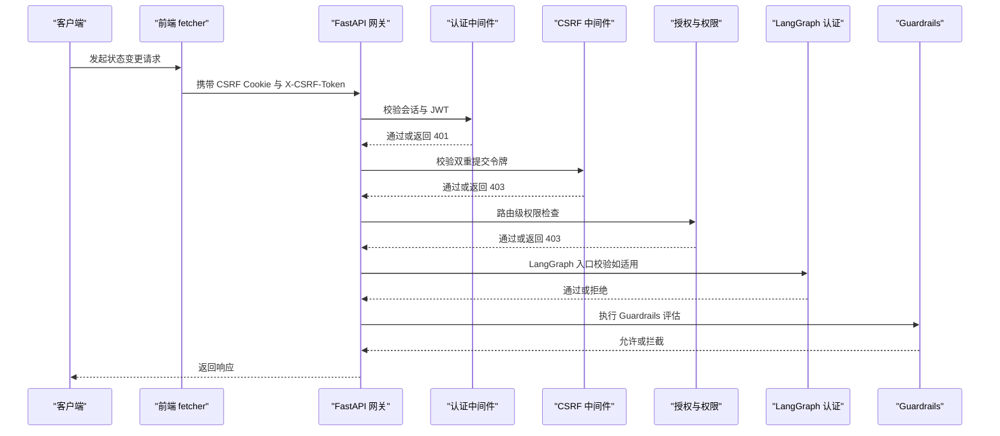
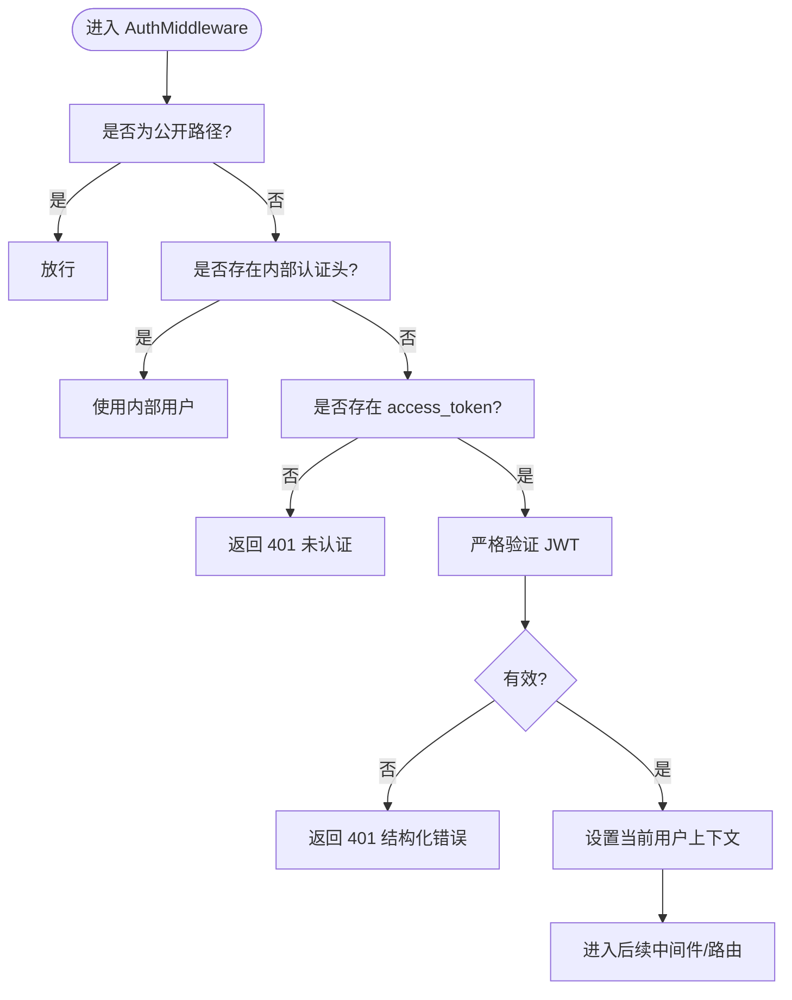
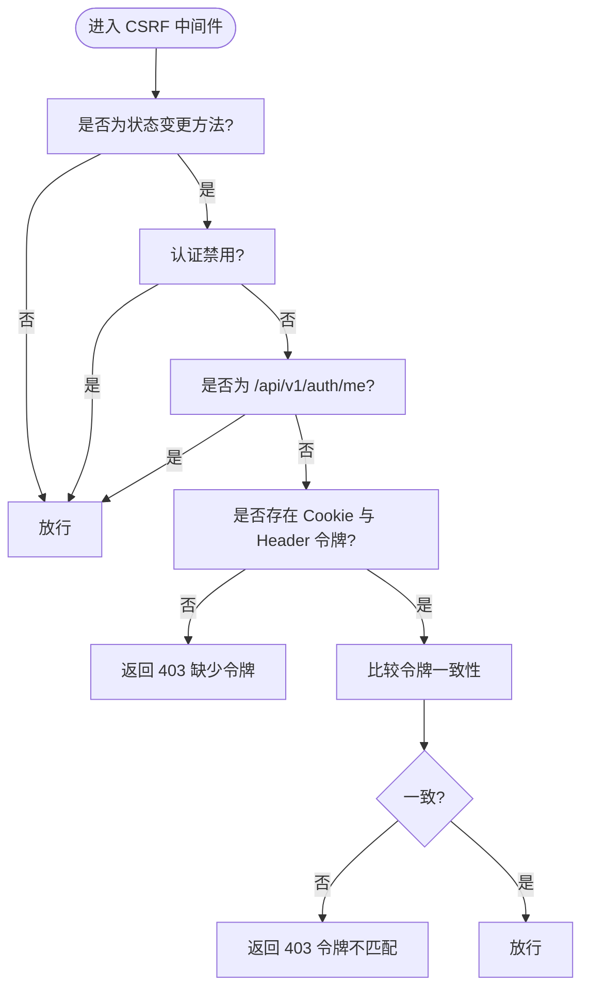
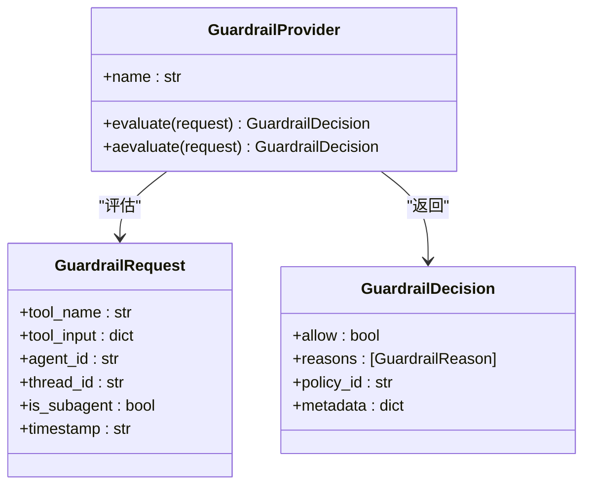
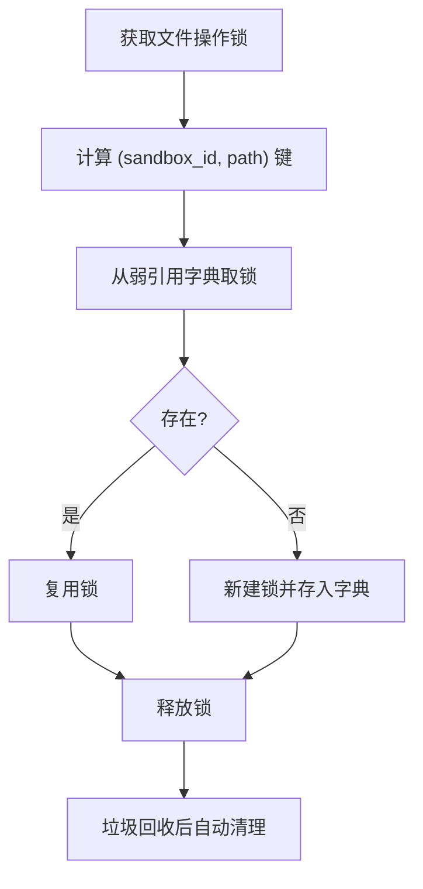
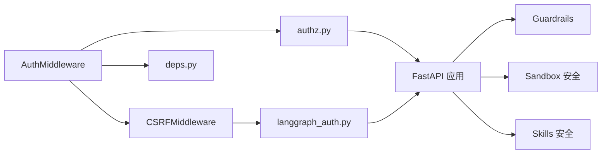

# 安全配置

<cite>
**本文引用的文件**
- [backend/app/gateway/auth_middleware.py](file://backend/app/gateway/auth_middleware.py)
- [backend/app/gateway/csrf_middleware.py](file://backend/app/gateway/csrf_middleware.py)
- [backend/app/gateway/langgraph_auth.py](file://backend/app/gateway/langgraph_auth.py)
- [backend/app/gateway/authz.py](file://backend/app/gateway/authz.py)
- [backend/app/gateway/auth_disabled.py](file://backend/app/gateway/auth_disabled.py)
- [backend/app/gateway/internal_auth.py](file://backend/app/gateway/internal_auth.py)
- [backend/app/gateway/deps.py](file://backend/app/gateway/deps.py)
- [backend/docs/GUARDRAILS.md](file://backend/docs/GUARDRAILS.md)
- [backend/docs/AUTH_DESIGN.md](file://backend/docs/AUTH_DESIGN.md)
- [backend/docs/CONFIGURATION.md](file://backend/docs/CONFIGURATION.md)
- [backend/packages/harness/deerflow/sandbox/security.py](file://backend/packages/harness/deerflow/sandbox/security.py)
- [backend/packages/harness/deerflow/sandbox/file_operation_lock.py](file://backend/packages/harness/deerflow/sandbox/file_operation_lock.py)
- [backend/packages/harness/deerflow/skills/security_scanner.py](file://backend/packages/harness/deerflow/skills/security_scanner.py)
- [backend/packages/harness/deerflow/skills/tool_policy.py](file://backend/packages/harness/deerflow/skills/tool_policy.py)
- [backend/packages/harness/deerflow/guardrails/middleware.py](file://backend/packages/harness/deerflow/guardrails/middleware.py)
- [backend/packages/harness/deerflow/guardrails/provider.py](file://backend/packages/harness/deerflow/guardrails/provider.py)
- [backend/packages/harness/deerflow/guardrails/builtin.py](file://backend/packages/harness/deerflow/guardrails/builtin.py)
- [backend/packages/harness/deerflow/config/guardrails_config.py](file://backend/packages/harness/deerflow/config/guardrails_config.py)
- [backend/packages/harness/deerflow/config/loop_detection_config.py](file://backend/packages/harness/deerflow/config/loop_detection_config.py)
- [backend/packages/harness/deerflow/config/safety_finish_reason_config.py](file://backend/packages/harness/deerflow/config/safety_finish_reason_config.py)
- [backend/scripts/e2e_safety_termination_demo.py](file://backend/scripts/e2e_safety_termination_demo.py)
- [backend/tests/test_sandbox_tools_security.py](file://backend/tests/test_sandbox_tools_security.py)
- [backend/tests/test_local_sandbox_virtual_path_contract.py](file://backend/tests/test_local_sandbox_virtual_path_contract.py)
- [backend/tests/test_auth_errors.py](file://backend/tests/test_auth_errors.py)
- [backend/tests/test_auth_type_system.py](file://backend/tests/test_auth_type_system.py)
- [frontend/src/core/api/fetcher.ts](file://frontend/src/core/api/fetcher.ts)
- [config.example.yaml](file://config.example.yaml)
</cite>

## 目录
1. [简介](#简介)
2. [项目结构](#项目结构)
3. [核心组件](#核心组件)
4. [架构总览](#架构总览)
5. [详细组件分析](#详细组件分析)
6. [依赖关系分析](#依赖关系分析)
7. [性能考量](#性能考量)
8. [故障排查指南](#故障排查指南)
9. [结论](#结论)
10. [附录](#附录)

## 简介
本指南面向部署与运维人员，系统性阐述 DeerFlow 的安全配置与最佳实践，覆盖认证与会话、授权与权限、API 密钥与内部鉴权、跨站请求伪造防护（CSRF）、安全护栏（Guardrails）与内容过滤、恶意请求检测、沙箱与工具安全隔离、以及安全审计与日志监控等主题。文档同时提供不同部署场景下的安全配置模板与风险评估方法，帮助在保证功能可用的前提下实现纵深防御。

## 项目结构
后端采用 FastAPI + Starlette 中间件体系，前端通过 Cookie + 双重提交令牌（Double Submit Cookie）模式配合 CSRF 中间件进行防护。安全相关能力分布在网关中间件、认证/授权模块、沙箱与技能安全、以及 Guardrails 内容过滤与安全终止检测等模块中。

图表来源
- [backend/app/gateway/auth_middleware.py:1-109](file://backend/app/gateway/auth_middleware.py#L1-L109)
- [backend/app/gateway/csrf_middleware.py:1-186](file://backend/app/gateway/csrf_middleware.py#L1-L186)
- [backend/app/gateway/langgraph_auth.py:42-88](file://backend/app/gateway/langgraph_auth.py#L42-L88)
- [backend/app/gateway/authz.py](file://backend/app/gateway/authz.py)
- [backend/app/gateway/deps.py](file://backend/app/gateway/deps.py)
- [backend/app/gateway/internal_auth.py](file://backend/app/gateway/internal_auth.py)
- [backend/app/gateway/auth_disabled.py](file://backend/app/gateway/auth_disabled.py)
- [backend/packages/harness/deerflow/guardrails/middleware.py](file://backend/packages/harness/deerflow/guardrails/middleware.py)
- [backend/packages/harness/deerflow/sandbox/security.py](file://backend/packages/harness/deerflow/sandbox/security.py)
- [backend/packages/harness/deerflow/skills/security_scanner.py](file://backend/packages/harness/deerflow/skills/security_scanner.py)

章节来源
- [backend/app/gateway/auth_middleware.py:1-109](file://backend/app/gateway/auth_middleware.py#L1-L109)
- [backend/app/gateway/csrf_middleware.py:1-186](file://backend/app/gateway/csrf_middleware.py#L1-L186)
- [frontend/src/core/api/fetcher.ts:1-37](file://frontend/src/core/api/fetcher.ts#L1-L37)

## 核心组件
- 全局认证中间件：对非公开路径进行严格会话与 JWT 校验，失败返回 401，并将当前用户注入运行时上下文以支持基于用户的资源隔离。
- CSRF 中间件：对状态变更类请求（POST/PUT/DELETE/PATCH）实施双重提交令牌校验，结合 SameSite/Secure Cookie 策略抵御跨站请求伪造。
- 授权与权限：细粒度权限装饰器与上下文对象，确保路由级与资源级访问控制。
- LangGraph 认证集成：在 LangGraph 流程入口处执行 CSRF 与会话校验，统一安全边界。
- 安全护栏（Guardrails）：对工具调用与模型输出进行策略评估与拦截，支持多提供商安全终止检测与内容过滤。
- 沙箱与技能安全：文件操作锁、线程隔离、虚拟路径映射隔离、工具策略与安全扫描，防止越权与资源泄露。
- 内部认证与认证禁用：支持内部服务间认证头校验与开发/测试环境的认证禁用开关。

章节来源
- [backend/app/gateway/auth_middleware.py:59-109](file://backend/app/gateway/auth_middleware.py#L59-L109)
- [backend/app/gateway/csrf_middleware.py:179-186](file://backend/app/gateway/csrf_middleware.py#L179-L186)
- [backend/app/gateway/authz.py](file://backend/app/gateway/authz.py)
- [backend/app/gateway/langgraph_auth.py:61-88](file://backend/app/gateway/langgraph_auth.py#L61-L88)
- [backend/packages/harness/deerflow/guardrails/middleware.py](file://backend/packages/harness/deerflow/guardrails/middleware.py)
- [backend/packages/harness/deerflow/sandbox/security.py](file://backend/packages/harness/deerflow/sandbox/security.py)
- [backend/packages/harness/deerflow/skills/security_scanner.py](file://backend/packages/harness/deerflow/skills/security_scanner.py)

## 架构总览
下图展示从客户端到后端服务的关键安全交互流程，包括认证、CSRF、授权与 Guardrails 内容过滤。

图表来源
- [backend/app/gateway/auth_middleware.py:59-109](file://backend/app/gateway/auth_middleware.py#L59-L109)
- [backend/app/gateway/csrf_middleware.py:179-186](file://backend/app/gateway/csrf_middleware.py#L179-L186)
- [backend/app/gateway/langgraph_auth.py:61-88](file://backend/app/gateway/langgraph_auth.py#L61-L88)
- [backend/packages/harness/deerflow/guardrails/middleware.py](file://backend/packages/harness/deerflow/guardrails/middleware.py)

## 详细组件分析

### 认证与会话
- 全局认证中间件对非公开路径强制要求有效会话；当存在内部认证头或 Cookie 中的 access_token 时，进行严格 JWT 解码与用户解析，并将用户信息写入运行时上下文，实现基于用户的资源隔离。
- 公开路径白名单包括健康检查与文档接口；登录、注册、登出、初始化等认证相关接口明确标记为公开。
- 认证错误返回结构化 401，区分过期、签名无效、格式错误等场景，便于前端与日志系统识别。

图表来源
- [backend/app/gateway/auth_middleware.py:59-109](file://backend/app/gateway/auth_middleware.py#L59-L109)
- [backend/app/gateway/auth_disabled.py](file://backend/app/gateway/auth_disabled.py)
- [backend/app/gateway/deps.py](file://backend/app/gateway/deps.py)

章节来源
- [backend/app/gateway/auth_middleware.py:31-57](file://backend/app/gateway/auth_middleware.py#L31-L57)
- [backend/app/gateway/auth_middleware.py:94-109](file://backend/app/gateway/auth_middleware.py#L94-L109)
- [backend/tests/test_auth_errors.py:48-75](file://backend/tests/test_auth_errors.py#L48-L75)
- [backend/tests/test_auth_type_system.py:533-558](file://backend/tests/test_auth_type_system.py#L533-L558)

### 授权与权限
- 授权上下文与装饰器用于在路由层实施细粒度权限控制，结合用户上下文实现资源级访问控制。
- 内部服务间可通过专用头部进行认证与授权判定，避免暴露给外部网络。

章节来源
- [backend/app/gateway/authz.py](file://backend/app/gateway/authz.py)
- [backend/app/gateway/internal_auth.py](file://backend/app/gateway/internal_auth.py)

### CSRF 防护
- 对状态变更请求（POST/PUT/DELETE/PATCH）实施双重提交令牌校验，要求客户端同时提供 Cookie 中的 csrf_token 与请求头 X-CSRF-Token。
- 登录/注册/初始化等首次请求允许从同源或显式配置的 CORS 原点发起，防范跨站登录 CSRF 与会话固定攻击。
- 在 HTTP 场景下不强制 Secure 标记，但建议生产环境启用 HTTPS 并配合 SameSite=Strict/Lax 与 Secure Cookie。

图表来源
- [backend/app/gateway/csrf_middleware.py:34-50](file://backend/app/gateway/csrf_middleware.py#L34-L50)
- [backend/app/gateway/csrf_middleware.py:179-186](file://backend/app/gateway/csrf_middleware.py#L179-L186)
- [frontend/src/core/api/fetcher.ts:17-37](file://frontend/src/core/api/fetcher.ts#L17-L37)

章节来源
- [backend/app/gateway/csrf_middleware.py:1-186](file://backend/app/gateway/csrf_middleware.py#L1-L186)
- [backend/tests/test_auth_type_system.py:689-701](file://backend/tests/test_auth_type_system.py#L689-L701)

### LangGraph 认证集成
- 在 LangGraph 流程入口处先执行 CSRF 校验，再进行会话与 JWT 解码，最后校验 token_version，确保跨组件一致的安全边界。

章节来源
- [backend/app/gateway/langgraph_auth.py:42-88](file://backend/app/gateway/langgraph_auth.py#L42-L88)

### 安全护栏（Guardrails）与内容过滤
- Guardrails 提供统一的策略评估接口，支持工具调用前后的决策与拦截。
- 内置多种提供商的安全终止检测（如内容过滤、拒绝原因等），可配置加载与扩展。
- 提供安全终止检测脚本与示例，便于端到端验证。

图表来源
- [backend/docs/GUARDRAILS.md:254-283](file://backend/docs/GUARDRAILS.md#L254-L283)
- [backend/packages/harness/deerflow/guardrails/provider.py](file://backend/packages/harness/deerflow/guardrails/provider.py)
- [backend/packages/harness/deerflow/guardrails/builtin.py](file://backend/packages/harness/deerflow/guardrails/builtin.py)
- [backend/packages/harness/deerflow/guardrails/middleware.py](file://backend/packages/harness/deerflow/guardrails/middleware.py)

章节来源
- [backend/docs/GUARDRAILS.md:254-283](file://backend/docs/GUARDRAILS.md#L254-L283)
- [backend/packages/harness/deerflow/config/guardrails_config.py](file://backend/packages/harness/deerflow/config/guardrails_config.py)
- [backend/scripts/e2e_safety_termination_demo.py](file://backend/scripts/e2e_safety_termination_demo.py)

### 恶意请求检测与安全终止
- 提供商安全终止配置用于拦截因安全原因提前停止生成的响应（如内容过滤、拒绝等），并阻止不可靠的工具调用执行。
- 循环检测与安全终止原因配置可进一步降低资源滥用与异常行为风险。

章节来源
- [config.example.yaml:701-713](file://config.example.yaml#L701-L713)
- [backend/packages/harness/deerflow/config/loop_detection_config.py](file://backend/packages/harness/deerflow/config/loop_detection_config.py)
- [backend/packages/harness/deerflow/config/safety_finish_reason_config.py](file://backend/packages/harness/deerflow/config/safety_finish_reason_config.py)

### 沙箱与工具安全隔离
- 文件操作锁：使用弱引用字典避免长期运行进程中的内存泄漏，按沙箱实例与路径键控并发互斥。
- 线程隔离：每个线程拥有独立的虚拟路径映射与已写入文件集合，避免跨线程状态泄漏。
- 沙箱安全策略：限制文件系统访问范围、工具调用范围与资源消耗，结合工具策略与安全扫描。

图表来源
- [backend/packages/harness/deerflow/sandbox/file_operation_lock.py:1-27](file://backend/packages/harness/deerflow/sandbox/file_operation_lock.py#L1-L27)
- [backend/tests/test_sandbox_tools_security.py:1308-1341](file://backend/tests/test_sandbox_tools_security.py#L1308-L1341)
- [backend/tests/test_local_sandbox_virtual_path_contract.py:170-192](file://backend/tests/test_local_sandbox_virtual_path_contract.py#L170-L192)

章节来源
- [backend/packages/harness/deerflow/sandbox/security.py](file://backend/packages/harness/deerflow/sandbox/security.py)
- [backend/packages/harness/deerflow/sandbox/file_operation_lock.py:1-27](file://backend/packages/harness/deerflow/sandbox/file_operation_lock.py#L1-L27)
- [backend/tests/test_sandbox_tools_security.py:1308-1341](file://backend/tests/test_sandbox_tools_security.py#L1308-L1341)
- [backend/tests/test_local_sandbox_virtual_path_contract.py:170-192](file://backend/tests/test_local_sandbox_virtual_path_contract.py#L170-L192)

### 技能安全扫描与策略
- 技能安全扫描器与工具策略模块负责对自定义与公共技能进行安全评估与策略约束，防止高危工具被滥用。
- 技能权限模型与验证流程确保仅授权技能可被执行。

章节来源
- [backend/packages/harness/deerflow/skills/security_scanner.py](file://backend/packages/harness/deerflow/skills/security_scanner.py)
- [backend/packages/harness/deerflow/skills/tool_policy.py](file://backend/packages/harness/deerflow/skills/tool_policy.py)

## 依赖关系分析
- 认证中间件依赖会话 Cookie、JWT 解析与用户上下文注入；CSRF 中间件依赖前端提供的双重提交令牌与后端生成的 CSRF Cookie。
- 授权模块依赖认证中间件解析出的用户上下文，实现路由级与资源级权限控制。
- LangGraph 认证集成在流程入口处复用通用认证链路，确保一致的安全策略。
- Guardrails 作为横切关注点，在工具调用与模型输出阶段插入评估与拦截。
- 沙箱与技能安全模块通过文件锁、线程隔离与策略扫描形成纵深防护。

图表来源
- [backend/app/gateway/auth_middleware.py:59-109](file://backend/app/gateway/auth_middleware.py#L59-L109)
- [backend/app/gateway/csrf_middleware.py:179-186](file://backend/app/gateway/csrf_middleware.py#L179-L186)
- [backend/app/gateway/langgraph_auth.py:61-88](file://backend/app/gateway/langgraph_auth.py#L61-L88)
- [backend/app/gateway/authz.py](file://backend/app/gateway/authz.py)
- [backend/packages/harness/deerflow/guardrails/middleware.py](file://backend/packages/harness/deerflow/guardrails/middleware.py)
- [backend/packages/harness/deerflow/sandbox/security.py](file://backend/packages/harness/deerflow/sandbox/security.py)
- [backend/packages/harness/deerflow/skills/security_scanner.py](file://backend/packages/harness/deerflow/skills/security_scanner.py)

## 性能考量
- CSRF 与认证中间件均为轻量级检查，对性能影响有限；建议在反向代理层开启连接池与压缩以提升整体吞吐。
- 沙箱文件锁使用弱引用字典避免内存泄漏，但仍需定期监控长生命周期进程的内存占用。
- Guardrails 评估应选择合适的策略集与缓存策略，避免对高频请求造成延迟放大。

## 故障排查指南
- 认证错误
  - 401 未认证：检查 Cookie 中 access_token 是否存在且未过期；确认 JWT 秘钥配置正确。
  - 401 结构化错误：根据错误码（过期、签名无效、格式错误）定位问题并提示用户重新登录。
- CSRF 失败
  - 403 缺少令牌：确认前端已正确读取并携带 CSRF Cookie 与请求头。
  - 403 令牌不匹配：检查 Cookie 与 Header 是否一致，避免跨域或代理导致的头部丢失。
- LangGraph 认证失败
  - 确认 CSRF 校验在会话校验之前执行，跨站伪造请求会被早期拒绝。
- Guardrails 拦截
  - 检查策略配置与内置提供商适配，必要时调整策略或放宽规则以减少误判。
- 沙箱与技能安全
  - 若出现文件操作冲突或跨线程状态泄漏，检查文件锁与线程隔离配置是否生效。

章节来源
- [backend/tests/test_auth_errors.py:48-75](file://backend/tests/test_auth_errors.py#L48-L75)
- [backend/tests/test_auth_type_system.py:533-558](file://backend/tests/test_auth_type_system.py#L533-L558)
- [backend/app/gateway/csrf_middleware.py:179-186](file://backend/app/gateway/csrf_middleware.py#L179-L186)
- [backend/app/gateway/langgraph_auth.py:61-88](file://backend/app/gateway/langgraph_auth.py#L61-L88)

## 结论
DeerFlow 的安全体系以“失败关闭”的认证中间件为核心，结合 CSRF 双重提交令牌、细粒度授权、LangGraph 统一入口校验、Guardrails 内容过滤与安全终止、以及沙箱与技能安全隔离，构建了多层次的安全防线。建议在生产环境中强制 HTTPS、合理配置 CORS 与 Cookie 属性、启用严格的 CSP 与 HSTS、并持续完善安全护栏策略与日志审计。

## 附录

### 不同部署场景下的安全配置模板
- 开发/本地环境
  - 允许认证禁用与 HTTP 使用，但仅限内网访问；关闭严格 CSRF 或仅在需要时启用。
  - 关闭或放宽 Guardrails 策略以便调试。
- 生产环境
  - 强制 HTTPS，Cookie 设置 Secure+SameSite=Strict/Lax；启用 CSRF 双重提交令牌。
  - 启用严格的授权与资源隔离；配置 Guardrails 内置提供商安全终止检测。
  - 启用循环检测与安全终止原因配置，限制工具调用预算与输出长度。
  - 沙箱限制文件系统访问与资源消耗，启用工具策略与安全扫描。

章节来源
- [config.example.yaml:701-713](file://config.example.yaml#L701-L713)
- [backend/packages/harness/deerflow/config/loop_detection_config.py](file://backend/packages/harness/deerflow/config/loop_detection_config.py)
- [backend/packages/harness/deerflow/config/safety_finish_reason_config.py](file://backend/packages/harness/deerflow/config/safety_finish_reason_config.py)

### 风险评估方法
- 认证与会话
  - 评估 JWT 秘钥轮换策略、Token 过期时间与刷新机制、会话固定风险。
- 授权与权限
  - 审核权限装饰器覆盖率、默认拒绝策略、资源级访问控制有效性。
- CSRF
  - 检查状态变更接口覆盖率、跨域与代理场景下的令牌传递、浏览器兼容性。
- Guardrails
  - 评估策略误判率与漏判率、策略更新频率、与业务需求的平衡。
- 沙箱与技能
  - 评估文件系统隔离完整性、线程隔离有效性、工具调用预算与超时策略。
- 日志与审计
  - 确保认证失败、CSRF 拦截、授权拒绝、Guardrails 拦截、沙箱违规事件均记录并可追溯。

### 安全审计与日志监控
- 建议在反向代理与应用层分别记录访问日志与安全事件日志，统一接入 SIEM/日志平台。
- 关键指标：认证失败率、CSRF 拦截数、授权拒绝数、Guardrails 拦截数、沙箱违规事件数、异常响应时间与错误码分布。
- 告警阈值：突发认证失败、CSRF 拦截激增、授权拒绝异常升高、Guardrails 拦截率异常波动。