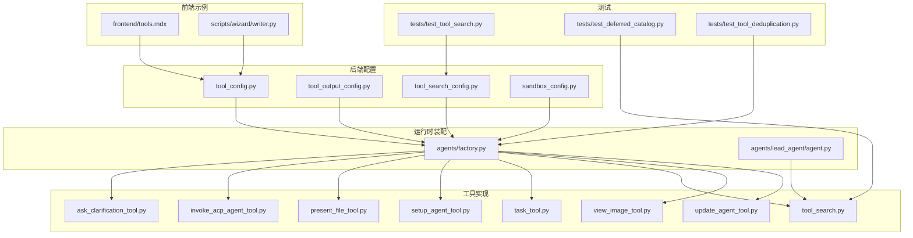
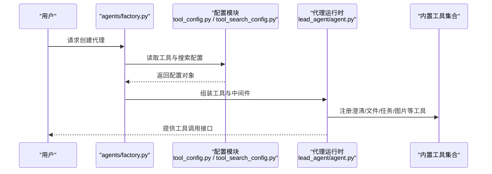
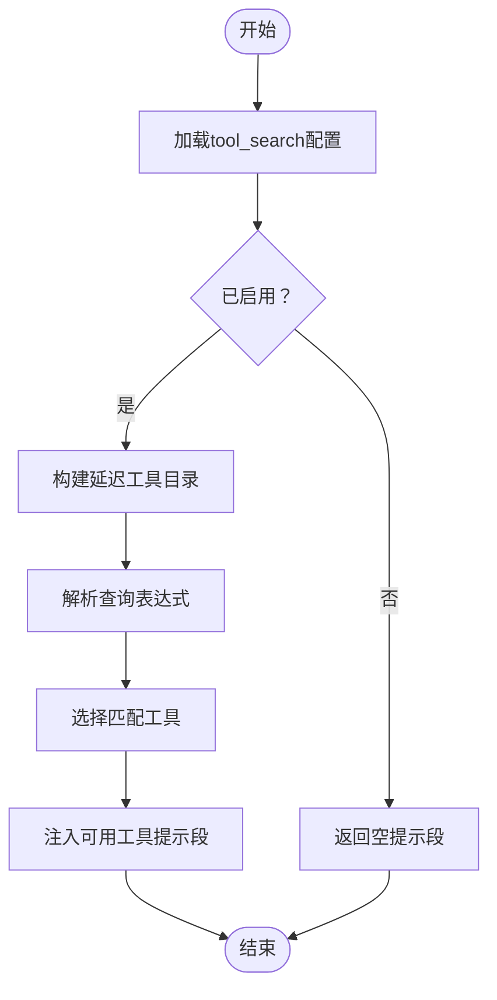
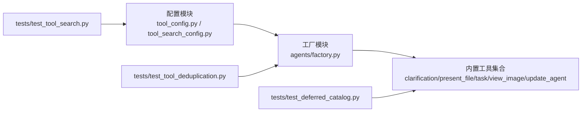

# 内置工具配置

<cite>
**本文引用的文件**
- [tool_config.py](file://backend/packages/harness/deerflow/config/tool_config.py)
- [tool_output_config.py](file://backend/packages/harness/deerflow/config/tool_output_config.py)
- [tool_search_config.py](file://backend/packages/harness/deerflow/config/tool_search_config.py)
- [sandbox_config.py](file://backend/packages/harness/deerflow/config/sandbox_config.py)
- [ask_clarification_tool.py](file://backend/CONTRIBUTING.md)
- [invoke_acp_agent_tool.py](file://backend/CONTRIBUTING.md)
- [present_file_tool.py](file://backend/CONTRIBUTING.md)
- [setup_agent_tool.py](file://backend/CONTRIBUTING.md)
- [task_tool.py](file://backend/docs/task_tool_improvements.md)
- [tool_search.py](file://backend/tests/test_tool_search.py)
- [deferred_catalog.py](file://backend/tests/test_deferred_catalog.py)
- [factory.py](file://backend/packages/harness/deerflow/agents/factory.py)
- [agent.py](file://backend/packages/harness/deerflow/agents/lead_agent/agent.py)
- [tools.mdx](file://frontend/src/content/zh/harness/tools.mdx)
- [writer.py](file://scripts/wizard/writer.py)
- [test_tool_deduplication.py](file://backend/tests/test_tool_deduplication.py)
- [view_image_tool.py](file://backend/CONTRIBUTING.md)
- [update_agent_tool.py](file://backend/CONTRIBUTING.md)
</cite>

## 目录
1. [简介](#简介)
2. [项目结构](#项目结构)
3. [核心组件](#核心组件)
4. [架构总览](#架构总览)
5. [详细组件分析](#详细组件分析)
6. [依赖关系分析](#依赖关系分析)
7. [性能考量](#性能考量)
8. [故障排查指南](#故障排查指南)
9. [结论](#结论)
10. [附录](#附录)

## 简介
本文件面向系统管理员与开发者，提供deer-flow内置工具的完整配置指南。内容覆盖以下核心工具：clarification_tool（澄清工具）、invoke_acp_agent_tool（ACF代理调用工具）、present_file_tool（文件展示工具）、setup_agent_tool（代理设置工具）、task_tool（任务工具）、tool_search（工具搜索）、update_agent_tool（代理更新工具）、view_image_tool（图片查看工具）。文档包含各工具的配置参数、使用场景、最佳实践、配置示例路径、参数说明与安全注意事项。

## 项目结构
内置工具配置主要分布在以下区域：
- 后端配置模块：位于backend/packages/harness/deerflow/config，定义工具、输出、搜索、沙箱等配置类与加载函数。
- 前端文档：位于frontend/src/content/zh/harness/tools.mdx，提供工具配置示例与说明。
- 工具实现与注册：位于backend/CONTRIBUTING.md中列出的工具文件，以及agents/factory.py中的工具装配逻辑。
- 测试与示例：位于backend/tests与scripts/wizard，验证工具行为与生成默认配置。

图表来源
- [tool_config.py](file://backend/packages/harness/deerflow/config/tool_config.py)
- [tool_output_config.py](file://backend/packages/harness/deerflow/config/tool_output_config.py)
- [tool_search_config.py](file://backend/packages/harness/deerflow/config/tool_search_config.py)
- [sandbox_config.py](file://backend/packages/harness/deerflow/config/sandbox_config.py)
- [factory.py](file://backend/packages/harness/deerflow/agents/factory.py)
- [agent.py](file://backend/packages/harness/deerflow/agents/lead_agent/agent.py)
- [tools.mdx](file://frontend/src/content/zh/harness/tools.mdx)
- [writer.py](file://scripts/wizard/writer.py)
- [test_tool_search.py](file://backend/tests/test_tool_search.py)
- [deferred_catalog.py](file://backend/tests/test_deferred_catalog.py)
- [test_tool_deduplication.py](file://backend/tests/test_tool_deduplication.py)

章节来源
- [tool_config.py](file://backend/packages/harness/deerflow/config/tool_config.py)
- [tool_output_config.py](file://backend/packages/harness/deerflow/config/tool_output_config.py)
- [tool_search_config.py](file://backend/packages/harness/deerflow/config/tool_search_config.py)
- [sandbox_config.py](file://backend/packages/harness/deerflow/config/sandbox_config.py)
- [factory.py](file://backend/packages/harness/deerflow/agents/factory.py)
- [agent.py](file://backend/packages/harness/deerflow/agents/lead_agent/agent.py)
- [tools.mdx](file://frontend/src/content/zh/harness/tools.mdx)
- [writer.py](file://scripts/wizard/writer.py)
- [test_tool_search.py](file://backend/tests/test_tool_search.py)
- [deferred_catalog.py](file://backend/tests/test_deferred_catalog.py)
- [test_tool_deduplication.py](file://backend/tests/test_tool_deduplication.py)

## 核心组件
本节概述各内置工具的职责、典型配置项与适用场景。

- 澄清工具（clarification_tool）
  - 职责：引导用户澄清模糊或不完整的需求，提升任务质量。
  - 典型配置：无专用配置类，通过中间件与提示词控制行为。
  - 使用场景：需求收集阶段、任务分解前。
  - 最佳实践：与任务工具配合，先澄清再执行。

- ACF代理调用工具（invoke_acp_agent_tool）
  - 职责：调用外部ACF代理执行特定任务。
  - 典型配置：ACP代理配置、认证凭据、超时与重试策略。
  - 使用场景：跨系统集成、外部流程编排。
  - 最佳实践：限制调用频率，记录调用日志，确保凭据安全存储。

- 文件展示工具（present_file_tool）
  - 职责：以可读方式展示文件内容或元信息。
  - 典型配置：展示格式、最大长度、编码处理。
  - 使用场景：报告生成、审计日志、知识抽取。
  - 最佳实践：限制单次展示大小，避免敏感信息泄露。

- 代理设置工具（setup_agent_tool）
  - 职责：初始化与配置代理运行环境。
  - 典型配置：模型参数、内存设置、中间件开关。
  - 使用场景：新代理上线、环境迁移。
  - 最佳实践：版本化配置，灰度发布。

- 任务工具（task_tool）
  - 职责：创建、查询、轮询与管理子任务。
  - 典型配置：轮询间隔、超时阈值、并发上限。
  - 使用场景：异步任务编排、长耗时操作。
  - 最佳实践：避免过度轮询，合理设置超时与重试。

- 工具搜索（tool_search）
  - 职责：延迟加载与动态筛选可用工具，减少绑定开销。
  - 典型配置：启用开关、提示词注入、过滤规则。
  - 使用场景：大型工具集、MCP工具动态装配。
  - 最佳实践：仅在必要时启用，避免影响推理性能。

- 代理更新工具（update_agent_tool）
  - 职责：更新代理配置与技能集合。
  - 典致配置：更新策略、回滚机制、版本校验。
  - 使用场景：技能迭代、配置热更新。
  - 最佳实践：原子化更新，失败快速回滚。

- 图片查看工具（view_image_tool）
  - 职责：渲染或预览图片资源。
  - 典型配置：尺寸限制、格式支持、缓存策略。
  - 使用场景：可视化报告、图像标注。
  - 最佳实践：限制图片大小，避免内存溢出。

章节来源
- [ask_clarification_tool.py](file://backend/CONTRIBUTING.md)
- [invoke_acp_agent_tool.py](file://backend/CONTRIBUTING.md)
- [present_file_tool.py](file://backend/CONTRIBUTING.md)
- [setup_agent_tool.py](file://backend/CONTRIBUTING.md)
- [task_tool.py](file://backend/docs/task_tool_improvements.md)
- [view_image_tool.py](file://backend/CONTRIBUTING.md)
- [update_agent_tool.py](file://backend/CONTRIBUTING.md)

## 架构总览
内置工具的装配与运行由工厂模块统一调度，结合配置模块与中间件实现延迟加载与安全控制。

图表来源
- [factory.py](file://backend/packages/harness/deerflow/agents/factory.py)
- [agent.py](file://backend/packages/harness/deerflow/agents/lead_agent/agent.py)
- [tool_config.py](file://backend/packages/harness/deerflow/config/tool_config.py)
- [tool_search_config.py](file://backend/packages/harness/deerflow/config/tool_search_config.py)

章节来源
- [factory.py](file://backend/packages/harness/deerflow/agents/factory.py)
- [agent.py](file://backend/packages/harness/deerflow/agents/lead_agent/agent.py)
- [tool_config.py](file://backend/packages/harness/deerflow/config/tool_config.py)
- [tool_search_config.py](file://backend/packages/harness/deerflow/config/tool_search_config.py)

## 详细组件分析

### 澄清工具（clarification_tool）
- 功能定位：在任务执行前引导用户提供更清晰的输入，降低歧义。
- 集成方式：通过工厂模块在代理构建时注入。
- 安全与合规：避免引导用户提供敏感信息；记录澄清交互以便审计。
- 配置要点：与中间件协同，控制提示词与交互轮次。

章节来源
- [ask_clarification_tool.py](file://backend/CONTRIBUTING.md)
- [factory.py](file://backend/packages/harness/deerflow/agents/factory.py)

### ACF代理调用工具（invoke_acp_agent_tool）
- 功能定位：封装对外部ACF代理的调用，支持异步与错误恢复。
- 配置要点：ACF代理列表、认证凭据、超时与重试策略。
- 安全考虑：凭据加密存储、最小权限原则、调用链路审计。
- 性能建议：批量请求合并、并发上限控制。

章节来源
- [invoke_acp_agent_tool.py](file://backend/CONTRIBUTING.md)
- [test_tool_deduplication.py](file://backend/tests/test_tool_deduplication.py)

### 文件展示工具（present_file_tool）
- 功能定位：以结构化方式展示文件内容或元数据。
- 配置要点：最大展示长度、编码处理、格式化选项。
- 安全考虑：过滤敏感路径与内容，限制单次输出大小。
- 最佳实践：结合沙箱配置，限定工作区访问范围。

章节来源
- [present_file_tool.py](file://backend/CONTRIBUTING.md)
- [sandbox_config.py](file://backend/packages/harness/deerflow/config/sandbox_config.py)

### 代理设置工具（setup_agent_tool）
- 功能定位：初始化代理运行环境与基础配置。
- 配置要点：模型参数、内存与中间件开关、工具集。
- 最佳实践：版本化配置文件，灰度发布与回滚策略。

章节来源
- [setup_agent_tool.py](file://backend/CONTRIBUTING.md)
- [tool_config.py](file://backend/packages/harness/deerflow/config/tool_config.py)

### 任务工具（task_tool）
- 功能定位：创建、查询与轮询子任务，支持异步执行。
- 配置要点：轮询间隔、超时阈值、并发上限。
- 性能优化：避免频繁轮询，合理设置重试与退避策略。
- 错误处理：区分可重试与不可重试错误，记录失败原因。

章节来源
- [task_tool.py](file://backend/docs/task_tool_improvements.md)
- [test_tool_search.py](file://backend/tests/test_tool_search.py)

### 工具搜索（tool_search）
- 功能定位：延迟加载与动态筛选工具，减少模型绑定开销。
- 配置要点：启用开关、提示词注入、过滤规则。
- 实现细节：目录式工具目录、选择器语法、正则匹配回退。
- 安全考虑：仅允许白名单工具参与搜索，防止越权。

图表来源
- [tool_search.py](file://backend/tests/test_tool_search.py)
- [deferred_catalog.py](file://backend/tests/test_deferred_catalog.py)
- [tool_search_config.py](file://backend/packages/harness/deerflow/config/tool_search_config.py)

章节来源
- [tool_search.py](file://backend/tests/test_tool_search.py)
- [deferred_catalog.py](file://backend/tests/test_deferred_catalog.py)
- [tool_search_config.py](file://backend/packages/harness/deerflow/config/tool_search_config.py)

### 代理更新工具（update_agent_tool）
- 功能定位：更新代理配置与技能集合，支持原子化变更。
- 配置要点：更新策略、回滚机制、版本校验。
- 安全考虑：变更审批、灰度发布、失败快速回滚。

章节来源
- [update_agent_tool.py](file://backend/CONTRIBUTING.md)

### 图片查看工具（view_image_tool）
- 功能定位：渲染或预览图片资源，支持格式与尺寸控制。
- 配置要点：最大尺寸、支持格式、缓存策略。
- 安全考虑：限制图片大小，避免内存与带宽压力。

章节来源
- [view_image_tool.py](file://backend/CONTRIBUTING.md)

## 依赖关系分析
内置工具的装配依赖于配置模块与工厂模块，工具名称去重与重复检测由测试用例保障。

图表来源
- [tool_config.py](file://backend/packages/harness/deerflow/config/tool_config.py)
- [tool_search_config.py](file://backend/packages/harness/deerflow/config/tool_search_config.py)
- [factory.py](file://backend/packages/harness/deerflow/agents/factory.py)
- [test_tool_deduplication.py](file://backend/tests/test_tool_deduplication.py)
- [deferred_catalog.py](file://backend/tests/test_deferred_catalog.py)
- [test_tool_search.py](file://backend/tests/test_tool_search.py)

章节来源
- [test_tool_deduplication.py](file://backend/tests/test_tool_deduplication.py)
- [deferred_catalog.py](file://backend/tests/test_deferred_catalog.py)
- [test_tool_search.py](file://backend/tests/test_tool_search.py)
- [factory.py](file://backend/packages/harness/deerflow/agents/factory.py)

## 性能考量
- 工具搜索延迟加载：仅在启用tool_search时注入提示段，避免不必要的模型绑定。
- 任务轮询优化：合理设置轮询间隔与超时，避免CPU与网络浪费。
- 输出截断与预算：通过工具输出配置限制单次输出大小，防止内存与带宽压力。
- 工具去重：避免重复工具名导致的冲突与额外绑定开销。

## 故障排查指南
- 工具名称重复：若出现重复工具名，系统会保留首次出现并记录警告日志。请检查工具注册顺序与命名规范。
- 工具搜索无结果：确认tool_search配置已启用，查询表达式语法正确，且工具在目录中存在。
- 任务轮询异常：检查轮询间隔与超时设置，确认目标服务可达且响应正常。
- 文件展示过大：调整最大展示长度，或分块展示文件内容。
- 图片查看失败：检查图片格式与大小限制，确认缓存策略有效。

章节来源
- [test_tool_deduplication.py](file://backend/tests/test_tool_deduplication.py)
- [test_tool_search.py](file://backend/tests/test_tool_search.py)
- [task_tool.py](file://backend/docs/task_tool_improvements.md)

## 结论
内置工具配置围绕“延迟加载、最小权限、可观测性”展开。通过tool_search与工厂模块的协同，系统在保证灵活性的同时兼顾性能与安全。建议在生产环境中启用工具搜索、严格控制输出预算、实施灰度发布与回滚策略，并持续监控工具使用情况与性能指标。

## 附录

### 配置示例与参数说明
- 工具配置示例（前端文档）
  - 示例路径：[frontend/tools.mdx](file://frontend/src/content/zh/harness/tools.mdx)
  - 关键点：使用use字段指定实现，支持沙箱工具与社区工具。
- 默认工具清单（向导脚本）
  - 示例路径：[scripts/wizard/writer.py](file://scripts/wizard/writer.py)
  - 关键点：包含image_search、ls/read_file/glob/grep/write_file/str_replace/bash等常用工具。

章节来源
- [tools.mdx](file://frontend/src/content/zh/harness/tools.mdx)
- [writer.py](file://scripts/wizard/writer.py)