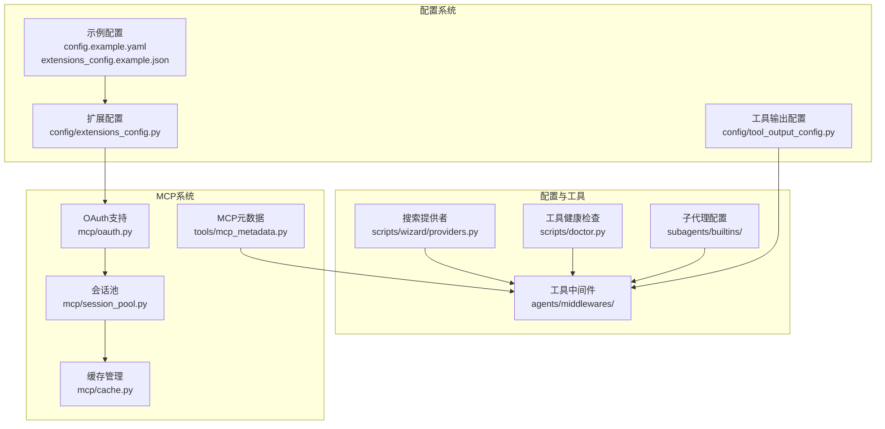
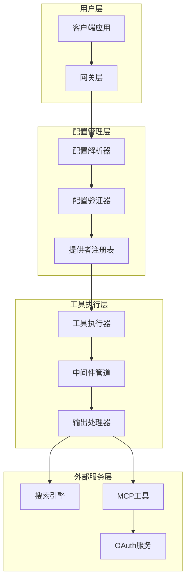
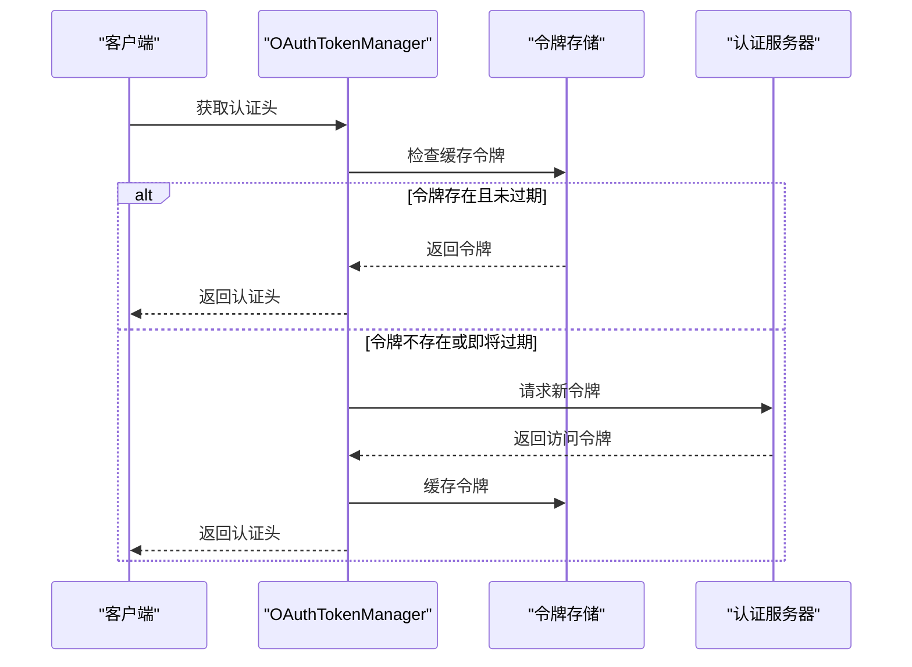
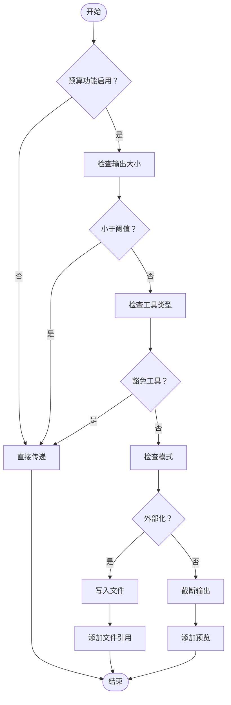
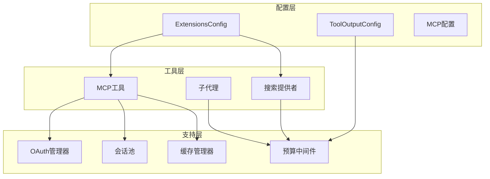
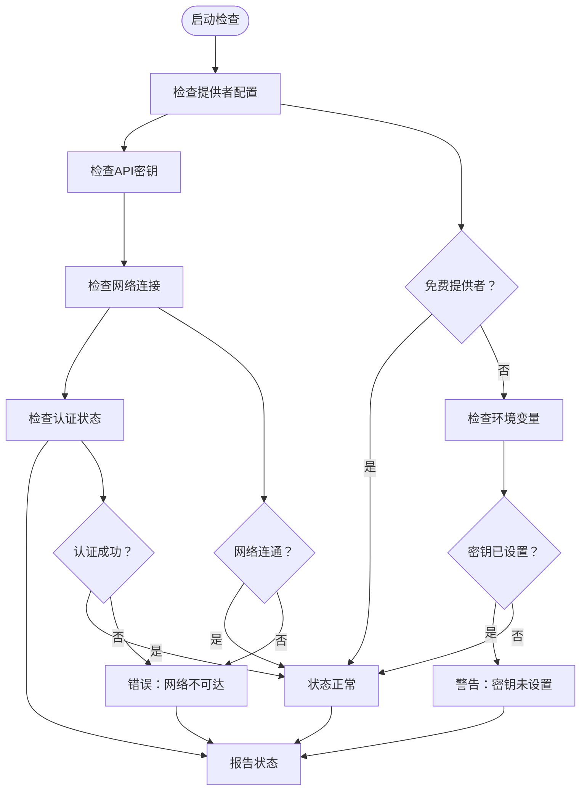

# 外部工具配置

<cite>
**本文档引用的文件**
- [providers.py](file://scripts/wizard/providers.py)
- [doctor.py](file://scripts/doctor.py)
- [oauth.py](file://backend/packages/harness/deerflow/mcp/oauth.py)
- [session_pool.py](file://backend/packages/harness/deerflow/mcp/session_pool.py)
- [cache.py](file://backend/packages/harness/deerflow/mcp/cache.py)
- [tool_output_budget_middleware.py](file://backend/packages/harness/deerflow/agents/middlewares/tool_output_budget_middleware.py)
- [bash_agent.py](file://backend/packages/harness/deerflow/subagents/builtins/bash_agent.py)
- [general_purpose.py](file://backend/packages/harness/deerflow/subagents/builtins/general_purpose.py)
- [__init__.py](file://backend/packages/harness/deerflow/subagents/builtins/__init__.py)
- [extensions_config.py](file://backend/packages/harness/deerflow/config/extensions_config.py)
- [tool_output_config.py](file://backend/packages/harness/deerflow/config/tool_output_config.py)
- [mcp_metadata.py](file://backend/packages/harness/deerflow/tools/mcp_metadata.py)
- [mcp.py](file://backend/app/gateway/routers/mcp.py)
- [mcp_server.md](file://backend/docs/MCP_SERVER_ZH.md)
- [config.example.yaml](file://config.example.yaml)
- [extensions_config.example.json](file://extensions_config.example.json)
</cite>

## 目录
1. [简介](#简介)
2. [项目结构](#项目结构)
3. [核心组件](#核心组件)
4. [架构概览](#架构概览)
5. [详细组件分析](#详细组件分析)
6. [依赖关系分析](#依赖关系分析)
7. [性能考虑](#性能考虑)
8. [故障排除指南](#故障排除指南)
9. [结论](#结论)
10. [附录](#附录)

## 简介
本文件提供deer-flow项目中外部工具配置的完整指南，涵盖第三方搜索引擎集成（DDG、Exa、Firecrawl、InfoQuest、Jina AI、Serper、Tavily）、MCP工具配置、OAuth认证、会话池管理、缓存策略以及工具输出预算、错误处理和性能优化配置。

## 项目结构
外部工具配置主要分布在以下模块：
- 搜索工具提供者定义：`scripts/wizard/providers.py`
- 工具健康检查：`scripts/doctor.py`
- MCP工具链：`backend/packages/harness/deerflow/mcp/`
- 子代理配置：`backend/packages/harness/deerflow/subagents/builtins/`
- 工具输出预算中间件：`backend/packages/harness/deerflow/agents/middlewares/tool_output_budget_middleware.py`
- 扩展配置：`backend/packages/harness/deerflow/config/`

**图表来源**
- [providers.py:468-550](file://scripts/wizard/providers.py#L468-L550)
- [oauth.py:25-150](file://backend/packages/harness/deerflow/mcp/oauth.py#L25-L150)
- [session_pool.py](file://backend/packages/harness/deerflow/mcp/session_pool.py)

**章节来源**
- [providers.py:468-550](file://scripts/wizard/providers.py#L468-L550)
- [doctor.py:469-503](file://scripts/doctor.py#L469-L503)

## 核心组件
本节概述所有外部工具配置的核心组件及其职责。

### 搜索引擎工具配置
项目支持多种搜索引擎，每种都有特定的配置要求：

#### 免费搜索引擎
- **DuckDuckGo (DDG)**：无需API密钥，适合快速搜索
- **Jina AI Reader**：无需API密钥，提供网页内容提取

#### 付费搜索引擎
- **Tavily**：推荐使用，提供免费套餐
- **Exa**：神经网络+关键词混合搜索
- **Firecrawl**：基于Firecrawl API的搜索+抓取
- **InfoQuest**：高质量垂直搜索

每个搜索引擎通过统一的配置接口进行管理，支持自定义参数如结果数量、超时时间等。

### MCP工具系统
MCP（Model Context Protocol）工具提供安全的外部服务集成能力：
- OAuth认证支持
- 会话池管理
- 缓存策略
- 请求拦截器

### 子代理配置
系统提供两种内置子代理：
- **Bash代理**：专门处理命令行任务
- **通用代理**：处理一般性任务

**章节来源**
- [providers.py:468-550](file://scripts/wizard/providers.py#L468-L550)
- [__init__.py:11-15](file://backend/packages/harness/deerflow/subagents/builtins/__init__.py#L11-L15)

## 架构概览
外部工具配置采用分层架构设计，确保可扩展性和安全性：

**图表来源**
- [extensions_config.py](file://backend/packages/harness/deerflow/config/extensions_config.py)
- [mcp.py](file://backend/app/gateway/routers/mcp.py)

## 详细组件分析

### 搜索引擎工具配置详解

#### DDG搜索工具配置
DDG作为免费搜索引擎，配置极其简单：
- 无API密钥需求
- 默认最大结果数：5
- 适用于快速、匿名搜索场景

#### Tavily搜索引擎配置
Tavily提供推荐的搜索体验：
- 支持免费套餐
- 默认最大结果数：5
- 需要设置环境变量：`TAVILY_API_KEY`

#### InfoQuest搜索引擎配置
InfoQuest专注于高质量垂直搜索：
- 需要API密钥
- 环境变量：`INFOQUEST_API_KEY`
- 支持搜索时间范围配置：10秒
- 适用于专业研究场景

#### Exa搜索引擎配置
Exa结合神经网络和关键词搜索：
- 需要API密钥：`EXA_API_KEY`
- 默认最大结果数：5
- 搜索类型自动选择
- 内容字符限制：1000字符
- 适用于深度信息检索

#### Firecrawl搜索引擎配置
Firecrawl提供搜索和抓取功能：
- 需要API密钥：`FIRECRAWL_API_KEY`
- 默认最大结果数：5
- 支持Markdown格式输出
- 适用于内容提取和分析

#### Jina AI网页抓取配置
Jina AI Reader提供网页内容提取：
- 无需API密钥
- 默认超时时间：10秒
- 适用于网页内容快速提取

**章节来源**
- [providers.py:468-550](file://scripts/wizard/providers.py#L468-L550)

### MCP工具配置系统

#### OAuth认证配置
MCP工具支持OAuth 2.0认证，提供令牌管理和刷新机制：

**图表来源**
- [oauth.py:47-65](file://backend/packages/harness/deerflow/mcp/oauth.py#L47-L65)

OAuth配置的关键要素：
- 令牌URL：`token_url`
- 授权类型：`grant_type`
- 客户端凭据：`client_id`、`client_secret`
- 刷新偏移：`refresh_skew_seconds`
- 额外令牌参数：`extra_token_params`

#### 会话池管理
会话池提供连接复用和资源管理：
- 并发连接限制
- 连接超时配置
- 自动重连机制
- 资源清理策略

#### 缓存策略
MCP工具采用多级缓存：
- 令牌缓存（内存）
- 响应缓存（磁盘）
- LRU淘汰策略
- 缓存失效时间

**章节来源**
- [oauth.py:25-150](file://backend/packages/harness/deerflow/mcp/oauth.py#L25-L150)
- [session_pool.py](file://backend/packages/harness/deerflow/mcp/session_pool.py)
- [cache.py](file://backend/packages/harness/deerflow/mcp/cache.py)

### 子代理配置详解

#### Bash代理配置
Bash代理专为命令行操作设计：
- 安全沙箱执行
- 命令白名单
- 输出大小限制
- 超时控制

#### 通用代理配置
通用代理处理多样化任务：
- 自然语言理解
- 多模态输入处理
- 动态工具调用
- 上下文记忆

**章节来源**
- [bash_agent.py](file://backend/packages/harness/deerflow/subagents/builtins/bash_agent.py)
- [general_purpose.py](file://backend/packages/harness/deerflow/subagents/builtins/general_purpose.py)

### 工具输出预算管理

#### 预算中间件工作原理
工具输出预算中间件提供智能的输出管理：

**图表来源**
- [tool_output_budget_middleware.py:484-594](file://backend/packages/harness/deerflow/agents/middlewares/tool_output_budget_middleware.py#L484-L594)

#### 配置参数说明
- `externalize_min_chars`：触发外部化的最小字符数
- `fallback_max_chars`：回退模式的最大字符数
- `preview_head_chars`：预览头部字符数
- `preview_tail_chars`：预览尾部字符数
- `tool_overrides`：特定工具的覆盖配置

**章节来源**
- [tool_output_budget_middleware.py:484-594](file://backend/packages/harness/deerflow/agents/middlewares/tool_output_budget_middleware.py#L484-L594)

## 依赖关系分析

### 组件依赖图
外部工具配置涉及多个层次的依赖关系：

**图表来源**
- [extensions_config.py](file://backend/packages/harness/deerflow/config/extensions_config.py)
- [tool_output_config.py](file://backend/packages/harness/deerflow/config/tool_output_config.py)

### 关键依赖关系
- 配置系统依赖于扩展配置解析器
- 搜索工具依赖于提供者注册表
- MCP工具依赖于OAuth认证和会话管理
- 所有工具都受预算中间件约束

**章节来源**
- [extensions_config.py](file://backend/packages/harness/deerflow/config/extensions_config.py)
- [mcp_metadata.py](file://backend/packages/harness/deerflow/tools/mcp_metadata.py)

## 性能考虑
为确保外部工具配置的最佳性能，建议关注以下方面：

### 缓存优化
- 合理设置令牌缓存过期时间
- 使用LRU缓存策略管理响应数据
- 配置适当的缓存大小限制

### 连接管理
- 优化会话池大小以平衡资源使用
- 实现连接复用减少建立开销
- 设置合理的超时时间避免资源泄露

### 输出处理
- 根据工具特性调整预算阈值
- 使用外部化策略处理大输出
- 实现智能预览生成

## 故障排除指南

### 常见问题诊断
系统提供了完善的健康检查机制：

**图表来源**
- [doctor.py:469-503](file://scripts/doctor.py#L469-L503)

### OAuth认证问题
常见OAuth问题及解决方案：
- 令牌获取失败：检查`token_url`和凭据配置
- 认证头注入失败：验证拦截器配置
- 令牌过期：调整`refresh_skew_seconds`参数

### 工具输出问题
- 输出过大：调整`externalize_min_chars`阈值
- 预览不完整：优化`preview_head_chars`和`preview_tail_chars`
- 性能问题：启用外部化策略处理大输出

**章节来源**
- [doctor.py:469-503](file://scripts/doctor.py#L469-L503)
- [oauth.py:140-150](file://backend/packages/harness/deerflow/mcp/oauth.py#L140-L150)

## 结论
deer-flow的外部工具配置系统提供了完整的第三方服务集成方案。通过统一的配置接口、强大的MCP工具链、智能的预算管理和完善的错误处理机制，系统能够安全高效地集成各种外部工具和服务。建议根据具体使用场景合理配置各项参数，以获得最佳的性能和用户体验。

## 附录

### 配置示例参考
完整的配置示例可在以下文件中找到：
- 主配置示例：`config.example.yaml`
- 扩展配置示例：`extensions_config.example.json`
- MCP服务器文档：`backend/docs/MCP_SERVER_ZH.md`

### 最佳实践建议
1. 优先使用免费提供者进行开发测试
2. 为付费提供者设置合适的API密钥管理
3. 启用并合理配置预算中间件
4. 定期检查OAuth令牌状态
5. 监控工具使用情况和性能指标