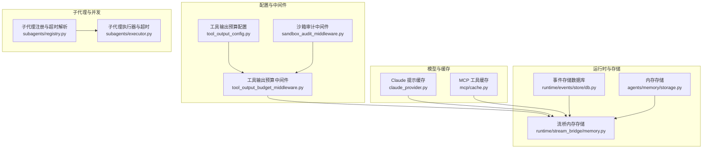
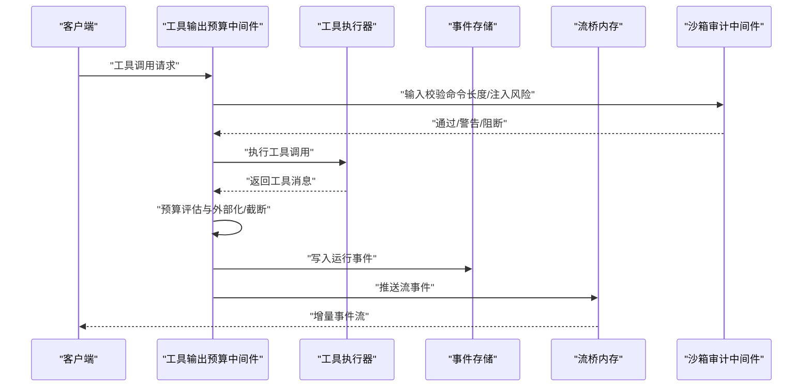
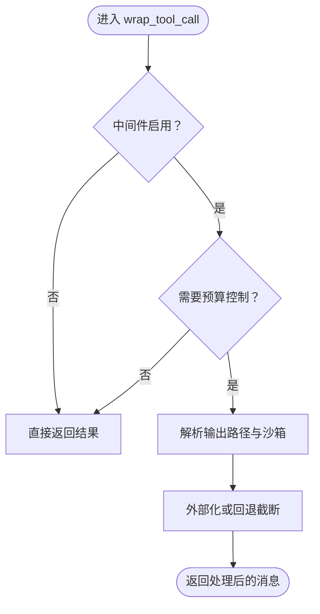
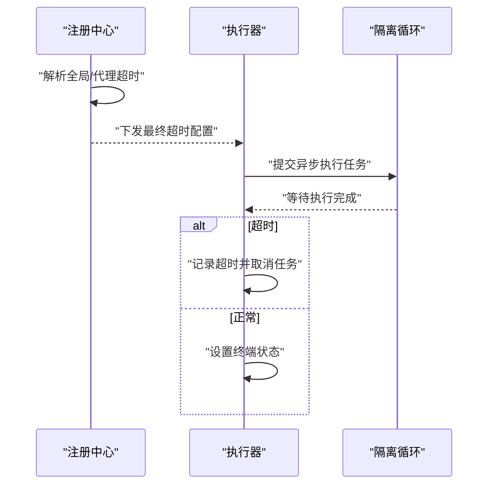
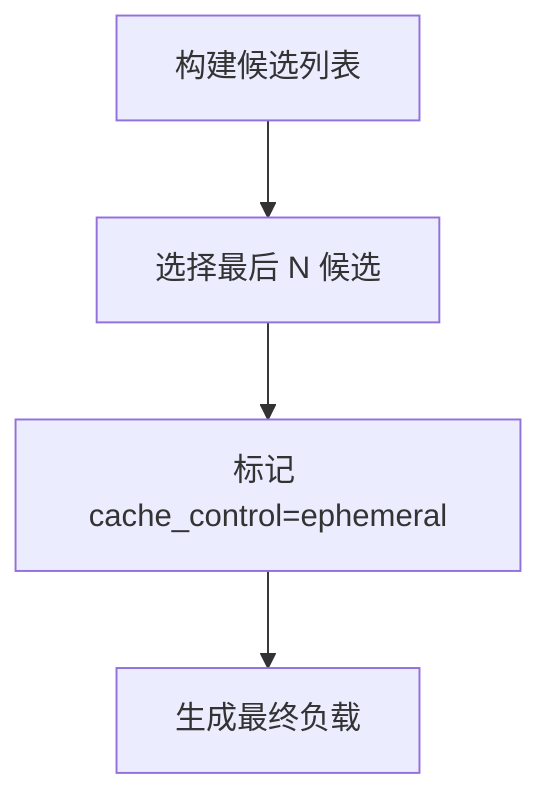
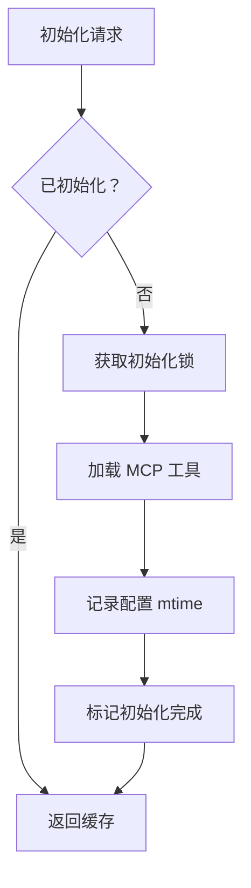
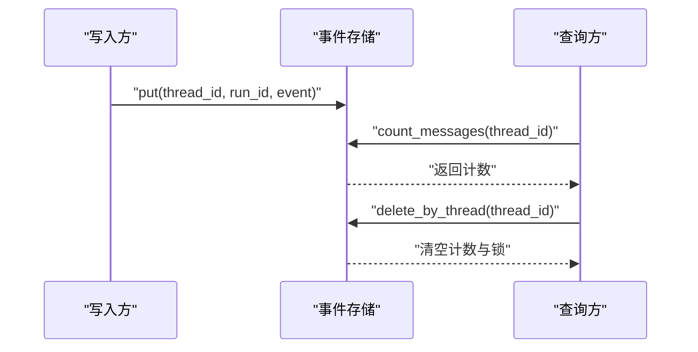
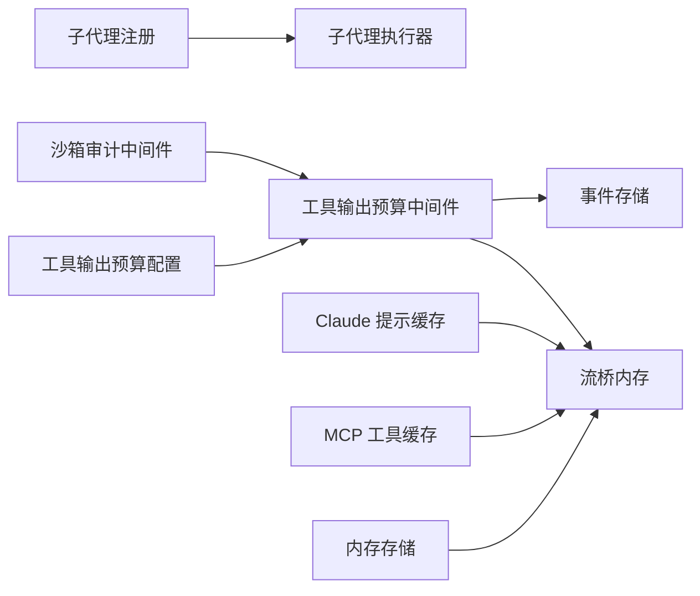

# 工具性能配置

<cite>
**本文引用的文件**
- [tool_output_config.py](file://backend/packages/harness/deerflow/config/tool_output_config.py)
- [tool_output_budget_middleware.py](file://backend/packages/harness/deerflow/agents/middlewares/tool_output_budget_middleware.py)
- [claude_provider.py](file://backend/packages/harness/deerflow/models/claude_provider.py)
- [cache.py](file://backend/packages/harness/deerflow/mcp/cache.py)
- [memory.py](file://backend/packages/harness/deerflow/runtime/stream_bridge/memory.py)
- [db.py](file://backend/packages/harness/deerflow/runtime/events/store/db.py)
- [test_tool_output_budget_middleware.py](file://backend/tests/test_tool_output_budget_middleware.py)
- [test_subagent_timeout_config.py](file://backend/tests/test_subagent_timeout_config.py)
- [test_subagent_limit_middleware.py](file://backend/tests/test_subagent_limit_middleware.py)
- [test_memory_storage.py](file://backend/tests/test_memory_storage.py)
- [test_sandbox_audit_middleware.py](file://backend/tests/test_sandbox_audit_middleware.py)
- [test_claude_provider_prompt_caching.py](file://backend/tests/test_claude_provider_prompt_caching.py)
- [test_run_event_store.py](file://backend/tests/test_run_event_store.py)
- [test_jsonl_event_store_async_io.py](file://backend/tests/test_jsonl_event_store_async_io.py)
- [registry.py](file://backend/packages/harness/deerflow/subagents/registry.py)
- [executor.py](file://backend/packages/harness/deerflow/subagents/executor.py)
- [storage.py](file://backend/packages/harness/deerflow/agents/memory/storage.py)
- [sandbox_audit_middleware.py](file://backend/packages/harness/deerflow/agents/middlewares/sandbox_audit_middleware.py)
</cite>

## 目录
1. [简介](#简介)
2. [项目结构](#项目结构)
3. [核心组件](#核心组件)
4. [架构总览](#架构总览)
5. [详细组件分析](#详细组件分析)
6. [依赖关系分析](#依赖关系分析)
7. [性能考量](#性能考量)
8. [故障排查指南](#故障排查指南)
9. [结论](#结论)
10. [附录](#附录)

## 简介
本文件聚焦于工具执行效率与资源管理的配置与实践，覆盖以下主题：
- 工具输出预算与外部化（磁盘）策略
- 同步/异步执行策略与超时控制
- 内存存储与事件存储的性能优化
- 缓存策略、数据压缩与批量处理
- 并发控制、资源限制与性能监控
- 性能瓶颈识别与优化建议

目标是帮助读者在不深入源码的前提下，理解并正确配置系统以获得稳定、高效且可扩展的工具执行体验。

## 项目结构
围绕“工具性能配置”的相关模块主要分布在后端 harness 包中，涉及配置定义、中间件、运行时桥接、事件存储、子代理执行与缓存等子系统。下图给出与性能配置直接相关的模块关系概览。

图表来源
- [tool_output_config.py:17-62](file://backend/packages/harness/deerflow/config/tool_output_config.py#L17-L62)
- [tool_output_budget_middleware.py:565-594](file://backend/packages/harness/deerflow/agents/middlewares/tool_output_budget_middleware.py#L565-L594)
- [claude_provider.py:223-248](file://backend/packages/harness/deerflow/models/claude_provider.py#L223-L248)
- [cache.py:56-166](file://backend/packages/harness/deerflow/mcp/cache.py#L56-L166)
- [memory.py:106-133](file://backend/packages/harness/deerflow/runtime/stream_bridge/memory.py#L106-L133)
- [db.py:96-115](file://backend/packages/harness/deerflow/runtime/events/store/db.py#L96-L115)
- [registry.py:72-90](file://backend/packages/harness/deerflow/subagents/registry.py#L72-L90)
- [executor.py:792-815](file://backend/packages/harness/deerflow/subagents/executor.py#L792-L815)
- [storage.py:172-214](file://backend/packages/harness/deerflow/agents/memory/storage.py#L172-L214)
- [sandbox_audit_middleware.py:274-303](file://backend/packages/harness/deerflow/agents/middlewares/sandbox_audit_middleware.py#L274-L303)

章节来源
- [tool_output_config.py:17-62](file://backend/packages/harness/deerflow/config/tool_output_config.py#L17-L62)
- [tool_output_budget_middleware.py:565-594](file://backend/packages/harness/deerflow/agents/middlewares/tool_output_budget_middleware.py#L565-L594)
- [claude_provider.py:223-248](file://backend/packages/harness/deerflow/models/claude_provider.py#L223-L248)
- [cache.py:56-166](file://backend/packages/harness/deerflow/mcp/cache.py#L56-L166)
- [memory.py:106-133](file://backend/packages/harness/deerflow/runtime/stream_bridge/memory.py#L106-L133)
- [db.py:96-115](file://backend/packages/harness/deerflow/runtime/events/store/db.py#L96-L115)
- [registry.py:72-90](file://backend/packages/harness/deerflow/subagents/registry.py#L72-L90)
- [executor.py:792-815](file://backend/packages/harness/deerflow/subagents/executor.py#L792-L815)
- [storage.py:172-214](file://backend/packages/harness/deerflow/agents/memory/storage.py#L172-L214)
- [sandbox_audit_middleware.py:274-303](file://backend/packages/harness/deerflow/agents/middlewares/sandbox_audit_middleware.py#L274-L303)

## 核心组件
- 工具输出预算配置与中间件：通过配置项控制工具输出的字符阈值、预览截断、回退策略与磁盘外部化路径，避免过大的输出占用内存或导致序列化开销过大。
- 子代理超时与并发限制：提供全局与按代理的超时配置、轮询上限计算公式，以及并发上限的夹紧策略，保障长任务的可控性与稳定性。
- 模型提示缓存：对 Claude 的消息块与工具定义进行“最后 N 候选”缓存标记，减少重复 token 消耗。
- MCP 工具缓存：应用启动时初始化并缓存 MCP 工具列表，支持懒加载与配置变更检测，避免重复初始化带来的性能损耗。
- 运行时事件存储与流桥内存：提供事件写入、计数与并发删除的异步 IO 能力，以及内存流桥的条件等待与心跳机制，支撑高吞吐场景。
- 内存存储与安全审计：文件内存存储的线程安全缓存与落盘保护；沙箱命令长度与注入风险的输入校验，降低执行风险与资源浪费。

章节来源
- [tool_output_config.py:17-62](file://backend/packages/harness/deerflow/config/tool_output_config.py#L17-L62)
- [tool_output_budget_middleware.py:565-594](file://backend/packages/harness/deerflow/agents/middlewares/tool_output_budget_middleware.py#L565-L594)
- [test_tool_output_budget_middleware.py:302-564](file://backend/tests/test_tool_output_budget_middleware.py#L302-L564)
- [test_subagent_timeout_config.py:115-572](file://backend/tests/test_subagent_timeout_config.py#L115-L572)
- [test_subagent_limit_middleware.py:38-50](file://backend/tests/test_subagent_limit_middleware.py#L38-L50)
- [claude_provider.py:223-248](file://backend/packages/harness/deerflow/models/claude_provider.py#L223-L248)
- [cache.py:56-166](file://backend/packages/harness/deerflow/mcp/cache.py#L56-L166)
- [memory.py:106-133](file://backend/packages/harness/deerflow/runtime/stream_bridge/memory.py#L106-L133)
- [db.py:96-115](file://backend/packages/harness/deerflow/runtime/events/store/db.py#L96-L115)
- [storage.py:172-214](file://backend/packages/harness/deerflow/agents/memory/storage.py#L172-L214)
- [sandbox_audit_middleware.py:274-303](file://backend/packages/harness/deerflow/agents/middlewares/sandbox_audit_middleware.py#L274-L303)

## 架构总览
下图展示工具执行链路中的关键性能配置点：从请求进入中间件，到工具执行、输出预算控制、事件存储与流桥内存，再到子代理超时与并发限制。

图表来源
- [tool_output_budget_middleware.py:581-594](file://backend/packages/harness/deerflow/agents/middlewares/tool_output_budget_middleware.py#L581-L594)
- [sandbox_audit_middleware.py:294-303](file://backend/packages/harness/deerflow/agents/middlewares/sandbox_audit_middleware.py#L294-L303)
- [memory.py:106-133](file://backend/packages/harness/deerflow/runtime/stream_bridge/memory.py#L106-L133)
- [db.py:114-115](file://backend/packages/harness/deerflow/runtime/events/store/db.py#L114-L115)

## 详细组件分析

### 工具输出预算与外部化（磁盘）
- 配置要点
  - 启用开关：是否启用预算中间件
  - 外部化阈值：超过该字符数触发磁盘外部化
  - 预览截断：保留头部与尾部字符用于预览
  - 回退策略：当无法持久化到磁盘时的最大字符数与头尾截断
  - 存储目录：工具结果保存的子目录
  - 免除名单：某些工具（如文件读取）免于预算强制，避免“持久化→读取→再持久化”的循环
  - 单工具覆盖：为特定工具单独设置外部化阈值
- 行为验证
  - 禁用中间件时直通
  - 外部化到磁盘并生成读取提示
  - 中文内容完整保存
  - 无运行时状态时走回退截断
  - 单工具覆盖优先级高于全局阈值

图表来源
- [tool_output_budget_middleware.py:581-594](file://backend/packages/harness/deerflow/agents/middlewares/tool_output_budget_middleware.py#L581-L594)
- [test_tool_output_budget_middleware.py:302-564](file://backend/tests/test_tool_output_budget_middleware.py#L302-L564)
- [test_tool_output_budget_middleware.py:799-821](file://backend/tests/test_tool_output_budget_middleware.py#L799-L821)

章节来源
- [tool_output_config.py:17-62](file://backend/packages/harness/deerflow/config/tool_output_config.py#L17-L62)
- [tool_output_budget_middleware.py:565-594](file://backend/packages/harness/deerflow/agents/middlewares/tool_output_budget_middleware.py#L565-L594)
- [test_tool_output_budget_middleware.py:302-564](file://backend/tests/test_tool_output_budget_middleware.py#L302-L564)
- [test_tool_output_budget_middleware.py:799-821](file://backend/tests/test_tool_output_budget_middleware.py#L799-L821)

### 子代理执行超时与并发控制
- 超时配置
  - 全局默认与按代理覆盖：内置代理可受全局覆盖，自定义代理保持自身默认
  - 轮询上限计算：基于超时秒数推导最大轮询次数，确保轮询窗口大于执行超时
  - 执行器超时：在隔离循环中提交执行，超时后记录并取消
- 并发限制
  - 并发上限夹紧：确保最小与最大并发数在合理区间内

图表来源
- [registry.py:72-90](file://backend/packages/harness/deerflow/subagents/registry.py#L72-L90)
- [executor.py:792-815](file://backend/packages/harness/deerflow/subagents/executor.py#L792-L815)
- [test_subagent_timeout_config.py:538-572](file://backend/tests/test_subagent_timeout_config.py#L538-L572)
- [test_subagent_limit_middleware.py:38-50](file://backend/tests/test_subagent_limit_middleware.py#L38-L50)

章节来源
- [registry.py:72-90](file://backend/packages/harness/deerflow/subagents/registry.py#L72-L90)
- [executor.py:792-815](file://backend/packages/harness/deerflow/subagents/executor.py#L792-L815)
- [test_subagent_timeout_config.py:115-572](file://backend/tests/test_subagent_timeout_config.py#L115-L572)
- [test_subagent_limit_middleware.py:38-50](file://backend/tests/test_subagent_limit_middleware.py#L38-L50)

### 模型提示缓存（Claude）
- 适用范围：系统消息、最近消息块、最后工具定义
- 缓存策略：仅对“最后 N 候选”应用缓存标记，避免超出 API 限额
- 测试验证：断言缓存断点数量不超过上限，且断点放置在最后候选

图表来源
- [claude_provider.py:223-248](file://backend/packages/harness/deerflow/models/claude_provider.py#L223-L248)
- [test_claude_provider_prompt_caching.py:124-221](file://backend/tests/test_claude_provider_prompt_caching.py#L124-L221)

章节来源
- [claude_provider.py:223-248](file://backend/packages/harness/deerflow/models/claude_provider.py#L223-L248)
- [test_claude_provider_prompt_caching.py:124-221](file://backend/tests/test_claude_provider_prompt_caching.py#L124-L221)

### MCP 工具缓存
- 初始化策略：应用启动时一次性初始化并缓存 MCP 工具列表
- 懒加载：未初始化时自动初始化，兼容不同运行环境
- 变更检测：检测配置文件修改时间，必要时重置缓存并重建会话池
- 线程/循环安全：在运行循环中采用线程池策略，避免死锁

图表来源
- [cache.py:56-166](file://backend/packages/harness/deerflow/mcp/cache.py#L56-L166)

章节来源
- [cache.py:56-166](file://backend/packages/harness/deerflow/mcp/cache.py#L56-L166)

### 事件存储与流桥内存
- 事件存储
  - 写入：低频路径，单条事件写入
  - 计数：并发写入场景下保证计数准确
  - 删除：按线程或按运行清理，释放序列计数与写锁
  - 数据库适配：PostgreSQL 使用事务级 advisory lock 保证一致性
- 流桥内存
  - 条件等待与心跳：在无事件时按心跳间隔等待，避免忙轮询
  - 清理：延迟清理运行级流与计数器

图表来源
- [db.py:96-115](file://backend/packages/harness/deerflow/runtime/events/store/db.py#L96-L115)
- [test_run_event_store.py:20-40](file://backend/tests/test_run_event_store.py#L20-L40)
- [test_jsonl_event_store_async_io.py:167-199](file://backend/tests/test_jsonl_event_store_async_io.py#L167-L199)

章节来源
- [memory.py:106-133](file://backend/packages/harness/deerflow/runtime/stream_bridge/memory.py#L106-L133)
- [db.py:96-115](file://backend/packages/harness/deerflow/runtime/events/store/db.py#L96-L115)
- [test_run_event_store.py:1-40](file://backend/tests/test_run_event_store.py#L1-L40)
- [test_jsonl_event_store_async_io.py:167-199](file://backend/tests/test_jsonl_event_store_async_io.py#L167-L199)

### 内存存储与安全审计
- 文件内存存储
  - 线程安全：缓存与落盘保护，失败时不污染缓存
  - 动态实例化：根据配置类路径动态导入存储实现
- 沙箱审计
  - 输入校验：命令长度、空字节、空命令等
  - 安全指标：基准测试中高风险阻断率、中风险告警率与零误报

章节来源
- [storage.py:172-214](file://backend/packages/harness/deerflow/agents/memory/storage.py#L172-L214)
- [test_memory_storage.py:143-173](file://backend/tests/test_memory_storage.py#L143-L173)
- [sandbox_audit_middleware.py:274-303](file://backend/packages/harness/deerflow/agents/middlewares/sandbox_audit_middleware.py#L274-L303)
- [test_sandbox_audit_middleware.py:704-716](file://backend/tests/test_sandbox_audit_middleware.py#L704-L716)

## 依赖关系分析
- 组件耦合
  - 工具输出预算中间件依赖配置模块与运行时上下文（输出路径、沙箱）
  - 子代理执行器依赖注册中心提供的最终超时配置
  - 流桥内存与事件存储共同服务于运行时事件的高吞吐传输与持久化
  - MCP 工具缓存与会话池解耦，便于独立演进与测试
- 外部依赖
  - 数据库方言差异（如 PostgreSQL 的 advisory lock）
  - 异步事件存储的并发控制（锁与计数器）

图表来源
- [tool_output_config.py:17-62](file://backend/packages/harness/deerflow/config/tool_output_config.py#L17-L62)
- [tool_output_budget_middleware.py:565-594](file://backend/packages/harness/deerflow/agents/middlewares/tool_output_budget_middleware.py#L565-L594)
- [memory.py:106-133](file://backend/packages/harness/deerflow/runtime/stream_bridge/memory.py#L106-L133)
- [db.py:96-115](file://backend/packages/harness/deerflow/runtime/events/store/db.py#L96-L115)
- [registry.py:72-90](file://backend/packages/harness/deerflow/subagents/registry.py#L72-L90)
- [executor.py:792-815](file://backend/packages/harness/deerflow/subagents/executor.py#L792-L815)
- [claude_provider.py:223-248](file://backend/packages/harness/deerflow/models/claude_provider.py#L223-L248)
- [cache.py:56-166](file://backend/packages/harness/deerflow/mcp/cache.py#L56-L166)
- [storage.py:172-214](file://backend/packages/harness/deerflow/agents/memory/storage.py#L172-L214)
- [sandbox_audit_middleware.py:274-303](file://backend/packages/harness/deerflow/agents/middlewares/sandbox_audit_middleware.py#L274-L303)

## 性能考量
- 工具输出预算
  - 合理设置外部化阈值，避免频繁磁盘 IO；对大文本工具（如搜索引擎、日志检索）建议降低阈值并开启预览截断
  - 对高频读取工具（如文件读取）加入免除名单，减少不必要的外部化与 IO
  - 在无运行时状态时启用回退截断，确保系统可用性
- 子代理超时与并发
  - 根据任务复杂度设置合理的全局超时，并为长任务代理单独覆盖
  - 轮询上限公式确保轮询窗口大于执行超时，避免误判
  - 并发上限夹紧防止过度并发导致资源争用
- 模型提示缓存
  - 控制“最后 N 候选”数量，避免超出 API 限额；优先缓存最近消息与工具定义
- MCP 工具缓存
  - 应用启动时一次性初始化，避免重复扫描与连接
  - 配置变更时自动重置缓存，确保网关嵌入式运行时也能及时反映更新
- 事件存储与流桥
  - 并发写入场景下使用写锁与计数器，保证计数准确性
  - 心跳与条件等待降低空闲等待的 CPU 占用
- 内存存储与安全
  - 文件内存存储失败保护，避免缓存污染
  - 沙箱命令长度与注入检测，降低恶意输入带来的资源消耗

[本节为通用指导，无需列出具体文件来源]

## 故障排查指南
- 工具输出预算未生效
  - 检查中间件是否启用、阈值设置是否合理、工具是否在免除名单中
  - 观察磁盘外部化目录是否存在，确认文件编码与完整性
- 子代理执行超时
  - 核对全局与代理超时配置，确认轮询上限计算是否符合预期
  - 查看执行器日志中的超时记录与取消行为
- 事件存储异常
  - 并发写入计数不一致：检查写锁与计数器清理逻辑
  - PostgreSQL 方言：确认 advisory lock 是否成功获取
- 流桥内存卡顿
  - 检查心跳间隔与条件等待超时，避免过短导致忙轮询
  - 确认运行清理延迟是否合适
- 内存存储失败
  - 落盘失败不应污染缓存，检查错误日志与缓存一致性
- 沙箱命令被阻断
  - 检查命令长度、空字节与空命令等规则，必要时调整安全策略

章节来源
- [test_tool_output_budget_middleware.py:302-564](file://backend/tests/test_tool_output_budget_middleware.py#L302-L564)
- [test_subagent_timeout_config.py:538-572](file://backend/tests/test_subagent_timeout_config.py#L538-L572)
- [test_run_event_store.py:20-40](file://backend/tests/test_run_event_store.py#L20-L40)
- [test_jsonl_event_store_async_io.py:167-199](file://backend/tests/test_jsonl_event_store_async_io.py#L167-L199)
- [memory.py:106-133](file://backend/packages/harness/deerflow/runtime/stream_bridge/memory.py#L106-L133)
- [storage.py:172-214](file://backend/packages/harness/deerflow/agents/memory/storage.py#L172-L214)
- [sandbox_audit_middleware.py:274-303](file://backend/packages/harness/deerflow/agents/middlewares/sandbox_audit_middleware.py#L274-L303)

## 结论
通过上述配置与机制，系统在工具执行效率与资源管理方面实现了多维度优化：输出预算与外部化控制内存与 IO 开销；子代理超时与并发限制保障长任务的可控性；提示缓存与 MCP 工具缓存降低 token 与初始化成本；事件存储与流桥内存提供高吞吐与低延迟的运行时支撑；内存存储与安全审计提升稳定性与安全性。结合本文的配置建议与故障排查方法，可在生产环境中获得稳定、高效且可扩展的工具执行体验。

[本节为总结性内容，无需列出具体文件来源]

## 附录
- 配置建议清单
  - 工具输出预算：根据工具类型设定外部化阈值与预览截断；对高频读取工具加入免除名单；启用回退截断以防磁盘不可用
  - 子代理超时：为长任务代理设置较小超时并配合轮询上限；并发上限夹紧至合理区间
  - 提示缓存：控制“最后 N 候选”数量，优先缓存最近消息与工具定义
  - MCP 工具缓存：应用启动时初始化，配置变更时自动重置
  - 事件存储：并发写入场景下使用写锁与计数器；PostgreSQL 使用 advisory lock
  - 流桥内存：合理设置心跳间隔与清理延迟
  - 内存存储：失败保护与线程安全；沙箱命令长度与注入检测

[本节为通用指导，无需列出具体文件来源]