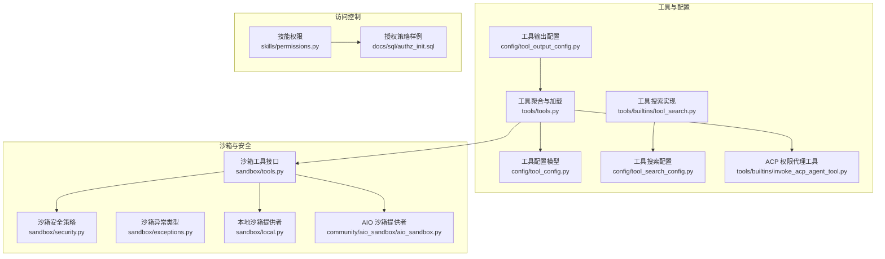
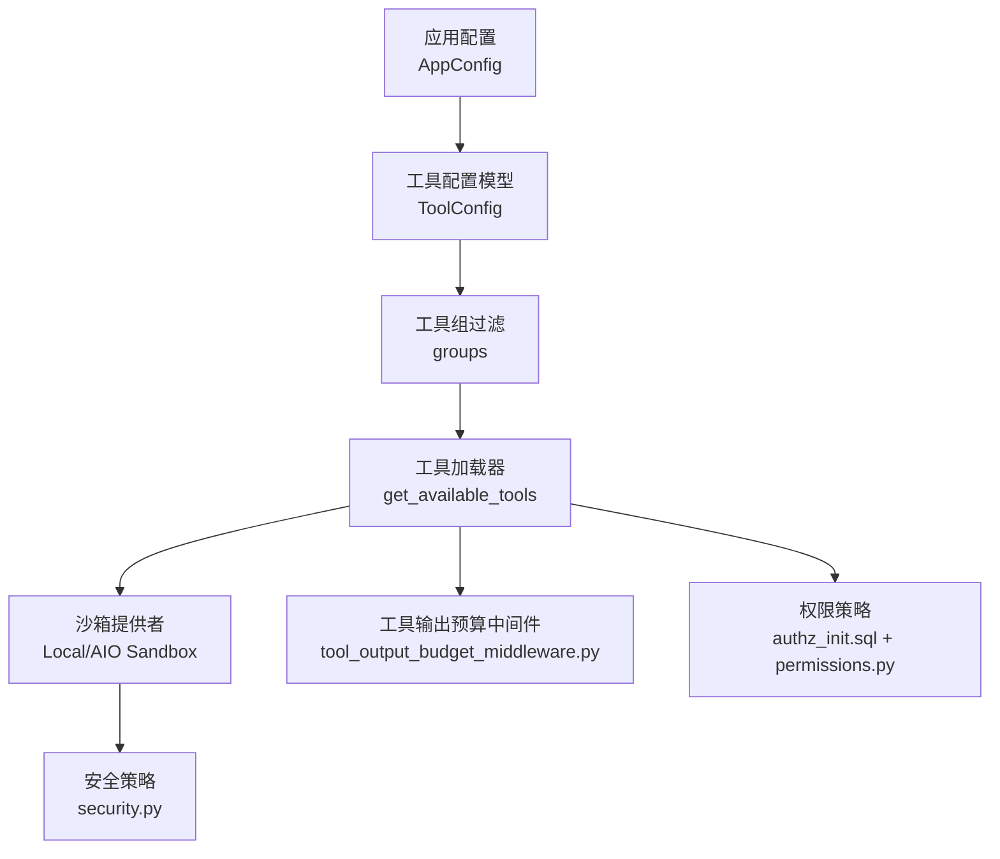
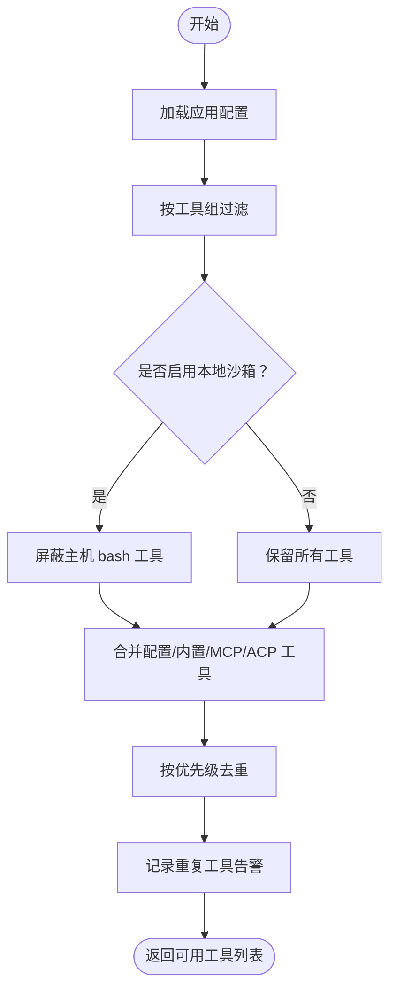
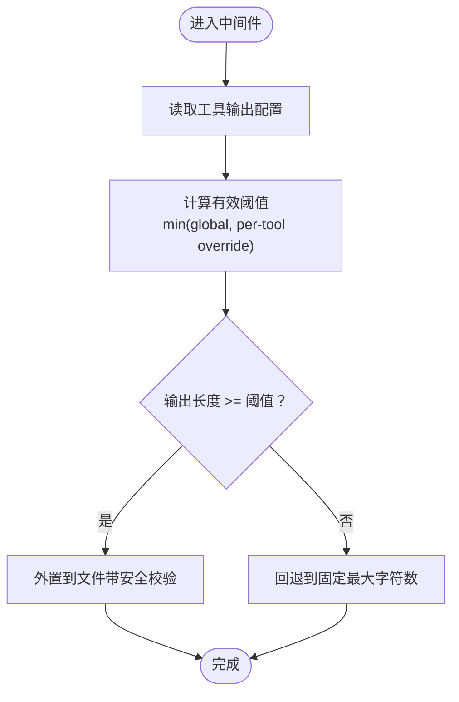
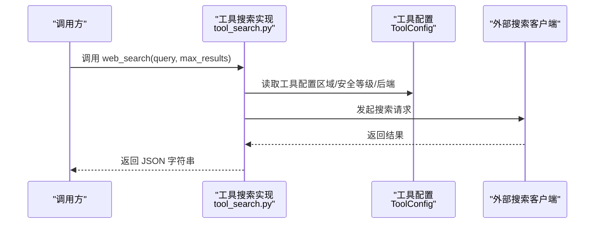
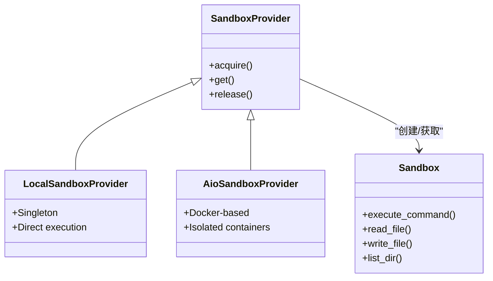
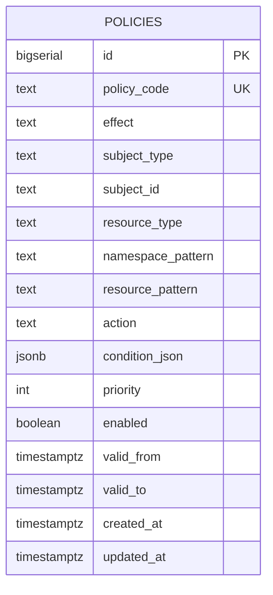
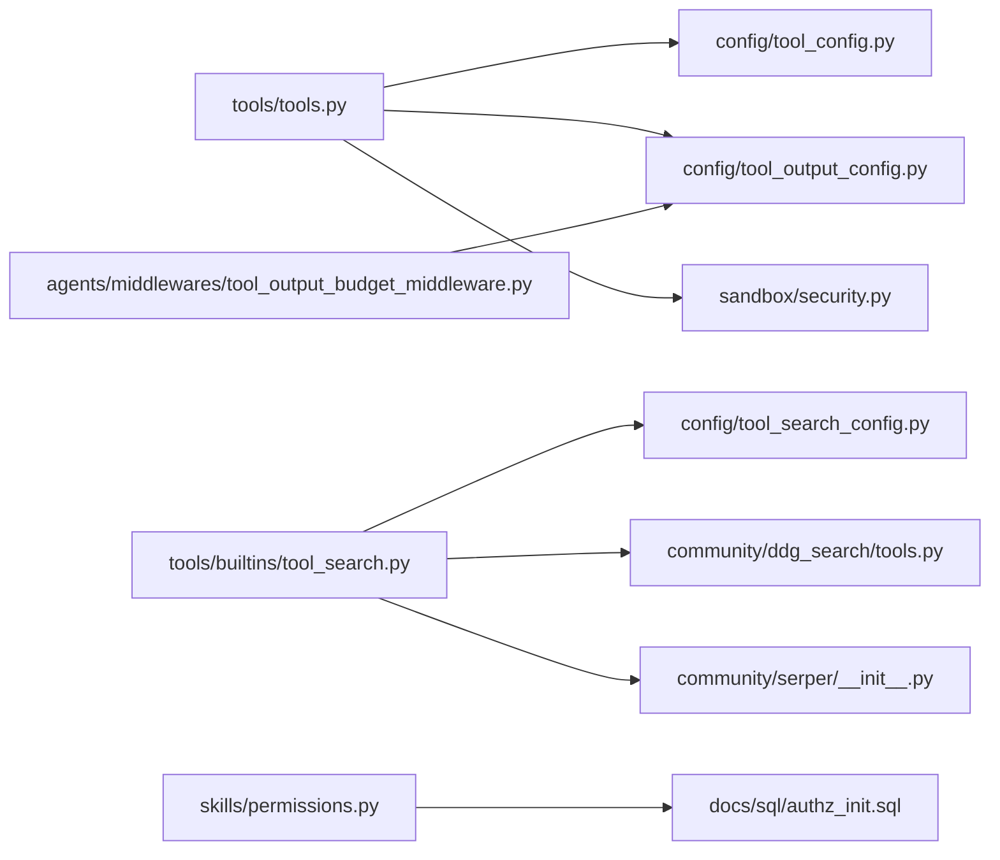

# 工具配置

<cite>
**本文引用的文件**
- [backend/packages/harness/deerflow/tools/tools.py](file://backend/packages/harness/deerflow/tools/tools.py)
- [backend/packages/harness/deerflow/config/tool_config.py](file://backend/packages/harness/deerflow/config/tool_config.py)
- [backend/packages/harness/deerflow/config/tool_output_config.py](file://backend/packages/harness/deerflow/config/tool_output_config.py)
- [backend/packages/harness/deerflow/agents/middlewares/tool_output_budget_middleware.py](file://backend/packages/harness/deerflow/agents/middlewares/tool_output_budget_middleware.py)
- [backend/packages/harness/deerflow/config/tool_search_config.py](file://backend/packages/harness/deerflow/config/tool_search_config.py)
- [backend/packages/harness/deerflow/tools/builtins/tool_search.py](file://backend/packages/harness/deerflow/tools/builtins/tool_search.py)
- [backend/packages/harness/deerflow/sandbox/tools.py](file://backend/packages/harness/deerflow/sandbox/tools.py)
- [backend/packages/harness/deerflow/sandbox/security.py](file://backend/packages/harness/deerflow/sandbox/security.py)
- [backend/packages/harness/deerflow/sandbox/exceptions.py](file://backend/packages/harness/deerflow/sandbox/exceptions.py)
- [backend/packages/harness/deerflow/sandbox/local.py](file://backend/packages/harness/deerflow/sandbox/local.py)
- [backend/packages/harness/deerflow/community/aio_sandbox/aio_sandbox.py](file://backend/packages/harness/deerflow/community/aio_sandbox/aio_sandbox.py)
- [backend/docs/ARCHITECTURE.md](file://backend/docs/ARCHITECTURE.md)
- [backend/packages/harness/deerflow/skills/permissions.py](file://backend/packages/harness/deerflow/skills/permissions.py)
- [docs/sql/authz_init.sql](file://docs/sql/authz_init.sql)
- [backend/tests/test_tool_output_budget_middleware.py](file://backend/tests/test_tool_output_budget_middleware.py)
- [backend/tests/test_tool_deduplication.py](file://backend/tests/test_tool_deduplication.py)
- [backend/packages/harness/deerflow/community/ddg_search/tools.py](file://backend/packages/harness/deerflow/community/ddg_search/tools.py)
- [backend/packages/harness/deerflow/community/serper/__init__.py](file://backend/packages/harness/deerflow/community/serper/__init__.py)
- [backend/packages/harness/deerflow/tools/builtins/invoke_acp_agent_tool.py](file://backend/packages/harness/deerflow/tools/builtins/invoke_acp_agent_tool.py)
</cite>

## 目录
1. [简介](#简介)
2. [项目结构](#项目结构)
3. [核心组件](#核心组件)
4. [架构总览](#架构总览)
5. [详细组件分析](#详细组件分析)
6. [依赖关系分析](#依赖关系分析)
7. [性能考量](#性能考量)
8. [故障排查指南](#故障排查指南)
9. [结论](#结论)
10. [附录](#附录)

## 简介
本指南面向系统管理员与平台开发者，系统性阐述 deer-flow 的工具配置体系，覆盖内置工具与外部工具（如网络搜索）的配置方法；解释工具组管理、访问控制与权限策略；提供工具搜索配置、延迟加载机制、输出预算保护等高级能力的配置要点，并给出自定义工具开发与集成的最佳实践。

## 项目结构
与工具配置直接相关的模块主要集中在后端 harness 包中，包括：
- 工具注册与可用工具聚合：tools/tools.py
- 工具配置模型：config/tool_config.py
- 工具输出预算与截断：config/tool_output_config.py、agents/middlewares/tool_output_budget_middleware.py
- 工具搜索与检索：config/tool_search_config.py、tools/builtins/tool_search.py
- 沙箱与安全：sandbox/tools.py、sandbox/security.py、sandbox/exceptions.py、sandbox/local.py、community/aio_sandbox/aio_sandbox.py
- 访问控制与权限：skills/permissions.py、docs/sql/authz_init.sql
- 外部搜索工具示例：community/ddg_search/tools.py、community/serper/__init__.py
- ACP 工具调用与权限响应：tools/builtins/invoke_acp_agent_tool.py

图表来源
- [backend/packages/harness/deerflow/tools/tools.py:44-176](file://backend/packages/harness/deerflow/tools/tools.py#L44-L176)
- [backend/packages/harness/deerflow/config/tool_config.py](file://backend/packages/harness/deerflow/config/tool_config.py)
- [backend/packages/harness/deerflow/config/tool_output_config.py](file://backend/packages/harness/deerflow/config/tool_output_config.py)
- [backend/packages/harness/deerflow/config/tool_search_config.py](file://backend/packages/harness/deerflow/config/tool_search_config.py)
- [backend/packages/harness/deerflow/tools/builtins/tool_search.py](file://backend/packages/harness/deerflow/tools/builtins/tool_search.py)
- [backend/packages/harness/deerflow/sandbox/tools.py](file://backend/packages/harness/deerflow/sandbox/tools.py)
- [backend/packages/harness/deerflow/sandbox/security.py](file://backend/packages/harness/deerflow/sandbox/security.py)
- [backend/packages/harness/deerflow/sandbox/exceptions.py:31-71](file://backend/packages/harness/deerflow/sandbox/exceptions.py#L31-L71)
- [backend/packages/harness/deerflow/sandbox/local.py](file://backend/packages/harness/deerflow/sandbox/local.py)
- [backend/packages/harness/deerflow/community/aio_sandbox/aio_sandbox.py:140-337](file://backend/packages/harness/deerflow/community/aio_sandbox/aio_sandbox.py#L140-L337)
- [backend/packages/harness/deerflow/skills/permissions.py](file://backend/packages/harness/deerflow/skills/permissions.py)
- [docs/sql/authz_init.sql:75-231](file://docs/sql/authz_init.sql#L75-L231)

章节来源
- [backend/packages/harness/deerflow/tools/tools.py:44-176](file://backend/packages/harness/deerflow/tools/tools.py#L44-L176)
- [backend/docs/ARCHITECTURE.md:147-180](file://backend/docs/ARCHITECTURE.md#L147-L180)

## 核心组件
- 工具聚合与加载：从应用配置中筛选工具、按组过滤、屏蔽主机 bash（在本地沙箱模式下）、去重优先级策略、返回可用工具列表。
- 工具配置模型：定义工具条目、组、启用状态、参数与元数据等字段，支持从配置文件解析为运行时对象。
- 工具输出预算与中间件：根据全局阈值与每工具覆盖项，动态决定是否外置存储或触发回退限制，保障内存与传输安全。
- 工具搜索：统一的搜索入口，支持从配置读取区域、安全等级、后端等参数，封装第三方搜索实现。
- 沙箱与安全：抽象出沙箱提供者与工具接口，提供命令执行、文件读写、目录遍历等能力，并内置异常类型与安全策略。
- 访问控制与权限：基于角色与资源的策略表，结合 ABAC 条件，实现对工具执行、读写、搜索等动作的细粒度控制。

章节来源
- [backend/packages/harness/deerflow/tools/tools.py:44-176](file://backend/packages/harness/deerflow/tools/tools.py#L44-L176)
- [backend/packages/harness/deerflow/config/tool_config.py](file://backend/packages/harness/deerflow/config/tool_config.py)
- [backend/packages/harness/deerflow/config/tool_output_config.py](file://backend/packages/harness/deerflow/config/tool_output_config.py)
- [backend/packages/harness/deerflow/agents/middlewares/tool_output_budget_middleware.py](file://backend/packages/harness/deerflow/agents/middlewares/tool_output_budget_middleware.py)
- [backend/packages/harness/deerflow/config/tool_search_config.py](file://backend/packages/harness/deerflow/config/tool_search_config.py)
- [backend/packages/harness/deerflow/tools/builtins/tool_search.py](file://backend/packages/harness/deerflow/tools/builtins/tool_search.py)
- [backend/packages/harness/deerflow/sandbox/tools.py](file://backend/packages/harness/deerflow/sandbox/tools.py)
- [backend/packages/harness/deerflow/sandbox/security.py](file://backend/packages/harness/deerflow/sandbox/security.py)
- [backend/packages/harness/deerflow/sandbox/exceptions.py:31-71](file://backend/packages/harness/deerflow/sandbox/exceptions.py#L31-L71)
- [backend/packages/harness/deerflow/sandbox/local.py](file://backend/packages/harness/deerflow/sandbox/local.py)
- [backend/packages/harness/deerflow/community/aio_sandbox/aio_sandbox.py:140-337](file://backend/packages/harness/deerflow/community/aio_sandbox/aio_sandbox.py#L140-L337)
- [backend/packages/harness/deerflow/skills/permissions.py](file://backend/packages/harness/deerflow/skills/permissions.py)
- [docs/sql/authz_init.sql:75-231](file://docs/sql/authz_init.sql#L75-L231)

## 架构总览
下图展示工具配置在系统中的位置与交互关系，包括配置解析、工具加载、沙箱执行与权限控制的关键节点。

图表来源
- [backend/packages/harness/deerflow/tools/tools.py:44-176](file://backend/packages/harness/deerflow/tools/tools.py#L44-L176)
- [backend/packages/harness/deerflow/config/tool_config.py](file://backend/packages/harness/deerflow/config/tool_config.py)
- [backend/packages/harness/deerflow/agents/middlewares/tool_output_budget_middleware.py](file://backend/packages/harness/deerflow/agents/middlewares/tool_output_budget_middleware.py)
- [backend/packages/harness/deerflow/sandbox/security.py](file://backend/packages/harness/deerflow/sandbox/security.py)
- [docs/sql/authz_init.sql:75-231](file://docs/sql/authz_init.sql#L75-L231)

## 详细组件分析

### 工具聚合与加载（工具组管理、去重与访问控制）
- 组过滤：通过 groups 参数仅返回匹配的工具组。
- 主机 bash 屏蔽：当使用本地沙箱提供者时，默认屏蔽主机 bash 工具，避免越权执行。
- 去重策略：按“配置加载工具 > 内置工具 > MCP 工具 > ACP 工具”的优先级去重，重复名称会记录警告日志。
- 返回清单：统计内置、MCP、ACP 工具数量，便于运维观察。

图表来源
- [backend/packages/harness/deerflow/tools/tools.py:44-176](file://backend/packages/harness/deerflow/tools/tools.py#L44-L176)

章节来源
- [backend/packages/harness/deerflow/tools/tools.py:44-176](file://backend/packages/harness/deerflow/tools/tools.py#L44-L176)
- [backend/tests/test_tool_deduplication.py:170-200](file://backend/tests/test_tool_deduplication.py#L170-L200)

### 工具输出预算与中间件（输出预算保护）
- 触发条件：全局 externalize_min_chars 与 per-tool 覆盖项共同决定何时将工具输出外置到文件，以及回退最大字符数。
- per-tool 覆盖优先：若某工具设置为 0，则禁用外置，仅依赖回退阈值。
- 测试验证：包含对无效路径、未知工具扩展名、路径穿越防护等场景的测试，确保安全与稳定性。

图表来源
- [backend/packages/harness/deerflow/agents/middlewares/tool_output_budget_middleware.py](file://backend/packages/harness/deerflow/agents/middlewares/tool_output_budget_middleware.py)
- [backend/packages/harness/deerflow/config/tool_output_config.py](file://backend/packages/harness/deerflow/config/tool_output_config.py)
- [backend/tests/test_tool_output_budget_middleware.py:799-821](file://backend/tests/test_tool_output_budget_middleware.py#L799-L821)
- [backend/tests/test_tool_output_budget_middleware.py:123-203](file://backend/tests/test_tool_output_budget_middleware.py#L123-L203)

章节来源
- [backend/packages/harness/deerflow/agents/middlewares/tool_output_budget_middleware.py](file://backend/packages/harness/deerflow/agents/middlewares/tool_output_budget_middleware.py)
- [backend/packages/harness/deerflow/config/tool_output_config.py](file://backend/packages/harness/deerflow/config/tool_output_config.py)
- [backend/tests/test_tool_output_budget_middleware.py:799-821](file://backend/tests/test_tool_output_budget_middleware.py#L799-L821)
- [backend/tests/test_tool_output_budget_middleware.py:123-203](file://backend/tests/test_tool_output_budget_middleware.py#L123-L203)

### 工具搜索配置与实现（网络搜索工具）
- 配置项：支持从工具配置中读取区域、安全搜索等级、后端等参数，覆盖默认值。
- 实现：封装第三方搜索客户端（如 DDG、Serper），统一返回 JSON 结构。
- 示例：DDG 与 Serper 提供导出的 web_search_tool，可直接在工具集中使用。

图表来源
- [backend/packages/harness/deerflow/tools/builtins/tool_search.py](file://backend/packages/harness/deerflow/tools/builtins/tool_search.py)
- [backend/packages/harness/deerflow/config/tool_search_config.py](file://backend/packages/harness/deerflow/config/tool_search_config.py)
- [backend/packages/harness/deerflow/community/ddg_search/tools.py:128-165](file://backend/packages/harness/deerflow/community/ddg_search/tools.py#L128-L165)
- [backend/packages/harness/deerflow/community/serper/__init__.py:1-3](file://backend/packages/harness/deerflow/community/serper/__init__.py#L1-L3)

章节来源
- [backend/packages/harness/deerflow/tools/builtins/tool_search.py](file://backend/packages/harness/deerflow/tools/builtins/tool_search.py)
- [backend/packages/harness/deerflow/config/tool_search_config.py](file://backend/packages/harness/deerflow/config/tool_search_config.py)
- [backend/packages/harness/deerflow/community/ddg_search/tools.py:128-165](file://backend/packages/harness/deerflow/community/ddg_search/tools.py#L128-L165)
- [backend/packages/harness/deerflow/community/serper/__init__.py:1-3](file://backend/packages/harness/deerflow/community/serper/__init__.py#L1-L3)

### 沙箱与安全（文件操作工具、命令执行、权限控制）
- 抽象接口：SandboxProvider 与 Sandbox 定义了 acquire/get/release 与 execute_command/read_file/write_file/list_dir 等能力。
- 本地沙箱：单例实例，适合开发与本地调试。
- AIO 沙箱：容器化隔离，适合生产环境。
- 异常体系：SandboxError 及其子类（命令错误、文件错误、权限错误、未找到）提供统一错误信息与上下文。
- 安全策略：文件操作锁、路径白名单、只读挂载等策略由安全模块与提供者共同实现。

图表来源
- [backend/docs/ARCHITECTURE.md:147-180](file://backend/docs/ARCHITECTURE.md#L147-L180)
- [backend/packages/harness/deerflow/sandbox/local.py](file://backend/packages/harness/deerflow/sandbox/local.py)
- [backend/packages/harness/deerflow/community/aio_sandbox/aio_sandbox.py:140-337](file://backend/packages/harness/deerflow/community/aio_sandbox/aio_sandbox.py#L140-L337)
- [backend/packages/harness/deerflow/sandbox/tools.py](file://backend/packages/harness/deerflow/sandbox/tools.py)
- [backend/packages/harness/deerflow/sandbox/security.py](file://backend/packages/harness/deerflow/sandbox/security.py)
- [backend/packages/harness/deerflow/sandbox/exceptions.py:31-71](file://backend/packages/harness/deerflow/sandbox/exceptions.py#L31-L71)

章节来源
- [backend/docs/ARCHITECTURE.md:147-180](file://backend/docs/ARCHITECTURE.md#L147-L180)
- [backend/packages/harness/deerflow/sandbox/exceptions.py:31-71](file://backend/packages/harness/deerflow/sandbox/exceptions.py#L31-L71)
- [backend/packages/harness/deerflow/sandbox/security.py](file://backend/packages/harness/deerflow/sandbox/security.py)
- [backend/packages/harness/deerflow/sandbox/local.py](file://backend/packages/harness/deerflow/sandbox/local.py)
- [backend/packages/harness/deerflow/community/aio_sandbox/aio_sandbox.py:140-337](file://backend/packages/harness/deerflow/community/aio_sandbox/aio_sandbox.py#L140-L337)

### 访问控制与权限（RBAC + ABAC）
- 策略表：包含主体类型、资源类型、命名空间与资源模式、动作、优先级与生效时间等字段。
- 示例策略：禁止 viewer 执行 bash；禁止在子代理上执行 bash；允许 viewer 读取文件与进行网络搜索；允许 developer 在特定路径前缀下写入文件。
- 技能权限：结合策略表与工具动作，实现对工具使用范围的细粒度控制。

图表来源
- [docs/sql/authz_init.sql:75-231](file://docs/sql/authz_init.sql#L75-L231)

章节来源
- [docs/sql/authz_init.sql:75-231](file://docs/sql/authz_init.sql#L75-L231)
- [backend/packages/harness/deerflow/skills/permissions.py](file://backend/packages/harness/deerflow/skills/permissions.py)

### ACP 工具与权限代理（自动权限决策）
- 自动批准：在 auto_approve 开启时，优先选择 allow_once 或 allow_always 选项，否则拒绝。
- 响应构建：根据选项集合生成 RequestPermissionResponse，用于与 ACP 协议交互。

章节来源
- [backend/packages/harness/deerflow/tools/builtins/invoke_acp_agent_tool.py:94-124](file://backend/packages/harness/deerflow/tools/builtins/invoke_acp_agent_tool.py#L94-L124)

## 依赖关系分析
- 工具聚合依赖配置模型与沙箱工具接口；输出预算中间件依赖工具输出配置；搜索工具依赖搜索配置与第三方客户端；权限控制依赖策略表与技能权限模块。
- 沙箱提供者与安全策略共同保障文件操作与命令执行的安全边界。

图表来源
- [backend/packages/harness/deerflow/tools/tools.py:44-176](file://backend/packages/harness/deerflow/tools/tools.py#L44-L176)
- [backend/packages/harness/deerflow/config/tool_config.py](file://backend/packages/harness/deerflow/config/tool_config.py)
- [backend/packages/harness/deerflow/config/tool_output_config.py](file://backend/packages/harness/deerflow/config/tool_output_config.py)
- [backend/packages/harness/deerflow/agents/middlewares/tool_output_budget_middleware.py](file://backend/packages/harness/deerflow/agents/middlewares/tool_output_budget_middleware.py)
- [backend/packages/harness/deerflow/tools/builtins/tool_search.py](file://backend/packages/harness/deerflow/tools/builtins/tool_search.py)
- [backend/packages/harness/deerflow/config/tool_search_config.py](file://backend/packages/harness/deerflow/config/tool_search_config.py)
- [backend/packages/harness/deerflow/community/ddg_search/tools.py:128-165](file://backend/packages/harness/deerflow/community/ddg_search/tools.py#L128-L165)
- [backend/packages/harness/deerflow/community/serper/__init__.py:1-3](file://backend/packages/harness/deerflow/community/serper/__init__.py#L1-L3)
- [backend/packages/harness/deerflow/skills/permissions.py](file://backend/packages/harness/deerflow/skills/permissions.py)
- [docs/sql/authz_init.sql:75-231](file://docs/sql/authz_init.sql#L75-L231)

## 性能考量
- 工具去重与加载：优先使用配置加载工具，减少重复 Schema 导致的 LLM 解析开销。
- 输出预算：合理设置 externalize_min_chars 与 per-tool 覆盖，避免大体量输出导致内存压力与传输阻塞。
- 沙箱并发：AIO 沙箱提供容器化隔离与并发能力，需结合资源配额与超时策略使用。
- 搜索后端：根据查询量与 SLA 选择合适的第三方搜索服务，必要时开启缓存与降级策略。

## 故障排查指南
- 工具重复名称：检查配置与 MCP 注册，确认无同名工具；查看日志中的重复工具告警。
- 输出外置失败：确认 outputs_path 可写、storage_subdir 不为绝对路径且无路径穿越；检查未知工具扩展名与无效路径处理。
- 沙箱命令/文件错误：捕获 SandboxCommandError/SandboxFileError，核对命令、路径与权限；检查沙箱提供者状态与容器健康。
- 权限被拒：核对策略表中的 subject_type/subject_id/resource_pattern/action/condition_json，确保与实际调用一致。

章节来源
- [backend/tests/test_tool_deduplication.py:170-200](file://backend/tests/test_tool_deduplication.py#L170-L200)
- [backend/tests/test_tool_output_budget_middleware.py:123-203](file://backend/tests/test_tool_output_budget_middleware.py#L123-L203)
- [backend/packages/harness/deerflow/sandbox/exceptions.py:31-71](file://backend/packages/harness/deerflow/sandbox/exceptions.py#L31-L71)

## 结论
通过统一的工具配置模型、严格的输出预算与安全策略、灵活的工具组与权限控制，deer-flow 提供了可扩展、可观测、可治理的工具生态。建议在生产环境中启用本地沙箱或 AIO 沙箱、配置合理的输出预算阈值、完善 RBAC/ABAC 策略，并持续监控工具使用与性能指标。

## 附录
- 自定义工具开发与集成最佳实践
  - 使用统一的工具装饰器与参数校验，保证函数签名与文档一致性。
  - 将工具注册到配置文件的对应组，避免与内置或 MCP 工具重名。
  - 对需要文件操作的工具，明确路径白名单与只读策略，必要时通过沙箱执行。
  - 对可能产生大体量输出的工具，配置 per-tool 覆盖阈值，启用外置存储。
  - 对外部服务调用，增加超时与重试策略，并在权限策略中限定可访问范围。