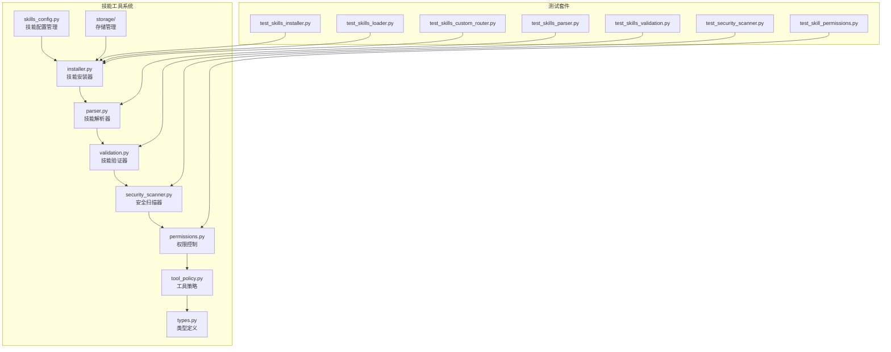
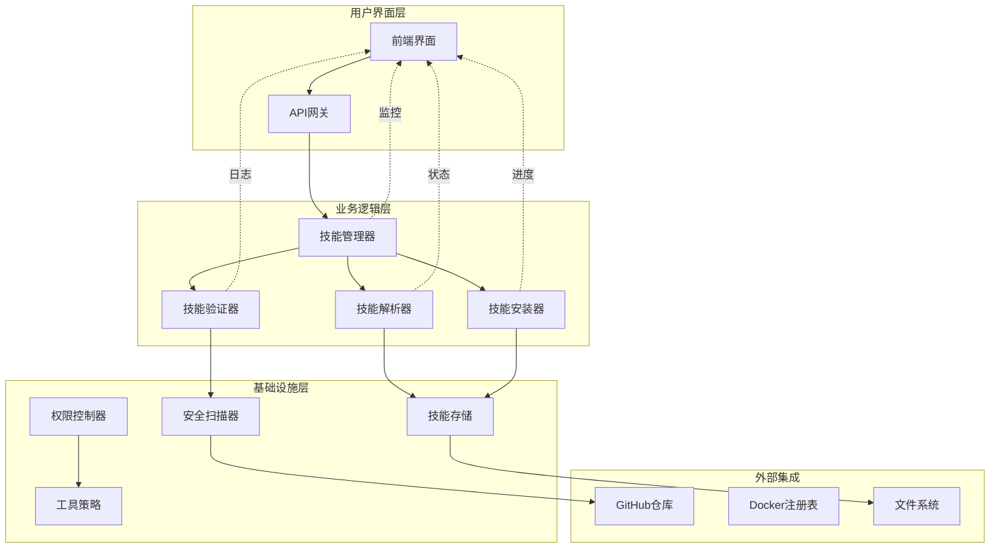
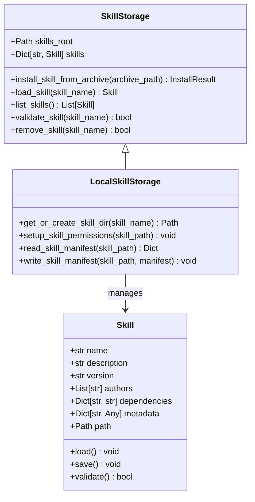
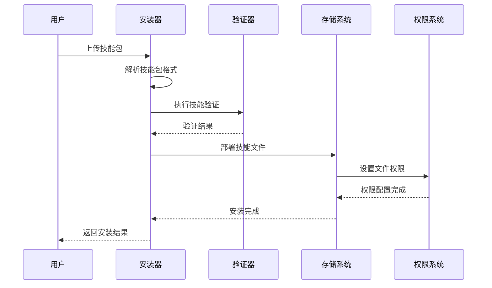
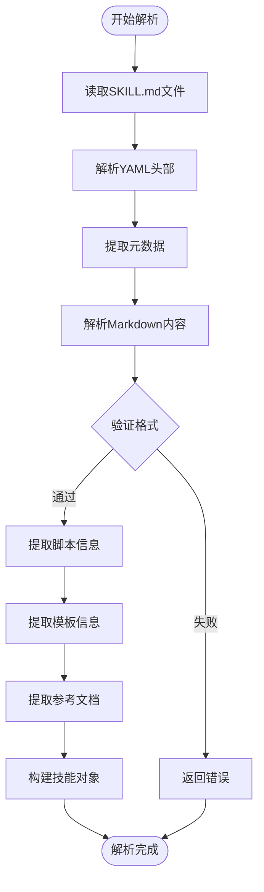
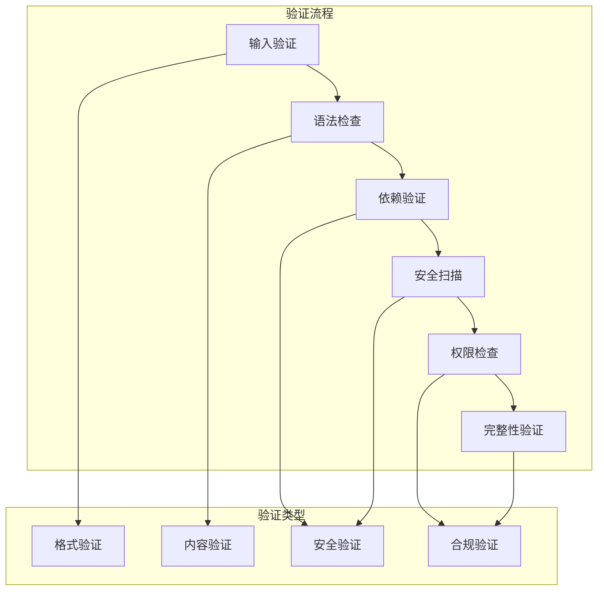
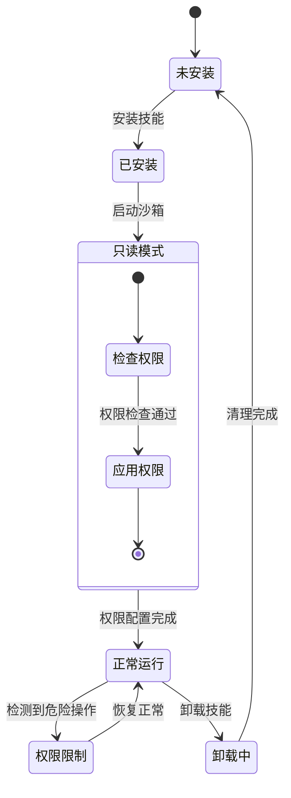
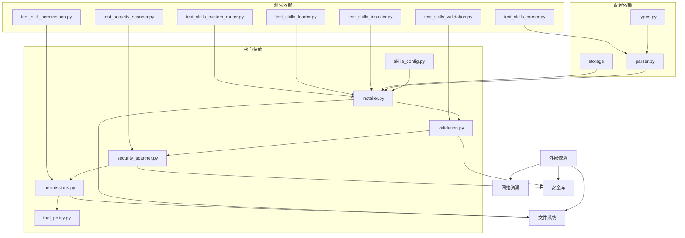

# 技能工具配置

<cite>
**本文档引用的文件**
- [skills_config.py](file://backend/packages/harness/deerflow/config/skills_config.py)
- [installer.py](file://backend/packages/harness/deerflow/skills/installer.py)
- [parser.py](file://backend/packages/harness/deerflow/skills/parser.py)
- [validation.py](file://backend/packages/harness/deerflow/skills/validation.py)
- [security_scanner.py](file://backend/packages/harness/deerflow/skills/security_scanner.py)
- [permissions.py](file://backend/packages/harness/deerflow/skills/permissions.py)
- [tool_policy.py](file://backend/packages/harness/deerflow/skills/tool_policy.py)
- [types.py](file://backend/packages/harness/deerflow/skills/types.py)
- [storage](file://backend/packages/harness/deerflow/skills/storage)
- [test_skills_installer.py](file://backend/tests/test_skills_installer.py)
- [test_skills_validation.py](file://backend/tests/test_skills_validation.py)
- [test_skills_parser.py](file://backend/tests/test_skills_parser.py)
- [test_skills_loader.py](file://backend/tests/test_skills_loader.py)
- [test_skills_custom_router.py](file://backend/tests/test_skills_custom_router.py)
- [test_skill_permissions.py](file://backend/tests/test_skill_permissions.py)
- [test_security_scanner.py](file://backend/tests/test_security_scanner.py)
- [SKILL.md](file://.agent/skills/smoke-test/SKILL.md)
- [SKILL.md](file://skills/public/bootstrap/SKILL.md)
- [SKILL.md](file://skills/public/skill-creator/SKILL.md)
</cite>

## 目录
1. [简介](#简介)
2. [项目结构](#项目结构)
3. [核心组件](#核心组件)
4. [架构概览](#架构概览)
5. [详细组件分析](#详细组件分析)
6. [依赖关系分析](#依赖关系分析)
7. [性能考虑](#性能考虑)
8. [故障排除指南](#故障排除指南)
9. [结论](#结论)
10. [附录](#附录)

## 简介

deer-flow 是一个基于 LangGraph 的智能体平台，提供了完整的技能工具配置和管理系统。本指南专注于技能工具的配置和管理，包括技能存储配置、技能解析器设置、技能验证规则、技能权限控制等功能。

技能工具是 deer-flow 平台的核心组件，允许用户创建、安装、验证和管理各种技能。系统支持本地技能存储、技能安装器、技能验证器等核心功能，为用户提供了一个完整的技能生态系统。

## 项目结构

deer-flow 项目采用模块化架构设计，技能工具系统位于 `backend/packages/harness/deerflow/skills/` 目录下，包含以下主要组件：

**图表来源**
- [skills_config.py](file://backend/packages/harness/deerflow/config/skills_config.py)
- [installer.py](file://backend/packages/harness/deerflow/skills/installer.py)
- [validation.py](file://backend/packages/harness/deerflow/skills/validation.py)
- [security_scanner.py](file://backend/packages/harness/deerflow/skills/security_scanner.py)
- [permissions.py](file://backend/packages/harness/deerflow/skills/permissions.py)
- [tool_policy.py](file://backend/packages/harness/deerflow/skills/tool_policy.py)
- [types.py](file://backend/packages/harness/deerflow/skills/types.py)

**章节来源**
- [skills_config.py](file://backend/packages/harness/deerflow/config/skills_config.py)
- [installer.py](file://backend/packages/harness/deerflow/skills/installer.py)
- [parser.py](file://backend/packages/harness/deerflow/skills/parser.py)

## 核心组件

技能工具系统由多个相互关联的组件组成，每个组件都有特定的功能和职责：

### 技能存储配置
技能存储负责管理技能的物理存储位置和访问权限。系统支持本地存储和分布式存储两种模式，确保技能文件的安全性和可访问性。

### 技能解析器
技能解析器负责读取和解析技能描述文件（SKILL.md），提取技能元数据、脚本信息和模板内容。解析器支持 YAML 头部配置和 Markdown 内容的标准化处理。

### 技能验证器
技能验证器执行多层验证检查，包括文件完整性验证、语法检查、依赖关系验证和安全扫描。验证器确保技能符合平台标准和安全要求。

### 技能权限控制
权限控制系统管理技能文件的访问权限，确保技能在沙箱环境中只能以只读方式访问，防止恶意操作和安全风险。

**章节来源**
- [permissions.py](file://backend/packages/harness/deerflow/skills/permissions.py)
- [validation.py](file://backend/packages/harness/deerflow/skills/validation.py)
- [security_scanner.py](file://backend/packages/harness/deerflow/skills/security_scanner.py)

## 架构概览

deer-flow 的技能工具系统采用分层架构设计，从底层存储到上层应用服务形成完整的技能生命周期管理体系：

**图表来源**
- [skills_config.py](file://backend/packages/harness/deerflow/config/skills_config.py)
- [installer.py](file://backend/packages/harness/deerflow/skills/installer.py)
- [validation.py](file://backend/packages/harness/deerflow/skills/validation.py)
- [security_scanner.py](file://backend/packages/harness/deerflow/skills/security_scanner.py)
- [permissions.py](file://backend/packages/harness/deerflow/skills/permissions.py)

系统架构的关键特点包括：

1. **分层设计**：清晰的层次分离确保了系统的可维护性和可扩展性
2. **模块化组件**：每个组件都有明确的职责边界和接口定义
3. **安全优先**：从底层存储到上层应用都实施了多层次的安全保护
4. **可扩展性**：支持自定义技能开发和第三方集成

## 详细组件分析

### 技能存储系统

技能存储系统负责管理技能文件的物理存储和访问控制。系统采用分层目录结构，支持公共技能和自定义技能的分类管理。

**图表来源**
- [storage](file://backend/packages/harness/deerflow/skills/storage)
- [installer.py](file://backend/packages/harness/deerflow/skills/installer.py)

技能存储系统的主要功能包括：

1. **目录管理**：自动创建和管理技能目录结构
2. **权限控制**：设置适当的文件和目录权限
3. **元数据管理**：维护技能的元数据信息
4. **生命周期管理**：支持技能的安装、更新和卸载

**章节来源**
- [storage](file://backend/packages/harness/deerflow/skills/storage)
- [installer.py](file://backend/packages/harness/deerflow/skills/installer.py)

### 技能安装器

技能安装器负责处理技能包的下载、解压和部署过程。系统支持多种安装源，包括本地文件、远程仓库和压缩包格式。

**图表来源**
- [installer.py](file://backend/packages/harness/deerflow/skills/installer.py)
- [validation.py](file://backend/packages/harness/deerflow/skills/validation.py)
- [permissions.py](file://backend/packages/harness/deerflow/skills/permissions.py)

安装器的工作流程包括：

1. **格式检测**：识别技能包的压缩格式和内容结构
2. **内容提取**：解压和组织技能文件
3. **完整性检查**：验证技能包的完整性和一致性
4. **部署执行**：将技能文件写入目标目录
5. **权限配置**：设置适当的访问权限

**章节来源**
- [test_skills_installer.py](file://backend/tests/test_skills_installer.py)
- [installer.py](file://backend/packages/harness/deerflow/skills/installer.py)

### 技能解析器

技能解析器专门处理 SKILL.md 文件的解析工作，提取技能的元数据、描述信息和配置参数。

**图表来源**
- [parser.py](file://backend/packages/harness/deerflow/skills/parser.py)
- [types.py](file://backend/packages/harness/deerflow/skills/types.py)

解析器的核心功能包括：

1. **元数据分析**：提取技能名称、描述、版本等基本信息
2. **脚本识别**：发现和解析技能相关的执行脚本
3. **模板提取**：收集技能使用的模板文件
4. **参考文档**：整理技能相关的参考资料

**章节来源**
- [parser.py](file://backend/packages/harness/deerflow/skills/parser.py)
- [types.py](file://backend/packages/harness/deerflow/skills/types.py)

### 技能验证系统

技能验证系统执行多层次的验证检查，确保技能的质量和安全性。

**图表来源**
- [validation.py](file://backend/packages/harness/deerflow/skills/validation.py)
- [security_scanner.py](file://backend/packages/harness/deerflow/skills/security_scanner.py)
- [tool_policy.py](file://backend/packages/harness/deerflow/skills/tool_policy.py)

验证系统包括以下检查项目：

1. **格式验证**：检查 SKILL.md 文件的格式正确性
2. **内容验证**：验证技能描述和脚本内容的合理性
3. **依赖验证**：确认技能所需的依赖项存在且可用
4. **安全扫描**：检测潜在的安全威胁和恶意代码
5. **权限检查**：验证技能的权限配置是否适当
6. **完整性验证**：确保技能包的所有必需文件都已包含

**章节来源**
- [test_skills_validation.py](file://backend/tests/test_skills_validation.py)
- [validation.py](file://backend/packages/harness/deerflow/skills/validation.py)

### 权限控制系统

权限控制系统确保技能在运行时只能以受限的方式访问文件系统，防止恶意操作。

**图表来源**
- [permissions.py](file://backend/packages/harness/deerflow/skills/permissions.py)

权限控制的核心机制包括：

1. **权限降级**：移除技能文件的写入权限
2. **目录保护**：确保技能目录结构的完整性
3. **动态调整**：根据运行时需求动态调整权限级别
4. **安全监控**：监控权限使用情况和异常行为

**章节来源**
- [test_skill_permissions.py](file://backend/tests/test_skill_permissions.py)
- [permissions.py](file://backend/packages/harness/deerflow/skills/permissions.py)

## 依赖关系分析

技能工具系统的依赖关系复杂而有序，形成了一个完整的生态系统：

**图表来源**
- [skills_config.py](file://backend/packages/harness/deerflow/config/skills_config.py)
- [installer.py](file://backend/packages/harness/deerflow/skills/installer.py)
- [validation.py](file://backend/packages/harness/deerflow/skills/validation.py)
- [security_scanner.py](file://backend/packages/harness/deerflow/skills/security_scanner.py)
- [permissions.py](file://backend/packages/harness/deerflow/skills/permissions.py)
- [tool_policy.py](file://backend/packages/harness/deerflow/skills/tool_policy.py)
- [parser.py](file://backend/packages/harness/deerflow/skills/parser.py)
- [types.py](file://backend/packages/harness/deerflow/skills/types.py)

系统的关键依赖特性：

1. **单向依赖**：依赖关系呈单向流动，避免循环依赖
2. **模块化设计**：每个组件都可以独立测试和维护
3. **接口稳定**：核心接口保持稳定，便于扩展和升级
4. **测试覆盖**：每个组件都有对应的测试套件

**章节来源**
- [test_skills_loader.py](file://backend/tests/test_skills_loader.py)
- [test_skills_custom_router.py](file://backend/tests/test_skills_custom_router.py)

## 性能考虑

技能工具系统的性能优化涉及多个层面，从文件系统操作到网络通信都需要考虑效率问题：

### 存储性能优化
- **缓存策略**：实现技能元数据和配置的内存缓存
- **批量操作**：支持批量安装和卸载技能以减少系统调用
- **异步处理**：使用异步I/O操作提高并发性能

### 验证性能优化
- **增量验证**：只对修改过的文件进行重新验证
- **并行处理**：利用多核处理器并行执行验证任务
- **智能跳过**：跳过不必要的验证步骤

### 安全扫描优化
- **白名单机制**：使用文件扩展名和路径模式快速过滤
- **分阶段扫描**：先进行快速扫描，再进行深度分析
- **结果缓存**：缓存扫描结果避免重复计算

## 故障排除指南

### 常见问题诊断

**技能安装失败**
1. 检查技能包格式是否正确
2. 验证磁盘空间是否充足
3. 确认权限设置是否正确
4. 查看详细的错误日志信息

**技能加载错误**
1. 检查 SKILL.md 文件格式
2. 验证脚本文件的可执行权限
3. 确认依赖项是否正确安装
4. 检查文件编码和换行符

**权限相关问题**
1. 验证文件权限是否正确设置
2. 检查目录遍历权限
3. 确认沙箱环境配置
4. 查看权限拒绝的具体原因

**章节来源**
- [test_skills_installer.py](file://backend/tests/test_skills_installer.py)
- [test_skills_validation.py](file://backend/tests/test_skills_validation.py)
- [test_skill_permissions.py](file://backend/tests/test_skill_permissions.py)

### 调试技巧

1. **启用详细日志**：增加日志级别以获取更多信息
2. **单元测试**：编写针对性的单元测试验证问题
3. **环境隔离**：在隔离环境中重现和调试问题
4. **性能分析**：使用性能分析工具识别瓶颈

## 结论

deer-flow 的技能工具配置系统提供了一个完整、安全、高效的技能管理解决方案。通过模块化的架构设计和严格的验证机制，系统确保了技能的质量和安全性。

系统的主要优势包括：

1. **完整的生命周期管理**：从创建到卸载的全流程支持
2. **强大的安全保护**：多层次的安全检查和权限控制
3. **灵活的配置选项**：支持多种部署模式和配置场景
4. **完善的测试覆盖**：全面的测试套件确保系统稳定性

对于开发者而言，该系统提供了清晰的扩展点和良好的开发体验；对于运维人员而言，系统提供了完善的监控和管理工具。

## 附录

### 配置示例

技能配置文件的基本结构通常包含以下部分：
- 元数据信息：技能名称、版本、作者等
- 功能描述：技能的功能概述和使用场景
- 依赖声明：所需的外部依赖和服务
- 配置参数：运行时可配置的参数选项
- 安全设置：权限要求和安全限制

### 最佳实践

1. **版本管理**：使用语义化版本控制技能发布
2. **文档规范**：保持 SKILL.md 文件的完整性和准确性
3. **测试要求**：在发布前进行全面的功能和安全测试
4. **监控设置**：建立完善的日志记录和性能监控
5. **备份策略**：定期备份重要的技能配置和数据

### 扩展指南

系统提供了多种扩展点：
- 自定义验证规则：添加特定领域的验证逻辑
- 新的存储后端：支持不同的存储系统和协议
- 额外的安全检查：集成新的安全扫描工具
- 第三方集成：与外部服务和平台的连接