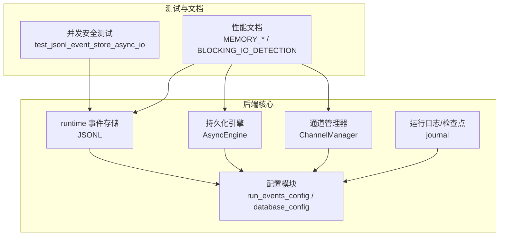
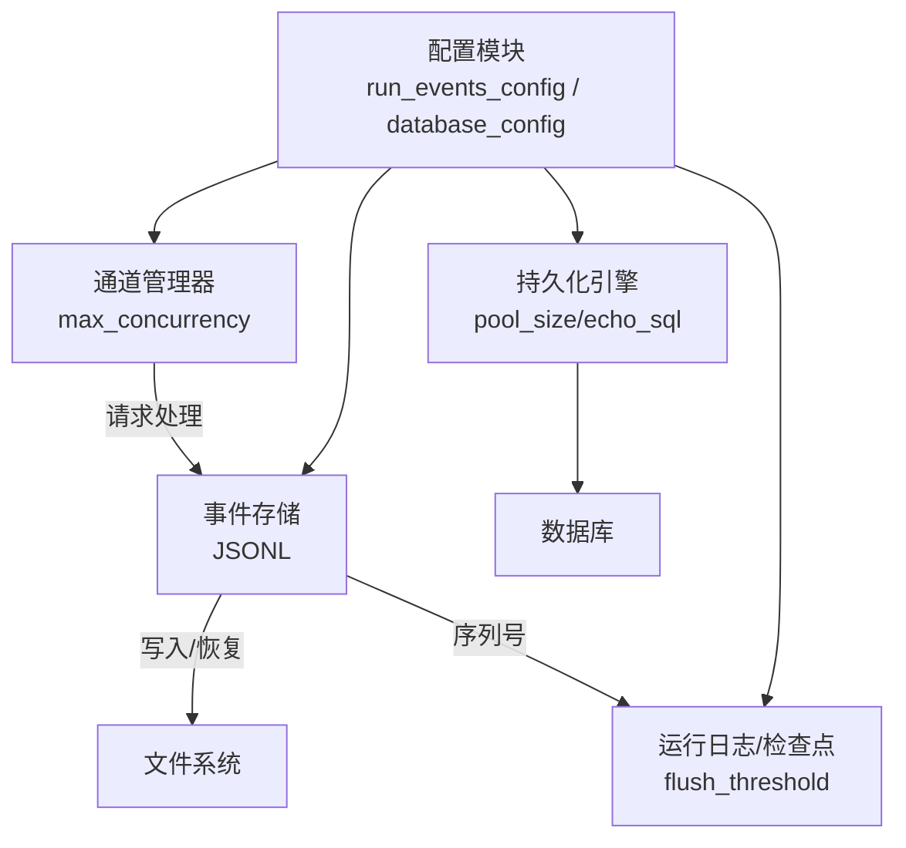
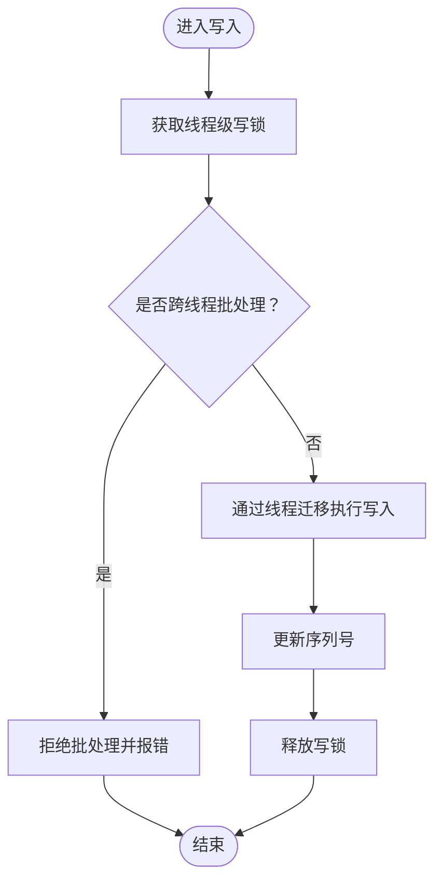
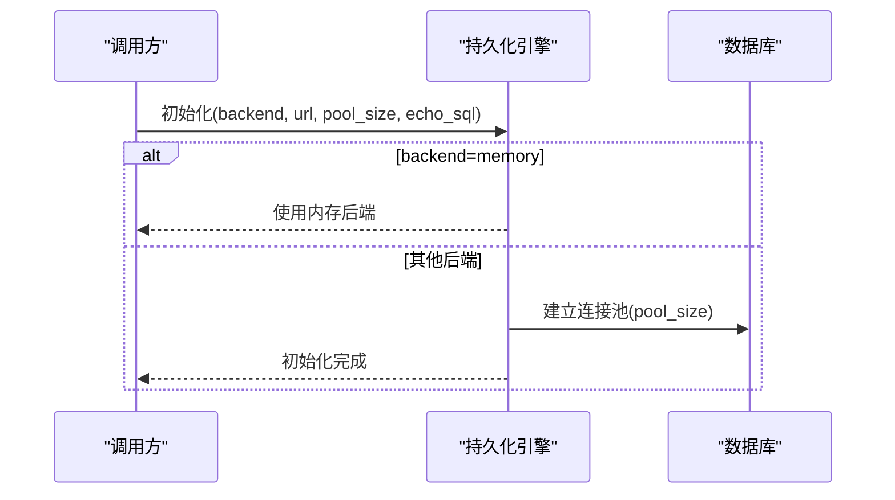
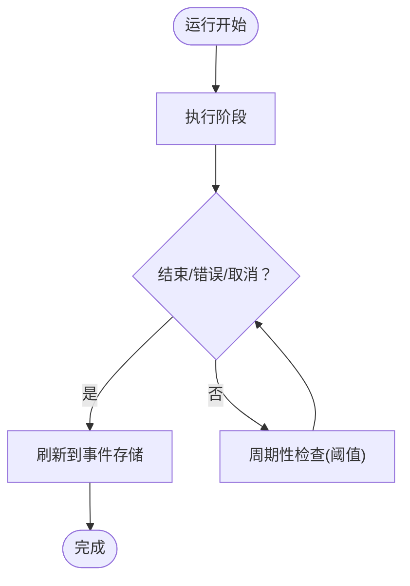
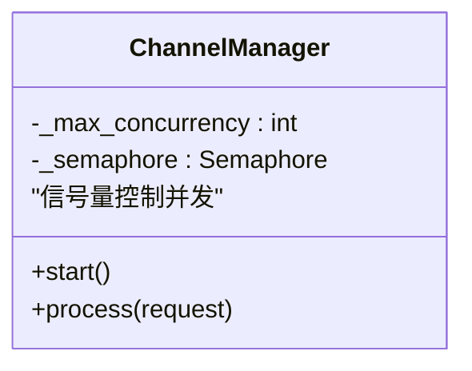
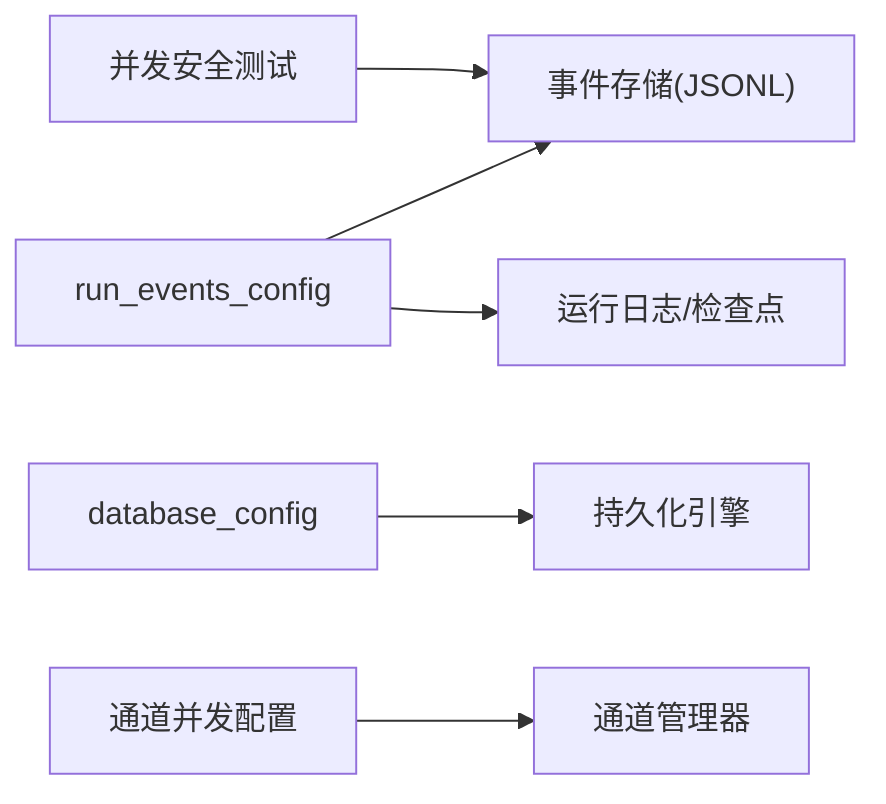

# 性能配置

<cite>
**本文引用的文件**
- [backend/packages/harness/deerflow/runtime/events/store/jsonl.py](file://backend/packages/harness/deerflow/runtime/events/store/jsonl.py)
- [backend/packages/harness/deerflow/persistence/engine.py](file://backend/packages/harness/deerflow/persistence/engine.py)
- [backend/packages/harness/deerflow/config/database_config.py](file://backend/packages/harness/deerflow/config/database_config.py)
- [backend/packages/harness/deerflow/config/run_events_config.py](file://backend/packages/harness/deerflow/config/run_events_config.py)
- [backend/packages/harness/deerflow/runtime/journal.py](file://backend/packages/harness/deerflow/runtime/journal.py)
- [backend/app/channels/manager.py](file://backend/app/channels/manager.py)
- [backend/tests/test_jsonl_event_store_async_io.py](file://backend/tests/test_jsonl_event_store_async_io.py)
- [docs/superpowers/plans/2026-04-10-event-store-history.md](file://docs/superpowers/plans/2026-04-10-event-store-history.md)
- [scripts/sandbox_memory_profile.py](file://scripts/sandbox_memory_profile.py)
- [backend/docs/MEMORY_SETTINGS_REVIEW.md](file://backend/docs/MEMORY_SETTINGS_REVIEW.md)
- [backend/docs/MEMORY_IMPROVEMENTS.md](file://backend/docs/MEMORY_IMPROVEMENTS.md)
- [backend/docs/SANDBOX_MEMORY_PROFILING.md](file://backend/docs/SANDBOX_MEMORY_PROFILING.md)
- [backend/docs/BLOCKING_IO_DETECTION.md](file://backend/docs/BLOCKING_IO_DETECTION.md)
- [backend/docs/CONFIGURATION.md](file://backend/docs/CONFIGURATION.md)
- [backend/docs/memory-settings-sample.json](file://backend/docs/memory-settings-sample.json)
- [backend/docs/README.md](file://backend/docs/README.md)
</cite>

## 目录
1. 引言
2. 项目结构
3. 核心组件
4. 架构总览
5. 组件详解
6. 依赖关系分析
7. 性能考量
8. 故障排查指南
9. 结论
10. 附录

## 引言
本指南聚焦于 DeerFlow 的性能调优配置，覆盖内存管理、并发控制、缓存策略、连接池配置以及运行时与事件存储对性能的影响。文档同时提供不同负载场景下的优化建议与配置模板，并给出性能监控、瓶颈识别与资源使用优化的实操技巧。

## 项目结构
- 后端核心位于 backend/packages/harness/deerflow，包含运行时事件存储、持久化引擎、配置模块等。
- 运行时事件存储采用 JSONL 文件追加式存储，配合序列号保证顺序与恢复能力。
- 数据库持久化通过异步引擎与连接池参数进行性能控制。
- 并发控制在通道管理器中以信号量限制最大并发数。
- 文档目录包含内存优化、阻塞 IO 检测、配置说明等专题文档，便于定位性能问题与优化方向。

**图表来源**
- [backend/packages/harness/deerflow/runtime/events/store/jsonl.py](file://backend/packages/harness/deerflow/runtime/events/store/jsonl.py)
- [backend/packages/harness/deerflow/persistence/engine.py](file://backend/packages/harness/deerflow/persistence/engine.py)
- [backend/packages/harness/deerflow/config/run_events_config.py](file://backend/packages/harness/deerflow/config/run_events_config.py)
- [backend/packages/harness/deerflow/config/database_config.py](file://backend/packages/harness/deerflow/config/database_config.py)
- [backend/packages/harness/deerflow/runtime/journal.py](file://backend/packages/harness/deerflow/runtime/journal.py)
- [backend/app/channels/manager.py](file://backend/app/channels/manager.py)
- [backend/tests/test_jsonl_event_store_async_io.py](file://backend/tests/test_jsonl_event_store_async_io.py)
- [backend/docs/MEMORY_IMPROVEMENTS.md](file://backend/docs/MEMORY_IMPROVEMENTS.md)
- [backend/docs/BLOCKING_IO_DETECTION.md](file://backend/docs/BLOCKING_IO_DETECTION.md)

**章节来源**
- [backend/docs/README.md](file://backend/docs/README.md)
- [backend/docs/CONFIGURATION.md](file://backend/docs/CONFIGURATION.md)

## 核心组件
- 事件存储（JSONL）：用于运行事件的追加式存储，具备写锁隔离、序列号恢复与线程迁移保护，适合高并发写入场景。
- 持久化引擎：支持内存与多种数据库后端，提供连接池大小、SQL 输出等参数，直接影响数据库吞吐与延迟。
- 运行日志/检查点：负责运行生命周期中的状态记录与刷新阈值，影响事件落盘频率与内存占用。
- 通道管理器：通过信号量限制并发，避免过载导致资源争用与抖动。
- 配置模块：集中定义事件存储、数据库、运行时等性能相关参数。

**章节来源**
- [backend/packages/harness/deerflow/runtime/events/store/jsonl.py](file://backend/packages/harness/deerflow/runtime/events/store/jsonl.py)
- [backend/packages/harness/deerflow/persistence/engine.py](file://backend/packages/harness/deerflow/persistence/engine.py)
- [backend/packages/harness/deerflow/config/run_events_config.py](file://backend/packages/harness/deerflow/config/run_events_config.py)
- [backend/packages/harness/deerflow/config/database_config.py](file://backend/packages/harness/deerflow/config/database_config.py)
- [backend/packages/harness/deerflow/runtime/journal.py](file://backend/packages/harness/deerflow/runtime/journal.py)
- [backend/app/channels/manager.py](file://backend/app/channels/manager.py)

## 架构总览
下图展示性能相关组件之间的交互：事件存储负责运行事件的持久化；持久化引擎承载数据库连接池；通道管理器控制并发；运行日志/检查点协调事件落盘节奏；配置模块为上述组件提供参数来源。

**图表来源**
- [backend/app/channels/manager.py](file://backend/app/channels/manager.py)
- [backend/packages/harness/deerflow/runtime/events/store/jsonl.py](file://backend/packages/harness/deerflow/runtime/events/store/jsonl.py)
- [backend/packages/harness/deerflow/runtime/journal.py](file://backend/packages/harness/deerflow/runtime/journal.py)
- [backend/packages/harness/deerflow/persistence/engine.py](file://backend/packages/harness/deerflow/persistence/engine.py)
- [backend/packages/harness/deerflow/config/run_events_config.py](file://backend/packages/harness/deerflow/config/run_events_config.py)
- [backend/packages/harness/deerflow/config/database_config.py](file://backend/packages/harness/deerflow/config/database_config.py)

## 组件详解

### 事件存储（JSONL）与并发控制
- 写入并发：每个线程拥有独立写锁，确保同一线程内写入串行化，避免竞争。
- 序列号单调性：批量写入保持严格递增，跨线程批处理会被拒绝，保障顺序一致性。
- 写入卸载：写操作通过线程迁移机制执行，避免阻塞事件循环。
- 恢复机制：重启后从磁盘恢复最大序列号，确保后续写入连续。

**图表来源**
- [backend/tests/test_jsonl_event_store_async_io.py](file://backend/tests/test_jsonl_event_store_async_io.py)
- [backend/packages/harness/deerflow/runtime/events/store/jsonl.py](file://backend/packages/harness/deerflow/runtime/events/store/jsonl.py)

**章节来源**
- [backend/tests/test_jsonl_event_store_async_io.py](file://backend/tests/test_jsonl_event_store_async_io.py)
- [backend/packages/harness/deerflow/runtime/events/store/jsonl.py](file://backend/packages/harness/deerflow/runtime/events/store/jsonl.py)

### 持久化引擎与连接池配置
- 后端选择：支持内存与多种数据库后端，内存后端适合轻量或测试环境。
- 连接池参数：通过池大小控制并发连接上限，SQL 输出可用于诊断慢查询。
- 初始化流程：根据配置对象初始化引擎，内存后端跳过数据库连接。

**图表来源**
- [backend/packages/harness/deerflow/persistence/engine.py](file://backend/packages/harness/deerflow/persistence/engine.py)
- [backend/packages/harness/deerflow/config/database_config.py](file://backend/packages/harness/deerflow/config/database_config.py)

**章节来源**
- [backend/packages/harness/deerflow/persistence/engine.py](file://backend/packages/harness/deerflow/persistence/engine.py)
- [backend/packages/harness/deerflow/config/database_config.py](file://backend/packages/harness/deerflow/config/database_config.py)

### 运行日志/检查点与刷新策略
- 刷新阈值：通过调整刷新阈值减少中间状态刷新窗口，降低频繁落盘带来的开销。
- 关键路径：在运行结束、错误、取消及工作线程 finally 路径均会触发刷新，确保关键节点可见。
- 历史消息加载：事件存储为只追加且不受摘要影响，可作为消息来源以提升渲染稳定性。

**图表来源**
- [backend/packages/harness/deerflow/runtime/journal.py](file://backend/packages/harness/deerflow/runtime/journal.py)
- [docs/superpowers/plans/2026-04-10-event-store-history.md](file://docs/superpowers/plans/2026-04-10-event-store-history.md)

**章节来源**
- [backend/packages/harness/deerflow/runtime/journal.py](file://backend/packages/harness/deerflow/runtime/journal.py)
- [docs/superpowers/plans/2026-04-10-event-store-history.md](file://docs/superpowers/plans/2026-04-10-event-store-history.md)

### 通道管理器与并发控制
- 最大并发：通过信号量限制同时处理的通道请求数，防止资源耗尽。
- 默认并发：在配置中设定默认最大并发值，结合业务峰值进行调优。
- 资源隔离：每个通道实例维护独立事件循环与上下文，避免相互干扰。

**图表来源**
- [backend/app/channels/manager.py](file://backend/app/channels/manager.py)

**章节来源**
- [backend/app/channels/manager.py](file://backend/app/channels/manager.py)

## 依赖关系分析
- 事件存储依赖配置模块提供的事件存储参数，确保序列号与路径正确。
- 持久化引擎依赖数据库配置模块提供的后端与连接池参数。
- 运行日志/检查点依赖运行事件配置模块的刷新阈值与行为。
- 通道管理器依赖全局配置模块的并发上限参数。
- 测试用例验证事件存储的并发安全与序列号一致性。

**图表来源**
- [backend/packages/harness/deerflow/config/run_events_config.py](file://backend/packages/harness/deerflow/config/run_events_config.py)
- [backend/packages/harness/deerflow/config/database_config.py](file://backend/packages/harness/deerflow/config/database_config.py)
- [backend/packages/harness/deerflow/runtime/events/store/jsonl.py](file://backend/packages/harness/deerflow/runtime/events/store/jsonl.py)
- [backend/packages/harness/deerflow/persistence/engine.py](file://backend/packages/harness/deerflow/persistence/engine.py)
- [backend/packages/harness/deerflow/runtime/journal.py](file://backend/packages/harness/deerflow/runtime/journal.py)
- [backend/app/channels/manager.py](file://backend/app/channels/manager.py)
- [backend/tests/test_jsonl_event_store_async_io.py](file://backend/tests/test_jsonl_event_store_async_io.py)

**章节来源**
- [backend/packages/harness/deerflow/config/run_events_config.py](file://backend/packages/harness/deerflow/config/run_events_config.py)
- [backend/packages/harness/deerflow/config/database_config.py](file://backend/packages/harness/deerflow/config/database_config.py)
- [backend/packages/harness/deerflow/runtime/events/store/jsonl.py](file://backend/packages/harness/deerflow/runtime/events/store/jsonl.py)
- [backend/packages/harness/deerflow/persistence/engine.py](file://backend/packages/harness/deerflow/persistence/engine.py)
- [backend/packages/harness/deerflow/runtime/journal.py](file://backend/packages/harness/deerflow/runtime/journal.py)
- [backend/app/channels/manager.py](file://backend/app/channels/manager.py)
- [backend/tests/test_jsonl_event_store_async_io.py](file://backend/tests/test_jsonl_event_store_async_io.py)

## 性能考量

### 内存管理
- 事件存储为只追加结构，避免频繁重写，适合长生命周期运行记录。
- 历史消息加载可直接从事件存储读取，不受摘要影响，有助于稳定前端渲染。
- 内存优化文档提供了内存设置回顾与改进方案，建议结合业务规模与峰值内存进行调优。

**章节来源**
- [docs/superpowers/plans/2026-04-10-event-store-history.md](file://docs/superpowers/plans/2026-04-10-event-store-history.md)
- [backend/docs/MEMORY_SETTINGS_REVIEW.md](file://backend/docs/MEMORY_SETTINGS_REVIEW.md)
- [backend/docs/MEMORY_IMPROVEMENTS.md](file://backend/docs/MEMORY_IMPROVEMENTS.md)

### 并发控制
- 通道管理器通过信号量限制最大并发，建议根据 CPU 核心数与 I/O 特性设置合理上限。
- 对于高 I/O 密集型任务，可适度提高并发以提升吞吐；对于 CPU 密集型任务，需避免过度并发导致调度开销。

**章节来源**
- [backend/app/channels/manager.py](file://backend/app/channels/manager.py)

### 缓存策略
- 令牌与外部服务访问令牌缓存可显著降低重复请求成本，建议结合过期时间与刷新策略。
- 策略查询与审计日志建议采用本地短缓存与异步写入，减少对主链路的影响。

**章节来源**
- [backend/docs/权限控制.md](file://backend/docs/权限控制.md)

### 连接池配置
- 数据库连接池大小直接影响并发事务处理能力与资源占用，建议根据 QPS 与平均事务时长估算。
- SQL 输出可用于诊断慢查询与热点表，辅助优化索引与 SQL。

**章节来源**
- [backend/packages/harness/deerflow/persistence/engine.py](file://backend/packages/harness/deerflow/persistence/engine.py)
- [backend/packages/harness/deerflow/config/database_config.py](file://backend/packages/harness/deerflow/config/database_config.py)

### 运行时配置
- 刷新阈值与关键路径刷新策略影响事件落盘频率与内存占用，建议在稳定性与性能间权衡。
- 事件存储的序列号恢复能力确保重启后的连续性，减少重复写入与冲突。

**章节来源**
- [backend/packages/harness/deerflow/runtime/journal.py](file://backend/packages/harness/deerflow/runtime/journal.py)
- [backend/packages/harness/deerflow/runtime/events/store/jsonl.py](file://backend/packages/harness/deerflow/runtime/events/store/jsonl.py)

### 事件存储配置
- 写锁隔离与线程迁移机制保障高并发写入的安全性与低延迟。
- 批量写入的线程一致性校验避免跨线程混合导致的顺序问题。

**章节来源**
- [backend/tests/test_jsonl_event_store_async_io.py](file://backend/tests/test_jsonl_event_store_async_io.py)
- [backend/packages/harness/deerflow/runtime/events/store/jsonl.py](file://backend/packages/harness/deerflow/runtime/events/store/jsonl.py)

### 不同负载场景的优化建议
- 低并发/低延迟：降低刷新阈值，提高通道并发上限，启用数据库 SQL 输出诊断。
- 高并发/高吞吐：增大连接池与通道并发上限，开启事件存储写入卸载，优化序列号生成与落盘策略。
- 大体量历史数据：优先使用事件存储加载历史消息，减少摘要对消息一致性的影响。

**章节来源**
- [docs/superpowers/plans/2026-04-10-event-store-history.md](file://docs/superpowers/plans/2026-04-10-event-store-history.md)
- [backend/packages/harness/deerflow/runtime/journal.py](file://backend/packages/harness/deerflow/runtime/journal.py)
- [backend/packages/harness/deerflow/runtime/events/store/jsonl.py](file://backend/packages/harness/deerflow/runtime/events/store/jsonl.py)

### 配置模板
- 事件存储：基于 run_events_config 的参数进行配置，确保序列号与路径正确。
- 数据库：基于 database_config 的参数进行配置，包括后端类型、连接池大小、SQL 输出等。
- 通道并发：在通道管理器中设置最大并发值，结合业务峰值进行调优。
- 内存设置：参考 memory-settings-sample.json 与 MEMORY_* 文档进行调优。

**章节来源**
- [backend/packages/harness/deerflow/config/run_events_config.py](file://backend/packages/harness/deerflow/config/run_events_config.py)
- [backend/packages/harness/deerflow/config/database_config.py](file://backend/packages/harness/deerflow/config/database_config.py)
- [backend/app/channels/manager.py](file://backend/app/channels/manager.py)
- [backend/docs/memory-settings-sample.json](file://backend/docs/memory-settings-sample.json)
- [backend/docs/MEMORY_SETTINGS_REVIEW.md](file://backend/docs/MEMORY_SETTINGS_REVIEW.md)

## 故障排查指南
- 阻塞 I/O 检测：使用阻塞 I/O 检测脚本与文档，定位阻塞点并优化为异步实现。
- 内存剖析：使用沙箱内存剖析脚本与文档，识别内存增长与泄漏风险。
- 事件存储异常：检查写锁与序列号一致性，确认是否存在跨线程批处理或写入失败。
- 并发超限：观察通道管理器的信号量使用情况，适当调整最大并发上限。
- 数据库性能：开启 SQL 输出，结合慢查询与索引优化，调整连接池大小。

**章节来源**
- [backend/docs/BLOCKING_IO_DETECTION.md](file://backend/docs/BLOCKING_IO_DETECTION.md)
- [scripts/sandbox_memory_profile.py](file://scripts/sandbox_memory_profile.py)
- [backend/docs/SANDBOX_MEMORY_PROFILING.md](file://backend/docs/SANDBOX_MEMORY_PROFILING.md)
- [backend/tests/test_jsonl_event_store_async_io.py](file://backend/tests/test_jsonl_event_store_async_io.py)
- [backend/app/channels/manager.py](file://backend/app/channels/manager.py)
- [backend/packages/harness/deerflow/persistence/engine.py](file://backend/packages/harness/deerflow/persistence/engine.py)

## 结论
通过合理配置事件存储、持久化引擎、运行日志/检查点与通道并发，结合内存与缓存策略，可在不同负载场景下获得稳定的性能表现。建议以测试用例与性能文档为依据，持续监控与迭代优化。

## 附录
- 参考文档：内存设置回顾、内存优化、阻塞 I/O 检测、配置说明等。
- 配置样例：memory-settings-sample.json 提供内存相关参数示例。

**章节来源**
- [backend/docs/MEMORY_SETTINGS_REVIEW.md](file://backend/docs/MEMORY_SETTINGS_REVIEW.md)
- [backend/docs/MEMORY_IMPROVEMENTS.md](file://backend/docs/MEMORY_IMPROVEMENTS.md)
- [backend/docs/BLOCKING_IO_DETECTION.md](file://backend/docs/BLOCKING_IO_DETECTION.md)
- [backend/docs/CONFIGURATION.md](file://backend/docs/CONFIGURATION.md)
- [backend/docs/memory-settings-sample.json](file://backend/docs/memory-settings-sample.json)