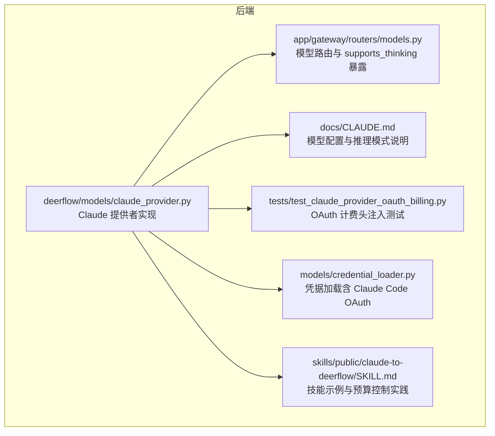
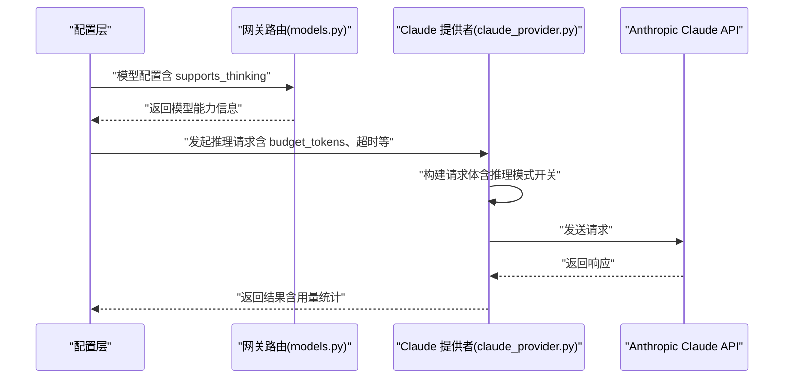
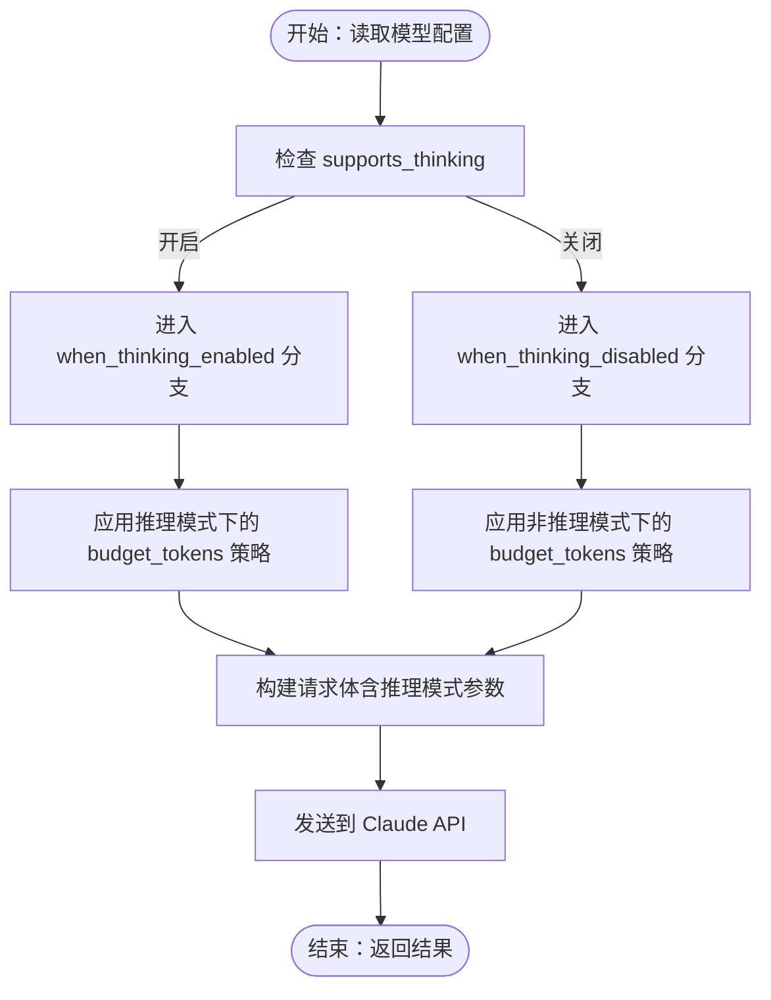
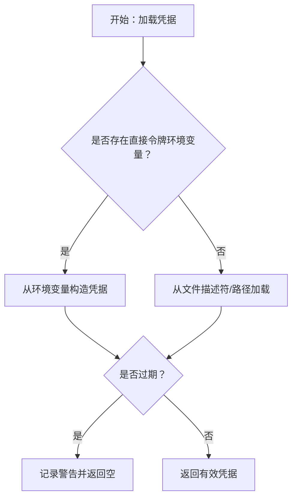
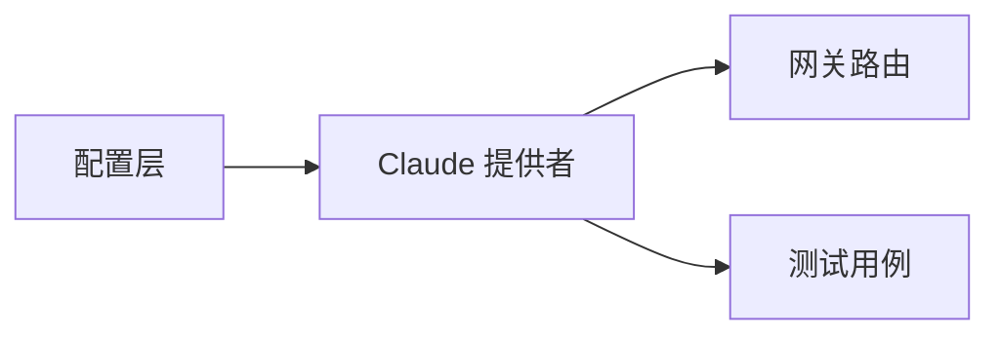

# Claude模型配置

<cite>
**本文引用的文件**
- [backend/packages/harness/deerflow/models/claude_provider.py](file://backend/packages/harness/deerflow/models/claude_provider.py)
- [backend/CLAUDE.md](file://backend/CLAUDE.md)
- [README.md](file://README.md)
- [backend/app/gateway/routers/models.py](file://backend/app/gateway/routers/models.py)
- [backend/docs/API.md](file://backend/docs/API.md)
- [backend/tests/test_claude_provider_oauth_billing.py](file://backend/tests/test_claude_provider_oauth_billing.py)
- [backend/packages/harness/deerflow/models/credential_loader.py](file://backend/packages/harness/deerflow/models/credential_loader.py)
- [skills/public/claude-to-deerflow/SKILL.md](file://skills/public/claude-to-deerflow/SKILL.md)
</cite>

## 目录
1. [简介](#简介)
2. [项目结构](#项目结构)
3. [核心组件](#核心组件)
4. [架构总览](#架构总览)
5. [详细组件分析](#详细组件分析)
6. [依赖关系分析](#依赖关系分析)
7. [性能考量](#性能考量)
8. [故障排查指南](#故障排查指南)
9. [结论](#结论)
10. [附录](#附录)

## 简介
本指南面向在 DeerFlow 中配置与使用 Anthropic Claude 模型的工程师与运维人员，系统阐述以下要点：
- Anthropic Claude API 的密钥与凭据加载机制
- 模型 ID 与通用参数配置（如超时、流式等）
- supports_thinking 参数的意义及对推理模式的影响
- when_thinking_enabled 与 when_thinking_disabled 配置块的作用与典型用法
- budget_tokens 参数的必要性、取值范围与设置规则（必须小于 max_tokens 且最小为 1024）
- 不同 Claude 模型版本的配置示例与预算令牌计算思路
- 常见错误与调试技巧

## 项目结构
与 Claude 配置直接相关的核心位置如下：
- 后端模型提供者：Claude 提供者实现位于 deerflow 模型包中
- 文档与示例：后端 CLAUDE.md 提供了模型配置与推理模式的权威说明
- 网关路由：模型列表与 supports_thinking 字段暴露于网关接口
- 测试用例：OAuth 计费头注入与提示缓存等行为由测试保障
- 凭据加载：支持从环境变量或本地文件加载 Claude Code OAuth 凭据
- 技能示例：claude-to-deerflow 技能展示了如何在技能中调用 Claude 并进行预算控制

**图表来源**
- [backend/packages/harness/deerflow/models/claude_provider.py](file://backend/packages/harness/deerflow/models/claude_provider.py)
- [backend/app/gateway/routers/models.py](file://backend/app/gateway/routers/models.py)
- [backend/CLAUDE.md](file://backend/CLAUDE.md)
- [backend/tests/test_claude_provider_oauth_billing.py](file://backend/tests/test_claude_provider_oauth_billing.py)
- [backend/packages/harness/deerflow/models/credential_loader.py](file://backend/packages/harness/deerflow/models/credential_loader.py)
- [skills/public/claude-to-deerflow/SKILL.md](file://skills/public/claude-to-deerflow/SKILL.md)

**章节来源**
- [backend/packages/harness/deerflow/models/claude_provider.py](file://backend/packages/harness/deerflow/models/claude_provider.py)
- [backend/CLAUDE.md](file://backend/CLAUDE.md)
- [backend/app/gateway/routers/models.py](file://backend/app/gateway/routers/models.py)
- [backend/tests/test_claude_provider_oauth_billing.py](file://backend/tests/test_claude_provider_oauth_billing.py)
- [backend/packages/harness/deerflow/models/credential_loader.py](file://backend/packages/harness/deerflow/models/credential_loader.py)
- [skills/public/claude-to-deerflow/SKILL.md](file://skills/public/claude-to-deerflow/SKILL.md)

## 核心组件
- Claude 提供者（模型适配层）
  - 负责将统一的调用接口映射到 Anthropic Claude API，处理请求构建、响应解析、错误处理与计费头注入等
  - 支持 OAuth 与 API Key 两种认证方式；在 OAuth 模式下会自动注入计费提示块
- 凭据加载器
  - 支持从环境变量或本地文件加载 Claude Code OAuth 凭据，并进行过期检查
- 网关模型路由
  - 将模型配置中的 supports_thinking 字段暴露给前端与外部系统，用于控制推理模式开关
- 测试用例
  - 通过单元测试验证 OAuth 计费头注入行为，确保在无 system 或已有 system 列表时正确插入计费提示块

**章节来源**
- [backend/packages/harness/deerflow/models/claude_provider.py](file://backend/packages/harness/deerflow/models/claude_provider.py)
- [backend/packages/harness/deerflow/models/credential_loader.py](file://backend/packages/harness/deerflow/models/credential_loader.py)
- [backend/app/gateway/routers/models.py](file://backend/app/gateway/routers/models.py)
- [backend/tests/test_claude_provider_oauth_billing.py](file://backend/tests/test_claude_provider_oauth_billing.py)

## 架构总览
下图展示从配置到调用的关键流程：配置层定义模型与推理模式；网关暴露 supports_thinking；模型提供者根据配置构建请求并执行调用。

**图表来源**
- [backend/app/gateway/routers/models.py](file://backend/app/gateway/routers/models.py)
- [backend/packages/harness/deerflow/models/claude_provider.py](file://backend/packages/harness/deerflow/models/claude_provider.py)

## 详细组件分析

### Claude 提供者与推理模式
- supports_thinking
  - 表示该模型是否支持“思考模式”（推理模式），用于开启/关闭深层推理行为
  - 在网关路由中以字段形式暴露，便于前端与外部系统识别模型能力
- when_thinking_enabled / when_thinking_disabled
  - 用于在不同推理状态下覆盖或定制请求参数（例如 budget_tokens、extra_body 等）
  - 典型用途：在推理模式开启时放宽预算或调整模型参数，在推理模式关闭时收紧预算或降低复杂度
- budget_tokens
  - 用于限制单次调用的预算输出长度，避免昂贵的长输出
  - 设置规则：必须小于 max_tokens，且最小为 1024
- 超时与流式
  - 支持设置请求超时与流式输出，便于长文本生成与实时反馈
- OAuth 计费头注入
  - 在 OAuth 模式下，若未提供 system 或已有 system 列表，会在首部注入计费提示块，确保合规计费

**图表来源**
- [backend/CLAUDE.md](file://backend/CLAUDE.md)
- [backend/app/gateway/routers/models.py](file://backend/app/gateway/routers/models.py)
- [backend/packages/harness/deerflow/models/claude_provider.py](file://backend/packages/harness/deerflow/models/claude_provider.py)

**章节来源**
- [backend/CLAUDE.md](file://backend/CLAUDE.md)
- [backend/app/gateway/routers/models.py](file://backend/app/gateway/routers/models.py)
- [backend/packages/harness/deerflow/models/claude_provider.py](file://backend/packages/harness/deerflow/models/claude_provider.py)

### 凭据加载与 API 密钥设置
- 环境变量优先级
  - 支持从环境变量直接读取 Claude Code OAuth 令牌或 Anthropic 认证令牌
  - 若存在直接令牌，将被优先使用
- 文件加载
  - 支持从指定文件描述符或自定义凭据路径加载 OAuth 凭据
  - 默认路径为用户主目录下的特定 JSON 文件
- 过期检查
  - 加载的凭据包含过期时间，若已过期则记录警告并拒绝使用

**图表来源**
- [backend/packages/harness/deerflow/models/credential_loader.py](file://backend/packages/harness/deerflow/models/credential_loader.py)

**章节来源**
- [backend/packages/harness/deerflow/models/credential_loader.py](file://backend/packages/harness/deerflow/models/credential_loader.py)

### 网关路由与 supports_thinking 暴露
- supports_thinking 字段用于标识模型是否支持推理模式
- 网关在模型查询与列表返回中包含该字段，便于前端与外部系统感知模型能力

**章节来源**
- [backend/app/gateway/routers/models.py](file://backend/app/gateway/routers/models.py)
- [backend/docs/API.md](file://backend/docs/API.md)

### 技能示例：claude-to-deerflow
- 该技能展示了如何在实际工作流中调用 Claude，并结合 budget_tokens 实现预算控制
- 可作为不同模型版本与推理模式配置的参考模板

**章节来源**
- [skills/public/claude-to-deerflow/SKILL.md](file://skills/public/claude-to-deerflow/SKILL.md)

## 依赖关系分析
- 模型提供者依赖于配置层提供的模型参数（包括推理模式开关、预算、超时等）
- 网关路由依赖模型提供者的能力信息（supports_thinking）
- 测试用例依赖模型提供者的内部行为（OAuth 计费头注入）

**图表来源**
- [backend/packages/harness/deerflow/models/claude_provider.py](file://backend/packages/harness/deerflow/models/claude_provider.py)
- [backend/app/gateway/routers/models.py](file://backend/app/gateway/routers/models.py)
- [backend/tests/test_claude_provider_oauth_billing.py](file://backend/tests/test_claude_provider_oauth_billing.py)

**章节来源**
- [backend/packages/harness/deerflow/models/claude_provider.py](file://backend/packages/harness/deerflow/models/claude_provider.py)
- [backend/app/gateway/routers/models.py](file://backend/app/gateway/routers/models.py)
- [backend/tests/test_claude_provider_oauth_billing.py](file://backend/tests/test_claude_provider_oauth_billing.py)

## 性能考量
- budget_tokens 与 max_tokens 的关系
  - budget_tokens 必须小于 max_tokens，且最小为 1024，避免无效或过度宽松的预算设置
- 推理模式对成本与耗时的影响
  - 开启推理模式通常会增加输出长度与计算复杂度，应结合 when_thinking_enabled 分支合理设置预算
- 超时与流式
  - 对长文本生成场景，建议设置合理的超时与流式输出，提升用户体验与资源利用率

**章节来源**
- [backend/CLAUDE.md](file://backend/CLAUDE.md)
- [backend/packages/harness/deerflow/models/claude_provider.py](file://backend/packages/harness/deerflow/models/claude_provider.py)

## 故障排查指南
- OAuth 凭据过期
  - 现象：加载凭据时出现过期警告
  - 处理：重新运行 Claude CLI 或更新凭据文件
- 计费头未注入
  - 现象：OAuth 模式下未看到计费提示块
  - 处理：确认 system 字段是否为空或已存在；测试用例验证了在不同 system 状态下的注入行为
- budget_tokens 设置不当
  - 现象：请求被拒绝或输出异常短
  - 处理：确保 budget_tokens 小于 max_tokens 且不小于 1024；在推理模式与非推理模式分别设置合适的预算

**章节来源**
- [backend/packages/harness/deerflow/models/credential_loader.py](file://backend/packages/harness/deerflow/models/credential_loader.py)
- [backend/tests/test_claude_provider_oauth_billing.py](file://backend/tests/test_claude_provider_oauth_billing.py)
- [backend/CLAUDE.md](file://backend/CLAUDE.md)

## 结论
- supports_thinking 是控制推理模式的关键开关，配合 when_thinking_enabled/when_thinking_disabled 可实现精细化参数管理
- budget_tokens 的设置需严格遵循“小于 max_tokens 且最小为 1024”的规则，以平衡成本与质量
- 通过凭据加载器与网关路由，可安全地在 OAuth 与 API Key 模式间切换，并将模型能力暴露给上层系统
- 建议在不同 Claude 模型版本与业务场景下，结合技能示例进行预算与推理模式的实证配置

## 附录

### 配置示例与最佳实践（基于仓库文档与实现）
- API 密钥与凭据
  - 通过环境变量或本地文件加载 Claude Code OAuth 凭据；若令牌过期需刷新
- 模型 ID 与通用参数
  - 在配置中指定模型 ID，并设置超时、流式输出等通用参数
- supports_thinking 与推理模式
  - 在模型配置中启用 supports_thinking，并在 when_thinking_enabled/when_thinking_disabled 中分别设置预算与参数
- budget_tokens 规则
  - 必须小于 max_tokens 且最小为 1024；在推理模式开启时可适当提高预算，在关闭时收紧预算
- 不同模型版本的配置
  - 参考后端 CLAUDE.md 中的模型配置说明，结合技能示例进行适配

**章节来源**
- [backend/CLAUDE.md](file://backend/CLAUDE.md)
- [backend/packages/harness/deerflow/models/credential_loader.py](file://backend/packages/harness/deerflow/models/credential_loader.py)
- [skills/public/claude-to-deerflow/SKILL.md](file://skills/public/claude-to-deerflow/SKILL.md)