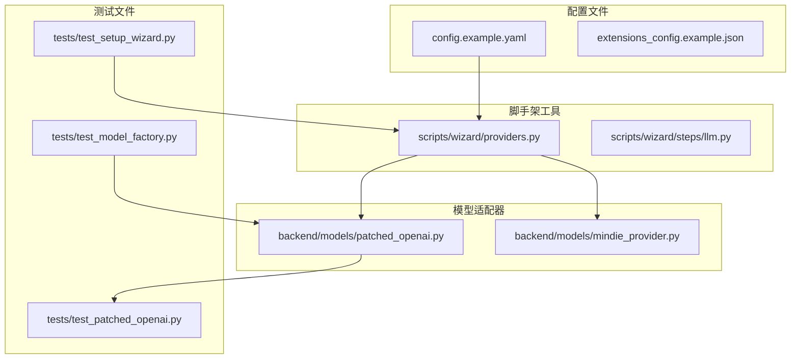
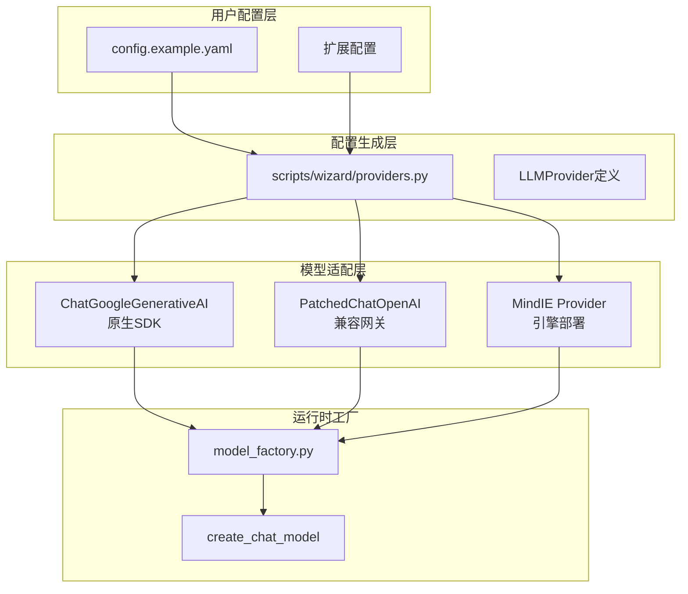
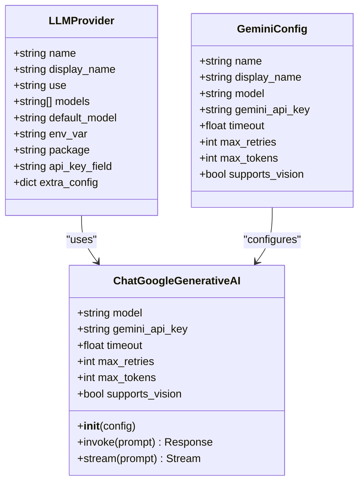
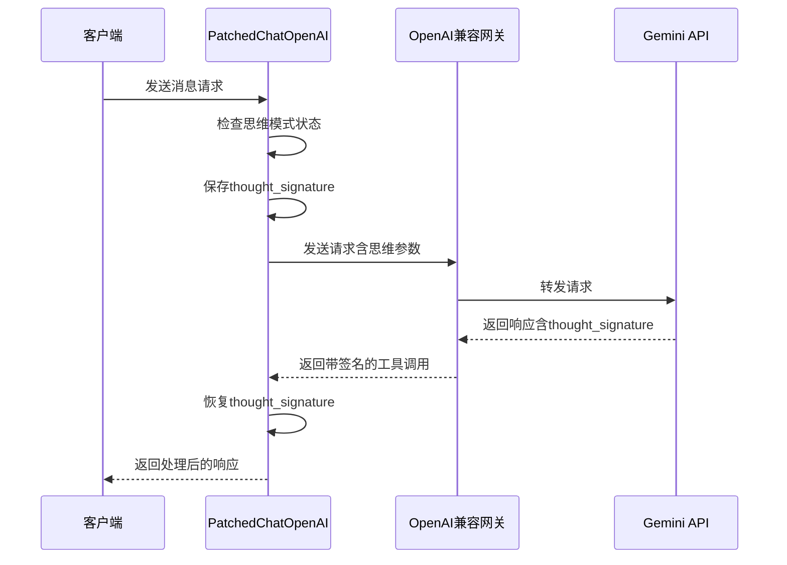
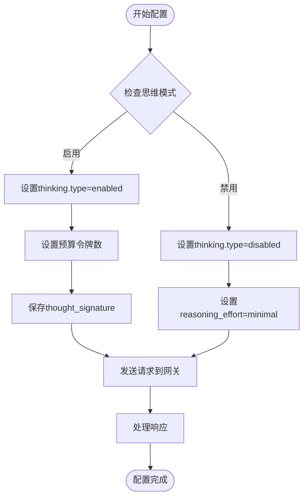
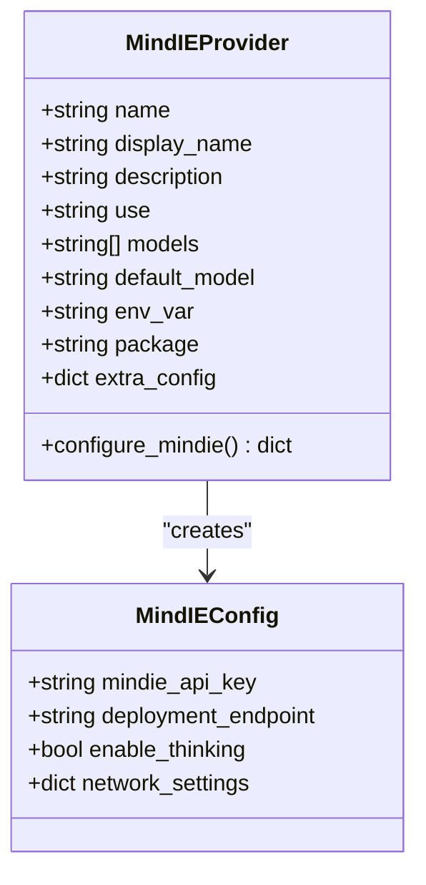
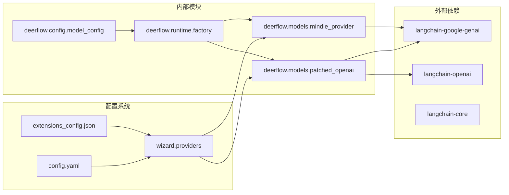

# Gemini模型配置

<cite>
**本文档引用的文件**
- [config.example.yaml](file://config.example.yaml)
- [providers.py](file://scripts/wizard/providers.py)
- [patched_openai.py](file://backend/packages/harness/deerflow/models/patched_openai.py)
- [mindie_provider.py](file://backend/packages/harness/deerflow/models/mindie_provider.py)
- [CONFIGURATION.md](file://backend/docs/CONFIGURATION.md)
- [test_setup_wizard.py](file://backend/tests/test_setup_wizard.py)
- [test_patched_openai.py](file://backend/tests/test_patched_openai.py)
- [test_model_factory.py](file://backend/tests/test_model_factory.py)
</cite>

## 目录
1. [简介](#简介)
2. [项目结构](#项目结构)
3. [核心组件](#核心组件)
4. [架构概览](#架构概览)
5. [详细组件分析](#详细组件分析)
6. [依赖关系分析](#依赖关系分析)
7. [性能考虑](#性能考虑)
8. [故障排除指南](#故障排除指南)
9. [结论](#结论)

## 简介

本指南详细说明了Google Gemini API在DeerFlow系统中的两种配置方式：原生SDK方式和OpenAI兼容网关方式。重点涵盖ChatGoogleGenerativeAI的配置参数、PatchedChatOpenAI适配器的思维模式支持、Gemini 2.5 Pro等具体模型的配置示例，以及MindIE引擎部署的特殊配置要求。

## 项目结构

DeerFlow系统中与Gemini配置相关的核心文件分布如下：

**图表来源**
- [config.example.yaml](file://config.example.yaml)
- [providers.py](file://scripts/wizard/providers.py)
- [patched_openai.py](file://backend/packages/harness/deerflow/models/patched_openai.py)

**章节来源**
- [config.example.yaml](file://config.example.yaml)
- [providers.py](file://scripts/wizard/providers.py)

## 核心组件

### 原生SDK配置组件

原生Google Gemini SDK通过ChatGoogleGenerativeAI实现，主要配置参数包括：

- **gemini_api_key**: API密钥字段名，使用环境变量$GEMINI_API_KEY
- **模型名称**: 支持gemini-2.5-pro和gemini-2.0-flash等
- **超时设置**: 默认600.0秒
- **最大重试次数**: 默认2次
- **最大令牌数**: 默认8192
- **视觉支持**: supports_vision: true

### OpenAI兼容网关组件

通过PatchedChatOpenAI适配器实现，支持思维模式：

- **适配器类**: deerflow.models.patched_openai:PatchedChatOpenAI
- **模型名称**: google/gemini-2.5-pro-preview
- **基础URL**: https://<your-openai-compat-gateway>/v1
- **思维模式**: supports_thinking: true
- **视觉支持**: supports_vision: true

**章节来源**
- [providers.py](file://scripts/wizard/providers.py)
- [config.example.yaml](file://config.example.yaml)

## 架构概览

**图表来源**
- [providers.py](file://scripts/wizard/providers.py)
- [patched_openai.py](file://backend/packages/harness/deerflow/models/patched_openai.py)
- [mindie_provider.py](file://backend/packages/harness/deerflow/models/mindie_provider.py)

## 详细组件分析

### ChatGoogleGenerativeAI配置分析

ChatGoogleGenerativeAI作为原生SDK适配器，具有以下特性：

**图表来源**
- [providers.py](file://scripts/wizard/providers.py)
- [config.example.yaml](file://config.example.yaml)

#### 配置参数详解

| 参数名称 | 类型 | 默认值 | 描述 |
|---------|------|--------|------|
| gemini_api_key | string | $GEMINI_API_KEY | Gemini API密钥环境变量 |
| timeout | float | 600.0 | 请求超时时间（秒） |
| max_retries | int | 2 | 最大重试次数 |
| max_tokens | int | 8192 | 最大返回令牌数 |
| supports_vision | bool | true | 是否支持视觉理解 |

**章节来源**
- [providers.py](file://scripts/wizard/providers.py)
- [config.example.yaml](file://config.example.yaml)

### PatchedChatOpenAI适配器分析

PatchedChatOpenAI专门用于支持Gemini思维模式的OpenAI兼容网关：

**图表来源**
- [patched_openai.py](file://backend/packages/harness/deerflow/models/patched_openai.py)
- [CONFIGURATION.md](file://backend/docs/CONFIGURATION.md)

#### 思维模式配置流程

**图表来源**
- [test_model_factory.py](file://backend/tests/test_model_factory.py)
- [patched_openai.py](file://backend/packages/harness/deerflow/models/patched_openai.py)

**章节来源**
- [patched_openai.py](file://backend/packages/harness/deerflow/models/patched_openai.py)
- [CONFIGURATION.md](file://backend/docs/CONFIGURATION.md)

### MindIE引擎部署配置

MindIE提供特殊的Gemini部署选项：

**图表来源**
- [mindie_provider.py](file://backend/packages/harness/deerflow/models/mindie_provider.py)

#### MindIE特殊配置要求

- **MindIE API密钥**: 使用专用的mindie_api_key字段
- **部署端点**: 指定具体的MindIE部署URL
- **网络设置**: 包含防火墙和代理配置
- **思维模式**: 可选的思维模式支持

**章节来源**
- [mindie_provider.py](file://backend/packages/harness/deerflow/models/mindie_provider.py)

## 依赖关系分析

**图表来源**
- [providers.py](file://scripts/wizard/providers.py)
- [patched_openai.py](file://backend/packages/harness/deerflow/models/patched_openai.py)
- [mindie_provider.py](file://backend/packages/harness/deerflow/models/mindie_provider.py)

**章节来源**
- [providers.py](file://scripts/wizard/providers.py)

## 性能考虑

### 超时和重试策略

- **默认超时**: 600.0秒适用于长对话和复杂推理
- **重试机制**: 最大2次重试，避免无限循环
- **令牌限制**: 8192的最大令牌数平衡成本和质量

### 网络优化

- **MindIE部署**: 优先考虑就近数据中心部署
- **缓存策略**: 合理利用模型响应缓存
- **连接池**: 复用HTTP连接减少延迟

## 故障排除指南

### 常见问题及解决方案

| 问题类型 | 症状 | 解决方案 |
|---------|------|----------|
| API密钥错误 | 认证失败 | 检查环境变量GEMINI_API_KEY |
| 思维模式失效 | 400错误 | 确保使用PatchedChatOpenAI而非标准ChatOpenAI |
| 视觉功能异常 | 图像处理失败 | 验证supports_vision设置为true |
| 网络连接问题 | 超时或连接失败 | 检查防火墙和代理设置 |

### 测试验证

系统提供了完整的测试套件验证配置正确性：

- **配置向导测试**: 验证Gemini API密钥字段使用
- **思维模式测试**: 确认thought_signature保持
- **工厂创建测试**: 验证模型实例化过程

**章节来源**
- [test_setup_wizard.py](file://backend/tests/test_setup_wizard.py)
- [test_patched_openai.py](file://backend/tests/test_patched_openai.py)
- [test_model_factory.py](file://backend/tests/test_model_factory.py)

## 结论

DeerFlow系统为Google Gemini提供了灵活的双配置模式：

1. **原生SDK模式**: 简单直接，适合基本对话场景
2. **兼容网关模式**: 功能完整，支持高级思维模式
3. **MindIE部署**: 企业级部署选项

选择合适的配置方式取决于具体需求：如果需要完整的思维模式支持，推荐使用OpenAI兼容网关配合PatchedChatOpenAI；如果只需要基础功能，原生SDK方式更加简洁高效。