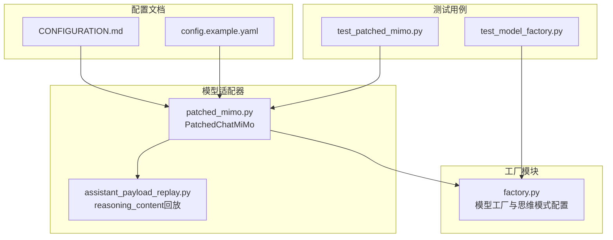
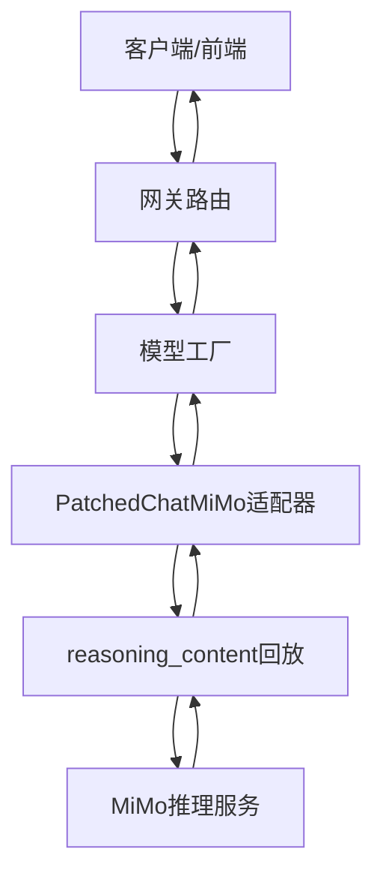
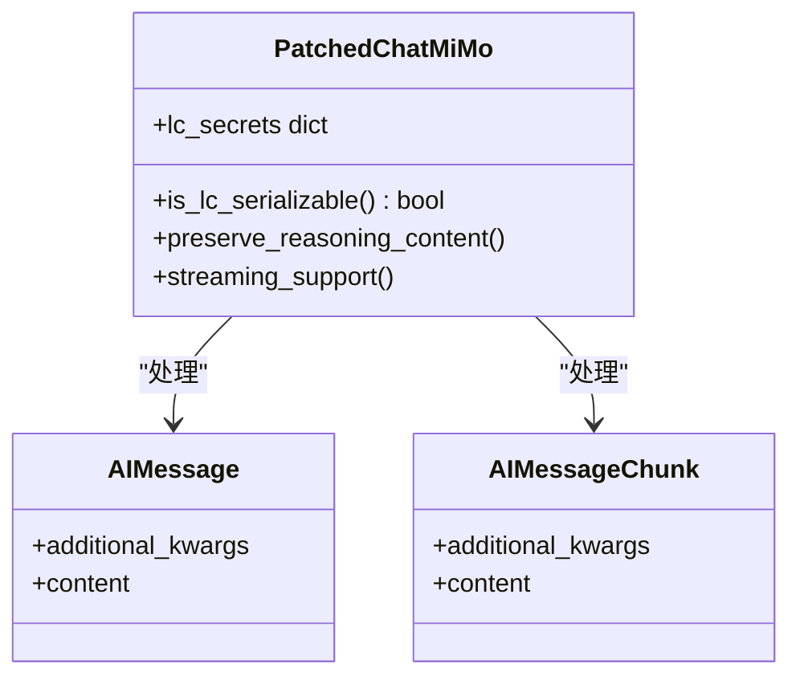
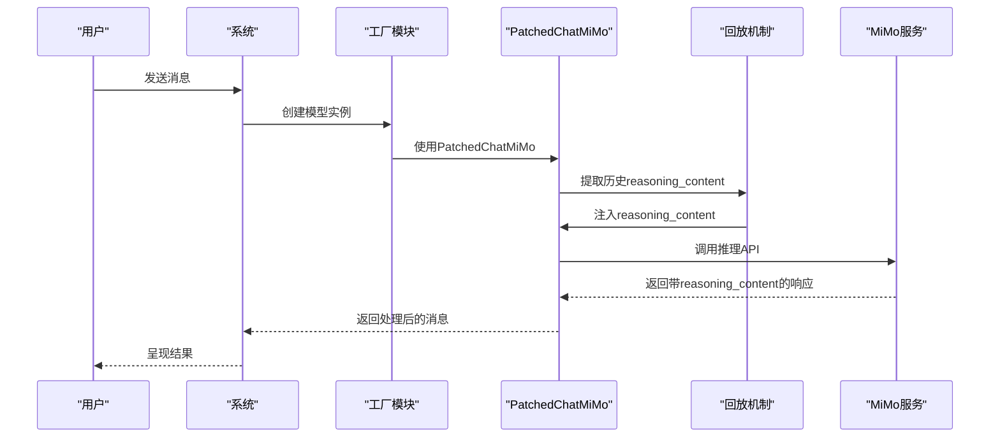
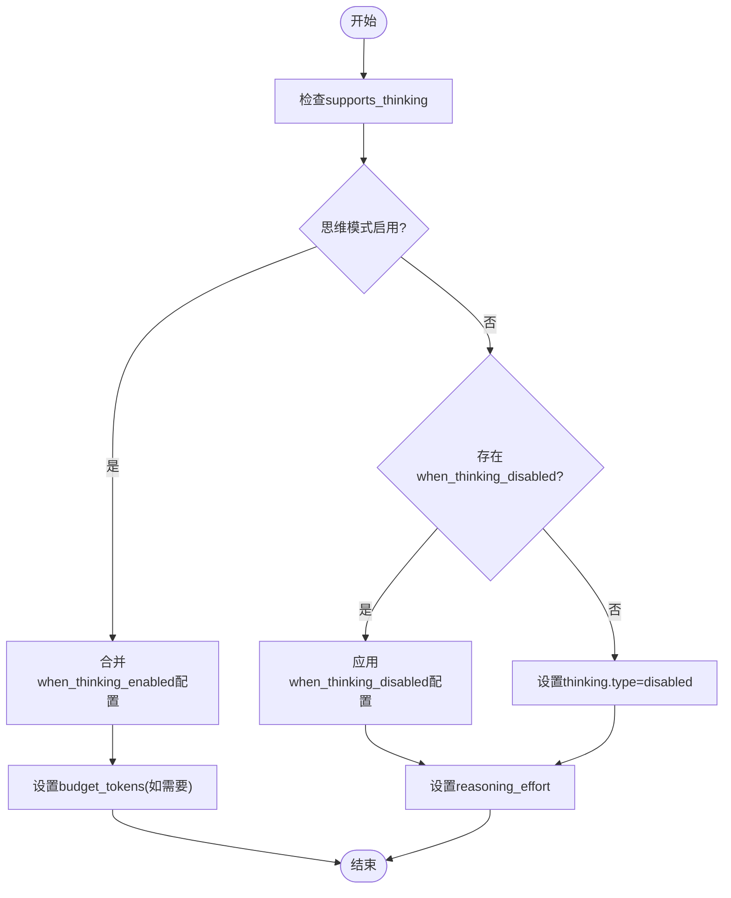
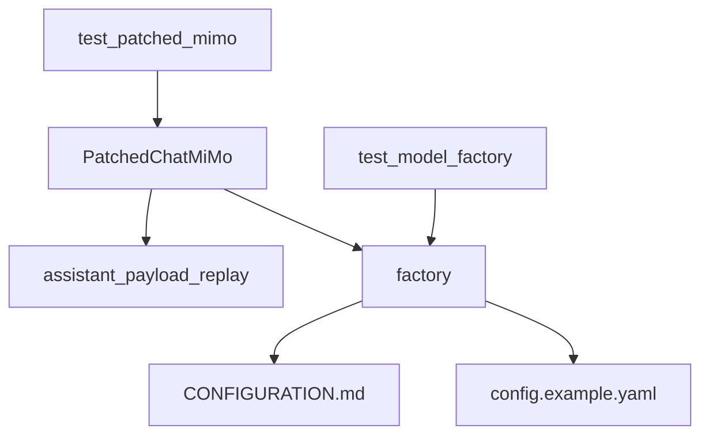

# MiMo模型配置

<cite>
**本文档引用的文件**
- [patched_mimo.py](file://backend/packages/harness/deerflow/models/patched_mimo.py)
- [CONFIGURATION.md](file://backend/docs/CONFIGURATION.md)
- [test_patched_mimo.py](file://backend/tests/test_patched_mimo.py)
- [assistant_payload_replay.py](file://backend/packages/harness/deerflow/models/assistant_payload_replay.py)
- [factory.py](file://backend/packages/harness/deerflow/models/factory.py)
- [config.example.yaml](file://config.example.yaml)
- [test_model_factory.py](file://backend/tests/test_model_factory.py)
</cite>

## 目录
1. [简介](#简介)
2. [项目结构](#项目结构)
3. [核心组件](#核心组件)
4. [架构概览](#架构概览)
5. [详细组件分析](#详细组件分析)
6. [依赖关系分析](#依赖关系分析)
7. [性能考虑](#性能考虑)
8. [故障排除指南](#故障排除指南)
9. [结论](#结论)
10. [附录](#附录)

## 简介
本指南详细说明了Xiaomi MiMo推理模型在DeerFlow系统中的配置方法，重点涵盖以下方面：
- API密钥与基础URL配置
- 思维模式（reasoning_content）处理机制
- 多轮对话中的回放机制
- 认证方式：Pay-as-you-go与Token Plan的区别与配置
- 模型配置示例：mimo-v2.5-pro、mimo-v2.5等
- budget_tokens参数设置要求
- 故障排除与最佳实践

## 项目结构
MiMo配置涉及后端模型适配器、配置文档、测试用例以及工厂模块等多个组件。下图展示了与MiMo配置相关的核心文件及其关系：

**图表来源**
- [CONFIGURATION.md](file://backend/docs/CONFIGURATION.md)
- [config.example.yaml](file://config.example.yaml)
- [patched_mimo.py](file://backend/packages/harness/deerflow/models/patched_mimo.py)
- [assistant_payload_replay.py](file://backend/packages/harness/deerflow/models/assistant_payload_replay.py)
- [factory.py](file://backend/packages/harness/deerflow/models/factory.py)
- [test_patched_mimo.py](file://backend/tests/test_patched_mimo.py)
- [test_model_factory.py](file://backend/tests/test_model_factory.py)

**章节来源**
- [CONFIGURATION.md](file://backend/docs/CONFIGURATION.md)
- [config.example.yaml](file://config.example.yaml)

## 核心组件
本节介绍MiMo配置的关键组件及职责：
- PatchedChatMiMo：针对MiMo思维模式的ChatOpenAI适配器，负责保留reasoning_content字段
- reasoning_content回放机制：在多轮对话中恢复历史reasoning_content，避免MiMo API返回HTTP 400
- 工厂模块：根据配置动态注入思维模式参数（如thinking.type、budget_tokens）

**章节来源**
- [patched_mimo.py](file://backend/packages/harness/deerflow/models/patched_mimo.py)
- [assistant_payload_replay.py](file://backend/packages/harness/deerflow/models/assistant_payload_replay.py)
- [factory.py](file://backend/packages/harness/deerflow/models/factory.py)

## 架构概览
下图展示了MiMo配置在系统中的整体架构与数据流：

**图表来源**
- [patched_mimo.py](file://backend/packages/harness/deerflow/models/patched_mimo.py)
- [assistant_payload_replay.py](file://backend/packages/harness/deerflow/models/assistant_payload_replay.py)
- [factory.py](file://backend/packages/harness/deerflow/models/factory.py)

## 详细组件分析

### PatchedChatMiMo适配器
PatchedChatMiMo是基于ChatOpenAI的适配器，专门用于MiMo思维模式下的reasoning_content字段处理。其核心特性包括：
- 保持reasoning_content在消息中的完整性
- 支持流式响应中的delta.reasoning_content
- 在请求历史中保留assistant消息的reasoning_content

**图表来源**
- [patched_mimo.py](file://backend/packages/harness/deerflow/models/patched_mimo.py)

**章节来源**
- [patched_mimo.py](file://backend/packages/harness/deerflow/models/patched_mimo.py)
- [test_patched_mimo.py](file://backend/tests/test_patched_mimo.py)

### reasoning_content回放机制
在多轮对话中，MiMo API要求后续请求必须保留历史assistant消息中的reasoning_content，否则会返回HTTP 400。回放机制通过以下步骤实现：
- 从原始AIMessage提取reasoning_content
- 将reasoning_content注入到当前请求的消息结构中
- 确保后续请求携带完整的reasoning_content链路

**图表来源**
- [assistant_payload_replay.py](file://backend/packages/harness/deerflow/models/assistant_payload_replay.py)
- [patched_mimo.py](file://backend/packages/harness/deerflow/models/patched_mimo.py)

**章节来源**
- [assistant_payload_replay.py](file://backend/packages/harness/deerflow/models/assistant_payload_replay.py)
- [CONFIGURATION.md](file://backend/docs/CONFIGURATION.md)

### 思维模式配置与工厂模块
工厂模块负责根据配置动态注入思维模式参数，包括：
- thinking.enabled/disabled状态
- budget_tokens参数设置
- reasoning_effort级别

**图表来源**
- [factory.py](file://backend/packages/harness/deerflow/models/factory.py)
- [test_model_factory.py](file://backend/tests/test_model_factory.py)

**章节来源**
- [factory.py](file://backend/packages/harness/deerflow/models/factory.py)
- [test_model_factory.py](file://backend/tests/test_model_factory.py)

## 依赖关系分析
MiMo配置涉及多个模块间的依赖关系，如下图所示：

**图表来源**
- [patched_mimo.py](file://backend/packages/harness/deerflow/models/patched_mimo.py)
- [assistant_payload_replay.py](file://backend/packages/harness/deerflow/models/assistant_payload_replay.py)
- [factory.py](file://backend/packages/harness/deerflow/models/factory.py)
- [CONFIGURATION.md](file://backend/docs/CONFIGURATION.md)
- [config.example.yaml](file://config.example.yaml)
- [test_patched_mimo.py](file://backend/tests/test_patched_mimo.py)
- [test_model_factory.py](file://backend/tests/test_model_factory.py)

**章节来源**
- [patched_mimo.py](file://backend/packages/harness/deerflow/models/patched_mimo.py)
- [factory.py](file://backend/packages/harness/deerflow/models/factory.py)
- [CONFIGURATION.md](file://backend/docs/CONFIGURATION.md)

## 性能考虑
- reasoning_content回放会增加请求处理开销，建议在思维模式启用时使用
- budget_tokens参数可用于控制思维模式的计算成本
- 流式响应中reasoning_content的处理可能影响延迟，需根据业务需求权衡

## 故障排除指南
常见问题与解决方案：
- HTTP 400错误：确保reasoning_content在多轮对话中正确回放
- 思维模式不生效：检查supports_thinking配置与when_thinking_enabled设置
- 认证失败：确认API密钥类型与基础URL匹配（Pay-as-you-go vs Token Plan）

**章节来源**
- [CONFIGURATION.md](file://backend/docs/CONFIGURATION.md)
- [test_patched_mimo.py](file://backend/tests/test_patched_mimo.py)

## 结论
MiMo模型配置的关键在于正确处理reasoning_content字段并在多轮对话中保持其一致性。通过PatchedChatMiMo适配器、回放机制与工厂模块的协同工作，可以实现稳定的思维模式运行。Pay-as-you-go与Token Plan两种认证方式需要分别使用对应的API密钥与基础URL。

## 附录

### API文档链接
- MiMo官方API文档：[https://www.xiaomimimo.com/docs](https://www.xiaomimimo.com/docs)

### 配置示例路径
- MiMo V2.5 Pro配置示例：[CONFIGURATION.md](file://backend/docs/CONFIGURATION.md)
- 完整配置模板：[config.example.yaml](file://config.example.yaml)

### 关键参数说明
- MIMO_API_KEY：环境变量名，用于存储MiMo API密钥
- base_url：根据认证方式选择不同的基础URL
- thinking.type：启用或禁用思维模式
- budget_tokens：限制思维模式的计算预算

**章节来源**
- [CONFIGURATION.md](file://backend/docs/CONFIGURATION.md)
- [config.example.yaml](file://config.example.yaml)