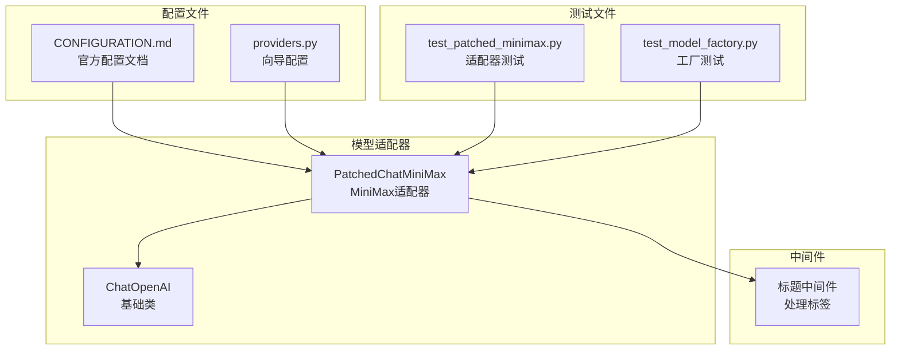
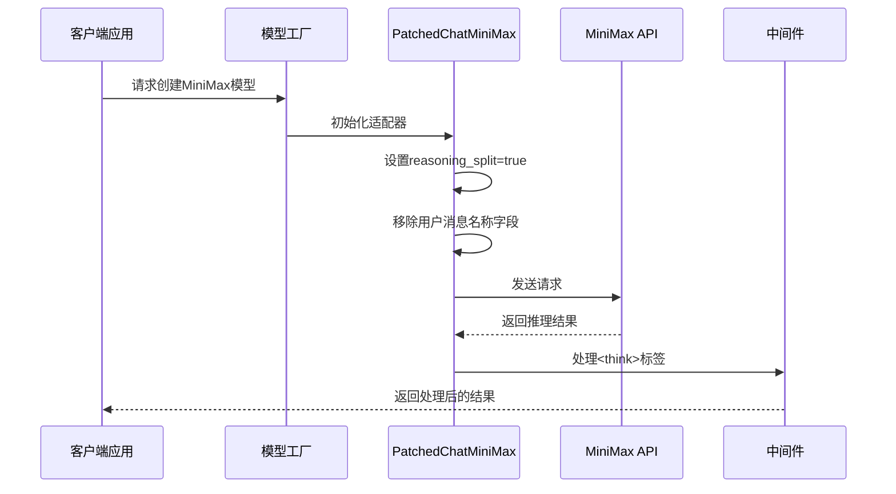
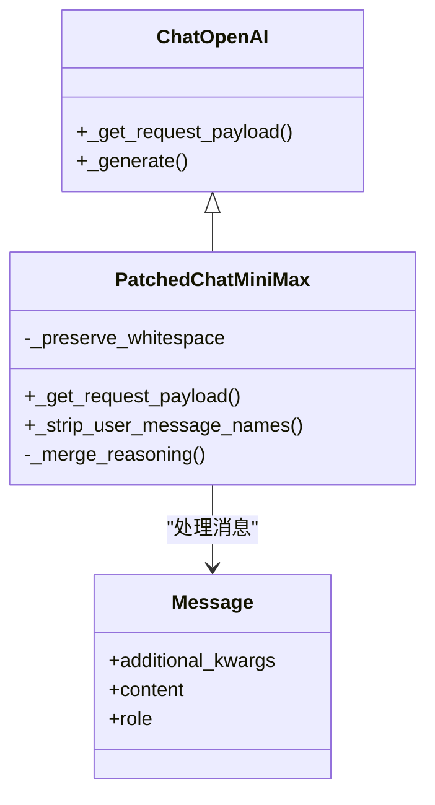
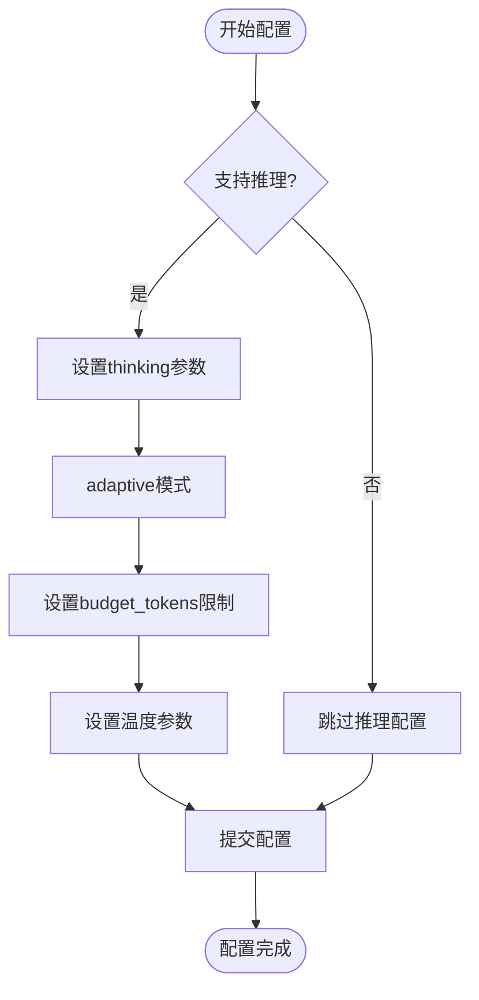
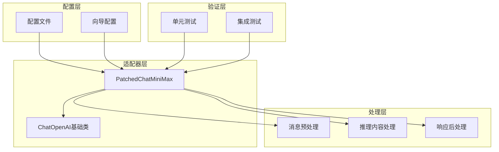
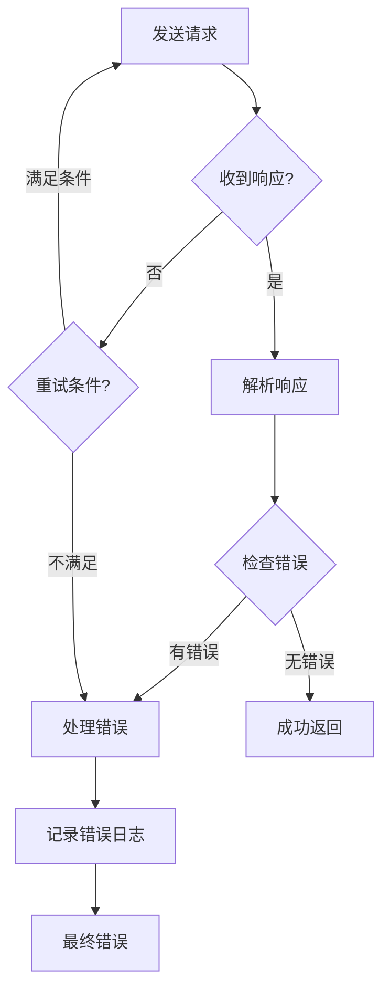

# MiniMax模型配置

<cite>
**本文档引用的文件**
- [patched_minimax.py](file://backend/packages/harness/deerflow/models/patched_minimax.py)
- [test_patched_minimax.py](file://backend/tests/test_patched_minimax.py)
- [CONFIGURATION.md](file://backend/docs/CONFIGURATION.md)
- [providers.py](file://scripts/wizard/providers.py)
- [test_model_factory.py](file://backend/tests/test_model_factory.py)
- [title_middleware.py](file://backend/packages/harness/deerflow/agents/middlewares/title_middleware.py)
</cite>

## 目录
1. [简介](#简介)
2. [项目结构](#项目结构)
3. [核心组件](#核心组件)
4. [架构概览](#架构概览)
5. [详细组件分析](#详细组件分析)
6. [依赖关系分析](#依赖关系分析)
7. [性能考虑](#性能考虑)
8. [故障排除指南](#故障排除指南)
9. [结论](#结论)

## 简介

本文档提供了MiniMax模型在DeerFlow平台中的完整配置指南。MiniMax是字节跳动开发的大语言模型系列，支持OpenAI兼容的API接口。本指南详细说明了如何配置MiniMax模型，包括API密钥、基础URL、模型参数等关键配置项。

特别关注PatchedChatMiniMax适配器的作用，该适配器专门处理MiniMax的推理输出格式，确保推理内容能够正确保留和传输。文档还详细解释了思维模式配置、温度参数的特殊要求，以及不同MiniMax模型（M3、M2.7等）的配置差异。

## 项目结构

在DeerFlow代码库中，MiniMax相关配置分布在以下关键位置：



**图表来源**
- [patched_minimax.py:98-122](file://backend/packages/harness/deerflow/models/patched_minimax.py#L98-L122)
- [CONFIGURATION.md:82-133](file://backend/docs/CONFIGURATION.md#L82-L133)
- [providers.py:311-350](file://scripts/wizard/providers.py#L311-L350)

**章节来源**
- [patched_minimax.py:98-122](file://backend/packages/harness/deerflow/models/patched_minimax.py#L98-L122)
- [CONFIGURATION.md:82-133](file://backend/docs/CONFIGURATION.md#L82-L133)
- [providers.py:311-350](file://scripts/wizard/providers.py#L311-L350)

## 核心组件

### PatchedChatMiniMax适配器

PatchedChatMiniMax是专门为MiniMax设计的ChatOpenAI适配器，主要解决以下问题：

1. **推理分割功能**：通过设置`reasoning_split: true`确保MiniMax的推理内容能够正确返回
2. **消息名称字段处理**：移除用户角色消息中的`name`字段，避免MiniMax API报错
3. **推理内容保留**：正确处理和保留MiniMax的推理输出

### 温度参数要求

MiniMax API对温度参数有严格限制：
- 必须在开区间(0.0, 1.0]范围内
- 建议使用1.0作为默认值
- 超出此范围会导致API调用失败

### 支持的MiniMax模型

| 模型名称 | 显示名称 | 视觉支持 | 推理支持 | 基础URL |
|---------|---------|---------|---------|--------|
| MiniMax-M3 | MiniMax M3 | 是 | 是 | https://api.minimax.io/v1 |
| MiniMax-M2.7 | MiniMax M2.7 | 否 | 是 | https://api.minimax.io/v1 |
| MiniMax-M2.7-highspeed | MiniMax M2.7 Highspeed | 否 | 是 | https://api.minimax.io/v1 |

**章节来源**
- [patched_minimax.py:98-122](file://backend/packages/harness/deerflow/models/patched_minimax.py#L98-L122)
- [CONFIGURATION.md:98-126](file://backend/docs/CONFIGURATION.md#L98-L126)
- [providers.py:311-350](file://scripts/wizard/providers.py#L311-L350)

## 架构概览

MiniMax配置的整体架构如下：



**图表来源**
- [patched_minimax.py:101-118](file://backend/packages/harness/deerflow/models/patched_minimax.py#L101-L118)
- [title_middleware.py:112](file://backend/packages/harness/deerflow/agents/middlewares/title_middleware.py#L112)

## 详细组件分析

### PatchedChatMiniMax类实现

PatchedChatMiniMax继承自ChatOpenAI，重写了请求载荷生成和消息处理逻辑：



**图表来源**
- [patched_minimax.py:98-122](file://backend/packages/harness/deerflow/models/patched_minimax.py#L98-L122)

#### 关键方法分析

1. **_get_request_payload方法**：
   - 调用父类方法生成基础载荷
   - 添加`reasoning_split: true`参数
   - 调用消息名称清理方法

2. **_strip_user_message_names方法**：
   - 移除用户角色消息中的`name`字段
   - 避免MiniMax API的"用户名必须一致"错误

3. **推理内容处理**：
   - 支持保留空白字符或合并推理内容
   - 正确处理多段推理输出

**章节来源**
- [patched_minimax.py:98-122](file://backend/packages/harness/deerflow/models/patched_minimax.py#L98-L122)

### 思维模式配置

MiniMax支持多种思维模式配置：



**图表来源**
- [CONFIGURATION.md:98-126](file://backend/docs/CONFIGURATION.md#L98-L126)

#### adaptive模式设置

- 自适应推理模式，根据任务复杂度动态调整推理深度
- 适用于需要智能推理能力的任务场景
- 可与budget_tokens配合使用以控制成本

#### budget_tokens限制

- 控制单次调用的推理预算
- 防止过度推理导致的成本失控
- 建议根据任务复杂度合理设置

**章节来源**
- [CONFIGURATION.md:98-126](file://backend/docs/CONFIGURATION.md#L98-L126)

### 不同模型配置示例

#### MiniMax M3配置

```yaml
models:
  - name: minimax-m3
    display_name: MiniMax M3
    use: langchain_openai:ChatOpenAI
    model: MiniMax-M3
    api_key: $MINIMAX_API_KEY
    base_url: https://api.minimax.io/v1
    max_tokens: 4096
    temperature: 1.0  # MiniMax要求温度在(0.0, 1.0]
    supports_vision: true
    supports_thinking: true
```

#### MiniMax M2.7配置

```yaml
models:
  - name: minimax-m2.7
    display_name: MiniMax M2.7
    use: langchain_openai:ChatOpenAI
    model: MiniMax-M2.7
    api_key: $MINIMAX_API_KEY
    base_url: https://api.minimax.io/v1
    max_tokens: 4096
    temperature: 1.0
    supports_vision: false  # M2.7是纯文本模型
    supports_thinking: true
```

**章节来源**
- [CONFIGURATION.md:98-126](file://backend/docs/CONFIGURATION.md#L98-L126)

### 国际版与国内版配置

#### 国际版MiniMax (Minimax Global)

```python
LLMProvider(
    name="minimax",
    display_name="MiniMax",
    description="国际OpenAI兼容端点",
    use="langchain_openai:ChatOpenAI",
    models=["MiniMax-M3", "MiniMax-M2.7", "MiniMax-M2.7-highspeed"],
    default_model="MiniMax-M3",
    env_var="MINIMAX_API_KEY",
    package="langchain-openai",
    extra_config={
        "base_url": "https://api.minimax.io/v1",  # 国际版基础URL
        "request_timeout": 600.0,
        "max_retries": 2,
        "max_tokens": 4096,
        "temperature": 1.0,
        "supports_vision": True,
        "supports_thinking": True,
    },
    model_vision_overrides={
        "MiniMax-M2.7": False,
        "MiniMax-M2.7-highspeed": False,
    },
)
```

#### 中国版MiniMax (Minimax CN)

```python
LLMProvider(
    name="minimax_cn",
    display_name="MiniMax CN",
    description="中国OpenAI兼容端点",
    use="langchain_openai:ChatOpenAI",
    models=["MiniMax-M3", "MiniMax-M2.7", "MiniMax-M2.7-highspeed"],
    default_model="MiniMax-M3",
    env_var="MINIMAX_API_KEY",
    package="langchain-openai",
    extra_config={
        "base_url": "https://api.minimaxi.com/v1",  # 中国版基础URL
        "request_timeout": 600.0,
        "max_retries": 2,
        "max_tokens": 4096,
        "temperature": 1.0,
        "supports_vision": True,
        "supports_thinking": True,
    },
    model_vision_overrides={
        "MiniMax-M2.7": False,
        "MiniMax-M2.7-highspeed": False,
    },
)
```

**章节来源**
- [providers.py:311-350](file://scripts/wizard/providers.py#L311-L350)

## 依赖关系分析

MiniMax配置涉及多个组件的协同工作：



**图表来源**
- [patched_minimax.py:98-122](file://backend/packages/harness/deerflow/models/patched_minimax.py#L98-L122)
- [test_patched_minimax.py](file://backend/tests/test_patched_minimax.py)

### 关键依赖关系

1. **配置到适配器**：配置文件驱动PatchedChatMiniMax的初始化
2. **适配器到基础类**：PatchedChatMiniMax继承ChatOpenAI的所有功能
3. **消息处理链**：从输入消息到输出响应的完整处理流程
4. **测试验证**：通过单元测试确保配置正确性

**章节来源**
- [patched_minimax.py:98-122](file://backend/packages/harness/deerflow/models/patched_minimax.py#L98-L122)
- [test_patched_minimax.py](file://backend/tests/test_patched_minimax.py)

## 性能考虑

### 最佳实践

1. **温度参数优化**
   - 使用1.0作为默认值，平衡生成质量和稳定性
   - 对于需要确定性输出的任务，可适当降低温度

2. **令牌限制设置**
   - 根据任务复杂度设置合理的max_tokens
   - 避免过大的max_tokens导致成本过高

3. **超时和重试配置**
   - 设置适当的请求超时时间（默认600秒）
   - 配置合理的重试次数（默认2次）

4. **推理预算控制**
   - 使用budget_tokens限制推理成本
   - 结合adaptive模式实现智能成本控制

### 错误处理策略



**图表来源**
- [test_patched_minimax.py](file://backend/tests/test_patched_minimax.py)

## 故障排除指南

### 常见问题及解决方案

1. **API密钥认证失败**
   - 检查环境变量MINIMAX_API_KEY是否正确设置
   - 验证API密钥的有效性和权限

2. **温度参数错误**
   - 确保温度值在(0.0, 1.0]范围内
   - 避免使用0.0或大于1.0的值

3. **推理内容丢失**
   - 确认已启用reasoning_split功能
   - 检查消息名称字段是否被正确移除

4. **视觉功能异常**
   - 验证模型是否支持视觉功能
   - 检查M3和M2.7模型的区别配置

### 调试步骤

1. **启用详细日志**
   - 在配置中添加日志级别设置
   - 监控API调用的详细信息

2. **单元测试验证**
   - 运行test_patched_minimax.py进行功能测试
   - 验证适配器的各项功能正常

3. **配置文件检查**
   - 对比官方配置示例
   - 确认所有必需参数都已设置

**章节来源**
- [test_patched_minimax.py](file://backend/tests/test_patched_minimax.py)
- [test_model_factory.py:566-600](file://backend/tests/test_model_factory.py#L566-L600)

## 结论

MiniMax模型在DeerFlow中的配置相对简单，但需要注意几个关键细节：

1. **PatchedChatMiniMax适配器**是确保MiniMax功能正常工作的核心组件
2. **温度参数**必须严格遵守(0.0, 1.0]的范围要求
3. **推理分割功能**和**消息名称处理**是避免API错误的关键
4. **不同模型版本**有不同的功能特性，需要分别配置

通过遵循本文档的配置指南和最佳实践，可以确保MiniMax模型在DeerFlow环境中稳定运行，并充分发挥其推理能力和性能优势。