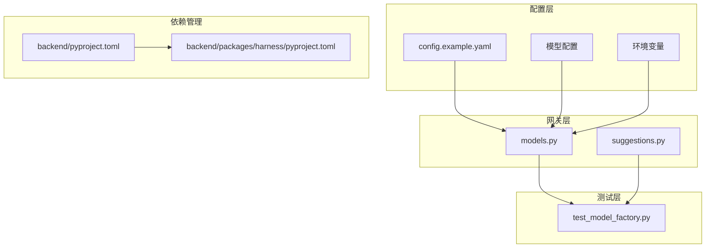
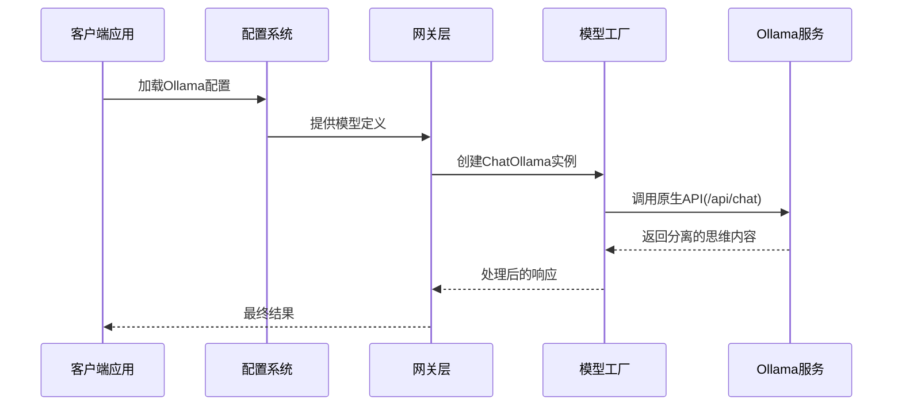
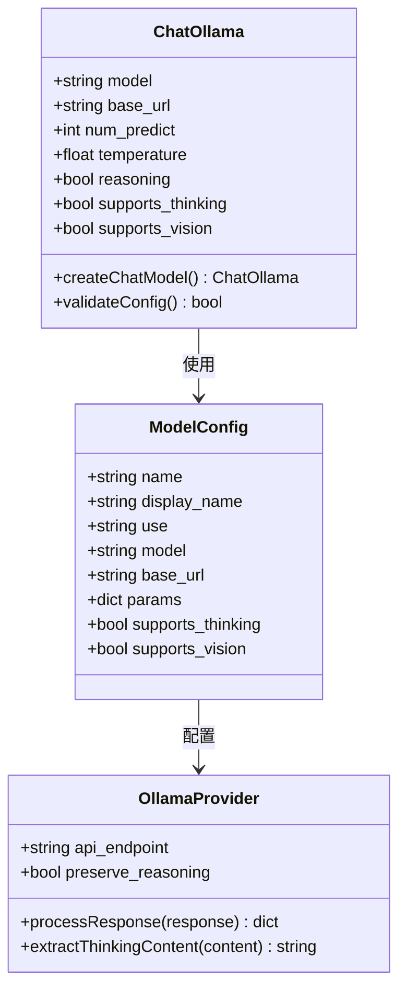
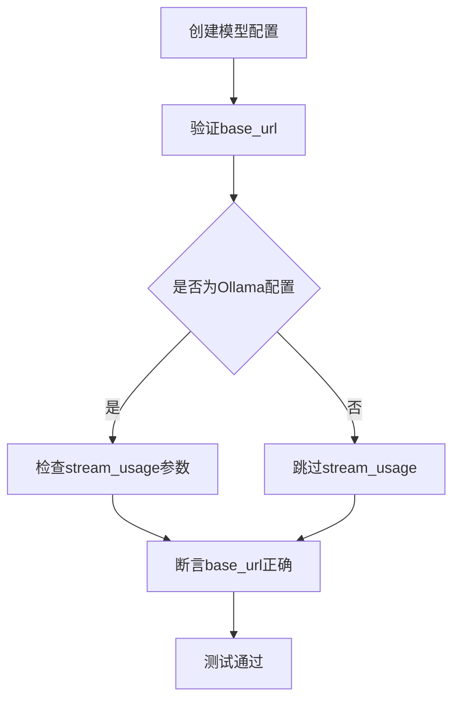
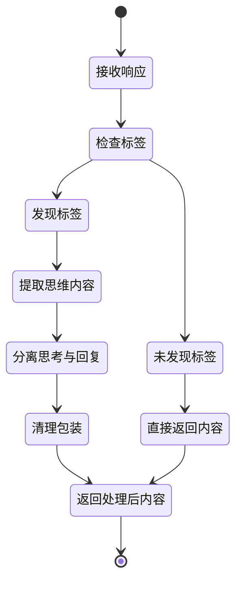
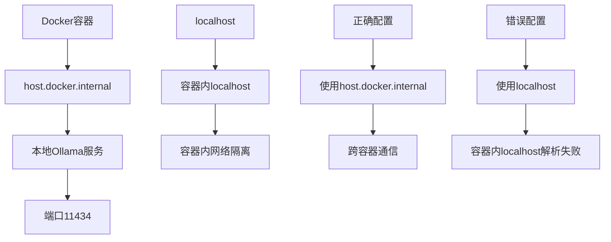

# Ollama本地模型配置

<cite>
**本文档引用的文件**
- [config.example.yaml](file://config.example.yaml)
- [test_model_factory.py](file://backend/tests/test_model_factory.py)
- [models.py](file://backend/app/gateway/routers/models.py)
- [suggestions.py](file://backend/app/gateway/routers/suggestions.py)
- [pyproject.toml](file://backend/packages/harness/pyproject.toml)
- [pyproject.toml](file://backend/pyproject.toml)
</cite>

## 目录
1. [简介](#简介)
2. [项目结构](#项目结构)
3. [核心组件](#核心组件)
4. [架构概览](#架构概览)
5. [详细组件分析](#详细组件分析)
6. [依赖关系分析](#依赖关系分析)
7. [性能考虑](#性能考虑)
8. [故障排除指南](#故障排除指南)
9. [结论](#结论)

## 简介

本文档提供了deer-flow项目中Ollama本地模型配置的详细指南。重点说明如何正确配置langchain_ollama:ChatOllama以实现思维内容分离，包括base_url配置、模型ID格式、reasoning参数作用以及supports_thinking设置。文档还提供了Qwen3、Gemma4等具体模型的配置示例，并解释了Docker部署时使用host.docker.internal替代localhost的方法。

## 项目结构

deer-flow项目采用模块化架构设计，其中Ollama配置主要涉及以下关键组件：



**图表来源**
- [config.example.yaml](file://config.example.yaml)
- [models.py](file://backend/app/gateway/routers/models.py)
- [test_model_factory.py](file://backend/tests/test_model_factory.py)

**章节来源**
- [config.example.yaml](file://config.example.yaml)
- [models.py](file://backend/app/gateway/routers/models.py)

## 核心组件

### Ollama配置核心要素

根据项目文档，Ollama配置的关键要素包括：

1. **模型提供程序选择**: 必须使用`langchain_ollama:ChatOllama`而非`langchain_openai:ChatOpenAI`
2. **基础URL配置**: 使用`http://localhost:11434`或`http://host.docker.internal:11434`
3. **思维模式支持**: 设置`supports_thinking: true`和`reasoning: true`
4. **参数优化**: 包括`num_predict`、`temperature`等参数

### 安装依赖包

项目要求安装特定的依赖包来支持Ollama功能：

```mermaid
flowchart TD
A[安装deerflow-harness[ollama]] --> B[启用Ollama支持]
B --> C[思维内容分离]
C --> D[原生API调用]
D --> E[正确处理<think>标签]
```

**图表来源**
- [config.example.yaml](file://config.example.yaml)

**章节来源**
- [config.example.yaml](file://config.example.yaml)

## 架构概览

deer-flow中的Ollama集成架构如下：



**图表来源**
- [config.example.yaml](file://config.example.yaml)
- [models.py](file://backend/app/gateway/routers/models.py)

## 详细组件分析

### 模型配置组件

#### ChatOllama配置类



**图表来源**
- [config.example.yaml](file://config.example.yaml)
- [models.py](file://backend/app/gateway/routers/models.py)

#### 具体模型配置示例

基于项目提供的配置示例，以下是Qwen3和Gemma4的完整配置：

**Qwen3配置要点**:
- 模型ID: `qwen3:32b`
- 基础URL: `http://localhost:11434` (无/v1后缀)
- 思维模式: `reasoning: true`
- 支持思维: `supports_thinking: true`
- 参数设置: `num_predict: 8192`, `temperature: 0.7`

**Gemma4配置要点**:
- 模型ID: `gemma4:27b`
- 基础URL: `http://localhost:11434`
- 视觉支持: `supports_vision: true`
- 其他参数与Qwen3相同

**章节来源**
- [config.example.yaml](file://config.example.yaml)

### 错误处理组件

#### 测试验证机制

项目包含专门的测试来验证Ollama配置的正确性：



**图表来源**
- [test_model_factory.py](file://backend/tests/test_model_factory.py)

**章节来源**
- [test_model_factory.py](file://backend/tests/test_model_factory.py)

### 思维内容处理组件

#### 推理内容规范化

项目实现了专门的推理内容处理机制：



**图表来源**
- [suggestions.py](file://backend/app/gateway/routers/suggestions.py)

**章节来源**
- [suggestions.py](file://backend/app/gateway/routers/suggestions.py)

## 依赖关系分析

### 依赖包管理

项目使用多个依赖包来支持不同的功能：

```mermaid
graph LR
subgraph "核心依赖"
A[deerflow-harness[ollama]]
B[langchain_ollama]
C[deerflow-harness]
end
subgraph "开发工具"
D[uv]
E[pyproject.toml]
F[backend/pyproject.toml]
end
subgraph "测试框架"
G[pytest]
H[test_model_factory.py]
end
A --> B
C --> A
D --> E
E --> F
F --> G
G --> H
```

**图表来源**
- [pyproject.toml](file://backend/packages/harness/pyproject.toml)
- [pyproject.toml](file://backend/pyproject.toml)

### Docker部署配置

#### 网络配置映射



**图表来源**
- [config.example.yaml](file://config.example.yaml)

**章节来源**
- [config.example.yaml](file://config.example.yaml)

## 性能考虑

### 参数优化建议

基于项目配置示例，以下是关键参数的性能考虑：

1. **num_predict参数**: 设置为8192可支持较长的输出内容
2. **temperature参数**: 设置为0.7提供平衡的创造性与稳定性
3. **连接池管理**: 建议使用默认连接池配置
4. **超时设置**: 根据模型大小调整请求超时时间

### 内存管理

- 大模型(如Qwen3 32B)需要充足的内存分配
- 合理设置GPU内存使用限制
- 监控模型加载时间

## 故障排除指南

### 常见问题及解决方案

#### 1. 思维内容未正确分离

**问题症状**: 推理内容被扁平化或丢失

**解决方法**:
- 确保使用`langchain_ollama:ChatOllama`而非OpenAI兼容端点
- 验证`reasoning: true`和`supports_thinking: true`设置
- 检查Ollama版本是否支持原生API

#### 2. 连接超时问题

**问题症状**: 请求超时或连接失败

**解决方法**:
- 检查Ollama服务状态
- 验证防火墙设置
- 确认Docker部署时使用`host.docker.internal`

#### 3. 依赖包安装问题

**问题症状**: 导入错误或功能不可用

**解决方法**:
- 使用`uv pip install 'deerflow-harness[ollama]'`安装
- 确认Python版本兼容性
- 检查虚拟环境激活状态

#### 4. 模型加载失败

**问题症状**: 模型无法加载或OOM错误

**解决方法**:
- 检查GPU内存可用性
- 调整模型量化设置
- 减少并发请求数量

**章节来源**
- [config.example.yaml](file://config.example.yaml)
- [test_model_factory.py](file://backend/tests/test_model_factory.py)

## 结论

通过正确配置deer-flow中的Ollama集成，可以实现高质量的思维内容分离和推理能力。关键在于使用原生ChatOllama接口、正确配置基础URL、启用思维模式支持，以及在Docker环境中使用host.docker.internal进行网络通信。

项目提供的测试用例和配置示例为Ollama集成提供了可靠的参考模板，确保在生产环境中能够稳定运行。建议在部署前充分测试配置并在监控下观察性能表现。