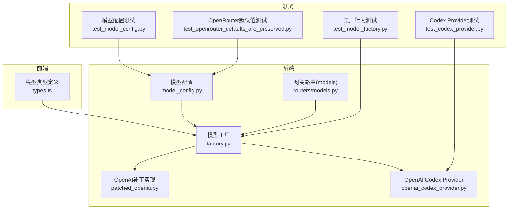
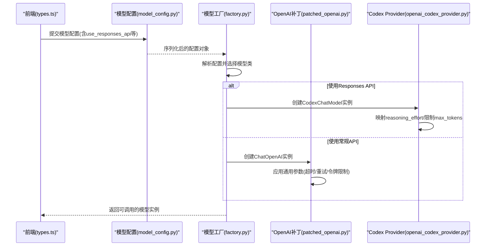
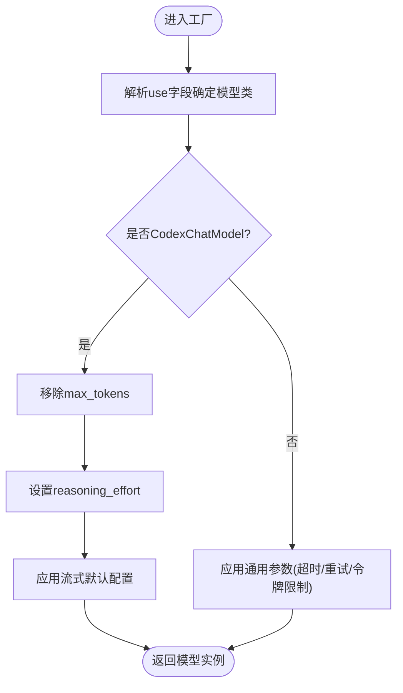
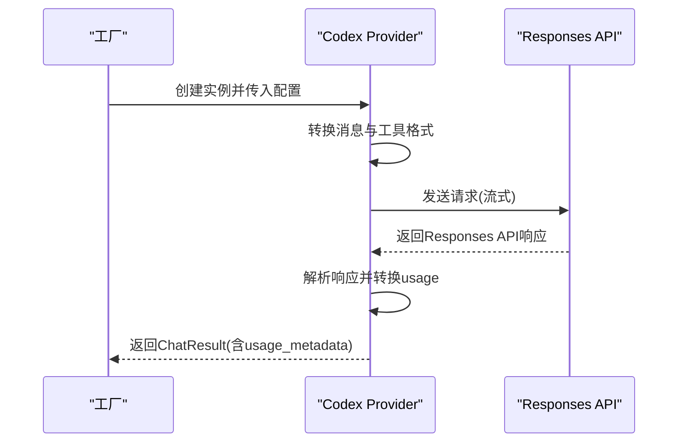
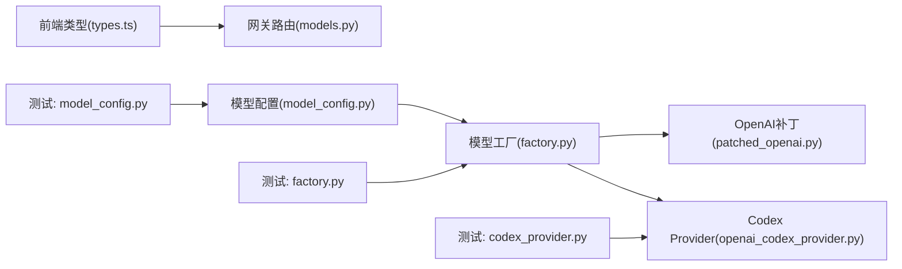

# OpenAI模型配置

<cite>
**本文引用的文件**
- [model_config.py](file://backend/packages/harness/deerflow/config/model_config.py)
- [factory.py](file://backend/packages/harness/deerflow/models/factory.py)
- [openai_codex_provider.py](file://backend/packages/harness/deerflow/models/openai_codex_provider.py)
- [patched_openai.py](file://backend/packages/harness/deerflow/models/patched_openai.py)
- [types.ts](file://frontend/src/core/models/types.ts)
- [models.py](file://backend/app/gateway/routers/models.py)
- [test_model_config.py](file://backend/tests/test_model_config.py)
- [test_model_factory.py](file://backend/tests/test_model_factory.py)
- [test_codex_provider.py](file://backend/tests/test_codex_provider.py)
- [test_openrouter_defaults_are_preserved.py](file://backend/tests/test_setup_wizard.py)
</cite>

## 目录
1. [简介](#简介)
2. [项目结构](#项目结构)
3. [核心组件](#核心组件)
4. [架构总览](#架构总览)
5. [详细组件分析](#详细组件分析)
6. [依赖关系分析](#依赖关系分析)
7. [性能考虑](#性能考虑)
8. [故障排除指南](#故障排除指南)
9. [结论](#结论)
10. [附录](#附录)

## 简介
本指南面向在deer-flow中配置OpenAI兼容模型的工程师与运维人员，系统阐述以下内容：
- OpenAI兼容API的配置方法：API密钥设置、基础URL配置、模型参数调优
- 能力检测参数：supports_thinking、supports_reasoning_effort（对应前端Model接口）的作用与使用场景
- 具体模型配置示例：GPT-4、GPT-3.5等常见模型的关键参数
- Responses API与普通API的区别：use_responses_api与output_version参数的配置与影响
- 环境变量使用、错误处理与性能优化最佳实践

## 项目结构
与OpenAI模型配置直接相关的后端模块主要位于backend/packages/harness/deerflow/models与config目录，前端类型定义位于frontend/src/core/models。测试用例覆盖了Responses API字段、工厂行为、Codex响应解析等关键点。

**图表来源**
- [model_config.py](file://backend/packages/harness/deerflow/config/model_config.py)
- [factory.py](file://backend/packages/harness/deerflow/models/factory.py)
- [patched_openai.py](file://backend/packages/harness/deerflow/models/patched_openai.py)
- [openai_codex_provider.py](file://backend/packages/harness/deerflow/models/openai_codex_provider.py)
- [models.py](file://backend/app/gateway/routers/models.py)
- [types.ts](file://frontend/src/core/models/types.ts)
- [test_model_config.py](file://backend/tests/test_model_config.py)
- [test_model_factory.py](file://backend/tests/test_model_factory.py)
- [test_codex_provider.py](file://backend/tests/test_codex_provider.py)
- [test_openrouter_defaults_are_preserved.py](file://backend/tests/test_setup_wizard.py)

**章节来源**
- [model_config.py](file://backend/packages/harness/deerflow/config/model_config.py)
- [factory.py](file://backend/packages/harness/deerflow/models/factory.py)
- [types.ts](file://frontend/src/core/models/types.ts)

## 核心组件
- 模型配置模型：定义了模型的基本配置项，包括use、model、api_key、base_url、request_timeout、max_retries、max_tokens、temperature、top_p、frequency_penalty、presence_penalty、use_responses_api、output_version等字段，并通过Pydantic进行校验与序列化。
- 模型工厂：根据配置动态创建具体的模型实例，处理Responses API与常规Chat Completions API的差异，以及特殊模型（如Codex）的参数映射与限制。
- OpenAI补丁实现：对LangChain的ChatOpenAI进行适配，确保与deer-flow的配置体系一致。
- OpenAI Codex Provider：专门用于Responses API的实现，支持工具调用、流式输出、重试机制，并能将Responses API的usage转换为LangChain格式。
- 前端模型类型：定义了supports_thinking、supports_reasoning_effort等能力检测字段，用于前端展示与交互。

**章节来源**
- [model_config.py](file://backend/packages/harness/deerflow/config/model_config.py)
- [factory.py](file://backend/packages/harness/deerflow/models/factory.py)
- [patched_openai.py](file://backend/packages/harness/deerflow/models/patched_openai.py)
- [openai_codex_provider.py](file://backend/packages/harness/deerflow/models/openai_codex_provider.py)
- [types.ts](file://frontend/src/core/models/types.ts)

## 架构总览
下图展示了从配置到模型实例创建、再到Responses API与常规API之间的关键流程与差异。

**图表来源**
- [factory.py](file://backend/packages/harness/deerflow/models/factory.py)
- [openai_codex_provider.py](file://backend/packages/harness/deerflow/models/openai_codex_provider.py)
- [patched_openai.py](file://backend/packages/harness/deerflow/models/patched_openai.py)
- [model_config.py](file://backend/packages/harness/deerflow/config/model_config.py)
- [types.ts](file://frontend/src/core/models/types.ts)

## 详细组件分析

### 模型配置模型与关键参数
- 基础配置项：use（模型类路径）、model（模型名称）、api_key（支持环境变量占位符）、base_url（兼容OpenAI的自定义基础URL）、request_timeout（请求超时）、max_retries（最大重试次数）
- 生成参数：max_tokens、temperature、top_p、frequency_penalty、presence_penalty
- Responses API专用：use_responses_api（启用Responses API）、output_version（输出版本，如responses/v1）
- 测试验证：Responses API相关字段在模型schema中声明并通过序列化保留

**章节来源**
- [model_config.py](file://backend/packages/harness/deerflow/config/model_config.py)
- [test_model_config.py](file://backend/tests/test_model_config.py)

### 模型工厂与能力检测
- 能力检测参数：supports_thinking、supports_reasoning_effort（来自前端Model类型），用于前端判断是否显示“思考模式”或“推理强度”等交互入口
- 工厂行为：根据use字段解析具体模型类；当模型类为CodexChatModel时，会移除max_tokens以适配Responses API限制，并根据thinking_enabled与显式的reasoning_effort设置reasoning_effort
- 流式与超时：为Codex模型默认启用流式使用统计与流式分块超时；对MindIE模型强制保守重试上限

**图表来源**
- [factory.py](file://backend/packages/harness/deerflow/models/factory.py)

**章节来源**
- [factory.py](file://backend/packages/harness/deerflow/models/factory.py)
- [types.ts](file://frontend/src/core/models/types.ts)
- [test_model_factory.py](file://backend/tests/test_model_factory.py)

### OpenAI补丁实现
- 对LangChain ChatOpenAI的封装，确保deer-flow的统一配置风格与参数传递
- 与工厂配合，将配置中的超时、重试、令牌限制等参数正确传入底层模型

**章节来源**
- [patched_openai.py](file://backend/packages/harness/deerflow/models/patched_openai.py)

### OpenAI Codex Provider（Responses API）
- 专用于Responses API的实现，内部使用chatgpt.com/backend-api/codex基础URL
- 支持：自动从本地加载凭证、Responses API格式、工具调用、流式输出、指数退避重试
- 参数映射：将LangChain消息与工具格式转换为Responses API所需格式；将Responses API的usage转换为LangChain的usage_metadata
- 测试覆盖：解析响应并填充usage元数据，验证输入/输出令牌与缓存/推理令牌细节

**图表来源**
- [openai_codex_provider.py](file://backend/packages/harness/deerflow/models/openai_codex_provider.py)
- [test_codex_provider.py](file://backend/tests/test_codex_provider.py)

**章节来源**
- [openai_codex_provider.py](file://backend/packages/harness/deerflow/models/openai_codex_provider.py)
- [test_codex_provider.py](file://backend/tests/test_codex_provider.py)

### 网关路由与模型列表
- 后端网关路由models.py提供模型列表查询接口，前端通过该接口获取可用模型及其能力信息（如supports_thinking、supports_reasoning_effort）

**章节来源**
- [models.py](file://backend/app/gateway/routers/models.py)
- [types.ts](file://frontend/src/core/models/types.ts)

## 依赖关系分析
- 配置到工厂：model_config.py定义的配置对象被factory.py消费，决定模型类与参数映射
- 工厂到实现：factory.py根据模型类分别委托给patched_openai.py或openai_codex_provider.py
- 前端到后端：前端types.ts中的Model接口与后端网关models.py提供的模型列表对接
- 测试到实现：test_model_config.py、test_model_factory.py、test_codex_provider.py分别验证配置、工厂行为与Responses API解析

**图表来源**
- [types.ts](file://frontend/src/core/models/types.ts)
- [models.py](file://backend/app/gateway/routers/models.py)
- [model_config.py](file://backend/packages/harness/deerflow/config/model_config.py)
- [factory.py](file://backend/packages/harness/deerflow/models/factory.py)
- [patched_openai.py](file://backend/packages/harness/deerflow/models/patched_openai.py)
- [openai_codex_provider.py](file://backend/packages/harness/deerflow/models/openai_codex_provider.py)
- [test_model_config.py](file://backend/tests/test_model_config.py)
- [test_model_factory.py](file://backend/tests/test_model_factory.py)
- [test_codex_provider.py](file://backend/tests/test_codex_provider.py)

**章节来源**
- [model_config.py](file://backend/packages/harness/deerflow/config/model_config.py)
- [factory.py](file://backend/packages/harness/deerflow/models/factory.py)
- [openai_codex_provider.py](file://backend/packages/harness/deerflow/models/openai_codex_provider.py)
- [patched_openai.py](file://backend/packages/harness/deerflow/models/patched_openai.py)
- [types.ts](file://frontend/src/core/models/types.ts)
- [models.py](file://backend/app/gateway/routers/models.py)
- [test_model_config.py](file://backend/tests/test_model_config.py)
- [test_model_factory.py](file://backend/tests/test_model_factory.py)
- [test_codex_provider.py](file://backend/tests/test_codex_provider.py)

## 性能考虑
- 超时与重试：合理设置request_timeout与max_retries，避免长时间阻塞；对Responses API（Codex）强制保守重试上限以防止级联超时
- 令牌限制：根据模型能力与任务复杂度调整max_tokens；Codex Responses API不接受max_tokens，需移除
- 推理强度：通过reasoning_effort控制推理成本与质量，结合thinking_enabled进行条件设置
- 流式输出：开启流式有助于降低首字节延迟，提升用户体验
- 环境变量：使用环境变量管理敏感配置（如api_key），避免硬编码

**章节来源**
- [factory.py](file://backend/packages/harness/deerflow/models/factory.py)
- [openai_codex_provider.py](file://backend/packages/harness/deerflow/models/openai_codex_provider.py)

## 故障排除指南
- Responses API不可用或报错
  - 确认use_responses_api已启用且output_version正确
  - Codex模型会移除max_tokens，请检查是否仍传入该参数
  - 检查reasoning_effort设置是否符合(low/medium/high/xhigh)
- 常规API超时或重试过多
  - 调整request_timeout与max_retries
  - 对MindIE模型遵循保守重试策略
- 令牌用量异常
  - 确认Responses API响应中的usage字段已正确解析并映射到usage_metadata
- 基础URL与密钥问题
  - 确认base_url指向正确的OpenAI兼容服务
  - 确保api_key环境变量已正确注入

**章节来源**
- [test_model_config.py](file://backend/tests/test_model_config.py)
- [test_codex_provider.py](file://backend/tests/test_codex_provider.py)
- [test_model_factory.py](file://backend/tests/test_model_factory.py)
- [test_openrouter_defaults_are_preserved.py](file://backend/tests/test_setup_wizard.py)

## 结论
通过统一的模型配置、灵活的工厂映射与对Responses API的专门适配，deer-flow能够稳定地支持OpenAI兼容API与Responses API两种模式。结合前端的能力检测参数与后端的参数映射、重试与流式策略，可以在保证性能的同时满足多样化的业务需求。

## 附录

### OpenAI兼容API配置清单
- 必填项
  - use：模型类路径（如langchain_openai:ChatOpenAI）
  - model：模型名称（如gpt-4、gpt-3.5-turbo）
  - api_key：API密钥（支持环境变量占位符）
- 可选项
  - base_url：兼容OpenAI的基础URL（如https://api.openai.com/v1）
  - request_timeout：请求超时（秒）
  - max_retries：最大重试次数
  - max_tokens：最大生成令牌数
  - temperature：采样温度
  - top_p：核采样概率
  - frequency_penalty：频率惩罚
  - presence_penalty：存在惩罚
  - use_responses_api：是否使用Responses API
  - output_version：输出版本（如responses/v1）

**章节来源**
- [model_config.py](file://backend/packages/harness/deerflow/config/model_config.py)
- [test_model_config.py](file://backend/tests/test_model_config.py)

### 能力检测参数说明
- supports_thinking：前端用于判断是否允许开启“思考模式”
- supports_reasoning_effort：前端用于判断是否允许设置推理强度（low/medium/high/xhigh）

**章节来源**
- [types.ts](file://frontend/src/core/models/types.ts)

### Responses API与普通API区别
- 普通API：通过Chat Completions接口进行对话
- Responses API：通过Responses接口进行对话，支持特定的工具调用与usage格式，且对某些参数（如max_tokens）有限制
- 配置差异：通过use_responses_api与output_version进行切换

**章节来源**
- [openai_codex_provider.py](file://backend/packages/harness/deerflow/models/openai_codex_provider.py)
- [test_model_config.py](file://backend/tests/test_model_config.py)

### 具体模型配置示例（步骤说明）
- GPT-4
  - 设置model为gpt-4
  - 建议：适当提高max_tokens以支持长文本生成；根据需要调整temperature与top_p
  - 若使用Responses API：移除max_tokens；设置reasoning_effort为适合的强度
- GPT-3.5
  - 设置model为gpt-3.5-turbo
  - 建议：较低的temperature与top_p组合更稳定；max_tokens根据任务长度调整
  - 若使用Responses API：同上处理

**章节来源**
- [factory.py](file://backend/packages/harness/deerflow/models/factory.py)
- [openai_codex_provider.py](file://backend/packages/harness/deerflow/models/openai_codex_provider.py)

### 环境变量与安全
- 使用环境变量存储敏感信息（如api_key），避免在配置文件中明文保存
- 在部署环境中确保环境变量正确注入与生效

**章节来源**
- [model_config.py](file://backend/packages/harness/deerflow/config/model_config.py)