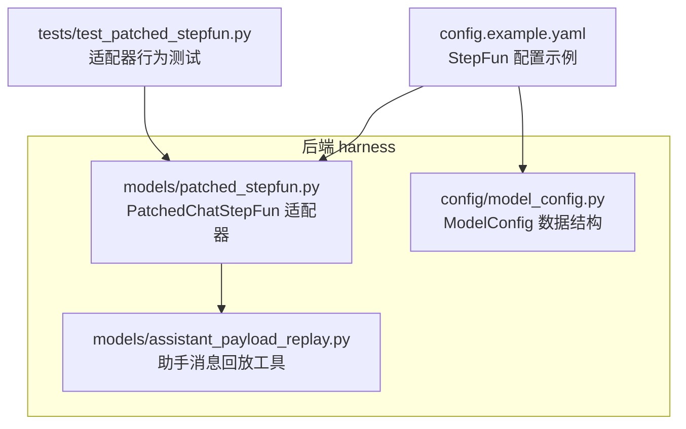
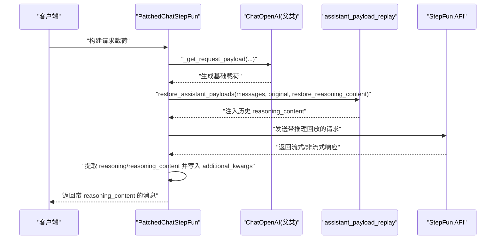
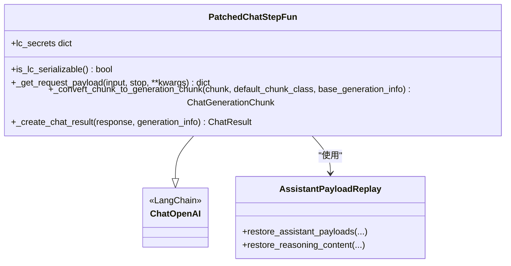
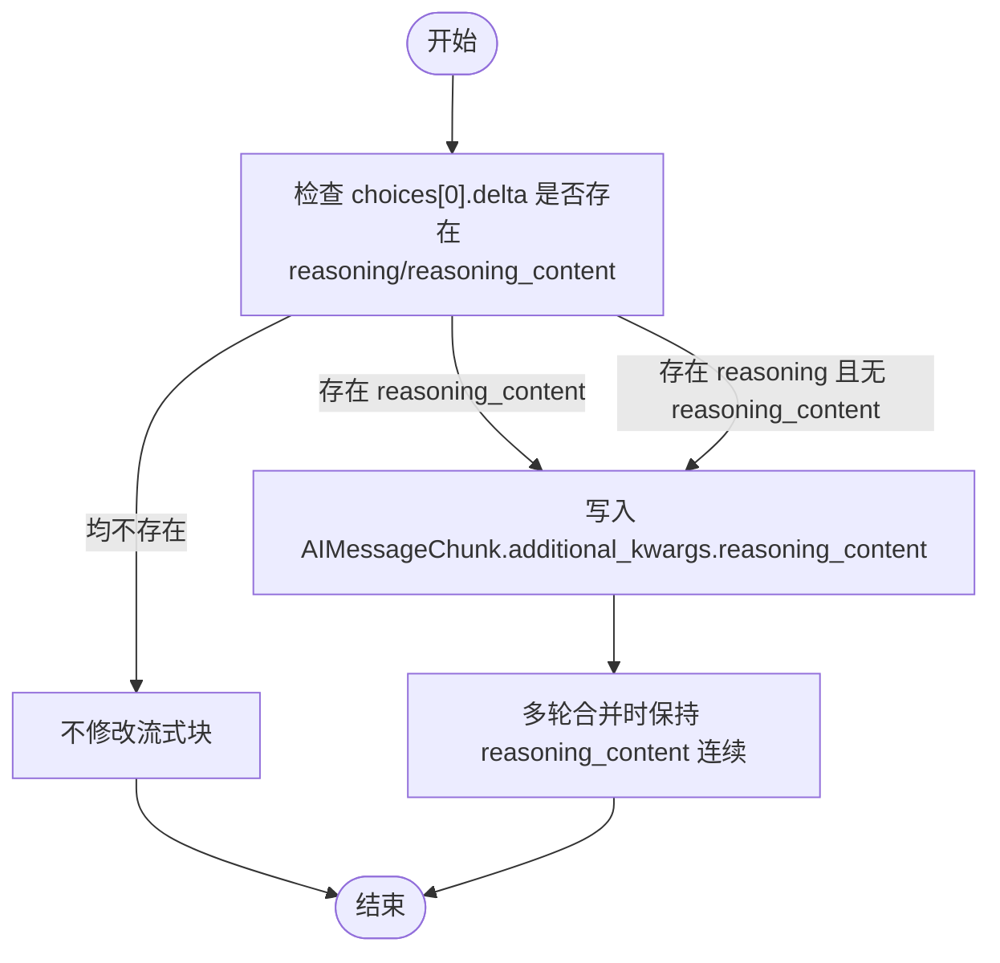
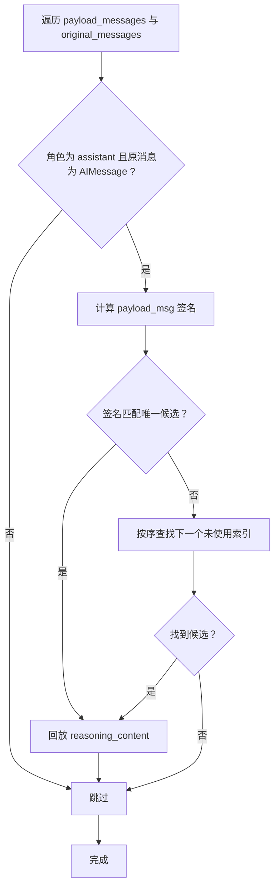
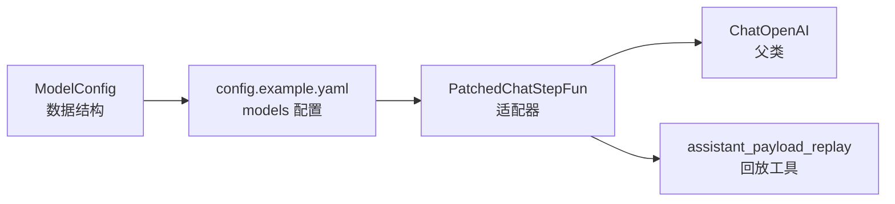

# StepFun模型配置

<cite>
**本文引用的文件**
- [patched_stepfun.py](file://backend/packages/harness/deerflow/models/patched_stepfun.py)
- [assistant_payload_replay.py](file://backend/packages/harness/deerflow/models/assistant_payload_replay.py)
- [model_config.py](file://backend/packages/harness/deerflow/config/model_config.py)
- [config.example.yaml](file://config.example.yaml)
- [test_patched_stepfun.py](file://backend/tests/test_patched_stepfun.py)
</cite>

## 目录
1. [简介](#简介)
2. [项目结构](#项目结构)
3. [核心组件](#核心组件)
4. [架构总览](#架构总览)
5. [详细组件分析](#详细组件分析)
6. [依赖关系分析](#依赖关系分析)
7. [性能考量](#性能考量)
8. [故障排查指南](#故障排查指南)
9. [结论](#结论)
10. [附录](#附录)

## 简介
本指南面向需要在 DeerFlow 中使用 StepFun（阶跃星辰）推理模型的工程师与运维人员，系统性说明如何通过 OpenAI 兼容接口对接 StepFun，并正确配置 API 密钥、基础 URL、模型参数以及推理格式。重点解释 PatchedChatStepFun 适配器对 reasoning_format 参数为 deepseek-style 的支持机制，详述 reasoning_content 字段的提取与回放策略，以及多轮对话中历史消息的匹配与恢复流程。文档同时给出 Step 3.7 Flash 等具体模型的配置示例，解释 supports_thinking 与 supports_reasoning_effort 的作用，并提供与其他推理模型的对比与选型建议。

## 项目结构
与 StepFun 模型配置直接相关的核心文件位于后端 harness 包中，主要涉及：
- 模型适配器：PatchedChatStepFun（继承自 ChatOpenAI）
- 助手消息回放工具：restore_assistant_payloads 与 restore_reasoning_content
- 模型配置数据结构：ModelConfig（描述模型能力与开关）
- 示例配置：config.example.yaml 中 StepFun 的完整示例
- 单元测试：验证推理内容捕获、流式与非流式响应处理、请求载荷回放

图表来源
- [patched_stepfun.py:76-176](file://backend/packages/harness/deerflow/models/patched_stepfun.py#L76-L176)
- [assistant_payload_replay.py:20-52](file://backend/packages/harness/deerflow/models/assistant_payload_replay.py#L20-L52)
- [model_config.py:4-52](file://backend/packages/harness/deerflow/config/model_config.py#L4-L52)
- [config.example.yaml:277-302](file://config.example.yaml#L277-L302)
- [test_patched_stepfun.py:10-36](file://backend/tests/test_patched_stepfun.py#L10-L36)

章节来源
- [patched_stepfun.py:1-176](file://backend/packages/harness/deerflow/models/patched_stepfun.py#L1-L176)
- [assistant_payload_replay.py:1-125](file://backend/packages/harness/deerflow/models/assistant_payload_replay.py#L1-L125)
- [model_config.py:1-52](file://backend/packages/harness/deerflow/config/model_config.py#L1-L52)
- [config.example.yaml:277-302](file://config.example.yaml#L277-L302)
- [test_patched_stepfun.py:1-306](file://backend/tests/test_patched_stepfun.py#L1-L306)

## 核心组件
- PatchedChatStepFun：针对 StepFun 推理模型的 ChatOpenAI 适配器，负责：
  - 在流式与非流式响应中提取 reasoning 或 reasoning_content 字段
  - 将推理内容写入 AIMessage/AIMessageChunk 的 additional_kwargs.reasoning_content
  - 在多轮工具调用对话中，将历史助手消息的 reasoning_content 回放到后续请求载荷
- assistant_payload_replay：通用助手消息字段回放框架，StepFun 使用其 restore_reasoning_content 实现推理内容的跨轮次保留
- ModelConfig：统一的模型配置数据结构，包含 supports_thinking、supports_reasoning_effort 等能力开关
- config.example.yaml：StepFun 的完整配置示例，含 reasoning_format: deepseek-style 的启用方式

章节来源
- [patched_stepfun.py:76-176](file://backend/packages/harness/deerflow/models/patched_stepfun.py#L76-L176)
- [assistant_payload_replay.py:20-52](file://backend/packages/harness/deerflow/models/assistant_payload_replay.py#L20-L52)
- [model_config.py:4-52](file://backend/packages/harness/deerflow/config/model_config.py#L4-L52)
- [config.example.yaml:277-302](file://config.example.yaml#L277-L302)

## 架构总览
下图展示了 StepFun 适配器在请求与响应路径中的关键处理点，以及与助手消息回放模块的交互：

图表来源
- [patched_stepfun.py:94-111](file://backend/packages/harness/deerflow/models/patched_stepfun.py#L94-L111)
- [assistant_payload_replay.py:20-52](file://backend/packages/harness/deerflow/models/assistant_payload_replay.py#L20-L52)
- [patched_stepfun.py:115-141](file://backend/packages/harness/deerflow/models/patched_stepfun.py#L115-L141)
- [patched_stepfun.py:144-176](file://backend/packages/harness/deerflow/models/patched_stepfun.py#L144-L176)

## 详细组件分析

### PatchedChatStepFun 适配器
- 能力声明与密钥映射
  - 支持序列化与 LangChain 安全字段映射，将 api_key 映射到 STEPFUN_API_KEY
- 请求载荷回放
  - 在生成基础请求载荷后，调用 restore_assistant_payloads 将历史 AIMessage 中的 reasoning_content 注入到对应 assistant 消息
- 流式推理捕获
  - 从 choices[0].delta 中提取 reasoning 或 reasoning_content，写入 AIMessageChunk.additional_kwargs.reasoning_content
- 非流式推理捕获
  - 从 choices[].message 或 SDK 对象属性中提取推理内容，写入 AIMessage.additional_kwargs.reasoning_content

图表来源
- [patched_stepfun.py:76-176](file://backend/packages/harness/deerflow/models/patched_stepfun.py#L76-L176)
- [assistant_payload_replay.py:20-52](file://backend/packages/harness/deerflow/models/assistant_payload_replay.py#L20-L52)

章节来源
- [patched_stepfun.py:76-176](file://backend/packages/harness/deerflow/models/patched_stepfun.py#L76-L176)

### reasoning_content 字段处理机制
- 提取优先级
  - 优先检查 reasoning_content；若不存在再检查 reasoning
  - 同时兼容字典、Pydantic 对象与 model_extra 扩展字段
- 写入位置
  - 流式：AIMessageChunk.additional_kwargs.reasoning_content
  - 非流式：AIMessage.additional_kwargs.reasoning_content
- 回放策略
  - 通过 restore_reasoning_content 将历史 reasoning_content 注入到后续请求的 assistant 消息中，确保多轮工具调用场景下推理上下文连续

图表来源
- [patched_stepfun.py:28-54](file://backend/packages/harness/deerflow/models/patched_stepfun.py#L28-L54)
- [patched_stepfun.py:115-141](file://backend/packages/harness/deerflow/models/patched_stepfun.py#L115-L141)
- [patched_stepfun.py:144-176](file://backend/packages/harness/deerflow/models/patched_stepfun.py#L144-L176)

章节来源
- [patched_stepfun.py:28-54](file://backend/packages/harness/deerflow/models/patched_stepfun.py#L28-L54)
- [patched_stepfun.py:115-141](file://backend/packages/harness/deerflow/models/patched_stepfun.py#L115-L141)
- [patched_stepfun.py:144-176](file://backend/packages/harness/deerflow/models/patched_stepfun.py#L144-L176)

### 多轮对话中的回放要求
- 匹配策略
  - 基于 assistant 消息的内容与 tool_calls.id 序列生成稳定签名，用于在序列重排或缺失时仍能正确回放
  - 若签名匹配失败，则按序号回退到下一个未使用的助手消息
- 回放触发
  - 每次生成请求载荷前，都会对所有 assistant 消息执行回放，保证推理上下文在多轮工具调用中保持一致

图表来源
- [assistant_payload_replay.py:20-73](file://backend/packages/harness/deerflow/models/assistant_payload_replay.py#L20-L73)
- [assistant_payload_replay.py:92-125](file://backend/packages/harness/deerflow/models/assistant_payload_replay.py#L92-L125)

章节来源
- [assistant_payload_replay.py:20-73](file://backend/packages/harness/deerflow/models/assistant_payload_replay.py#L20-L73)
- [assistant_payload_replay.py:92-125](file://backend/packages/harness/deerflow/models/assistant_payload_replay.py#L92-L125)

### StepFun 配置示例（以 Step 3.7 Flash 为例）
- 关键配置项
  - use: deerflow.models.patched_stepfun:PatchedChatStepFun
  - model: step-3.7-flash
  - api_key: 通过环境变量 STEPFUN_API_KEY 注入
  - base_url: https://api.stepfun.com/v1
  - supports_thinking: true
  - supports_reasoning_effort: true
  - when_thinking_enabled/when_thinking_disabled.extra_body.reasoning_format: deepseek-style
- 说明
  - reasoning_format: deepseek-style 使 StepFun 返回 reasoning_content 字段，便于与 DeerFlow 的 reasoning_content 统一处理
  - supports_thinking/supports_reasoning_effort 控制 UI 与路由层的行为与开关显示

章节来源
- [config.example.yaml:277-302](file://config.example.yaml#L277-L302)

### supports_thinking 与 supports_reasoning_effort 参数
- supports_thinking
  - 表明模型支持“思考/推理”模式，开启后可在 when_thinking_enabled/when_thinking_disabled 中传递 provider 特定的推理开关参数
- supports_reasoning_effort
  - 表明模型支持推理强度/资源预算类参数（如 budget_tokens），用于精细化控制推理成本与质量

章节来源
- [model_config.py:24-25](file://backend/packages/harness/deerflow/config/model_config.py#L24-L25)
- [config.example.yaml:293-294](file://config.example.yaml#L293-L294)

### 与其他推理模型的对比与选型建议
- 与 DeepSeek（含 reasoning_content）对比
  - 两者均支持 reasoning_content 字段；StepFun 通过 reasoning_format: deepseek-style 返回该字段，需使用 PatchedChatStepFun 适配器进行捕获与回放
- 与 MiMo（同样支持 reasoning_content）对比
  - MiMo 也要求在多轮工具调用中回放 reasoning_content，需使用对应的 PatchedChatMiMo；StepFun 则使用 PatchedChatStepFun
- 与 Gemini（通过 OpenAI 兼容网关）对比
  - Gemini 思考模式需要在多轮工具调用中保留 thought_signature，需使用 PatchedChatOpenAI；StepFun 则通过 reasoning_content 回放实现
- 与本地推理（如 Ollama）对比
  - Ollama 原生 API 可正确分离思考内容与回复内容；OpenAI 兼容端点可能将思考内容嵌入标签或丢弃，因此本地部署时可直接使用原生接口

章节来源
- [config.example.yaml:121-143](file://config.example.yaml#L121-L143)
- [config.example.yaml:180-211](file://config.example.yaml#L180-L211)
- [config.example.yaml:155-179](file://config.example.yaml#L155-L179)
- [config.example.yaml:86-120](file://config.example.yaml#L86-L120)

## 依赖关系分析
- PatchedChatStepFun 依赖
  - 继承自 ChatOpenAI，复用其请求构造与响应解析能力
  - 依赖 assistant_payload_replay.restore_assistant_payloads 与 restore_reasoning_content 实现推理内容回放
- 配置依赖
  - config.example.yaml 中的 models 列表定义了 use 类路径、模型名称、API 基础地址、超时与重试、能力开关等
  - ModelConfig 作为统一的数据结构，承载 supports_thinking、supports_reasoning_effort 等字段

图表来源
- [config.example.yaml:277-302](file://config.example.yaml#L277-L302)
- [patched_stepfun.py:76-176](file://backend/packages/harness/deerflow/models/patched_stepfun.py#L76-L176)
- [assistant_payload_replay.py:20-52](file://backend/packages/harness/deerflow/models/assistant_payload_replay.py#L20-L52)
- [model_config.py:4-52](file://backend/packages/harness/deerflow/config/model_config.py#L4-L52)

章节来源
- [config.example.yaml:277-302](file://config.example.yaml#L277-L302)
- [patched_stepfun.py:76-176](file://backend/packages/harness/deerflow/models/patched_stepfun.py#L76-L176)
- [assistant_payload_replay.py:20-52](file://backend/packages/harness/deerflow/models/assistant_payload_replay.py#L20-L52)
- [model_config.py:4-52](file://backend/packages/harness/deerflow/config/model_config.py#L4-L52)

## 性能考量
- 流式等待时间
  - reasoning 模型在思考阶段可能出现较长停顿，可通过 stream_chunk_timeout 调整等待阈值，避免因超时中断长思考过程
- 资源预算
  - supports_reasoning_effort 为真时，可在 when_thinking_enabled 中传入预算参数，平衡推理质量与成本
- 超时与重试
  - 建议根据 StepFun 的响应特性适当提高 request_timeout 与 max_retries，确保复杂推理任务顺利完成

章节来源
- [model_config.py:35-44](file://backend/packages/harness/deerflow/config/model_config.py#L35-L44)
- [config.example.yaml:289-291](file://config.example.yaml#L289-L291)

## 故障排查指南
- 问题：推理内容未出现在最终消息中
  - 检查是否使用 PatchedChatStepFun 适配器，确认 reasoning_format 设置为 deepseek-style
  - 核对 when_thinking_enabled/when_thinking_disabled.extra_body.reasoning_format 是否正确传递
- 问题：多轮工具调用中推理上下文丢失
  - 确认历史 AIMessage 是否包含 reasoning_content
  - 检查 assistant_payload_replay 的签名匹配逻辑是否被破坏（例如 content 为空但 tool_calls 不一致）
- 问题：流式响应中推理内容断断续续
  - 确认流式 delta 中包含 reasoning 或 reasoning_content 字段
  - 调整 stream_chunk_timeout，避免在思考停顿时提前抛出超时异常
- 问题：测试用例失败
  - 参考单元测试覆盖的场景：推理字段提取、流式拼接、非流式提取、请求载荷回放等

章节来源
- [test_patched_stepfun.py:43-67](file://backend/tests/test_patched_stepfun.py#L43-L67)
- [test_patched_stepfun.py:133-201](file://backend/tests/test_patched_stepfun.py#L133-L201)
- [test_patched_stepfun.py:208-306](file://backend/tests/test_patched_stepfun.py#L208-L306)

## 结论
通过 PatchedChatStepFun 适配器与 assistant_payload_replay 工具链，DeerFlow 能够稳定地捕获并回放 StepFun 推理模型的 reasoning_content，从而在多轮工具调用对话中保持推理上下文连贯。结合 config.example.yaml 中的完整示例与 ModelConfig 的能力开关，用户可以灵活配置 StepFun 的推理模式、预算与视觉能力，并在不同推理模型间做出合理选型。

## 附录
- 快速配置清单
  - use: deerflow.models.patched_stepfun:PatchedChatStepFun
  - model: step-3.7-flash
  - api_key: $STEPFUN_API_KEY
  - base_url: https://api.stepfun.com/v1
  - supports_thinking: true
  - supports_reasoning_effort: true
  - when_thinking_enabled/when_thinking_disabled.extra_body.reasoning_format: deepseek-style

章节来源
- [config.example.yaml:277-302](file://config.example.yaml#L277-L302)