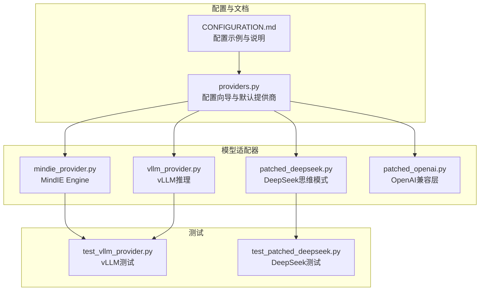
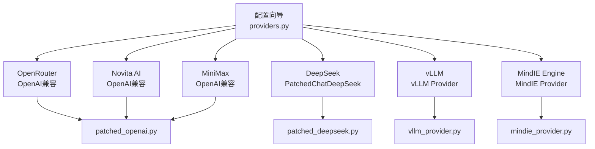
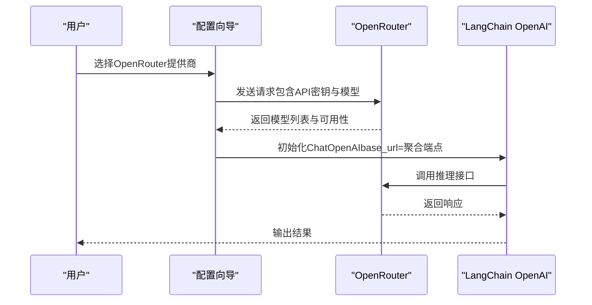
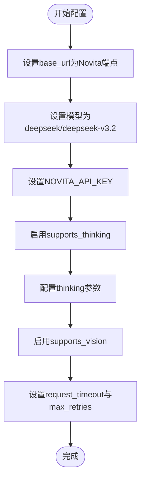
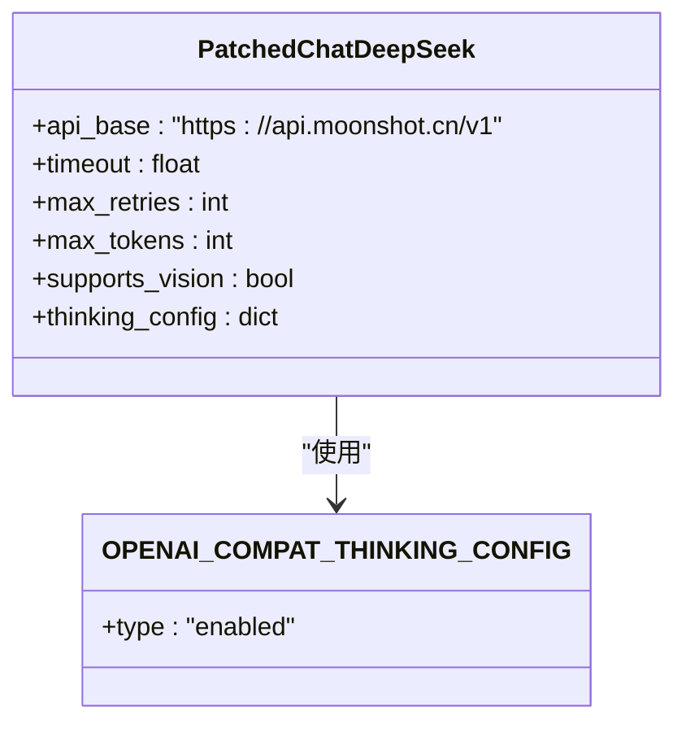
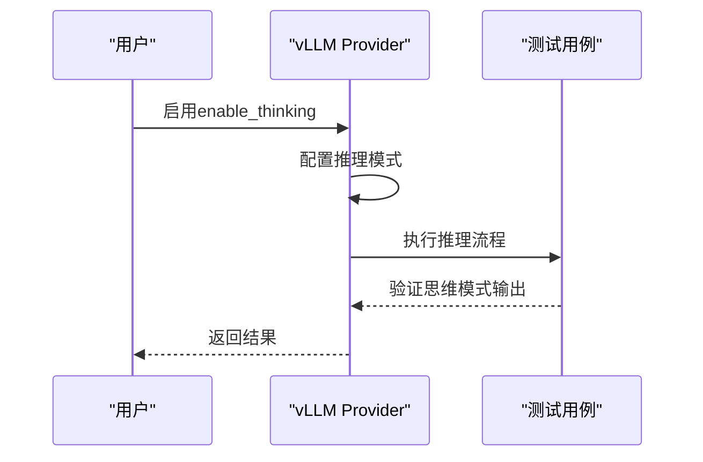
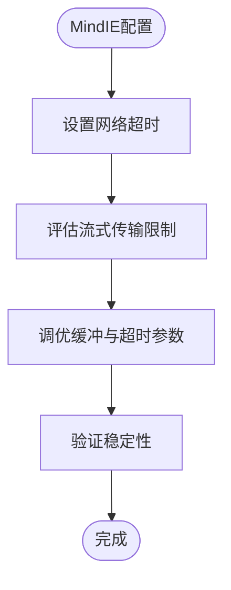
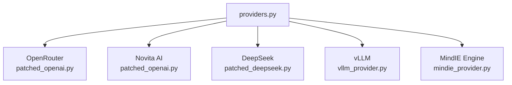

# 其他模型提供商配置

<cite>
**本文引用的文件**
- [CONFIGURATION.md](file://backend/docs/CONFIGURATION.md)
- [providers.py](file://scripts/wizard/providers.py)
- [mindie_provider.py](file://backend/packages/harness/deerflow/models/mindie_provider.py)
- [vllm_provider.py](file://backend/packages/harness/deerflow/models/vllm_provider.py)
- [patched_deepseek.py](file://backend/packages/harness/deerflow/models/patched_deepseek.py)
- [patched_openai.py](file://backend/packages/harness/deerflow/models/patched_openai.py)
- [test_vllm_provider.py](file://backend/tests/test_vllm_provider.py)
- [test_patched_deepseek.py](file://backend/tests/test_patched_deepseek.py)
</cite>

## 目录
1. [简介](#简介)
2. [项目结构](#项目结构)
3. [核心组件](#核心组件)
4. [架构概览](#架构概览)
5. [详细组件分析](#详细组件分析)
6. [依赖关系分析](#依赖关系分析)
7. [性能考虑](#性能考虑)
8. [故障排除指南](#故障排除指南)
9. [结论](#结论)
10. [附录](#附录)

## 简介
本指南面向需要配置和使用多种第三方模型提供商的用户，重点覆盖以下提供商的配置方法与特性：
- OpenRouter：多供应商模型聚合与OpenAI兼容API使用
- Novita AI：基于OpenAI兼容接口的推理模式支持
- DeepSeek：思维模式（Thinking）与视觉能力配置
- vLLM：推理模式与enable_thinking参数配置
- MindIE Engine：网络超时与流式传输限制的特殊配置

文档同时提供各提供商的性能对比与选择建议，帮助用户根据场景需求做出合理决策。

## 项目结构
与模型提供商配置直接相关的代码分布在以下位置：
- 文档与示例配置：backend/docs/CONFIGURATION.md
- 配置向导与默认提供商定义：scripts/wizard/providers.py
- 各提供商适配器实现：backend/packages/harness/deerflow/models/
- 对应测试用例：backend/tests/

**图表来源**
- [CONFIGURATION.md:82-133](file://backend/docs/CONFIGURATION.md#L82-L133)
- [providers.py:274-315](file://scripts/wizard/providers.py#L274-L315)
- [mindie_provider.py](file://backend/packages/harness/deerflow/models/mindie_provider.py)
- [vllm_provider.py](file://backend/packages/harness/deerflow/models/vllm_provider.py)
- [patched_deepseek.py](file://backend/packages/harness/deerflow/models/patched_deepseek.py)
- [patched_openai.py](file://backend/packages/harness/deerflow/models/patched_openai.py)
- [test_vllm_provider.py](file://backend/tests/test_vllm_provider.py)
- [test_patched_deepseek.py](file://backend/tests/test_patched_deepseek.py)

**章节来源**
- [CONFIGURATION.md:82-133](file://backend/docs/CONFIGURATION.md#L82-L133)
- [providers.py:274-315](file://scripts/wizard/providers.py#L274-L315)

## 核心组件
本节概述各提供商的关键配置点与行为特征，便于快速定位与应用。

- OpenRouter（多供应商聚合）
  - 使用OpenAI兼容接口，通过base_url指向聚合平台
  - 支持多种供应商模型，如Google Gemini系列
  - 示例中展示了通过OpenRouter访问Gemini 2.5 Flash的配置方式

- Novita AI
  - 基于OpenAI兼容API，提供DeepSeek V3.2等模型
  - 默认启用思维模式（supports_thinking），并通过extra_body传递thinking参数
  - 提供视觉能力支持（supports_vision）

- DeepSeek
  - 通过专用适配器支持思维模式与视觉能力
  - 在配置向导中以PatchedChatDeepSeek形式提供
  - 支持高并发与长上下文场景

- vLLM
  - 通过vLLM Provider实现推理模式
  - 支持enable_thinking参数以启用思维模式
  - 测试用例验证了推理模式的行为

- MindIE Engine
  - 专有的MindIE Provider实现
  - 需要特别关注网络超时与流式传输限制的配置

**章节来源**
- [CONFIGURATION.md:82-133](file://backend/docs/CONFIGURATION.md#L82-L133)
- [providers.py:274-315](file://scripts/wizard/providers.py#L274-L315)

## 架构概览
下图展示配置向导如何为不同提供商生成默认配置，并映射到对应的模型适配器实现：

**图表来源**
- [providers.py:274-315](file://scripts/wizard/providers.py#L274-L315)
- [patched_openai.py](file://backend/packages/harness/deerflow/models/patched_openai.py)
- [patched_deepseek.py](file://backend/packages/harness/deerflow/models/patched_deepseek.py)
- [vllm_provider.py](file://backend/packages/harness/deerflow/models/vllm_provider.py)
- [mindie_provider.py](file://backend/packages/harness/deerflow/models/mindie_provider.py)

## 详细组件分析

### OpenRouter 配置与模型选择
- 接口类型：OpenAI兼容
- 关键配置项：
  - base_url：指向聚合平台API端点
  - 模型名称：供应商/模型名格式
  - API密钥：统一使用OPENAI_API_KEY或对应环境变量
  - 思维模式：通过supports_thinking与when_thinking_enabled.extra_body.thinking.type启用
- 供应商模型示例：Google Gemini 2.5 Flash
- 适用场景：需要跨供应商统一接入与模型切换的场景

**图表来源**
- [CONFIGURATION.md:82-133](file://backend/docs/CONFIGURATION.md#L82-L133)
- [providers.py:274-315](file://scripts/wizard/providers.py#L274-L315)

**章节来源**
- [CONFIGURATION.md:82-133](file://backend/docs/CONFIGURATION.md#L82-L133)
- [providers.py:274-315](file://scripts/wizard/providers.py#L274-L315)

### Novita AI 配置与推理模式
- 接口类型：OpenAI兼容
- 关键配置项：
  - base_url：Novita提供的OpenAI兼容端点
  - 模型名称：deepseek/deepseek-v3.2
  - API密钥：NOVITA_API_KEY
  - 思维模式：supports_thinking开启，通过extra_body传递thinking参数
  - 视觉能力：supports_vision启用
  - 超时与重试：request_timeout与max_retries优化稳定性
- 适用场景：需要在单一API下访问DeepSeek生态模型的用户

**图表来源**
- [CONFIGURATION.md:82-133](file://backend/docs/CONFIGURATION.md#L82-L133)
- [providers.py:294-311](file://scripts/wizard/providers.py#L294-L311)

**章节来源**
- [CONFIGURATION.md:82-133](file://backend/docs/CONFIGURATION.md#L82-L133)
- [providers.py:294-311](file://scripts/wizard/providers.py#L294-L311)

### DeepSeek 思维模式与视觉能力
- 接口类型：通过PatchedChatDeepSeek适配器
- 关键配置项：
  - 包装类：deerflow.models.patched_deepseek:PatchedChatDeepSeek
  - API基础地址：moonshot api端点
  - 超时与重试：timeout与max_retries提升稳定性
  - 视觉能力：supports_vision启用
  - 思维模式：通过OPENAI_COMPAT_THINKING_CONFIG启用
- 适用场景：需要DeepSeek生态的思维链推理与多模态输入

**图表来源**
- [providers.py:274-292](file://scripts/wizard/providers.py#L274-L292)
- [patched_deepseek.py](file://backend/packages/harness/deerflow/models/patched_deepseek.py)

**章节来源**
- [providers.py:274-292](file://scripts/wizard/providers.py#L274-L292)
- [patched_deepseek.py](file://backend/packages/harness/deerflow/models/patched_deepseek.py)

### vLLM 推理模式配置
- 接口类型：vLLM Provider
- 关键配置项：
  - enable_thinking参数：用于启用思维模式
  - 推理模式：通过Provider实现
- 测试验证：test_vllm_provider.py验证了推理模式的行为

**图表来源**
- [vllm_provider.py](file://backend/packages/harness/deerflow/models/vllm_provider.py)
- [test_vllm_provider.py](file://backend/tests/test_vllm_provider.py)

**章节来源**
- [vllm_provider.py](file://backend/packages/harness/deerflow/models/vllm_provider.py)
- [test_vllm_provider.py](file://backend/tests/test_vllm_provider.py)

### MindIE Engine 特殊配置
- 接口类型：MindIE Provider
- 关键配置项：
  - 网络超时：需根据实际网络环境调整超时参数
  - 流式传输限制：需关注流式输出的限制与缓冲策略
- 适用场景：对延迟敏感且需要稳定流式输出的企业级部署

**图表来源**
- [mindie_provider.py](file://backend/packages/harness/deerflow/models/mindie_provider.py)

**章节来源**
- [mindie_provider.py](file://backend/packages/harness/deerflow/models/mindie_provider.py)

## 依赖关系分析
下图展示配置向导与各提供商适配器之间的依赖关系：

**图表来源**
- [providers.py:274-315](file://scripts/wizard/providers.py#L274-L315)
- [patched_openai.py](file://backend/packages/harness/deerflow/models/patched_openai.py)
- [patched_deepseek.py](file://backend/packages/harness/deerflow/models/patched_deepseek.py)
- [vllm_provider.py](file://backend/packages/harness/deerflow/models/vllm_provider.py)
- [mindie_provider.py](file://backend/packages/harness/deerflow/models/mindie_provider.py)

**章节来源**
- [providers.py:274-315](file://scripts/wizard/providers.py#L274-L315)

## 性能考虑
- 超时与重试
  - Novita AI与DeepSeek均提供了request_timeout与max_retries配置，建议根据网络状况与模型响应时间进行调优
- 视觉能力
  - 启用supports_vision会增加请求体积与处理时间，建议仅在必要时开启
- 思维模式
  - 启用思维模式会增加推理开销，建议在对准确性要求较高但对延迟敏感度较低的场景使用
- vLLM推理模式
  - enable_thinking参数会影响内存占用与吞吐量，建议结合硬件资源进行压测后确定参数

## 故障排除指南
- OpenRouter模型不可用
  - 检查base_url是否正确指向聚合平台
  - 确认模型名称格式为供应商/模型名
  - 验证API密钥权限范围
- Novita AI超时或连接失败
  - 调整request_timeout与max_retries
  - 确认网络可达性与防火墙规则
- DeepSeek思维模式无效
  - 确认supports_thinking已启用
  - 检查OPENAI_COMPAT_THINKING_CONFIG配置
- vLLM推理模式异常
  - 参考test_vllm_provider.py中的测试用例，确认enable_thinking参数传递正确
- MindIE Engine流式传输问题
  - 检查流式传输限制与缓冲区大小
  - 调整网络超时参数以适应长尾请求

**章节来源**
- [test_vllm_provider.py](file://backend/tests/test_vllm_provider.py)
- [test_patched_deepseek.py](file://backend/tests/test_patched_deepseek.py)

## 结论
- OpenRouter适合需要跨供应商统一接入的场景，配置简单且扩展性强
- Novita AI在单一API下提供DeepSeek生态模型，适合希望简化集成成本的用户
- DeepSeek通过专用适配器提供思维模式与视觉能力，适合复杂推理任务
- vLLM通过Provider实现推理模式，适合高性能推理场景
- MindIE Engine需要特别关注超时与流式传输限制，适合企业级稳定部署

## 附录
- 配置示例可参考CONFIGURATION.md中的具体条目
- 默认提供商定义可参考providers.py中的LLMProvider配置
- 各Provider的实现细节可在对应文件中查看

**章节来源**
- [CONFIGURATION.md:82-133](file://backend/docs/CONFIGURATION.md#L82-L133)
- [providers.py:274-315](file://scripts/wizard/providers.py#L274-L315)