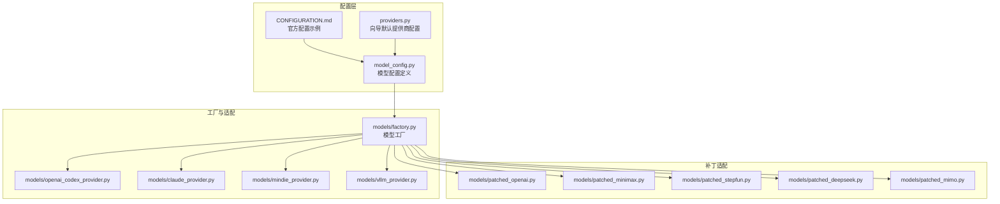
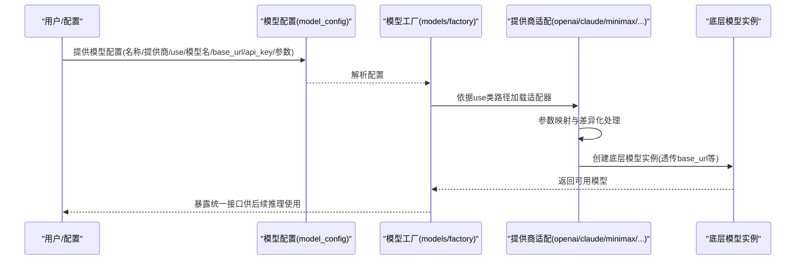
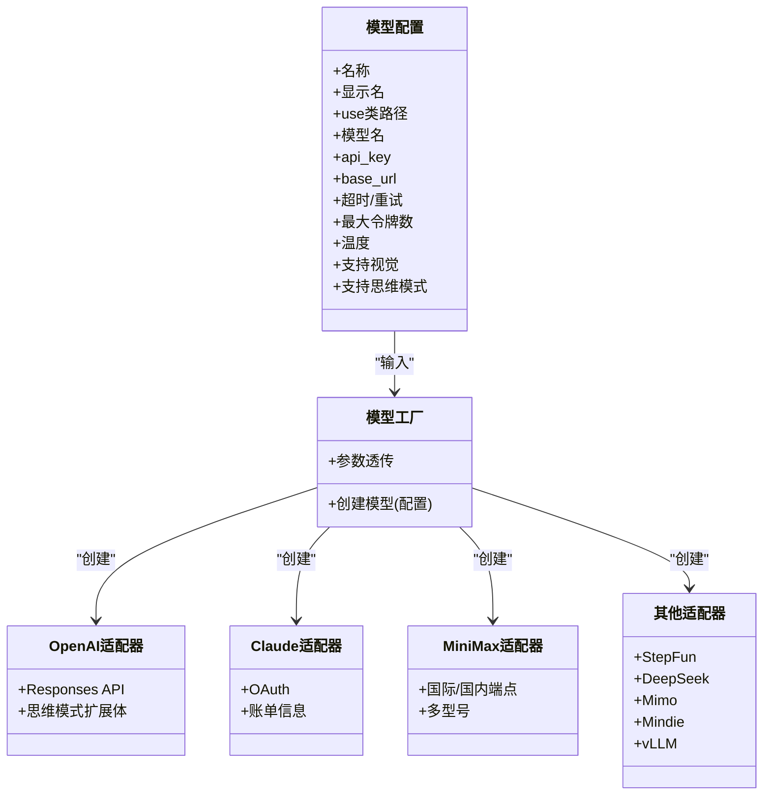

# 模型配置

<cite>
**本文引用的文件**
- [model_config.py](file://backend/packages/harness/deerflow/config/model_config.py)
- [factory.py](file://backend/packages/harness/deerflow/models/factory.py)
- [openai_codex_provider.py](file://backend/packages/harness/deerflow/models/openai_codex_provider.py)
- [claude_provider.py](file://backend/packages/harness/deerflow/models/claude_provider.py)
- [mindie_provider.py](file://backend/packages/harness/deerflow/models/mindie_provider.py)
- [vllm_provider.py](file://backend/packages/harness/deerflow/models/vllm_provider.py)
- [patched_openai.py](file://backend/packages/harness/deerflow/models/patched_openai.py)
- [patched_minimax.py](file://backend/packages/harness/deerflow/models/patched_minimax.py)
- [patched_stepfun.py](file://backend/packages/harness/deerflow/models/patched_stepfun.py)
- [patched_deepseek.py](file://backend/packages/harness/deerflow/models/patched_deepseek.py)
- [patched_mimo.py](file://backend/packages/harness/deerflow/models/patched_mimo.py)
- [providers.py](file://scripts/wizard/providers.py)
- [CONFIGURATION.md](file://backend/docs/CONFIGURATION.md)
- [test_model_factory.py](file://backend/tests/test_model_factory.py)
- [test_model_config.py](file://backend/tests/test_model_config.py)
- [test_claude_provider.py](file://backend/tests/test_claude_provider.py)
- [test_vllm_provider.py](file://backend/tests/test_vllm_provider.py)
- [test_patched_openai.py](file://backend/tests/test_patched_openai.py)
- [test_patched_minimax.py](file://backend/tests/test_patched_minimax.py)
- [test_patched_stepfun.py](file://backend/tests/test_patched_stepfun.py)
- [test_patched_deepseek.py](file://backend/tests/test_patched_deepseek.py)
- [test_patched_mimo.py](file://backend/tests/test_patched_mimo.py)
</cite>

## 目录
1. [简介](#简介)
2. [项目结构](#项目结构)
3. [核心组件](#核心组件)
4. [架构总览](#架构总览)
5. [详细组件分析](#详细组件分析)
6. [依赖关系分析](#依赖关系分析)
7. [性能考虑](#性能考虑)
8. [故障排查指南](#故障排查指南)
9. [结论](#结论)
10. [附录](#附录)

## 简介
本指南面向需要在系统中配置与使用多种AI模型提供商（OpenAI、Claude、Gemini、MiniMax、Ollama等）的用户与工程师，覆盖从基础配置到高级特性（能力检测、思维模式支持、视觉能力、推理模式、多模型管理与性能优化）的完整流程。文档基于仓库中的实际实现与测试用例进行梳理，确保可操作性与准确性。

## 项目结构
模型配置与运行时主要分布在以下模块：
- 配置定义：模型配置数据结构与解析
- 工厂与适配器：根据配置动态创建模型实例
- 提供商适配：针对不同提供商的参数映射与行为差异
- 向导与示例：一键生成配置模板与默认值
- 文档与测试：官方配置示例与回归验证

图表来源
- [model_config.py](file://backend/packages/harness/deerflow/config/model_config.py)
- [factory.py](file://backend/packages/harness/deerflow/models/factory.py)
- [openai_codex_provider.py](file://backend/packages/harness/deerflow/models/openai_codex_provider.py)
- [claude_provider.py](file://backend/packages/harness/deerflow/models/claude_provider.py)
- [mindie_provider.py](file://backend/packages/harness/deerflow/models/mindie_provider.py)
- [vllm_provider.py](file://backend/packages/harness/deerflow/models/vllm_provider.py)
- [patched_openai.py](file://backend/packages/harness/deerflow/models/patched_openai.py)
- [patched_minimax.py](file://backend/packages/harness/deerflow/models/patched_minimax.py)
- [patched_stepfun.py](file://backend/packages/harness/deerflow/models/patched_stepfun.py)
- [patched_deepseek.py](file://backend/packages/harness/deerflow/models/patched_deepseek.py)
- [patched_mimo.py](file://backend/packages/harness/deerflow/models/patched_mimo.py)
- [CONFIGURATION.md](file://backend/docs/CONFIGURATION.md)
- [providers.py](file://scripts/wizard/providers.py)

章节来源
- [model_config.py](file://backend/packages/harness/deerflow/config/model_config.py)
- [factory.py](file://backend/packages/harness/deerflow/models/factory.py)
- [CONFIGURATION.md](file://backend/docs/CONFIGURATION.md)
- [providers.py](file://scripts/wizard/providers.py)

## 核心组件
- 模型配置数据结构：定义模型名称、显示名、提供商类路径、模型名、API密钥、基础URL、超时/重试、最大令牌数、温度、是否支持视觉与思维模式等字段。
- 模型工厂：依据配置解析类路径，注入参数并创建具体模型实例；对OpenAI兼容提供商透传base_url等参数。
- 提供商适配：为特定提供商（如OpenAI、Claude、MiniMax、StepFun、DeepSeek、Mimo、Mindie、vLLM）提供参数映射与行为差异处理。
- 向导与示例：提供默认提供商配置与示例配置文件，便于快速上手。

章节来源
- [model_config.py](file://backend/packages/harness/deerflow/config/model_config.py)
- [factory.py](file://backend/packages/harness/deerflow/models/factory.py)
- [providers.py](file://scripts/wizard/providers.py)
- [CONFIGURATION.md](file://backend/docs/CONFIGURATION.md)

## 架构总览
模型配置与调用的关键流程如下：

图表来源
- [factory.py](file://backend/packages/harness/deerflow/models/factory.py)
- [openai_codex_provider.py](file://backend/packages/harness/deerflow/models/openai_codex_provider.py)
- [claude_provider.py](file://backend/packages/harness/deerflow/models/claude_provider.py)
- [patched_minimax.py](file://backend/packages/harness/deerflow/models/patched_minimax.py)
- [vllm_provider.py](file://backend/packages/harness/deerflow/models/vllm_provider.py)

## 详细组件分析

### OpenAI（含Codex）
- 关键点
  - 使用通用ChatOpenAI适配器，支持Responses API与思维模式扩展体。
  - 支持通过extra_body传递思维模式开关等提供商特有参数。
  - 测试覆盖：工厂能正确透传base_url、api_key、max_tokens、temperature等参数；多模型共存场景下不同模型参数隔离。
- 推荐配置要点
  - 设置api_key环境变量或直接在配置中提供。
  - 如需思维模式，启用supports_thinking并在when_thinking_enabled中提供extra_body。
  - 对于OpenRouter等网关，保持use为ChatOpenAI并设置base_url。
- 最佳实践
  - 在生产环境使用环境变量注入API密钥，避免硬编码。
  - 对高并发场景适当提高请求超时与重试次数。
  - 使用多模型并行时，为每个模型独立配置以避免参数冲突。

章节来源
- [openai_codex_provider.py](file://backend/packages/harness/deerflow/models/openai_codex_provider.py)
- [test_model_factory.py](file://backend/tests/test_model_factory.py)
- [test_patched_openai.py](file://backend/tests/test_patched_openai.py)
- [CONFIGURATION.md](file://backend/docs/CONFIGURATION.md)

### Claude
- 关键点
  - 专用提供商适配，支持OAuth与账单信息查询等特性。
  - 测试覆盖：OAuth计费相关行为、提示缓存支持等。
- 推荐配置要点
  - 填写正确的API密钥与模型名。
  - 如需提示缓存，确认提供商支持并开启相应能力。
- 最佳实践
  - 使用向导提供的默认配置作为起点，按需微调。
  - 对于企业级部署，优先使用OAuth以提升安全性与审计能力。

章节来源
- [claude_provider.py](file://backend/packages/harness/deerflow/models/claude_provider.py)
- [test_claude_provider.py](file://backend/tests/test_claude_provider.py)

### Gemini（通过OpenAI兼容网关）
- 关键点
  - 通过OpenAI兼容端点接入，use保持ChatOpenAI，设置base_url为对应网关地址。
  - 官方示例展示如何配置Google系列模型并通过OpenRouter等网关访问。
- 推荐配置要点
  - base_url指向目标网关（如OpenRouter）。
  - 根据提供商要求设置api_key与模型名。
- 最佳实践
  - 与OpenAI一致的参数策略，注意不同网关对温度、最大令牌数等参数的限制。

章节来源
- [CONFIGURATION.md](file://backend/docs/CONFIGURATION.md)

### MiniMax（国际版与国内版）
- 关键点
  - 通过OpenAI兼容端点接入，use为ChatOpenAI，设置base_url与api_key。
  - 支持多型号并存，部分型号不支持视觉能力。
  - 测试覆盖：多模型共存、base_url透传、温度范围限制等。
- 推荐配置要点
  - 国际版与国内版使用不同base_url，分别配置env_var。
  - M3支持视觉，M2.7/M2.7-highspeed为文本模型，需关闭视觉能力。
  - 温度需满足(0.0, 1.0]区间。
- 最佳实践
  - 将不同区域的API Key分离管理，避免混淆。
  - 对文本-only模型禁用视觉能力，减少不必要的资源消耗。

章节来源
- [providers.py](file://scripts/wizard/providers.py)
- [test_model_factory.py](file://backend/tests/test_model_factory.py)
- [test_patched_minimax.py](file://backend/tests/test_patched_minimax.py)

### Ollama（本地推理）
- 关键点
  - 通过OpenAI兼容端点对接本地Ollama服务，use为ChatOpenAI，base_url指向本地服务。
  - 测试覆盖：本地端口透传、不支持流式用量统计等差异。
- 推荐配置要点
  - base_url设置为本地Ollama服务地址（如http://127.0.0.1:11434）。
  - 不同模型可能不支持某些流式特性，需按需调整。
- 最佳实践
  - 本地部署时确保端口可达与模型已拉取。
  - 对于大模型或低性能设备，适当降低并发与批大小。

章节来源
- [test_model_factory.py](file://backend/tests/test_model_factory.py)

### 其他提供商（StepFun、DeepSeek、Mimo、Mindie、vLLM）
- 关键点
  - 通过OpenAI兼容端点接入，use为ChatOpenAI，设置base_url与api_key。
  - 测试覆盖：多模型共存、参数透传、能力差异等。
- 推荐配置要点
  - 根据提供商文档设置正确的base_url与模型名。
  - 注意各提供商对温度、最大令牌数等参数的限制。
- 最佳实践
  - 使用向导默认配置作为起点，按需调整参数。
  - 对于vLLM等高性能推理引擎，结合批量与并发策略优化吞吐。

章节来源
- [patched_stepfun.py](file://backend/packages/harness/deerflow/models/patched_stepfun.py)
- [patched_deepseek.py](file://backend/packages/harness/deerflow/models/patched_deepseek.py)
- [patched_mimo.py](file://backend/packages/harness/deerflow/models/patched_mimo.py)
- [mindie_provider.py](file://backend/packages/harness/deerflow/models/mindie_provider.py)
- [vllm_provider.py](file://backend/packages/harness/deerflow/models/vllm_provider.py)
- [test_patched_stepfun.py](file://backend/tests/test_patched_stepfun.py)
- [test_patched_deepseek.py](file://backend/tests/test_patched_deepseek.py)
- [test_patched_mimo.py](file://backend/tests/test_patched_mimo.py)
- [test_vllm_provider.py](file://backend/tests/test_vllm_provider.py)

### 能力检测与思维模式支持
- 能力检测
  - 通过配置项supports_vision与supports_thinking声明模型能力。
  - 不同提供商对视觉与思维模式的支持程度不同，需在配置中显式声明。
- 思维模式
  - 对OpenAI兼容提供商，可通过when_thinking_enabled提供extra_body参数以启用思维模式。
  - 测试覆盖：思维模式开关、Responses API默认启用等。
- 视觉能力
  - 对于不支持视觉的模型（如MiniMax M2.7），应关闭supports_vision以避免错误。
- 最佳实践
  - 在配置中明确标注能力，避免运行时因能力不匹配导致异常。
  - 对思维模式参数进行最小化配置，仅在需要时启用。

章节来源
- [test_model_config.py](file://backend/tests/test_model_config.py)
- [test_model_factory.py](file://backend/tests/test_model_factory.py)
- [CONFIGURATION.md](file://backend/docs/CONFIGURATION.md)

### 多模型管理与模型切换
- 多模型并存
  - 工厂支持同一提供商的多个模型并存，通过不同name与use配置区分。
  - 测试覆盖：多模型共存、参数隔离、base_url透传。
- 切换策略
  - 通过配置文件中的模型列表与默认模型选择实现切换。
  - 向导提供默认提供商配置，便于快速生成模板。
- 最佳实践
  - 为不同用途（如对话、摘要、代码）准备专用模型配置。
  - 使用环境变量与分组配置管理不同环境（开发/测试/生产）。

章节来源
- [test_model_factory.py](file://backend/tests/test_model_factory.py)
- [providers.py](file://scripts/wizard/providers.py)

## 依赖关系分析
模型配置与工厂之间的依赖关系如下：

图表来源
- [model_config.py](file://backend/packages/harness/deerflow/config/model_config.py)
- [factory.py](file://backend/packages/harness/deerflow/models/factory.py)
- [openai_codex_provider.py](file://backend/packages/harness/deerflow/models/openai_codex_provider.py)
- [claude_provider.py](file://backend/packages/harness/deerflow/models/claude_provider.py)
- [patched_minimax.py](file://backend/packages/harness/deerflow/models/patched_minimax.py)
- [patched_stepfun.py](file://backend/packages/harness/deerflow/models/patched_stepfun.py)
- [patched_deepseek.py](file://backend/packages/harness/deerflow/models/patched_deepseek.py)
- [patched_mimo.py](file://backend/packages/harness/deerflow/models/patched_mimo.py)
- [mindie_provider.py](file://backend/packages/harness/deerflow/models/mindie_provider.py)
- [vllm_provider.py](file://backend/packages/harness/deerflow/models/vllm_provider.py)

## 性能考虑
- 并发与批处理
  - 对高延迟提供商（如MiniMax、StepFun）适当降低并发，避免触发限流。
  - 对本地Ollama或vLLM，结合批量与GPU资源进行吞吐优化。
- 超时与重试
  - 为长链路网关（OpenRouter、Novita）设置合理超时与重试次数。
- 参数调优
  - 温度与最大令牌数需符合提供商限制；对思维模式与视觉能力按需启用以平衡性能与质量。
- 缓存与复用
  - 对提示缓存友好的提供商（Claude等）启用缓存以减少重复计算。

## 故障排查指南
- 常见问题
  - API密钥无效或未注入：检查环境变量或配置文件中的api_key字段。
  - base_url错误：确认网关地址与提供商文档一致。
  - 能力不匹配：若模型不支持视觉或思维模式，请在配置中关闭对应开关。
  - 温度过高或过低：确保温度在提供商允许范围内（如MiniMax要求(0.0, 1.0]）。
- 定位手段
  - 查看工厂创建日志与参数透传情况。
  - 使用测试用例中的断言逻辑定位问题（如base_url、api_key、max_tokens、temperature等）。
- 参考测试
  - OpenAI兼容提供商参数透传与多模型共存
  - Claude OAuth与思维模式
  - MiniMax多型号与视觉能力
  - Ollama本地端口与特性差异
  - vLLM与其它提供商适配

章节来源
- [test_model_factory.py](file://backend/tests/test_model_factory.py)
- [test_claude_provider.py](file://backend/tests/test_claude_provider.py)
- [test_patched_minimax.py](file://backend/tests/test_patched_minimax.py)
- [test_patched_openai.py](file://backend/tests/test_patched_openai.py)
- [test_vllm_provider.py](file://backend/tests/test_vllm_provider.py)

## 结论
通过统一的模型配置与工厂机制，系统能够以最小改动适配多家提供商，并在能力检测、思维模式、视觉支持、推理模式等方面提供灵活配置。建议以向导默认配置为起点，结合官方示例与测试用例进行验证与优化，确保在不同环境与负载下的稳定性与性能。

## 附录
- 官方配置示例参考：CONFIGURATION.md
- 向导默认提供商配置：providers.py
- 模型配置数据结构：model_config.py
- 模型工厂：factory.py