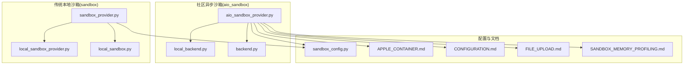
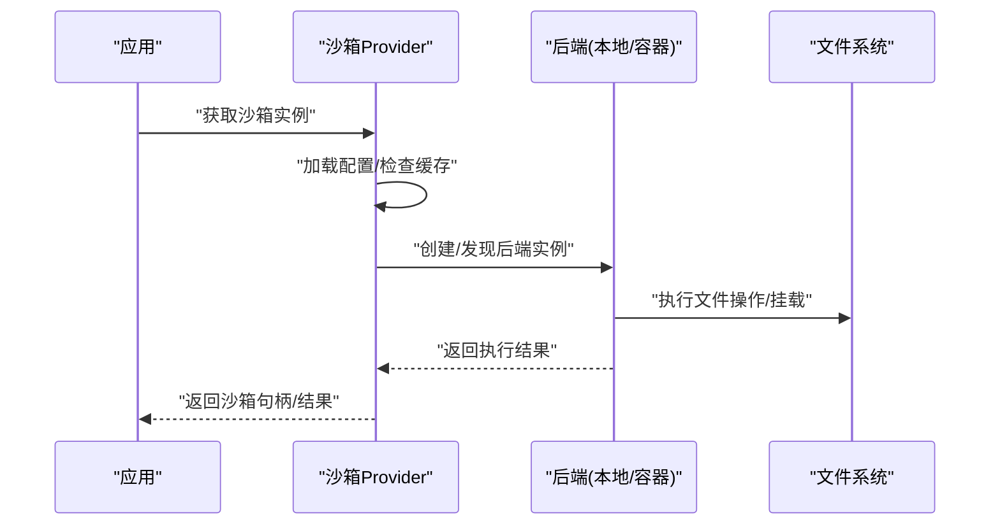
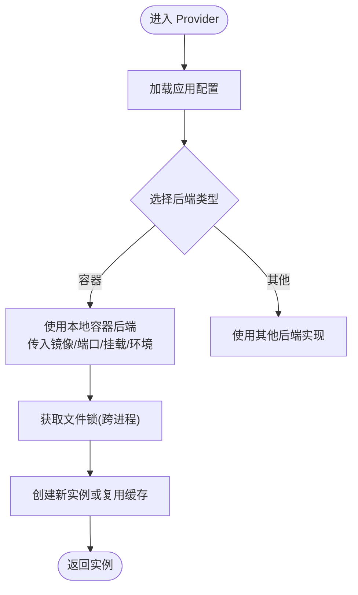
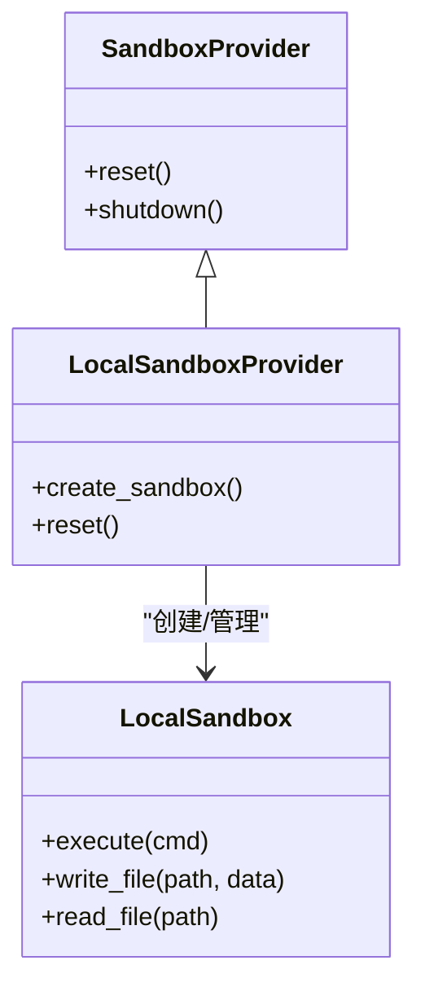
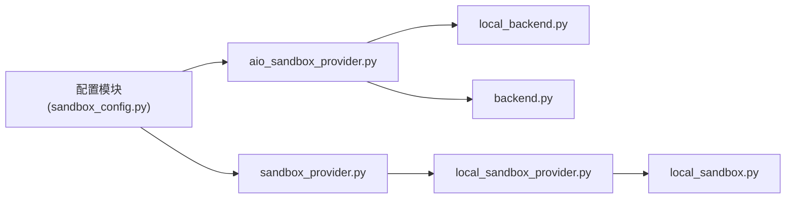

# 沙箱配置

<cite>
**本文引用的文件**
- [aio_sandbox_provider.py](file://backend/packages/harness/deerflow/community/aio_sandbox/aio_sandbox_provider.py)
- [local_backend.py](file://backend/packages/harness/deerflow/community/aio_sandbox/local_backend.py)
- [backend.py](file://backend/packages/harness/deerflow/community/aio_sandbox/backend.py)
- [sandbox_config.py](file://backend/packages/harness/deerflow/config/sandbox_config.py)
- [sandbox_provider.py](file://backend/packages/harness/deerflow/sandbox/sandbox_provider.py)
- [local_sandbox_provider.py](file://backend/packages/harness/deerflow/sandbox/local/local_sandbox_provider.py)
- [local_sandbox.py](file://backend/packages/harness/deerflow/sandbox/local/local_sandbox.py)
- [APPLE_CONTAINER.md](file://backend/docs/APPLE_CONTAINER.md)
- [CONFIGURATION.md](file://backend/docs/CONFIGURATION.md)
- [FILE_UPLOAD.md](file://backend/docs/FILE_UPLOAD.md)
- [SANDBOX_MEMORY_PROFILING.md](file://backend/docs/SANDBOX_MEMORY_PROFILING.md)
- [test_docker_sandbox_mode_detection.py](file://backend/tests/test_docker_sandbox_mode_detection.py)
- [test_local_sandbox_provider_mounts.py](file://backend/tests/test_local_sandbox_provider_mounts.py)
- [test_local_sandbox_virtual_path_contract.py](file://backend/tests/test_local_sandbox_virtual_path_contract.py)
- [test_tool_output_truncation.py](file://backend/tests/test_tool_output_truncation.py)
- [test_write_file_tool_size_guard.py](file://backend/tests/test_write_file_tool_size_guard.py)
- [test_file_conversion.py](file://backend/tests/test_file_conversion.py)
</cite>

## 目录
1. [简介](#简介)
2. [项目结构](#项目结构)
3. [核心组件](#核心组件)
4. [架构总览](#架构总览)
5. [详细组件分析](#详细组件分析)
6. [依赖关系分析](#依赖关系分析)
7. [性能考虑](#性能考虑)
8. [故障排查指南](#故障排查指南)
9. [结论](#结论)
10. [附录](#附录)

## 简介
本指南面向需要在本地与容器环境中部署与配置沙箱系统的工程师与运维人员。内容覆盖：
- 本地沙箱与容器沙箱的配置选项与隔离级别
- 文件系统挂载与虚拟路径契约
- 主机 bash 访问控制与安全策略
- Docker 沙箱与 Apple Container 沙箱的配置差异与选型建议
- 沙箱性能调优、资源限制与内存分析
- 上传文件处理、PDF 转换、工具输出截断等与沙箱相关的配置要点

## 项目结构
沙箱能力由两套实现并行提供：社区级异步沙箱（aio_sandbox）与传统本地沙箱（sandbox）。二者通过统一的 Provider 接口对外暴露，支持按需切换与测试。

**图表来源**
- [aio_sandbox_provider.py:199-205](file://backend/packages/harness/deerflow/community/aio_sandbox/aio_sandbox_provider.py#L199-L205)
- [local_backend.py](file://backend/packages/harness/deerflow/community/aio_sandbox/local_backend.py)
- [backend.py](file://backend/packages/harness/deerflow/community/aio_sandbox/backend.py)
- [sandbox_provider.py:84-121](file://backend/packages/harness/deerflow/sandbox/sandbox_provider.py#L84-L121)
- [local_sandbox_provider.py](file://backend/packages/harness/deerflow/sandbox/local/local_sandbox_provider.py)
- [local_sandbox.py](file://backend/packages/harness/deerflow/sandbox/local/local_sandbox.py)
- [sandbox_config.py](file://backend/packages/harness/deerflow/config/sandbox_config.py)
- [APPLE_CONTAINER.md](file://backend/docs/APPLE_CONTAINER.md)
- [CONFIGURATION.md](file://backend/docs/CONFIGURATION.md)
- [FILE_UPLOAD.md](file://backend/docs/FILE_UPLOAD.md)
- [SANDBOX_MEMORY_PROFILING.md](file://backend/docs/SANDBOX_MEMORY_PROFILING.md)

**章节来源**
- [aio_sandbox_provider.py:188-195](file://backend/packages/harness/deerflow/community/aio_sandbox/aio_sandbox_provider.py#L188-L195)
- [sandbox_provider.py:84-121](file://backend/packages/harness/deerflow/sandbox/sandbox_provider.py#L84-L121)

## 核心组件
- 异步沙箱 Provider：负责加载应用配置、发现或创建后端实例（本地容器或远程），并管理线程/进程级沙箱生命周期与锁机制。
- 本地沙箱 Provider：提供本地文件系统隔离与挂载能力，支持虚拟路径契约与用户隔离。
- 配置模块：集中定义沙箱相关参数（如超时、副本数、挂载、环境变量等），并与应用配置集成。
- 文档与测试：提供 Apple Container 与通用配置说明，以及针对挂载、虚拟路径、输出截断等场景的测试用例。

**章节来源**
- [aio_sandbox_provider.py:199-205](file://backend/packages/harness/deerflow/community/aio_sandbox/aio_sandbox_provider.py#L199-L205)
- [sandbox_provider.py:84-121](file://backend/packages/harness/deerflow/sandbox/sandbox_provider.py#L84-L121)
- [sandbox_config.py](file://backend/packages/harness/deerflow/config/sandbox_config.py)

## 架构总览
下图展示两种沙箱实现的总体交互：应用通过 Provider 获取沙箱实例；Provider 依据配置选择后端；后端负责执行命令、文件操作与资源管理。

**图表来源**
- [aio_sandbox_provider.py:632-636](file://backend/packages/harness/deerflow/community/aio_sandbox/aio_sandbox_provider.py#L632-L636)
- [local_backend.py](file://backend/packages/harness/deerflow/community/aio_sandbox/local_backend.py)
- [backend.py](file://backend/packages/harness/deerflow/community/aio_sandbox/backend.py)

## 详细组件分析

### 异步沙箱 Provider（aio_sandbox）
- 后端选择：根据配置决定使用本地容器后端，并传入镜像、端口、容器前缀、挂载与环境变量等参数。
- 生命周期与并发：通过跨进程文件锁保证同一线程/沙箱 ID 的并发创建一致性，避免容器命名冲突。
- 配置加载：从应用配置中读取沙箱相关参数（如空闲超时、副本数等）。

**图表来源**
- [aio_sandbox_provider.py:188-195](file://backend/packages/harness/deerflow/community/aio_sandbox/aio_sandbox_provider.py#L188-L195)
- [aio_sandbox_provider.py:638-658](file://backend/packages/harness/deerflow/community/aio_sandbox/aio_sandbox_provider.py#L638-L658)

**章节来源**
- [aio_sandbox_provider.py:199-205](file://backend/packages/harness/deerflow/community/aio_sandbox/aio_sandbox_provider.py#L199-L205)
- [aio_sandbox_provider.py:638-658](file://backend/packages/harness/deerflow/community/aio_sandbox/aio_sandbox_provider.py#L638-L658)

### 传统本地沙箱 Provider 与本地沙箱
- Provider 负责重置与关闭流程，确保在配置变更或应用退出时正确释放资源。
- 本地沙箱提供文件系统隔离、挂载与虚拟路径契约，保障多用户/多线程隔离。

**图表来源**
- [sandbox_provider.py:84-121](file://backend/packages/harness/deerflow/sandbox/sandbox_provider.py#L84-L121)
- [local_sandbox_provider.py](file://backend/packages/harness/deerflow/sandbox/local/local_sandbox_provider.py)
- [local_sandbox.py](file://backend/packages/harness/deerflow/sandbox/local/local_sandbox.py)

**章节来源**
- [sandbox_provider.py:84-121](file://backend/packages/harness/deerflow/sandbox/sandbox_provider.py#L84-L121)
- [local_sandbox_provider.py](file://backend/packages/harness/deerflow/sandbox/local/local_sandbox_provider.py)
- [local_sandbox.py](file://backend/packages/harness/deerflow/sandbox/local/local_sandbox.py)

### 配置模块（sandbox_config）
- 集中定义沙箱相关参数，包括但不限于：空闲超时、副本数、挂载列表、环境变量等。
- 与应用配置集成，确保运行时可动态生效。

**章节来源**
- [sandbox_config.py](file://backend/packages/harness/deerflow/config/sandbox_config.py)

### Apple Container 沙箱与 Docker 沙箱差异
- Apple Container：适用于 Apple 平台的容器化沙箱，强调平台特定的安全模型与资源隔离。
- Docker：通用容器方案，具备更广泛的生态与可移植性。
- 选型建议：若目标平台为 Apple 生态且对安全隔离有强约束，优先 Apple Container；若追求跨平台与生态兼容性，优先 Docker。

**章节来源**
- [APPLE_CONTAINER.md](file://backend/docs/APPLE_CONTAINER.md)
- [CONFIGURATION.md](file://backend/docs/CONFIGURATION.md)

### 文件系统挂载与虚拟路径契约
- 挂载：通过配置指定宿主机到容器/本地沙箱的目录映射，支持只读/读写模式。
- 虚拟路径契约：确保工具与文件操作在沙箱内使用一致的路径语义，避免路径逃逸与越权访问。

**章节来源**
- [test_local_sandbox_provider_mounts.py](file://backend/tests/test_local_sandbox_provider_mounts.py)
- [test_local_sandbox_virtual_path_contract.py](file://backend/tests/test_local_sandbox_virtual_path_contract.py)

### 上传文件处理、PDF 转换与输出截断
- 上传文件处理：结合上传中间件与沙箱文件系统，确保上传文件在受控目录内进行后续处理。
- PDF 转换：在沙箱内执行转换工具链，避免污染宿主机环境。
- 输出截断：对工具输出长度进行限制，防止过长输出导致资源耗尽。

**章节来源**
- [FILE_UPLOAD.md](file://backend/docs/FILE_UPLOAD.md)
- [test_file_conversion.py](file://backend/tests/test_file_conversion.py)
- [test_tool_output_truncation.py](file://backend/tests/test_tool_output_truncation.py)
- [test_write_file_tool_size_guard.py](file://backend/tests/test_write_file_tool_size_guard.py)

## 依赖关系分析
- Provider 依赖配置模块与后端实现；后端依赖文件系统与网络栈；测试用例覆盖挂载、虚拟路径、输出截断等关键行为。
- 通过跨进程文件锁降低并发创建风险，提升稳定性。

**图表来源**
- [sandbox_config.py](file://backend/packages/harness/deerflow/config/sandbox_config.py)
- [aio_sandbox_provider.py:199-205](file://backend/packages/harness/deerflow/community/aio_sandbox/aio_sandbox_provider.py#L199-L205)
- [sandbox_provider.py:84-121](file://backend/packages/harness/deerflow/sandbox/sandbox_provider.py#L84-L121)
- [local_backend.py](file://backend/packages/harness/deerflow/community/aio_sandbox/local_backend.py)
- [backend.py](file://backend/packages/harness/deerflow/community/aio_sandbox/backend.py)
- [local_sandbox_provider.py](file://backend/packages/harness/deerflow/sandbox/local/local_sandbox_provider.py)
- [local_sandbox.py](file://backend/packages/harness/deerflow/sandbox/local/local_sandbox.py)

**章节来源**
- [aio_sandbox_provider.py:199-205](file://backend/packages/harness/deerflow/community/aio_sandbox/aio_sandbox_provider.py#L199-L205)
- [sandbox_provider.py:84-121](file://backend/packages/harness/deerflow/sandbox/sandbox_provider.py#L84-L121)

## 性能考虑
- 模式检测：通过专用测试验证沙箱模式识别，避免误判导致的性能回退。
- 内存分析：利用沙箱内存剖析脚本定位热点与泄漏点，指导优化。
- 资源限制：结合配置模块中的副本数与超时设置，平衡吞吐与资源占用。

**章节来源**
- [test_docker_sandbox_mode_detection.py](file://backend/tests/test_docker_sandbox_mode_detection.py)
- [SANDBOX_MEMORY_PROFILING.md](file://backend/docs/SANDBOX_MEMORY_PROFILING.md)

## 故障排查指南
- 模式识别问题：确认 Docker/Apple Container 模式的自动检测是否符合预期。
- 挂载与路径问题：核对挂载配置与虚拟路径契约，确保工具在沙箱内可见且可写。
- 输出截断与大小限制：检查工具输出截断阈值与文件写入大小保护策略，避免业务中断。
- 安全策略：严格控制主机 bash 访问，仅在必要时开启，并限定可执行命令范围。

**章节来源**
- [test_docker_sandbox_mode_detection.py](file://backend/tests/test_docker_sandbox_mode_detection.py)
- [test_local_sandbox_provider_mounts.py](file://backend/tests/test_local_sandbox_provider_mounts.py)
- [test_local_sandbox_virtual_path_contract.py](file://backend/tests/test_local_sandbox_virtual_path_contract.py)
- [test_tool_output_truncation.py](file://backend/tests/test_tool_output_truncation.py)
- [test_write_file_tool_size_guard.py](file://backend/tests/test_write_file_tool_size_guard.py)

## 结论
- 本地沙箱适合开发与小规模部署，具备简单易用与可控性强的优势。
- 容器沙箱适合生产与大规模部署，具备隔离性好、可移植性强的特点。
- 建议在生产环境优先采用容器沙箱，并结合 Apple Container 或 Docker 进行平台化部署。
- 通过配置模块与测试用例，持续验证挂载、路径、输出截断与安全策略，确保系统稳定与安全。

## 附录
- 参考文档：Apple Container、通用配置、文件上传、沙箱内存剖析等。
- 测试参考：挂载契约、虚拟路径、输出截断、大小保护、模式检测等。

**章节来源**
- [APPLE_CONTAINER.md](file://backend/docs/APPLE_CONTAINER.md)
- [CONFIGURATION.md](file://backend/docs/CONFIGURATION.md)
- [FILE_UPLOAD.md](file://backend/docs/FILE_UPLOAD.md)
- [SANDBOX_MEMORY_PROFILING.md](file://backend/docs/SANDBOX_MEMORY_PROFILING.md)