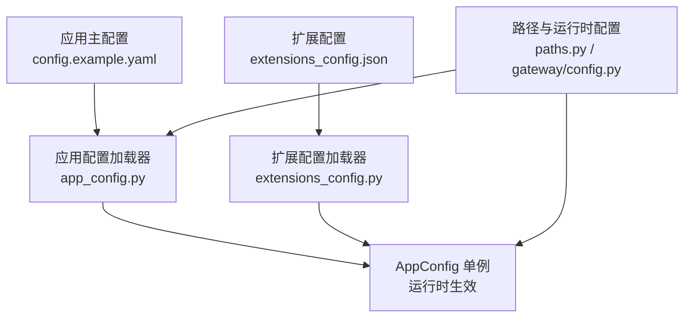
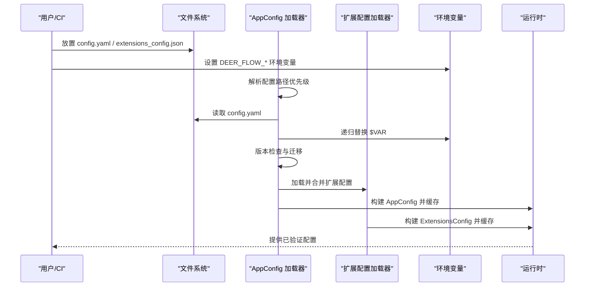
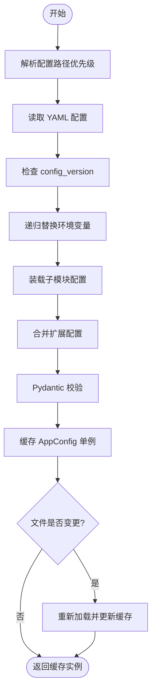
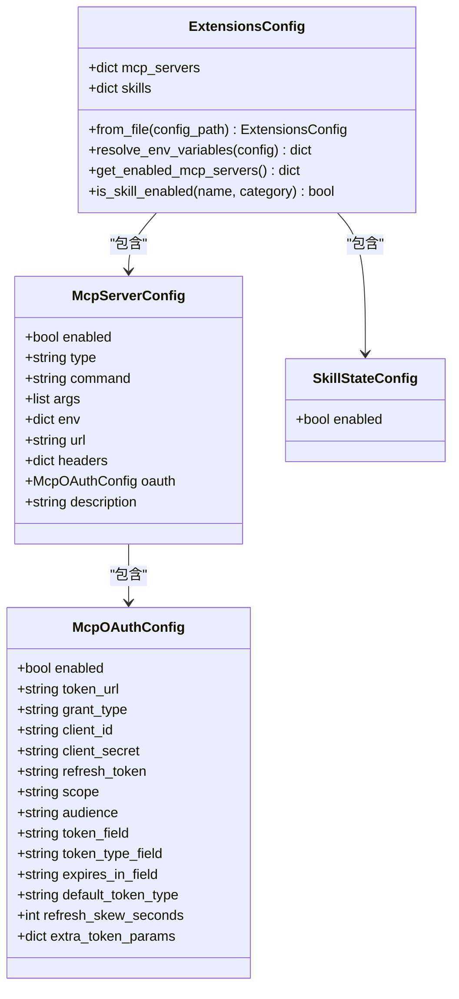
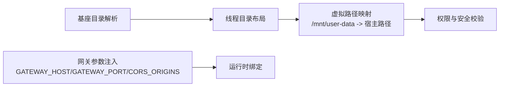
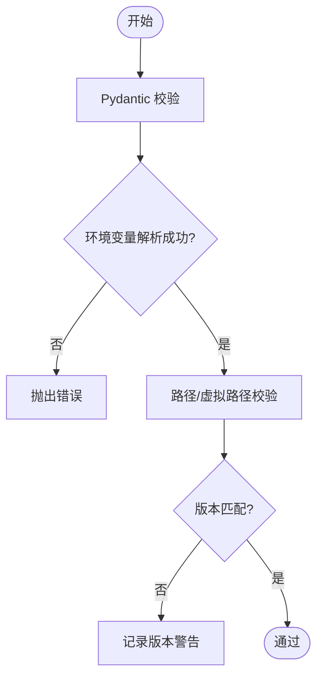
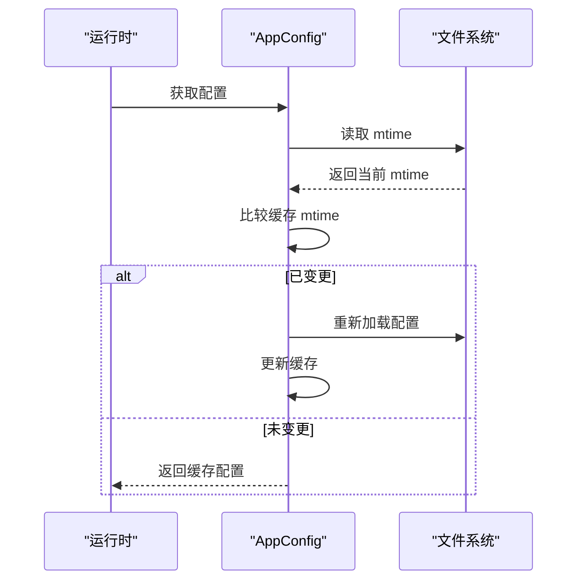
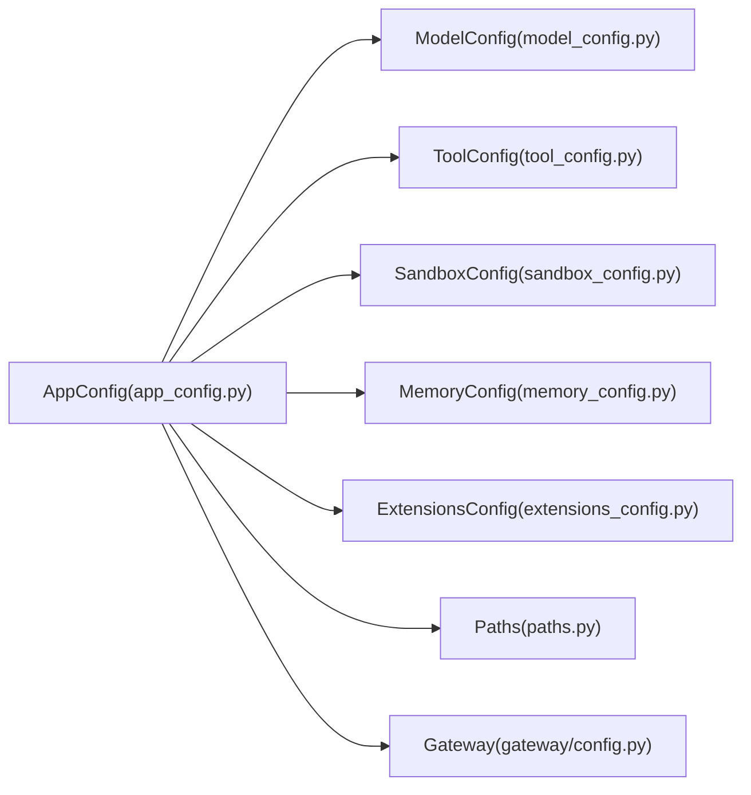

# 配置管理

<cite>
**本文引用的文件**
- [CONFIGURATION.md](file://backend/docs/CONFIGURATION.md)
- [config.example.yaml](file://config.example.yaml)
- [config-upgrade.sh](file://scripts/config-upgrade.sh)
- [app_config.py](file://backend/packages/harness/deerflow/config/app_config.py)
- [extensions_config.py](file://backend/packages/harness/deerflow/config/extensions_config.py)
- [paths.py](file://backend/packages/harness/deerflow/config/paths.py)
- [model_config.py](file://backend/packages/harness/deerflow/config/model_config.py)
- [tool_config.py](file://backend/packages/harness/deerflow/config/tool_config.py)
- [sandbox_config.py](file://backend/packages/harness/deerflow/config/sandbox_config.py)
- [memory_config.py](file://backend/packages/harness/deerflow/config/memory_config.py)
- [gateway/config.py](file://backend/app/gateway/config.py)
- [test_app_config_reload.py](file://backend/tests/test_app_config_reload.py)
- [test_config_version.py](file://backend/tests/test_config_version.py)
</cite>

## 目录
1. [简介](#简介)
2. [项目结构](#项目结构)
3. [核心组件](#核心组件)
4. [架构总览](#架构总览)
5. [详细组件分析](#详细组件分析)
6. [依赖分析](#依赖分析)
7. [性能考量](#性能考量)
8. [故障排查指南](#故障排查指南)
9. [结论](#结论)
10. [附录](#附录)

## 简介
本文件系统化梳理 DeerFlow 的配置管理体系，覆盖配置文件结构与层次、加载流程（含默认值、环境变量覆盖、版本校验）、验证机制（Schema 校验、依赖检查、兼容性验证）、热重载实现（变更检测、平滑重启、状态保持）、扩展配置支持（MCP 服务器与技能状态）、最佳实践（分层、环境隔离、安全）以及升级与向后兼容策略。

## 项目结构
DeerFlow 的配置体系由三部分构成：
- 应用主配置：位于仓库根目录的 YAML 文件，定义模型、工具、沙箱、记忆、标题生成、摘要等全局行为。
- 扩展配置：位于仓库根目录的 JSON 文件，统一管理 MCP 服务器与技能状态。
- 路径与运行时配置：路径解析、网关配置等，服务于运行期行为。

**图表来源**
- [config.example.yaml](file://config.example.yaml)
- [app_config.py](file://backend/packages/harness/deerflow/config/app_config.py)
- [extensions_config.py](file://backend/packages/harness/deerflow/config/extensions_config.py)
- [paths.py](file://backend/packages/harness/deerflow/config/paths.py)
- [gateway/config.py](file://backend/app/gateway/config.py)

**章节来源**
- [CONFIGURATION.md](file://backend/docs/CONFIGURATION.md)
- [config.example.yaml](file://config.example.yaml)

## 核心组件
- 应用配置加载器：负责解析 YAML、环境变量替换、版本检查、子模块配置装载、热重载与上下文覆盖。
- 扩展配置加载器：负责解析 JSON、环境变量替换、MCP 服务器与技能状态管理。
- 路径与运行时配置：提供统一的路径解析、线程数据目录布局、虚拟路径映射、网关参数注入。
- 模型/工具/沙箱/记忆等子配置：作为 AppConfig 的字段，承载具体能力配置。

**章节来源**
- [app_config.py](file://backend/packages/harness/deerflow/config/app_config.py)
- [extensions_config.py](file://backend/packages/harness/deerflow/config/extensions_config.py)
- [paths.py](file://backend/packages/harness/deerflow/config/paths.py)
- [model_config.py](file://backend/packages/harness/deerflow/config/model_config.py)
- [tool_config.py](file://backend/packages/harness/deerflow/config/tool_config.py)
- [sandbox_config.py](file://backend/packages/harness/deerflow/config/sandbox_config.py)
- [memory_config.py](file://backend/packages/harness/deerflow/config/memory_config.py)

## 架构总览
下图展示配置从磁盘到运行时的全链路：

**图表来源**
- [app_config.py](file://backend/packages/harness/deerflow/config/app_config.py)
- [extensions_config.py](file://backend/packages/harness/deerflow/config/extensions_config.py)
- [config.example.yaml](file://config.example.yaml)

## 详细组件分析

### 应用配置加载器（AppConfig）
- 配置路径解析优先级：显式参数 > 环境变量 > 后端默认 > 仓库根默认。
- 环境变量替换：对字符串值进行 $VAR 替换；缺失时报错。
- 版本检查：比较本地配置与示例配置的版本号，低版本发出警告。
- 子模块装载：按需装载标题、摘要、记忆、代理 API、子代理、工具搜索、护栏、断路器、检查点、流桥、ACP 等配置。
- 热重载：基于文件修改时间判断变更，自动重新加载；支持运行时上下文覆盖与栈式切换。

**图表来源**
- [app_config.py](file://backend/packages/harness/deerflow/config/app_config.py)
- [config.example.yaml](file://config.example.yaml)

**章节来源**
- [app_config.py](file://backend/packages/harness/deerflow/config/app_config.py)
- [test_app_config_reload.py](file://backend/tests/test_app_config_reload.py)
- [test_config_version.py](file://backend/tests/test_config_version.py)

### 扩展配置加载器（ExtensionsConfig）
- 扩展配置文件：支持新旧文件名（extensions_config.json 与 mcp_config.json），可指定路径或通过环境变量覆盖。
- 环境变量替换：对字符串值进行 $VAR 替换；未解析到的占位符以空串处理，避免传递原始占位符。
- MCP 服务器配置：支持 stdio/http/sse 传输类型，OAuth 注入，命令行启动参数与环境变量注入。
- 技能状态配置：按技能名映射启用/禁用，默认对公共与自定义技能启用。
- 缓存与热重载：单例缓存，支持强制重载与重置。

**图表来源**
- [extensions_config.py](file://backend/packages/harness/deerflow/config/extensions_config.py)

**章节来源**
- [extensions_config.py](file://backend/packages/harness/deerflow/config/extensions_config.py)
- [extensions_config.example.json](file://extensions_config.example.json)

### 路径与运行时配置（Paths 与网关）
- 路径解析：统一的基座目录解析顺序（构造函数参数 > 环境变量 > 仓库内默认），提供线程隔离的数据目录布局（threads/{thread_id}/user-data/{workspace,uploads,outputs}），并支持虚拟路径到宿主路径的映射与权限校验。
- 网关配置：从环境变量注入主机、端口、CORS 源，形成强约束的运行时参数。

**图表来源**
- [paths.py](file://backend/packages/harness/deerflow/config/paths.py)
- [gateway/config.py](file://backend/app/gateway/config.py)

**章节来源**
- [paths.py](file://backend/packages/harness/deerflow/config/paths.py)
- [gateway/config.py](file://backend/app/gateway/config.py)

### 配置验证与兼容性
- Schema 校验：使用 Pydantic 对各子配置类进行字段类型与范围校验。
- 依赖检查：环境变量占位符在加载前解析，缺失则报错；路径解析严格限制虚拟路径前缀与相对路径越界。
- 兼容性验证：通过 config_version 字段对比示例配置，提示升级；脚本提供文本级迁移与字段合并。

**图表来源**
- [app_config.py](file://backend/packages/harness/deerflow/config/app_config.py)
- [paths.py](file://backend/packages/harness/deerflow/config/paths.py)
- [config.example.yaml](file://config.example.yaml)

**章节来源**
- [app_config.py](file://backend/packages/harness/deerflow/config/app_config.py)
- [paths.py](file://backend/packages/harness/deerflow/config/paths.py)
- [config-upgrade.sh](file://scripts/config-upgrade.sh)

### 配置热重载实现
- 变更检测：记录配置文件路径与修改时间，若变化则触发重新加载。
- 平滑重启：通过缓存与上下文变量实现“无中断”切换；支持运行时覆盖与栈式回退。
- 状态保持：仅配置变更时刷新，业务状态不因配置热重载而丢失。

**图表来源**
- [app_config.py](file://backend/packages/harness/deerflow/config/app_config.py)

**章节来源**
- [app_config.py](file://backend/packages/harness/deerflow/config/app_config.py)
- [test_app_config_reload.py](file://backend/tests/test_app_config_reload.py)

### 扩展配置支持（MCP 服务器与技能状态）
- MCP 服务器：支持多种传输方式与 OAuth 注入，便于集成外部工具生态。
- 技能状态：按技能维度启用/禁用，公共与自定义技能默认启用。
- 运行时注入：扩展配置与应用配置合并，统一由 AppConfig 管理。

**章节来源**
- [extensions_config.py](file://backend/packages/harness/deerflow/config/extensions_config.py)
- [extensions_config.example.json](file://extensions_config.example.json)

### 配置升级与向后兼容
- 版本字段：config_version 记录配置模式演进。
- 升级脚本：备份原配置，执行文本级迁移与字段合并，最后更新版本号。
- 示例驱动：示例配置作为权威参考，确保新增字段与默认值同步。

**章节来源**
- [CONFIGURATION.md](file://backend/docs/CONFIGURATION.md)
- [config.example.yaml](file://config.example.yaml)
- [config-upgrade.sh](file://scripts/config-upgrade.sh)

## 依赖分析
- 组件耦合：AppConfig 依赖各子配置模块与扩展配置；扩展配置独立于应用配置但最终被合并。
- 外部依赖：YAML/JSON 解析、dotenv 环境变量加载、Pydantic 校验。
- 循环依赖：未见直接循环导入；路径模块被多处使用，但职责单一。

**图表来源**
- [app_config.py](file://backend/packages/harness/deerflow/config/app_config.py)
- [model_config.py](file://backend/packages/harness/deerflow/config/model_config.py)
- [tool_config.py](file://backend/packages/harness/deerflow/config/tool_config.py)
- [sandbox_config.py](file://backend/packages/harness/deerflow/config/sandbox_config.py)
- [memory_config.py](file://backend/packages/harness/deerflow/config/memory_config.py)
- [extensions_config.py](file://backend/packages/harness/deerflow/config/extensions_config.py)
- [paths.py](file://backend/packages/harness/deerflow/config/paths.py)
- [gateway/config.py](file://backend/app/gateway/config.py)

**章节来源**
- [app_config.py](file://backend/packages/harness/deerflow/config/app_config.py)
- [extensions_config.py](file://backend/packages/harness/deerflow/config/extensions_config.py)

## 性能考量
- 配置加载成本：YAML/JSON 解析与 Pydantic 校验为 O(n) 级别，通常开销较小。
- 热重载成本：仅在文件变更时触发，mtime 检查为常数时间。
- 环境变量解析：递归遍历配置树，注意避免深层嵌套导致的额外开销。
- 建议：将大型配置拆分为多个文件（如扩展配置），减少单次解析压力。

## 故障排查指南
- 配置文件未找到：确认路径解析顺序与环境变量设置；示例配置位于仓库根目录。
- 环境变量未解析：检查 $VAR 是否存在且拼写正确；缺失会直接报错。
- 版本过低：根据日志提示运行升级脚本，备份原配置后再合并。
- 虚拟路径访问异常：检查虚拟路径前缀与相对路径越界问题。
- 网关跨域问题：核对 CORS_ORIGINS 环境变量与前端地址一致。

**章节来源**
- [CONFIGURATION.md](file://backend/docs/CONFIGURATION.md)
- [app_config.py](file://backend/packages/harness/deerflow/config/app_config.py)
- [paths.py](file://backend/packages/harness/deerflow/config/paths.py)
- [gateway/config.py](file://backend/app/gateway/config.py)

## 结论
DeerFlow 的配置管理以“示例驱动 + 强校验 + 热重载 + 扩展统一”的设计实现了高可用与可维护性。通过清晰的层次结构与严格的验证机制，既保障了生产环境的稳定性，又提供了灵活的扩展能力与便捷的运维体验。

## 附录
- 最佳实践清单
  - 将 config.yaml 放置于仓库根目录，避免提交到版本库。
  - 使用环境变量存放敏感信息，避免硬编码。
  - 定期运行升级脚本，保持配置版本与示例一致。
  - 在生产环境使用容器沙箱，提升隔离与安全性。
  - 对大型配置采用扩展配置分离，降低单文件复杂度。