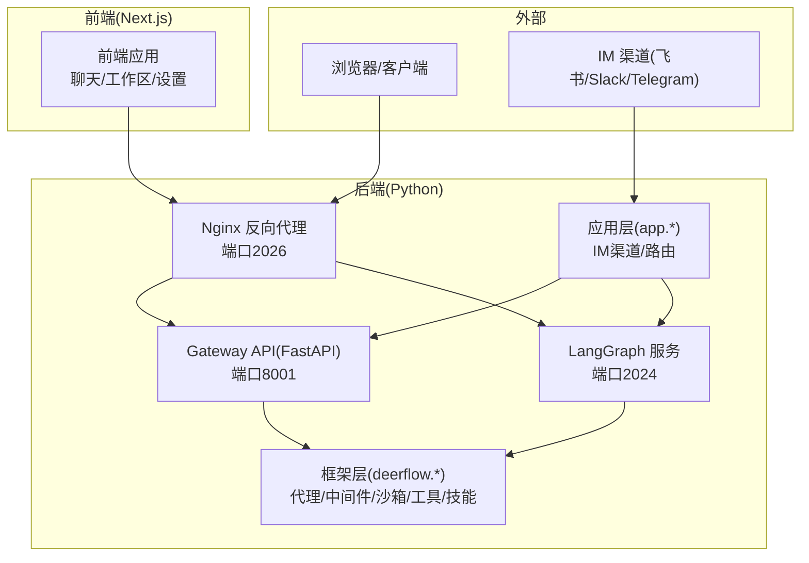
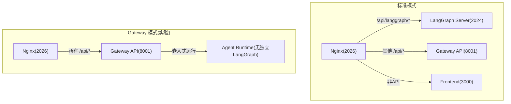
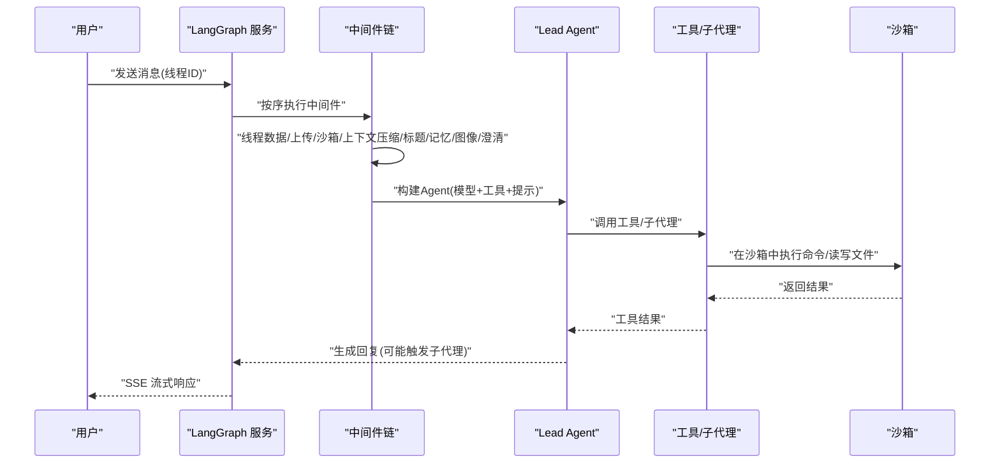
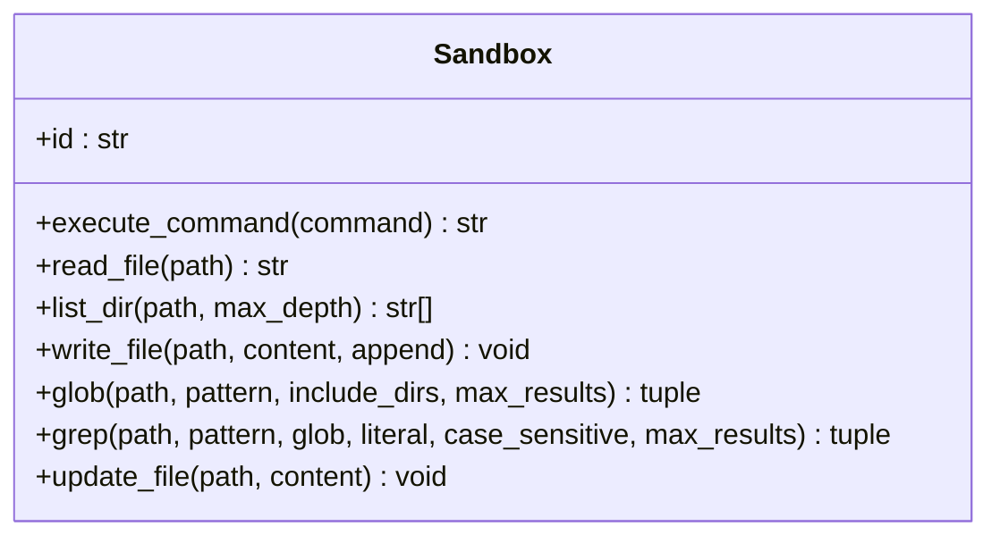
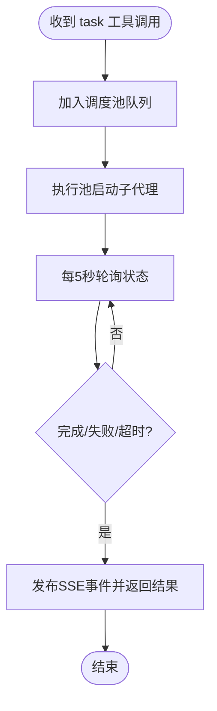
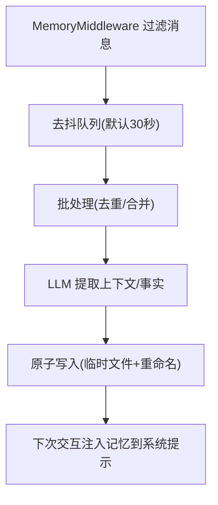
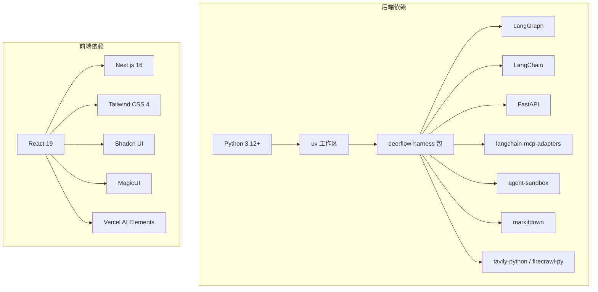

# 项目概述

<cite>
**本文引用的文件列表**
- [README.md](file://README.md)
- [backend/README.md](file://backend/README.md)
- [frontend/README.md](file://frontend/README.md)
- [backend/CLAUDE.md](file://backend/CLAUDE.md)
- [backend/docs/ARCHITECTURE.md](file://backend/docs/ARCHITECTURE.md)
- [backend/pyproject.toml](file://backend/pyproject.toml)
- [frontend/package.json](file://frontend/package.json)
- [config.example.yaml](file://config.example.yaml)
- [backend/packages/harness/deerflow/agents/lead_agent/agent.py](file://backend/packages/harness/deerflow/agents/lead_agent/agent.py)
- [backend/packages/harness/deerflow/sandbox/sandbox.py](file://backend/packages/harness/deerflow/sandbox/sandbox.py)
- [backend/packages/harness/deerflow/subagents/executor.py](file://backend/packages/harness/deerflow/subagents/executor.py)
</cite>

## 目录
1. [引言](#引言)
2. [项目结构](#项目结构)
3. [核心组件](#核心组件)
4. [架构总览](#架构总览)
5. [详细组件分析](#详细组件分析)
6. [依赖关系分析](#依赖关系分析)
7. [性能考量](#性能考量)
8. [故障排查指南](#故障排查指南)
9. [结论](#结论)
10. [附录](#附录)

## 引言
DeerFlow 是一个基于 LangGraph 的“超级代理编排器”，通过子代理、记忆与沙箱能力，实现“几乎任何任务”的自动化执行。它从 Deep Research 框架演进而来，2.0 版本进行了完全重写，采用“电池已包含、可扩展”的设计，内置文件系统、记忆、技能、沙箱感知执行与子代理规划能力，支持多模型、MCP 工具链、IM 渠道接入，并提供前端可视化工作台与嵌入式 Python 客户端。

- 项目定位：智能代理编排系统，而非仅是研究工具，而是“运行时基础设施”，让代理真正“做实事”。
- 技术基石：LangGraph（多智能体编排）、LangChain（LLM 抽象与工具体系）、FastAPI（网关 API）、Next.js（前端界面）。
- 核心能力：子代理并行分解复杂任务；持久化记忆；隔离沙箱执行；可插拔技能与工具；多平台 IM 接入；可观测性（LangSmith/Langfuse）。

**章节来源**
- [README.md:12](file://README.md#L12)
- [README.md:559](file://README.md#L559)
- [README.md:567](file://README.md#L567)

## 项目结构
仓库采用前后端分离与“应用层/框架层”分层的组织方式：
- 后端（Python）：LangGraph 服务、FastAPI 网关、IM 渠道、沙箱、工具、技能、配置等。
- 前端（Next.js）：聊天界面、工作区、设置、国际化、文档站点等。
- 共享配置：config.yaml、extensions_config.json。
- 文档与脚本：架构文档、配置说明、安装脚本、部署脚本等。

**图表来源**
- [backend/CLAUDE.md:11-15](file://backend/CLAUDE.md#L11-L15)
- [backend/CLAUDE.md:477-481](file://backend/CLAUDE.md#L477-L481)

**章节来源**
- [backend/CLAUDE.md:20-67](file://backend/CLAUDE.md#L20-L67)
- [backend/README.md:7-41](file://backend/README.md#L7-L41)

## 核心组件
- Lead Agent（主代理）：动态模型选择、中间件链、工具系统、子代理委托、系统提示注入（技能/记忆/工作目录）。
- 中间件链：线性执行的横切关注点，如线程数据初始化、上传处理、沙箱获取、上下文压缩、标题生成、记忆更新、图像注入、澄清请求拦截等。
- 沙箱系统：抽象接口 + 提供者（本地/容器），虚拟路径映射，文件读写安全策略，命令执行与搜索工具。
- 子代理系统：并发执行（最大3个），超时控制（默认15分钟），事件流（SSE），结果聚合。
- 记忆系统：LLM 驱动的持久化上下文保留，去重与批量更新，系统提示注入。
- 工具生态：内置工具、社区工具（Web 搜索/抓取/图片搜索）、MCP 工具、ACPI/AI 代理工具。
- 网关 API：模型、MCP、技能、内存、上传、线程清理、产物服务等 REST 路由。
- IM 渠道：Feishu/Slack/Telegram 等，统一通过 LangGraph Server 创建与管理线程。

**章节来源**
- [backend/README.md:46-137](file://backend/README.md#L46-L137)
- [backend/CLAUDE.md:139-179](file://backend/CLAUDE.md#L139-L179)
- [backend/CLAUDE.md:228-280](file://backend/CLAUDE.md#L228-L280)
- [backend/CLAUDE.md:249-256](file://backend/CLAUDE.md#L249-L256)
- [backend/CLAUDE.md:343-371](file://backend/CLAUDE.md#L343-L371)
- [backend/CLAUDE.md:213-226](file://backend/CLAUDE.md#L213-L226)
- [backend/CLAUDE.md:313-342](file://backend/CLAUDE.md#L313-L342)

## 架构总览
下图展示了标准模式与 Gateway 模式两种运行形态，以及请求在各组件间的流转。

**图表来源**
- [backend/CLAUDE.md:477-481](file://backend/CLAUDE.md#L477-L481)
- [backend/docs/ARCHITECTURE.md:17-36](file://backend/docs/ARCHITECTURE.md#L17-L36)

**章节来源**
- [backend/docs/ARCHITECTURE.md:5-51](file://backend/docs/ARCHITECTURE.md#L5-L51)
- [backend/CLAUDE.md:16-18](file://backend/CLAUDE.md#L16-L18)

## 详细组件分析

### Lead Agent 与中间件链
- Lead Agent 通过工厂函数创建，结合动态模型选择、中间件链、工具集与系统提示（含技能与记忆）。
- 中间件链严格顺序执行，覆盖线程数据、上传、沙箱、上下文压缩、计划模式、标题生成、记忆、图像注入、澄清拦截等。
- 运行时配置（configurable/context）支持思维模式、模型选择、计划模式、子代理开关等。

**图表来源**
- [backend/CLAUDE.md:157-179](file://backend/CLAUDE.md#L157-L179)
- [backend/CLAUDE.md:141-146](file://backend/CLAUDE.md#L141-L146)

**章节来源**
- [backend/CLAUDE.md:139-179](file://backend/CLAUDE.md#L139-L179)
- [backend/agents/lead_agent/agent.py:29-51](file://backend/packages/harness/deerflow/agents/lead_agent/agent.py#L29-L51)

### 沙箱系统
- 抽象接口定义命令执行、文件读写、目录列举、二进制更新、通配与搜索等能力。
- 提供者：本地文件系统（开发用）与容器化沙箱（生产推荐）。
- 虚拟路径映射：/mnt/user-data/{workspace,uploads,outputs} 与 /mnt/skills 映射到线程隔离目录与技能目录。
- 文件写入安全：同路径串行化（按 sandbox.id + path）避免并发冲突。
- 工具：bash、ls、read_file、write_file、str_replace（支持单次/全部替换）。

**图表来源**
- [backend/packages/harness/deerflow/sandbox/sandbox.py:6-94](file://backend/packages/harness/deerflow/sandbox/sandbox.py#L6-L94)

**章节来源**
- [backend/CLAUDE.md:228-248](file://backend/CLAUDE.md#L228-L248)
- [backend/README.md:72-83](file://backend/README.md#L72-L83)

### 子代理系统
- 并发执行：调度池与执行池各3个工作线程，最大并发3个，超时默认15分钟。
- 执行流程：task 工具 → 执行器后台线程 → 5秒轮询 → SSE 事件 → 结果返回。
- 事件类型：task_started、task_running、task_completed/task_failed/task_timed_out。
- 内置代理：general-purpose（全工具集）、bash（命令专家，仅在允许主机 bash 时暴露）。

**图表来源**
- [backend/CLAUDE.md:249-256](file://backend/CLAUDE.md#L249-L256)

**章节来源**
- [backend/CLAUDE.md:249-256](file://backend/CLAUDE.md#L249-L256)
- [backend/README.md:84-92](file://backend/README.md#L84-L92)

### 记忆系统
- 自动提取：对用户输入与最终 AI 回复进行上下文与事实抽取。
- 结构化存储：用户上下文、历史、置信度评分的事实集合。
- 去抖更新：批量更新最小化 LLM 调用频率。
- 系统提示注入：在系统提示中注入 top 事实与上下文。
- 存储：JSON 文件，按修改时间缓存失效。

**图表来源**
- [backend/CLAUDE.md:343-371](file://backend/CLAUDE.md#L343-L371)

**章节来源**
- [backend/CLAUDE.md:343-371](file://backend/CLAUDE.md#L343-L371)
- [backend/README.md:93-102](file://backend/README.md#L93-L102)

### 工具生态与 MCP
- 工具分类：沙箱工具（bash/ls/read_file/write_file/str_replace）、内置工具（present_files/ask_clarification/view_image/task)、社区工具（Tavily/Jina/Firecrawl/DuckDuckGo 图片搜索）、MCP 工具。
- MCP 支持多服务器、多传输（stdio/SSE/HTTP）、OAuth 刷新令牌自动续期。
- ACP 工具：调用外部 ACP 兼容代理（需适配器包装）。

**章节来源**
- [backend/README.md:103-112](file://backend/README.md#L103-L112)
- [backend/CLAUDE.md:257-280](file://backend/CLAUDE.md#L257-L280)
- [backend/CLAUDE.md:281-303](file://backend/CLAUDE.md#L281-L303)

### 网关 API
- 路由概览：模型、MCP、技能、内存、上传、线程清理、产物服务、建议生成等。
- 与 LangGraph 的配合：删除线程时先删 LangGraph 线程，再由网关清理本地 DeerFlow 数据。

**章节来源**
- [backend/README.md:113-131](file://backend/README.md#L113-L131)
- [backend/CLAUDE.md:209-226](file://backend/CLAUDE.md#L209-L226)

### IM 渠道
- Feishu/Slack/Telegram 通过 LangGraph SDK 与 LangGraph Server 对接，确保线程在服务端创建与管理。
- Feishu 支持卡片增量更新；Slack/Telegram 使用 runs.wait() 获取最终响应。
- 配置项：通道启用、凭证、会话默认值、用户白名单等。

**章节来源**
- [backend/CLAUDE.md:313-342](file://backend/CLAUDE.md#L313-L342)
- [README.md:362-522](file://README.md#L362-L522)

## 依赖关系分析
- 技术栈
  - 后端：LangGraph、LangChain、FastAPI、langchain-mcp-adapters、agent-sandbox、markitdown、tavily-python/firecrawl-py 等。
  - 前端：Next.js 16、React 19、Tailwind CSS 4、Shadcn UI、MagicUI、Vercel AI Elements 等。
- 语言与包管理
  - 后端：Python 3.12+，uv 工作区，deerflow-harness 包。
  - 前端：Node.js 22+，pnpm 10.26.2+。
- 运行模式
  - 标准模式：LangGraph Server + Gateway API + 前端 + Nginx（4进程）。
  - Gateway 模式：Gateway 嵌入 Agent 运行时（3进程，无独立 LangGraph Server）。

**图表来源**
- [backend/pyproject.toml:1-37](file://backend/pyproject.toml#L1-L37)
- [frontend/package.json:21-94](file://frontend/package.json#L21-L94)

**章节来源**
- [backend/pyproject.toml:1-37](file://backend/pyproject.toml#L1-L37)
- [frontend/package.json:1-119](file://frontend/package.json#L1-L119)
- [backend/CLAUDE.md:386-396](file://backend/CLAUDE.md#L386-L396)

## 性能考量
- 缓存与热加载
  - MCP 工具缓存 + 文件 mtime 失效；配置文件变更自动热加载。
  - 技能解析一次性缓存；虚拟路径翻译与文件操作优化。
- 流式传输
  - SSE 实时流式响应，降低首 token 时间，长任务进度可见。
- 上下文管理
  - 上下文压缩中间件在接近 token 限制时进行摘要，保留最近消息。
- 并发与隔离
  - 子代理并发上限与超时控制；沙箱隔离减少资源争用。
- 观测性
  - LangSmith/Langfuse 可选集成，便于调试与性能分析。

**章节来源**
- [backend/docs/ARCHITECTURE.md:427-444](file://backend/docs/ARCHITECTURE.md#L427-L444)
- [backend/docs/ARCHITECTURE.md:466-485](file://backend/docs/ARCHITECTURE.md#L466-L485)
- [backend/CLAUDE.md:466-485](file://backend/CLAUDE.md#L466-L485)

## 故障排查指南
- 环境检查
  - 后端：make check 检查 Node.js 22+/pnpm/uv/nginx 等前置条件。
  - 前端：pnpm check/lint/typecheck/format。
- 配置校验
  - make doctor 输出可操作修复建议；config.yaml/extensions_config.json 位置优先级与变量解析。
- 沙箱模式
  - 本地/容器/Provisioner 模式差异；容器镜像预拉取与端口/副本数/前缀配置。
- IM 渠道
  - Docker Compose 下通道在 gateway 容器内运行，注意服务名与环境变量覆盖。
- 安全建议
  - 默认仅在本地可信网络部署；公网部署需 IP 白名单、反向代理鉴权、网络隔离与及时更新。

**章节来源**
- [README.md:253-290](file://README.md#L253-L290)
- [frontend/README.md:13-67](file://frontend/README.md#L13-L67)
- [backend/CLAUDE.md:80-100](file://backend/CLAUDE.md#L80-L100)
- [README.md:713-737](file://README.md#L713-L737)

## 结论
DeerFlow 2.0 将“研究框架”升级为“超级代理编排器”，以 LangGraph/LangChain 为核心，结合 FastAPI 与 Next.js，构建了从模型、工具、技能到沙箱与记忆的完整闭环。其“子代理 + 记忆 + 沙箱”的组合拳，使得复杂任务得以分解、沉淀与执行；“网关 + IM 渠道”的接入层则让代理能够融入企业与个人工作流。通过可选的 LangSmith/Langfuse 观测性与严格的沙箱隔离，DeerFlow 在功能与安全之间取得平衡，既适合探索性使用，也适合生产落地。

[无需章节来源：总结性内容不直接分析具体文件]

## 附录

### 快速开始（环境与安装）
- 环境要求
  - 后端：Python 3.12+，uv，LLM API 密钥。
  - 前端：Node.js 22+，pnpm 10.26.2+。
- 安装步骤
  - 后端：复制配置模板 → 安装依赖 → 启动 LangGraph 与 Gateway。
  - 前端：安装依赖 → 复制环境变量 → 启动开发服务器。
- 运行方式
  - 根目录一键启动（Nginx + 前端 + Gateway + LangGraph）或分别启动后端服务。
  - Docker 开发/生产模式，支持镜像构建与容器编排。

**章节来源**
- [backend/README.md:140-213](file://backend/README.md#L140-L213)
- [frontend/README.md:11-67](file://frontend/README.md#L11-L67)
- [README.md:96-290](file://README.md#L96-L290)

### 配置参考
- 主配置（config.yaml）：模型、工具、沙箱、技能、标题、上下文压缩、子代理、内存等。
- 扩展配置（extensions_config.json）：MCP 服务器与技能状态。
- 环境变量：DEER_FLOW_CONFIG_PATH、DEER_FLOW_EXTENSIONS_CONFIG_PATH、各类 API Key。

**章节来源**
- [config.example.yaml:1-800](file://config.example.yaml#L1-L800)
- [backend/CLAUDE.md:180-208](file://backend/CLAUDE.md#L180-L208)

### 概念入门（面向初学者）
- 子代理：将复杂任务拆分为多个并行子任务，每个子代理专注特定领域。
- 记忆：跨会话保留用户偏好与知识，提升个性化体验。
- 沙箱：隔离执行环境，支持文件读写与命令执行，保障安全。
- 工具：内置/社区/MCP/ACPI 工具，按需加载与组合。
- 网关：提供 REST API，管理模型、MCP、技能、内存、上传、产物与线程清理。
- IM 渠道：通过机器人与消息平台对接，实现多端入口。

**章节来源**
- [README.md:569-670](file://README.md#L569-L670)
- [backend/README.md:46-137](file://backend/README.md#L46-L137)