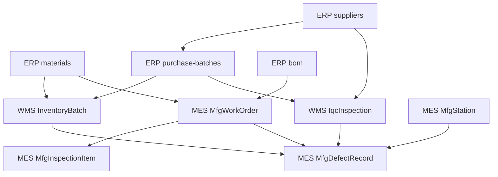

# 电控制造不良品分析 — 跨源关联图（Task 1 产出）

> 目的：明确 MES / ERP / WMS 三源数据在"不良分析"场景下的 JOIN 路径，为 `defect-analyst` Skill 的 SQL 与 API 组合模板提供基础。

## 1. 四大跨源主键

| 主键 | 语义 | 出现系统 | JOIN 用途 |
|---|---|---|---|
| `WorkOrderNo` | 工单号 | MES / ERP | 工单级成品不良 ↔ 采购/物料成本 |
| `MaterialCode` | 物料编码 | MES / ERP / WMS | 物料维度 Pareto / 供应商追溯 |
| `BatchNo` | 批次号（生产批次 & 来料批次） | MES / WMS | 批次追溯（成品 ← 原料 ← 供应商） |
| `SupplierCode` | 供应商编码 | ERP / WMS | 供应商不良排行 / IQC 合并分析 |

## 2. 关联拓扑（文字版）

```
                +----------------------+
                |        ERP (API)     |
                |  materials           |
                |  suppliers           |
                |  purchase-batches    |
                |  bom                 |
                +----------+-----------+
                           |
          MaterialCode / SupplierCode / PoNo
                           |
                           v
+---------------------+    |    +---------------------+
|     WMS (SQL)       |<---+--->|     MES (SQL)       |
|  IqcInspection      |         |  MfgWorkOrder       |
|  InventoryBatch     |         |  MfgDefectRecord    |
+----------+----------+         |  MfgInspectionItem  |
           |                    |  MfgStation         |
           |                    +----------+----------+
           |                               |
           +------------- BatchNo ---------+
                (生产批次 = 来料批次聚合后的成品批次)
```

## 3. Mermaid 图（架构/关联）



## 4. 典型分析场景的 JOIN 路径

### 4.1 供应商维度不良率（IQC + 过程不良合并）
1. `erp-api-mcp.list_suppliers` 拿供应商列表（维度字典）。
2. `sqlserver-wms.execute_sql` 按 `SupplierCode + InspectAt` 聚合 IQC 不良。
3. `sqlserver-mes.execute_sql` 通过 `BatchNo` 回链到 `MfgDefectRecord`，聚合过程不良。
4. Skill 侧以 `SupplierCode` 为主键合并两路结果，输出 `DPPM_IQC`、`DPPM_过程`、`合计 DPPM`。

### 4.2 Pareto — Top 不良工位 / Top 不良物料
1. `sqlserver-mes.execute_sql`：`MfgDefectRecord JOIN MfgStation ON StationCode`。
2. 按 `DefectCode` 或 `StationCode` 聚合 `SUM(DefectQty)`。
3. Skill 侧按 80/20 截断，交给 `chart-visualization` 画 Pareto。

### 4.3 批次追溯（成品批次 → 原料批次 → 供应商）
1. 输入：成品 `BatchNo`。
2. `sqlserver-mes.execute_sql`：`MfgDefectRecord WHERE BatchNo = :x` 得到工单 + 不良。
3. `sqlserver-mes.execute_sql`：`MfgWorkOrder WHERE WorkOrderNo = :wo` 得成品 `MaterialCode`。
4. `erp-api-mcp.get_bom(parentCode=MaterialCode)` 得子件清单。
5. `sqlserver-wms.execute_sql`：`InventoryBatch WHERE MaterialCode IN (:children) AND OutQty > 0 AND CreatedAt < :wo_start` 得到被消耗的来料批次候选。
6. `sqlserver-wms.execute_sql`：`IqcInspection WHERE BatchNo IN (:候选)` 取 IQC 结果与 `SupplierCode`。
7. Skill 输出：成品批次 ← 工单 ← N 条来料批次 ← 供应商矩阵。

### 4.4 工单 FPY（一次合格率）
```
FPY = (OutputQty - SUM(DefectQty)) / OutputQty
```
- 仅需 `MES.MfgWorkOrder` + `MES.MfgDefectRecord`，不跨源。

### 4.5 不良率 DPPM 趋势
```
DPPM = SUM(DefectQty) * 1,000,000 / SUM(OutputQty)
```
- 按 `DATEPART(WEEK | MONTH, InspectAt)` 分组。

## 5. JOIN 反模式（禁止）

- 禁止使用 `SELECT *` 跨源拉全量。
- 禁止用 `MaterialCode LIKE '%...%'` 做关联（精确匹配，必要时走 Skill 侧归一后再 JOIN）。
- 禁止无时间窗的 `MfgDefectRecord` 查询；默认 90 天内。
- 禁止把 WMS `IqcInspection` 与 MES `MfgDefectRecord` 直接 `JOIN ON BatchNo` 不校验 `MaterialCode`，避免同批次号不同物料的脏连接。

## 6. 数据链路完整性核验（上线前）

1. 选 1 个近 30 天"三源俱全"的成品批次，人工核对第 4.3 节全链路。
2. 选 1 个 Top 不良代码，验证 `MfgStation.ProcessType` 维度聚合值与 QA 日报对齐。
3. 选 1 家 A 级供应商，验证 IQC 不良率与供应商 QBR 口径一致。

## 7. 变更记录

| 日期 | 版本 | 修改人 | 说明 |
|---|---|---|---|
| TBD | v0.1 | TBD | 初始设计稿 |
